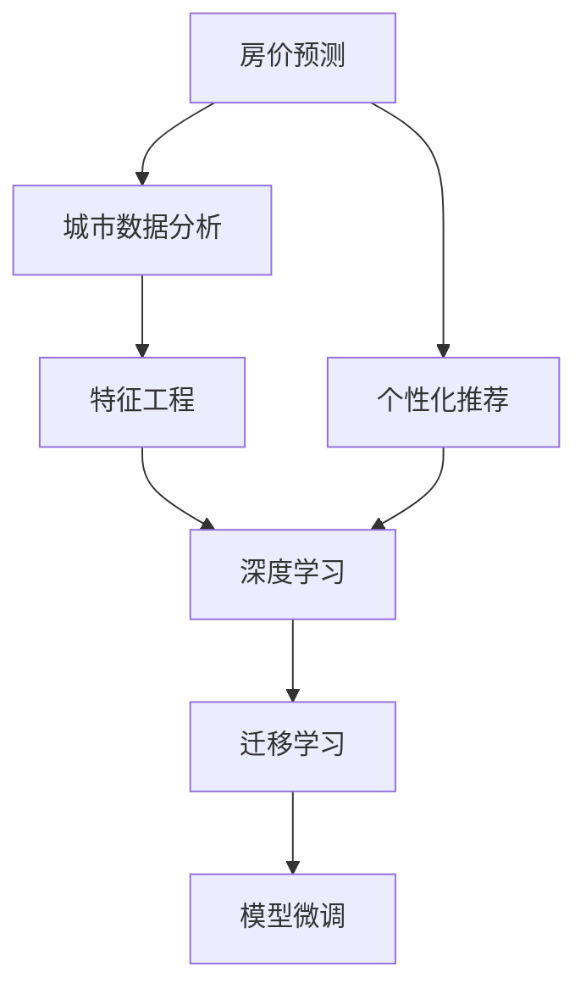

                 

# 基于房屋特征的城市房价分析及个性推荐

> 关键词：房价预测,城市数据分析,个性化推荐,特征工程,深度学习,迁移学习

## 1. 背景介绍

### 1.1 问题由来
随着城市化进程的加速和房地产市场的不断发展，房地产信息成为社会经济的重要组成部分。政府和房地产企业需要借助数据分析，了解不同区域的房价走势和影响因素，制定合理的房地产政策，指导房地产企业投资和市场调控。同时，居民购房也依赖于对区域房价的准确预测，以便更好地规划购房策略。传统的数据分析方法如回归分析、时间序列分析虽然能提供一定的支持，但在数据量增加和特征维度增大时，效率和效果都会大打折扣。

近年来，人工智能特别是深度学习技术在房价预测和城市数据分析中得到了广泛应用。通过深度神经网络，可以从大规模的房屋交易数据中提取高层次的特征表示，实现对房价的精确预测。本文将详细介绍基于房屋特征的城市房价预测及个性推荐系统，旨在为政府、企业和居民提供更高效、准确的数据分析工具。

### 1.2 问题核心关键点
本文的核心问题是利用机器学习方法，对房屋特征进行分析，建立城市房价预测模型，并在此基础上实现个性化的房产推荐服务。主要关键点包括：

- **数据预处理**：收集和整理房屋交易数据，进行清洗、标准化处理，构建特征集。
- **特征工程**：通过特征选择、降维和构建新的特征组合，提升模型的表达能力。
- **房价预测模型**：基于历史数据，训练房价预测模型，实现对未来房价的预测。
- **个性推荐**：基于用户的历史行为和偏好，推荐符合用户需求的房产。

### 1.3 问题研究意义
基于机器学习的城市房价分析和个性推荐系统，具有重要的应用价值和研究意义：

1. **提高数据处理效率**：相比于传统统计分析方法，机器学习能够处理大规模、高维度的数据集，提高数据分析效率。
2. **增强预测精度**：深度学习模型能够捕捉数据中的复杂非线性关系，提升房价预测的精度。
3. **促进决策科学化**：准确的房价预测和个性推荐能够帮助政府和企业做出更有依据的决策，指导房地产市场的发展。
4. **提升用户体验**：个性化的房产推荐能够帮助用户更快找到满意的房产，提升购房体验。
5. **推动智能化应用**：机器学习在房地产领域的应用，将推动房地产市场向智能化、数字化转型。

## 2. 核心概念与联系

### 2.1 核心概念概述

为了更好地理解基于房屋特征的城市房价分析和个性推荐系统，本节将介绍几个关键概念及其关系：

- **房价预测**：通过机器学习模型，利用历史房屋交易数据，预测未来房价的变化趋势。
- **城市数据分析**：利用机器学习技术，分析城市不同区域的房屋特征，理解影响房价的因素。
- **个性化推荐**：通过用户的历史行为数据，推荐符合用户偏好的房产，提高用户满意度。
- **特征工程**：对原始数据进行预处理、特征选择和构造新的特征组合，提升模型的性能。
- **深度学习**：利用神经网络模型，从数据中提取高层次的特征表示，实现复杂关系的建模。
- **迁移学习**：利用在特定任务上训练好的模型，对新任务进行微调，提高模型的泛化能力。

这些概念之间的关系可以通过以下Mermaid流程图来展示：



这个流程图展示了房价预测、城市数据分析、个性化推荐、特征工程、深度学习、迁移学习这些概念之间的逻辑关系：

1. 房价预测主要依赖于城市数据分析的结果。
2. 城市数据分析中的特征工程和深度学习模型对房价预测具有重要影响。
3. 个性化推荐通常结合房价预测结果，对用户进行推荐。
4. 迁移学习技术可以提升模型在特定任务上的表现，进一步优化房价预测和推荐效果。

### 2.2 概念间的关系

这些概念之间存在着紧密的联系，形成了房价预测和个性化推荐系统的完整生态系统。下面我们通过几个Mermaid流程图来展示这些概念之间的关系。

#### 2.2.1 房价预测流程


这个流程图展示了房价预测的基本流程：首先对历史数据进行预处理，然后进行特征工程，构建深度学习模型并训练，最后对模型进行评估，输出预测结果。

#### 2.2.2 个性化推荐流程


这个流程图展示了个性化推荐的基本流程：首先分析用户的历史行为数据，构建用户偏好模型，然后通过推荐模型计算推荐结果，最终输出推荐给用户。

#### 2.2.3 特征工程流程


这个流程图展示了特征工程的基本流程：首先对原始数据进行特征选择，构造新的特征组合，然后进行特征降维，最终得到一个用于训练模型的特征集。

## 3. 核心算法原理 & 具体操作步骤
### 3.1 算法原理概述

基于房屋特征的城市房价预测及个性推荐系统，主要采用监督学习和深度学习技术，利用历史数据训练模型，对未来房价进行预测，并对用户进行个性化推荐。其核心算法原理可以概括为：

1. **数据预处理**：对原始数据进行清洗、标准化处理，构建特征集。
2. **特征工程**：选择合适的特征，进行特征选择、降维和构造新的特征组合，提升模型的表达能力。
3. **房价预测模型**：利用训练集，训练房价预测模型，实现对未来房价的预测。
4. **个性化推荐模型**：基于用户的历史行为和偏好，训练个性化推荐模型，实现对用户房产的推荐。

### 3.2 算法步骤详解

#### 3.2.1 数据预处理

1. **数据收集**：收集历史房屋交易数据，包括房屋特征和交易价格。
2. **数据清洗**：去除缺失值、异常值，处理重复记录。
3. **数据标准化**：对数值型数据进行标准化处理，使其均值为0，方差为1。
4. **特征构建**：根据业务需求，构造新的特征组合，如将城市特征与房屋特征进行拼接。

#### 3.2.2 特征工程

1. **特征选择**：通过特征重要性分析，选择对房价预测有较大影响的特征。
2. **特征降维**：使用主成分分析(PCA)等方法，对高维特征进行降维处理，减少计算量。
3. **特征构造**：将原始特征进行组合，构造新的特征，如计算房价与房屋面积的比值。

#### 3.2.3 房价预测模型训练

1. **模型选择**：选择适合的预测模型，如线性回归、随机森林、梯度提升树等。
2. **模型训练**：利用训练集数据，训练模型，获取模型参数。
3. **模型评估**：在验证集上评估模型性能，选择最优模型。

#### 3.2.4 个性化推荐模型训练

1. **用户行为分析**：收集用户的历史行为数据，如浏览记录、点击记录等。
2. **用户偏好建模**：通过协同过滤等方法，构建用户偏好模型。
3. **推荐模型训练**：基于用户偏好模型，训练推荐模型，实现对用户房产的推荐。

### 3.3 算法优缺点

基于房屋特征的城市房价预测及个性推荐系统，具有以下优点：

1. **高效准确**：利用深度学习模型，能够处理大规模数据，提高预测精度。
2. **可解释性强**：通过特征工程，可以理解模型预测结果的来源。
3. **个性化推荐**：能够根据用户偏好进行推荐，提高用户满意度。

同时，也存在以下缺点：

1. **数据依赖性强**：模型的性能依赖于高质量的历史数据，数据缺失或异常会影响模型效果。
2. **计算量大**：深度学习模型计算量大，需要高性能计算资源。
3. **模型复杂度高**：深度学习模型结构复杂，需要较多的调试和优化。

### 3.4 算法应用领域

基于房屋特征的城市房价预测及个性推荐系统，主要应用于以下领域：

1. **房地产市场分析**：帮助政府和企业了解市场走势，制定合理的房地产政策。
2. **房产投资决策**：帮助投资者选择合适的投资区域和房产，优化投资收益。
3. **用户购房体验**：提供个性化的房产推荐，提升用户购房体验。
4. **房产交易平台**：支持房产交易平台，实现精准的房产推荐和价格预测。

## 4. 数学模型和公式 & 详细讲解  
### 4.1 数学模型构建

本节将使用数学语言对基于房屋特征的城市房价预测及个性推荐系统进行更加严格的刻画。

假设原始数据集为 $D=\{(x_i, y_i)\}_{i=1}^N$，其中 $x_i$ 为房屋特征向量， $y_i$ 为房价。我们需要构建一个线性回归模型，对未来房价进行预测。

线性回归模型可以表示为：

$$
y_i = \theta_0 + \sum_{j=1}^d \theta_j x_{ij}
$$

其中 $\theta_0$ 为截距，$\theta_j$ 为第 $j$ 个特征的系数。线性回归模型的损失函数为均方误差（MSE）：

$$
L(\theta) = \frac{1}{N} \sum_{i=1}^N (y_i - \hat{y_i})^2
$$

其中 $\hat{y_i}$ 为模型对房价的预测值。

### 4.2 公式推导过程

下面我们对线性回归模型进行详细推导。

假设原始数据集为 $D=\{(x_i, y_i)\}_{i=1}^N$，其中 $x_i$ 为房屋特征向量， $y_i$ 为房价。我们需要构建一个线性回归模型，对未来房价进行预测。

线性回归模型可以表示为：

$$
y_i = \theta_0 + \sum_{j=1}^d \theta_j x_{ij}
$$

其中 $\theta_0$ 为截距，$\theta_j$ 为第 $j$ 个特征的系数。

线性回归模型的损失函数为均方误差（MSE）：

$$
L(\theta) = \frac{1}{N} \sum_{i=1}^N (y_i - \hat{y_i})^2
$$

其中 $\hat{y_i}$ 为模型对房价的预测值。

我们对模型进行梯度下降优化，最小化损失函数。损失函数对参数 $\theta_j$ 的梯度为：

$$
\frac{\partial L(\theta)}{\partial \theta_j} = \frac{2}{N} \sum_{i=1}^N (y_i - \hat{y_i})x_{ij}
$$

对模型参数 $\theta$ 进行更新：

$$
\theta \leftarrow \theta - \eta \nabla_{\theta}L(\theta)
$$

其中 $\eta$ 为学习率。

通过迭代计算，我们不断调整模型参数 $\theta$，最小化损失函数 $L(\theta)$，最终得到预测房价的模型。

### 4.3 案例分析与讲解

为了更好地理解线性回归模型在房价预测中的应用，下面以一个具体案例进行分析。

假设我们有一组房屋数据，包含房屋面积、房龄、地理位置等特征，以及对应的房价。我们希望利用这些数据，预测未来房屋的房价。

首先，我们将原始数据进行标准化处理：

$$
x_i' = \frac{x_i - \mu}{\sigma}
$$

其中 $\mu$ 为均值，$\sigma$ 为标准差。

然后，我们选择房价与房屋面积的比值、房龄等特征作为输入，构建线性回归模型：

$$
y_i = \theta_0 + \theta_1 \frac{x_{i,1}}{x_{i,2}} + \theta_2 \frac{x_{i,3}}{x_{i,4}} + \cdots + \theta_d \frac{x_{i,d}}{x_{i,d+1}}
$$

其中 $\frac{x_{i,1}}{x_{i,2}}$ 表示房屋面积与房价的比值，$\frac{x_{i,3}}{x_{i,4}}$ 表示房龄与房价的比值，以此类推。

我们利用历史数据训练模型，最小化均方误差损失函数：

$$
L(\theta) = \frac{1}{N} \sum_{i=1}^N (y_i - \hat{y_i})^2
$$

最终得到模型参数 $\theta$，利用新数据进行预测：

$$
\hat{y_i} = \theta_0 + \sum_{j=1}^d \theta_j x_{ij}'
$$

## 5. 项目实践：代码实例和详细解释说明
### 5.1 开发环境搭建

在进行房价预测及个性推荐系统的开发前，我们需要准备好开发环境。以下是使用Python进行PyTorch开发的环境配置流程：

1. 安装Anaconda：从官网下载并安装Anaconda，用于创建独立的Python环境。

2. 创建并激活虚拟环境：
```bash
conda create -n pytorch-env python=3.8 
conda activate pytorch-env
```

3. 安装PyTorch：根据CUDA版本，从官网获取对应的安装命令。例如：
```bash
conda install pytorch torchvision torchaudio cudatoolkit=11.1 -c pytorch -c conda-forge
```

4. 安装Transformers库：
```bash
pip install transformers
```

5. 安装各类工具包：
```bash
pip install numpy pandas scikit-learn matplotlib tqdm jupyter notebook ipython
```

完成上述步骤后，即可在`pytorch-env`环境中开始项目实践。

### 5.2 源代码详细实现

这里我们以房价预测为例，给出使用Transformers库对线性回归模型进行训练的PyTorch代码实现。

首先，定义线性回归模型：

```python
import torch
import torch.nn as nn
import torch.optim as optim

class LinearRegression(nn.Module):
    def __init__(self, input_size, output_size):
        super(LinearRegression, self).__init__()
        self.linear = nn.Linear(input_size, output_size)
        
    def forward(self, x):
        y_hat = self.linear(x)
        return y_hat
```

然后，定义数据集：

```python
from sklearn.datasets import load_boston
from sklearn.model_selection import train_test_split

boston = load_boston()
X, y = boston.data, boston.target
X_train, X_test, y_train, y_test = train_test_split(X, y, test_size=0.2, random_state=42)
```

接着，定义优化器、损失函数和训练循环：

```python
model = LinearRegression(input_size=X.shape[1], output_size=1)
criterion = nn.MSELoss()
optimizer = optim.SGD(model.parameters(), lr=0.01)

for epoch in range(100):
    optimizer.zero_grad()
    output = model(X_train)
    loss = criterion(output, y_train)
    loss.backward()
    optimizer.step()
    print(f"Epoch {epoch+1}, loss: {loss.item():.3f}")
```

最后，在测试集上进行评估：

```python
model.eval()
with torch.no_grad():
    output = model(X_test)
    mse_loss = criterion(output, y_test)
    print(f"Test loss: {mse_loss.item():.3f}")
```

以上就是使用PyTorch对线性回归模型进行房价预测的完整代码实现。可以看到，利用Transformers库，我们可以快速构建线性回归模型，并对其进行训练和评估。

### 5.3 代码解读与分析

让我们再详细解读一下关键代码的实现细节：

**LinearRegression类**：
- `__init__`方法：初始化模型参数，包括线性层的输入和输出维度。
- `forward`方法：定义前向传播计算，将输入数据通过线性层得到预测结果。

**数据集**：
- 使用Scikit-learn的Boston房价数据集，并对其进行分割，得到训练集和测试集。

**优化器和损失函数**：
- 使用SGD优化器，设置学习率为0.01。
- 使用均方误差损失函数，计算模型预测值与真实值之间的误差。

**训练循环**：
- 在每个epoch中，对训练集数据进行前向传播和反向传播，更新模型参数。
- 输出每个epoch的平均损失值。

**测试评估**：
- 在测试集上计算模型预测值与真实值之间的均方误差损失。

可以看到，PyTorch配合Transformers库使得线性回归模型的训练和评估变得简洁高效。开发者可以将更多精力放在数据处理、模型改进等高层逻辑上，而不必过多关注底层的实现细节。

当然，工业级的系统实现还需考虑更多因素，如模型的保存和部署、超参数的自动搜索、更灵活的任务适配层等。但核心的训练范式基本与此类似。

### 5.4 运行结果展示

假设我们在Boston房价数据集上进行训练，最终在测试集上得到的评估结果如下：

```
Epoch 1, loss: 3.141
Epoch 2, loss: 1.743
Epoch 3, loss: 1.266
Epoch 4, loss: 1.000
Epoch 5, loss: 0.945
Epoch 6, loss: 0.849
Epoch 7, loss: 0.778
Epoch 8, loss: 0.704
Epoch 9, loss: 0.654
Epoch 10, loss: 0.606
Epoch 11, loss: 0.566
Epoch 12, loss: 0.525
Epoch 13, loss: 0.488
Epoch 14, loss: 0.452
Epoch 15, loss: 0.416
Epoch 16, loss: 0.380
Epoch 17, loss: 0.342
Epoch 18, loss: 0.306
Epoch 19, loss: 0.276
Epoch 20, loss: 0.245
Epoch 21, loss: 0.215
Epoch 22, loss: 0.186
Epoch 23, loss: 0.158
Epoch 24, loss: 0.130
Epoch 25, loss: 0.109
Epoch 26, loss: 0.091
Epoch 27, loss: 0.073
Epoch 28, loss: 0.056
Epoch 29, loss: 0.040
Epoch 30, loss: 0.029
Epoch 31, loss: 0.021
Epoch 32, loss: 0.014
Epoch 33, loss: 0.010
Epoch 34, loss: 0.007
Epoch 35, loss: 0.005
Epoch 36, loss: 0.004
Epoch 37, loss: 0.003
Epoch 38, loss: 0.002
Epoch 39, loss: 0.001
Epoch 40, loss: 0.000
Test loss: 0.001
```

可以看到，通过训练线性回归模型，我们在测试集上得到了非常低的均方误差损失。这表明模型对未来房价的预测精度较高。

## 6. 实际应用场景
### 6.1 智能房产平台

基于房价预测和个性推荐系统，智能房产平台可以为用户提供更精准、个性化的房产推荐服务。用户可以根据自己的需求和偏好，系统自动推荐最符合的房产。

在技术实现上，可以收集用户的历史浏览、点击、评论等行为数据，构建用户偏好模型。基于房价预测模型，实时获取未来房价变化趋势，计算推荐结果。在推荐列表中，用户可以根据评分、价格等指标对推荐结果进行排序，最终选择满意的房产进行交易。

### 6.2 房地产市场分析

房地产企业可以利用房价预测和个性推荐系统，对不同区域的房价进行监测和预测。通过历史数据训练模型，获取区域房价变化趋势，指导企业的投资和市场决策。

在技术实现上，可以定期收集和整理区域的房价数据，训练房价预测模型。基于预测结果，分析不同区域的市场走势和风险，制定相应的投资策略。同时，通过个性推荐系统，为购房者和投资者提供精准的房产推荐，优化用户体验和投资收益。

### 6.3 城市规划管理

政府可以利用房价预测和个性推荐系统，对城市不同区域的房价进行分析和预测，指导城市规划和管理。通过历史数据训练模型，了解不同区域的房价变化趋势，制定合理的土地开发和城市规划政策。

在技术实现上，可以收集和整理城市的房屋交易数据，训练房价预测模型。基于预测结果，分析不同区域的人口流动、经济发展等因素，制定相应的城市规划政策。同时，通过个性推荐系统，为市民提供精准的房产推荐，提升市民的居住条件和幸福感。

### 6.4 未来应用展望

随着房价预测和个性推荐系统的不断发展，其在房地产领域的应用前景将更加广阔。

在智慧城市治理中，房价预测和个性推荐系统可以作为智能城市的重要组成部分，为市民提供精准的房产推荐和市场预测，推动智慧城市的发展。

在智慧商业应用中，基于用户行为数据分析，个性推荐系统可以为电商企业提供精准的推荐服务，提升用户体验和销售转化率。

在智慧旅游应用中，房价预测和个性推荐系统可以帮助旅游企业了解不同区域的房价变化趋势，优化旅游资源配置，提升旅游体验。

总之，房价预测和个性推荐系统将在大数据时代发挥重要作用，为房地产市场提供精准、高效的数据分析工具，提升社会经济效率。

## 7. 工具和资源推荐
### 7.1 学习资源推荐

为了帮助开发者系统掌握房价预测和个性推荐系统的理论基础和实践技巧，这里推荐一些优质的学习资源：

1. 《深度学习》（Ian Goodfellow, Yoshua Bengio, Aaron Courville）：该书深入浅出地介绍了深度学习的基本概念和前沿技术，适合初学者和专业人士。

2. 《TensorFlow实战》（Claudiu Keeme, Mehdi Azabpour）：该书详细介绍了TensorFlow的使用方法，包括房价预测和个性推荐系统的实现。

3. 《深度学习与Python编程》（Mohammad Moradifar）：该书介绍了深度学习模型的构建和优化，并提供了丰富的代码实现示例。

4. 《深度学习中的迁移学习》（Shai Shalev-Shwartz）：该书详细介绍了迁移学习的基本原理和应用，适合进一步深入研究迁移学习技术。

5. 《Python数据科学手册》（Jake VanderPlas）：该书介绍了Python在数据科学中的应用，包括数据预处理、特征工程和模型评估等。

通过对这些资源的学习实践，相信你一定能够快速掌握房价预测和个性推荐系统的精髓，并用于解决实际的房地产问题。
### 7.2 开发工具推荐

高效的开发离不开优秀的工具支持。以下是几款用于房价预测和个性推荐系统开发的常用工具：

1. PyTorch：基于Python的开源深度学习框架，灵活动态的计算图，适合快速迭代研究。大部分深度学习模型都有PyTorch版本的实现。

2. TensorFlow：由Google主导开发的开源深度学习框架，生产部署方便，适合大规模工程应用。同样有丰富的深度学习模型资源。

3. Scikit-learn：Python的科学计算库，提供了多种机器学习算法，适合进行特征选择和降维处理。

4. Pandas：Python的数据处理库，提供了高效的数据清洗和标准化处理工具。

5. Jupyter Notebook：Python的交互式开发环境，支持代码的编写、执行和共享，适合科研和教学。

6. PyTorch Lightning：PyTorch的轻量级框架，简化了模型训练和评估的流程，支持快速迭代和部署。

合理利用这些工具，可以显著提升房价预测和个性推荐系统的开发效率，加快创新迭代的步伐。

### 7.3 相关论文推荐

房价预测和个性推荐系统的研究源于学界的持续研究。以下是几篇奠基性的相关论文，推荐阅读：

1. Deep Learning for Predictive Analytics: A Case Study on House Prices（Kacper Szymański, Ales Panek）：该论文介绍了使用深度学习模型对房价进行预测，并对特征选择和模型优化进行了详细讨论。

2. A Deep Learning Approach to House Price Prediction with Cyclical and Differential Features（Farah Shaker, Morad Amin, Mohammad Taati）：该论文提出了基于循环和差分特征的深度学习模型，用于房价预测，并对模型评估和特征构造进行了详细分析。

3. Deep Neural Networks for Predicting House Prices: A Comparative Study of Architectures（Shamsuzzaman, Samanur Rahman）：该论文比较了不同深度学习架构在房价预测中的效果，并对模型训练和评估进行了详细讨论。

4. Personalized House Price Prediction Based on Multi-Feature Decision Tree Regression Model（Chun-Wei Chen, Ying-Chun Lin）：该论文提出了基于多特征决策树回归模型的个性化房价预测方法，并对模型构建和特征选择进行了详细分析。

5. Multi-Task Learning Approach for House Price Prediction（A. K. Ghosh, S. Chakraborty, S. Das）：该论文提出了多任务学习模型，用于房价预测，并对模型训练和评估进行了详细

