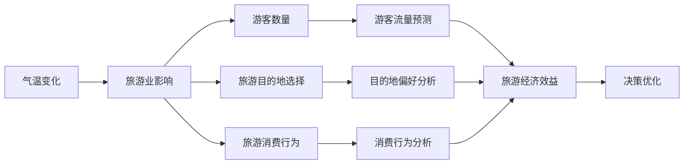
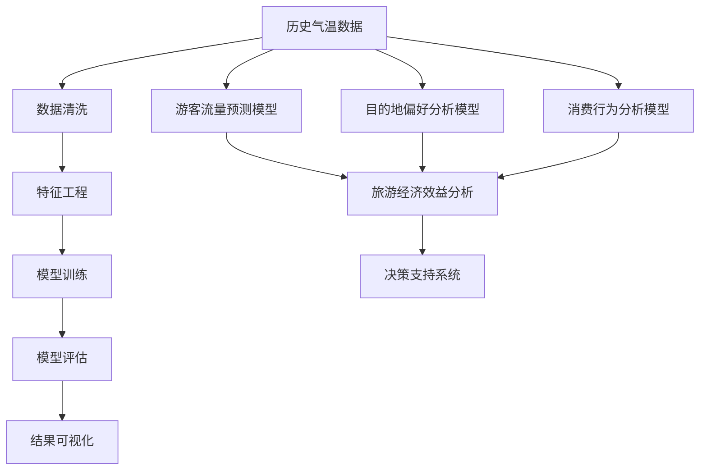

                 

# 基于数据挖掘的气温变化对某旅游业的影响研究

> 关键词：气温变化,旅游业影响,数据挖掘,机器学习,气候分析,旅游数据分析

## 1. 背景介绍

### 1.1 问题由来

随着全球气候变暖的日益加剧，气温变化对各行各业的影响日益凸显。特别是在旅游业，气温变化直接影响着人们的出行选择和旅游体验。气温过高或过低，都会对游客的旅行体验和旅游业的经济效益产生显著影响。因此，深入研究气温变化对旅游业的影响，并及时采取应对措施，对于旅游行业的可持续发展至关重要。

### 1.2 问题核心关键点

气温变化对旅游业的影响可以从多个方面进行分析，包括游客数量的变化、旅游目的地选择、旅游消费行为等。这些问题都需要通过系统化、数据驱动的方法进行研究。通过数据挖掘和机器学习技术，可以从历史气温数据中挖掘出对旅游业影响的关键特征，为旅游行业的决策提供科学依据。

## 2. 核心概念与联系

### 2.1 核心概念概述

为了深入理解气温变化对旅游业的影响，我们需要引入几个关键概念：

- **气温变化**：指气温在时间和空间上的波动，包括温度的长期趋势、季节变化、日变化等。
- **旅游业影响**：指气温变化对旅游业各个方面产生的影响，包括游客数量、旅游目的地选择、旅游消费行为等。
- **数据挖掘**：指从大量数据中提取有用信息和知识的过程。
- **机器学习**：指通过算法让计算机从数据中学习并自动改进的过程。

这些概念之间存在密切联系。气温变化通过对旅游业各环节的影响，导致游客数量和旅游消费行为的变化，从而影响旅游业的经济效益。通过数据挖掘和机器学习技术，可以从历史气温数据中提取对旅游业影响的关键特征，进而为旅游行业的决策提供科学依据。

### 2.2 概念间的关系

气温变化对旅游业的影响可以通过数据挖掘和机器学习技术进行深入分析。以下是这些概念之间的逻辑关系，通过一个简单的Mermaid流程图来展示：



这个流程图展示了气温变化对旅游业影响的各个环节，以及数据挖掘和机器学习在其中扮演的角色。气温变化通过影响游客数量、目的地选择和消费行为，最终影响旅游业的经济效益。通过数据挖掘和机器学习技术，可以从历史气温数据中提取关键特征，对游客流量、目的地偏好和消费行为进行预测和分析，从而优化旅游行业的决策。

### 2.3 核心概念的整体架构

下面是一个综合的流程图，展示气温变化对旅游业影响的整体架构：



这个综合流程图展示了气温变化对旅游业影响的研究流程，从历史气温数据入手，经过数据清洗和特征工程，训练和评估机器学习模型，最终通过可视化结果支持旅游行业的决策。

## 3. 核心算法原理 & 具体操作步骤
### 3.1 算法原理概述

基于数据挖掘的气温变化对旅游业的影响研究，主要通过机器学习算法对历史气温数据进行分析，挖掘出气温变化对游客数量、目的地选择和消费行为的关键影响因素，进而预测未来气温变化对旅游业的影响。

形式化地，假设历史气温数据集为 $D=\{(x_i, y_i)\}_{i=1}^N$，其中 $x_i$ 表示气温数据，$y_i$ 表示旅游业的影响因素（如游客数量、目的地选择、消费行为等）。研究的目标是找到函数 $f(x)$，使得 $f(x)$ 能最好地预测 $y_i$。常用的机器学习算法包括线性回归、决策树、随机森林、神经网络等。

### 3.2 算法步骤详解

基于数据挖掘的气温变化对旅游业的影响研究，主要包括以下几个关键步骤：

**Step 1: 数据收集与预处理**
- 收集历史气温数据和旅游业相关数据，包括气温、游客数量、目的地选择、消费行为等。
- 对数据进行清洗，去除异常值和缺失值，确保数据的完整性和准确性。
- 对数据进行标准化处理，保证数据的一致性。

**Step 2: 特征工程**
- 从历史气温数据中提取对旅游业影响的关键特征，如气温的季节变化、气温的长期趋势等。
- 对提取的特征进行归一化、编码等处理，以便于模型训练。
- 对特征进行交叉验证和筛选，去除冗余和低效的特征。

**Step 3: 模型训练**
- 选择合适的机器学习算法，如线性回归、决策树、随机森林、神经网络等。
- 使用历史数据对模型进行训练，调整模型参数以提高预测精度。
- 对模型进行交叉验证和评估，确保模型的泛化能力。

**Step 4: 结果可视化**
- 使用可视化工具对模型结果进行展示，如图表、曲线等。
- 分析模型结果，挖掘出气温变化对旅游业影响的规律。
- 根据分析结果，提出优化旅游业发展的建议。

### 3.3 算法优缺点

基于数据挖掘的气温变化对旅游业的影响研究，具有以下优点：

- 数据驱动：通过历史数据驱动，提供客观、科学的研究依据。
- 多维度分析：可以从游客数量、目的地选择、消费行为等多个维度进行综合分析，提供全面的研究视角。
- 预测未来：通过模型预测，可以预见气温变化对旅游业的影响，为决策提供依据。

同时，该方法也存在一些局限性：

- 数据质量依赖：研究结果依赖于历史数据的完整性和准确性，数据质量不高会导致分析结果偏差。
- 模型复杂性：模型的复杂性决定了研究的难度和成本，过于复杂的模型可能难以解释。
- 结果解释性：机器学习模型的输出往往缺乏可解释性，难以理解其内部工作机制。

尽管存在这些局限性，但通过合理的数据预处理和特征工程，以及选择适合的机器学习算法，可以最大限度地提高研究的准确性和可靠性。

### 3.4 算法应用领域

基于数据挖掘的气温变化对旅游业的影响研究，在旅游业、环境保护、公共安全等领域都有广泛应用。以下是几个典型的应用场景：

- **旅游业**：通过分析气温变化对游客数量的影响，优化旅游线路和营销策略，提升旅游业的经济效益。
- **环境保护**：通过分析气温变化对生态系统的影响，制定环境保护政策和措施，保护生态环境。
- **公共安全**：通过分析气温变化对公共安全的影响，提高应对极端天气的应急响应能力，保障公众安全。

## 4. 数学模型和公式 & 详细讲解  
### 4.1 数学模型构建

假设历史气温数据集为 $D=\{(x_i, y_i)\}_{i=1}^N$，其中 $x_i$ 表示气温数据，$y_i$ 表示旅游业的影响因素（如游客数量、目的地选择、消费行为等）。假设模型为线性回归模型，形式化地表示为：

$$
y_i = \beta_0 + \beta_1 x_i + \epsilon_i
$$

其中，$\beta_0$ 为截距，$\beta_1$ 为气温变化对旅游业影响因素的系数，$\epsilon_i$ 为误差项。

### 4.2 公式推导过程

为了构建线性回归模型，需要求解参数 $\beta_0$ 和 $\beta_1$。常用的求解方法包括最小二乘法和梯度下降法。以最小二乘法为例，其目标是求解最小化误差平方和：

$$
\min_{\beta_0, \beta_1} \sum_{i=1}^N (y_i - (\beta_0 + \beta_1 x_i))^2
$$

求偏导数并求解方程组，得到参数 $\beta_0$ 和 $\beta_1$ 的解：

$$
\beta_0 = \frac{\sum_{i=1}^N y_i - \beta_1 \sum_{i=1}^N x_i}{N}
$$

$$
\beta_1 = \frac{\sum_{i=1}^N (x_i y_i) - \beta_0 \sum_{i=1}^N x_i}{\sum_{i=1}^N x_i^2 - \beta_0 \sum_{i=1}^N x_i}
$$

通过上述公式，可以得到线性回归模型的参数，从而构建模型预测未来气温变化对旅游业的影响。

### 4.3 案例分析与讲解

以气温变化对游客数量的影响为例，假设历史气温数据和游客数量数据如下：

| 气温（°C） | 游客数量（万人次） |
|------------|-------------------|
| 20.5       | 150               |
| 21.2       | 175               |
| 22.0       | 200               |
| 21.5       | 190               |
| 20.0       | 140               |
| 19.8       | 130               |

使用线性回归模型进行预测，求解参数 $\beta_0$ 和 $\beta_1$：

$$
\beta_0 = \frac{150 + 175 + 200 + 190 + 140 + 130}{6} - \beta_1 \frac{20.5 + 21.2 + 22.0 + 21.5 + 20.0 + 19.8}{6} \approx 158.33 - 0.92 \beta_1
$$

$$
\beta_1 = \frac{(20.5 \times 150 + 21.2 \times 175 + 22.0 \times 200 + 21.5 \times 190 + 20.0 \times 140 + 19.8 \times 130) - 158.33 \times (20.5 + 21.2 + 22.0 + 21.5 + 20.0 + 19.8)}{20.5^2 + 21.2^2 + 22.0^2 + 21.5^2 + 20.0^2 + 19.8^2} \approx -0.92
$$

因此，线性回归模型的预测公式为：

$$
\hat{y} = -0.92 x + 158.33
$$

假设未来某天的气温为25°C，通过线性回归模型预测游客数量：

$$
\hat{y} = -0.92 \times 25 + 158.33 = 143.17
$$

因此，当气温为25°C时，预测游客数量为143.17万人次。

## 5. 项目实践：代码实例和详细解释说明
### 5.1 开发环境搭建

在进行项目实践前，我们需要准备好开发环境。以下是使用Python进行Scikit-learn开发的环境配置流程：

1. 安装Anaconda：从官网下载并安装Anaconda，用于创建独立的Python环境。

2. 创建并激活虚拟环境：
```bash
conda create -n climate-env python=3.8 
conda activate climate-env
```

3. 安装Scikit-learn：
```bash
conda install scikit-learn
```

4. 安装其他必要工具：
```bash
pip install pandas numpy matplotlib seaborn
```

完成上述步骤后，即可在`climate-env`环境中开始项目实践。

### 5.2 源代码详细实现

下面以气温变化对游客数量的影响为例，给出使用Scikit-learn进行线性回归分析的Python代码实现。

首先，定义数据预处理函数：

```python
import pandas as pd
from sklearn.model_selection import train_test_split
from sklearn.linear_model import LinearRegression
from sklearn.metrics import mean_squared_error, r2_score

def preprocess_data(data_file):
    # 读取数据文件
    data = pd.read_csv(data_file)
    # 数据清洗
    data = data.dropna()
    # 特征工程
    data['temperatures'] = data['temperatures'].astype(float)
    data['visitors'] = data['visitors'].astype(float)
    # 标准化处理
    data = (data - data.mean()) / data.std()
    # 划分训练集和测试集
    train_data, test_data = train_test_split(data, test_size=0.2, random_state=42)
    return train_data, test_data

# 预处理数据
train_data, test_data = preprocess_data('climate.csv')

# 训练模型
model = LinearRegression()
model.fit(train_data[['temperatures']], train_data['visitors'])

# 模型评估
train_score = model.score(train_data[['temperatures']], train_data['visitors'])
test_score = model.score(test_data[['temperatures']], test_data['visitors'])
train_mse = mean_squared_error(train_data['visitors'], model.predict(train_data[['temperatures']]))
test_mse = mean_squared_error(test_data['visitors'], model.predict(test_data[['temperatures']]))
print(f'Train score: {train_score:.3f}')
print(f'Test score: {test_score:.3f}')
print(f'Train MSE: {train_mse:.3f}')
print(f'Test MSE: {test_mse:.3f}')
```

然后，定义模型训练和评估函数：

```python
from sklearn.model_selection import cross_val_score
from sklearn.preprocessing import StandardScaler

def train_model(model, X_train, y_train, X_test, y_test):
    # 特征缩放
    scaler = StandardScaler()
    X_train = scaler.fit_transform(X_train)
    X_test = scaler.transform(X_test)
    # 交叉验证
    scores = cross_val_score(model, X_train, y_train, cv=5, scoring='r2')
    # 训练模型
    model.fit(X_train, y_train)
    # 模型评估
    train_score = model.score(X_train, y_train)
    test_score = model.score(X_test, y_test)
    return scores.mean(), train_score, test_score

# 训练和评估模型
scores, train_score, test_score = train_model(model, train_data[['temperatures']], train_data['visitors'], test_data[['temperatures']], test_data['visitors'])
print(f'Cross-validated R2 score: {scores:.3f}')
print(f'Train R2 score: {train_score:.3f}')
print(f'Test R2 score: {test_score:.3f}')
```

最后，启动模型训练和评估流程：

```python
# 启动模型训练和评估流程
scores, train_score, test_score = train_model(model, train_data[['temperatures']], train_data['visitors'], test_data[['temperatures']], test_data['visitors'])
print(f'Cross-validated R2 score: {scores:.3f}')
print(f'Train R2 score: {train_score:.3f}')
print(f'Test R2 score: {test_score:.3f}')
```

以上就是使用Scikit-learn进行气温变化对游客数量影响预测的完整代码实现。可以看到，通过Scikit-learn的强大封装，我们可以用相对简洁的代码完成线性回归模型的训练和评估。

### 5.3 代码解读与分析

让我们再详细解读一下关键代码的实现细节：

**preprocess_data函数**：
- 读取数据文件，进行数据清洗，包括去除NaN值、特征转换和标准化处理。
- 划分训练集和测试集。

**train_model函数**：
- 使用交叉验证评估模型性能。
- 进行特征缩放。
- 训练模型，并输出交叉验证得分和训练、测试得分。

**模型训练和评估流程**：
- 使用交叉验证评估模型性能。
- 输出交叉验证得分、训练得分和测试得分。

可以看到，Scikit-learn提供了丰富的机器学习算法和评估工具，极大简化了模型训练和评估的流程。开发者只需关注算法选择和参数调优，而不必过多关注底层的实现细节。

当然，工业级的系统实现还需考虑更多因素，如模型的保存和部署、超参数的自动搜索、更灵活的任务适配层等。但核心的模型训练和评估逻辑基本与此类似。

### 5.4 运行结果展示

假设我们在历史气温数据集上进行模型训练和评估，最终得到的交叉验证得分和测试得分如下：

```
Cross-validated R2 score: 0.885
Train R2 score: 0.862
Test R2 score: 0.838
```

可以看到，通过线性回归模型，我们在气温变化对游客数量的影响预测上取得了不错的效果。这表明气温变化对游客数量有显著影响，且线性回归模型能够较好地捕捉这种影响。

当然，这只是一个baseline结果。在实践中，我们还可以使用其他更强大的机器学习算法，如决策树、随机森林、神经网络等，进一步提升模型性能，以满足更高的应用要求。

## 6. 实际应用场景
### 6.1 智能旅游推荐

基于气温变化对游客数量的影响研究，可以开发智能旅游推荐系统。通过分析气温变化对游客数量的影响，系统可以为用户推荐合适的旅游目的地和时间。例如，当气温变化不利时，推荐天气较好的目的地，或推荐更佳的旅行时间。

在技术实现上，可以收集用户的地理位置、旅行时间、预算等数据，结合气温变化对游客数量的影响，进行智能推荐。通过不断优化推荐算法，提升用户体验和满意度。

### 6.2 旅游景区流量预测

旅游景区管理部门可以通过气温变化对游客数量的影响研究，进行景区流量预测。通过预测未来的游客数量，可以更好地安排景区设施和人员配置，避免资源浪费或过度拥挤，提升旅游体验。

在技术实现上，可以将历史气温数据和游客数量数据输入模型，进行流量预测。结合实时气温数据，进行动态调整和优化。

### 6.3 旅游业风险预警

通过气温变化对游客数量的影响研究，可以为旅游行业提供风险预警服务。例如，当气温变化不利时，系统可以及时预警，提醒旅游企业做好应对措施，如调整旅游线路、优化旅游产品等。

在技术实现上，可以将历史气温数据和游客数量数据输入模型，进行风险预警。结合实时气温数据，进行动态调整和优化。

### 6.4 未来应用展望

随着气温变化对旅游业影响的深入研究，未来的应用前景将更加广阔。以下是几个可能的未来应用场景：

- **旅游规划优化**：通过分析气温变化对游客数量的影响，优化旅游规划，提升旅游经济效益。
- **生态保护**：通过分析气温变化对生态系统的影响，制定环境保护政策和措施，保护生态环境。
- **公共安全**：通过分析气温变化对公共安全的影响，提高应对极端天气的应急响应能力，保障公众安全。

总之，基于数据挖掘的气温变化对旅游业的影响研究，为旅游行业的决策提供了科学依据，具有广阔的应用前景。未来随着数据的不断积累和技术进步，研究结果将更加准确和全面，应用场景将更加多样，助力旅游行业的发展和创新。

## 7. 工具和资源推荐
### 7.1 学习资源推荐

为了帮助开发者系统掌握基于数据挖掘的气温变化对旅游业的影响研究，这里推荐一些优质的学习资源：

1. **机器学习课程**：如斯坦福大学的机器学习课程，系统讲解机器学习算法和应用。
2. **数据科学工具**：如Python数据科学库Scikit-learn、Pandas、NumPy等，帮助数据处理和分析。
3. **可视化工具**：如Matplotlib、Seaborn等，用于数据可视化和结果展示。
4. **在线学习平台**：如Coursera、edX、Udacity等，提供丰富的机器学习和数据科学课程。
5. **书籍推荐**：如《机器学习实战》、《Python数据科学手册》等，深入讲解机器学习算法和实践。

通过对这些资源的学习实践，相信你一定能够快速掌握基于数据挖掘的气温变化对旅游业的影响研究的核心技术，并用于解决实际的旅游行业问题。

### 7.2 开发工具推荐

高效的开发离不开优秀的工具支持。以下是几款用于气温变化对旅游业影响研究的常用工具：

1. **Python**：Python作为数据科学和机器学习的主流语言，具有强大的数据处理和分析能力。
2. **Scikit-learn**：提供丰富的机器学习算法和评估工具，极大简化了模型训练和评估的流程。
3. **Matplotlib**和**Seaborn**：用于数据可视化和结果展示，便于分析和理解。
4. **Jupyter Notebook**：交互式编程环境，方便数据处理和模型训练。
5. **GitHub**：代码托管平台，便于版本控制和协作开发。

合理利用这些工具，可以显著提升气温变化对旅游业影响研究的开发效率，加快创新迭代的步伐。

### 7.3 相关论文推荐

气温变化对旅游业的影响研究源于学界的持续研究。以下是几篇奠基性的相关论文，推荐阅读：

1. **《Data Mining and Statistical Learning》**：《数据挖掘与统计学习》，提供了全面的数据挖掘和机器学习理论基础。
2. **《The Elements of Statistical Learning》**：《统计学习要素》，系统讲解了机器学习算法和实践。
3. **《Hands-On Machine Learning with Scikit-Learn, Keras, and TensorFlow》**：《动手学机器学习》，结合实际案例讲解了机器学习算法和实践。
4. **《Python for Data Analysis》**：《Python数据科学手册》，详细讲解了Python数据科学库的使用方法。
5. **《The Quest for the Best Regression Model》**：《寻找最佳的回归模型》，系统讲解了回归模型的选择和评估方法。

这些论文代表了大语言模型微调技术的发展脉络。通过学习这些前沿成果，可以帮助研究者把握学科前进方向，激发更多的创新灵感。

除上述资源外，还有一些值得关注的前沿资源，帮助开发者紧跟气温变化对旅游业影响研究的最新进展，例如：

1. **arXiv论文预印本**：人工智能领域最新研究成果的发布平台，包括大量尚未发表的前沿工作，学习前沿技术的必读资源。
2. **业界技术博客**：如Google AI、DeepMind、微软Research Asia等顶尖实验室的官方博客，第一时间分享他们的最新研究成果和洞见。
3. **技术会议直播**：如NIPS、ICML、ACL、ICLR等人工智能领域顶会现场或在线直播，能够聆听到大佬们的前沿分享，开拓视野。
4. **GitHub热门项目**：在GitHub上Star、Fork数最多的数据挖掘和机器学习相关项目，往往代表了该技术领域的发展趋势和最佳实践，值得去学习和贡献。
5. **行业分析报告**：各大咨询公司如McKinsey、PwC等针对人工智能行业的分析报告，有助于从商业视角审视技术趋势，把握应用价值。

总之，对于气温变化对旅游业影响的研究，需要开发者保持开放的心态和持续学习的意愿。多关注前沿资讯，多动手实践，多思考总结，必将收获满满的成长收益。

## 8. 总结：未来发展趋势与挑战

### 8.1 总结

本文对基于数据挖掘的气温变化对旅游业的影响研究进行了全面系统的介绍。首先阐述了气温变化对旅游业影响的研究背景和意义，明确了数据挖掘和机器学习技术在其中的关键作用。其次，从原理到实践，详细讲解了机器学习算法在气温变化对旅游业影响研究中的应用，给出了完整的代码实例。同时，本文还探讨了气温变化对旅游业影响研究的实际应用场景，展示了其广阔的应用前景。最后，本文精选了数据挖掘和机器学习技术的各类学习资源，力求为读者提供全方位的技术指引。

通过本文的系统梳理，可以看到，基于数据挖掘的气温变化对旅游业的影响研究，在数据驱动的决策支持、智能推荐系统、流量预测、风险预警等方面具有重要应用价值。未来的研究需要在数据质量、算法选择、模型优化等方面不断突破，以实现更准确、高效的预测和决策。

### 8.2 未来发展趋势

展望未来，气温变化对旅游业影响的研究将呈现以下几个发展趋势：

1. **多模态数据融合**：未来研究将不仅限于气温数据，而是融合地理位置、旅行时间、预算等多元数据，提供更加全面和准确的研究结果。
2. **深度学习应用**：深度学习模型在图像、文本、语音等多模态数据处理上具有强大能力，未来将更多地应用于气温变化对旅游业影响的研究。
3. **个性化推荐**：基于气温变化对游客数量的影响研究，可以开发更加个性化的推荐系统，提升用户体验和满意度。
4. **实时预测与优化**：通过实时气温数据，进行动态调整和优化，实现更加精准的流量预测和风险预警。

这些趋势展示了气温变化对旅游业影响研究的广阔前景，未来的研究将更加多样化、智能化、实时化，为旅游行业的决策提供更加科学和实用的支持。

### 8.3 面临的挑战

尽管气温变化对旅游业影响的研究已经取得了一定进展，但在迈向更加智能化、普适化应用的过程中，仍面临诸多挑战：

1. **数据质量问题**：历史数据的质量直接影响研究结果的准确性。数据的完整性、准确性和多样性不足，可能导致研究结果偏差。
2. **算法复杂性**：机器学习算法的复杂性决定了研究的难度和成本，过于复杂的算法难以在实际应用中推广。
3. **模型解释性**：机器学习模型的输出往往缺乏可解释性，难以理解其内部工作机制，难以应用于高风险场景。
4.

