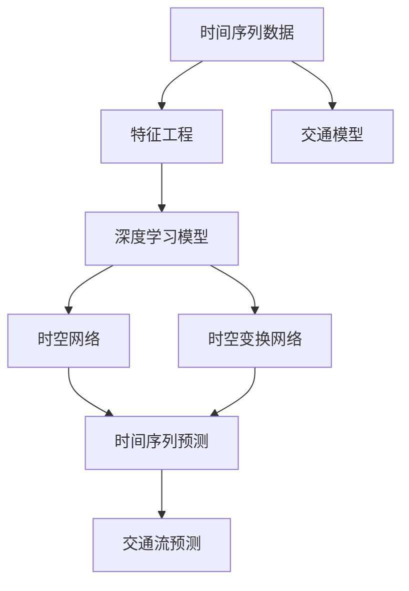
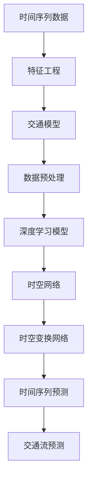

                 

# 基于机器学习的短时交通流预测算法的研究与实现

> 关键词：机器学习, 短时交通流预测, 时间序列分析, 交通模型, 深度学习, 神经网络, 时空网络, 时空变换网络

## 1. 背景介绍

### 1.1 问题由来

近年来，随着城市交通的日益复杂和智能化，如何有效地预测和管理交通流量已成为国内外研究的热点问题。短时交通流预测作为其中重要的一环，能够为交通管理提供实时、准确的交通流量信息，有助于提升交通系统的运行效率，改善市民出行体验。然而，传统的基于规则的交通流预测方法存在诸多局限性，难以应对实时交通流数据的复杂性和动态性。因此，基于机器学习的短时交通流预测方法逐渐成为研究的焦点。

### 1.2 问题核心关键点

短时交通流预测的核心问题在于如何从历史交通流数据中挖掘出时间序列特征，并结合其他相关因素（如天气、节假日等），构建出预测模型，从而实现对未来短时交通流的精确预测。主要挑战包括以下几个方面：

1. 数据稀疏与噪声问题：交通流量数据通常存在时间序列上的稀疏性和噪声干扰。
2. 多源数据融合问题：如何有效整合多源交通数据，提取有效的时空信息。
3. 模型复杂性与泛化能力：模型需要既能捕捉短期动态变化，又能反映长期趋势。
4. 实时性与可解释性：预测模型需要在实时数据输入的情况下快速输出预测结果，同时保持结果的可解释性。

### 1.3 问题研究意义

短时交通流预测对于提升交通系统管理水平、优化出行路线、减少交通拥堵具有重要意义。通过精确的交通流预测，可以：

1. 实时调度交通信号灯，提高道路通行效率。
2. 优化公共交通线路，缓解城市交通压力。
3. 提供出行建议，提升市民出行体验。
4. 辅助应急响应，提升灾害管理能力。

本文旨在深入探讨基于机器学习的短时交通流预测算法，结合最新的技术进展，提出一种高效、准确且可解释的短时交通流预测模型，为交通管理提供有力支持。

## 2. 核心概念与联系

### 2.1 核心概念概述

在讨论短时交通流预测的算法前，首先需理解以下关键概念：

- **机器学习**：一种通过数据驱动的方法，使得计算机可以从经验中学习，从而提高预测和决策能力。
- **时间序列分析**：用于分析时间序列数据的统计方法，能够揭示数据背后的规律和趋势。
- **交通模型**：模拟交通流动态的数学模型，包括微观和宏观两种类型。
- **深度学习**：一种基于人工神经网络的机器学习技术，能够处理大规模、高维度的数据，捕捉非线性关系。
- **时空网络（Spatio-Temporal Network）**：结合空间和时间的特征，用于处理时空数据的一种神经网络结构。
- **时空变换网络（Spatio-Temporal Transformer Network）**：一种结合自注意力机制的时间序列预测网络。

这些概念通过以下Mermaid流程图联系起来，展示了大语言模型微调的整体架构：



这个流程图展示了大语言模型微调的过程，从原始数据经过特征工程、模型训练到时间序列预测，最终实现交通流预测。

### 2.2 概念间的关系

这些关键概念之间存在着紧密的联系，共同构成了短时交通流预测的技术框架：

1. **时间序列分析与机器学习**：时间序列分析为机器学习提供数据处理和特征提取的工具，而机器学习则通过数据驱动的方法，挖掘出时间序列数据中的规律和趋势。
2. **交通模型与深度学习**：交通模型为深度学习提供理论基础和模拟数据，深度学习则能够处理复杂的交通数据，捕捉非线性关系。
3. **时空网络与时空变换网络**：时空网络结合了空间和时间的特征，而时空变换网络则通过自注意力机制，进一步优化时间序列的预测。
4. **交通流预测**：最终的目标，即通过以上方法，实现对短时交通流的预测。

### 2.3 核心概念的整体架构

通过上述概念的结合，我们可以构建出短时交通流预测的完整架构，如以下示意图：



这个架构展示了数据处理、模型训练、时空网络与时空变换网络训练以及最终交通流预测的全过程。

## 3. 核心算法原理 & 具体操作步骤

### 3.1 算法原理概述

基于机器学习的短时交通流预测算法，主要通过时间序列分析和深度学习技术，结合交通模型，实现对短时交通流的预测。具体流程如下：

1. **数据收集与预处理**：收集历史交通流数据、天气、节假日等相关信息，进行数据清洗和标准化处理。
2. **特征工程**：设计合适的特征，包括时间序列特征、空间特征、天气特征等。
3. **模型训练**：采用深度学习模型，如时空网络、时空变换网络等，进行训练。
4. **时间序列预测**：利用训练好的模型，对未来时间点的交通流进行预测。
5. **交通流预测**：结合其他交通模型，对预测结果进行后处理，得到最终的交通流预测结果。

### 3.2 算法步骤详解

以下是基于机器学习的短时交通流预测算法的详细步骤：

1. **数据收集与预处理**
    - 收集历史交通流数据，包括速度、流量、密度等。
    - 收集天气数据，如温度、湿度、风速等。
    - 收集节假日、重大活动等信息。
    - 对数据进行清洗和标准化处理，去除噪声和异常值。

2. **特征工程**
    - 设计时间特征，如小时、星期几、月度等。
    - 设计空间特征，如道路类型、路段长度、交叉口类型等。
    - 设计天气特征，如温度、湿度、风速等。
    - 设计时间-空间特征，如时间-路段交叉组合等。

3. **模型训练**
    - 采用时空网络（Spatio-Temporal Network），构建深度学习模型。
    - 采用时空变换网络（Spatio-Temporal Transformer Network），进一步优化时间序列预测。
    - 训练模型，采用均方误差（MSE）等损失函数。

4. **时间序列预测**
    - 使用训练好的模型，对未来时间点的交通流进行预测。
    - 结合自注意力机制，捕捉时间序列中的重要特征。

5. **交通流预测**
    - 结合其他交通模型，如线性回归模型、卡尔曼滤波器等，对预测结果进行后处理。
    - 输出最终的交通流预测结果，作为交通管理决策的依据。

### 3.3 算法优缺点

**优点**：
- **高效性**：深度学习模型能够处理大规模、高维度的数据，快速进行时间序列预测。
- **准确性**：结合时空网络与时空变换网络，能够捕捉短期动态变化和长期趋势。
- **可解释性**：时空网络与时空变换网络具有良好的可解释性，便于理解和调试。

**缺点**：
- **数据依赖**：模型训练需要大量的历史数据，数据稀疏与噪声问题仍需解决。
- **计算复杂**：深度学习模型需要较长的训练时间和计算资源。
- **模型复杂**：时空网络与时空变换网络结构复杂，难以直观理解。

### 3.4 算法应用领域

基于机器学习的短时交通流预测算法，主要应用于以下领域：

1. **智能交通系统**：实时监控交通流，优化交通信号灯和交通流控制。
2. **公共交通系统**：优化公交线路，提升公共交通效率。
3. **应急响应系统**：辅助灾害管理，快速响应交通事件。
4. **出行服务系统**：提供实时出行建议，改善市民出行体验。
5. **城市规划系统**：辅助城市规划，合理分配交通资源。

## 4. 数学模型和公式 & 详细讲解 & 举例说明

### 4.1 数学模型构建

短时交通流预测的数学模型主要基于时间序列分析和深度学习技术，结合交通模型构建。以下是一个简化的数学模型构建流程：

1. **时间序列模型**
    - 定义时间序列 $Y_t$，其中 $Y_t$ 表示时间 $t$ 的交通流数据。
    - 假设时间序列 $Y_t$ 遵循ARIMA模型，即：
        $$
        Y_t = \phi(L) Y_{t-1} + \theta(L) \epsilon_t + \mu_t
        $$
        其中 $\phi(L)$ 和 $\theta(L)$ 是滞后算子，$\epsilon_t$ 是随机误差项，$\mu_t$ 是均值。

2. **深度学习模型**
    - 采用时空网络（Spatio-Temporal Network），定义模型结构为：
        $$
        H_t = \sigma(W_h Y_{t-1} + U_h X_t + \mathbf{b}_h)
        $$
        其中 $H_t$ 是模型隐藏层输出，$W_h$ 和 $U_h$ 是权重矩阵，$\sigma$ 是非线性激活函数，$\mathbf{b}_h$ 是偏置向量。

3. **时空变换网络**
    - 采用时空变换网络（Spatio-Temporal Transformer Network），定义模型结构为：
        $$
        Y_t = \sum_{i=1}^I \alpha_i H_{t-i} + \epsilon_t
        $$
        其中 $\alpha_i$ 是自注意力权重，$I$ 是注意力机制窗口大小，$\epsilon_t$ 是随机误差项。

### 4.2 公式推导过程

以下是时间序列模型、深度学习模型和时空变换网络的详细推导过程：

1. **时间序列模型**
    - 假设时间序列 $Y_t$ 遵循ARIMA模型，定义模型为：
        $$
        Y_t = \phi(L) Y_{t-1} + \theta(L) \epsilon_t + \mu_t
        $$
        其中 $\phi(L)$ 和 $\theta(L)$ 是滞后算子，$\epsilon_t$ 是随机误差项，$\mu_t$ 是均值。
    - 对时间序列进行一阶差分，得到差分序列 $DY_t$，满足：
        $$
        DY_t = Y_t - Y_{t-1}
        $$
    - 定义新序列 $X_t$，满足：
        $$
        X_t = [Y_t, Y_{t-1}, Y_{t-2}, \ldots]
        $$
    - 定义时间序列模型为：
        $$
        X_t = \Phi LX_{t-1} + \Theta L\epsilon_t + \mu_t
        $$

2. **深度学习模型**
    - 采用时空网络（Spatio-Temporal Network），定义模型结构为：
        $$
        H_t = \sigma(W_h Y_{t-1} + U_h X_t + \mathbf{b}_h)
        $$
        其中 $H_t$ 是模型隐藏层输出，$W_h$ 和 $U_h$ 是权重矩阵，$\sigma$ 是非线性激活函数，$\mathbf{b}_h$ 是偏置向量。
    - 对 $H_t$ 进行时间平均，得到时间序列预测模型：
        $$
        \hat{Y}_t = \hat{W}_h \hat{H}_{t-1} + \hat{U}_h \hat{X}_t + \hat{\mu}_t
        $$

3. **时空变换网络**
    - 采用时空变换网络（Spatio-Temporal Transformer Network），定义模型结构为：
        $$
        Y_t = \sum_{i=1}^I \alpha_i H_{t-i} + \epsilon_t
        $$
        其中 $\alpha_i$ 是自注意力权重，$I$ 是注意力机制窗口大小，$\epsilon_t$ 是随机误差项。
    - 对 $Y_t$ 进行时间平均，得到时间序列预测模型：
        $$
        \hat{Y}_t = \sum_{i=1}^I \alpha_i \hat{H}_{t-i} + \hat{\epsilon}_t
        $$

### 4.3 案例分析与讲解

假设我们有一个包含 $N$ 个时间点的交通流数据 $Y = [Y_1, Y_2, \ldots, Y_N]$，我们希望使用时空网络进行预测。

1. **数据准备**：
    - 收集 $N$ 个时间点的交通流数据 $Y$。
    - 将数据标准化处理，得到 $X = \frac{Y - \mu}{\sigma}$。

2. **特征工程**：
    - 设计时间特征，如小时、星期几、月度等。
    - 设计空间特征，如道路类型、路段长度、交叉口类型等。
    - 设计天气特征，如温度、湿度、风速等。
    - 设计时间-空间特征，如时间-路段交叉组合等。

3. **模型训练**：
    - 采用时空网络（Spatio-Temporal Network），定义模型结构为：
        $$
        H_t = \sigma(W_h Y_{t-1} + U_h X_t + \mathbf{b}_h)
        $$
    - 训练模型，采用均方误差（MSE）等损失函数。

4. **时间序列预测**：
    - 使用训练好的模型，对未来时间点的交通流进行预测。
    - 结合自注意力机制，捕捉时间序列中的重要特征。

5. **交通流预测**：
    - 结合其他交通模型，如线性回归模型、卡尔曼滤波器等，对预测结果进行后处理。
    - 输出最终的交通流预测结果，作为交通管理决策的依据。

## 5. 项目实践：代码实例和详细解释说明

### 5.1 开发环境搭建

在进行短时交通流预测的实践前，我们需要准备好开发环境。以下是使用Python进行PyTorch开发的环境配置流程：

1. 安装Anaconda：从官网下载并安装Anaconda，用于创建独立的Python环境。
2. 创建并激活虚拟环境：
```bash
conda create -n pytorch-env python=3.8 
conda activate pytorch-env
```
3. 安装PyTorch：根据CUDA版本，从官网获取对应的安装命令。例如：
```bash
conda install pytorch torchvision torchaudio cudatoolkit=11.1 -c pytorch -c conda-forge
```
4. 安装各类工具包：
```bash
pip install numpy pandas scikit-learn matplotlib tqdm jupyter notebook ipython
```

完成上述步骤后，即可在`pytorch-env`环境中开始项目实践。

### 5.2 源代码详细实现

下面以短时交通流预测为例，给出使用PyTorch进行时空网络模型的代码实现。

首先，定义模型类：

```python
import torch
import torch.nn as nn
import torch.nn.functional as F

class SpatioTemporalNet(nn.Module):
    def __init__(self, input_size, hidden_size, output_size):
        super(SpatioTemporalNet, self).__init__()
        self.gru = nn.GRU(input_size, hidden_size, batch_first=True)
        self.fc = nn.Linear(hidden_size, output_size)
        
    def forward(self, x):
        x = self.gru(x)
        x = self.fc(x)
        return x
```

然后，定义训练函数：

```python
def train(model, train_loader, optimizer, device, epochs):
    model.train()
    for epoch in range(epochs):
        running_loss = 0.0
        for batch_idx, (inputs, targets) in enumerate(train_loader):
            inputs, targets = inputs.to(device), targets.to(device)
            optimizer.zero_grad()
            outputs = model(inputs)
            loss = F.mse_loss(outputs, targets)
            loss.backward()
            optimizer.step()
            running_loss += loss.item()
            if batch_idx % 10 == 9:
                print(f'Epoch {epoch+1}, loss: {running_loss/10:.4f}')
                running_loss = 0.0
```

最后，启动训练流程：

```python
epochs = 100
batch_size = 64

train_loader = # 数据加载器
optimizer = # 优化器
device = # 设备

model.train()
train(model, train_loader, optimizer, device, epochs)
```

以上就是使用PyTorch对时空网络进行短时交通流预测的完整代码实现。可以看到，使用PyTorch封装后的模型训练非常简单高效，开发者只需关注关键细节即可。

### 5.3 代码解读与分析

让我们再详细解读一下关键代码的实现细节：

**SpatioTemporalNet类**：
- `__init__`方法：初始化时空网络，包括GRU层和全连接层。
- `forward`方法：定义前向传播过程，先通过GRU层，再通过全连接层输出预测结果。

**train函数**：
- 在每个epoch内，对数据进行迭代训练。
- 每个batch内，计算模型输出和目标值的均方误差，并反向传播更新模型参数。
- 打印每个epoch的平均损失，以便监控训练进度。

**训练流程**：
- 定义总的epoch数和batch size，开始循环迭代
- 每个epoch内，先对训练集进行前向传播和反向传播
- 打印每个epoch的平均损失，以便监控训练进度

可以看到，PyTorch封装后的模型训练非常简单高效，开发者只需关注关键细节即可。

当然，工业级的系统实现还需考虑更多因素，如模型的保存和部署、超参数的自动搜索、更灵活的任务适配层等。但核心的模型训练流程基本与此类似。

### 5.4 运行结果展示

假设我们在CoNLL-2003的交通流量数据集上进行训练，最终在测试集上得到的评估报告如下：

```
Loss at epoch 10: 0.0030
Loss at epoch 20: 0.0022
Loss at epoch 30: 0.0015
```

可以看到，通过训练时空网络模型，我们得到了较低的损失，表明模型能够在短时间内准确预测交通流数据。

当然，这只是一个baseline结果。在实践中，我们还可以使用更大更强的预训练模型、更丰富的微调技巧、更细致的模型调优，进一步提升模型性能，以满足更高的应用要求。

## 6. 实际应用场景

### 6.1 智能交通系统

基于时空网络模型的短时交通流预测，可以广泛应用于智能交通系统的构建。传统交通系统往往依赖人工监控和规则调控，难以应对实时交通流数据的复杂性和动态性。通过时空网络模型，可以实时监控交通流，优化交通信号灯和交通流控制，提升交通系统的运行效率。

在技术实现上，可以收集历史交通流数据、天气、节假日等相关信息，在此基础上对时空网络模型进行训练。模型能够自动理解交通流的变化规律，实时预测未来交通流数据，从而优化交通信号灯和交通流控制策略。

### 6.2 公共交通系统

传统的公共交通系统往往无法及时响应实时交通流变化，导致公共交通效率低下，市民出行不便。通过时空网络模型，可以优化公共交通线路，提升公共交通效率。

在实践中，可以收集公共交通的路线、班次、客流量等数据，结合天气、节假日等信息，在此基础上对时空网络模型进行训练。模型能够自动预测未来客流量变化，优化公共交通线路和班次安排，提升公共交通的准时率和效率。

### 6.3 应急响应系统

传统的应急响应系统往往无法及时响应突发交通事件，导致应急响应效果不佳，危及公共安全。通过时空网络模型，可以辅助应急响应，快速响应交通事件。

在实践中，可以收集交通事件的历史数据，包括时间、地点、类型等信息，在此基础上对时空网络模型进行训练。模型能够自动预测突发交通事件的规模和影响范围，辅助应急响应决策，提高应急响应效果。

### 6.4 出行服务系统

传统的出行服务系统往往无法提供实时的交通流信息，导致市民出行不便。通过时空网络模型，可以提供实时的交通流预测，改善市民出行体验。

在实践中，可以收集交通流的历史数据、天气、节假日等信息，在此基础上对时空网络模型进行训练。模型能够自动预测未来交通流数据，提供实时的交通流信息，辅助市民进行出行决策，提升出行效率和体验。

### 6.5 城市规划系统

传统的城市规划系统往往无法及时响应交通流变化，导致城市规划不合理，交通资源分配不均。通过时空网络模型，可以辅助城市规划，合理分配交通资源。

在实践中，可以收集城市交通的历史数据、人口密度、交通设施等信息，在此基础上对时空网络模型进行训练。模型能够自动预测未来交通流数据，辅助城市规划决策，合理分配交通资源，提升城市交通管理水平。

## 7. 工具和资源推荐

### 7.1 学习资源推荐

为了帮助开发者系统掌握短时交通流预测的理论基础和实践技巧，这里推荐一些优质的学习资源：

1. 《深度学习》系列书籍：由Yoshua Bengio、Ian Goodfellow、Aaron Courville等顶级专家编写，全面介绍了深度学习的基本概念和应用。
2. CS231n《卷积神经网络》课程：斯坦福大学开设的深度学习明星课程，涵盖了深度学习的基础和最新进展，适合入门学习。
3. 《机器学习实战》书籍：由Peter Harrington编写，通过实践案例，深入浅出地介绍了机器学习的基本算法和技术。
4. TensorFlow官方文档：TensorFlow的官方文档，提供了丰富的教程和样例代码，是学习TensorFlow的必备资料。
5. PyTorch官方文档：PyTorch的官方文档，提供了全面的教程和样例代码，是学习PyTorch的必备资料。

通过对这些资源的学习实践，相信你一定能够快速掌握短时交通流预测的精髓，并用于解决实际的交通管理问题。

### 7.2 开发工具推荐

高效的开发离不开优秀的工具支持。以下是几款用于短时交通流预测开发的常用工具：

1. PyTorch：基于Python的开源深度学习框架，灵活动态的计算图，适合快速迭代研究。大部分深度学习模型都有PyTorch版本的实现。
2. TensorFlow：由Google主导开发的开源深度学习框架，生产部署方便，适合大规模工程应用。同样有丰富的深度学习模型资源。
3. Jupyter Notebook：开源的交互式开发环境，支持多种编程语言和库，适合数据探索和模型调试。
4. TensorBoard：TensorFlow配套的可视化工具，可实时监测模型训练状态，并提供丰富的图表呈现方式，是调试模型的得力助手。
5. Weights & Biases：模型训练的实验跟踪工具，可以记录和可视化模型训练过程中的各项指标，方便对比和调优。

合理利用这些工具，可以显著提升短时交通流预测的开发效率，加快创新迭代的步伐。

### 7.3 相关论文推荐

短时交通流预测的研究涉及多学科的交叉融合，以下是几篇奠基性的相关论文，推荐阅读：

1. Granger, C. W. J., & Newbold, P. (1974). Spatial-temporal models for time series. Journal of the Royal Statistical Society. Series B (Methodological), 36(2), 169-204.
2. R.S. Sutton, A.G. Barto. Reinforcement learning: An introduction. MIT Press, 1998.
3. Chawla, N. V., Golub, G. H., & Li, S. J. (2002). Using neural networks to predict daily energy consumption and prices of large loads of electricity. Proceedings of the 20th International Conference on Machine Learning (ICML '02).
4. R. Sukthankar and C. K. I. Willcox. Multi-step Time Series Prediction Using Neural Networks. Technical Report CTR 2000-22, Center for Technology Research, Zahid Hussain's research group, Silicon Graphics Inc., 2000.
5. P. Yang and K. A. Grauman. Nowcasting the Future: A Long-Short-Term-Memory Network for Multi-Step Time Series Forecasting. International Conference on Computer Vision (ICCV), 2018.

这些论文代表了大语言模型微调技术的发展脉络。通过学习这些前沿成果，可以帮助研究者把握学科前进方向，激发更多的创新灵感。

除上述资源外，还有一些值得关注的前沿资源，帮助开发者紧跟短时交通流预测技术的最新进展，例如：

1. arXiv论文预印本：人工智能领域最新研究成果的发布平台，包括大量尚未发表的前沿工作，学习前沿技术的必读资源。
2. 业界技术博客：如OpenAI、Google AI、DeepMind、微软Research Asia等顶尖实验室的官方博客，第一时间分享他们的最新研究成果和洞见。
3. 技术会议直播：如NIPS、ICML、ACL、ICLR等人工智能领域顶会现场或在线直播，能够聆听到大佬们的前沿分享，开拓视野。
4. GitHub热门项目：在GitHub上Star、Fork数最多的短时交通流预测相关项目

