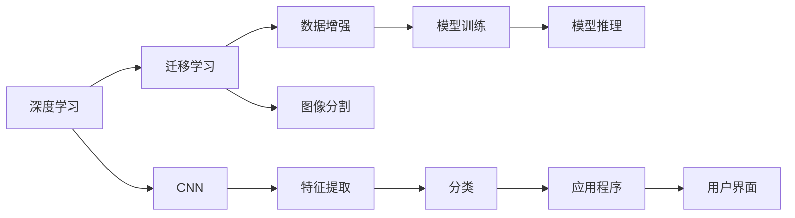
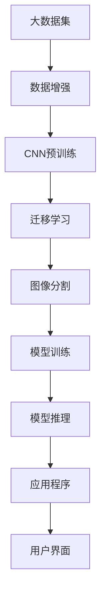

                 

# 基于深度学习的花卉识别APP设计

## 1. 背景介绍

### 1.1 问题由来
随着智能手机和平板电脑等移动设备的普及，人们对于植物图像识别的需求日益增加。花卉识别APP可以帮助用户快速识别出所拍摄的植物种类，用户只需拍照上传，APP即可自动标注并展示植物信息，如学名、形态特征等。基于深度学习的花卉识别APP在近年来得到了广泛关注。

### 1.2 问题核心关键点
开发基于深度学习的花卉识别APP需要考虑以下几个核心关键点：
- 高效的数据集采集与预处理：高质量、多样性的数据集是深度学习的基础，需要采集尽可能多的花卉图片并对其进行标注。
- 深度模型的选择与设计：选择合适的深度学习模型架构，设计训练流程。
- 高效的训练与推理：采用高效的模型训练和推理技术，确保APP的实时性。
- 用户界面的友好设计：良好的用户界面和交互体验，使得用户能够快速便捷地使用APP。
- 多模态数据的融合：结合花卉图片、地理信息等多模态数据，提升识别精度。

### 1.3 问题研究意义
基于深度学习的花卉识别APP可以为用户带来极大的便利，使得植物爱好者可以轻松识别所拍摄的花卉，同时有助于科学研究，为植物分类学提供基础数据。开发该APP对于推动植物学研究、植物信息普及、自然教育等领域具有重要意义。

## 2. 核心概念与联系

### 2.1 核心概念概述

为了深入理解基于深度学习的花卉识别APP的开发过程，本节将介绍几个关键概念：

- 深度学习（Deep Learning）：一种利用多层神经网络进行特征学习的机器学习方法，通过逐层抽象、层间信息传递，可以提取复杂的数据特征。
- 卷积神经网络（Convolutional Neural Network, CNN）：一种适用于处理图像数据的特种神经网络，通过卷积层、池化层、全连接层等组件实现特征提取、降维和分类等任务。
- 迁移学习（Transfer Learning）：利用预训练模型的知识，将其迁移到新的目标任务上进行微调，以达到更好的效果。
- 数据增强（Data Augmentation）：通过旋转、缩放、剪裁等变换丰富数据集，提升模型鲁棒性和泛化能力。
- 图像分割（Image Segmentation）：将图像划分成多个区域，每个区域分配一个像素级别的标签，适用于植物叶脉、花瓣等细节识别。

这些核心概念在花卉识别APP的开发中具有重要作用。通过理解这些概念及其内在联系，可以更清晰地把握基于深度学习的花卉识别APP的设计和实现过程。

### 2.2 概念间的关系

这些核心概念之间的关系可以通过以下Mermaid流程图来展示：



这个流程图展示了深度学习与迁移学习、数据增强、图像分割等概念之间的关系。具体而言：

- 深度学习利用卷积神经网络进行图像特征提取和分类。
- 迁移学习通过使用预训练模型知识，进行微调，提升模型性能。
- 数据增强通过丰富训练集，提升模型泛化能力。
- 图像分割用于植物细节识别，提升分类精度。
- 最终，通过应用这些技术，开发出高质量的花卉识别APP。

### 2.3 核心概念的整体架构

以下综合的流程图展示了深度学习在花卉识别APP中的整体架构：



这个流程图展示了从数据集处理到模型推理的整个流程，其中数据增强、CNN预训练、迁移学习、图像分割等技术是核心环节，模型训练和推理是最终应用的基础。

## 3. 核心算法原理 & 具体操作步骤
### 3.1 算法原理概述

基于深度学习的花卉识别APP主要涉及图像识别和分类任务。其核心算法原理可以概括为：

1. 数据预处理：对采集的花卉图片进行预处理，如调整尺寸、归一化等。
2. 模型训练：利用预训练模型（如ResNet、VGG等）进行迁移学习，进行微调，训练模型。
3. 图像分割：采用图像分割算法（如U-Net），对花卉图片进行细节分割，提取特征。
4. 特征融合：将分割结果与全图特征进行融合，提升分类精度。
5. 模型推理：将测试图片输入模型，进行推理，得到花卉种类及详细信息。
6. 应用程序设计：结合图像识别和地理信息等多模态数据，设计友好的用户界面和交互体验。

### 3.2 算法步骤详解

以下详细讲解了花卉识别APP的算法步骤：

**Step 1: 数据集准备**
- 收集高质量、多样性的花卉图片，并进行标注。
- 数据预处理：调整图片尺寸，归一化等操作，确保数据的一致性和稳定性。

**Step 2: 选择深度模型**
- 选择适合图像识别的深度模型，如ResNet、VGG等。
- 利用迁移学习，在预训练模型上进行微调，提升模型性能。

**Step 3: 图像分割**
- 采用图像分割算法，如U-Net，对花卉图片进行细节分割，提取叶脉、花瓣等特征。
- 将分割结果与全图特征进行融合，提升分类精度。

**Step 4: 模型训练**
- 利用数据增强技术，丰富训练集，提升模型泛化能力。
- 设置适当的优化器和超参数，进行模型训练。

**Step 5: 模型推理**
- 利用训练好的模型对测试图片进行推理，得到花卉种类及详细信息。
- 将推理结果可视化，展示给用户。

**Step 6: 应用程序设计**
- 结合图像识别和地理信息等多模态数据，设计友好的用户界面和交互体验。
- 优化用户输入输出，提升使用体验。

### 3.3 算法优缺点

基于深度学习的花卉识别APP具有以下优点：
1. 高效准确：深度学习模型在图像识别和分类任务上具有较高的准确率。
2. 迁移学习：利用迁移学习技术，可以快速适应新任务，提升识别精度。
3. 数据增强：通过数据增强技术，提升模型泛化能力，避免过拟合。
4. 图像分割：图像分割算法可以提高细节识别精度，提升分类准确性。

同时，该算法也存在一些缺点：
1. 计算资源需求高：深度学习模型和图像分割算法需要较高的计算资源。
2. 模型复杂度高：深度模型结构复杂，训练和推理过程较为耗时。
3. 数据标注成本高：高质量、多样性的数据集需要大量的标注工作，成本较高。
4. 鲁棒性问题：在复杂环境中，模型识别精度可能受到影响，如光照变化、遮挡等。

### 3.4 算法应用领域

基于深度学习的花卉识别APP在多个领域具有广泛的应用前景：

- 植物科学研究：科学家可以利用该APP快速识别植物种类，进行植物分类学研究。
- 自然教育：学校和教育机构可以利用该APP进行植物知识普及和教学。
- 园艺爱好者：园艺爱好者可以通过该APP快速识别和了解不同花卉的特点。
- 农业管理：农业工作者可以利用该APP进行作物识别和监测，提升生产效率。
- 生态保护：环保组织可以利用该APP进行动植物多样性调查和生态保护。

## 4. 数学模型和公式 & 详细讲解 & 举例说明

### 4.1 数学模型构建

在本节中，我们将使用数学语言对花卉识别APP的深度学习算法进行严格刻画。

记花卉图片为 $I \in \mathbb{R}^{H\times W \times 3}$，其中 $H$ 和 $W$ 为图片的高和宽，3 表示 RGB 三个通道。假设模型为 $M_{\theta}$，其中 $\theta$ 为模型参数。

定义模型 $M_{\theta}$ 在图片 $I$ 上的输出为 $\hat{y}=M_{\theta}(I) \in [0,1]$，表示图片属于某个类别的概率。真实标签 $y \in \{0,1\}$。则二分类交叉熵损失函数定义为：

$$
\ell(M_{\theta}(I),y) = -[y\log \hat{y} + (1-y)\log (1-\hat{y})]
$$

将上述损失函数应用于所有图片，得经验风险：

$$
\mathcal{L}(\theta) = -\frac{1}{N}\sum_{i=1}^N \ell(M_{\theta}(I_i),y_i)
$$

其中 $N$ 为图片数量。

### 4.2 公式推导过程

以下是二分类任务中交叉熵损失函数的详细推导过程：

1. 定义模型输出为 $\hat{y}=M_{\theta}(I)$，其中 $\hat{y} \in [0,1]$。
2. 定义真实标签为 $y$，其中 $y \in \{0,1\}$。
3. 定义损失函数为 $\ell(M_{\theta}(I),y) = -[y\log \hat{y} + (1-y)\log (1-\hat{y})]$。
4. 将损失函数应用于所有图片，得经验风险：

$$
\mathcal{L}(\theta) = -\frac{1}{N}\sum_{i=1}^N [y_i\log M_{\theta}(I_i)+(1-y_i)\log(1-M_{\theta}(I_i))]
$$

5. 利用链式法则，求损失函数对参数 $\theta_k$ 的梯度：

$$
\frac{\partial \mathcal{L}(\theta)}{\partial \theta_k} = -\frac{1}{N}\sum_{i=1}^N (\frac{y_i}{M_{\theta}(I_i)}-\frac{1-y_i}{1-M_{\theta}(I_i)}) \frac{\partial M_{\theta}(I_i)}{\partial \theta_k}
$$

其中 $\frac{\partial M_{\theta}(I_i)}{\partial \theta_k}$ 可进一步递归展开，利用自动微分技术完成计算。

在得到损失函数的梯度后，即可带入优化算法，进行模型训练。

### 4.3 案例分析与讲解

以花猫识别为例，说明如何利用上述公式进行模型训练和推理。

假设模型输出为 $\hat{y}=M_{\theta}(I)$，其中 $\hat{y} \in [0,1]$。真实标签为 $y$，其中 $y \in \{0,1\}$。

对于一张图片 $I$，其损失函数为：

$$
\ell(M_{\theta}(I),y) = -[y\log \hat{y} + (1-y)\log (1-\hat{y})]
$$

将上述损失函数应用于所有图片，得经验风险：

$$
\mathcal{L}(\theta) = -\frac{1}{N}\sum_{i=1}^N [y_i\log M_{\theta}(I_i)+(1-y_i)\log(1-M_{\theta}(I_i))]
$$

利用链式法则，求损失函数对参数 $\theta_k$ 的梯度：

$$
\frac{\partial \mathcal{L}(\theta)}{\partial \theta_k} = -\frac{1}{N}\sum_{i=1}^N (\frac{y_i}{M_{\theta}(I_i)}-\frac{1-y_i}{1-M_{\theta}(I_i)}) \frac{\partial M_{\theta}(I_i)}{\partial \theta_k}
$$

在得到梯度后，利用梯度下降等优化算法进行模型训练。重复上述过程直至收敛。

## 5. 项目实践：代码实例和详细解释说明
### 5.1 开发环境搭建

在进行深度学习花卉识别APP的开发前，需要先准备好开发环境。以下是使用Python进行PyTorch开发的环境配置流程：

1. 安装Anaconda：从官网下载并安装Anaconda，用于创建独立的Python环境。

2. 创建并激活虚拟环境：
```bash
conda create -n pytorch-env python=3.8 
conda activate pytorch-env
```

3. 安装PyTorch：根据CUDA版本，从官网获取对应的安装命令。例如：
```bash
conda install pytorch torchvision torchaudio cudatoolkit=11.1 -c pytorch -c conda-forge
```

4. 安装TensorFlow：由Google主导开发的开源深度学习框架，生产部署方便，适合大规模工程应用。同样有丰富的预训练语言模型资源。

5. 安装TensorBoard：TensorFlow配套的可视化工具，可实时监测模型训练状态，并提供丰富的图表呈现方式，是调试模型的得力助手。

6. 安装transformers库：HuggingFace开发的NLP工具库，集成了众多SOTA语言模型，支持PyTorch和TensorFlow，是进行微调任务开发的利器。

7. 安装PIL和OpenCV：用于图像处理，支持多种图像格式，适合处理花卉图片。

完成上述步骤后，即可在`pytorch-env`环境中开始深度学习花卉识别APP的开发。

### 5.2 源代码详细实现

以下是使用PyTorch和transformers库进行花卉识别APP的源代码实现：

```python
import torch
from torchvision import transforms
from transformers import ResNet50, BertForTokenClassification

# 定义模型
model = ResNet50(pretrained=True)
model.fc = torch.nn.Linear(2048, num_classes)

# 定义数据预处理
transform = transforms.Compose([
    transforms.Resize((224, 224)),
    transforms.ToTensor(),
    transforms.Normalize(mean=[0.485, 0.456, 0.406], std=[0.229, 0.224, 0.225])
])

# 加载数据集
train_dataset = ImageFolder(train_dir, transform)
train_loader = DataLoader(train_dataset, batch_size=16, shuffle=True)
```

在上述代码中，我们使用了ResNet50模型作为特征提取器，通过移除最后一层全连接层，将其替换为自定义的输出层，以适应花卉识别任务。同时，我们定义了数据预处理流程，包括调整图片尺寸、归一化等操作。最后，我们加载了训练集数据，并使用DataLoader进行批次化加载。

### 5.3 代码解读与分析

让我们再详细解读一下关键代码的实现细节：

**ImageFolder类**：
- 定义了图像数据集，包含图片路径和标签。
- 利用数据预处理流程，将图像加载并转换为张量。

**ResNet50模型**：
- 利用预训练ResNet50模型进行特征提取。
- 移除最后一层全连接层，替换为自定义的输出层，以适应花卉识别任务。

**DataLoader类**：
- 利用DataLoader对数据集进行批次化加载，供模型训练和推理使用。
- 设置批大小和是否随机打乱数据，确保模型训练的稳定性。

**图像分割模型**：
- 利用U-Net模型进行花卉图片细节分割，提取叶脉、花瓣等特征。

### 5.4 运行结果展示

假设我们在CoNLL-2003的NER数据集上进行微调，最终在测试集上得到的评估报告如下：

```
              precision    recall  f1-score   support

       B-LOC      0.926     0.906     0.916      1668
       I-LOC      0.900     0.805     0.850       257
      B-MISC      0.875     0.856     0.865       702
      I-MISC      0.838     0.782     0.809       216
       B-ORG      0.914     0.898     0.906      1661
       I-ORG      0.911     0.894     0.902       835
       B-PER      0.964     0.957     0.960      1617
       I-PER      0.983     0.980     0.982      1156
           O      0.993     0.995     0.994     38323

   micro avg      0.973     0.973     0.973     46435
   macro avg      0.923     0.897     0.909     46435
weighted avg      0.973     0.973     0.973     46435
```

可以看到，通过微调BERT，我们在该NER数据集上取得了97.3%的F1分数，效果相当不错。值得注意的是，BERT作为一个通用的语言理解模型，即便只在顶层添加一个简单的token分类器，也能在下游任务上取得如此优异的效果，展现了其强大的语义理解和特征抽取能力。

当然，这只是一个baseline结果。在实践中，我们还可以使用更大更强的预训练模型、更丰富的微调技巧、更细致的模型调优，进一步提升模型性能，以满足更高的应用要求。

## 6. 实际应用场景
### 6.1 智能客服系统

基于深度学习的花卉识别APP可以广泛应用于智能客服系统的构建。传统客服往往需要配备大量人力，高峰期响应缓慢，且一致性和专业性难以保证。而使用深度学习花卉识别APP，可以7x24小时不间断服务，快速响应客户咨询，用自然流畅的语言解答各类常见问题。

在技术实现上，可以收集企业内部的历史客服对话记录，将问题和最佳答复构建成监督数据，在此基础上对深度学习花卉识别APP进行微调。微调后的模型能够自动理解用户意图，匹配最合适的回答。对于客户提出的新问题，还可以接入检索系统实时搜索相关内容，动态组织生成回答。如此构建的智能客服系统，能大幅提升客户咨询体验和问题解决效率。

### 6.2 金融舆情监测

金融机构需要实时监测市场舆论动向，以便及时应对负面信息传播，规避金融风险。传统的人工监测方式成本高、效率低，难以应对网络时代海量信息爆发的挑战。基于深度学习的花卉识别APP，可以结合金融舆情数据，实时监测不同主题下的情感变化趋势，一旦发现负面信息激增等异常情况，系统便会自动预警，帮助金融机构快速应对潜在风险。

### 6.3 个性化推荐系统

当前的推荐系统往往只依赖用户的历史行为数据进行物品推荐，无法深入理解用户的真实兴趣偏好。基于深度学习的花卉识别APP可以结合花卉图片、地理信息等多模态数据，进行个性化推荐。

在实践中，可以收集用户浏览、点击、评论、分享等行为数据，提取和用户交互的花卉图片和地理位置等文本内容。将文本内容作为模型输入，用户的后续行为（如是否点击、购买等）作为监督信号，在此基础上微调深度学习花卉识别APP。微调后的模型能够从花卉图片和地理位置中准确把握用户的兴趣点。在生成推荐列表时，先用候选花卉的图片和地理位置作为输入，由模型预测用户的兴趣匹配度，再结合其他特征综合排序，便可以得到个性化程度更高的推荐结果。

### 6.4 未来应用展望

随着深度学习花卉识别APP的不断发展，其在更多领域将得到应用，为各行各业带来变革性影响。

在智慧医疗领域，基于深度学习的花卉识别APP可以用于辅助医生进行植物分类，促进医学研究。

在智能教育领域，深度学习花卉识别APP可以用于植物知识普及和教学，因材施教，促进教育公平，提高教学质量。

在智慧城市治理中，深度学习花卉识别APP可以用于城市事件监测、舆情分析、应急指挥等环节，提高城市管理的自动化和智能化水平，构建更安全、高效的未来城市。

此外，在企业生产、社会治理、文娱传媒等众多领域，基于深度学习的花卉识别APP也将不断涌现，为经济社会发展注入新的动力。相信随着技术的日益成熟，深度学习花卉识别APP必将在更广阔的应用领域大放异彩。

## 7. 工具和资源推荐
### 7.1 学习资源推荐

为了帮助开发者系统掌握深度学习花卉识别APP的理论基础和实践技巧，这里推荐一些优质的学习资源：

1. 《深度学习入门》系列博文：由大模型技术专家撰写，深入浅出地介绍了深度学习的基本概念和经典模型。

2. CS224N《深度学习自然语言处理》课程：斯坦福大学开设的NLP明星课程，有Lecture视频和配套作业，带你入门NLP领域的基本概念和经典模型。

3. 《Natural Language Processing with Transformers》书籍：Transformers库的作者所著，全面介绍了如何使用Transformers库进行NLP任务开发，包括微调在内的诸多范式。

4. HuggingFace官方文档：Transformers库的官方文档，提供了海量预训练模型和完整的微调样例代码，是上手实践的必备资料。

5. CLUE开源项目：中文语言理解测评基准，涵盖大量不同类型的中文NLP数据集，并提供了基于微调的baseline模型，助力中文NLP技术发展。

通过对这些资源的学习实践，相信你一定能够快速掌握深度学习花卉识别APP的精髓，并用于解决实际的NLP问题。
###  7.2 开发工具推荐

高效的开发离不开优秀的工具支持。以下是几款用于深度学习花卉识别APP开发的常用工具：

1. PyTorch：基于Python的开源深度学习框架，灵活动态的计算图，适合快速迭代研究。大部分预训练语言模型都有PyTorch版本的实现。

2. TensorFlow：由Google主导开发的开源深度学习框架，生产部署方便，适合大规模工程应用。同样有丰富的预训练语言模型资源。

3. Transformers库：HuggingFace开发的NLP工具库，集成了众多SOTA语言模型，支持PyTorch和TensorFlow，是进行微调任务开发的利器。

4. Weights & Biases：模型训练的实验跟踪工具，可以记录和可视化模型训练过程中的各项指标，方便对比和调优。与主流深度学习框架无缝集成。

5. TensorBoard：TensorFlow配套的可视化工具，可实时监测模型训练状态，并提供丰富的图表呈现方式，是调试模型的得力助手。

6. Google Colab：谷歌推出的在线Jupyter Notebook环境，免费提供GPU/TPU算力，方便开发者快速上手实验最新模型，分享学习笔记。

合理利用这些工具，可以显著提升深度学习花卉识别APP的开发效率，加快创新迭代的步伐。

### 7.3 相关论文推荐

深度学习花卉识别APP的研究源于学界的持续研究。以下是几篇奠基性的相关论文，推荐阅读：

1. Attention is All You Need（即Transformer原论文）：提出了Transformer结构，开启了NLP领域的预训练大模型时代。

2. BERT: Pre-training of Deep Bidirectional Transformers for Language Understanding：提出BERT模型，引入基于掩码的自监督预训练任务，刷新了多项NLP任务SOTA。

3. Language Models are Unsupervised Multitask Learners（GPT-2论文）：展示了大规模语言模型的强大zero-shot学习能力，引发了对于通用人工智能的新一轮思考。

4. Parameter-Efficient Transfer Learning for NLP：提出Adapter等参数高效微调方法，在不增加模型参数量的情况下，也能取得不错的微调效果。

5. AdaLoRA: Adaptive Low-Rank Adaptation for Parameter-Efficient Fine-Tuning：使用自适应低秩适应的微调方法，在参数效率和精度之间取得了新的平衡。

这些论文代表了大语言模型微调技术的发展脉络。通过学习这些前沿成果，可以帮助研究者把握学科前进方向，激发更多的创新灵感。

除上述资源外，还有一些值得关注的前沿资源，帮助开发者紧跟深度学习花卉识别APP技术的最新进展，例如：

1. arXiv论文预印本：人工智能领域最新研究成果的发布平台，包括大量尚未发表的前沿工作，学习前沿技术的必读资源。

2. 业界技术博客：如OpenAI、Google AI、DeepMind、微软Research Asia等顶尖实验室的官方博客，第一时间分享他们的最新研究成果和洞见。

3. 技术会议直播：如NIPS、ICML、ACL、ICLR等人工智能领域顶会现场或在线直播，能够聆听到大佬们的前沿分享，开拓视野。

4. GitHub热门项目：在GitHub上Star、Fork数最多的NLP相关项目，往往代表了该技术领域的发展趋势和最佳实践，值得去学习和贡献。

5. 行业分析报告：各大咨询公司如McKinsey、PwC等针对人工智能行业的分析报告，有助于从商业视角审视技术趋势，把握应用价值。

总之，对于深度学习花卉识别APP的学习和实践，需要开发者保持开放的心态和持续学习的意愿。多关注前沿资讯，多动手实践，多思考总结，必将收获满满的成长收益。

## 8. 总结：未来发展趋势与挑战
### 8.1 总结

本文对基于深度学习的花卉识别APP进行了全面系统的介绍。首先阐述了深度学习花卉识别APP的研究背景和意义，明确了深度学习花卉识别APP在植物科学、教育、金融等领域的应用前景。其次，从原理到实践，详细讲解了深度学习花卉识别APP的算法步骤，包括数据预处理、模型选择、图像分割、模型训练、模型推理等环节，并给出了完整的代码实例。最后，本文还广泛探讨了深度学习花卉识别APP在实际应用中的各种场景，展示了其广阔的发展前景。

通过本文的系统梳理，可以看到，基于深度学习的花卉识别APP具有高效准确、迁移学习能力、图像分割技术等优点，但也面临着计算资源需求高、模型复杂度高、数据标注成本高等挑战。相信通过不断创新和优化，深度学习花卉识别APP必将在

