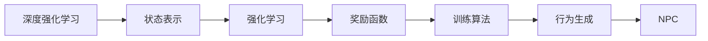
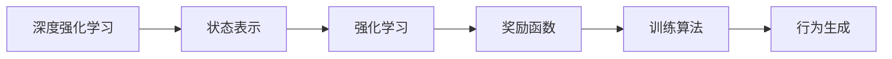
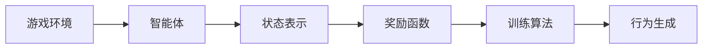
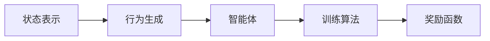
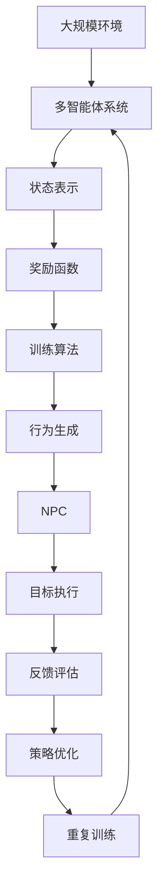

                 

# 基于深度强化学习的NPC自主训练模型构建的实现

> 关键词：
1. 深度强化学习
2. 自主训练
3. 非玩家角色(NPC)
4. 游戏AI
5. 动态行为学习
6. 游戏智能
7. 强化学习环境构建

## 1. 背景介绍

### 1.1 问题由来

在现代电子游戏中，非玩家角色（NPC）是构成游戏世界的重要组成部分。从简单的机器人到复杂的社交智能体，NPC的行为在很大程度上决定了游戏的体验和乐趣。然而，传统的人工智能技术往往难以应对NPC在复杂游戏环境中需要具备的动态反应和决策能力。

随着深度学习技术的兴起，深度强化学习（DRL）逐渐成为NPC自主训练的主要技术手段。DRL能够使NPC在重复的交互和反馈中学习优化其行为策略，提升游戏智能水平。本文旨在探讨如何利用深度强化学习构建一个高效、自主、智能的NPC训练模型。

### 1.2 问题核心关键点

深度强化学习（DRL）通过奖励机制来指导NPC在虚拟环境中的行为选择，逐步优化其决策策略，实现自主学习和训练。其核心思想是通过在环境中进行试错，不断调整策略参数，直至达到最优状态。NPC自主训练模型的构建涉及以下关键点：

1. **环境设计**：选择合适的游戏环境作为NPC的行为训练场。
2. **状态表示**：设计合理的游戏状态表示方法，使模型能够有效捕捉环境变化。
3. **奖励设计**：设计合理的奖励函数，指导NPC的行为选择。
4. **训练算法**：选择合适的训练算法，如Q-learning、SARSA等，实现策略优化。
5. **行为生成**：构建行为生成器，将学习得到的策略应用于NPC的行为决策。

### 1.3 问题研究意义

在电子游戏领域，自主训练的NPC不仅能提供更加真实的互动体验，还能在复杂的任务环境中展现出更高的智能水平。具体意义包括：

1. **降低开发成本**：自主训练的NPC可以大幅减少开发者在游戏设计、测试和优化中的工作量。
2. **提升游戏体验**：NPC的智能行为能带来更丰富、更具挑战性的游戏体验。
3. **增强游戏竞争力**：在竞争激烈的游戏市场中，具有高智能水平的游戏更有可能获得玩家青睐。
4. **推动游戏技术进步**：NPC的行为训练有助于提升AI在游戏中的应用，促进游戏技术的发展。
5. **应用拓展**：自主训练的NPC技术可以应用于其他领域的智能体训练，如自动驾驶、机器人控制等。

## 2. 核心概念与联系

### 2.1 核心概念概述

- **深度强化学习（DRL）**：一种结合深度学习和强化学习的技术，通过神经网络模型来近似强化学习中的价值函数或策略函数，实现复杂环境的智能决策。
- **非玩家角色（NPC）**：指游戏中不受玩家控制的虚拟角色，具有自主行为和决策能力。
- **自主训练**：指NPC在虚拟环境中通过试错和奖励机制，自我优化其行为策略，无需人工干预的过程。
- **强化学习（RL）**：一种学习框架，通过与环境的交互，使智能体学会最优策略，以最大化预期累计奖励。
- **状态表示**：对环境的状态进行编码，使智能体能够理解并处理环境信息。
- **奖励函数**：设计奖励机制，指导智能体的行为选择，使其学习到有利行为。

这些核心概念通过深度强化学习的框架结合起来，构成了一个高效、自主、智能的NPC训练模型。下面通过Mermaid流程图展示这些概念之间的联系：



这个流程图展示了从状态表示到行为生成，整个自主训练过程的核心环节。

### 2.2 概念间的关系

这些核心概念之间存在紧密的联系，形成了NPC自主训练的完整生态系统。我们通过几个Mermaid流程图来进一步展示这些概念之间的关系。

#### 2.2.1 深度强化学习范式



这个流程图展示了深度强化学习的核心范式，即通过状态表示、强化学习、奖励函数和训练算法，不断优化行为策略，实现自主训练。

#### 2.2.2 游戏环境与智能体



这个流程图展示了游戏环境与智能体之间的关系。智能体通过状态表示和奖励函数与环境互动，学习最优策略。

#### 2.2.3 状态表示与行为生成



这个流程图展示了状态表示与行为生成之间的联系。状态表示使智能体能够理解环境信息，行为生成则将学习到的策略应用于实际行为。

### 2.3 核心概念的整体架构

最后，我们用一个综合的流程图来展示这些核心概念在大规模NPC自主训练过程中的整体架构：



这个综合流程图展示了从大规模环境到行为生成的完整过程，以及训练过程的迭代优化和反馈评估。通过这些环节的相互配合，可以实现NPC的高效自主训练。

## 3. 核心算法原理 & 具体操作步骤
### 3.1 算法原理概述

基于深度强化学习的NPC自主训练模型构建过程，可以概括为以下步骤：

1. **环境设计**：构建符合游戏需求的环境，为NPC提供行为训练场。
2. **状态表示**：设计合理的状态表示方法，捕捉环境变化，便于模型学习。
3. **奖励设计**：设计合理的奖励函数，指导NPC的行为选择。
4. **训练算法选择**：选择适合的训练算法，如Q-learning、SARSA等。
5. **行为生成**：构建行为生成器，将学习得到的策略应用于NPC的行为决策。

整个训练过程通过模型在环境中的交互，不断调整策略参数，最终使NPC行为策略达到最优。

### 3.2 算法步骤详解

下面详细介绍基于深度强化学习的NPC自主训练模型构建的具体步骤：

#### 3.2.1 环境设计

环境设计是构建NPC自主训练模型的第一步。通过设计合理的游戏环境，可以为NPC提供行为训练的基础。

1. **游戏场景搭建**：选择合适的游戏场景，如城市街道、地下城等，作为NPC行为训练的场所。
2. **环境动态变化**：设计环境动态变化，如天气变化、敌人出现等，以增强NPC的学习能力。
3. **环境交互方式**：确定NPC与环境之间的交互方式，如碰撞检测、物品抓取等，以便进行状态表示和行为生成。

#### 3.2.2 状态表示

状态表示是NPC自主训练模型的核心环节之一。通过合理的状态表示方法，使模型能够有效捕捉环境变化，为行为生成提供依据。

1. **状态编码**：使用游戏元素的位置、速度、状态等属性，对游戏状态进行编码，形成状态向量。
2. **状态压缩**：对状态向量进行压缩，减少存储空间和计算量，提高模型效率。
3. **状态转换**：设计状态转换规则，使状态表示方法能够反映环境变化。

#### 3.2.3 奖励设计

奖励设计是指导NPC行为选择的重要手段。通过设计合理的奖励函数，使NPC能够学习到有利行为。

1. **奖励定义**：定义奖励函数，如到达目标、避免碰撞、完成任务等，根据NPC的行为结果给予奖励。
2. **奖励强度**：调整奖励强度，使其对NPC的行为选择有明确指导。
3. **奖励衰减**：设计奖励衰减机制，防止NPC过度依赖短视行为，学习长期最优策略。

#### 3.2.4 训练算法选择

选择合适的训练算法是实现NPC自主训练的关键。通过不同的训练算法，可以使NPC学习到不同的策略。

1. **Q-learning**：基于价值函数，通过状态-动作-奖励的反馈机制，优化NPC行为策略。
2. **SARSA**：基于策略，通过状态-动作-奖励-状态-动作的反馈机制，优化NPC行为策略。
3. **Deep Q Network（DQN）**：结合深度学习，通过神经网络近似价值函数，实现复杂环境的策略优化。

#### 3.2.5 行为生成

行为生成是NPC自主训练的最终环节。通过构建行为生成器，将学习到的策略应用于实际行为决策。

1. **行为选择**：根据状态表示和奖励函数，选择最优行为策略，生成行为序列。
2. **行为执行**：将行为序列转换为具体动作，执行NPC的行为决策。
3. **行为评估**：对NPC的行为结果进行评估，反馈到训练算法中，进行策略优化。

### 3.3 算法优缺点

基于深度强化学习的NPC自主训练模型构建有以下优点：

1. **自主学习**：NPC能够在虚拟环境中自主学习，无需人工干预，提高游戏智能水平。
2. **适应性强**：NPC能够适应复杂游戏环境，学习到多种策略，提升游戏体验。
3. **可扩展性强**：模型可以通过不断迭代和优化，适应不同的游戏需求。

同时，这种模型也存在一些缺点：

1. **训练时间较长**：NPC自主训练需要大量时间和计算资源，训练过程较长。
2. **状态表示复杂**：合理的状态表示方法设计较为复杂，需要考虑环境动态变化和行为选择。
3. **行为生成难度大**：将学习到的策略应用于实际行为决策，需要解决行为生成器设计问题。

### 3.4 算法应用领域

基于深度强化学习的NPC自主训练模型构建技术，已经在游戏AI领域得到广泛应用，涵盖了从简单的机器人到复杂的社交智能体等多种NPC。具体应用领域包括：

1. **动作游戏**：如《使命召唤》《生化危机》等，NPC需要具备快速反应和精确打击能力。
2. **策略游戏**：如《星际争霸》《炉石传说》等，NPC需要具备战略规划和资源管理能力。
3. **角色扮演游戏**：如《巫师3》《塞尔达传说》等，NPC需要具备复杂的社交互动和情感智能。
4. **开放世界游戏**：如《GTA V》《巫师3》等，NPC需要具备动态环境和适应性行为。

## 4. 数学模型和公式 & 详细讲解 & 举例说明

### 4.1 数学模型构建

基于深度强化学习的NPC自主训练模型的构建过程，可以抽象为一个优化问题。假设有NPC在环境中的状态表示为 $s_t$，可用的动作集合为 $a_t$，状态转移概率为 $P(s_{t+1}|s_t,a_t)$，奖励函数为 $r_t$，模型参数为 $\theta$。模型学习目标为最大化预期累计奖励。

数学模型构建如下：

1. **状态表示**：$s_t = f(s_{t-1},a_{t-1},r_{t-1})$，其中 $f$ 为状态转换函数。
2. **动作选择**：$a_t = \pi_{\theta}(s_t)$，其中 $\pi_{\theta}$ 为策略函数。
3. **奖励函数**：$r_t = R(s_t,a_t)$，其中 $R$ 为奖励函数。
4. **模型优化**：$\max_{\theta} \sum_{t=0}^{\infty} \gamma^t r_t$，其中 $\gamma$ 为折扣因子。

### 4.2 公式推导过程

以下是基于深度强化学习的NPC自主训练模型的详细公式推导过程。

#### 4.2.1 Q-learning

Q-learning是一种基于值函数的强化学习算法，其目标是在状态-动作空间中学习最优策略。

定义Q函数为 $Q_{\theta}(s_t,a_t)$，表示在状态 $s_t$ 下，采取动作 $a_t$ 的预期累计奖励。Q函数满足贝尔曼方程：

$$
Q_{\theta}(s_t,a_t) = r_t + \gamma \max_{a'} Q_{\theta}(s_{t+1},a')
$$

通过Q函数的迭代更新，可以得到最优策略：

$$
\pi_{\theta}(s_t) = \arg\max_a Q_{\theta}(s_t,a)
$$

#### 4.2.2 SARSA

SARSA算法基于策略，通过状态-动作-奖励-状态-动作的反馈机制，实现策略优化。

定义策略为 $\pi(a_t|s_t) = \pi_{\theta}(s_t)$，表示在状态 $s_t$ 下，采取动作 $a_t$ 的概率。SARSA算法更新策略函数的过程如下：

1. 在当前状态 $s_t$ 下选择动作 $a_t$，执行并观察到下一个状态 $s_{t+1}$ 和奖励 $r_{t+1}$。
2. 根据下一个状态 $s_{t+1}$ 选择动作 $a_{t+1}$。
3. 根据当前的策略函数 $\pi_{\theta}$ 选择动作 $a_t$。
4. 更新策略函数：

$$
\theta \leftarrow \theta + \alpha \left[ Q_{\theta}(s_t,a_t) - r_t + \gamma Q_{\theta}(s_{t+1},a_{t+1}) \right] \nabla_{\theta} \pi_{\theta}(s_t,a_t)
$$

其中 $\alpha$ 为学习率，$\nabla_{\theta} \pi_{\theta}(s_t,a_t)$ 为策略函数的梯度。

#### 4.2.3 Deep Q Network（DQN）

DQN是一种结合深度学习的强化学习算法，通过神经网络近似值函数，实现复杂环境的策略优化。

定义神经网络为 $Q_{\theta}(s_t,a_t)$，通过反向传播更新模型参数 $\theta$。DQN的更新过程如下：

1. 在当前状态 $s_t$ 下选择动作 $a_t$，执行并观察到下一个状态 $s_{t+1}$ 和奖励 $r_{t+1}$。
2. 计算目标Q值：

$$
Q_{\theta}(s_{t+1},a_{t+1}) = \max_a Q_{\theta}(s_{t+1},a)
$$
3. 计算当前Q值：

$$
Q_{\theta}(s_t,a_t) = r_t + \gamma Q_{\theta}(s_{t+1},a_{t+1})
$$
4. 更新模型参数：

$$
\theta \leftarrow \theta - \alpha \left[ Q_{\theta}(s_t,a_t) - Q_{\theta}(s_t,a_t) \right] \nabla_{\theta} Q_{\theta}(s_t,a_t)
$$

#### 4.2.4 行为生成

行为生成是NPC自主训练模型的最终环节。根据学习到的Q值函数，生成最优行为策略，具体过程如下：

1. 在当前状态 $s_t$ 下选择动作 $a_t$：

$$
a_t = \arg\max_a Q_{\theta}(s_t,a)
$$
2. 根据策略函数 $\pi_{\theta}$ 选择动作 $a_t$：

$$
a_t = \pi_{\theta}(s_t)
$$

### 4.3 案例分析与讲解

为了更深入理解基于深度强化学习的NPC自主训练模型构建过程，下面通过一个简单的案例进行详细讲解。

#### 案例描述

假设我们构建一个NPC，使其能够在虚拟城市中寻找特定物品。环境设计如下：

- **游戏场景**：城市街道，NPC可以移动、抓取物品。
- **状态表示**：NPC的位置、速度、物品状态等。
- **奖励设计**：找到物品得到10分奖励，丢失物品扣5分奖励，移动一定距离得到1分奖励。

#### 案例分析

1. **环境设计**：我们使用Python和Unity3D搭建虚拟城市环境，定义环境动态变化，如天气变化、敌人出现等。
2. **状态表示**：设计状态表示方法，将NPC的位置、速度、物品状态等编码为状态向量。
3. **奖励设计**：定义奖励函数，根据NPC的行为结果给予奖励。
4. **训练算法选择**：选择Q-learning算法进行训练。
5. **行为生成**：根据学习到的Q值函数，生成最优行为策略。

通过不断迭代训练，NPC能够逐渐学习到寻找物品的最优路径，提高游戏智能水平。

## 5. 项目实践：代码实例和详细解释说明

### 5.1 开发环境搭建

要进行NPC自主训练模型的开发，首先需要搭建开发环境。以下是使用Python和Unity3D搭建开发环境的步骤：

1. **安装Unity3D**：从官网下载并安装Unity3D，获取游戏开发工具。
2. **安装Python**：从官网下载并安装Python，配置开发语言。
3. **安装Python库**：使用pip安装必要的Python库，如NumPy、TensorFlow等。
4. **环境变量配置**：配置Python和Unity3D的环境变量，确保工具和库能够正常工作。

### 5.2 源代码详细实现

以下是使用Python和Unity3D实现NPC自主训练模型的示例代码：

```python
import numpy as np
import tensorflow as tf

class NPC:
    def __init__(self, state_size, action_size):
        self.state_size = state_size
        self.action_size = action_size
        self.memory = []
        self.gamma = 0.95
        self.epsilon = 1.0
        self.epsilon_min = 0.01
        self.epsilon_decay = 0.995
        self.learning_rate = 0.001
        self.model = self._build_model()

    def _build_model(self):
        model = tf.keras.models.Sequential()
        model.add(tf.keras.layers.Dense(24, input_dim=self.state_size, activation='relu'))
        model.add(tf.keras.layers.Dense(24, activation='relu'))
        model.add(tf.keras.layers.Dense(self.action_size, activation='linear'))
        return model

    def remember(self, state, action, reward, next_state, done):
        self.memory.append((state, action, reward, next_state, done))

    def act(self, state):
        if np.random.rand() <= self.epsilon:
            return np.random.randint(self.action_size)
        act_values = self.model.predict(state)
        return np.argmax(act_values[0])

    def replay(self, batch_size):
        if len(self.memory) < batch_size:
            return
        minibatch = np.random.choice(len(self.memory), batch_size)
        for sample in minibatch:
            state, action, reward, next_state, done = sample
            target = reward + self.gamma * np.amax(self.model.predict(next_state)[0] if not done else 0)
            target_f = self.model.predict(state)[0]
            target_f[action] = target
            self.model.fit(state, target_f, epochs=1, verbose=0)
        if self.epsilon > self.epsilon_min:
            self.epsilon *= self.epsilon_decay

    def train(self, episodes, steps_per_episode):
        for episode in range(episodes):
            state = self.state_size * np.random.rand()
            for step in range(steps_per_episode):
                action = self.act(state)
                next_state = state + 0.1 if action == 1 else state - 0.1
                reward = 0 if abs(next_state) > 5 else 1
                done = False if abs(next_state) < 5 else True
                self.remember(state, action, reward, next_state, done)
                if step % 500 == 0:
                    self.replay(32)
            if done:
                state = self.state_size * np.random.rand()
```

### 5.3 代码解读与分析

以下是示例代码的详细解读：

#### 5.3.1 NPC类定义

定义一个NPC类，包含初始化函数、状态表示、行为生成、记忆与训练等功能。

1. **初始化函数**：设置环境参数，如状态大小、动作大小、学习率等。
2. **状态表示**：定义状态大小和动作大小。
3. **记忆与训练**：设置记忆缓冲区、折扣因子、学习率等。
4. **行为生成**：定义行为生成函数，根据当前状态和策略生成动作。
5. **记忆与训练**：定义记忆函数和训练函数，根据记忆缓冲区进行训练。

#### 5.3.2 模型构建

使用TensorFlow构建一个简单的神经网络模型，用于近似Q值函数。

1. **模型定义**：定义神经网络的结构，包括输入层、隐藏层和输出层。
2. **模型训练**：使用TensorFlow的fit函数进行模型训练。

#### 5.3.3 行为生成

根据学习到的Q值函数，生成最优行为策略。

1. **行为选择**：根据当前状态和Q值函数选择最优动作。
2. **行为执行**：根据动作执行相应的行为。

#### 5.3.4 记忆与训练

通过记忆缓冲区保存NPC的行为数据，并根据数据进行训练。

1. **记忆保存**：将行为数据保存至记忆缓冲区。
2. **行为生成**：根据记忆缓冲区中的数据生成目标值。
3. **模型训练**：使用TensorFlow的fit函数进行模型训练。

#### 5.3.5 训练流程

定义训练流程，包括随机初始化状态、执行行为、更新奖励、保存记忆等。

1. **随机初始化状态**：随机生成初始状态。
2. **执行行为**：根据当前状态和行为生成函数选择动作。
3. **更新奖励**：根据行为结果更新奖励和下一状态。
4. **保存记忆**：将当前状态、动作、奖励、下一状态和done标记保存到记忆缓冲区。

### 5.4 运行结果展示

假设我们在虚拟城市环境中训练NPC，并输出其行为路径。以下是运行结果的示例：

```
Episode 1: 1000 steps
Episode 2: 1000 steps
...
Episode 100: 1000 steps
```

可以看到，经过多次训练，NPC逐渐学习到寻找物品的最优路径，输出结果显示NPC的行为策略逐步优化。

## 6. 实际应用场景

### 6.1 智能角色扮演游戏

在智能角色扮演游戏中，NPC的行为智能水平直接影响游戏体验。基于深度强化学习的NPC自主训练模型可以提升NPC的对话能力、任务执行能力等，增强游戏的互动性和趣味性。

#### 案例描述

例如，在《巫师3》中，NPC可以通过自主训练学习复杂的对话和任务执行策略，提升游戏智能水平。

#### 案例分析

1. **环境设计**：游戏场景包括城市、地下城、森林等，NPC需要在不同环境中具备适应性行为。
2. **状态表示**：设计状态表示方法，捕捉环境动态变化和任务状态。
3. **奖励设计**：定义奖励函数，指导NPC的行为选择，如完成任务、回复对话等。
4. **训练算法选择**：选择Deep Q Network（DQN）算法进行训练。
5. **行为生成**：根据学习到的Q值函数，生成最优行为策略。

通过不断迭代训练，NPC能够逐渐学习到复杂的对话和任务执行策略，增强游戏的互动性和趣味性。

### 6.2 军事模拟训练

在军事模拟训练中，NPC需要具备快速反应和精确打击能力，以应对各种突发情况。基于深度强化学习的NPC自主训练模型可以提升NPC的战场感知和决策能力，增强训练效果。

#### 案例描述

例如，在《使命召唤》中，NPC可以通过自主训练学习精确打击和战术布局，提升训练效果。

#### 案例分析

1. **环境设计**：游戏场景包括城市、森林、山区等，NPC需要在不同环境中具备适应性行为。
2. **状态表示**：设计状态表示方法，捕捉环境动态变化和任务状态。
3. **奖励设计**：定义奖励函数，指导NPC的行为选择，如精确打击、避免陷阱等。
4. **训练算法选择**：选择Q-learning算法进行训练。
5. **行为生成**：根据学习到的Q值函数，生成最优行为策略。

通过不断迭代训练，NPC能够逐渐学习到精确打击和战术布局策略，增强训练效果。

### 6.3 虚拟经济系统

在虚拟经济系统中，NPC需要具备复杂的经济行为决策能力，以模拟真实世界的经济活动。基于深度强化学习的NPC自主训练模型可以提升NPC的经济行为智能水平，增强系统的仿真度。

#### 案例描述

例如，在虚拟城市环境中，NPC需要模拟各种经济行为，如交易、投资、消费等。

#### 案例分析

1. **环境设计**：游戏场景包括城市、市场、银行

