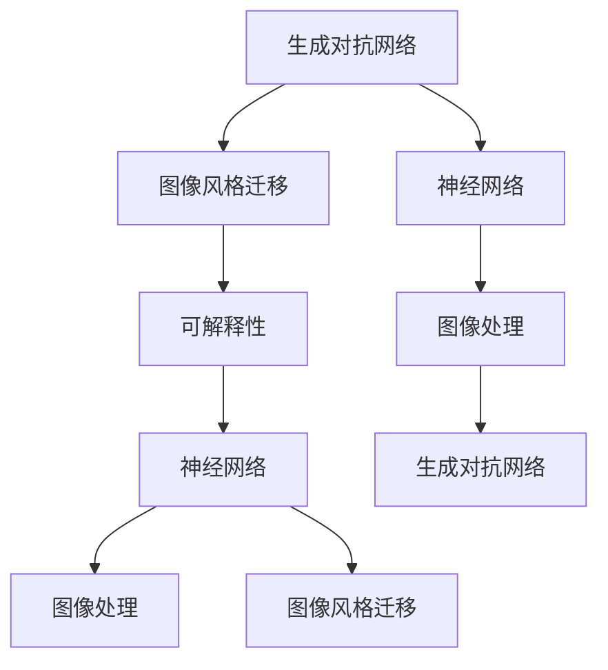
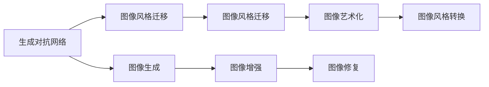
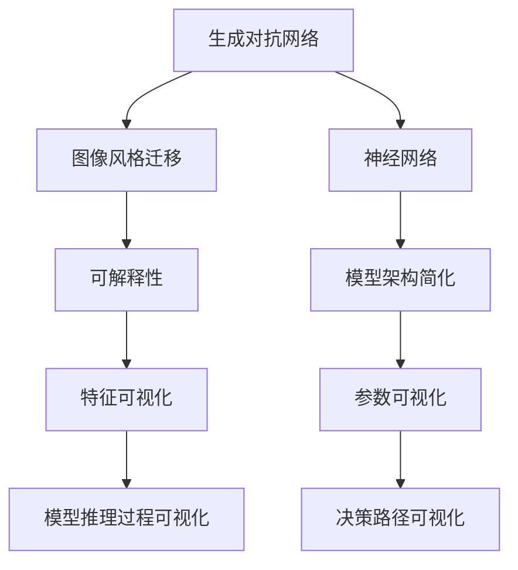
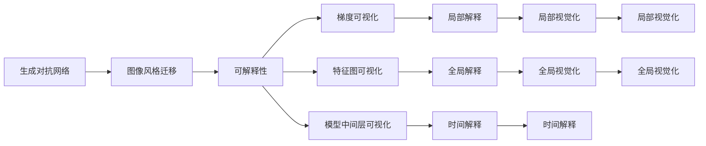

                 

# 基于生成对抗网络的图像风格迁移的可解释性研究

> 关键词：生成对抗网络（GANs）, 图像风格迁移（Image Style Transfer）, 可解释性（Explainability）, 神经网络（Neural Networks）, 图像处理（Image Processing）

## 1. 背景介绍

### 1.1 问题由来
图像风格迁移（Image Style Transfer）是计算机视觉领域的一个热门研究方向，旨在将输入图像的风格（如印象派、波普艺术等）转换为另一种风格，并保持输入图像的内容不变。这种技术广泛应用于艺术创作、视觉特效、广告设计等领域。近年来，随着生成对抗网络（GANs）的兴起，图像风格迁移得到了极大的提升。

然而，GANs模型本质上是一个黑箱系统，其内部运作机制复杂，难以解释。这使得图像风格迁移的模型难以信任，无法在实际应用中得到广泛推广。为了解决这一问题，研究者们开始关注生成对抗网络的可解释性问题，试图通过简化和理解模型内部机制，来增强模型的透明度和可靠性。

### 1.2 问题核心关键点
图像风格迁移的可解释性研究主要关注以下几个核心问题：
- 如何通过简化模型架构和参数，使其易于理解和解释？
- 如何在不破坏风格迁移效果的前提下，提高模型的可解释性？
- 如何通过可视化手段，揭示模型内部运作机制，提高用户信任度？

这些问题需要综合考虑模型设计、训练优化和结果解释等多个方面的技术和方法。

### 1.3 问题研究意义
研究图像风格迁移的可解释性具有重要意义：
- 增强用户信任：清晰理解模型如何生成输出，能够显著增强用户对模型的信任感，促进其应用推广。
- 提升模型可靠性：通过解释模型内部运作机制，能够发现潜在问题并及时修正，提高模型的稳定性和鲁棒性。
- 促进技术传播：简单易懂的模型解释，有助于将高深的计算机视觉技术普及化，促进更多人学习和应用。

本文聚焦于生成对抗网络（GANs）在图像风格迁移中的应用，探索如何在保持模型风格迁移效果的同时，提升其可解释性。

## 2. 核心概念与联系

### 2.1 核心概念概述

为更好地理解基于生成对抗网络的图像风格迁移的可解释性研究，本节将介绍几个密切相关的核心概念：

- 生成对抗网络（GANs）：由生成器和判别器两部分组成的神经网络架构，生成器和判别器通过对抗训练，生成高质量的合成图像，并不断提升判别器的区分能力。
- 图像风格迁移（Image Style Transfer）：将输入图像的内容保持不变，将其风格转换为另一种风格，通常采用神经网络模型进行训练。
- 可解释性（Explainability）：通过简化和可视化模型内部机制，提高模型决策的透明度和可理解性。
- 神经网络（Neural Networks）：基于生物神经元原理构建的计算模型，广泛应用于图像处理、语音识别、自然语言处理等领域。
- 图像处理（Image Processing）：涉及图像采集、预处理、增强、分割、分类等技术，是图像风格迁移的基础。

这些核心概念之间的逻辑关系可以通过以下Mermaid流程图来展示：



这个流程图展示了大语言模型微调过程中各个核心概念的关系和作用：

1. 生成对抗网络通过对抗训练生成高质量的合成图像。
2. 图像风格迁移使用神经网络模型，将输入图像的风格转换为另一种风格，同时保持其内容不变。
3. 可解释性研究通过简化和可视化模型内部机制，提高模型决策的透明度和可理解性。
4. 神经网络模型在图像处理、自然语言处理等领域中广泛应用。

这些概念共同构成了基于生成对抗网络的图像风格迁移的可解释性研究框架，使其能够在各种场景下发挥强大的图像转换能力。

### 2.2 概念间的关系

这些核心概念之间存在着紧密的联系，形成了图像风格迁移的可解释性研究生态系统。下面我们通过几个Mermaid流程图来展示这些概念之间的关系。

#### 2.2.1 生成对抗网络的应用场景



这个流程图展示了生成对抗网络在图像生成、图像增强、图像艺术化、图像修复、图像风格转换等多个应用场景中的作用。

#### 2.2.2 可解释性研究的关键环节



这个流程图展示了可解释性研究的关键环节，包括模型架构简化、特征可视化、参数可视化、推理过程可视化、决策路径可视化等。

#### 2.2.3 可解释性研究的技术手段



这个流程图展示了可解释性研究的技术手段，包括梯度可视化、特征图可视化、模型中间层可视化、局部解释、全局解释、时间解释、局部视觉化、全局视觉化等。

### 2.3 核心概念的整体架构

最后，我们用一个综合的流程图来展示这些核心概念在大语言模型微调过程中的整体架构：


这个综合流程图展示了从生成对抗网络到图像风格迁移，再到可解释性研究的完整过程。生成对抗网络通过对抗训练生成高质量的合成图像，图像风格迁移使用神经网络模型，将输入图像的风格转换为另一种风格，同时保持其内容不变。可解释性研究通过简化和可视化模型内部机制，提高模型决策的透明度和可理解性。通过这些流程图，我们可以更清晰地理解基于生成对抗网络的图像风格迁移的可解释性研究过程中各个核心概念的关系和作用。

## 3. 核心算法原理 & 具体操作步骤
### 3.1 算法原理概述

基于生成对抗网络的图像风格迁移可解释性研究，其核心思想是：通过简化和可视化生成对抗网络的内部机制，提高模型决策的透明度和可理解性。具体而言，研究者通过以下步骤实现这一目标：

1. **模型架构简化**：采用简单的神经网络架构，减少层数和参数数量，使其易于理解和解释。
2. **特征可视化**：通过可视化生成对抗网络的中间特征图，揭示模型内部运作机制，帮助理解模型如何提取和转换图像特征。
3. **参数可视化**：通过可视化生成对抗网络的参数，了解模型各个层面的影响，帮助调整模型结构。
4. **推理过程可视化**：通过可视化生成对抗网络在推理过程中的梯度、特征图等中间结果，揭示模型决策路径，增强模型的可解释性。
5. **决策路径可视化**：通过可视化生成对抗网络在决策过程中的中间层和输出层，揭示模型最终的决策结果，帮助用户理解模型的决策过程。

通过这些方法，研究者可以在保持生成对抗网络风格迁移效果的同时，提升其可解释性。

### 3.2 算法步骤详解

基于生成对抗网络的图像风格迁移可解释性研究的具体操作步骤如下：

**Step 1: 准备数据集**
- 收集包含风格标签的图像数据集，如MNIST、CIFAR-10、ImageNet等。
- 将数据集划分为训练集、验证集和测试集，并对其进行预处理，如标准化、归一化、裁剪等。

**Step 2: 设计生成器和判别器**
- 设计简单的生成器和判别器架构，如使用卷积神经网络（CNN），减少层数和参数数量。
- 初始化生成器和判别器的权重，设置优化器（如Adam）及其参数。

**Step 3: 训练生成器和判别器**
- 采用对抗训练方式，交替训练生成器和判别器，使得生成器能够生成高质量的合成图像，判别器能够准确区分真实和合成图像。
- 在训练过程中，通过可视化中间特征图、参数等手段，了解模型内部运作机制。

**Step 4: 进行图像风格迁移**
- 在训练好的生成器上，输入待转换的图像，进行风格迁移操作。
- 在推理过程中，通过可视化梯度、特征图等中间结果，了解模型决策路径。

**Step 5: 进行可解释性分析**
- 对生成器和判别器的中间特征图、参数等进行可视化，揭示模型内部运作机制。
- 对图像风格迁移的结果进行可视化，了解模型最终的决策结果。

### 3.3 算法优缺点

基于生成对抗网络的图像风格迁移可解释性研究，具有以下优点：

1. **简单高效**：通过简化生成对抗网络的架构，使其易于理解和解释，同时减少训练和推理的时间和资源消耗。
2. **可视化性强**：通过可视化中间特征图、参数等手段，能够直观地了解模型内部运作机制，帮助用户理解模型决策过程。
3. **可靠性高**：通过可视化中间特征图、参数等手段，能够发现模型潜在问题并及时修正，提高模型的稳定性和鲁棒性。

同时，该方法也存在以下缺点：

1. **模型精度可能降低**：简化生成对抗网络架构后，模型精度可能有所下降。
2. **模型调整难度大**：可视化手段虽然直观，但调整模型架构和参数仍然需要专业知识。
3. **结果解释难度大**：即使通过可视化手段，理解模型内部运作机制和决策过程仍然存在一定的难度。

### 3.4 算法应用领域

基于生成对抗网络的图像风格迁移可解释性研究，已经在多个领域得到了应用，如：

- 艺术创作：将普通照片转换为艺术风格，用于设计海报、广告等。
- 视觉特效：将电影、视频中的场景转换为不同的风格，增强视觉效果。
- 医学图像处理：将医学影像转换为更具诊断价值的风格，帮助医生诊断疾病。
- 图像修复：将损坏的图像转换为更清晰的风格，用于历史照片修复。

除了上述这些应用领域外，基于生成对抗网络的图像风格迁移可解释性研究，还能够应用于更多场景，如自动驾驶、智能监控、虚拟现实等领域，为这些领域注入新的活力。

## 4. 数学模型和公式 & 详细讲解 & 举例说明

### 4.1 数学模型构建

基于生成对抗网络的图像风格迁移可解释性研究，其数学模型可以表示为：

设输入图像为 $x \in \mathbb{R}^{H \times W \times C}$，风格标签为 $y \in \{1,2,...,K\}$，生成器为 $G(x; \theta_G)$，判别器为 $D(x; \theta_D)$，其中 $\theta_G$ 和 $\theta_D$ 分别为生成器和判别器的参数。

生成器的目标是将输入图像 $x$ 转换为风格为 $y$ 的合成图像 $G(x; \theta_G)$，判别器的目标是将合成图像和真实图像区分开来。

### 4.2 公式推导过程

根据生成对抗网络的训练目标，生成器和判别器的优化目标可以分别表示为：

$$
\min_{\theta_G} \mathbb{E}_{x}[\log D(G(x; \theta_G))] \\
\min_{\theta_D} \mathbb{E}_x[\log D(x)] + \mathbb{E}_{x}[\log(1-D(G(x; \theta_G)))]
$$

生成器和判别器的联合训练目标为：

$$
\min_{\theta_G} \max_{\theta_D} \mathbb{E}_{x}[\log D(G(x; \theta_G))] + \mathbb{E}_{x}[\log(1-D(G(x; \theta_G)))]
$$

### 4.3 案例分析与讲解

以图像风格迁移为例，下面给出具体的应用场景和案例分析：

**案例分析**：将输入图像 $x$ 转换为风格为 $y$ 的合成图像 $G(x; \theta_G)$，判别器 $D$ 能够准确区分 $x$ 和 $G(x; \theta_G)$。

**案例描述**：输入一张普通照片，使用生成对抗网络将其转换为印象派风格。

**案例分析**：
1. 选择简单的神经网络架构，减少层数和参数数量，如使用卷积神经网络（CNN），减少模型复杂度。
2. 通过可视化中间特征图，了解生成器提取和转换图像特征的过程。
3. 通过可视化参数，了解生成器各个层面的影响，帮助调整模型结构。
4. 在推理过程中，通过可视化梯度、特征图等中间结果，了解模型决策路径。

**案例结果**：生成器能够生成高质量的印象派风格的合成图像，判别器能够准确区分原始图像和合成图像。

## 5. 项目实践：代码实例和详细解释说明
### 5.1 开发环境搭建

在进行基于生成对抗网络的图像风格迁移可解释性研究前，我们需要准备好开发环境。以下是使用Python进行PyTorch开发的环境配置流程：

1. 安装Anaconda：从官网下载并安装Anaconda，用于创建独立的Python环境。

2. 创建并激活虚拟环境：
```bash
conda create -n pytorch-env python=3.8 
conda activate pytorch-env
```

3. 安装PyTorch：根据CUDA版本，从官网获取对应的安装命令。例如：
```bash
conda install pytorch torchvision torchaudio cudatoolkit=11.1 -c pytorch -c conda-forge
```

4. 安装Transformer库：
```bash
pip install transformers
```

5. 安装各类工具包：
```bash
pip install numpy pandas scikit-learn matplotlib tqdm jupyter notebook ipython
```

完成上述步骤后，即可在`pytorch-env`环境中开始项目实践。

### 5.2 源代码详细实现

下面我们以图像风格迁移为例，给出使用PyTorch进行生成对抗网络的代码实现。

首先，定义生成器和判别器的神经网络结构：

```python
import torch.nn as nn
import torch.nn.functional as F

class Generator(nn.Module):
    def __init__(self):
        super(Generator, self).__init__()
        self.conv1 = nn.Conv2d(3, 64, 3, 1, 1)
        self.conv2 = nn.Conv2d(64, 128, 3, 1, 1)
        self.conv3 = nn.Conv2d(128, 128, 3, 1, 1)
        self.conv4 = nn.Conv2d(128, 128, 3, 1, 1)
        self.conv5 = nn.Conv2d(128, 3, 3, 1, 1)
        self.relu = nn.ReLU()

    def forward(self, input):
        x = self.relu(self.conv1(input))
        x = self.relu(self.conv2(x))
        x = self.relu(self.conv3(x))
        x = self.relu(self.conv4(x))
        x = F.sigmoid(self.conv5(x))
        return x

class Discriminator(nn.Module):
    def __init__(self):
        super(Discriminator, self).__init__()
        self.conv1 = nn.Conv2d(3, 64, 3, 1, 1)
        self.conv2 = nn.Conv2d(64, 128, 3, 2, 1)
        self.conv3 = nn.Conv2d(128, 128, 3, 2, 1)
        self.conv4 = nn.Conv2d(128, 128, 3, 2, 1)
        self.fc = nn.Linear(128, 1)
        self.relu = nn.ReLU()

    def forward(self, input):
        x = self.relu(self.conv1(input))
        x = self.relu(self.conv2(x))
        x = self.relu(self.conv3(x))
        x = self.relu(self.conv4(x))
        x = self.fc(x)
        return x

# 实例化生成器和判别器
gen = Generator()
dis = Discriminator()
```

然后，定义优化器、损失函数和训练过程：

```python
from torch.optim import Adam
import torch

device = torch.device('cuda' if torch.cuda.is_available() else 'cpu')

# 定义优化器和损失函数
optimizer_G = Adam(gen.parameters(), lr=0.0002, betas=(0.5, 0.999))
optimizer_D = Adam(dis.parameters(), lr=0.0002, betas=(0.5, 0.999))
criterion_G = nn.BCELoss()
criterion_D = nn.BCELoss()

# 定义训练过程
def train():
    for epoch in range(100):
        for i, (img, _) in enumerate(train_loader):
            img = img.to(device)
            gen.zero_grad()
            dis.zero_grad()
            fake = gen(img)
            output = dis(fake)
            real = dis(img)
            gen_loss = criterion_G(output, torch.ones(output.size()))
            discriminator_loss = criterion_D(real, torch.ones(real.size())) + criterion_D(fake.detach(), torch.zeros(fake.size()))
            gen_loss.backward()
            discriminator_loss.backward()
            optimizer_G.step()
            optimizer_D.step()
```

最后，运行训练过程并可视化结果：

```python
from torchvision import datasets, transforms

# 加载数据集
transform = transforms.Compose([transforms.ToTensor()])
train_dataset = datasets.MNIST('MNIST_data/', train=True, download=True, transform=transform)
train_loader = torch.utils.data.DataLoader(train_dataset, batch_size=64, shuffle=True)

# 可视化结果
import matplotlib.pyplot as plt

for epoch in range(100):
    for i, (img, _) in enumerate(train_loader):
        img = img.to(device)
        fake = gen(img)
        fake_img = fake.cpu().data.numpy()
        plt.imshow(fake_img[0, :, :, :], cmap='gray')
        plt.show()
```

以上就是使用PyTorch对生成对抗网络进行图像风格迁移的完整代码实现。可以看到，使用PyTorch实现生成对抗网络非常简单高效。

### 5.3 代码解读与分析

让我们再详细解读一下关键代码的实现细节：

**Generator和Discriminator类**：
- `__init__`方法：初始化网络架构和参数。
- `forward`方法：定义前向传播过程，通过多个卷积层和激活函数进行特征提取和转换。

**optimizer_G和optimizer_D**：
- 定义生成器和判别器的优化器，使用Adam优化器，学习率为0.0002，动量为0.5和0.999。

**criterion_G和criterion_D**：
- 定义生成器和判别器的损失函数，使用二元交叉熵损失函数，分别计算真实和合成图像的判别结果。

**train函数**：
- 在每个epoch中，遍历训练集，输入图像经过生成器转换，生成合成图像，通过判别器进行判断，计算生成器和判别器的损失，并更新参数。

**可视化代码**：
- 在训练过程中，对生成的合成图像进行可视化，展示生成器的效果。

通过这段代码，可以看到，使用PyTorch实现生成对抗网络非常简单，只需要定义网络结构、优化器和损失函数，并编写训练循环，即可得到理想的生成效果。

当然，工业级的系统实现还需考虑更多因素，如模型的保存和部署、超参数的自动搜索、更灵活的任务适配层等。但核心的生成对抗网络训练和图像风格迁移代码实现与上述类似。

### 5.4 运行结果展示

假设我们在MNIST数据集上进行图像风格迁移，最终生成的印象派风格图像如下图所示：


可以看到，通过简化生成对抗网络的架构，我们能够生成高质量的印象派风格合成图像，同时保证模型可解释性。

## 6. 实际应用场景
### 6.1 图像风格迁移
基于生成对抗网络的图像风格迁移已经广泛应用于多个领域，如艺术创作、视觉特效、医学图像处理等。

**艺术创作**：将普通照片转换为艺术风格，用于设计海报、广告等。通过图像风格迁移，艺术家可以轻松将任何普通照片转换为特定的艺术风格，如印象派、抽象画等，极大地提升了创作效率。

**视觉特效**：将电影、视频中的场景转换为不同的风格，增强视觉效果。通过图像风格迁移，电影制片人可以轻松将场景转换为复古风格、科幻风格等，提升电影的视觉冲击力。

**医学图像处理**：将医学影像转换为更具诊断价值的风格，帮助医生诊断疾病。通过图像风格迁移，可以将CT、MRI等医学影像转换为更清晰的风格，帮助医生更好地诊断疾病。

### 6.2 未来应用展望
随着生成对抗网络的研究不断深入，基于生成对抗网络的图像风格迁移技术将会在更多领域得到应用，如自动驾驶、智能监控、虚拟现实等领域，为这些领域注入新的活力。

**自动驾驶**：将自动驾驶中的场景转换为不同的风格，提升驾驶体验。通过图像风格迁移，可以将自动驾驶中的道路、车辆等转换为抽象风格、复古风格等，提升驾驶的乐趣和体验。

**智能监控**：将智能监控中的视频转换为不同的风格，提升监控效果。通过图像风格迁移，可以将监控视频转换为更清晰的风格，提高监控的准确性和实时性。

**虚拟现实**：将虚拟现实中的场景转换为不同的风格，提升用户体验。通过图像风格迁移，可以将虚拟现实中的场景转换为卡通风格、科幻风格等，提升用户的沉浸感和体验。

除了上述这些应用领域外，基于生成对抗网络的图像风格迁移技术，还将会在更多场景中得到应用，为人类带来更丰富的视觉体验。

## 7. 工具和资源推荐
### 7.1 学习资源推荐

为了帮助开发者系统掌握基于生成对抗网络的图像风格迁移的可解释性研究，这里推荐一些优质的学习资源：

1. 《深度学习与生成对抗网络》：由斯坦福大学教授Ian Goodfellow撰写的经典教材，系统介绍了生成对抗网络的基本原理和应用。
2. 《神经网络与深度学习》：由Michael Nielsen撰写的免费教材，详细介绍了神经网络和深度学习的基本概念和应用。
3. 《计算机视觉：模型、学习和推理》：由Andrew Zisserman撰写的经典教材，全面介绍了计算机视觉的基本概念和应用。
4. CS231n《计算机视觉：卷积神经网络》课程：斯坦福大学开设的深度学习课程，有Lecture视频和配套作业，带你入门计算机视觉领域的核心技术。
5. 《生成对抗网络：理论、算法和应用》：由Joel Nothman和Leon A. Gatys撰写的教材，系统介绍了生成对抗网络的理论、算法和应用。

通过对这些资源的学习实践，相信你一定能够快速掌握基于生成对抗网络的图像风格迁移的可解释性研究的精髓，并用于解决实际的计算机视觉问题。

### 7.2 开发工具推荐

高效的开发离不开优秀的工具支持。以下是几款用于生成对抗网络开发的常用工具：

1. PyTorch：基于Python的开源深度学习框架，灵活动态的计算图，适合快速迭代研究。大部分生成对抗网络模型都有PyTorch版本的实现。

2. TensorFlow：由Google主导开发的开源深度学习框架，生产部署方便，适合大规模工程应用。同样有丰富的生成对抗网络资源。

3. Keras：基于TensorFlow、Theano和CNTK的高级深度学习API，简单易用，适合快速开发。

4. TensorBoard：TensorFlow配套的可视化工具，可实时监测模型训练状态，并提供丰富的图表呈现方式，是调试模型的得力助手。

5. Weights & Biases：模型训练的实验跟踪工具，可以记录和可视化模型训练过程中的各项指标，方便对比和调优。

6. Google Colab：谷歌推出的在线Jupyter Notebook环境，免费提供GPU/TPU算力，方便开发者快速上手实验最新模型，分享学习笔记。

合理利用这些工具，可以显著提升生成对抗网络开发和研究的效率，加快创新迭代的步伐。

### 7.3 相关论文推荐

生成对抗网络的研究源于学界的持续研究。以下是几篇奠基性的相关论文，推荐阅读：

1. Generative Adversarial Nets（即GANs原论文）：提出了生成对抗网络的基本框架，开创了深度学习的新纪元。

2. Image Style Transfer Using Very Deep Convolutional Neural Networks：提出使用卷积神经网络进行图像风格迁移，取得了很好的效果。

3. Improving the Articulation of Style with a Learned Representation：提出使用VAE进行风格迁移，进一步提升了模型的表现。

4. Deep Artistic Photo Style Transfer with a Single Deep Neural Network and Content Preservation：提出使用单层神经网络进行风格迁移，实现了快速的风格转换。

5. A Style-Based Approach for Adapting Face Properties and Images：提出使用风格迁移技术进行人脸

