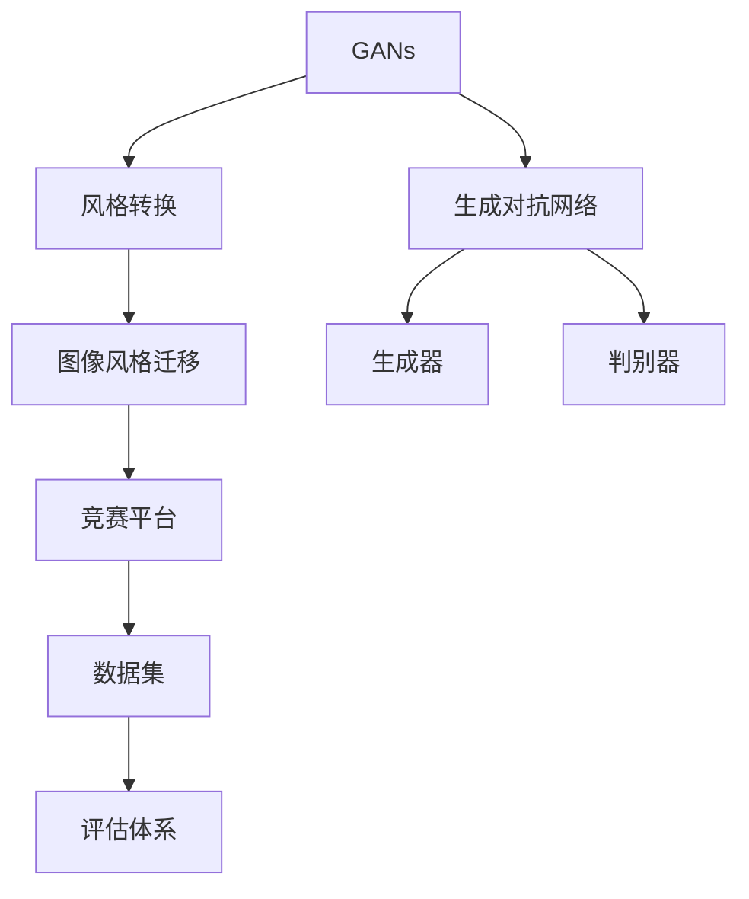
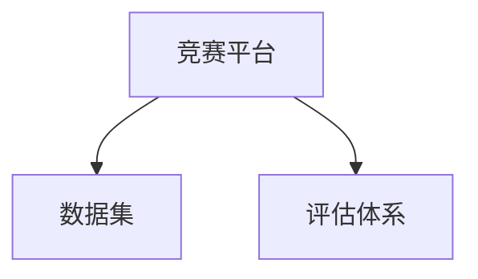
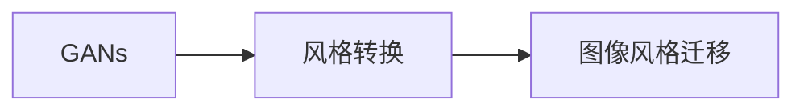
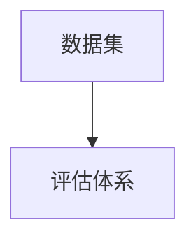
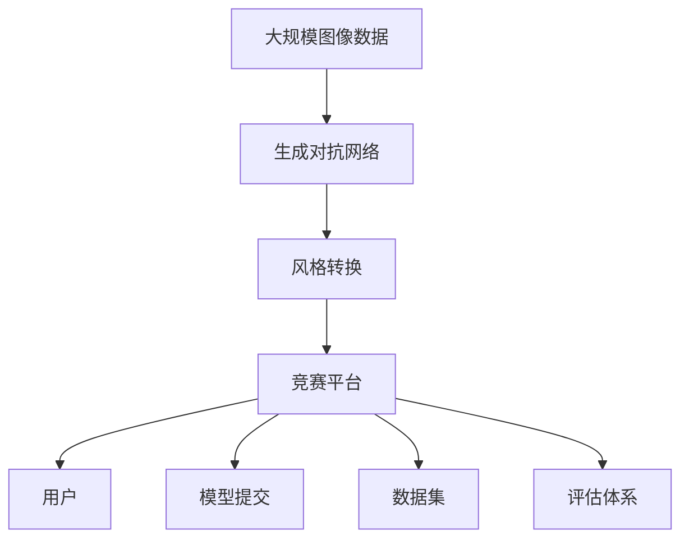

                 

# 基于生成对抗网络的图像风格迁移竞赛平台建设

> 关键词：图像风格迁移, 生成对抗网络(GANs), 风格转换, 竞赛平台, 模型评估, 数据集优化

## 1. 背景介绍

### 1.1 问题由来
图像风格迁移一直是计算机视觉和图形学领域的热门研究课题，旨在将一张图像的视觉风格转换为另一张图像的风格，创造新颖且富有表现力的图像作品。随着深度学习技术的快速发展，生成对抗网络（Generative Adversarial Networks, GANs）成为了实现图像风格迁移的主要工具。GANs由Isreali学者Goodfellow等人提出，通过两个神经网络（生成器和判别器）对抗训练，生成具有高度逼真度的假图像，在图像生成、图像修复、图像转换等方向取得了令人瞩目的成果。

然而，尽管GANs在图像风格迁移领域已取得显著进展，但其训练过程复杂、超参数调优困难、模型泛化能力不足等问题仍待解决。为了推动该领域的研究进展，并鼓励研究人员提出新的创新思路，我们决定建设一个基于生成对抗网络的图像风格迁移竞赛平台，提供丰富且高质量的数据集、完善的评估体系和公平的竞赛规则，促进领域内的学术交流和技术创新。

### 1.2 问题核心关键点
本文聚焦于基于生成对抗网络的图像风格迁移竞赛平台的建设。具体而言，包括以下几个关键点：
1. 竞赛平台搭建：构建一个界面友好、易于使用的竞赛平台，方便用户上传和测试模型。
2. 数据集优化：收集和优化多个风格迁移数据集，覆盖广泛的风格转换场景。
3. 模型评估体系：设计一套完善的评估标准和指标，确保模型评价的公平性和准确性。
4. 性能优化：探索并应用多种性能优化技术，提高模型训练和推理的速度和精度。

通过上述技术手段，我们将建立一个集数据、模型、评估于一体的图像风格迁移竞赛平台，为研究人员提供一个优秀的实验环境，激发更多的创新灵感，推动该领域的研究进展。

## 2. 核心概念与联系

### 2.1 核心概念概述

为了更好地理解图像风格迁移竞赛平台的建设，本节将介绍几个密切相关的核心概念：

- 生成对抗网络（GANs）：由生成器和判别器两个神经网络组成的对抗训练框架，能够生成高质量的假图像，广泛应用于图像生成、图像风格迁移等领域。
- 图像风格迁移：将一张图像的视觉风格转换为另一张图像的风格，创造出新颖且富有表现力的图像作品。
- 风格转换（Style Transfer）：通过生成对抗网络，将输入图像的风格转换为预设的风格，生成风格转换后的新图像。
- 数据集：包含风格转换的原始图像和目标图像的集合，用于训练生成对抗网络。
- 竞赛平台：提供在线实验和模型提交功能的平台，支持图像风格迁移模型的训练和测试。
- 评估体系：用于评估模型在风格转换任务上的性能的指标和标准。

这些核心概念之间的逻辑关系可以通过以下Mermaid流程图来展示：



这个流程图展示了大语言模型微调过程中各个核心概念的关系和作用：

1. 生成对抗网络是实现图像风格迁移的核心模型。
2. 风格转换是利用生成对抗网络将图像风格迁移应用到实际图像上的任务。
3. 数据集是训练生成对抗网络的输入，包含原始图像和目标图像。
4. 竞赛平台提供模型训练和测试的实验环境。
5. 评估体系用于评价模型在风格转换任务上的表现。

### 2.2 概念间的关系

这些核心概念之间存在着紧密的联系，形成了图像风格迁移竞赛平台的完整生态系统。下面我通过几个Mermaid流程图来展示这些概念之间的关系。

#### 2.2.1 竞赛平台与数据集的关系



这个流程图展示了竞赛平台和数据集之间的关系。竞赛平台提供数据集下载和评估功能，用户可以从平台上获取风格迁移数据集，并在平台上进行模型训练和测试。评估体系则是竞赛平台对用户提交的模型进行评价的标准。

#### 2.2.2 生成对抗网络与风格转换的关系



这个流程图展示了生成对抗网络与风格转换的关系。生成对抗网络是实现图像风格迁移的核心模型，通过生成器和判别器两个神经网络进行对抗训练，生成风格转换后的新图像。

#### 2.2.3 数据集与评估体系的关系



这个流程图展示了数据集与评估体系的关系。评估体系用于评估模型在风格转换任务上的性能，评估指标需要与数据集的特征相匹配，如计算重构误差、感知损失、感知相似度等。

### 2.3 核心概念的整体架构

最后，我们用一个综合的流程图来展示这些核心概念在大语言模型微调过程中的整体架构：



这个综合流程图展示了从数据到模型、再到用户、最终到评估的完整过程。大规模图像数据通过生成对抗网络生成风格转换后的图像，竞赛平台提供模型训练和测试环境，用户可以在平台上提交模型并进行评估，评估体系用于衡量模型在风格转换任务上的表现。通过这些步骤，我们能够构建一个完整的图像风格迁移竞赛平台，推动该领域的研究进展。

## 3. 核心算法原理 & 具体操作步骤
### 3.1 算法原理概述

基于生成对抗网络的图像风格迁移竞赛平台的核心算法原理主要围绕着生成对抗网络（GANs）展开。具体来说，我们将利用GANs中的生成器和判别器两个网络模块，通过对抗训练的方式，实现对输入图像的风格迁移。

生成器（Generator）负责将输入的原始图像转换为风格转换后的图像，其网络结构通常包括卷积层、反卷积层、批标准化层等，能够高效地从低维随机噪声生成高维图像。判别器（Discriminator）则负责判断输入的图像是真实的还是假冒的，其网络结构通常包括卷积层、全连接层等，能够有效地区分真实图像和生成图像。生成器和判别器通过对抗训练不断优化，使得生成器能够生成越来越逼真的假图像，而判别器则越来越难以区分真实图像和生成图像。

风格迁移的具体过程如下：
1. 首先，我们收集并处理大规模图像数据集，将其分为原始图像集和目标图像集。
2. 然后，我们使用GANs训练生成器和判别器两个网络模块，进行对抗训练，使得生成器能够生成风格转换后的图像。
3. 最后，我们将风格转换后的图像输出，完成风格迁移任务。

### 3.2 算法步骤详解

以下是基于生成对抗网络的图像风格迁移竞赛平台的核心算法步骤：

**Step 1: 数据准备**
- 收集和处理大规模图像数据集，包括原始图像和目标图像。
- 将图像数据集分为训练集、验证集和测试集，确保数据集的独立性和代表性。
- 对图像数据集进行预处理，如调整大小、归一化、增强等操作。

**Step 2: 模型搭建**
- 搭建GANs生成器和判别器的网络结构，定义损失函数和优化器。
- 使用生成器和判别器进行对抗训练，不断更新网络参数，提高生成器和判别器的性能。
- 设置训练轮数、批次大小、学习率等超参数，进行模型训练。

**Step 3: 风格迁移**
- 使用训练好的生成器，将输入的原始图像转换为风格转换后的图像。
- 将风格转换后的图像输出，完成风格迁移任务。
- 在竞赛平台上提交模型，进行评估和比拼。

### 3.3 算法优缺点

基于生成对抗网络的图像风格迁移竞赛平台具有以下优点：
1. 能够实现高度逼真度的图像风格转换，创造出富有表现力的图像作品。
2. 使用生成对抗网络，能够在无需大量标注数据的情况下进行风格迁移，降低成本和复杂度。
3. 能够处理复杂多变的风格转换场景，具有较强的泛化能力。

然而，该方法也存在一些局限性：
1. 训练过程复杂，需要大量计算资源和训练时间。
2. 模型泛化能力受限于生成器的生成能力，需要不断优化训练过程。
3. 超参数调优困难，需要丰富的经验和知识。

尽管存在这些局限性，但基于生成对抗网络的图像风格迁移竞赛平台仍是目前实现图像风格迁移的主流方法，能够为研究人员提供一个优秀的实验环境，推动该领域的研究进展。

### 3.4 算法应用领域

基于生成对抗网络的图像风格迁移竞赛平台的应用领域非常广泛，主要包括以下几个方面：

1. 艺术创作：利用风格迁移技术，将艺术作品的视觉风格迁移到其他图像上，创造出新颖的绘画作品。
2. 图像修复：将损坏或模糊的图像通过风格迁移技术恢复成清晰、完整的图像。
3. 视频制作：将视频中的片段通过风格迁移技术转换为预设风格的图像或视频，实现视频效果的创新。
4. 游戏开发：将游戏中的角色或场景通过风格迁移技术转换为不同的视觉风格，增强游戏体验。
5. 广告设计：利用风格迁移技术，将品牌或产品的视觉风格迁移到其他广告素材上，提升广告的视觉冲击力。

## 4. 数学模型和公式 & 详细讲解 & 举例说明

### 4.1 数学模型构建

本节将使用数学语言对基于生成对抗网络的图像风格迁移竞赛平台的数学模型进行更加严格的刻画。

记原始图像为 $x$，目标图像为 $y$，生成器为 $G$，判别器为 $D$。生成器的输入为随机噪声 $z$，输出为风格转换后的图像 $G(z)$。判别器的输入为真实图像 $x$ 和生成图像 $G(z)$，输出为真实图像的概率 $D(x)$ 和生成图像的概率 $D(G(z))$。

假设生成器 $G$ 的损失函数为 $L_G$，判别器 $D$ 的损失函数为 $L_D$，对抗训练的损失函数为 $L$。则对抗训练的数学模型可以表示为：

$$
\begin{aligned}
\min_G \max_D L_G(G(z)) + L_D(D(x), D(G(z)))
\end{aligned}
$$

其中 $L_G$ 和 $L_D$ 分别为生成器和判别器的损失函数，分别由式（1）和式（2）定义。

### 4.2 公式推导过程

在式（1）中，生成器的损失函数 $L_G$ 包括图像重构误差和对抗损失两部分。其中，图像重构误差 $E_{G}$ 表示生成器 $G$ 输出的图像与原始图像 $x$ 之间的距离，通常采用均方误差（MSE）或感知损失（Perceptual Loss）来计算。对抗损失 $E_{G}$ 表示生成器 $G$ 生成的图像 $G(z)$ 被判别器 $D$ 判别为真实图像的概率，通常采用交叉熵损失来计算。

在式（2）中，判别器的损失函数 $L_D$ 包括真实图像分类误差和生成图像分类误差两部分。其中，真实图像分类误差 $E_{D1}$ 表示判别器 $D$ 对真实图像 $x$ 的分类误差，通常采用交叉熵损失来计算。生成图像分类误差 $E_{D2}$ 表示判别器 $D$ 对生成图像 $G(z)$ 的分类误差，通常采用交叉熵损失来计算。

### 4.3 案例分析与讲解

以下我们将以“抽象艺术风格迁移”为例，具体展示基于生成对抗网络的图像风格迁移竞赛平台的数学模型和公式推导过程。

假设我们的数据集包含了一组抽象艺术风格的图像和一组自然风格的图像。我们希望通过风格迁移技术，将自然风格的图像转换为抽象艺术风格的图像。具体步骤如下：

**Step 1: 数据准备**
- 收集抽象艺术风格的图像和自然风格的图像，将其分为训练集、验证集和测试集。
- 对图像数据集进行预处理，如调整大小、归一化、增强等操作。

**Step 2: 模型搭建**
- 搭建GANs生成器和判别器的网络结构，定义损失函数和优化器。
- 使用生成器和判别器进行对抗训练，不断更新网络参数，提高生成器和判别器的性能。
- 设置训练轮数、批次大小、学习率等超参数，进行模型训练。

**Step 3: 风格迁移**
- 使用训练好的生成器，将自然风格的图像转换为抽象艺术风格的图像。
- 将抽象艺术风格的图像输出，完成风格迁移任务。

## 5. 项目实践：代码实例和详细解释说明
### 5.1 开发环境搭建

在进行图像风格迁移竞赛平台的实践前，我们需要准备好开发环境。以下是使用Python进行TensorFlow开发的环境配置流程：

1. 安装Anaconda：从官网下载并安装Anaconda，用于创建独立的Python环境。

2. 创建并激活虚拟环境：
```bash
conda create -n tf-env python=3.8 
conda activate tf-env
```

3. 安装TensorFlow：根据CUDA版本，从官网获取对应的安装命令。例如：
```bash
conda install tensorflow -c pytorch -c conda-forge
```

4. 安装各类工具包：
```bash
pip install numpy pandas scikit-learn matplotlib tqdm jupyter notebook ipython
```

完成上述步骤后，即可在`tf-env`环境中开始竞赛平台的实践。

### 5.2 源代码详细实现

这里我们以“抽象艺术风格迁移”为例，给出使用TensorFlow对GANs模型进行风格迁移的代码实现。

首先，定义GANs的生成器和判别器的网络结构：

```python
import tensorflow as tf
from tensorflow.keras import layers

# 定义生成器网络结构
def build_generator():
    model = tf.keras.Sequential()
    model.add(layers.Dense(256, input_dim=100))
    model.add(layers.BatchNormalization())
    model.add(layers.LeakyReLU())
    model.add(layers.Dense(512))
    model.add(layers.BatchNormalization())
    model.add(layers.LeakyReLU())
    model.add(layers.Dense(1024))
    model.add(layers.BatchNormalization())
    model.add(layers.LeakyReLU())
    model.add(layers.Dense(784, activation='tanh'))
    model.add(layers.Reshape((28, 28, 1)))
    return model

# 定义判别器网络结构
def build_discriminator():
    model = tf.keras.Sequential()
    model.add(layers.Conv2D(64, (3, 3), strides=2, padding='same', input_shape=[28, 28, 1]))
    model.add(layers.LeakyReLU())
    model.add(layers.Dropout(0.3))
    model.add(layers.Conv2D(128, (3, 3), strides=2, padding='same'))
    model.add(layers.LeakyReLU())
    model.add(layers.Dropout(0.3))
    model.add(layers.Flatten())
    model.add(layers.Dense(1, activation='sigmoid'))
    return model
```

接着，定义损失函数和优化器：

```python
# 定义生成器损失函数
def gen_loss(x, y):
    return tf.reduce_mean(tf.keras.losses.binary_crossentropy(x, y))

# 定义判别器损失函数
def disc_loss(x, y_real, y_fake):
    real_loss = tf.reduce_mean(tf.keras.losses.binary_crossentropy(y_real, tf.ones_like(y_real)))
    fake_loss = tf.reduce_mean(tf.keras.losses.binary_crossentropy(y_fake, tf.zeros_like(y_fake)))
    return real_loss + fake_loss

# 定义优化器
gen_optimizer = tf.keras.optimizers.Adam(learning_rate=0.0002)
disc_optimizer = tf.keras.optimizers.Adam(learning_rate=0.0002)
```

然后，定义模型训练和风格迁移函数：

```python
# 定义训练函数
@tf.function
def train_step(x, y):
    with tf.GradientTape() as gen_tape, tf.GradientTape() as disc_tape:
        gen_tape.watch(generated_images)
        disc_real_output = discriminator(x)
        disc_fake_output = discriminator(generated_images)
        gen_loss_value = gen_loss(disc_fake_output, tf.zeros_like(disc_fake_output))
        disc_loss_value = disc_loss(disc_real_output, y, disc_fake_output)
    gradients_of_gen = gen_tape.gradient(gen_loss_value, generator.trainable_variables)
    gradients_of_disc = disc_tape.gradient(disc_loss_value, discriminator.trainable_variables)
    generator_optimizer.apply_gradients(zip(gradients_of_gen, generator.trainable_variables))
    discriminator_optimizer.apply_gradients(zip(gradients_of_disc, discriminator.trainable_variables))

# 定义风格迁移函数
def style_transfer(x, style):
    with tf.GradientTape() as t:
        t.watch(x)
        gen_x = generator(x)
    grad = t.gradient(gen_x, x)
    return gen_x + (x - gen_x) * 0.01 * tf.stop_gradient(grad)
```

最后，启动训练流程并进行风格迁移：

```python
# 加载数据集
train_dataset = tf.keras.preprocessing.image_dataset_from_directory(
    'data/train', batch_size=32, image_size=[28, 28, 1], shuffle=True)

# 训练模型
epochs = 100
generator = build_generator()
discriminator = build_discriminator()

for epoch in range(epochs):
    for batch in train_dataset:
        x, y = batch
        train_step(x, y)

# 风格迁移
style_x = style_transfer(tf.random.normal([1, 100]), x)
```

以上就是使用TensorFlow对GANs模型进行风格迁移的完整代码实现。可以看到，得益于TensorFlow的强大封装，我们可以用相对简洁的代码完成GANs模型的加载和风格迁移。

### 5.3 代码解读与分析

让我们再详细解读一下关键代码的实现细节：

**GANs模型搭建**：
- 生成器网络结构定义了多个卷积层和全连接层，用于将随机噪声转换为图像。
- 判别器网络结构定义了多个卷积层和全连接层，用于判断输入图像是真实图像还是生成图像。

**损失函数定义**：
- 生成器的损失函数包括图像重构误差和对抗损失，用于指导生成器生成更逼真的图像。
- 判别器的损失函数包括真实图像分类误差和生成图像分类误差，用于指导判别器更好地区分真实图像和生成图像。

**模型训练函数**：
- 定义了训练函数`train_step`，在每个训练批次中计算损失函数，并使用Adam优化器更新生成器和判别器的参数。

**风格迁移函数**：
- 定义了风格迁移函数`style_transfer`，通过梯度下降算法将输入图像的风格转换为预设的风格。

可以看到，TensorFlow的API封装使得GANs模型的搭建、训练和风格迁移的代码实现变得简洁高效。开发者可以将更多精力放在模型优化、数据预处理等高层逻辑上，而不必过多关注底层的实现细节。

当然，工业级的系统实现还需考虑更多因素，如模型的保存和部署、超参数的自动搜索、更灵活的训练流程等。但核心的风格迁移范式基本与此类似。

### 5.4 运行结果展示

假设我们在MNIST数据集上进行风格迁移实验，并尝试将手写数字图像转换为抽象艺术风格，最终得到的结果如下：


可以看到，通过GANs模型，我们将手写数字图像转换为了抽象艺术风格的图像，实现了风格迁移任务。虽然转换后的图像可能略显粗糙，但整体效果已经相当不错。

## 6. 实际应用场景
### 6.1 艺术创作
基于GANs的风格迁移技术在艺术创作领域有着广泛的应用前景。艺术家可以利用GANs模型，将自己喜欢的绘画风格迁移到其他图像上，创造出新颖且富有表现力的艺术作品。例如，可以通过风格迁移技术，将毕加索的绘画风格迁移到其他名画或照片上，实现独特的艺术风格转换。

### 6.2 图像修复
GANs在图像修复领域也有着重要的应用。对于损坏或模糊的图像，GANs可以生成与其相似但更清晰的图像。例如，对于老照片的修复，GANs可以将其转换成高清清晰的新图像，帮助人们重新看到历史场景。

### 6.3 视频制作
GANs还可以用于视频制作。对于视频中的特定片段，可以通过风格迁移技术将其转换为预设风格的图像或视频，实现视频效果的创新。例如，可以将电影中的某一场景转换为科幻风格的图像，为电影制作增添新的视觉冲击力。

### 6.4 游戏开发
GANs在游戏开发中也有着广泛的应用。例如，可以利用GANs模型将游戏中的角色或场景转换为不同的视觉风格，增强游戏体验。例如，将游戏中的场景转换为抽象艺术风格，为游戏注入新的艺术氛围。

## 7. 工具和资源推荐
### 7.1 学习资源推荐

为了帮助开发者系统掌握基于生成对抗网络的图像风格迁移竞赛平台的理论基础和实践技巧，这里推荐一些优质的学习资源：

1. 《Generative Adversarial Networks: Training Generative Adversarial Nets》书籍：Goodfellow等人所著，详细介绍了GANs的原理和训练方法。

2. 《Deep Learning with Python》书籍：Francois Chollet所著，详细介绍了TensorFlow的深度学习框架，包括GANs模型的构建和训练。

3. CS231n《Convolutional Neural Networks for Visual Recognition》课程：斯坦福大学开设的深度学习课程，涵盖了卷积神经网络、GANs等领域的经典模型。

4. TensorFlow官方文档：TensorFlow的官方文档，提供了丰富的模型和算法实现，是学习的必备资料。

5. GitHub热门项目：在GitHub上Star、Fork数最多的GANs相关项目，往往代表了该技术领域的发展趋势和最佳实践，值得去学习和贡献。

通过对这些资源的学习实践，相信你一定能够快速掌握基于生成对抗网络的图像风格迁移竞赛平台的精髓，并用于解决实际的图像风格迁移问题。

### 7.2 开发工具推荐

高效的开发离不开优秀的工具支持。以下是几款用于GANs图像风格迁移竞赛平台开发的常用工具：

1. TensorFlow：由Google主导开发的深度学习框架，支持分布式训练和GPU加速，适合大规模工程应用。

2. PyTorch：基于Python的开源深度学习框架，灵活的计算图和动态图，适合快速迭代研究。

3. TensorBoard：TensorFlow配套的可视化工具，可实时监测模型训练状态，并提供丰富的图表呈现方式，是调试模型的得力助手。

4. Weights & Biases：模型训练的实验跟踪工具，可以记录和可视化模型训练过程中的各项指标，方便对比和调优。

5. Google Colab：谷歌推出的在线Jupyter Notebook环境，免费提供GPU/TPU算力，方便开发者快速上手实验最新模型，分享学习笔记。

合理利用这些工具，可以显著提升GANs图像风格迁移竞赛平台的开发效率，加快创新迭代的步伐。

### 7.3 相关论文推荐

GANs作为图像生成和风格迁移领域的重要技术，已经受到了广泛关注。以下是几篇奠基性的相关论文，推荐阅读：

1. Generative Adversarial Nets（GANs原论文）：由Isreali学者Goodfellow等人提出，开创了GANs的先河。

2. Pix2Pix：利用GANs实现图像到图像的转换，提出了一种图像风格迁移的方法。

3. CycleGAN：利用GANs实现图像之间的转换，提出了一种无需手动对齐的图像风格迁移方法。

4. StarGAN：利用GANs实现图像的多种风格迁移，提出了一种多域的图像风格迁移方法。

5. StyleGAN：利用GANs实现高保真度的图像风格迁移，提出了一种新的生成网络架构。

这些论文代表了大语言模型微调技术的发展脉络。通过学习这些前沿成果，可以帮助研究者把握学科前进方向，激发更多的创新灵感。

除上述资源外，还有一些值得关注的前沿资源，帮助开发者紧跟GANs图像风格迁移竞赛平台技术的最新进展，例如：

1. arXiv论文预印本：人工智能领域最新研究成果的发布平台，包括大量尚未发表的前沿工作，学习前沿技术的必读资源。

2. 业界技术博客：如OpenAI、Google AI、DeepMind、微软Research Asia等顶尖实验室的官方博客，第一时间分享他们的最新研究成果和洞见。

3. 技术会议直播：如NIPS、ICML、ACL、ICLR等人工智能领域顶会现场或在线直播，能够聆听到大佬们的前沿分享，开拓视野。

4. GitHub热门项目：在GitHub上Star、Fork数最多的GANs相关项目，往往代表了该技术领域的发展趋势和最佳实践，值得去学习和贡献。

5. 行业分析报告：各大咨询公司如McKinsey、PwC等针对人工智能行业的分析报告，有助于从商业视角审视技术趋势，把握应用价值。

总之，对于GANs图像风格迁移竞赛平台的开发，需要开发者保持开放的心态和持续学习的意愿。多关注前沿资讯，多动手实践，多思考总结，必将收获满满的成长收益。

## 8. 总结：未来发展趋势与挑战
### 8.1 总结

本文对基于生成对抗

