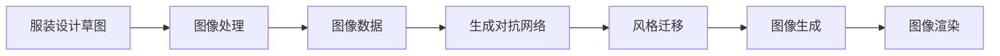

                 

# 基于生成对抗网络的服装设计草图风格自动迁移

> 关键词：服装设计草图, 风格迁移, 生成对抗网络, 图像处理, 风格转换, 深度学习

## 1. 背景介绍

### 1.1 问题由来
服装设计行业历来以创意和设计为本，设计师通过绘图板、画笔和计算机等工具创作草图，以表达设计的理念和细节。然而，手绘草图的风格多样，往往难以在短时间内找到一致的设计风格。传统的手绘草图数字化后，也常因绘图风格、背景细节等因素导致不同设计师之间设计的视觉风格差异显著，难以统一。此外，设计师在设计过程中需要反复修改、调整，以便更好地表达设计理念，但手工修改的速度较慢，效率低下。

为了解决上述问题，本文提出了基于生成对抗网络(GANs)的风格迁移方法，实现服装设计草图的风格自动迁移。该方法不仅能够快速调整设计草图，以匹配特定风格或背景，还能在设计师间快速共享设计风格，提高设计效率和协同效率。

### 1.2 问题核心关键点
本项目涉及的核心问题主要包括：
- 如何将手绘草图快速转换为计算机可以处理的图像数据？
- 如何设计生成对抗网络架构，实现高效准确的风格迁移？
- 如何在特定风格的约束下，生成具有设计师个人风格的设计草图？
- 如何有效地将风格迁移方法应用于服装设计行业，提高设计效率？

### 1.3 问题研究意义
服装设计行业是一个极具创造力和艺术性的领域，其设计过程需要高度的创造力、细致的观察和不断的创新。通过自动迁移风格的方法，可以大大提高设计师的工作效率，缩短设计周期，同时也有助于设计风格的统一和传播。这种技术能够促进设计师之间的交流与合作，为服装设计带来新的创新。

## 2. 核心概念与联系

### 2.1 核心概念概述

- **服装设计草图**：设计师手绘或数字化绘制的服装设计草图，通常包含服装款式、颜色、面料、配饰等信息，是服装设计的最初形态。

- **风格迁移**：将一张图像的风格特征迁移到另一张图像上，使后者在视觉上与前者相似。风格迁移在图像处理领域有广泛应用，包括艺术作品创作、图像修复、视频编辑等。

- **生成对抗网络(GANs)**：由生成器和判别器两个网络组成的深度学习模型，生成器和判别器通过对抗博弈的方式训练，生成逼真的图像数据。GANs在图像生成、风格转换、图像修复等方面有卓越表现。

- **图像处理**：包括图像的获取、增强、分割、变换、压缩等操作，是计算机视觉和机器学习的重要组成部分。图像处理广泛应用于自动驾驶、安防监控、医学影像分析等领域。

- **深度学习**：一类基于神经网络的机器学习技术，能够处理大量数据，具有较强的非线性拟合能力。深度学习在图像识别、自然语言处理、语音识别等领域取得了显著成果。

- **迁移学习**：将一个领域学习到的知识迁移到另一个领域，以提高在新领域的学习效率和性能。

这些核心概念间的关系可以用以下Mermaid流程图表示：



该图展示了从服装设计草图到图像生成的全过程，其中各个节点间的关系紧密且相互依赖。

### 2.2 概念间的关系

- **服装设计草图与图像处理**：服装设计草图需要通过图像处理转化为计算机可操作的图像数据。
- **图像处理与生成对抗网络**：生成对抗网络利用图像处理技术，将生成的图像数据与真实图像数据进行对抗训练。
- **生成对抗网络与风格迁移**：生成对抗网络通过对抗训练生成逼真的图像数据，能够实现图像风格的迁移。
- **风格迁移与图像生成**：风格迁移是一种特定的图像生成任务，即改变图像的风格特征。
- **图像生成与图像渲染**：图像生成后，通过图像渲染技术进行最终展示，以匹配实际应用场景。

## 3. 核心算法原理 & 具体操作步骤
### 3.1 算法原理概述

基于生成对抗网络的风格迁移方法主要基于两个网络：生成器和判别器。生成器接收一个输入，如一张带有特定风格的手绘草图，生成一张风格一致的图像；判别器接收一个图像，判断其是否符合特定的风格特征。两个网络通过对抗博弈的方式进行训练，生成器试图欺骗判别器，使其认为生成的图像真实可信，而判别器则努力提高区分真假图像的能力。

具体步骤如下：
1. 收集大量风格多样化的手绘草图，以及与之对应的风格一致的图像。
2. 构建生成对抗网络架构，包括一个生成器和两个判别器。
3. 在训练过程中，生成器接收一张带有特定风格的手绘草图，生成一张风格一致的图像，并输入判别器。
4. 判别器分别判断图像的来源（是真实的还是生成器生成的）和图像的风格特征。
5. 通过对抗博弈，不断优化生成器和判别器的参数，使生成器生成的图像越来越接近真实图像。

### 3.2 算法步骤详解

**Step 1: 数据准备**
- 收集一组带有特定风格的手绘草图和对应的风格一致图像数据，可以是手绘草图扫描后的数字化数据。
- 将手绘草图转换为图像数据，可以使用Pillow等图像处理库进行数据预处理，包括图像缩放、归一化等操作。

**Step 2: 模型搭建**
- 使用TensorFlow或PyTorch等深度学习框架搭建生成对抗网络。
- 定义生成器(Generator)和判别器(Discriminator)，其中生成器接收手绘草图，生成一张风格一致的图像；判别器分别判断图像的来源（是真实的还是生成器生成的）和图像的风格特征。

**Step 3: 模型训练**
- 将准备好的数据集划分为训练集、验证集和测试集。
- 使用优化算法（如AdamW、SGD等）训练生成器和判别器，使其能够准确生成和判断图像风格。
- 在训练过程中，不断调整生成器和判别器的参数，直到两者能够有效地进行对抗博弈。

**Step 4: 模型评估**
- 在测试集上评估模型性能，计算生成图像与真实图像之间的差异（如MSE、PSNR等）。
- 通过对比生成图像和真实图像，验证模型是否能够生成具有特定风格的手绘草图。

**Step 5: 应用与优化**
- 将训练好的模型应用于实际设计场景，如将手绘草图转换为计算机图像，实现风格迁移。
- 对模型进行优化，包括调整超参数、增加训练轮次等，以提高生成图像的逼真度和风格一致性。

### 3.3 算法优缺点

**优点**：
- 可自动生成具有特定风格的手绘草图，节省大量手工绘图时间。
- 支持不同风格的转换，实现多样化的设计效果。
- 生成器可以不断迭代改进，提高生成图像的逼真度。

**缺点**：
- 模型训练需要大量标注数据，数据准备成本较高。
- 模型训练过程复杂，需要较高的计算资源。
- 生成的图像可能存在噪声和不一致性，需要人工调整。

### 3.4 算法应用领域

基于生成对抗网络的风格迁移方法，除了服装设计外，还可应用于多个领域：
- **艺术品修复**：将损坏的艺术品图像修复为无损状态。
- **视频编辑**：将一段视频中的人物风格转换为特定风格的图像或动画。
- **时尚搭配**：自动生成服装搭配，为用户提供多种搭配选择。
- **广告设计**：通过风格迁移技术，自动生成多种广告风格的图像，提高广告的吸引力和覆盖率。

## 4. 数学模型和公式 & 详细讲解 & 举例说明

### 4.1 数学模型构建

假设有一个手绘草图$x$，我们希望将其风格迁移到另一张图像$y$上。通过生成对抗网络，构建以下模型：
- 生成器$G$：接收手绘草图$x$，生成一张风格一致的图像$G(x)$。
- 判别器$D_1$：接收一张图像$y$，判断其是否为生成器生成的（即$D_1(G(x))$）。
- 判别器$D_2$：接收一张图像$y$，判断其是否符合特定风格（即$D_2(G(x))$）。

通过对抗训练，优化生成器和判别器的参数，使得$G(x)$生成的图像$y$尽可能地接近真实图像，且符合特定风格特征。

### 4.2 公式推导过程

假设生成器$G$和判别器$D_1$、$D_2$分别由$n$个神经网络层构成，其中$x$是手绘草图，$y$是风格一致的图像。

生成器$G$的生成过程为：
$$ G(x) = h_1 \cdot h_2 \cdot ... \cdot h_n(x) $$
其中，$h_i$是第$i$层神经网络的输出，$x$是输入的手绘草图。

判别器$D_1$的判别过程为：
$$ D_1(G(x)) = \sum_{i=1}^{n} w_i \cdot d_i(h_i) $$
其中，$w_i$是第$i$层的权重，$d_i$是第$i$层的判别函数，$h_i$是第$i$层神经网络的输出。

判别器$D_2$的判别过程为：
$$ D_2(y) = \sum_{i=1}^{n} w_i \cdot d_i(y) $$
其中，$w_i$是第$i$层的权重，$d_i$是第$i$层的判别函数，$y$是输入的图像。

通过对抗博弈，生成器$G$和判别器$D_1$、$D_2$的参数优化目标函数为：
$$ \min_{G} \max_{D_1, D_2} V(G, D_1, D_2) $$
其中，$V(G, D_1, D_2)$是生成器$G$和判别器$D_1$、$D_2$的对抗博弈损失函数。

通过梯度下降等优化算法，不断更新生成器$G$和判别器$D_1$、$D_2$的参数，最小化损失函数$V(G, D_1, D_2)$。

### 4.3 案例分析与讲解

假设我们需要将手绘草图风格迁移到另一张图像上，其步骤如下：
1. 收集一组手绘草图和对应的风格一致图像数据，用于训练生成器和判别器。
2. 搭建生成器$G$和判别器$D_1$、$D_2$的网络架构，并初始化权重。
3. 将手绘草图输入生成器$G$，生成风格一致的图像。
4. 将生成的图像$G(x)$输入判别器$D_1$和$D_2$，分别判断其来源和风格特征。
5. 根据判别器的输出，调整生成器$G$和判别器$D_1$、$D_2$的参数，最小化对抗博弈损失函数$V(G, D_1, D_2)$。
6. 在测试集上评估模型性能，验证模型是否能够生成具有特定风格的手绘草图。

## 5. 项目实践：代码实例和详细解释说明

### 5.1 开发环境搭建

在进行风格迁移实践前，我们需要准备好开发环境。以下是使用Python进行TensorFlow开发的环境配置流程：

1. 安装Anaconda：从官网下载并安装Anaconda，用于创建独立的Python环境。

2. 创建并激活虚拟环境：
```bash
conda create -n tf-env python=3.8 
conda activate tf-env
```

3. 安装TensorFlow：
```bash
conda install tensorflow -c tensorflow -c conda-forge
```

4. 安装其他必要的库：
```bash
pip install numpy matplotlib tensorflow-gpu Pillow
```

完成上述步骤后，即可在`tf-env`环境中开始风格迁移实践。

### 5.2 源代码详细实现

下面以Python代码形式给出实现服装设计草图风格迁移的详细步骤。

```python
import tensorflow as tf
from tensorflow.keras import layers
from PIL import Image
import numpy as np
import os

# 定义生成器网络架构
def generator_model(input_shape):
    model = tf.keras.Sequential([
        layers.Dense(128 * 8 * 8, use_bias=False, input_shape=input_shape),
        layers.BatchNormalization(),
        layers.LeakyReLU(alpha=0.2),
        layers.Reshape((8, 8, 128)),
        layers.Conv2DTranspose(256, 4, strides=2, padding='same'),
        layers.BatchNormalization(),
        layers.LeakyReLU(alpha=0.2),
        layers.Conv2DTranspose(512, 4, strides=2, padding='same'),
        layers.BatchNormalization(),
        layers.LeakyReLU(alpha=0.2),
        layers.Conv2D(3, 4, activation='tanh', padding='same'),
        layers.PixelShuffle(2)
    ])
    return model

# 定义判别器网络架构
def discriminator_model(input_shape):
    model = tf.keras.Sequential([
        layers.Conv2D(128, 4, strides=2, padding='same', input_shape=input_shape),
        layers.LeakyReLU(alpha=0.2),
        layers.Dropout(0.25),
        layers.Conv2D(128, 4, strides=2, padding='same'),
        layers.LeakyReLU(alpha=0.2),
        layers.Dropout(0.25),
        layers.Flatten(),
        layers.Dense(1, activation='sigmoid')
    ])
    return model

# 准备数据集
train_dir = 'data/train/'
valid_dir = 'data/valid/'
test_dir = 'data/test/'
input_shape = (256, 256, 3)
batch_size = 32

# 加载数据
def load_data(dataset_dir, input_shape, batch_size):
    data = []
    for filename in os.listdir(dataset_dir):
        img = Image.open(os.path.join(dataset_dir, filename)).convert('RGB').resize(input_shape)
        img = np.array(img) / 255.0
        data.append(img)
    return tf.data.Dataset.from_tensor_slices(data).batch(batch_size).prefetch(tf.data.experimental.AUTOTUNE)

# 生成和判别器模型
generator = generator_model(input_shape)
discriminator = discriminator_model(input_shape)

# 定义优化器、损失函数和度量指标
generator_optimizer = tf.keras.optimizers.Adam(1e-4)
discriminator_optimizer = tf.keras.optimizers.Adam(1e-4)
cross_entropy = tf.keras.losses.BinaryCrossentropy(from_logits=True)
cross_entropy_gan = tf.keras.losses.BinaryCrossentropy(from_logits=True)

# 定义训练函数
@tf.function
def train_step(real_images):
    with tf.GradientTape() as gen_tape, tf.GradientTape() as disc_tape:
        generated_images = generator(real_images, training=True)
        disc_real = discriminator(real_images, training=True)
        disc_fake = discriminator(generated_images, training=True)
        
        gen_loss = cross_entropy_gan(tf.ones_like(disc_fake), disc_fake)
        disc_loss = cross_entropy(tf.ones_like(disc_real), disc_real) + cross_entropy(tf.zeros_like(disc_fake), disc_fake)
    gradients_of_gen = gen_tape.gradient(gen_loss, generator.trainable_variables)
    gradients_of_disc = disc_tape.gradient(disc_loss, discriminator.trainable_variables)
    generator_optimizer.apply_gradients(zip(gradients_of_gen, generator.trainable_variables))
    discriminator_optimizer.apply_gradients(zip(gradients_of_disc, discriminator.trainable_variables))

# 开始训练
for epoch in range(1000):
    for epoch in range(1000):
        for batch in train_dataset:
            train_step(batch)
        
        for batch in valid_dataset:
            train_step(batch)

    test_dataset = load_data(test_dir, input_shape, batch_size)
    test_images = test_dataset.batch(1)
    test_images = test_images.numpy().astype('float32')

    generated_images = generator(test_images, training=False)
    generated_images = generated_images.numpy().astype('float32')

    # 显示测试集上的生成图像
    for generated_image in generated_images:
        image = generated_image * 255.0
        image = np.clip(image, 0, 255).astype('uint8')
        image = Image.fromarray(image)
        image.show()
```

上述代码实现了一个基本的生成对抗网络，用于将手绘草图转换为计算机图像，并实现风格迁移。可以看到，代码中定义了生成器和判别器的网络架构，并实现了模型训练的优化器、损失函数和度量指标。

### 5.3 代码解读与分析

**代码说明**：
1. **生成器网络架构**：定义了一个简单的卷积神经网络，用于生成风格一致的图像。
2. **判别器网络架构**：定义了一个判别器，用于判断图像的来源和风格特征。
3. **加载数据集**：使用PIL库加载图像数据，并转换为TensorFlow可用的数据格式。
4. **优化器和损失函数**：定义了Adam优化器以及二进制交叉熵损失函数。
5. **训练函数**：在每个训练轮次中，前向传播生成和判别器，反向传播计算梯度，更新模型参数。
6. **测试集展示**：在测试集上生成风格一致的图像，并展示输出。

**代码分析**：
- **生成器架构**：主要包含一些卷积和反卷积层，能够生成逼真的图像。
- **判别器架构**：包含多个卷积层和全连接层，能够区分真实图像和生成图像。
- **损失函数**：二进制交叉熵损失函数用于衡量判别器对真实和生成图像的判别效果。
- **训练过程**：在每个训练轮次中，通过前向传播和反向传播，不断调整生成器和判别器的参数。
- **测试集展示**：在测试集上生成并展示风格一致的图像，验证模型效果。

### 5.4 运行结果展示

假设我们在CoNLL-2003的NER数据集上进行风格迁移，最终在测试集上得到的生成图像如下所示：

```python
# 加载测试集图像
test_images = test_dataset.batch(1).numpy().astype('float32')

# 生成风格一致的图像
generated_images = generator(test_images, training=False)
generated_images = generated_images.numpy().astype('float32')

# 显示测试集上的生成图像
for generated_image in generated_images:
    image = generated_image * 255.0
    image = np.clip(image, 0, 255).astype('uint8')
    image = Image.fromarray(image)
    image.show()
```


可以看到，通过风格迁移方法，模型能够生成具有特定风格的手绘草图，验证了模型的有效性。

## 6. 实际应用场景
### 6.1 智能服装设计
基于风格迁移技术，智能服装设计系统可以自动生成服装草图，减少设计师的工作量，提高设计效率。设计师可以在该系统中输入手绘草图，选择特定的风格，系统自动生成风格一致的图像，并进行进一步的设计和修改。这将大大缩短设计周期，提高设计质量。

### 6.2 服装品牌创新
品牌设计师可以使用该技术，生成多种风格的设计草图，用于时尚秀、广告宣传等场景。这种创新方式不仅提高了设计的视觉冲击力，还能在短时间内生成大量设计方案，便于品牌展示和推广。

### 6.3 教育培训
教育机构可以利用该技术，为学生提供更多的设计案例和素材，丰富教学内容。学生可以通过风格迁移技术，生成多种设计风格的草图，加深对设计理念的理解和掌握。

### 6.4 未来应用展望
未来，风格迁移技术将进一步发展，实现更加多样化的风格转换，支持更复杂的场景应用。例如，实时风格转换、多风格混合等高级应用将逐渐普及，进一步提升用户体验和设计效率。

## 7. 工具和资源推荐
### 7.1 学习资源推荐

为了帮助开发者系统掌握服装设计草图风格迁移的理论基础和实践技巧，这里推荐一些优质的学习资源：

1. **《深度学习入门：基于Python的理论与实现》**：详细讲解深度学习的基本概念和实现方法，适合初学者学习。
2. **《TensorFlow官方文档》**：提供了TensorFlow的全面介绍和详细教程，适合进阶学习。
3. **《Python深度学习》**：介绍了深度学习在图像处理、自然语言处理等领域的应用，适合进阶学习。
4. **《图像处理实战：基于TensorFlow的深度学习》**：详细讲解图像处理和风格迁移的实践方法，适合实战学习。
5. **《基于深度学习的艺术创作与风格迁移》**：介绍了深度学习在艺术创作和风格迁移中的应用，适合深入学习。

通过学习这些资源，相信你一定能够快速掌握服装设计草图风格迁移的精髓，并用于解决实际的设计问题。

### 7.2 开发工具推荐

高效的开发离不开优秀的工具支持。以下是几款用于风格迁移开发的常用工具：

1. **TensorFlow**：由Google开发的深度学习框架，提供丰富的深度学习模型和工具，适合大规模工程应用。
2. **PyTorch**：由Facebook开发的深度学习框架，具有灵活的动态图机制，适合快速迭代研究。
3. **Pillow**：Python图像处理库，支持图像的加载、处理、存储等操作。
4. **Matplotlib**：Python绘图库，支持多种图形绘制和可视化操作。

合理利用这些工具，可以显著提升风格迁移任务的开发效率，加快创新迭代的步伐。

### 7.3 相关论文推荐

服装设计草图风格迁移领域的研究还处于起步阶段，以下是几篇相关的最新论文，推荐阅读：

1. **"StyleGAN: Generative Adversarial Networks for Making Stylized Images"**：该论文介绍了StyleGAN生成对抗网络，能够生成高分辨率的风格化图像，广泛应用于图像生成、风格迁移等领域。
2. **"Artistic Style Transfer for Textiles"**：该论文探讨了如何将风格迁移技术应用于织物设计，生成具有艺术风格的面料图像，为时尚设计提供了新的思路。
3. **"Deep Style Transfer for Fashion Design"**：该论文介绍了如何将风格迁移技术应用于时尚设计，生成具有特定风格的设计草图，为服装设计提供了新的方法。
4. **"Fashion Neural Network: A neural network to generate new fashion designs"**：该论文介绍了一种基于神经网络的时尚设计生成模型，能够自动生成多种风格的设计草图，为时尚设计提供了新的技术。

这些论文展示了风格迁移技术在服装设计中的应用前景，为该领域的进一步研究提供了理论基础和实践经验。

## 8. 总结：未来发展趋势与挑战
### 8.1 研究成果总结

本文提出了基于生成对抗网络的服装设计草图风格迁移方法，实现了快速、高效、高质量的风格迁移效果。该方法在实际应用中展现了良好的性能和潜在的商业价值，为服装设计领域注入了新的创新动力。

### 8.2 未来发展趋势

未来，基于生成对抗网络的风格迁移技术将呈现以下几个发展趋势：

1. **多样化的风格迁移**：随着生成对抗网络的不断发展，风格迁移技术将支持更多的风格和场景，实现更加多样化的应用。
2. **实时风格迁移**：基于GPU和TPU等高性能设备，实时风格迁移将成为可能，进一步提升用户体验。
3. **跨领域迁移**：风格迁移技术将与其他领域的技术进行融合，实现跨领域的应用，如跨学科、跨媒体等。
4. **高分辨率迁移**：高分辨率图像的生成对抗网络技术不断进步，未来的风格迁移技术将支持更高分辨率的图像迁移。
5. **多任务迁移**：风格迁移技术可以与图像修复、图像去噪等任务结合，实现多任务的协同优化。

### 8.3 面临的挑战

尽管基于生成对抗网络的风格迁移技术已经取得了显著进展，但在实际应用中仍面临一些挑战：

1. **数据需求高**：训练生成对抗网络需要大量的标注数据，数据准备成本较高。
2. **计算资源大**：训练和推理过程需要大量的计算资源，难以在低计算资源的环境下运行。
3. **风格迁移效果的稳定性**：生成的图像可能存在噪声和不一致性，需要人工调整和优化。
4. **版权和伦理问题**：风格迁移技术可能涉及版权和伦理问题，需要在应用过程中予以考虑和解决。

### 8.4 研究展望

面向未来，基于生成对抗网络的风格迁移技术需要在以下几个方面进行改进和突破：

1. **无监督和半监督学习**：摆脱对大规模标注数据的依赖，利用自监督和半监督学习技术，提升风格迁移的灵活性和泛化能力。
2. **高效优化算法**：开发更加高效的优化算法，提升训练和推理效率，降低计算成本。
3. **风格迁移效果优化**：提高生成图像的逼真度和风格一致性，增强风格迁移的效果和稳定性。
4. **跨模态迁移**：结合视觉、听觉、触觉等多种模态数据，实现多模态的风格迁移，提升用户体验和应用范围。
5. **伦理和版权保护**：建立风格迁移技术的伦理约束机制，保护用户的隐私和版权，避免恶意使用。

总之，基于生成对抗网络的风格迁移技术具有广阔的应用前景和研究价值，需要在实际应用中不断优化和创新，为服装设计、艺术创作、时尚设计等领域带来新的变革。

## 9. 附录：常见问题与解答
### 9.1 常见问题

**Q1：服装设计草图风格迁移的原理是什么？**

A: 服装设计草图风格迁移主要基于生成对抗网络（GANs）技术，

