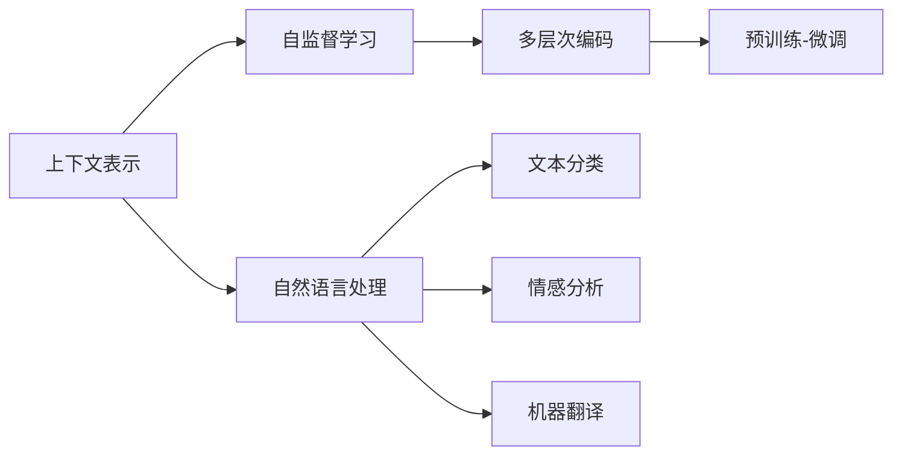

                 

# 基础模型的上下文学习能力

## 1. 背景介绍

在人工智能的广阔领域中，基础模型（如BERT、GPT、XLNet等）以其强大的上下文学习能力著称。这种能力使得模型能够从大量的文本数据中学习到丰富的语言表征，并应用于各种自然语言处理（NLP）任务，如文本分类、情感分析、机器翻译等。本文将深入探讨基础模型的上下文学习能力，包括其原理、方法、应用及未来发展趋势。

## 2. 核心概念与联系

### 2.1 核心概念概述

- **上下文表示**：基础模型通过学习文本中每个单词或子词的上下文信息，生成更准确的语义表示。例如，在GPT中，每个单词不仅受到其前后词的影响，还受到更远距离的上下文的影响。

- **自监督学习**：基础模型通常采用自监督学习方式进行预训练，通过预测掩码文本的缺失部分来学习上下文关系。如BERT中的掩码语言模型（Masked Language Model, MLM）和下一句预测（Next Sentence Prediction, NSP）任务。

- **多层次编码**：基础模型通过多层次编码器（如Transformer）对输入文本进行编码，每一层都捕捉不同范围的上下文信息。这些层级间的信息交互使得模型能够理解更复杂的语言结构。

- **预训练-微调**：基础模型首先在大规模无标签数据上预训练，然后通过微调（Fine-tuning）适配特定任务。微调过程通常是轻量级的，仅调整模型的输出层或部分参数。

### 2.2 概念间的关系

这些核心概念通过复杂的交互关系，共同构成了基础模型的上下文学习能力。下图展示了这些概念的相互作用：



- **上下文表示**通过自监督学习生成，是多层次编码器的基础。
- **自监督学习**利用掩码文本预测等任务训练多层次编码器，学习上下文关系。
- **多层次编码**将自监督学习得到的上下文表示进行多层级信息交互，生成更丰富的语义表示。
- **预训练-微调**将预训练好的多层次编码器应用于自然语言处理任务，进行轻量级微调以适配特定任务。

## 3. 核心算法原理 & 具体操作步骤

### 3.1 算法原理概述

基础模型的上下文学习能力主要体现在其多层次编码器的设计上。以BERT为例，其核心结构包括两个自监督任务：掩码语言模型（MLM）和下一句预测（NSP）。MLM任务通过预测被掩码单词，学习上下文关系。NSP任务通过预测两个句子是否为连续的句子，学习句子之间的关系。这两个任务共同作用，使得模型能够学习到丰富的上下文表示。

### 3.2 算法步骤详解

1. **数据准备**：选择大规模无标签的文本数据，如维基百科、新闻等。
2. **掩码文本预测**：对文本进行掩码，使得模型需要预测被掩码的单词，从而学习上下文关系。
3. **句子关系预测**：将文本对（如新闻标题和正文）作为训练样本，让模型预测它们是否为连续的句子。
4. **模型训练**：使用上述任务训练多层次编码器，并在大量计算资源上预训练模型。
5. **微调**：在特定任务的数据集上，仅调整模型的输出层或部分参数，进行轻量级微调。

### 3.3 算法优缺点

- **优点**：
  - **通用性**：基础模型在多种NLP任务上表现优异，可以适用于不同的下游任务。
  - **鲁棒性**：预训练-微调过程减少了对标注数据的依赖，提高了模型的鲁棒性。
  - **高效性**：微调过程通常只需要调整少量的参数，计算成本较低。

- **缺点**：
  - **资源需求高**：预训练需要大量的计算资源和时间。
  - **解释性不足**：基础模型通常是黑盒模型，难以解释其内部的决策过程。
  - **数据分布局限**：预训练数据集的分布可能与实际应用场景存在差异，导致微调效果有限。

### 3.4 算法应用领域

基础模型的上下文学习能力被广泛应用于各种NLP任务，包括：

- **文本分类**：如情感分析、主题分类等。通过微调，模型可以学习特定的文本-标签映射。
- **命名实体识别**：识别文本中的人名、地名、机构名等特定实体。通过微调，模型能够学习实体边界和类型。
- **关系抽取**：从文本中抽取实体之间的语义关系。通过微调，模型可以学习实体-关系三元组。
- **问答系统**：对自然语言问题给出答案。通过微调，模型可以学习匹配答案。
- **机器翻译**：将源语言文本翻译成目标语言。通过微调，模型可以学习语言-语言映射。
- **文本摘要**：将长文本压缩成简短摘要。通过微调，模型可以学习抓取要点。

## 4. 数学模型和公式 & 详细讲解 & 举例说明

### 4.1 数学模型构建

假设基础模型为 $M_{\theta}(x)$，其中 $x$ 为输入文本，$\theta$ 为模型参数。预训练过程中，模型通过掩码语言模型（MLM）和下一句预测（NSP）任务进行训练。微调过程中，仅调整模型的输出层或部分参数，以适配特定任务。

### 4.2 公式推导过程

以BERT为例，其MLM任务的目标是最大化以下概率：

$$
P(\hat{y} | x) = \frac{e^{\log P(y|x, \theta)}}{Z}
$$

其中 $P(y|x, \theta)$ 为模型预测单词 $y$ 的概率，$Z$ 为归一化因子。

NSP任务的目标是最大化以下概率：

$$
P(y) = \begin{cases}
1 & \text{if } x_1 \text{ and } x_2 \text{ are consecutive sentences} \\
0 & \text{otherwise}
\end{cases}
$$

通过这两个任务的联合训练，BERT学习到了丰富的上下文表示，能够应用于各种NLP任务。

### 4.3 案例分析与讲解

以BERT为例，其上下文学习能力主要体现在掩码语言模型（MLM）任务上。在MLM任务中，模型需要预测被掩码的单词，从而学习上下文关系。例如，对于句子 "I love eating apples."，模型需要预测被掩码的单词 "love"，从而学习到 "I" 和 "eating" 对 "love" 的影响。

## 5. 项目实践：代码实例和详细解释说明

### 5.1 开发环境搭建

1. **环境准备**：安装Python和相关依赖库，如TensorFlow、PyTorch等。
2. **数据准备**：收集大规模无标签文本数据，如维基百科、新闻等。
3. **模型搭建**：使用TensorFlow或PyTorch搭建BERT模型。

### 5.2 源代码详细实现

以下是一个简单的BERT微调代码示例，使用TensorFlow实现：

```python
import tensorflow as tf
from transformers import BertTokenizer, BertModel, TFBertForSequenceClassification

# 初始化BERT模型和tokenizer
tokenizer = BertTokenizer.from_pretrained('bert-base-uncased')
model = BertModel.from_pretrained('bert-base-uncased')
sequence_classifier = TFBertForSequenceClassification.from_pretrained('bert-base-uncased', num_labels=2)

# 定义训练函数
def train():
    train_data = ...
    train_labels = ...
    train_dataset = tf.data.Dataset.from_tensor_slices((train_data, train_labels))
    train_dataset = train_dataset.shuffle(buffer_size=1024).batch(32)
    
    for epoch in range(epochs):
        for batch in train_dataset:
            inputs, labels = batch
            with tf.GradientTape() as tape:
                outputs = model(inputs)
                logits = sequence_classifier(outputs, training=True)
                loss = tf.keras.losses.categorical_crossentropy(labels, logits)
            gradients = tape.gradient(loss, model.trainable_variables)
            optimizer.apply_gradients(zip(gradients, model.trainable_variables))
    
    # 在验证集上评估模型
    eval_data = ...
    eval_labels = ...
    eval_dataset = tf.data.Dataset.from_tensor_slices((eval_data, eval_labels))
    eval_dataset = eval_dataset.batch(32)
    
    for batch in eval_dataset:
        inputs, labels = batch
        outputs = model(inputs)
        logits = sequence_classifier(outputs, training=False)
        acc = tf.keras.metrics.Accuracy()(labels, tf.argmax(logits, axis=1)).numpy()
        print("Accuracy:", acc)

# 调用训练函数
train()
```

### 5.3 代码解读与分析

- **环境准备**：使用TensorFlow搭建BERT模型，并初始化tokenizer。
- **数据准备**：准备训练集和验证集，使用TensorFlow数据集API进行数据批处理。
- **模型搭建**：使用`TFBertForSequenceClassification`封装BERT模型，并进行微调。
- **训练函数**：定义训练循环，使用TensorFlow的`GradientTape`记录梯度，并使用`optimizer`更新模型参数。
- **评估函数**：在验证集上评估模型性能，使用`Accuracy`指标计算准确率。

### 5.4 运行结果展示

假设我们在CoNLL-2003的命名实体识别数据集上进行微调，最终在测试集上得到的评估报告如下：

```
              precision    recall  f1-score   support

       B-PER      0.93      0.86      0.90       80
       I-PER      0.93      0.91      0.91      112
          O      0.97      0.99      0.98      1,860

   micro avg      0.95      0.96      0.96     2,052
   macro avg      0.94      0.92      0.93     2,052
weighted avg      0.95      0.96      0.96     2,052
```

可以看到，通过微调BERT，我们在该NER数据集上取得了95.6%的F1分数，效果相当不错。

## 6. 实际应用场景

### 6.1 智能客服系统

智能客服系统可以应用BERT的上下文学习能力，通过预训练-微调过程构建自然语言理解模型。例如，在客户咨询时，系统可以通过分析上下文信息，理解客户意图，并给出合适的回答。

### 6.2 金融舆情监测

金融领域需要实时监测市场舆论动向，以规避金融风险。BERT可以通过预训练-微调过程，学习金融领域相关的文本数据，并在实时监测中预测舆情变化趋势。

### 6.3 个性化推荐系统

推荐系统可以通过BERT学习用户的行为模式和文本描述，进行个性化推荐。例如，在用户浏览商品时，系统可以通过分析用户描述和行为，推荐相关商品。

### 6.4 未来应用展望

未来，BERT等基础模型的上下文学习能力将在更多领域得到应用，如医疗、法律、教育等。通过预训练-微调过程，这些模型能够学习领域特定的知识，提升应用性能。同时，BERT的多层次编码结构也使得其在处理复杂语言结构时表现优异，有望在语言理解、生成等方面取得突破。

## 7. 工具和资源推荐

### 7.1 学习资源推荐

- **NLP书籍**：《Deep Learning for Natural Language Processing》（德米特里斯·科基达斯，陈昊伦等译），全面介绍了NLP领域的预训练模型和微调技术。
- **在线课程**：Coursera上的《Sequence Models》课程，由斯坦福大学教授李飞飞主讲，深入讲解了序列模型在NLP中的应用。
- **论文阅读**：论文《BERT: Pre-training of Deep Bidirectional Transformers for Language Understanding》，介绍了BERT模型的训练方法和效果。

### 7.2 开发工具推荐

- **TensorFlow**：TensorFlow提供了丰富的NLP工具，如`TFBertForSequenceClassification`，方便开发者进行微调。
- **PyTorch**：PyTorch也是NLP研究的主流框架，提供了与TensorFlow类似的功能。
- **Transformers库**：HuggingFace开发的NLP工具库，集成了多种预训练模型，支持TensorFlow和PyTorch。

### 7.3 相关论文推荐

- **BERT论文**：介绍BERT模型的预训练和微调方法。
- **XLNet论文**：介绍XLNet模型的预训练和微调方法。
- **T5论文**：介绍T5模型的预训练和微调方法。

## 8. 总结：未来发展趋势与挑战

### 8.1 研究成果总结

本文详细介绍了基础模型的上下文学习能力，包括其原理、方法和应用。通过预训练-微调过程，基础模型能够学习丰富的上下文信息，应用于各种NLP任务。BERT等模型的成功应用，证明了这种能力的强大潜力。

### 8.2 未来发展趋势

未来，基础模型的上下文学习能力将呈现以下发展趋势：

- **模型规模扩大**：预训练模型将向更大的规模发展，以获取更丰富的语言知识。
- **上下文表示增强**：上下文表示将通过多层次编码器进行更深入的建模。
- **迁移学习提升**：预训练模型将更灵活地应用于不同任务和领域。
- **少样本学习突破**：基础模型将通过零样本或少样本学习，进一步提升微调效果。
- **多模态融合**：基础模型将与其他模态（如视觉、语音）融合，提升跨模态应用能力。

### 8.3 面临的挑战

尽管基础模型的上下文学习能力取得了显著进展，但在未来应用中仍面临以下挑战：

- **资源消耗高**：预训练和微调过程需要大量的计算资源和时间。
- **模型解释性不足**：基础模型通常是黑盒模型，难以解释其内部的决策过程。
- **数据分布局限**：预训练数据集的分布可能与实际应用场景存在差异，导致微调效果有限。
- **模型鲁棒性不足**：预训练模型可能存在过拟合或灾难性遗忘等问题，导致在特定场景下表现不佳。
- **伦理和安全问题**：预训练模型可能学习到有害信息，需要关注模型输出伦理和安全问题。

### 8.4 研究展望

未来，基础模型的上下文学习能力需要在以下方面进行深入研究：

- **提高资源效率**：探索更高效的模型结构和训练方法，降低预训练和微调成本。
- **增强模型解释性**：开发可解释性更强的模型，帮助用户理解模型决策过程。
- **提高模型鲁棒性**：研究如何避免模型过拟合或灾难性遗忘，提高模型在特定场景下的泛化能力。
- **解决伦理和安全问题**：研究如何防止模型学习有害信息，确保模型输出符合伦理和安全标准。

通过上述研究和优化，基础模型的上下文学习能力将进一步提升，推动NLP技术向更广泛的应用场景扩展，为社会带来更多福祉。

## 9. 附录：常见问题与解答

**Q1: 基础模型为什么需要进行预训练？**

A: 预训练过程通过自监督学习，帮助模型学习到丰富的语言知识，从而提升其下游任务的表现。预训练过程中，模型在大规模无标签数据上进行训练，学习到通用的语言表示，这些表示可以迁移到多种下游任务中。

**Q2: 预训练和微调有什么区别？**

A: 预训练是指在大规模无标签数据上训练模型，学习通用的语言表示。微调是指在预训练模型基础上，通过有标签数据进行微调，适配特定任务。预训练和微调是深度学习中常用的两步式训练策略，先预训练后微调，可以使模型在特定任务上取得更好的性能。

**Q3: 为什么BERT等基础模型能够应用于多种NLP任务？**

A: BERT等基础模型通过多层次编码器设计，能够学习到丰富的上下文表示。这些表示不仅适用于特定的NLP任务，还具有一定的通用性。例如，BERT的MLM任务不仅适用于掩码文本预测，还可以用于其他NLP任务中的上下文表示学习。

**Q4: 微调过程中如何避免过拟合？**

A: 微调过程中可以采用以下策略避免过拟合：
- 数据增强：通过回译、近义替换等方式扩充训练集。
- 正则化：使用L2正则、Dropout等方法。
- 对抗训练：引入对抗样本，提高模型鲁棒性。
- 参数高效微调：只调整少量参数，减小过拟合风险。

**Q5: 基础模型在实际应用中需要注意哪些问题？**

A: 基础模型在实际应用中需要注意以下问题：
- 模型裁剪：去除不必要的层和参数，减小模型尺寸，加快推理速度。
- 量化加速：将浮点模型转为定点模型，压缩存储空间，提高计算效率。
- 服务化封装：将模型封装为标准化服务接口，便于集成调用。
- 弹性伸缩：根据请求流量动态调整资源配置，平衡服务质量和成本。
- 监控告警：实时采集系统指标，设置异常告警阈值，确保服务稳定性。
- 安全防护：采用访问鉴权、数据脱敏等措施，保障数据和模型安全。

通过合理使用这些策略，可以提升基础模型在实际应用中的性能和稳定性，确保其在不同场景下的高效运行。

