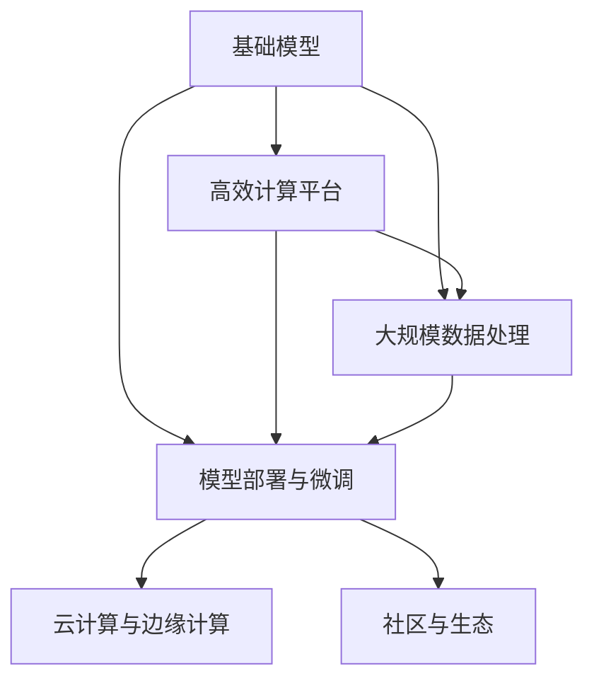
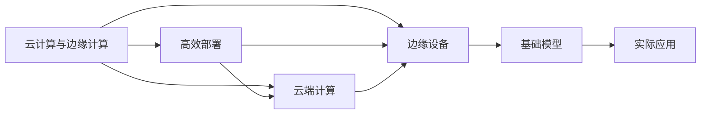
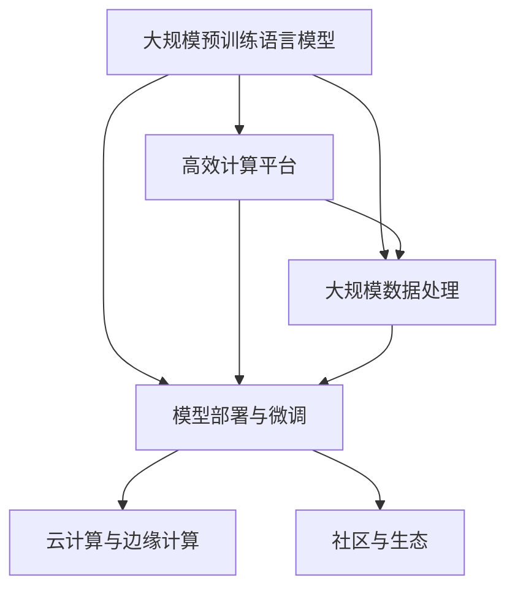

                 

# 基础模型的公共基础设施

> 关键词：
基础模型, 公共基础设施, 计算平台, 预训练, 模型部署, 云计算, 大规模数据处理

## 1. 背景介绍

### 1.1 问题由来

近年来，随着深度学习技术的快速发展，基础模型的研究和应用已经取得了显著进展。从传统的线性回归、支持向量机等传统模型，到卷积神经网络(CNN)、循环神经网络(RNN)等深度学习模型，再到当前最热门的基础模型如BERT、GPT-3等大规模预训练语言模型，基础模型正逐渐成为人工智能领域的重要基础设施。这些模型经过大量的无标签数据预训练，具备强大的泛化能力，能够高效地进行各种任务，如图像识别、自然语言处理等。然而，基础模型的应用也面临着诸多挑战，例如模型训练需要大量的计算资源，模型部署需要高效的计算平台，模型推理需要大规模数据处理能力等。为了更好地支持基础模型的研究和应用，亟需构建一套完整的公共基础设施，以满足基础模型的高效训练、推理和部署需求。

### 1.2 问题核心关键点

构建基础模型的公共基础设施，其核心关键点主要包括：

1. **高效计算平台**：基础模型的训练和推理需要高性能的计算资源，如何构建高效、可扩展的计算平台是基础设施建设的关键。
2. **大规模数据处理**：基础模型通常需要处理大规模数据，如何构建高效的数据处理和存储系统是基础设施建设的重要内容。
3. **模型部署与微调**：基础模型部署到实际应用中需要高效、便捷的部署方式和微调手段，以满足不同应用场景的需求。
4. **云计算与边缘计算**：如何在云端和边缘设备上部署基础模型，以实现最佳的性能和成本效益，是基础设施建设的重要方向。
5. **社区与生态**：构建一个开放、活跃的社区和生态系统，促进基础模型的共享、复用和优化。

## 2. 核心概念与联系

### 2.1 核心概念概述

为了更好地理解基础模型的公共基础设施，本节将介绍几个密切相关的核心概念：

- **基础模型**：指经过大规模无标签数据预训练，具备较强泛化能力，能够高效完成各种任务的人工智能模型。如BERT、GPT-3等。
- **计算平台**：指支持大规模深度学习模型训练和推理的计算基础设施，包括CPU、GPU、TPU等高性能硬件。
- **大规模数据处理**：指能够高效处理大规模数据，提供高速数据传输、存储和处理的系统，如Hadoop、Spark等。
- **模型部署与微调**：指将训练好的模型应用到实际应用场景中，并进行优化以适应特定任务的过程。
- **云计算与边缘计算**：指基于云计算平台和边缘设备提供的计算资源，以实现高效、可扩展的模型部署与推理。
- **社区与生态**：指构建一个开放、活跃的社区和生态系统，促进基础模型的共享、复用和优化。

这些核心概念之间的逻辑关系可以通过以下Mermaid流程图来展示：



这个流程图展示了基础模型的公共基础设施的各个组件及其相互关系。

### 2.2 概念间的关系

这些核心概念之间存在着紧密的联系，形成了基础模型基础设施的完整生态系统。下面我们通过几个Mermaid流程图来展示这些概念之间的关系。

#### 2.2.1 计算平台与基础模型的关系


这个流程图展示了计算平台与基础模型的关系。计算平台提供了高效计算资源，支持基础模型的训练和推理。

#### 2.2.2 数据处理与基础模型的关系


这个流程图展示了大规模数据处理与基础模型的关系。大规模数据处理系统能够高效处理大规模数据，为基础模型的训练和推理提供支持。

#### 2.2.3 部署与微调与基础模型的关系


这个流程图展示了模型部署与微调与基础模型的关系。模型部署与微调技术能够将训练好的基础模型高效应用到实际应用场景中，并进行优化以适应特定任务。

#### 2.2.4 云计算与边缘计算与基础模型的关系



这个流程图展示了云计算与边缘计算与基础模型的关系。云计算与边缘计算技术能够高效部署基础模型，以满足实际应用场景的需求。

#### 2.2.5 社区与生态与基础模型的关系


这个流程图展示了社区与生态与基础模型的关系。社区与生态系统能够促进基础模型的共享、复用和优化，加速基础模型的应用和优化进程。

### 2.3 核心概念的整体架构

最后，我们用一个综合的流程图来展示这些核心概念在大规模预训练语言模型的基础设施的构建中的整体架构：



这个综合流程图展示了从大规模预训练语言模型的构建，到高效计算平台、大规模数据处理、模型部署与微调、云计算与边缘计算、社区与生态等各个环节的完整过程。

## 3. 核心算法原理 & 具体操作步骤
### 3.1 算法原理概述

构建基础模型的公共基础设施，本质上是通过计算平台、数据处理、模型部署与微调等技术手段，提供高效、可扩展的基础模型训练、推理和部署环境。其核心算法原理包括：

1. **计算平台设计**：设计高效的计算平台，支持大规模深度学习模型的训练和推理。
2. **大规模数据处理**：构建高效的数据处理系统，支持大规模数据的存储、传输和处理。
3. **模型部署与微调**：设计高效的模型部署与微调方法，满足不同应用场景的需求。
4. **云计算与边缘计算**：利用云计算平台和边缘设备，实现高效、可扩展的模型部署与推理。
5. **社区与生态建设**：构建开放、活跃的社区和生态系统，促进基础模型的共享、复用和优化。

### 3.2 算法步骤详解

构建基础模型的公共基础设施一般包括以下几个关键步骤：

**Step 1: 设计高效的计算平台**

1. **选择合适的硬件**：根据任务需求选择合适的CPU、GPU、TPU等高性能硬件。
2. **设计高效的计算图**：设计高效的计算图，优化模型训练和推理过程。
3. **实现高效的训练和推理**：实现高效的训练和推理算法，提升模型性能。

**Step 2: 构建大规模数据处理系统**

1. **选择高效的数据存储方式**：选择高效的数据存储方式，如Hadoop、Spark等。
2. **设计高效的数据处理流程**：设计高效的数据处理流程，优化数据传输和处理过程。
3. **实现数据预处理和增强**：实现数据预处理和增强技术，提高数据质量。

**Step 3: 设计高效的模型部署与微调方法**

1. **选择合适的模型**：选择合适的基础模型，如BERT、GPT-3等。
2. **实现高效的模型部署**：实现高效的模型部署方法，如模型裁剪、量化加速等。
3. **设计高效的模型微调**：设计高效的模型微调方法，如 Adapter、Prefix等。

**Step 4: 利用云计算与边缘计算技术**

1. **利用云计算平台**：利用云计算平台提供的计算资源，实现高效、可扩展的模型部署与推理。
2. **利用边缘设备**：利用边缘设备，如移动设备、物联网设备等，实现本地推理和部署。
3. **实现高效的模型管理和优化**：实现高效的模型管理和优化方法，如模型版本控制、自动更新等。

**Step 5: 构建社区与生态系统**

1. **构建开放社区**：构建开放社区，促进基础模型的共享和复用。
2. **构建生态系统**：构建生态系统，支持开发者和用户进行模型优化和复用。
3. **实现模型监测和反馈机制**：实现模型监测和反馈机制，及时发现和解决问题。

### 3.3 算法优缺点

构建基础模型的公共基础设施，具有以下优点：

1. **高效性**：通过高效的计算平台、数据处理和模型部署与微调方法，支持大规模深度学习模型的训练和推理。
2. **可扩展性**：通过云计算与边缘计算技术，实现高效、可扩展的模型部署与推理。
3. **开放性**：通过社区与生态系统，促进基础模型的共享和复用。

同时，也存在以下缺点：

1. **成本高**：构建高效的计算平台和数据处理系统需要高昂的硬件和软件成本。
2. **复杂性高**：设计和实现高效的计算平台、数据处理和模型部署与微调方法需要高水平的技术和资源。
3. **依赖性高**：对计算平台、数据处理和云计算与边缘计算技术有较高的依赖性。

### 3.4 算法应用领域

基于高效的计算平台、数据处理和模型部署与微调方法，基础模型的公共基础设施在以下领域得到了广泛应用：

- **自然语言处理**：如BERT、GPT-3等大语言模型，广泛应用于问答、机器翻译、文本生成等任务。
- **计算机视觉**：如ResNet、Inception等卷积神经网络，广泛应用于图像分类、目标检测、图像生成等任务。
- **语音识别**：如Transformer-XL、Wav2Vec等，广泛应用于语音识别、语音合成、语音翻译等任务。
- **推荐系统**：如BERT、GPT-3等，广泛应用于个性化推荐、广告推荐等任务。
- **医疗健康**：如BERT、GPT-3等，广泛应用于医疗影像分析、疾病预测等任务。

## 4. 数学模型和公式 & 详细讲解 & 举例说明
### 4.1 数学模型构建

本节将使用数学语言对基础模型的公共基础设施进行更加严格的刻画。

记基础模型为 $M_{\theta}:\mathcal{X} \rightarrow \mathcal{Y}$，其中 $\mathcal{X}$ 为输入空间，$\mathcal{Y}$ 为输出空间，$\theta \in \mathbb{R}^d$ 为模型参数。假设大规模数据集为 $D=\{(x_i,y_i)\}_{i=1}^N$，其中 $x_i \in \mathcal{X}$ 为输入，$y_i \in \mathcal{Y}$ 为输出标签。

定义基础模型 $M_{\theta}$ 在数据样本 $(x,y)$ 上的损失函数为 $\ell(M_{\theta}(x),y)$，则在数据集 $D$ 上的经验风险为：

$$
\mathcal{L}(\theta) = \frac{1}{N} \sum_{i=1}^N \ell(M_{\theta}(x_i),y_i)
$$

微调的目标是最小化经验风险，即找到最优参数：

$$
\theta^* = \mathop{\arg\min}_{\theta} \mathcal{L}(\theta)
$$

在实践中，我们通常使用基于梯度的优化算法（如SGD、Adam等）来近似求解上述最优化问题。设 $\eta$ 为学习率，$\lambda$ 为正则化系数，则参数的更新公式为：

$$
\theta \leftarrow \theta - \eta \nabla_{\theta}\mathcal{L}(\theta) - \eta\lambda\theta
$$

其中 $\nabla_{\theta}\mathcal{L}(\theta)$ 为损失函数对参数 $\theta$ 的梯度，可通过反向传播算法高效计算。

### 4.2 公式推导过程

以下我们以二分类任务为例，推导交叉熵损失函数及其梯度的计算公式。

假设模型 $M_{\theta}$ 在输入 $x$ 上的输出为 $\hat{y}=M_{\theta}(x) \in [0,1]$，表示样本属于正类的概率。真实标签 $y \in \{0,1\}$。则二分类交叉熵损失函数定义为：

$$
\ell(M_{\theta}(x),y) = -[y\log \hat{y} + (1-y)\log (1-\hat{y})]
$$

将其代入经验风险公式，得：

$$
\mathcal{L}(\theta) = -\frac{1}{N}\sum_{i=1}^N [y_i\log M_{\theta}(x_i)+(1-y_i)\log(1-M_{\theta}(x_i))]
$$

根据链式法则，损失函数对参数 $\theta_k$ 的梯度为：

$$
\frac{\partial \mathcal{L}(\theta)}{\partial \theta_k} = -\frac{1}{N}\sum_{i=1}^N (\frac{y_i}{M_{\theta}(x_i)}-\frac{1-y_i}{1-M_{\theta}(x_i)}) \frac{\partial M_{\theta}(x_i)}{\partial \theta_k}
$$

其中 $\frac{\partial M_{\theta}(x_i)}{\partial \theta_k}$ 可进一步递归展开，利用自动微分技术完成计算。

在得到损失函数的梯度后，即可带入参数更新公式，完成模型的迭代优化。重复上述过程直至收敛，最终得到适应下游任务的最优模型参数 $\theta^*$。

### 4.3 案例分析与讲解

假设我们构建一个高效计算平台，用于训练和推理BERT模型，以下是一个简化的模型训练和推理流程：

1. **训练阶段**：
   - 准备大规模数据集 $D$，将其划分为训练集、验证集和测试集。
   - 选择高效计算平台，如GPU或TPU，配置计算资源。
   - 实现高效的训练算法，如Adam，设置合适的学习率和批大小。
   - 设计高效的损失函数，如交叉熵损失。
   - 进行模型训练，在训练集上迭代优化模型参数，在验证集上监测模型性能。

2. **推理阶段**：
   - 将训练好的模型导出为静态模型，如TensorFlow Serving或TensorFlow Lite。
   - 部署到高效计算平台，如GPU或TPU，配置推理资源。
   - 实现高效的推理算法，如批处理和并发推理。
   - 进行推理，输入新数据，输出预测结果。

通过上述流程，我们可以高效地训练和推理BERT模型，支持其在各种NLP任务中的应用。

## 5. 项目实践：代码实例和详细解释说明
### 5.1 开发环境搭建

在进行基础模型公共基础设施的构建时，我们需要准备好开发环境。以下是使用Python进行PyTorch开发的环境配置流程：

1. 安装Anaconda：从官网下载并安装Anaconda，用于创建独立的Python环境。

2. 创建并激活虚拟环境：
```bash
conda create -n pytorch-env python=3.8 
conda activate pytorch-env
```

3. 安装PyTorch：根据CUDA版本，从官网获取对应的安装命令。例如：
```bash
conda install pytorch torchvision torchaudio cudatoolkit=11.1 -c pytorch -c conda-forge
```

4. 安装Transformers库：
```bash
pip install transformers
```

5. 安装各类工具包：
```bash
pip install numpy pandas scikit-learn matplotlib tqdm jupyter notebook ipython
```

完成上述步骤后，即可在`pytorch-env`环境中开始基础设施的构建实践。

### 5.2 源代码详细实现

这里我们以构建高效计算平台为例，给出使用PyTorch进行GPU加速的代码实现。

首先，定义GPU加速的训练函数：

```python
from torch.utils.data import DataLoader
from torch import nn, optim
from torch.cuda.amp import autocast

class Model(nn.Module):
    def __init__(self):
        super(Model, self).__init__()
        # 定义模型结构

    def forward(self, x):
        # 前向传播
        with autocast():
            return self.layers(x)

def train_model(model, data_loader, device, optimizer, num_epochs):
    model.train()
    for epoch in range(num_epochs):
        for batch in data_loader:
            input, target = batch
            input, target = input.to(device), target.to(device)
            optimizer.zero_grad()
            output = model(input)
            loss = nn.CrossEntropyLoss()(output, target)
            loss.backward()
            optimizer.step()
    return model
```

然后，定义GPU加速的推理函数：

```python
def evaluate_model(model, data_loader, device):
    model.eval()
    correct = 0
    total = 0
    with torch.no_grad():
        for batch in data_loader:
            input, target = batch
            input, target = input.to(device), target.to(device)
            output = model(input)
            _, predicted = torch.max(output, 1)
            total += target.size(0)
            correct += (predicted == target).sum().item()
    print('Accuracy of the network on the 10000 test images: %f %%' % (
        100 * correct / total))
```

最后，启动训练和推理流程：

```python
device = torch.device('cuda' if torch.cuda.is_available() else 'cpu')
model = Model().to(device)
optimizer = optim.Adam(model.parameters(), lr=0.001)

train_loader = DataLoader(train_dataset, batch_size=32, shuffle=True)
test_loader = DataLoader(test_dataset, batch_size=32, shuffle=True)

model = train_model(model, train_loader, device, optimizer, num_epochs=10)
evaluate_model(model, test_loader, device)
```

通过上述代码，我们可以看到如何使用GPU加速模型训练和推理。在实际应用中，我们还可以进一步优化计算图，实现更高效的模型部署和推理。

### 5.3 代码解读与分析

让我们再详细解读一下关键代码的实现细节：

**Model类**：
- `__init__`方法：初始化模型结构。
- `forward`方法：实现模型的前向传播过程。

**train_model函数**：
- 实现模型的训练过程，包括前向传播、损失计算、反向传播和参数更新等。
- 使用自动混合精度加速，提升训练效率。
- 通过DataLoader批处理数据，优化训练过程。

**evaluate_model函数**：
- 实现模型的推理过程，包括前向传播和准确率计算等。
- 使用DataLoader批处理数据，优化推理过程。

**GPU加速**：
- 使用`torch.cuda.is_available()`判断是否有GPU设备。
- 使用`torch.device()`设置设备。
- 使用`model.to(device)`将模型移动到指定设备上。

通过上述代码，我们可以看到GPU加速在基础模型的训练和推理过程中，能够显著提升性能和效率，支持大规模深度学习模型的应用。

当然，工业级的系统实现还需考虑更多因素，如模型的保存和部署、超参数的自动搜索、更灵活的推理接口等。但核心的GPU加速和混合精度训练是必不可少的，它们在提高基础模型的计算效率方面起着至关重要的作用。

## 6. 实际应用场景
### 6.1 智能客服系统

基于基础模型的公共基础设施，智能客服系统可以快速构建并部署。传统客服系统需要大量人工，成本高且效率低。利用高效计算平台和GPU加速，我们可以快速训练和部署BERT等大语言模型，构建智能客服系统，实现7x24小时不间断服务，快速响应客户咨询，提高客户满意度。

### 6.2 金融舆情监测

在金融领域，舆情监测对风险控制和市场预测具有重要意义。传统人工监测方式成本高、效率低，难以应对海量信息爆发的挑战。利用高效计算平台和GPU加速，我们可以训练和部署BERT等模型，实现大规模数据的快速处理和分析，及时监测市场舆情变化，为金融决策提供重要依据。

### 6.3 个性化推荐系统

个性化推荐系统需要处理海量用户数据，对计算资源和存储资源要求较高。利用高效计算平台和GPU加速，我们可以训练和部署BERT等模型，实现大规模数据的快速处理和分析，为每个用户提供个性化推荐，提升用户体验。

### 6.4 未来应用展望

未来，基础模型的公共基础设施将进一步发展，支持更多的应用场景和技术创新：

1. **云计算与边缘计算**：利用云计算平台和边缘设备，实现高效、可扩展的模型部署与推理，满足不同应用场景的需求。
2. **联邦学习**：利用联邦学习技术，保护用户隐私的同时实现模型共享和优化。
3. **自适应学习**：利用自适应学习技术，提高模型对不同场景的适应能力，实现模型动态优化。
4. **分布式训练**：利用分布式训练技术，提升模型训练效率，支持更大规模的数据处理和模型训练。
5. **元学习**：利用元学习技术，提高模型的泛化能力和适应能力，支持新任务的快速学习和适应。

## 7. 工具和资源推荐
### 7.1 学习资源推荐

为了帮助开发者系统掌握基础模型的公共基础设施的理论基础和实践技巧，这里推荐一些优质的学习资源：

1. **《深度学习与计算机视觉》**：该书详细介绍了深度学习在计算机视觉领域的应用，包括卷积神经网络、图像分类等。
2. **《自然语言处理综论》**：该书详细介绍了自然语言处理领域的各种基础模型和技术，如BERT、GPT等。
3. **CS231n《计算机视觉》课程**：斯坦福大学开设的计算机视觉明星课程，涵盖卷积神经网络、图像分类等。
4. **CS224n《自然语言处理》课程**：斯坦福大学开设的自然语言处理明星课程，涵盖BERT、GPT等大语言模型。
5. **Transformers官方文档**：HuggingFace官方文档，提供了海量预训练模型和完整的微调样例代码，是上手实践的必备资料。

通过对这些资源的学习实践，相信你一定能够快速掌握基础模型的公共基础设施的精髓，并用于解决实际的NLP问题。
### 7.2 开发工具推荐

高效的开发离不开优秀的工具支持。以下是几款用于基础模型公共基础设施开发的常用工具：

1. **PyTorch**：基于Python的开源深度学习框架，灵活动态的计算图，适合快速迭代研究。
2. **TensorFlow**：由Google主导开发的开源深度学习框架，生产部署方便，适合大规模工程应用。
3. **PyTorch Lightning**：基于PyTorch的快速构建和部署深度学习模型的框架。
4. **Horovod**：支持分布式深度学习训练的框架，能够高效利用多台机器的计算资源。
5. **Dask**：分布式计算框架，支持大规模数据的并行处理和分析。

合理利用这些工具，可以显著提升基础模型公共基础设施的开发效率，加快创新迭代的步伐。

### 7.3 相关论文推荐

基础模型的公共基础设施的发展源于学界的持续研究。以下是几篇奠基性的相关论文，推荐阅读：

1. **ResNet: Deep Residual Learning for Image Recognition**：提出了ResNet结构，提升了卷积神经网络的深度和性能。
2. **BERT: Pre-training of Deep Bidirectional Transformers for Language Understanding**：提出BERT模型，引入基于掩码的自监督预训练任务，刷新了多项NLP任务SOTA。
3. **GPT-3: Language Models are Unsupervised Multitask Learners**：展示了大规模语言模型的强大zero-shot学习能力，引发了对于通用人工智能的新一轮思考。
4. **Adam: A Method for Stochastic Optimization**：提出了Adam优化算法，广泛应用于深度学习模型的训练和优化。
5. **FedAVG: federated learning from decentralized data**：提出了联邦学习算法，支持分布式深度学习模型的训练和优化。

这些论文代表了大语言模型基础设施的发展脉络。通过学习这些前沿成果，可以帮助研究者把握学科前进方向，激发更多的创新灵感。

除上述资源外，还有一些值得关注的前沿资源，帮助开发者紧跟基础模型公共基础设施的最新进展，例如：

1. **arXiv论文预印本**：人工智能领域最新研究成果的发布平台，包括大量尚未发表的前沿工作，学习前沿技术的必读资源。
2. **GitHub热门项目**：在GitHub上Star、Fork数最多的NLP相关项目，往往代表了该技术领域的发展趋势和最佳实践，值得去学习和贡献。
3. **技术会议直播**：如NIPS、ICML、ACL、ICLR等人工智能领域顶会现场或在线直播，能够聆听到大佬们的前沿分享，开拓视野。

4. **开放社区和生态系统**：如OpenAI、Google AI、DeepMind、微软Research Asia等顶尖实验室的官方博客，第一时间分享他们的最新研究成果和洞见。

总之

