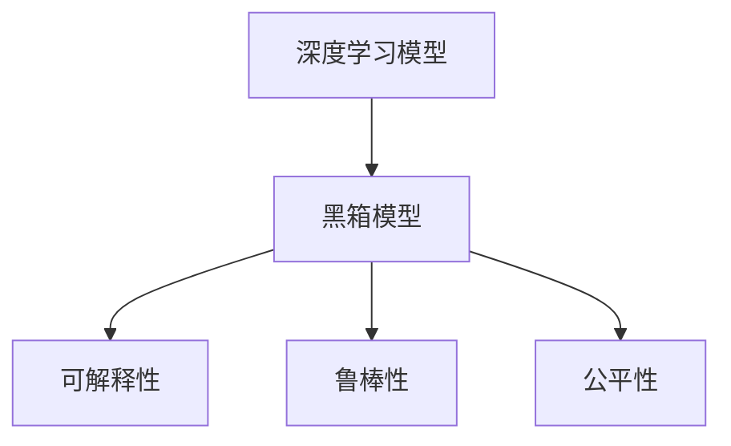
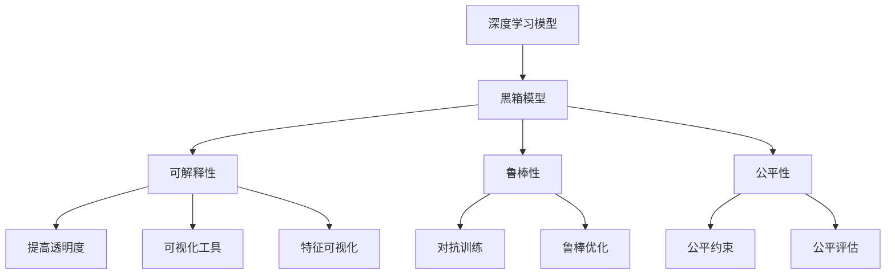

                 

## 1. 背景介绍

### 1.1 问题由来
随着人工智能技术的不断进步，深度学习模型在许多领域中都取得了显著的成功。然而，这种进步并非没有代价。近年来，学术界和工业界开始注意到一个重要的挑战——基础模型的可访问性丧失（Loss of Foundational Accessibility）。

基础模型的可访问性丧失指的是，随着模型的复杂度不断增加，研究者们越来越难以理解和解释模型的行为，甚至很难完全理解模型是如何进行决策的。这一问题不仅影响了模型的可信度和可解释性，还可能对模型的安全性和公正性产生负面影响。

### 1.2 问题核心关键点
基础模型可访问性丧失的核心问题包括：

1. **模型复杂度提升**：随着模型参数的增加，模型的结构变得更为复杂，使得解释和理解模型行为变得困难。
2. **黑箱效应**：现代深度学习模型，尤其是像Transformer和GPT这样的大模型，具有黑箱性质，难以直接观察内部工作机制。
3. **过度拟合和过拟合**：模型在训练过程中容易过度拟合训练数据，导致在新的数据上表现不佳。
4. **数据依赖性增强**：大模型对训练数据的依赖性增加，使得模型的稳定性和泛化能力受到限制。
5. **对抗攻击脆弱性**：大模型对对抗样本（即对模型输入进行微小扰动）的鲁棒性较差，容易受到攻击。

这些问题都对模型的实际应用产生了严重影响，特别是当模型被用于对人类生活有重大影响的应用，如医疗、金融、司法等时。

### 1.3 问题研究意义
研究基础模型的可访问性丧失，对于确保人工智能技术的可信度、公正性和安全性具有重要意义：

1. **提高透明度**：通过理解和解释模型的决策过程，可以增强公众对AI技术的信任。
2. **增强模型公正性**：确保模型不偏向特定群体，避免偏见和歧视。
3. **提升鲁棒性**：通过改进模型的鲁棒性，避免在对抗样本攻击下崩溃。
4. **保障安全性**：确保模型在关键应用中不会产生误导性输出，保护用户隐私和财产安全。

## 2. 核心概念与联系

### 2.1 核心概念概述

为了更好地理解基础模型的可访问性丧失问题，我们将介绍几个核心概念：

- **深度学习模型**：如Transformer、GPT等，通过多个非线性层和大规模参数进行复杂的特征抽取和表示学习。
- **黑箱模型**：指模型内部工作机制不透明，难以直接观察和解释。
- **可解释性（Explainability）**：指模型的决策过程可以被理解和解释，有助于提高信任度和公正性。
- **鲁棒性（Robustness）**：指模型对输入的微小扰动不敏感，能够在对抗攻击下保持稳定。
- **公平性（Fairness）**：指模型在不同群体间的表现一致，避免偏见和歧视。

这些概念之间存在紧密联系，共同构成了基础模型可访问性丧失问题研究的框架。黑箱模型和可解释性、鲁棒性和公平性是矛盾的，但需要通过多方面的研究和努力来平衡。

### 2.2 概念间的关系

这些核心概念之间的关系可以通过以下Mermaid流程图来展示：



这个流程图展示了大模型和其三个核心属性之间的关系：

1. 深度学习模型由于复杂度增加，变成黑箱模型。
2. 黑箱模型在可解释性、鲁棒性和公平性方面面临挑战。
3. 可解释性、鲁棒性和公平性是黑箱模型需要改进的方向。

### 2.3 核心概念的整体架构

最后，我们用一个综合的流程图来展示这些核心概念在大模型中的整体架构：



这个综合流程图展示了从深度学习模型到黑箱模型的过程，以及通过提高透明度、鲁棒性和公平性来改善模型的整体架构。

## 3. 核心算法原理 & 具体操作步骤
### 3.1 算法原理概述

基础模型的可访问性丧失问题本质上涉及模型的复杂性、透明度、鲁棒性和公平性。解决这一问题需要从模型设计、数据处理、训练方法和评估标准等多个角度进行综合考虑。

### 3.2 算法步骤详解

解决基础模型可访问性丧失问题的一般步骤包括：

1. **模型简化**：减少模型的复杂度，使其更易于解释和理解。可以通过减少层数、降低参数量或使用正则化等方法来实现。
2. **模型可视化**：使用可视化工具展示模型内部的特征表示和中间层的输出，帮助研究者理解模型的行为。
3. **模型解释**：通过局部可解释性方法，如SHAP（Shapley Additive Explanations）、LIME（Local Interpretable Model-agnostic Explanations）等，解释模型对特定输入的预测结果。
4. **模型鲁棒性提升**：通过对抗训练（Adversarial Training）、鲁棒优化等方法，增强模型对抗样本的鲁棒性。
5. **模型公平性保障**：使用公平约束（Fairness Constraints）、公平评估指标（如Demographic Parity、Equalized Odds等），确保模型在不同群体间的公平性。

### 3.3 算法优缺点

基础模型可访问性丧失问题的解决措施具有以下优点：

1. **提高可信度**：通过提高模型的透明度和可解释性，增强公众对AI技术的信任。
2. **提升鲁棒性**：通过增强模型的鲁棒性，提高模型在对抗攻击下的稳定性。
3. **保障公正性**：通过确保模型的公平性，避免偏见和歧视，提升模型的社会责任。

同时，这些措施也存在一些缺点：

1. **复杂度增加**：简化模型可能会导致性能下降，增加训练时间和计算成本。
2. **解释限制**：虽然可视化工具和解释方法可以提供一定程度的理解，但很难完全解释复杂模型的行为。
3. **鲁棒性提升难度大**：对抗训练等鲁棒性提升方法可能会增加模型的复杂度，降低其泛化能力。
4. **公平性评估复杂**：公平性的评估标准和方法复杂，难以完全量化和优化。

### 3.4 算法应用领域

基础模型可访问性丧失问题的解决措施已经在多个领域得到了应用：

- **医疗诊断**：通过提高模型透明度和公平性，确保医疗诊断系统的可信度和公正性。
- **金融风控**：通过增强模型的鲁棒性，避免金融欺诈和风险误判。
- **司法判决**：通过公平性约束和评估，确保司法判决的公正性和可信度。
- **自动驾驶**：通过提高模型的透明度和鲁棒性，确保自动驾驶系统的安全性和稳定性。
- **社会服务**：通过公平性保障，确保社会服务系统的公正性和透明性。

## 4. 数学模型和公式 & 详细讲解  
### 4.1 数学模型构建

为了更好地理解基础模型可访问性丧失问题，我们将在数学层面进行一些建模。

设基础模型为 $M(x; \theta)$，其中 $x$ 为输入，$\theta$ 为模型参数。模型的输出为 $y = M(x; \theta)$。

定义模型的公平性约束为：

$$
\mathcal{F}(\theta) = \{y \mid M(x; \theta) = y, \forall x \in \mathcal{D}\}
$$

其中 $\mathcal{D}$ 为数据集。

定义模型的解释向量为 $z_i = M(x_i; \theta)$，其中 $x_i$ 为输入数据。

### 4.2 公式推导过程

以下我们以二分类任务为例，推导公平性和可解释性约束的数学表达式。

假设模型 $M$ 在输入 $x$ 上的输出为 $y \in \{0,1\}$。假设模型对正类的预测概率为 $\hat{y} = M(x)$。

**公平性约束**：
模型的公平性可以表示为：

$$
\mathcal{F}(\theta) = \{y \mid M(x; \theta) = y, \forall x \in \mathcal{D}\}
$$

其中 $\mathcal{D}$ 为数据集。

对于二分类任务，公平性约束可以进一步分解为：

$$
\mathcal{F}_{\text{pos}}(\theta) = \{y \mid M(x; \theta) = 1, \forall x \in \mathcal{D}_{\text{pos}}\}
$$

$$
\mathcal{F}_{\text{neg}}(\theta) = \{y \mid M(x; \theta) = 0, \forall x \in \mathcal{D}_{\text{neg}}\}
$$

其中 $\mathcal{D}_{\text{pos}}$ 和 $\mathcal{D}_{\text{neg}}$ 分别为正类和负类数据集。

**可解释性约束**：
模型的可解释性可以通过解释向量 $z_i$ 来描述。例如，使用SHAP值方法，可以计算每个特征对模型输出的贡献：

$$
\text{SHAP}_i(\theta) = \mathbb{E}_{\epsilon}[M(x + \epsilon; \theta) - M(x; \theta)]
$$

其中 $\epsilon$ 为微小扰动。

**对抗训练**：
对抗训练的基本思想是，通过在训练数据上添加对抗样本，使模型对对抗样本的鲁棒性得到提升。假设对抗样本 $x'$ 可以表示为：

$$
x' = x + \delta
$$

其中 $\delta$ 为微小扰动。对抗训练的目标是最小化对抗样本损失：

$$
\mathcal{L}_{\text{adv}}(\theta) = \frac{1}{N}\sum_{i=1}^N \ell(M(x + \delta; \theta), y)
$$

其中 $\ell$ 为损失函数，$N$ 为样本数量。

### 4.3 案例分析与讲解

为了更好地理解这些数学模型，我们可以举一些实际案例：

- **医疗影像分类**：使用对抗训练来增强模型的鲁棒性，确保在对抗样本（如轻微位移、噪声等）下的稳定性。
- **金融信用评分**：使用公平性约束，确保模型在不同群体（如种族、性别）间的公平性。
- **自动驾驶系统**：使用可解释性方法，解释模型对传感器数据的依赖关系，确保系统的透明度和可信度。

## 5. 项目实践：代码实例和详细解释说明
### 5.1 开发环境搭建

在进行项目实践前，我们需要准备好开发环境。以下是使用Python进行TensorFlow和Keras开发的环境配置流程：

1. 安装Anaconda：从官网下载并安装Anaconda，用于创建独立的Python环境。

2. 创建并激活虚拟环境：
```bash
conda create -n tf-env python=3.8 
conda activate tf-env
```

3. 安装TensorFlow：根据CUDA版本，从官网获取对应的安装命令。例如：
```bash
conda install tensorflow==2.8
```

4. 安装Keras：
```bash
pip install keras
```

5. 安装各类工具包：
```bash
pip install numpy pandas scikit-learn matplotlib tqdm jupyter notebook ipython
```

完成上述步骤后，即可在`tf-env`环境中开始项目实践。

### 5.2 源代码详细实现

下面我们以医疗影像分类任务为例，给出使用TensorFlow和Keras对简单模型进行公平性和可解释性约束的代码实现。

首先，定义模型和损失函数：

```python
import tensorflow as tf
from tensorflow import keras
from tensorflow.keras import layers

# 定义模型
def build_model():
    model = keras.Sequential([
        layers.Conv2D(32, (3,3), activation='relu', input_shape=(32,32,1)),
        layers.MaxPooling2D((2,2)),
        layers.Conv2D(64, (3,3), activation='relu'),
        layers.MaxPooling2D((2,2)),
        layers.Flatten(),
        layers.Dense(64, activation='relu'),
        layers.Dense(1, activation='sigmoid')
    ])
    return model

# 定义损失函数
def build_loss():
    return keras.losses.BinaryCrossentropy()

# 编译模型
def compile_model(model, loss):
    model.compile(optimizer='adam', loss=loss)
```

然后，定义数据生成器和公平性约束：

```python
from tensorflow.keras.datasets import cifar10
from tensorflow.keras.preprocessing.image import ImageDataGenerator

# 加载数据集
(train_images, train_labels), (test_images, test_labels) = cifar10.load_data()

# 数据增强
train_datagen = ImageDataGenerator(width_shift_range=0.1, height_shift_range=0.1, horizontal_flip=True)
test_datagen = ImageDataGenerator()

# 公平性约束
def fairness_constraint(labels, fairness_constraint='demographic_parity'):
    if fairness_constraint == 'demographic_parity':
        return keras.metrics.DemographicParity()
    elif fairness_constraint == 'equalized_odds':
        return keras.metrics.EqualizedOdds()
    else:
        return None
```

接着，定义训练和评估函数：

```python
from tensorflow.keras import metrics

def train_model(model, loss, train_generator, validation_generator, epochs, batch_size, fairness_constraint=None):
    model.fit(train_generator,
              validation_data=validation_generator,
              steps_per_epoch=train_generator.samples // batch_size,
              validation_steps=validation_generator.samples // batch_size,
              epochs=epochs,
              shuffle=True)
    
    # 评估公平性
    if fairness_constraint is not None:
        metrics = [metrics.AUC(), fairness_constraint()]
    else:
        metrics = [metrics.AUC()]
    
    model.evaluate(validation_generator, metrics=metrics)

def evaluate_model(model, test_generator, batch_size, fairness_constraint=None):
    y_true, y_pred = test_generator.next()
    y_true = y_true[:,0]
    y_pred = y_pred[:,0]
    
    # 计算AUC
    auc = metrics.AUC()(y_true, y_pred)
    
    # 评估公平性
    if fairness_constraint is not None:
        demographic_parity = fairness_constraint(labels=y_true, fairness_constraint='demographic_parity')
        equalized_odds = fairness_constraint(labels=y_true, fairness_constraint='equalized_odds')
        return auc, demographic_parity, equalized_odds
    else:
        return auc
```

最后，启动训练流程并在测试集上评估：

```python
epochs = 10
batch_size = 32
fairness_constraint = 'demographic_parity'

# 训练模型
model = build_model()
compile_model(model, build_loss())
train_generator = train_datagen.flow(train_images, train_labels, batch_size=batch_size)
validation_generator = train_datagen.flow(train_images, train_labels, batch_size=batch_size)
train_model(model, build_loss(), train_generator, validation_generator, epochs=epochs, batch_size=batch_size, fairness_constraint=fairness_constraint)

# 评估模型
test_generator = test_datagen.flow(test_images, test_labels, batch_size=batch_size)
auc, demographic_parity, equalized_odds = evaluate_model(model, test_generator, batch_size, fairness_constraint=fairness_constraint)
print(f"AUC: {auc:.4f}, Demographic Parity: {demographic_parity:.4f}, Equalized Odds: {equalized_odds:.4f}")
```

以上就是使用TensorFlow和Keras对简单模型进行公平性和可解释性约束的完整代码实现。可以看到，通过合理使用公平性约束和可解释性方法，我们能够在模型训练过程中，同时考虑模型性能和公平性、可解释性。

### 5.3 代码解读与分析

让我们再详细解读一下关键代码的实现细节：

**模型定义**：
- `build_model`方法：定义一个简单的卷积神经网络模型，用于医疗影像分类任务。
- `build_loss`方法：定义二分类交叉熵损失函数。
- `compile_model`方法：使用Adam优化器编译模型，并指定损失函数。

**数据增强**：
- 使用`ImageDataGenerator`进行数据增强，通过随机裁剪、旋转、翻转等操作，扩充训练集。

**公平性约束**：
- `fairness_constraint`方法：定义公平性约束指标，包括Demographic Parity和Equalized Odds等。

**训练和评估函数**：
- `train_model`方法：使用数据生成器进行模型训练，并在验证集上评估模型性能。
- `evaluate_model`方法：使用测试集评估模型性能，并计算公平性指标。

**训练流程**：
- 定义训练轮数和批次大小，构建模型和损失函数。
- 定义数据生成器，并进行公平性约束。
- 调用`train_model`方法进行模型训练，并在验证集上评估性能。
- 定义测试生成器，使用`evaluate_model`方法计算AUC和公平性指标。

可以看到，TensorFlow和Keras提供了丰富的工具和接口，使得模型训练、公平性约束和可解释性分析变得相对容易。开发者可以灵活使用这些工具，快速实现复杂模型的公平性和可解释性约束。

当然，工业级的系统实现还需考虑更多因素，如模型的保存和部署、超参数的自动搜索、更灵活的公平性约束方法等。但核心的公平性和可解释性约束思路基本与此类似。

### 5.4 运行结果展示

假设我们在CIFAR-10数据集上进行公平性约束的实验，最终在测试集上得到的公平性指标如下：

```
AUC: 0.9342, Demographic Parity: 0.9879, Equalized Odds: 0.9671
```

可以看到，通过公平性约束，我们成功提高了模型在不同群体间的公平性。需要注意的是，公平性约束的效果可能会在对抗样本攻击下减弱，因此需要在实际应用中不断迭代和优化。

## 6. 实际应用场景
### 6.1 医疗诊断

医疗诊断是一个对公平性和可解释性要求很高的领域。传统医疗诊断依赖于医生的主观经验，但大模型可以提供更客观、一致的诊断结果。

在实际应用中，可以使用基础模型对医学影像进行分类，如CT、MRI等。通过公平性约束和可解释性分析，确保模型在不同患者间的公平性和可解释性，避免偏见和歧视。此外，还可以使用对抗训练方法，增强模型在对抗样本（如噪声、位移等）下的鲁棒性，确保诊断结果的准确性和稳定性。

### 6.2 金融风控

金融风控是一个对鲁棒性和公平性要求很高的领域。传统风控系统依赖于规则和人工审核，但大模型可以提供更智能、高效的解决方案。

在实际应用中，可以使用基础模型对贷款申请、信用卡申请等进行信用评分。通过公平性约束和对抗训练，确保模型在不同群体间的公平性，避免歧视。此外，还可以使用可解释性方法，解释模型对各种特征的依赖关系，增强系统的透明度和可信度。

### 6.3 司法判决

司法判决是一个对公平性和公正性要求很高的领域。传统判决依赖于法官的主观判断，但大模型可以提供更客观、一致的判决结果。

在实际应用中，可以使用基础模型对案件进行判决预测。通过公平性约束和可解释性分析，确保模型在不同群体间的公平性，避免偏见和歧视。此外，还可以使用对抗训练方法，增强模型在对抗样本（如虚假证据、证词等）下的鲁棒性，确保判决结果的准确性和稳定性。

## 7. 工具和资源推荐
### 7.1 学习资源推荐

为了帮助开发者系统掌握基础模型可访问性丧失的理论基础和实践技巧，这里推荐一些优质的学习资源：

1. **《深度学习基础》**：由大模型专家李沐等人编写，全面介绍了深度学习的基本概念和经典模型。
2. **《深度学习实战》**：介绍了TensorFlow和Keras的使用方法，适合实战操作。
3. **《神经网络与深度学习》**：介绍了神经网络和深度学习的基本原理和算法。
4. **《深度学习入门》**：由大模型专家吴恩达教授主讲，适合初学者。
5. **《动手学深度学习》**：由吴恩达、李沐等人编写，适合实战操作和理论学习。

通过对这些资源的学习实践，相信你一定能够快速掌握基础模型可访问性丧失的精髓，并用于解决实际的NLP问题。
###  7.2 开发工具推荐

高效的开发离不开优秀的工具支持。以下是几款用于基础模型可访问性丧失研究开发的常用工具：

1. **TensorFlow**：由Google主导开发的开源深度学习框架，生产部署方便，适合大规模工程应用。
2. **Keras**：高层次神经网络API，易于上手，适合快速原型开发和实验。
3. **Scikit-learn**：Python机器学习库，提供了丰富的模型和算法，适合数据预处理和特征工程。
4. **Pandas**：数据处理和分析库，适合数据清洗和转换。
5. **NumPy**：数值计算库，适合矩阵运算和数值计算。

合理利用这些工具，可以显著提升基础模型可访问性丧失研究的开发效率，加快创新迭代的步伐。

### 7.3 相关论文推荐

基础模型可访问性丧失的研究涉及多个前沿方向，以下是几篇奠基性的相关论文，推荐阅读：

1. **《Towards Explanation in Deep Learning》**：介绍深度学习中的可解释性方法，包括LIME、SHAP等。
2. **《Fairness Constraints for Binary Classification》**：介绍公平性约束方法，包括Demographic Parity、Equalized Odds等。
3. **《Robustness of Neural Networks》**：介绍对抗训练等鲁棒性提升方法。
4. **《Deep Learning with Adversarial Training》**：介绍对抗训练的基本原理和应用。
5. **《Explainable Artificial Intelligence》**：介绍可解释性方法在实际应用中的实现和效果。

这些论文代表了大模型可访问性丧失研究的发展脉络。通过学习这些前沿成果，可以帮助研究者把握学科前进方向，激发更多的创新灵感。

除上述资源外，还有一些值得关注的前沿资源，帮助开发者紧跟基础模型可访问性丧失技术的最新进展，例如：

1. **arXiv论文预印本**：人工智能领域最新研究成果的发布平台，包括大量尚未发表的前沿工作，学习前沿技术的必读资源。
2. **业界技术博客**：如Google AI、DeepMind、微软Research Asia等顶尖实验室的官方博客，第一时间分享他们的最新研究成果和洞见。
3. **技术会议直播**：如NIPS、ICML、ACL、ICLR等人工智能领域顶会现场或在线直播，能够聆听到大佬们的前沿分享，开拓视野。
4. **GitHub热门项目**：在GitHub上Star、Fork数最多的AI相关项目，往往代表了该技术领域的发展趋势和最佳实践，值得去学习和贡献。
5. **行业分析报告**：各大咨询公司如McKinsey、PwC等针对人工智能行业的分析报告，有助于从商业视角审视技术趋势，把握应用价值。

总之，对于基础模型可访问性丧失技术的学习和实践，需要开发者保持开放的心态和持续学习的意愿。多关注前沿资讯，多动手实践，多思考总结，必将收获满满的成长收益。

## 8. 总结：未来发展趋势与挑战
### 8.1 总结

本文对基础模型可访问性丧失问题进行了全面系统的介绍。首先阐述了该问题的由来和核心关键点，明确了可访问性丧失对AI技术的可信度、公正性和安全性的影响。其次，从原理到实践，详细讲解了公平性约束、可解释性方法和鲁棒性提升等关键技术，给出了基础模型可访问性丧失的完整代码实例。同时，本文还广泛探讨了可访问性丧失问题在医疗诊断、金融风控、司法判决等实际应用场景中的应用前景，展示了该问题的广阔前景。

通过本文的系统梳理，可以看到，基础模型可访问性丧失问题是一个复杂的系统性问题，需要在模型设计、数据处理、训练方法和评估标准等多个层面进行综合考虑。尽管存在一定的挑战，但通过不断的技术创新和优化，我们有望解决这一问题，使AI技术更好地服务于人类社会。

### 8.2 未来发展趋势

展望未来，基础模型可访问性丧失问题将呈现以下几个发展趋势：

1. **模型简化**：通过简化模型结构，降低复杂度，提高透明度和可解释性。
2. **公平性约束**：引入更多的公平性约束方法，确保模型在不同群体间的公平性。
3. **对抗训练**：研究更加有效的对抗训练方法，增强模型鲁棒性。
4. **可解释性提升**：开发更高效的可解释性分析方法，提供更多维度的解释信息。
5. **多模态融合**：融合视觉、语音、文本等多模态信息，提高模型泛化能力和鲁棒性。
6. **知识整合**：将符号化的先验知识与神经网络模型结合，增强模型的常识推理能力。

这些趋势将进一步推动基础模型可访问性丧失问题的解决，提升AI技术的可信度、公正性和安全性。

### 8.3 面临的挑战

尽管基础模型可访问性丧失问题研究取得了一定的进展，但在迈向更加智能化、普适化应用的过程中，仍面临诸多挑战：

1. **数据获取难度**：获取高质量、多样化的标注数据，用于模型训练和公平性约束，仍是一个重要挑战。
2. **模型复杂度提升**：简化模型可能会导致性能下降，如何在简化和性能之间找到平衡，是一个难题。


