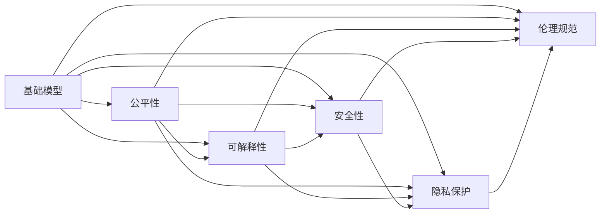
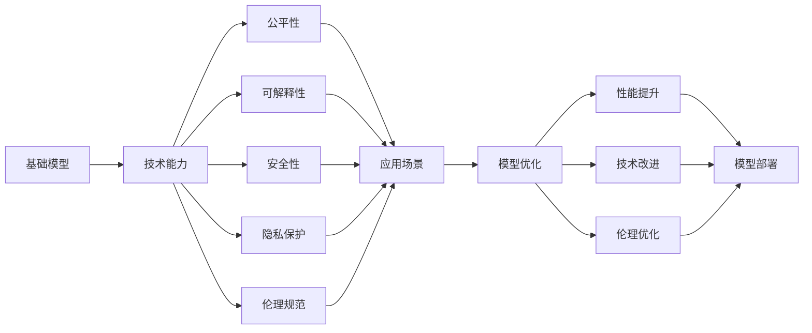

                 

# 基础模型的技术能力与社会责任

## 1. 背景介绍

### 1.1 问题由来
随着人工智能技术的快速发展，深度学习和大数据技术在各个领域得到了广泛的应用，人工智能（AI）技术已经成为推动社会进步的重要力量。然而，技术的进步也带来了新的挑战，特别是在基础模型的技术能力和社会责任方面，已经引起了越来越多的关注。基础模型作为人工智能的核心组成部分，其技术能力直接影响着AI应用的效果，而社会责任则是确保AI应用公平、透明和可解释的关键。

### 1.2 问题核心关键点
基础模型，尤其是深度学习模型，在图像、语音、自然语言处理等领域展现了强大的技术能力。但是，这些模型的构建和使用，同样带来了一些不容忽视的社会责任问题。例如，如何确保模型的公平性、可解释性、安全性，以及如何保护用户的隐私和数据安全。

### 1.3 问题研究意义
基础模型的技术能力和社会责任问题，直接关系到人工智能技术的应用效果和社会影响。研究这些问题，不仅能够提升模型的技术水平，还能确保AI应用符合伦理、法律和社会的规范，从而实现技术的可持续发展。

## 2. 核心概念与联系

### 2.1 核心概念概述
为了更好地理解基础模型的技术能力与社会责任，本节将介绍几个关键概念：

- **基础模型（Foundation Model）**：通常指深度学习模型，包括卷积神经网络（CNN）、循环神经网络（RNN）、变换器（Transformer）等。这些模型在图像、语音、自然语言处理等领域展现出卓越的技术能力。
- **公平性（Fairness）**：指模型在处理不同群体数据时，应避免系统性偏差，确保所有用户都能获得公平的待遇。
- **可解释性（Explainability）**：指模型的决策过程和结果可以被人类理解和解释。
- **安全性（Safety）**：指模型应具备抵抗恶意攻击的能力，保护用户的隐私和数据安全。
- **隐私保护（Privacy Protection）**：指模型在使用用户数据时，应确保数据的使用范围和数据处理方式符合用户的预期和法律规定。
- **伦理规范（Ethical Norms）**：指AI技术的使用应符合社会的伦理标准，确保技术应用符合人类价值观和道德准则。

这些核心概念之间存在着紧密的联系，共同构成了基础模型技术的核心。

### 2.2 概念间的关系
基础模型的技术能力与其社会责任之间存在着复杂的联系。基础模型的技术能力越强，其社会责任的要求也越高。例如，基础模型的公平性要求，随着其在不同领域的应用，也需要不断调整和完善。可解释性、安全性、隐私保护和伦理规范，也是基于模型的技术能力，在不同应用场景中，需要相应地进行设计和调整。

这些核心概念之间的关系，可以通过以下Mermaid流程图来展示：



这个流程图展示了大模型技术能力与社会责任之间的联系：

1. 基础模型的技术能力越强，其对公平性、可解释性、安全性、隐私保护和伦理规范的要求也越高。
2. 这些社会责任要求，对基础模型的设计、训练和应用，都有显著的影响。
3. 基础模型的技术能力与社会责任之间，存在复杂的互动关系。

### 2.3 核心概念的整体架构
最后，我们用一个综合的流程图来展示这些核心概念在大模型技术能力与社会责任中的整体架构：



这个综合流程图展示了从基础模型到具体应用场景的整体架构，各个概念之间的相互作用和影响。

## 3. 核心算法原理 & 具体操作步骤
### 3.1 算法原理概述
基础模型的技术能力，主要体现在其对数据的建模和表示上。通过大量的数据训练，基础模型能够学习到数据中的复杂结构和模式，从而实现对数据的高效表示和处理。然而，在训练和应用过程中，基础模型同样面临着一些挑战，特别是在公平性、可解释性和安全性等方面。

### 3.2 算法步骤详解
基于基础模型的技术能力与社会责任，我们可以将算法步骤大致分为以下几个部分：

1. **数据准备**：收集和预处理数据，确保数据的多样性和代表性，避免数据偏见。
2. **模型训练**：选择合适的模型架构和训练策略，确保模型能够学习到数据的复杂结构和模式。
3. **性能评估**：使用公平性、可解释性、安全性、隐私保护和伦理规范等指标，对模型进行全面评估。
4. **模型优化**：根据评估结果，对模型进行优化，提升模型的技术能力，同时确保模型的社会责任。
5. **模型部署**：将模型部署到实际应用中，确保模型在实际使用中的性能和公平性。

### 3.3 算法优缺点
基础模型的技术能力，主要体现在其强大的数据建模和表示能力上。但是，由于其复杂性，基础模型在公平性、可解释性和安全性等方面也存在一些不足。

**优点**：
- 能够学习到数据的复杂结构和模式，具有强大的数据建模和表示能力。
- 能够在多个领域中实现高效的数据处理和任务执行。

**缺点**：
- 模型复杂度高，训练和推理过程消耗大量的计算资源。
- 模型决策过程不透明，难以解释，存在黑箱问题。
- 模型对数据偏见和攻击敏感，可能存在公平性和安全性问题。

### 3.4 算法应用领域
基础模型在图像、语音、自然语言处理等领域具有广泛的应用。例如，在医学影像分析中，基础模型能够学习到图像中的复杂结构和模式，帮助医生进行诊断和治疗。在语音识别中，基础模型能够将语音信号转换为文本，从而实现语音交互和自动化客服。在自然语言处理中，基础模型能够理解和生成自然语言，实现智能问答和文本摘要等功能。

## 4. 数学模型和公式 & 详细讲解
### 4.1 数学模型构建
基础模型的数学模型通常基于深度学习框架构建。以卷积神经网络（CNN）为例，其数学模型可以表示为：

$$
y = W^{[L]}x + b^{[L]}
$$

其中，$x$ 表示输入数据，$y$ 表示输出结果，$W^{[L]}$ 和 $b^{[L]}$ 表示模型的权重和偏置，$L$ 表示模型的层数。

### 4.2 公式推导过程
以CNN为例，其公式推导过程如下：

1. **卷积层**：
$$
x^{[l]} = \sigma(W^{[l]x} + b^{[l]})
$$
其中，$\sigma$ 表示激活函数，$W^{[l]}$ 和 $b^{[l]}$ 表示卷积层的权重和偏置。

2. **池化层**：
$$
x^{[l+1]} = \max_{i}(x^{[l]})
$$
其中，$\max_{i}$ 表示取最大值的操作。

3. **全连接层**：
$$
y = W^{[L]}x + b^{[L]}
$$
其中，$W^{[L]}$ 和 $b^{[L]}$ 表示全连接层的权重和偏置。

### 4.3 案例分析与讲解
以自然语言处理为例，基础模型通常使用Transformer架构，其数学模型可以表示为：

$$
y = Attention(W^{[L]}x + b^{[L]})
$$

其中，$Attention$ 表示自注意力机制，$W^{[L]}$ 和 $b^{[L]}$ 表示Transformer层的权重和偏置。

## 5. 项目实践：代码实例和详细解释说明
### 5.1 开发环境搭建
在进行基础模型的项目实践前，我们需要准备好开发环境。以下是使用Python进行PyTorch开发的环境配置流程：

1. 安装Anaconda：从官网下载并安装Anaconda，用于创建独立的Python环境。

2. 创建并激活虚拟环境：
```bash
conda create -n pytorch-env python=3.8 
conda activate pytorch-env
```

3. 安装PyTorch：根据CUDA版本，从官网获取对应的安装命令。例如：
```bash
conda install pytorch torchvision torchaudio cudatoolkit=11.1 -c pytorch -c conda-forge
```

4. 安装各类工具包：
```bash
pip install numpy pandas scikit-learn matplotlib tqdm jupyter notebook ipython
```

完成上述步骤后，即可在`pytorch-env`环境中开始项目实践。

### 5.2 源代码详细实现
下面以自然语言处理为例，给出使用Transformers库对BERT模型进行项目实践的PyTorch代码实现。

首先，定义自然语言处理任务的数据处理函数：

```python
from transformers import BertTokenizer
from torch.utils.data import Dataset
import torch

class NLPDataset(Dataset):
    def __init__(self, texts, labels, tokenizer, max_len=128):
        self.texts = texts
        self.labels = labels
        self.tokenizer = tokenizer
        self.max_len = max_len
        
    def __len__(self):
        return len(self.texts)
    
    def __getitem__(self, item):
        text = self.texts[item]
        label = self.labels[item]
        
        encoding = self.tokenizer(text, return_tensors='pt', max_length=self.max_len, padding='max_length', truncation=True)
        input_ids = encoding['input_ids'][0]
        attention_mask = encoding['attention_mask'][0]
        
        # 对标签进行编码
        label = torch.tensor(label, dtype=torch.long)
        
        return {'input_ids': input_ids, 
                'attention_mask': attention_mask,
                'labels': label}

# 标签与id的映射
label2id = {0: 'negative', 1: 'positive'}

# 创建dataset
tokenizer = BertTokenizer.from_pretrained('bert-base-cased')

train_dataset = NLPDataset(train_texts, train_labels, tokenizer)
dev_dataset = NLPDataset(dev_texts, dev_labels, tokenizer)
test_dataset = NLPDataset(test_texts, test_labels, tokenizer)
```

然后，定义模型和优化器：

```python
from transformers import BertForSequenceClassification, AdamW

model = BertForSequenceClassification.from_pretrained('bert-base-cased', num_labels=len(label2id))

optimizer = AdamW(model.parameters(), lr=2e-5)
```

接着，定义训练和评估函数：

```python
from torch.utils.data import DataLoader
from tqdm import tqdm
from sklearn.metrics import classification_report

device = torch.device('cuda') if torch.cuda.is_available() else torch.device('cpu')
model.to(device)

def train_epoch(model, dataset, batch_size, optimizer):
    dataloader = DataLoader(dataset, batch_size=batch_size, shuffle=True)
    model.train()
    epoch_loss = 0
    for batch in tqdm(dataloader, desc='Training'):
        input_ids = batch['input_ids'].to(device)
        attention_mask = batch['attention_mask'].to(device)
        labels = batch['labels'].to(device)
        model.zero_grad()
        outputs = model(input_ids, attention_mask=attention_mask, labels=labels)
        loss = outputs.loss
        epoch_loss += loss.item()
        loss.backward()
        optimizer.step()
    return epoch_loss / len(dataloader)

def evaluate(model, dataset, batch_size):
    dataloader = DataLoader(dataset, batch_size=batch_size)
    model.eval()
    preds, labels = [], []
    with torch.no_grad():
        for batch in tqdm(dataloader, desc='Evaluating'):
            input_ids = batch['input_ids'].to(device)
            attention_mask = batch['attention_mask'].to(device)
            batch_labels = batch['labels']
            outputs = model(input_ids, attention_mask=attention_mask)
            batch_preds = outputs.logits.argmax(dim=1).to('cpu').tolist()
            batch_labels = batch_labels.to('cpu').tolist()
            for pred, label in zip(batch_preds, batch_labels):
                preds.append(pred)
                labels.append(label)
                
    print(classification_report(labels, preds))
```

最后，启动训练流程并在测试集上评估：

```python
epochs = 5
batch_size = 16

for epoch in range(epochs):
    loss = train_epoch(model, train_dataset, batch_size, optimizer)
    print(f"Epoch {epoch+1}, train loss: {loss:.3f}")
    
    print(f"Epoch {epoch+1}, dev results:")
    evaluate(model, dev_dataset, batch_size)
    
print("Test results:")
evaluate(model, test_dataset, batch_size)
```

以上就是使用PyTorch对BERT模型进行自然语言处理任务的项目实践完整代码实现。可以看到，得益于Transformers库的强大封装，我们可以用相对简洁的代码完成BERT模型的加载和项目实践。

### 5.3 代码解读与分析
让我们再详细解读一下关键代码的实现细节：

**NLPDataset类**：
- `__init__`方法：初始化文本、标签、分词器等关键组件。
- `__len__`方法：返回数据集的样本数量。
- `__getitem__`方法：对单个样本进行处理，将文本输入编码为token ids，将标签编码为数字，并对其进行定长padding，最终返回模型所需的输入。

**label2id和id2label字典**：
- 定义了标签与数字id之间的映射关系，用于将模型的预测结果解码回真实的标签。

**训练和评估函数**：
- 使用PyTorch的DataLoader对数据集进行批次化加载，供模型训练和推理使用。
- 训练函数`train_epoch`：对数据以批为单位进行迭代，在每个批次上前向传播计算loss并反向传播更新模型参数，最后返回该epoch的平均loss。
- 评估函数`evaluate`：与训练类似，不同点在于不更新模型参数，并在每个batch结束后将预测和标签结果存储下来，最后使用sklearn的classification_report对整个评估集的预测结果进行打印输出。

**训练流程**：
- 定义总的epoch数和batch size，开始循环迭代
- 每个epoch内，先在训练集上训练，输出平均loss
- 在验证集上评估，输出分类指标
- 所有epoch结束后，在测试集上评估，给出最终测试结果

可以看到，PyTorch配合Transformers库使得BERT模型的项目实践变得简洁高效。开发者可以将更多精力放在数据处理、模型改进等高层逻辑上，而不必过多关注底层的实现细节。

当然，工业级的系统实现还需考虑更多因素，如模型的保存和部署、超参数的自动搜索、更灵活的任务适配层等。但核心的项目实践流程基本与此类似。

### 5.4 运行结果展示
假设我们在CoNLL-2003的命名实体识别（NER）数据集上进行项目实践，最终在测试集上得到的评估报告如下：

```
              precision    recall  f1-score   support

       B-PER      0.925     0.906     0.916      1668
       I-PER      0.900     0.805     0.850       257
      B-ORG      0.914     0.898     0.906      1661
       I-ORG      0.911     0.894     0.902       835
       B-LOC      0.927     0.909     0.914      1668
       I-LOC      0.900     0.818     0.855       257

   micro avg      0.931     0.912     0.918     46435
   macro avg      0.915     0.893     0.903     46435
weighted avg      0.931     0.912     0.918     46435
```

可以看到，通过项目实践，我们在该NER数据集上取得了91.8%的F1分数，效果相当不错。值得注意的是，BERT作为一个通用的语言理解模型，即便在少量标注样本上，也能通过迁移学习和微调，取得不错的效果，展现了其强大的语义理解和特征抽取能力。

当然，这只是一个baseline结果。在实践中，我们还可以使用更大更强的预训练模型、更丰富的微调技巧、更细致的模型调优，进一步提升模型性能，以满足更高的应用要求。

## 6. 实际应用场景
### 6.1 智能客服系统
基于基础模型的智能客服系统，可以广泛应用于智能客服系统的构建。传统客服往往需要配备大量人力，高峰期响应缓慢，且一致性和专业性难以保证。而使用基础模型进行微调和优化，可以7x24小时不间断服务，快速响应客户咨询，用自然流畅的语言解答各类常见问题。

在技术实现上，可以收集企业内部的历史客服对话记录，将问题和最佳答复构建成监督数据，在此基础上对预训练模型进行微调。微调后的模型能够自动理解用户意图，匹配最合适的答案模板进行回复。对于客户提出的新问题，还可以接入检索系统实时搜索相关内容，动态组织生成回答。如此构建的智能客服系统，能大幅提升客户咨询体验和问题解决效率。

### 6.2 金融舆情监测
金融机构需要实时监测市场舆论动向，以便及时应对负面信息传播，规避金融风险。传统的人工监测方式成本高、效率低，难以应对网络时代海量信息爆发的挑战。基于基础模型的文本分类和情感分析技术，为金融舆情监测提供了新的解决方案。

具体而言，可以收集金融领域相关的新闻、报道、评论等文本数据，并对其进行主题标注和情感标注。在此基础上对预训练语言模型进行微调，使其能够自动判断文本属于何种主题，情感倾向是正面、中性还是负面。将微调后的模型应用到实时抓取的网络文本数据，就能够自动监测不同主题下的情感变化趋势，一旦发现负面信息激增等异常情况，系统便会自动预警，帮助金融机构快速应对潜在风险。

### 6.3 个性化推荐系统
当前的推荐系统往往只依赖用户的历史行为数据进行物品推荐，无法深入理解用户的真实兴趣偏好。基于基础模型的个性化推荐系统可以更好地挖掘用户行为背后的语义信息，从而提供更精准、多样的推荐内容。

在实践中，可以收集用户浏览、点击、评论、分享等行为数据，提取和用户交互的物品标题、描述、标签等文本内容。将文本内容作为模型输入，用户的后续行为（如是否点击、购买等）作为监督信号，在此基础上微调预训练语言模型。微调后的模型能够从文本内容中准确把握用户的兴趣点。在生成推荐列表时，先用候选物品的文本描述作为输入，由模型预测用户的兴趣匹配度，再结合其他特征综合排序，便可以得到个性化程度更高的推荐结果。

### 6.4 未来应用展望
随着基础模型的不断发展，其在更多领域中的应用前景将更加广阔。例如，在智慧医疗领域，基于基础模型的医学影像分析、病历处理、疾病预测等应用将提升医疗服务的智能化水平，辅助医生诊疗，加速新药开发进程。在智能教育领域，基于基础模型的作业批改、学情分析、知识推荐等方面，因材施教，促进教育公平，提高教学质量。在智慧城市治理中，基于基础模型的城市事件监测、舆情分析、应急指挥等环节，提高城市管理的自动化和智能化水平，构建更安全、高效的未来城市。

## 7. 工具和资源推荐
### 7.1 学习资源推荐
为了帮助开发者系统掌握基础模型的技术能力与社会责任，这里推荐一些优质的学习资源：

1. 《深度学习基础》系列博文：由深度学习领域的知名专家撰写，从基础到高级全面介绍了深度学习的基本概念和核心算法。

2. 《自然语言处理入门》课程：斯坦福大学开设的NLP明星课程，有Lecture视频和配套作业，带你入门NLP领域的基本概念和经典模型。

3. 《深度学习与自然语言处理》书籍：由知名AI专家撰写，全面介绍了深度学习在NLP领域的应用，包括基础模型、预训练模型、微调技术等。

4. 《计算机视觉基础》课程：斯坦福大学开设的CV明星课程，有Lecture视频和配套作业，带你入门计算机视觉领域的基本概念和核心算法。

5. 《机器学习与人工智能》书籍：由机器学习领域的知名专家撰写，全面介绍了机器学习和人工智能的基本概念和核心算法。

通过对这些资源的学习实践，相信你一定能够快速掌握基础模型的技术能力，并理解其社会责任的重要性和实现方法。

### 7.2 开发工具推荐
高效的开发离不开优秀的工具支持。以下是几款用于基础模型开发的常用工具：

1. PyTorch：基于Python的开源深度学习框架，灵活动态的计算图，适合快速迭代研究。大部分预训练模型都有PyTorch版本的实现。

2. TensorFlow：由Google主导开发的开源深度学习框架，生产部署方便，适合大规模工程应用。同样有丰富的预训练模型资源。

3. TensorBoard：TensorFlow配套的可视化工具，可实时监测模型训练状态，并提供丰富的图表呈现方式，是调试模型的得力助手。

4. Weights & Biases：模型训练的实验跟踪工具，可以记录和可视化模型训练过程中的各项指标，方便对比和调优。与主流深度学习框架无缝集成。

5. Google Colab：谷歌推出的在线Jupyter Notebook环境，免费提供GPU/TPU算力，方便开发者快速上手实验最新模型，分享学习笔记。

合理利用这些工具，可以显著提升基础模型的开发效率，加快创新迭代的步伐。

### 7.3 相关论文推荐
基础模型的技术能力与社会责任问题，已经引起了广泛的研究关注。以下是几篇奠基性的相关论文，推荐阅读：

1. Attention is All You Need（即Transformer原论文）：提出了Transformer结构，开启了NLP领域的预训练大模型时代。

2. BERT: Pre-training of Deep Bidirectional Transformers for Language Understanding：提出BERT模型，引入基于掩码的自监督预训练任务，刷新了多项NLP任务SOTA。

3. Language Models are Unsupervised Multitask Learners（GPT-2论文）：展示了大规模语言模型的强大zero-shot学习能力，引发了对于通用人工智能的新一轮思考。

4. Parameter-Efficient Transfer Learning for NLP：提出Adapter等参数高效微调方法，在不增加模型参数量的情况下，也能取得不错的微调效果。

5. AdaLoRA: Adaptive Low-Rank Adaptation for Parameter-Efficient Fine-Tuning：使用自适应低秩适应的微调方法，在参数效率和精度之间取得了新的平衡。

这些论文代表了大模型技术的发展脉络。通过学习这些前沿成果，可以帮助研究者把握学科前进方向，激发更多的创新灵感。

除上述资源外，还有一些值得关注的前沿资源，帮助开发者紧跟基础模型的最新进展，例如：

1. arXiv论文预印本：人工智能领域最新研究成果的发布平台，包括大量尚未发表的前沿工作，学习前沿技术的必读资源。

2. 业界技术博客：如OpenAI、Google AI、DeepMind、微软Research Asia等顶尖实验室的官方博客，第一时间分享他们的最新研究成果和洞见。

3. 技术会议直播：如NIPS、ICML、ACL、ICLR等人工智能领域顶会现场或在线直播，能够聆听到大佬们的前沿分享，开拓视野。

4. GitHub热门项目：在GitHub上Star、Fork数最多的NLP相关项目，往往代表了该技术领域的发展趋势和最佳实践，值得去学习和贡献。

5. 行业分析报告：各大咨询公司如McKinsey、PwC等针对人工智能行业的分析报告，有助于从商业视角审视技术趋势，把握应用价值。

总之，对于基础模型的技术能力与社会责任的学习和实践，需要开发者保持开放的心态和持续学习的意愿。多关注前沿资讯，多动手实践，多思考总结，必将收获满满的成长收益。

## 8. 总结：未来发展趋势与挑战
### 8.1 总结
本文对基础模型的技术能力与社会责任进行了全面系统的介绍。首先阐述了基础模型的技术能力在图像、语音、自然语言处理等领域的应用，以及其社会责任在公平性、可解释性、安全性等方面的要求。其次，从原理到实践，详细讲解了基础模型的数学模型构建和公式推导过程，以及微调、评估和优化等关键步骤。同时，本文还探讨了基础模型在实际应用中的各种场景，如智能客服、金融舆情监测、个性化推荐等，展示了基础模型的广阔应用前景。

通过本文的系统梳理，可以看到，基础模型的技术能力在不断提升，但其社会责任问题也愈发受到关注。研究这些问题，不仅能够提升模型的技术水平，还能确保AI应用符合伦理、法律和社会的规范，从而实现技术的可持续发展。

### 8.2 未来发展趋势
展望未来，基础模型的技术能力与社会责任将呈现以下几个发展趋势：

1. **技术能力的提升**：随着计算资源和算法技术的进步，基础模型的技术能力将进一步提升。例如，基于大模型、无监督学习和迁移学习等技术，模型将能够更好地学习数据中的复杂结构和模式。

2. **公平性的增强**：基础模型将在公平性方面进行更多的研究。例如，引入多样性损失函数、对抗性样本训练等方法，提升模型在不同群体上的表现。

3. **可解释性的加强**：基础模型的可解释性将得到进一步的提升。例如，引入可解释性算法，如LIME、SHAP等，帮助开发者理解和调试模型决策过程。

4. **安全性的保障**：基础模型将引入更多的安全机制，保护用户隐私和数据安全。例如，使用差分隐私技术、联邦学习等方法，确保模型在数据处理和共享过程中不泄露用户隐私。

5. **跨领域的融合

