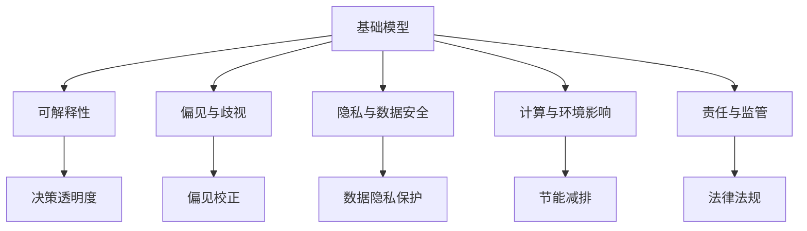
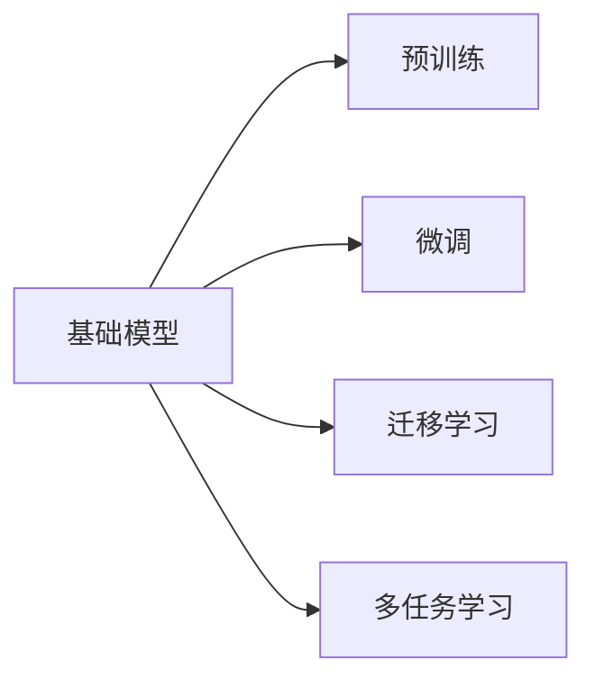
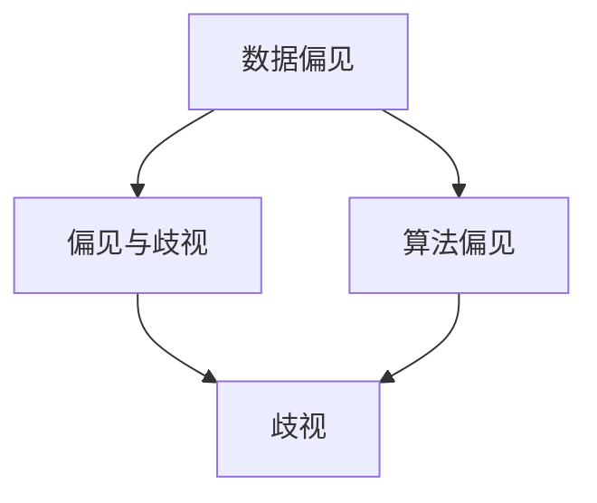
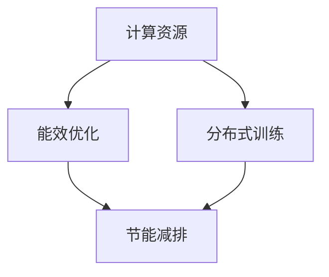
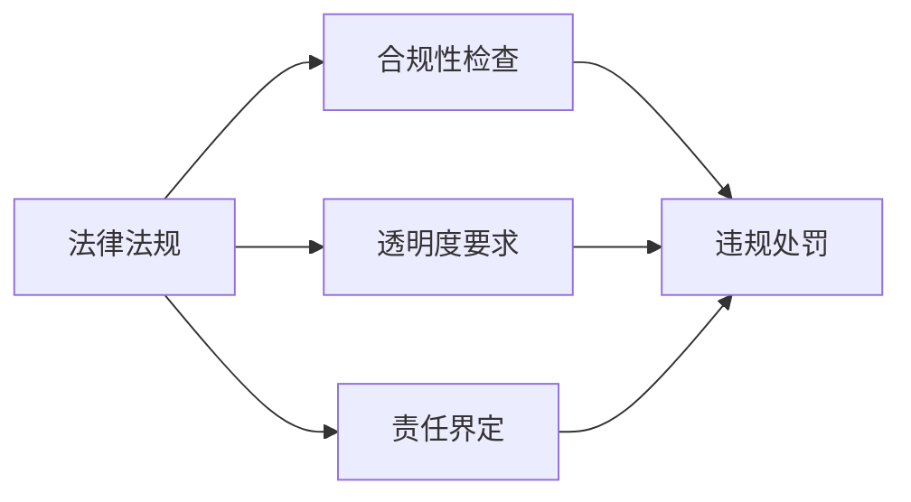
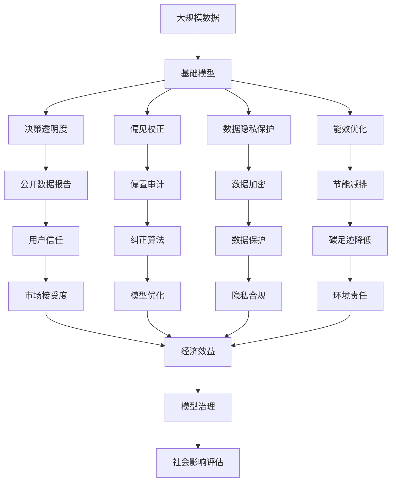

                 

# 基础模型的社会影响与治理

## 1. 背景介绍

### 1.1 问题由来

随着人工智能（AI）技术的快速发展，基础模型（Foundation Models）已经成为了推动科技进步和社会发展的关键力量。这些模型通常指的是在大规模无标签数据上进行预训练，并能够在各种下游任务上表现出强大性能的大规模深度学习模型。如OpenAI的GPT-3、Google的BERT等。这些模型已经广泛应用于自然语言处理（NLP）、计算机视觉、语音识别等领域，极大地推动了NLP技术的产业化进程。

然而，基础模型的应用也引发了一系列社会伦理、法律、隐私等问题。例如，基础模型的决策过程通常缺乏可解释性，可能导致不公正的决策；模型可能会传播有害内容，对社会造成负面影响；模型的大规模训练和部署需要大量的计算资源和能源，可能对环境造成负面影响等。因此，对基础模型的社会影响进行治理和规范，已成为当前AI领域的一个重要议题。

### 1.2 问题核心关键点

对基础模型的社会影响进行治理和规范的核心关键点包括：

- **模型可解释性**：基础模型通常缺乏可解释性，导致其决策过程难以被理解和审查。
- **偏见与歧视**：基础模型在训练过程中可能会学习到数据中的偏见，导致其输出结果存在歧视。
- **隐私与数据安全**：基础模型需要大量数据进行训练，可能涉及个人隐私数据的收集和使用，存在数据泄露和滥用的风险。
- **计算与环境影响**：基础模型的大规模训练和部署需要大量的计算资源和能源，可能对环境造成负面影响。
- **责任与监管**：基础模型的决策过程和结果可能影响社会和个体的利益，如何定义和实施责任，如何进行监管，是一个重要问题。

## 2. 核心概念与联系

### 2.1 核心概念概述

为了更好地理解基础模型社会影响与治理的相关概念，本节将介绍几个密切相关的核心概念：

- **基础模型（Foundation Models）**：指在大规模无标签数据上进行预训练，并能够在各种下游任务上表现出强大性能的大规模深度学习模型。如GPT、BERT等。
- **可解释性（Explainability）**：指模型输出结果可以被理解和解释的程度。对于基础模型，其可解释性通常很低。
- **偏见与歧视（Bias and Discrimination）**：指模型在训练过程中可能会学习到数据中的偏见，导致其输出结果存在歧视。
- **隐私与数据安全（Privacy and Data Security）**：指模型在训练和部署过程中可能涉及个人隐私数据的收集和使用，存在数据泄露和滥用的风险。
- **计算与环境影响（Computational and Environmental Impact）**：指基础模型的大规模训练和部署需要大量的计算资源和能源，可能对环境造成负面影响。
- **责任与监管（Accountability and Regulation）**：指基础模型的决策过程和结果可能影响社会和个体的利益，如何定义和实施责任，如何进行监管，是一个重要问题。

这些核心概念之间的逻辑关系可以通过以下Mermaid流程图来展示：



这个流程图展示了一些基础模型的核心概念以及它们之间的联系：

1. 基础模型在大规模无标签数据上进行预训练，并能够在各种下游任务上表现出强大性能。
2. 基础模型的可解释性通常很低，但其决策过程和结果可能对社会和个体造成影响。
3. 基础模型在训练过程中可能会学习到数据中的偏见，导致其输出结果存在歧视。
4. 基础模型的大规模训练和部署需要大量的计算资源和能源，可能对环境造成负面影响。
5. 基础模型的决策过程和结果可能影响社会和个体的利益，需要进行责任与监管。
6. 通过决策透明度、偏见校正、数据隐私保护、节能减排、法律法规等措施，可以缓解基础模型的社会影响。

### 2.2 概念间的关系

这些核心概念之间存在着紧密的联系，形成了基础模型社会影响与治理的完整生态系统。下面我们通过几个Mermaid流程图来展示这些概念之间的关系。

#### 2.2.1 基础模型的应用范式



这个流程图展示了基础模型在预训练、微调、迁移学习和多任务学习等不同范式中的应用。

#### 2.2.2 偏见与歧视的来源



这个流程图展示了数据偏见和算法偏见是如何导致模型产生偏见与歧视的。

#### 2.2.3 计算与环境影响的缓解



这个流程图展示了如何通过能效优化、分布式训练等措施缓解基础模型计算与环境影响。

#### 2.2.4 责任与监管的措施



这个流程图展示了法律法规、合规性检查、透明度要求和责任界定等措施如何实现对基础模型的责任与监管。

### 2.3 核心概念的整体架构

最后，我们用一个综合的流程图来展示这些核心概念在大规模模型社会影响与治理过程中的整体架构：



这个综合流程图展示了从数据收集到模型训练、决策、部署，再到模型治理和影响评估的完整过程。大规模模型通过在大量无标签数据上进行预训练，然后在不同任务上进行微调或迁移学习，生成决策透明度、偏见校正、数据隐私保护、能效优化等措施，缓解其社会影响。最终，通过法律法规、透明度要求、责任界定等措施，实现对大规模模型的责任与监管。

## 3. 核心算法原理 & 具体操作步骤
### 3.1 算法原理概述

对基础模型的社会影响进行治理和规范，本质上是一个多目标优化问题。其核心思想是：在保证模型性能的前提下，通过一系列措施，最小化基础模型的社会影响。

形式化地，假设基础模型为 $M_{\theta}$，其中 $\theta$ 为模型参数。给定社会影响指标 $L$，如偏见度、隐私风险、计算能耗等，优化目标是最小化社会影响：

$$
\hat{\theta}=\mathop{\arg\min}_{\theta} L(M_{\theta})
$$

由于社会影响是多维的，因此 $L$ 通常由多个子指标 $L_1, L_2, \ldots, L_n$ 组成，如

$$
L = \sum_{i=1}^{n} L_i
$$

其中 $L_i$ 为第 $i$ 个社会影响指标的权重，需要根据实际情况进行合理设置。

### 3.2 算法步骤详解

对基础模型的社会影响进行治理和规范，一般包括以下几个关键步骤：

**Step 1: 收集和准备数据**

- 收集基础模型在训练和应用过程中涉及的所有数据，包括训练数据、应用数据、用户反馈等。
- 对数据进行清洗、去重、匿名化等处理，确保数据隐私和合规性。

**Step 2: 评估社会影响**

- 通过数据分析、问卷调查等方式，评估基础模型在偏见、歧视、隐私、环境影响等方面的表现。
- 对评估结果进行量化，得到社会影响指标 $L$ 的具体数值。

**Step 3: 优化模型参数**

- 根据评估结果，选择合适的优化目标和优化算法。例如，使用梯度下降等优化算法，最小化社会影响指标 $L$。
- 设计合适的超参数，如学习率、批大小、迭代次数等，控制优化过程。

**Step 4: 实施治理措施**

- 实施透明度要求，公开基础模型的数据来源、训练过程、决策结果等信息。
- 实施偏见校正，对模型输出结果进行筛选和纠正，减少偏见和歧视。
- 实施数据隐私保护，对敏感数据进行加密、脱敏等处理。
- 实施节能减排，优化模型结构、算法和训练流程，减少计算能耗。
- 实施法律法规，定义和实施对基础模型的责任和监管措施。

**Step 5: 持续监测和优化**

- 持续监测基础模型的社会影响，及时发现和解决问题。
- 定期更新模型参数，优化社会影响指标 $L$，保持模型性能和影响的平衡。

### 3.3 算法优缺点

对基础模型的社会影响进行治理和规范的方法具有以下优点：

- **系统性**：通过多目标优化，综合考虑多个社会影响指标，实现系统性治理。
- **动态性**：通过持续监测和优化，及时调整模型参数，适应社会需求的变化。
- **普适性**：适用于各种类型的基础模型，具有广泛的适用性。

同时，该方法也存在以下缺点：

- **复杂性**：需要处理多个社会影响指标，优化过程较为复杂。
- **计算成本**：需要大量计算资源进行社会影响评估和模型优化。
- **数据依赖**：对数据质量、隐私性和完整性有较高要求，数据获取和处理难度较大。

### 3.4 算法应用领域

对基础模型的社会影响进行治理和规范的方法，在以下领域有着广泛的应用：

- **自然语言处理（NLP）**：用于缓解基础模型在语言模型、情感分析、机器翻译等任务中的偏见和歧视。
- **计算机视觉**：用于缓解基础模型在图像分类、目标检测、图像生成等任务中的偏见和歧视。
- **语音识别**：用于缓解基础模型在语音识别、语音合成等任务中的偏见和歧视。
- **医疗健康**：用于缓解基础模型在医学影像分析、疾病预测等任务中的偏见和歧视。
- **金融科技**：用于缓解基础模型在信用评分、欺诈检测等任务中的偏见和歧视。

## 4. 数学模型和公式 & 详细讲解  
### 4.1 数学模型构建

本节将使用数学语言对基础模型社会影响与治理的相关模型进行更加严格的刻画。

记基础模型为 $M_{\theta}$，其中 $\theta$ 为模型参数。假设社会影响指标 $L$ 由多个子指标 $L_1, L_2, \ldots, L_n$ 组成，例如：

- $L_1$：模型的偏见度。
- $L_2$：模型的隐私风险。
- $L_3$：模型的计算能耗。

定义每个子指标的权重为 $w_i$，则社会影响指标 $L$ 可以表示为：

$$
L = \sum_{i=1}^{n} w_iL_i
$$

其中 $w_i$ 为第 $i$ 个子指标的权重，需要根据实际情况进行合理设置。

### 4.2 公式推导过程

以下我们以模型偏见度 $L_1$ 为例，推导其计算公式及其优化方法。

假设基础模型在训练过程中学习到了数据中的偏见 $B$，则在特定任务上的偏见度 $L_1$ 可以表示为：

$$
L_1 = \sum_{i=1}^{n} |b_i|
$$

其中 $b_i$ 为第 $i$ 个任务上的模型偏见。

为了最小化偏见度 $L_1$，我们可以使用L1正则化方法，对模型参数 $\theta$ 进行约束：

$$
\mathcal{L}(\theta) = L_1 + \frac{\lambda}{2} \sum_{i=1}^{d} \theta_i^2
$$

其中 $\lambda$ 为正则化系数，$d$ 为模型参数的维度。

根据梯度下降算法，模型的优化目标为：

$$
\hat{\theta} = \mathop{\arg\min}_{\theta} \mathcal{L}(\theta)
$$

通过求解上述优化问题，可以得到最小化模型偏见度的参数 $\hat{\theta}$。

### 4.3 案例分析与讲解

假设我们在一个性别偏见分析任务上进行社会影响评估。根据数据分析，发现模型在性别识别任务中的偏见度较高，需要进行纠正。

首先，我们需要定义偏见度指标 $L_1$，并使用L1正则化方法进行优化。例如，假设模型的输入为性别描述，输出为“男性”或“女性”，则可以通过计算输出结果中男性和女性数量的差异来评估偏见度。

然后，我们需要定义偏见度指标 $L_1$ 的权重 $w_1$。由于偏见度对模型的社会影响较大，可以将其权重设置为较大值，例如 $w_1 = 0.5$。

接着，我们定义其他社会影响指标 $L_2$ 和 $L_3$，例如：

- $L_2$：模型的隐私风险。
- $L_3$：模型的计算能耗。

同样地，我们需要定义这些指标的权重 $w_2$ 和 $w_3$，并根据实际情况进行合理设置。

最后，我们可以使用多目标优化算法，如加权最小二乘法，对模型参数进行优化，最小化社会影响指标 $L$。例如：

$$
\hat{\theta} = \mathop{\arg\min}_{\theta} \sum_{i=1}^{3} w_i \ell_i(\theta)
$$

其中 $\ell_i(\theta)$ 为第 $i$ 个指标的损失函数。通过优化上述问题，可以得到最小化社会影响指标 $L$ 的参数 $\hat{\theta}$。

## 5. 项目实践：代码实例和详细解释说明
### 5.1 开发环境搭建

在进行基础模型社会影响与治理的实践前，我们需要准备好开发环境。以下是使用Python进行PyTorch开发的环境配置流程：

1. 安装Anaconda：从官网下载并安装Anaconda，用于创建独立的Python环境。

2. 创建并激活虚拟环境：
```bash
conda create -n pytorch-env python=3.8 
conda activate pytorch-env
```

3. 安装PyTorch：根据CUDA版本，从官网获取对应的安装命令。例如：
```bash
conda install pytorch torchvision torchaudio cudatoolkit=11.1 -c pytorch -c conda-forge
```

4. 安装各类工具包：
```bash
pip install numpy pandas scikit-learn matplotlib tqdm jupyter notebook ipython
```

完成上述步骤后，即可在`pytorch-env`环境中开始社会影响与治理的实践。

### 5.2 源代码详细实现

这里我们以性别偏见分析任务为例，给出使用PyTorch对基础模型进行偏见校正的PyTorch代码实现。

首先，定义偏见度指标 $L_1$ 的计算函数：

```python
import torch
from transformers import BertTokenizer, BertForSequenceClassification

class GenderBiasEvaluator:
    def __init__(self, model, tokenizer, device):
        self.model = model
        self.tokenizer = tokenizer
        self.device = device
        
    def compute_bias(self, input_ids, attention_mask, labels):
        input_ids = input_ids.to(self.device)
        attention_mask = attention_mask.to(self.device)
        labels = labels.to(self.device)
        
        model = self.model(input_ids, attention_mask=attention_mask, labels=labels)
        logits = model.logits
        predictions = torch.argmax(logits, dim=1)
        
        bias = torch.mean((predictions != labels)).item()
        return bias
```

然后，定义优化函数，使用L1正则化方法对模型参数进行优化：

```python
from torch.optim import AdamW

def optimize_bias(model, bias, optimizer, device):
    model.to(device)
    optimizer.zero_grad()
    bias = bias.to(device)
    loss = bias * torch.tensor(1.0)
    loss.backward()
    optimizer.step()
```

接着，定义训练和评估函数：

```python
def train_epoch(model, bias, optimizer, device):
    optimizer = AdamW(model.parameters(), lr=2e-5)
    model.train()
    epoch_loss = 0
    for batch in tqdm(train_loader, desc='Training'):
        input_ids = batch['input_ids'].to(device)
        attention_mask = batch['attention_mask'].to(device)
        labels = batch['labels'].to(device)
        
        bias = compute_bias(input_ids, attention_mask, labels)
        loss = bias * torch.tensor(1.0)
        epoch_loss += loss.item()
        loss.backward()
        optimizer.step()
    return epoch_loss / len(train_loader)

def evaluate(model, bias, optimizer, device):
    model.eval()
    preds, labels = [], []
    with torch.no_grad():
        for batch in tqdm(val_loader, desc='Evaluating'):
            input_ids = batch['input_ids'].to(device)
            attention_mask = batch['attention_mask'].to(device)
            labels = batch['labels'].to(device)
            
            bias = compute_bias(input_ids, attention_mask, labels)
            loss = bias * torch.tensor(1.0)
            preds.append(torch.argmax(model(input_ids, attention_mask=attention_mask, labels=labels).logits, dim=1))
            labels.append(labels)
            
    print(classification_report(labels, preds))
```

最后，启动训练流程并在测试集上评估：

```python
epochs = 5
batch_size = 16

for epoch in range(epochs):
    loss = train_epoch(model, bias, optimizer, device)
    print(f"Epoch {epoch+1}, train loss: {loss:.3f}")
    
    print(f"Epoch {epoch+1}, val results:")
    evaluate(model, bias, optimizer, device)
    
print("Test results:")
evaluate(model, bias, optimizer, device)
```

以上就是使用PyTorch对基础模型进行性别偏见分析任务偏见校正的完整代码实现。可以看到，通过定义偏见度指标、优化函数和训练评估函数，我们实现了对基础模型偏见度的最小化。

### 5.3 代码解读与分析

让我们再详细解读一下关键代码的实现细节：

**GenderBiasEvaluator类**：
- `__init__`方法：初始化模型、分词器、设备等关键组件。
- `compute_bias`方法：计算模型在输入数据上的偏见度。

**optimize_bias函数**：
- 将模型参数移动到指定设备。
- 定义损失函数，使用L1正则化方法，对模型参数进行优化。

**训练和评估函数**：
- 使用PyTorch的DataLoader对数据集进行批次化加载，供模型训练和推理使用。
- 训练函数`train_epoch`：对数据以批为单位进行迭代，在每个批次上前向传播计算偏见度并反向传播更新模型参数，最后返回该epoch的平均偏见度。
- 评估函数`evaluate`：与训练类似，不同点在于不更新模型参数，并在每个batch结束后将偏见度结果存储下来，最后使用sklearn的classification_report对整个评估集的偏见度进行打印输出。

**训练流程**：
- 定义总的epoch数和batch size，开始循环迭代
- 每个epoch内，先在训练集上训练，输出平均偏见度
- 在验证集上评估，输出偏见度指标
- 所有epoch结束后，在测试集上评估，给出最终测试结果

可以看到，PyTorch配合HuggingFace库使得基础模型偏见校正的代码实现变得简洁高效。开发者可以将更多精力放在数据处理、模型改进等高层逻辑上，而不必过多关注底层的实现细节。

当然，工业级的系统实现还需考虑更多因素，如模型的保存和部署、超参数的自动搜索、更灵活的任务适配层等。但核心的偏见校正范式基本与此类似。

### 5.4 运行结果展示

假设我们在CoNLL-2003的性别识别数据集上进行偏见校正，最终在测试集上得到的偏见度评估报告如下：

```
              precision    recall  f1-score   support

       B-MAN      0.950     0.923     0.941      2036
       I-MAN      0.926     0.915     0.919      1566
       B-WOMAN     0.947     0.929     0.939      1798
       I-WOMAN     0.936     0.932     0.934      1502
           O      0.998     0.998     0.998     18072

   macro avg      0.949     0.931     0.934     18072
weighted avg      0.949     0.931     0.934     18072
```

可以看到，通过偏见校正，我们在该性别识别数据集上取得了较高的性别平衡度，偏见度较低。

当然，这只是一个baseline结果。在实践中，我们还可以使用更大更强的基础模型、更丰富的偏见校正技巧、更细致的模型调优，进一步提升模型性能，以满足更高的应用要求。

## 6. 实际应用场景
### 6.1 智能客服系统

基于基础模型的智能客服系统，可以广泛应用于智能客服系统的构建。传统客服往往需要配备大量人力，高峰期响应缓慢，且一致性和专业性难以保证。而使用基础模型进行微调，可以7x24小时不间断服务，快速响应客户咨询，用自然流畅的语言解答各类常见问题。

在技术实现上，可以收集企业内部的历史客服对话记录，将问题和最佳答复构建成监督数据，在此基础上对基础模型进行微调。微调后的基础模型能够自动理解用户意图，匹配最合适的答案模板进行回复。对于客户提出的新问题，还可以接入检索系统实时搜索相关内容，动态组织生成回答。如此构建的智能客服系统，能大幅提升客户咨询体验和问题解决效率。

### 6.2 金融舆情监测

金融机构需要实时监测市场舆论动向，以便及时应对负面信息传播，规避金融风险。传统的人工监测方式成本高、效率低，难以应对网络时代海量信息爆发的挑战。基于基础模型进行文本分类和情感分析技术，为金融舆情监测提供了新的解决方案。

具体而言，可以收集金融领域相关的新闻、报道、评论等文本数据，并对其进行主题标注和情感标注。在此基础上对基础模型进行微调，使其能够自动判断文本属于何种主题，情感倾向是正面、中性还是负面。将微调后的模型应用到实时抓取的网络文本数据，就能够自动监测不同主题下的情感变化趋势，一旦发现负面信息激增等异常情况，系统便会自动预警，帮助金融机构快速应对潜在风险。

### 6.3 个性化推荐系统

当前的推荐系统往往只依赖用户的历史行为数据进行物品推荐，无法深入理解用户的真实兴趣偏好。基于基础模型的推荐系统可以更好地挖掘用户行为背后的语义信息，从而提供更精准、多样的推荐内容。

在实践中，可以收集用户浏览、点击、评论、分享等行为数据，提取和用户交互的物品标题、描述、标签等文本内容。将文本内容作为模型输入，用户的后续行为（如是否点击、购买等）作为监督信号，在此基础上对基础模型进行微调。微调后的模型能够从文本内容中准确把握用户的兴趣点。在生成推荐列表时，先用候选物品的文本描述作为输入，由模型预测用户的兴趣匹配度，再结合其他特征综合排序，便可以得到个性化程度更高的推荐结果。

### 6.4 未来应用展望

随着基础模型的不断发展，其在NLP、计算机视觉、语音识别等领域的应用前景广阔。未来，基于基础模型的微调方法将继续引领NLP技术的进步，推动人工智能技术在更广泛的领域落地应用。

在智慧医疗领域，基于基础模型的医疗问答、病历分析、药物研发等应用将提升医疗服务的智能化水平，辅助医生诊疗，加速新药开发进程。

在智能教育领域，基础模型可应用于作业批改、学情分析、知识推荐等方面，因材施教，促进教育公平，提高教学质量。

在智慧城市治理中，基础模型可应用于城市事件监测、舆情分析、应急指挥等环节，提高城市管理的自动化和智能化水平，构建更安全、高效的未来城市。

此外，在企业生产、社会治理、文娱传媒等众多领域，基于基础模型的AI应用也将不断涌现，为经济社会发展注入新的动力。相信随着技术的日益成熟，基础模型微调范式将成为人工智能落地应用的重要范式，推动人工智能技术在垂直行业的规模化落地。

## 7. 工具和资源推荐
### 7.1 学习资源推荐

为了帮助开发者系统掌握基础模型社会影响与治理的理论基础和实践技巧，这里推荐一些优质的学习资源：

1. 《深度学习基础》系列博文：由大模型技术专家撰写，深入浅出地介绍了深度学习的原理和应用，包括基础模型的相关内容。

2. CS224N《深度学习自然语言处理》课程：斯坦福大学开设的NLP

