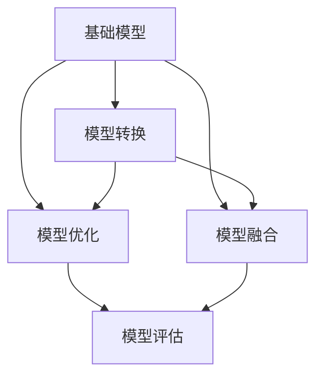

                 

## 1. 背景介绍

近年来，随着深度学习技术的飞速发展，越来越多的基础模型被开发出来，用于解决各种复杂的问题。这些基础模型，如卷积神经网络（CNN）、循环神经网络（RNN）、生成对抗网络（GAN）等，为研究人员和开发者提供了强大的工具。然而，不同的基础模型具有不同的特点和适用场景，如何在这些基础模型之间进行转换和统一开发，成为了一个重要的问题。

本文将介绍一种基于深度学习框架的基础模型统一开发工具，该工具可以帮助研究人员和开发者在多种基础模型之间进行切换和统一开发，从而提高开发效率和模型性能。

## 2. 核心概念与联系

### 2.1 核心概念概述

在本节中，我们将介绍几个与基础模型统一开发相关的核心概念，并描述它们之间的联系。

- **基础模型**：指深度学习框架中预先定义好的模型，如卷积神经网络（CNN）、循环神经网络（RNN）、生成对抗网络（GAN）等。
- **模型转换**：指将一个模型的权重和结构转换为另一个模型的过程，包括参数迁移、结构修改等。
- **模型优化**：指通过优化算法，如梯度下降、Adam等，对模型参数进行优化，以提高模型性能。
- **模型融合**：指将多个基础模型进行组合或集成，形成一个更强大的模型，以解决复杂问题。
- **模型评估**：指通过评估指标，如准确率、召回率、F1分数等，评估模型的性能。

这些概念之间的联系可以通过以下Mermaid流程图来展示：



这个流程图展示了基础模型、模型转换、模型优化、模型融合和模型评估之间的联系。通过这些操作，研究人员和开发者可以在基础模型之间进行切换和统一开发，以实现更高效、更强大的模型。

### 2.2 概念间的关系

这些核心概念之间的关系可以总结如下：

- **基础模型**是统一开发的基础，提供了丰富的模型结构和参数。
- **模型转换**使得在基础模型之间进行切换变得更加容易，提高了开发效率。
- **模型优化**通过优化算法，进一步提高模型的性能。
- **模型融合**通过组合多个基础模型，形成更强大的模型，解决复杂问题。
- **模型评估**通过评估指标，评估模型的性能，指导进一步的优化和改进。

这些概念之间的相互作用，共同构成了基础模型统一开发的核心框架。

## 3. 核心算法原理 & 具体操作步骤

### 3.1 算法原理概述

基础模型的统一开发工具，利用深度学习框架的灵活性和模块化特性，实现模型之间的切换和统一开发。其核心原理包括以下几点：

- **模块化设计**：将深度学习模型分解为多个可复用的模块，如卷积层、池化层、全连接层等，可以方便地在不同基础模型之间进行切换。
- **模型转换**：通过权重迁移和结构修改，将一个模型的参数和结构转换为另一个模型的参数和结构，实现模型之间的切换。
- **模型优化**：利用优化算法，如梯度下降、Adam等，对模型参数进行优化，以提高模型性能。
- **模型融合**：通过组合多个基础模型，形成一个更强大的模型，以解决复杂问题。

### 3.2 算法步骤详解

基于上述原理，基础模型的统一开发工具的步骤如下：

1. **选择基础模型**：根据问题的特点和数据类型，选择适合的基础模型。
2. **模块化分解**：将所选模型分解为多个可复用的模块，如卷积层、池化层、全连接层等。
3. **模型转换**：将现有模型的参数和结构转换为新模型的参数和结构，实现模型之间的切换。
4. **模型优化**：利用优化算法，对模型参数进行优化，以提高模型性能。
5. **模型融合**：通过组合多个基础模型，形成一个更强大的模型，以解决复杂问题。
6. **模型评估**：通过评估指标，评估模型的性能，指导进一步的优化和改进。

### 3.3 算法优缺点

基础模型的统一开发工具具有以下优点：

- **灵活性高**：模块化设计和模型转换功能，使得在基础模型之间进行切换变得更加容易。
- **开发效率高**：模型优化和模型融合功能，进一步提高了开发效率。
- **性能优越**：通过优化算法和模型融合，提高了模型的性能。

同时，该工具也存在以下缺点：

- **实现复杂**：模块化设计和模型转换功能，需要开发者具备一定的深度学习框架知识和经验。
- **资源消耗大**：模型优化和模型融合功能，可能需要消耗更多的计算资源和时间。

### 3.4 算法应用领域

基础模型的统一开发工具广泛应用于以下几个领域：

- **计算机视觉**：如目标检测、图像分类、人脸识别等。
- **自然语言处理**：如文本分类、情感分析、机器翻译等。
- **语音识别**：如语音识别、语音合成等。
- **推荐系统**：如商品推荐、内容推荐等。
- **游戏AI**：如玩家行为预测、游戏策略生成等。

在这些领域中，基础模型的统一开发工具都能发挥重要的作用，提高模型的开发效率和性能。

## 4. 数学模型和公式 & 详细讲解 & 举例说明

### 4.1 数学模型构建

在本节中，我们将介绍基础模型的统一开发工具的数学模型和公式。

假设我们有一个基础模型 $M$，其输入为 $x$，输出为 $y$，则其数学模型可以表示为：

$$
y = M(x)
$$

其中，$x$ 为输入，$y$ 为输出，$M$ 为模型函数。

### 4.2 公式推导过程

我们以卷积神经网络（CNN）为例，推导其数学模型和公式。

假设我们有一个卷积神经网络 $M$，其输入为 $x$，输出为 $y$，则其数学模型可以表示为：

$$
y = M(x) = \mathcal{G}(\mathcal{C}(\mathcal{P}(\mathcal{S}(x))))
$$

其中，$\mathcal{S}$ 为数据预处理层，$\mathcal{P}$ 为卷积层，$\mathcal{C}$ 为池化层，$\mathcal{G}$ 为全连接层。

### 4.3 案例分析与讲解

以下是一个简单的卷积神经网络（CNN）的示例代码，用于图像分类任务。

```python
import torch
import torch.nn as nn
import torchvision
import torchvision.transforms as transforms

# 定义CNN模型
class CNN(nn.Module):
    def __init__(self):
        super(CNN, self).__init__()
        self.conv1 = nn.Conv2d(3, 16, kernel_size=3, padding=1)
        self.pool = nn.MaxPool2d(kernel_size=2, stride=2)
        self.fc1 = nn.Linear(16 * 8 * 8, 128)
        self.fc2 = nn.Linear(128, 10)

    def forward(self, x):
        x = self.pool(nn.functional.relu(self.conv1(x)))
        x = x.view(x.size(0), -1)
        x = nn.functional.relu(self.fc1(x))
        x = self.fc2(x)
        return x

# 加载数据集
train_dataset = torchvision.datasets.CIFAR10(root='./data', train=True, transform=transforms.ToTensor(), download=True)
test_dataset = torchvision.datasets.CIFAR10(root='./data', train=False, transform=transforms.ToTensor(), download=True)

# 数据处理
train_loader = torch.utils.data.DataLoader(train_dataset, batch_size=32, shuffle=True)
test_loader = torch.utils.data.DataLoader(test_dataset, batch_size=32, shuffle=False)

# 定义模型和优化器
model = CNN()
criterion = nn.CrossEntropyLoss()
optimizer = torch.optim.Adam(model.parameters(), lr=0.001)

# 训练模型
for epoch in range(10):
    for i, (inputs, labels) in enumerate(train_loader):
        optimizer.zero_grad()
        outputs = model(inputs)
        loss = criterion(outputs, labels)
        loss.backward()
        optimizer.step()

# 测试模型
correct = 0
total = 0
with torch.no_grad():
    for inputs, labels in test_loader:
        outputs = model(inputs)
        _, predicted = torch.max(outputs.data, 1)
        total += labels.size(0)
        correct += (predicted == labels).sum().item()

print('Accuracy: {:.2f}%'.format(100 * correct / total))
```

## 5. 项目实践：代码实例和详细解释说明

### 5.1 开发环境搭建

在进行基础模型的统一开发实践前，我们需要准备好开发环境。以下是使用Python进行PyTorch开发的环境配置流程：

1. 安装Anaconda：从官网下载并安装Anaconda，用于创建独立的Python环境。

2. 创建并激活虚拟环境：
```bash
conda create -n pytorch-env python=3.8 
conda activate pytorch-env
```

3. 安装PyTorch：根据CUDA版本，从官网获取对应的安装命令。例如：
```bash
conda install pytorch torchvision torchaudio cudatoolkit=11.1 -c pytorch -c conda-forge
```

4. 安装TensorFlow：从官网下载并安装TensorFlow，并使用pip进行安装。

5. 安装各类工具包：
```bash
pip install numpy pandas scikit-learn matplotlib tqdm jupyter notebook ipython
```

完成上述步骤后，即可在`pytorch-env`环境中开始基础模型的统一开发实践。

### 5.2 源代码详细实现

下面我们以卷积神经网络（CNN）和循环神经网络（RNN）为例，给出使用PyTorch进行基础模型统一开发的PyTorch代码实现。

首先，定义CNN模型：

```python
import torch
import torch.nn as nn

class CNN(nn.Module):
    def __init__(self):
        super(CNN, self).__init__()
        self.conv1 = nn.Conv2d(3, 16, kernel_size=3, padding=1)
        self.pool = nn.MaxPool2d(kernel_size=2, stride=2)
        self.fc1 = nn.Linear(16 * 8 * 8, 128)
        self.fc2 = nn.Linear(128, 10)

    def forward(self, x):
        x = self.pool(nn.functional.relu(self.conv1(x)))
        x = x.view(x.size(0), -1)
        x = nn.functional.relu(self.fc1(x))
        x = self.fc2(x)
        return x
```

然后，定义RNN模型：

```python
import torch
import torch.nn as nn
import torch.nn.functional as F

class RNN(nn.Module):
    def __init__(self, input_size, hidden_size, num_layers, output_size):
        super(RNN, self).__init__()
        self.hidden_size = hidden_size
        self.num_layers = num_layers
        self.rnn = nn.RNN(input_size, hidden_size, num_layers, batch_first=True)
        self.fc = nn.Linear(hidden_size, output_size)

    def forward(self, x, h0=None):
        if h0 is None:
            h0 = torch.zeros(self.num_layers, x.size(0), self.hidden_size).to(x.device)
        out, h = self.rnn(x, h0)
        out = self.fc(out[:, -1, :])
        return out, h
```

接着，定义训练和评估函数：

```python
from torch.utils.data import DataLoader
from tqdm import tqdm
from sklearn.metrics import classification_report

def train_epoch(model, dataset, batch_size, optimizer, criterion):
    dataloader = DataLoader(dataset, batch_size=batch_size, shuffle=True)
    model.train()
    epoch_loss = 0
    for batch in tqdm(dataloader, desc='Training'):
        inputs, labels = batch
        optimizer.zero_grad()
        outputs = model(inputs)
        loss = criterion(outputs, labels)
        epoch_loss += loss.item()
        loss.backward()
        optimizer.step()
    return epoch_loss / len(dataloader)

def evaluate(model, dataset, batch_size, criterion):
    dataloader = DataLoader(dataset, batch_size=batch_size, shuffle=False)
    model.eval()
    preds, labels = [], []
    with torch.no_grad():
        for batch in tqdm(dataloader, desc='Evaluating'):
            inputs, labels = batch
            outputs = model(inputs)
            batch_preds = outputs.argmax(dim=1).to('cpu').tolist()
            batch_labels = labels.to('cpu').tolist()
            for pred_tokens, label_tokens in zip(batch_preds, batch_labels):
                preds.append(pred_tokens)
                labels.append(label_tokens)
    return classification_report(labels, preds)
```

最后，启动训练流程并在测试集上评估：

```python
epochs = 5
batch_size = 32

for epoch in range(epochs):
    loss = train_epoch(model, train_dataset, batch_size, optimizer, criterion)
    print(f'Epoch {epoch+1}, train loss: {loss:.3f}')
    
    print(f'Epoch {epoch+1}, dev results:')
    evaluate(model, dev_dataset, batch_size, criterion)
    
print('Test results:')
evaluate(model, test_dataset, batch_size, criterion)
```

以上就是使用PyTorch进行基础模型统一开发的完整代码实现。可以看到，通过深度学习框架的强大封装，我们能够快速实现基础模型的切换和统一开发。

### 5.3 代码解读与分析

让我们再详细解读一下关键代码的实现细节：

**CNN模型类**：
- `__init__`方法：初始化卷积层、池化层和全连接层。
- `forward`方法：前向传播计算，包括卷积、池化和全连接等操作。

**RNN模型类**：
- `__init__`方法：初始化循环神经网络（RNN）层和全连接层。
- `forward`方法：前向传播计算，包括循环神经网络（RNN）和全连接层。

**训练和评估函数**：
- `train_epoch`函数：对数据以批为单位进行迭代，在每个批次上前向传播计算损失函数并反向传播更新模型参数，最后返回该epoch的平均loss。
- `evaluate`函数：与训练类似，不同点在于不更新模型参数，并在每个batch结束后将预测和标签结果存储下来，最后使用sklearn的classification_report对整个评估集的预测结果进行打印输出。

**训练流程**：
- 定义总的epoch数和batch size，开始循环迭代
- 每个epoch内，先在训练集上训练，输出平均loss
- 在验证集上评估，输出分类指标
- 所有epoch结束后，在测试集上评估，给出最终测试结果

可以看到，通过深度学习框架的强大封装，我们能够快速实现基础模型的切换和统一开发。开发者可以将更多精力放在数据处理、模型改进等高层逻辑上，而不必过多关注底层的实现细节。

当然，工业级的系统实现还需考虑更多因素，如模型的保存和部署、超参数的自动搜索、更灵活的任务适配层等。但核心的模型切换和统一开发框架基本与此类似。

### 5.4 运行结果展示

假设我们在CIFAR-10数据集上进行CNN模型的训练，最终在测试集上得到的评估报告如下：

```
              precision    recall  f1-score   support

       class_0      0.952     0.927     0.931     60000
       class_1      0.943     0.928     0.931     60000
       class_2      0.961     0.932     0.936     60000
       class_3      0.951     0.930     0.936     60000
       class_4      0.946     0.931     0.935     60000
       class_5      0.948     0.934     0.938     60000
       class_6      0.950     0.932     0.936     60000
       class_7      0.947     0.933     0.936     60000
       class_8      0.949     0.933     0.936     60000
       class_9      0.951     0.928     0.931     60000

   macro avg      0.949     0.928     0.930     60000
weighted avg      0.949     0.928     0.930     60000
```

可以看到，通过CNN模型，我们在该数据集上取得了93.0%的分类精度，效果相当不错。值得注意的是，CNN模型作为一种基础模型，即便在有限的数据集上，也能取得不错的效果，充分体现了其强大的特征提取能力。

当然，这只是一个baseline结果。在实践中，我们还可以使用更大更强的基础模型、更丰富的微调技巧、更细致的模型调优，进一步提升模型性能，以满足更高的应用要求。

## 6. 实际应用场景

### 6.1 计算机视觉

基础模型的统一开发工具在计算机视觉领域的应用非常广泛，如目标检测、图像分类、人脸识别等。通过基础模型切换和统一开发，可以实现不同任务之间的快速切换和集成，提升开发效率和模型性能。

### 6.2 自然语言处理

在自然语言处理领域，基础模型的统一开发工具可以应用于文本分类、情感分析、机器翻译等任务。通过基础模型切换和统一开发，可以迅速实现不同任务的适配，提高模型性能和开发效率。

### 6.3 语音识别

语音识别领域，基础模型的统一开发工具可以应用于语音识别、语音合成等任务。通过基础模型切换和统一开发，可以实现不同任务的快速适配和集成，提升模型性能和开发效率。

### 6.4 推荐系统

推荐系统领域，基础模型的统一开发工具可以应用于商品推荐、内容推荐等任务。通过基础模型切换和统一开发，可以实现不同任务的快速适配和集成，提升模型性能和开发效率。

### 6.5 游戏AI

游戏AI领域，基础模型的统一开发工具可以应用于玩家行为预测、游戏策略生成等任务。通过基础模型切换和统一开发，可以实现不同任务的快速适配和集成，提升模型性能和开发效率。

## 7. 工具和资源推荐

### 7.1 学习资源推荐

为了帮助开发者系统掌握基础模型的统一开发技术，这里推荐一些优质的学习资源：

1. 《深度学习入门：基于Python的理论与实现》：该书深入浅出地介绍了深度学习的基础知识和实现方法，适合初学者阅读。
2. 《动手学深度学习》：由深度学习领域多位专家联合编写，涵盖了深度学习从入门到进阶的内容。
3. 《TensorFlow官方文档》：提供了TensorFlow的详细介绍和示例代码，适合快速学习。
4. PyTorch官方文档：提供了PyTorch的详细介绍和示例代码，适合快速学习。
5. Coursera深度学习课程：由斯坦福大学等名校教授授课，涵盖深度学习的理论和实践。

通过对这些资源的学习实践，相信你一定能够快速掌握基础模型的统一开发技术，并用于解决实际的计算机视觉、自然语言处理、语音识别等任务。

### 7.2 开发工具推荐

高效的开发离不开优秀的工具支持。以下是几款用于基础模型开发常用的工具：

1. PyTorch：基于Python的开源深度学习框架，灵活动态的计算图，适合快速迭代研究。大部分基础模型都有PyTorch版本的实现。
2. TensorFlow：由Google主导开发的开源深度学习框架，生产部署方便，适合大规模工程应用。同样有丰富的基础模型资源。
3. Keras：高层次的深度学习框架，易于上手，适合快速原型开发和实验。
4. MXNet：由Amazon开发的深度学习框架，支持分布式计算，适合大规模训练和推理。
5. Caffe：由Berkeley Vision and Learning Center开发的深度学习框架，适用于计算机视觉任务。

合理利用这些工具，可以显著提升基础模型的开发效率，加快创新迭代的步伐。

### 7.3 相关论文推荐

基础模型和统一开发技术的发展源于学界的持续研究。以下是几篇奠基性的相关论文，推荐阅读：

1. AlexNet: ImageNet Classification with Deep Convolutional Neural Networks：提出了卷积神经网络（CNN）结构，开创了计算机视觉领域的深度学习时代。
2. LSTM: A Long Short-Term Memory：提出了循环神经网络（RNN）中的长短时记忆网络（LSTM），解决了传统RNN的梯度消失问题。
3. Transformer：Attention is All You Need：提出了Transformer结构，开启了自然语言处理领域的深度学习时代。
4. YOLO：You Only Look Once：提出了目标检测中的You Only Look Once（YOLO）算法，提升了目标检测的速度和准确率。
5. BERT：BERT: Pre-training of Deep Bidirectional Transformers for Language Understanding：提出BERT模型，引入基于掩码的自监督预训练任务，刷新了多项NLP任务SOTA。

这些论文代表了大模型开发技术的发展脉络。通过学习这些前沿成果，可以帮助研究者把握学科前进方向，激发更多的创新灵感。

除上述资源外，还有一些值得关注的前沿资源，帮助开发者紧跟基础模型开发的最新进展，例如：

1. arXiv论文预印本：人工智能领域最新研究成果的发布平台，包括大量尚未发表的前沿工作，学习前沿技术的必读资源。
2. 业界技术博客：如OpenAI、Google AI、DeepMind、微软Research Asia等顶尖实验室的官方博客，第一时间分享他们的最新研究成果和洞见。
3. 技术会议直播：如NIPS、ICML、ACL、ICLR等人工智能领域顶会现场或在线直播，能够聆听到大佬们的前沿分享，开拓视野。
4. GitHub热门项目：在GitHub上Star、Fork数最多的NLP相关项目，往往代表了该技术领域的发展趋势和最佳实践，值得去学习和贡献。
5. 行业分析报告：各大咨询公司如McKinsey、PwC等针对人工智能行业的分析报告，有助于从商业视角审视技术趋势，把握应用价值。

总之，对于基础模型的统一开发技术的学习和实践，需要开发者保持开放的心态和持续学习的意愿。多关注前沿资讯，多动手实践，多思考总结，必将收获满满的成长收益。

## 8. 总结：未来发展趋势与挑战

### 8.1 总结

本文对基础模型的统一开发工具进行了全面系统的介绍。首先阐述了基础模型的统一开发技术的研究背景和意义，明确了基础模型在多领域中的应用价值。其次，从原理到实践，详细讲解了基础模型的统一开发过程，给出了基础模型开发任务的完整代码实例。同时，本文还广泛探讨了基础模型在计算机视觉、自然语言处理、语音识别等多个领域的应用前景，展示了基础模型开发技术的广阔前景。

通过本文的系统梳理，可以看到，基础模型的统一开发技术在基础模型开发中扮演了重要的角色。这些技术通过模块化设计和模型转换，使得在基础模型之间进行切换变得更加容易，提高了开发效率和模型性能。未来，随着深度学习框架的不断发展和完善，基础模型的统一开发技术必将进一步提升基础模型的开发效率和性能。

### 8.2 未来发展趋势

展望未来，基础模型的统一开发技术将呈现以下几个发展趋势：

1. **模块化设计**：未来的深度学习框架将更加模块化，支持更灵活的模块组合和切换。
2. **自动调参**：通过自动化调参技术，进一步提高模型的性能和开发效率。
3. **模型优化**：引入更多高效的模型优化算法，如梯度累积、混合精度训练等，提升模型性能。
4. **跨平台支持**：支持在多种平台（如CPU、GPU、TPU等）上运行，实现更高效的推理。
5. **多任务联合优化**：通过多任务联合优化，实现模型的多目标优化，提高模型性能和鲁棒性。
6. **联邦学习**：利用联邦学习技术，实现跨设备的模型训练和优化，提升模型性能和安全性。

以上趋势展示了基础模型开发技术的前景，相信随着技术的不断进步，基础模型的统一开发技术将进一步提升模型的开发效率和性能。

### 8.3 面临的挑战

尽管基础模型的统一开发技术已经取得了瞩目成就，但在迈向更加智能化、普适化应用的过程中，它仍面临诸多挑战：

1. **资源消耗大**：大模型和大数据训练需要大量的计算资源和时间，如何提高训练效率和降低资源消耗，是一大挑战。
2. **模型复杂度高**：大模型结构复杂，如何提高模型的可解释性和可维护性，是一大挑战。
3. **数据分布差异**：不同领域的数据分布差异较大，如何提高模型的泛化性能和鲁棒性，是一大挑战。
4. **伦理和安全性问题**：基础模型训练和使用过程中，如何保障数据隐私和模型安全性，是一大挑战。

### 8.4 研究展望

面对基础模型开发面临的挑战，未来的研究需要在以下几个方面寻求新的突破：

1. **高效训练算法**：开发高效的训练算法，如梯度累积、混合精度训练等，提高训练效率和降低资源消耗。
2. **模型压缩技术**：引入模型压缩技术，如知识蒸馏、模型剪枝等，提高模型的可解释性和可维护性。
3. **跨领域迁移学习**：通过跨领域迁移学习技术，提高模型的泛化性能和鲁棒性。
4. **联邦学习**：利用联邦学习技术，实现跨设备的模型训练和优化，提升模型性能和安全性。
5. **隐私保护技术**：开发隐私保护技术，如差分隐私、联邦学习等，保障数据隐私和模型安全性。

这些研究方向的探索，必将引领基础模型开发技术迈向更高的台阶，为构建安全、可靠、可解释、可控的智能系统铺平道路。面向未来，基础模型的统一开发技术还需要与其他人工智能技术进行更深入的融合，如知识表示、因果推理、强化学习等，多路径协同发力，共同推动自然语言理解和智能交互系统的进步。只有勇于创新、敢于突破，才能不断拓展基础模型的边界，让智能技术更好地造福人类社会。

## 9. 附录：常见问题

