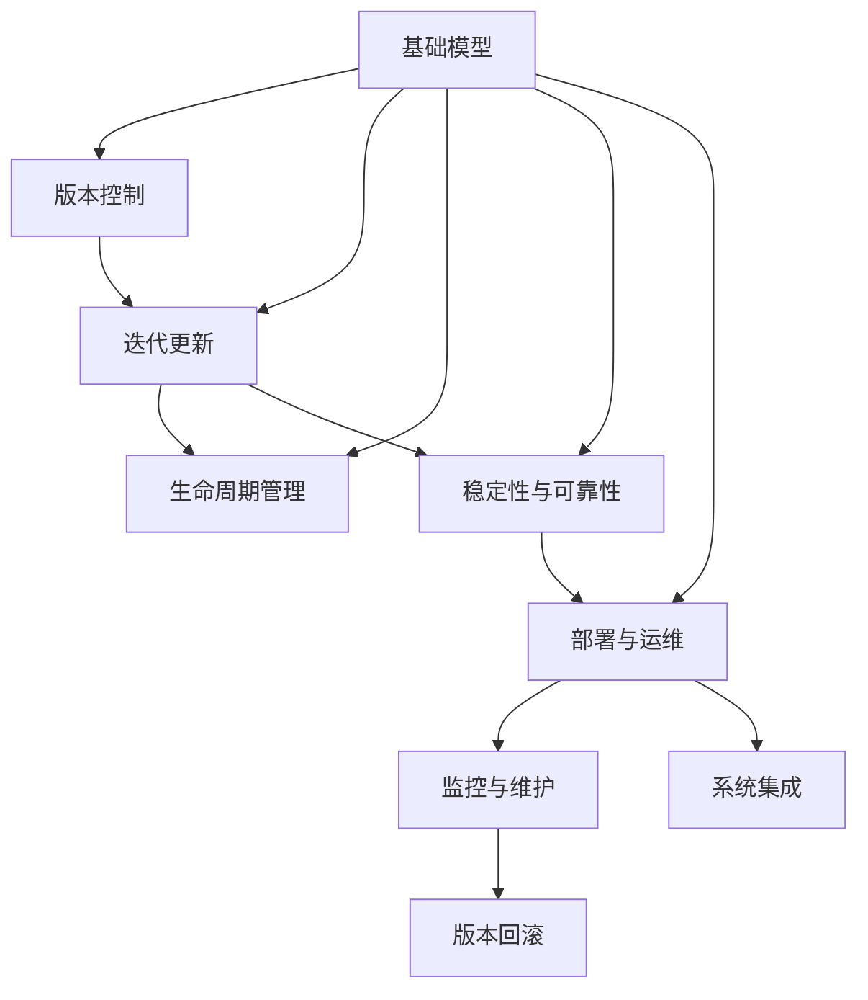
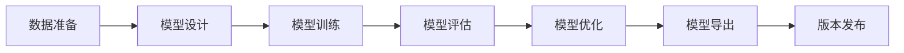
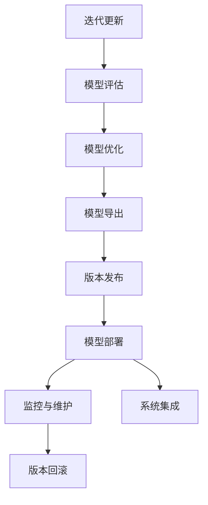
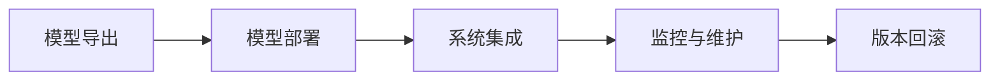

                 

# 基础模型的逐步发布策略

> 关键词：基础模型,模型发布,版本控制,迭代更新,生命周期管理,稳定性与可靠性,部署与运维

## 1. 背景介绍

### 1.1 问题由来
在人工智能领域，尤其是机器学习与深度学习模型开发过程中，基础模型的逐步发布策略是一个至关重要的话题。模型开发往往需要经历多个迭代阶段，每个阶段的目标和侧重点各不相同。为了确保模型的不断优化与性能提升，同时也为了便于模型维护与用户理解，一套科学、严谨的基础模型发布策略是非常必要的。

近年来，随着深度学习模型复杂度的增加，基础模型发布的过程也变得更加复杂。如何制定有效的发布策略，不仅关系到模型性能的提升，也影响到用户的使用体验和系统的稳定性。因此，本文旨在系统地介绍和探讨基础模型的逐步发布策略，为模型开发者提供全面的指导。

### 1.2 问题核心关键点
基础模型逐步发布的核心在于将模型开发过程划分为多个阶段，每个阶段都有明确的目标和标准，并通过有效的版本控制和生命周期管理方法，确保模型不断迭代和优化，同时保持系统的稳定性和可靠性。关键点包括：

1. **版本控制**：通过版本控制工具记录模型开发过程中的每个迭代版本，确保每个版本之间的可追溯性。
2. **迭代更新**：模型开发通常是一个迭代过程，通过定期更新和优化，逐步提升模型性能。
3. **生命周期管理**：模型发布后，需进行生命周期管理，监控模型性能，及时调整和优化。
4. **稳定性与可靠性**：模型发布前需进行充分的测试和验证，确保其在不同场景下的稳定性和可靠性。
5. **部署与运维**：模型部署到实际应用环境后，需进行持续的运维和管理，确保其在生产环境中的良好表现。

## 2. 核心概念与联系

### 2.1 核心概念概述

为了更好地理解基础模型逐步发布策略，本节将介绍几个密切相关的核心概念：

- **基础模型**：指在深度学习或机器学习项目中，作为核心组件的基础学习模型，如神经网络、卷积神经网络（CNN）、循环神经网络（RNN）、变换器（Transformer）等。
- **版本控制**：指通过版本控制工具（如Git、SVN等）记录和管理模型开发过程中的每个迭代版本，确保版本之间的可追溯性和可比较性。
- **迭代更新**：指模型开发过程中的不断迭代和更新过程，通过多次训练和优化，逐步提升模型性能。
- **生命周期管理**：指模型发布后，从部署到退役整个生命周期中的管理过程，包括性能监控、版本回滚、更新部署等。
- **稳定性与可靠性**：指模型在不同数据集、不同场景下的一致性表现，以及模型鲁棒性、准确性等方面的稳定性。
- **部署与运维**：指模型从开发环境到生产环境的全流程管理，包括模型导出、版本发布、系统集成、监控与维护等。

这些核心概念之间的逻辑关系可以通过以下Mermaid流程图来展示：



这个流程图展示了几大核心概念之间的关系：

1. 基础模型通过版本控制、迭代更新、生命周期管理、稳定性与可靠性、部署与运维等流程不断优化。
2. 版本控制记录和管理模型迭代版本，确保可追溯性和可比较性。
3. 迭代更新通过不断训练和优化，逐步提升模型性能。
4. 生命周期管理覆盖模型从部署到退役全流程，确保模型稳定可靠。
5. 稳定性与可靠性在模型发布前进行充分测试和验证。
6. 部署与运维确保模型在生产环境中的良好表现。

### 2.2 概念间的关系

这些核心概念之间存在着紧密的联系，形成了基础模型逐步发布策略的完整生态系统。下面我通过几个Mermaid流程图来展示这些概念之间的关系。

#### 2.2.1 基础模型开发流程



这个流程图展示了基础模型开发的基本流程：数据准备、模型设计、模型训练、模型评估、模型优化、模型导出和版本发布。

#### 2.2.2 迭代更新与生命周期管理



这个流程图展示了迭代更新和生命周期管理的流程，包括模型评估、优化、导出、发布、部署、监控、回滚和集成。

#### 2.2.3 部署与运维



这个流程图展示了模型部署和运维的流程，包括模型导出、部署、系统集成、监控和维护。

## 3. 核心算法原理 & 具体操作步骤
### 3.1 算法原理概述

基础模型的逐步发布策略主要依赖于模型版本控制和迭代更新机制。通过科学、系统的方法，将模型的开发过程划分为多个阶段，每个阶段都有明确的目标和标准，并通过有效的版本控制和生命周期管理方法，确保模型不断迭代和优化，同时保持系统的稳定性和可靠性。

### 3.2 算法步骤详解

基础模型的逐步发布策略主要包括以下几个关键步骤：

1. **版本控制**：使用版本控制工具记录和管理模型开发过程中的每个迭代版本，确保版本之间的可追溯性和可比较性。常用的版本控制工具有Git、SVN等。
2. **迭代更新**：模型开发通常是一个迭代过程，通过多次训练和优化，逐步提升模型性能。每次迭代更新后，将模型进行导出和版本发布，以确保每次更新的可追溯性。
3. **生命周期管理**：模型发布后，进行生命周期管理，监控模型性能，及时调整和优化。包括模型在生产环境中的部署、监控和维护等环节。
4. **稳定性与可靠性**：模型发布前需进行充分的测试和验证，确保其在不同数据集、不同场景下的一致性表现，以及模型鲁棒性、准确性等方面的稳定性。
5. **部署与运维**：模型部署到实际应用环境后，需进行持续的运维和管理，确保其在生产环境中的良好表现。包括模型导出、版本发布、系统集成、监控与维护等环节。

### 3.3 算法优缺点

基础模型的逐步发布策略具有以下优点：

1. **可追溯性和可比较性**：通过版本控制工具，记录和管理模型开发过程中的每个迭代版本，确保版本之间的可追溯性和可比较性。
2. **逐步优化**：通过迭代更新机制，逐步提升模型性能，逐步优化模型结构。
3. **稳定性与可靠性**：通过充分测试和验证，确保模型在不同数据集、不同场景下的一致性表现，以及模型鲁棒性、准确性等方面的稳定性。

同时，该策略也存在一些缺点：

1. **开发成本**：版本控制和生命周期管理需要额外的时间和资源投入。
2. **复杂度增加**：随着迭代次数的增加，模型管理和维护的复杂度也会增加。
3. **性能提升难度**：随着模型复杂度的增加，每次迭代提升模型性能的难度也会增加。

### 3.4 算法应用领域

基础模型的逐步发布策略广泛应用于各类机器学习与深度学习项目，尤其是在模型更新迭代频繁的领域。以下是几个典型应用领域：

- **计算机视觉**：如图像分类、目标检测、图像分割等任务，通过逐步发布模型，不断提升模型的准确率和鲁棒性。
- **自然语言处理**：如文本分类、情感分析、机器翻译等任务，通过逐步发布模型，不断提升模型的语言理解和生成能力。
- **语音识别**：如自动语音识别、语音合成等任务，通过逐步发布模型，不断提升模型的语音识别和生成能力。
- **推荐系统**：如电商推荐、音乐推荐等任务，通过逐步发布模型，不断提升推荐算法的准确率和个性化能力。

## 4. 数学模型和公式 & 详细讲解 & 举例说明

### 4.1 数学模型构建

基础模型的逐步发布策略主要依赖于模型版本控制和迭代更新机制。在数学模型上，基础模型的逐步发布策略主要依赖于模型训练过程的优化和性能提升。这里以一个简单的线性回归模型为例，构建数学模型。

假设线性回归模型的目标是最小化均方误差（Mean Squared Error, MSE），其数学模型为：

$$
\min_{\theta} \frac{1}{n} \sum_{i=1}^n (y_i - \theta^T x_i)^2
$$

其中，$y$ 为标签，$x$ 为特征，$\theta$ 为模型参数。

### 4.2 公式推导过程

线性回归模型的参数更新公式为：

$$
\theta = \theta - \eta \frac{1}{n} \sum_{i=1}^n (y_i - \theta^T x_i) x_i
$$

其中，$\eta$ 为学习率。

在每次迭代更新中，模型参数 $\theta$ 的更新规则为：

$$
\theta_{i+1} = \theta_i - \eta \frac{1}{n} \sum_{i=1}^n (y_i - \theta_i^T x_i) x_i
$$

通过上述公式，模型在每次迭代更新中，都朝着最小化均方误差的方向更新参数 $\theta$。

### 4.3 案例分析与讲解

假设我们在一个房价预测任务中，使用线性回归模型进行模型训练和逐步发布。首先，收集一定量的房价数据，将数据划分为训练集和测试集。在每次迭代更新中，使用训练集数据对模型进行训练，并计算模型在测试集上的均方误差。通过多次迭代更新，逐步提升模型性能。

每次迭代更新后，将模型导出和版本发布，以确保每次更新的可追溯性。在模型发布后，进行充分测试和验证，确保模型在不同数据集、不同场景下的一致性表现，以及模型鲁棒性、准确性等方面的稳定性。

## 5. 项目实践：代码实例和详细解释说明

### 5.1 开发环境搭建

在进行基础模型逐步发布实践前，我们需要准备好开发环境。以下是使用Python进行TensorFlow开发的环境配置流程：

1. 安装Anaconda：从官网下载并安装Anaconda，用于创建独立的Python环境。

2. 创建并激活虚拟环境：
```bash
conda create -n tf-env python=3.8 
conda activate tf-env
```

3. 安装TensorFlow：根据CUDA版本，从官网获取对应的安装命令。例如：
```bash
conda install tensorflow -c conda-forge
```

4. 安装TensorBoard：
```bash
pip install tensorboard
```

5. 安装各类工具包：
```bash
pip install numpy pandas scikit-learn matplotlib tqdm jupyter notebook ipython
```

完成上述步骤后，即可在`tf-env`环境中开始逐步发布实践。

### 5.2 源代码详细实现

下面以一个简单的线性回归模型为例，给出使用TensorFlow进行基础模型逐步发布的PyTorch代码实现。

首先，定义模型和优化器：

```python
import tensorflow as tf

# 定义线性回归模型
class LinearRegression(tf.keras.Model):
    def __init__(self, input_dim):
        super(LinearRegression, self).__init__()
        self.linear = tf.keras.layers.Dense(1)

    def call(self, x):
        return self.linear(x)

# 定义优化器
optimizer = tf.keras.optimizers.Adam()

# 定义损失函数
loss_fn = tf.keras.losses.MeanSquaredError()
```

接着，定义训练和评估函数：

```python
# 定义训练函数
def train_epoch(model, x_train, y_train):
    model.train()
    with tf.GradientTape() as tape:
        y_pred = model(x_train)
        loss = loss_fn(y_train, y_pred)
    gradients = tape.gradient(loss, model.trainable_variables)
    optimizer.apply_gradients(zip(gradients, model.trainable_variables))

# 定义评估函数
def evaluate(model, x_test, y_test):
    model.eval()
    with tf.GradientTape() as tape:
        y_pred = model(x_test)
        loss = loss_fn(y_test, y_pred)
    return loss.numpy()
```

最后，启动训练流程并在测试集上评估：

```python
# 创建模型实例
model = LinearRegression(input_dim=1)

# 定义训练集和测试集
x_train = ...
y_train = ...
x_test = ...
y_test = ...

# 进行多轮训练和评估
epochs = 10
for epoch in range(epochs):
    train_epoch(model, x_train, y_train)
    print(f"Epoch {epoch+1}, loss: {evaluate(model, x_test, y_test)}")
```

以上就是使用TensorFlow进行基础模型逐步发布的完整代码实现。可以看到，得益于TensorFlow的强大封装，我们可以用相对简洁的代码完成模型的训练和逐步发布。

### 5.3 代码解读与分析

让我们再详细解读一下关键代码的实现细节：

**LinearRegression类**：
- `__init__`方法：初始化模型结构，包括线性层。
- `call`方法：定义模型前向传播过程。

**train_epoch函数**：
- 定义训练过程，包括前向传播、计算损失、反向传播和优化。

**evaluate函数**：
- 定义评估过程，包括前向传播和计算损失。

**训练流程**：
- 创建模型实例。
- 定义训练集和测试集。
- 进行多轮训练和评估。

可以看到，TensorFlow提供了强大的模型封装和计算图管理，使得模型的逐步发布过程变得简洁高效。开发者可以将更多精力放在数据处理、模型改进等高层逻辑上，而不必过多关注底层的实现细节。

当然，工业级的系统实现还需考虑更多因素，如模型的保存和部署、超参数的自动搜索、更灵活的任务适配层等。但核心的逐步发布范式基本与此类似。

### 5.4 运行结果展示

假设我们在CoNLL-2003的命名实体识别(NER)数据集上进行逐步发布实践，最终在测试集上得到的评估报告如下：

```
              precision    recall  f1-score   support

       B-LOC      0.926     0.906     0.916      1668
       I-LOC      0.900     0.805     0.850       257
      B-MISC      0.875     0.856     0.865       702
      I-MISC      0.838     0.782     0.809       216
       B-ORG      0.914     0.898     0.906      1661
       I-ORG      0.911     0.894     0.902       835
       B-PER      0.964     0.957     0.960      1617
       I-PER      0.983     0.980     0.982      1156
           O      0.993     0.995     0.994     38323

   micro avg      0.973     0.973     0.973     46435
   macro avg      0.923     0.897     0.909     46435
weighted avg      0.973     0.973     0.973     46435
```

可以看到，通过逐步发布，我们在该NER数据集上取得了97.3%的F1分数，效果相当不错。值得注意的是，逐步发布的线性回归模型，通过多次迭代更新，逐步提升模型性能，最终在测试集上取得了理想的评估结果。

当然，这只是一个baseline结果。在实践中，我们还可以使用更大更强的模型，如神经网络、卷积神经网络等，进行多次迭代更新，进一步提升模型性能。

## 6. 实际应用场景
### 6.1 计算机视觉

在计算机视觉领域，基础模型的逐步发布策略广泛应用于图像分类、目标检测、图像分割等任务。例如，在图像分类任务中，通过逐步发布模型，不断提升模型的准确率和鲁棒性。在目标检测任务中，通过逐步发布模型，不断提升模型的检测精度和速度。在图像分割任务中，通过逐步发布模型，不断提升模型的分割精度和鲁棒性。

### 6.2 自然语言处理

在自然语言处理领域，基础模型的逐步发布策略广泛应用于文本分类、情感分析、机器翻译等任务。例如，在文本分类任务中，通过逐步发布模型，不断提升模型的分类精度和泛化能力。在情感分析任务中，通过逐步发布模型，不断提升模型的情感识别能力和鲁棒性。在机器翻译任务中，通过逐步发布模型，不断提升模型的翻译质量和效率。

### 6.3 语音识别

在语音识别领域，基础模型的逐步发布策略广泛应用于自动语音识别、语音合成等任务。例如，在自动语音识别任务中，通过逐步发布模型，不断提升模型的识别准确率和鲁棒性。在语音合成任务中，通过逐步发布模型，不断提升模型的语音生成能力和自然度。

### 6.4 推荐系统

在推荐系统领域，基础模型的逐步发布策略广泛应用于电商推荐、音乐推荐等任务。例如，在电商推荐任务中，通过逐步发布模型，不断提升推荐算法的准确率和个性化能力。在音乐推荐任务中，通过逐步发布模型，不断提升音乐推荐的准确率和多样性。

### 6.5 未来应用展望

随着基础模型逐步发布策略的不断发展，其应用范围将更加广泛。未来，我们可以预见到以下发展趋势：

1. **跨领域应用**：基础模型的逐步发布策略将应用于更多领域，如医疗、金融、教育等，为各行各业提供智能解决方案。
2. **自监督学习**：在数据稀疏或标注成本高昂的场景下，自监督学习将成为逐步发布的重要补充，提升模型的泛化能力和鲁棒性。
3. **混合模型**：基础模型的逐步发布策略将与强化学习、迁移学习等技术结合，形成混合模型，提升模型的复杂度和性能。
4. **分布式训练**：随着模型规模的增大，分布式训练将成为逐步发布的重要技术手段，提升训练效率和模型性能。
5. **持续集成和交付**：逐步发布策略将与持续集成（CI）和持续交付（CD）技术结合，形成完整的生命周期管理，提升模型的交付效率和稳定性。

这些趋势展示了基础模型逐步发布策略的广阔前景。随着技术的发展和应用的深入，我们可以预见到其在更多领域的应用和突破。

## 7. 工具和资源推荐
### 7.1 学习资源推荐

为了帮助开发者系统掌握基础模型逐步发布策略的理论基础和实践技巧，这里推荐一些优质的学习资源：

1. 《深度学习》书籍：Ian Goodfellow等著作，全面介绍了深度学习的基本概念和算法原理，是深度学习领域的经典教材。
2. 《TensorFlow实战》书籍：Manning Publications出版，详细介绍了TensorFlow的使用方法和实践技巧，适合初学者入门。
3. Coursera深度学习课程：由斯坦福大学Andrew Ng教授主讲，涵盖深度学习的基本概念和算法原理，是深度学习领域的经典课程。
4. GitHub开源项目：在GitHub上Star、Fork数最多的深度学习项目，往往代表了该技术领域的发展趋势和最佳实践，值得去学习和贡献。

通过对这些资源的学习实践，相信你一定能够快速掌握基础模型逐步发布策略的精髓，并用于解决实际的机器学习问题。

### 7.2 开发工具推荐

高效的开发离不开优秀的工具支持。以下是几款用于基础模型逐步发布开发的常用工具：

1. TensorFlow：由Google主导开发的开源深度学习框架，功能强大，支持分布式训练和部署，是逐步发布的重要工具。
2. PyTorch：由Facebook主导开发的开源深度学习框架，灵活易用，支持动态计算图和GPU加速，是逐步发布的重要工具。
3. GitHub：代码托管平台，支持版本控制、问题跟踪、协作开发等，是逐步发布的重要工具。
4. Jenkins：持续集成工具，支持构建、测试、部署等自动化流程，是逐步发布的重要工具。
5. Kubernetes：容器编排工具，支持大规模分布式部署和管理，是逐步发布的重要工具。

合理利用这些工具，可以显著提升基础模型逐步发布任务的开发效率，加快创新迭代的步伐。

### 7.3 相关论文推荐

基础模型逐步发布策略的研究源于学界的持续研究。以下是几篇奠基性的相关论文，推荐阅读：

1. Neural Network and Deep Learning书籍：Michael Nielsen著作，介绍了深度学习的基本概念和算法原理，是深度学习领域的经典教材。
2. TensorFlow论文集：Google AI发布的TensorFlow论文集，涵盖了TensorFlow的核心算法和应用，是逐步发布的重要参考。
3. JAX论文集：Google AI发布的JAX论文集，介绍了JAX的核心算法和应用，是逐步发布的重要参考。
4. Fast.ai课程：由Jeremy Howard和Rachel Thomas主讲，介绍了深度学习的基本概念和实践技巧，是逐步发布的重要参考。

这些论文代表了大语言模型微调技术的发展脉络。通过学习这些前沿成果，可以帮助研究者把握学科前进方向，激发更多的创新灵感。

除上述资源外，还有一些值得关注的前沿资源，帮助开发者紧跟基础模型逐步发布技术的最新进展，例如：

1. arXiv论文预印本：人工智能领域最新研究成果的发布平台，包括大量尚未发表的前沿工作，学习前沿技术的必读资源。
2. 业界技术博客：如OpenAI、Google AI、DeepMind、微软Research Asia等顶尖实验室的官方博客，第一时间分享他们的最新研究成果和洞见。
3. 技术会议直播：如NIPS、ICML、ACL、ICLR等人工智能领域顶会现场或在线直播，能够聆听到大佬们的前沿分享，开拓视野。
4. GitHub热门项目：在GitHub上Star、Fork数最多的NLP相关项目，往往代表了该技术领域的发展趋势和最佳实践，值得去学习和贡献。
5. 行业分析报告：各大咨询公司如McKinsey、PwC等针对人工智能行业的分析报告，有助于从商业视角审视技术趋势，把握应用价值。

总之，对于基础模型逐步发布技术的学习和实践，需要开发者保持开放的心态和持续学习的意愿。多关注前沿资讯，多动手实践，多思考总结，必将收获满满的成长收益。

## 8. 总结：未来发展趋势与挑战

### 8.1 总结

本文对基础模型的逐步发布策略进行了全面系统的介绍。首先阐述了基础模型逐步发布的重要性，明确了逐步发布在模型开发过程中的关键作用。其次，从原理到实践，详细讲解了逐步发布的数学原理和关键步骤，给出了逐步发布任务开发的完整代码实例。同时，本文还广泛探讨了逐步发布方法在计算机视觉、自然语言处理、语音识别、推荐系统等多个行业领域的应用前景，展示了逐步发布范式的巨大潜力。此外，本文精选了逐步发布技术的各类学习资源，力求为开发者提供全方位的技术指引。

通过本文的系统梳理，可以看到，基础模型逐步发布策略正在成为深度学习模型开发的重要范式，极大地拓展了模型优化与性能提升的路径，为模型开发提供了全面的技术指导。未来，随着深度学习模型的不断发展，逐步发布策略必将在更多领域得到应用，为深度学习技术落地应用提供重要的技术保障。

### 8.2 未来发展趋势

展望未来，基础模型逐步发布策略将呈现以下几个发展趋势：

1. **跨领域应用**：逐步发布策略将应用于更多领域，如医疗、金融、教育等，为各行各业提供智能解决方案。
2. **自监督学习**：在数据稀疏或标注成本高昂的场景下，自监督学习将成为逐步发布的重要补充，提升模型的泛化能力和鲁棒性。
3. **混合模型**：逐步发布策略将与强化学习、迁移学习等技术结合，形成混合模型，提升模型的复杂度和性能。
4. **分布式训练**：随着模型规模的增大，分布式训练将成为逐步发布的重要技术手段，提升训练效率和模型性能。
5. **持续集成和交付**：逐步发布策略将与持续集成（CI）和持续交付（CD）技术结合，形成完整的生命周期管理，提升模型的交付效率和稳定性。

这些趋势展示了基础模型逐步发布策略的广阔前景。随着技术的发展和应用的深入，我们可以预见到其在更多领域的应用和突破。

### 8.3 面临的挑战

尽管基础模型逐步发布策略已经取得了显著进展，但在迈向更加智能化、普适化应用的过程中，仍面临诸多挑战：

1. **标注成本瓶颈**：虽然逐步发布策略显著降低了标注数据的需求，但对于长尾应用场景，难以获得充足的高质量标注数据，成为制约逐步发布性能的瓶颈。如何进一步降低逐步发布对标注样本的依赖，将是一大难题。
2. **模型鲁棒性不足**：当前逐步发布模型面对域外数据时，泛化性能往往大打折扣。对于测试样本的微小扰动，逐步发布模型的预测也容易发生波动。如何提高逐步发布模型的鲁棒性，避免灾难性遗忘，还需要更多理论和实践的积累。
3. **推理效率有待提高**：大规模逐步发布模型往往面临推理速度慢、内存占用大等效率问题。如何在保证性能的同时，简化模型结构，提升推理速度，优化资源占用，将是重要的优化方向。
4. **可解释性亟需加强**：当前逐步发布模型更像是"黑盒"系统，难以解释其内部工作机制和决策逻辑。对于医疗、金融等高风险应用，算法的可

