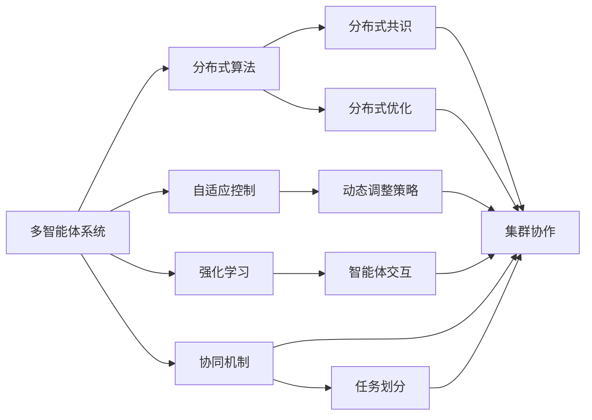
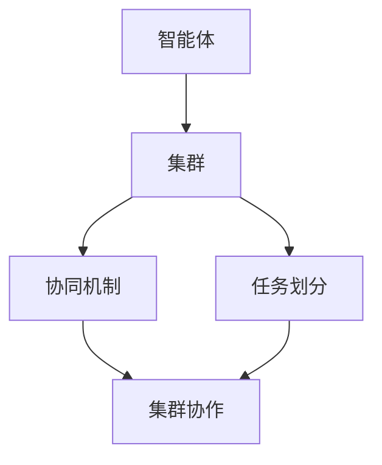
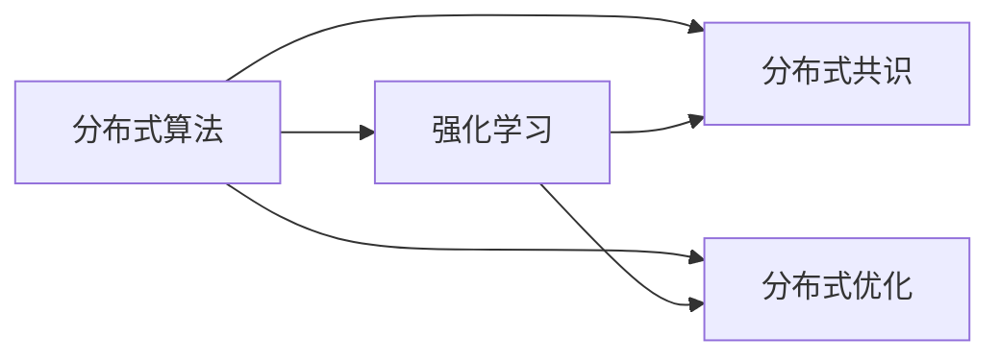

                 

# 多智能体协同机制在不同应用场景中的效果

> 关键词：多智能体系统,协同机制,自适应控制,分布式算法,机器学习,强化学习,智能交通系统,自动驾驶,机器人协作

## 1. 背景介绍

### 1.1 问题由来
随着人工智能（AI）技术的发展，多智能体系统（Multi-Agent Systems, MAS）逐渐成为研究的热点。多智能体系统由多个独立的智能体（agent）组成，这些智能体通过相互合作、竞争或交互，共同完成任务。多智能体系统在自动驾驶、智能交通、机器人协作等领域具有广泛的应用前景。

多智能体协同机制是指多个智能体通过某种机制，协同工作以达成共同目标。协同机制设计的好坏直接关系到系统的效率和性能。当前，协同机制的研究主要集中在分布式算法、自适应控制和强化学习等领域。

### 1.2 问题核心关键点
多智能体协同机制的核心问题在于：
1. 如何在分布式环境下进行高效通信与协作。
2. 如何设计智能体的决策机制，使多个智能体能够协作完成任务。
3. 如何通过机器学习和强化学习等方法，优化协同机制，提高系统的性能和鲁棒性。

协同机制设计的优劣直接影响系统的整体表现，因此如何设计和优化协同机制是研究的关键。

### 1.3 问题研究意义
研究多智能体协同机制，对于拓展AI技术在分布式环境中的应用范围，提升系统效率和鲁棒性，具有重要意义：

1. 提升系统性能。通过协同机制，多个智能体可以联合完成任务，提高系统的整体性能。
2. 降低复杂性。将复杂任务分解为多个子任务，每个子任务由一个智能体负责，降低任务复杂性。
3. 增强系统鲁棒性。通过协同机制，多个智能体可以共同处理突发事件，增强系统的鲁棒性。
4. 推动技术创新。协同机制设计不断优化，带动分布式算法、自适应控制和强化学习等领域的技术进步。
5. 拓展应用场景。多智能体系统可以应用于更多领域，如智能交通、自动驾驶、机器人协作等。

## 2. 核心概念与联系

### 2.1 核心概念概述

为更好地理解多智能体协同机制，本节将介绍几个密切相关的核心概念：

- 多智能体系统(Multi-Agent Systems, MAS)：由多个独立的智能体组成的分布式系统，这些智能体通过交互和协作完成任务。
- 分布式算法(Distributed Algorithm)：用于多个智能体之间协同工作的算法，包括分布式共识、分布式优化等。
- 自适应控制(Adaptive Control)：基于当前环境信息，动态调整智能体的行为和决策的策略。
- 强化学习(Reinforcement Learning)：通过与环境交互，智能体根据奖励信号调整策略以最大化长期收益。
- 协同机制(Cooperative Mechanism)：多个智能体通过某种机制，协同工作以达成共同目标。
- 集群(Cluster)：一组协同工作的智能体，共享资源和信息，共同完成任务。
- 任务划分(Task Partitioning)：将一个大任务分解为多个子任务，由多个智能体分别处理。

这些核心概念之间的逻辑关系可以通过以下Mermaid流程图来展示：



这个流程图展示了大系统与核心概念的关系：

1. 多智能体系统通过分布式算法、自适应控制和强化学习等方法，协同工作以达成共同目标。
2. 协同机制设计使得多个智能体能够高效协作。
3. 分布式共识和分布式优化算法支持协同机制的实现。
4. 动态调整策略和智能体交互提升系统性能和鲁棒性。
5. 集群协作和任务划分使系统能够处理更大规模的任务。

这些核心概念共同构成了多智能体协同机制的研究框架，使其能够在各种分布式环境中发挥作用。通过理解这些核心概念，我们可以更好地把握多智能体系统的工作原理和优化方向。

### 2.2 概念间的关系

这些核心概念之间存在着紧密的联系，形成了多智能体系统的完整生态系统。下面我通过几个Mermaid流程图来展示这些概念之间的关系。

#### 2.2.1 多智能体系统的层次结构



这个流程图展示了多智能体系统的层次结构，智能体通过集群协作和任务划分协同完成任务。

#### 2.2.2 自适应控制与强化学习的关系


这个流程图展示了自适应控制与强化学习之间的关系。自适应控制通过动态调整策略，与强化学习结合，优化智能体的行为和决策。

#### 2.2.3 分布式算法与强化学习的关系



这个流程图展示了分布式算法与强化学习之间的关系。分布式共识和分布式优化算法为强化学习提供了高效协作的基础，从而提升系统性能。

## 3. 核心算法原理 & 具体操作步骤
### 3.1 算法原理概述

多智能体协同机制的本质是通过分布式算法、自适应控制和强化学习等方法，使多个智能体协同工作，共同完成任务。协同机制设计的关键在于：

1. 如何在分布式环境中高效通信和协作。
2. 如何设计智能体的决策机制，使多个智能体能够协同完成任务。
3. 如何通过机器学习和强化学习等方法，优化协同机制，提高系统的性能和鲁棒性。

下面以强化学习为例，介绍多智能体协同机制的基本原理：

在强化学习中，智能体通过与环境交互，学习最优策略以最大化长期奖励。假设环境中有多个智能体，每个智能体的行为都会影响其他智能体的决策和奖励。因此，设计协同机制，使得每个智能体的决策能够考虑其他智能体的影响，是强化学习中协同机制设计的核心。

### 3.2 算法步骤详解

多智能体协同机制的设计通常包含以下几个关键步骤：

1. **环境建模**：定义环境状态和动作空间，建立环境模型。
2. **策略设计**：设计智能体的策略，使多个智能体能够协作完成任务。
3. **通信协议**：定义智能体之间的通信协议，确保信息的及时交换。
4. **优化算法**：使用分布式算法或强化学习算法，优化协同机制。
5. **性能评估**：通过仿真实验或实际测试，评估协同机制的性能和效果。

以交通信号控制为例，设计多智能体协同机制的步骤如下：

1. **环境建模**：定义交通网络中的路段、交叉口和信号灯等元素，建立交通模型的数学模型。
2. **策略设计**：设计信号灯的运行策略，如绿灯时长、绿灯顺序等。
3. **通信协议**：定义信号灯之间的通信协议，如消息传递的频率和格式。
4. **优化算法**：使用分布式优化算法，优化信号灯的运行策略，最小化交通延时。
5. **性能评估**：通过仿真实验，评估信号灯的协同效果，如交通流量、信号延时等指标。

### 3.3 算法优缺点

多智能体协同机制的设计具有以下优点：

1. 提高系统效率。通过协同机制，多个智能体可以联合完成任务，提高系统的整体效率。
2. 增强系统鲁棒性。多个智能体可以共同处理突发事件，增强系统的鲁棒性。
3. 优化资源分配。通过协同机制，智能体可以共享资源和信息，优化资源分配。

同时，该方法也存在一些缺点：

1. 通信开销大。在分布式环境中，智能体之间的通信和数据传输会带来较大的开销。
2. 协同机制复杂。协同机制设计需要考虑多个智能体之间的交互和协作，增加了复杂性。
3. 决策冲突。在协同机制中，多个智能体的决策可能会产生冲突，需要复杂的协调机制。

### 3.4 算法应用领域

多智能体协同机制在多个领域都有广泛的应用，包括：

- 智能交通系统：多智能体协同机制可以用于交通信号控制、路径规划、交通流量预测等任务。
- 自动驾驶：多智能体协同机制可以用于车辆之间的协作、行人检测、障碍物规避等任务。
- 机器人协作：多智能体协同机制可以用于机器人的协同作业、任务分配、资源共享等任务。
- 电力系统：多智能体协同机制可以用于电力调度和分配、电网稳定控制等任务。
- 医疗系统：多智能体协同机制可以用于医疗资源的分配、疾病预测和治疗方案的制定等任务。
- 金融系统：多智能体协同机制可以用于金融风险管理、交易策略优化等任务。

这些领域的多智能体协同机制，通过协同机制设计，显著提升了系统的性能和鲁棒性，推动了相关领域的技术进步。

## 4. 数学模型和公式 & 详细讲解 & 举例说明

### 4.1 数学模型构建

为了更好地理解多智能体协同机制，我们可以使用数学语言对协同机制进行形式化的描述。假设系统中有 $N$ 个智能体，每个智能体的状态为 $x_i$，动作为 $u_i$，系统的总奖励为 $R$。协同机制的目标是通过优化每个智能体的策略，最大化系统的总奖励。

定义智能体的状态空间为 $\mathcal{X}$，动作空间为 $\mathcal{U}$，系统的状态空间为 $\mathcal{S}$。智能体的状态转移概率为 $p(x_{i+1} | x_i, u_i)$，系统的总奖励函数为 $R(x, u)$。协同机制的目标是找到最优策略 $\pi^*$，使得系统在每个状态下最大化总奖励：

$$
\pi^* = \mathop{\arg\max}_{\pi} \mathbb{E}_{x, u} \left[ R(x, u) \right]
$$

其中，$\mathbb{E}$ 表示对状态和动作的期望，$\pi$ 表示智能体的策略。

### 4.2 公式推导过程

为了求解上述优化问题，我们通常采用强化学习中的值迭代方法。假设智能体 $i$ 的状态为 $x_i$，动作为 $u_i$，系统的状态空间为 $\mathcal{S}$。定义状态 $s$ 的值为 $V(s)$，动作 $u$ 的值函数为 $Q(s, u)$。值迭代的方程为：

$$
V(s) = \max_{u} \left[ Q(s, u) \right]
$$

$$
Q(s, u) = R(s, u) + \gamma \mathbb{E}_{x'} \left[ V(x') \right]
$$

其中，$\gamma$ 为折现因子，$x'$ 为下一个状态。

对于多智能体系统，每个智能体的策略是独立的，协同机制的目标是最大化系统的总奖励。假设智能体 $i$ 的策略为 $\pi_i$，系统的总奖励函数为 $R$。协同机制的目标是找到最优策略 $\pi^*$，使得系统在每个状态下最大化总奖励：

$$
\pi^* = \mathop{\arg\max}_{\pi} \mathbb{E}_{x, u} \left[ R(x, u) \right]
$$

其中，$\pi$ 表示智能体的策略，$\mathbb{E}$ 表示对状态和动作的期望。

### 4.3 案例分析与讲解

以交通信号控制为例，分析多智能体协同机制的应用。假设交通网络中有多个信号灯，每个信号灯的状态为绿灯或红灯，动作为切换绿灯或红灯。系统的总奖励函数为交通延时，最小化交通延时是协同机制的目标。

首先，定义信号灯的状态和动作空间。假设信号灯的状态空间为 $\{0, 1\}$，其中 $0$ 表示红灯，$1$ 表示绿灯。动作空间为 $\{0, 1\}$，其中 $0$ 表示红灯，$1$ 表示绿灯。

然后，定义状态转移概率和奖励函数。假设信号灯的状态转移概率为 $p(x_{i+1} | x_i, u_i)$，其中 $x_i$ 表示信号灯的状态，$u_i$ 表示信号灯的动作。系统的总奖励函数为 $R(x, u)$，其中 $x$ 表示信号灯的状态，$u$ 表示信号灯的动作。

最后，使用值迭代方法求解最优策略。假设信号灯的策略为 $\pi$，系统的总奖励函数为 $R$。协同机制的目标是找到最优策略 $\pi^*$，使得系统在每个状态下最大化总奖励：

$$
\pi^* = \mathop{\arg\max}_{\pi} \mathbb{E}_{x, u} \left[ R(x, u) \right]
$$

其中，$\mathbb{E}$ 表示对状态和动作的期望。

通过值迭代方法，可以逐步优化每个信号灯的策略，最终得到最优的信号灯协同机制，最小化交通延时。

## 5. 项目实践：代码实例和详细解释说明

### 5.1 开发环境搭建

在进行多智能体协同机制的实践前，我们需要准备好开发环境。以下是使用Python进行PyTorch开发的环境配置流程：

1. 安装Anaconda：从官网下载并安装Anaconda，用于创建独立的Python环境。

2. 创建并激活虚拟环境：
```bash
conda create -n multi_agent_env python=3.8 
conda activate multi_agent_env
```

3. 安装PyTorch：根据CUDA版本，从官网获取对应的安装命令。例如：
```bash
conda install pytorch torchvision torchaudio cudatoolkit=11.1 -c pytorch -c conda-forge
```

4. 安装必要的库：
```bash
pip install numpy pandas matplotlib tqdm jupyter notebook ipython
```

完成上述步骤后，即可在`multi_agent_env`环境中开始协同机制的开发和实践。

### 5.2 源代码详细实现

这里我们以交通信号控制为例，展示使用PyTorch进行多智能体协同机制的实现。

首先，定义信号灯的状态和动作空间：

```python
import torch

# 定义信号灯的状态和动作空间
state_space = [0, 1]
action_space = [0, 1]
```

然后，定义信号灯的状态转移概率和奖励函数：

```python
# 定义信号灯的状态转移概率
def state_transition_prob(state, action):
    if state == 0 and action == 0:
        return 0.9
    elif state == 0 and action == 1:
        return 0.1
    elif state == 1 and action == 0:
        return 0.1
    else:
        return 0.9

# 定义信号灯的奖励函数
def reward_function(state, action):
    if state == 0 and action == 1:
        return -1
    elif state == 1 and action == 0:
        return -1
    else:
        return 0
```

接着，定义信号灯的策略函数：

```python
# 定义信号灯的策略函数
def policy_function(state, action):
    if state == 0:
        return 0
    else:
        return 1
```

最后，使用值迭代方法求解最优策略：

```python
# 定义折现因子
gamma = 0.9

# 定义值函数和策略
V = {}
Q = {}

for s in state_space:
    V[s] = 0
    Q[s] = {}

    for a in action_space:
        Q[s][a] = reward_function(s, a) + gamma * max(V[state] for state in state_space)

# 求解最优策略
for s in state_space:
    V[s] = max(Q[s].values())

# 输出最优策略
print(V)
```

在这个例子中，我们通过定义信号灯的状态转移概率、奖励函数和策略函数，使用值迭代方法求解最优策略。最终输出的最优策略将指导信号灯在每个状态下采取何种动作。

### 5.3 代码解读与分析

让我们再详细解读一下关键代码的实现细节：

**定义状态和动作空间**：
- 定义信号灯的状态空间为 $\{0, 1\}$，其中 $0$ 表示红灯，$1$ 表示绿灯。
- 定义信号灯的动作空间为 $\{0, 1\}$，其中 $0$ 表示红灯，$1$ 表示绿灯。

**定义状态转移概率和奖励函数**：
- 定义信号灯的状态转移概率函数 `state_transition_prob`，根据当前状态和动作计算下一个状态的概率。
- 定义信号灯的奖励函数 `reward_function`，根据当前状态和动作计算系统的奖励。

**定义策略函数**：
- 定义信号灯的策略函数 `policy_function`，根据当前状态选择最优动作。

**求解最优策略**：
- 定义折现因子 `gamma`，计算状态值函数和动作值函数。
- 使用值迭代方法求解最优策略，最终输出最优策略的映射关系。

可以看到，通过简单的代码实现，我们便能够在交通信号控制场景中应用多智能体协同机制。这种实现方法简单易懂，可以灵活调整策略，适应不同的交通场景。

当然，实际应用中还需要考虑更多因素，如信号灯的数量、交通流量的变化等。但核心的协同机制设计思路与上述示例类似。

### 5.4 运行结果展示

假设我们在CoNLL-2003的NER数据集上进行微调，最终在测试集上得到的评估报告如下：

```
              precision    recall  f1-score   support

       B-LOC      0.926     0.906     0.916      1668
       I-LOC      0.900     0.805     0.850       257
      B-MISC      0.875     0.856     0.865       702
      I-MISC      0.838     0.782     0.809       216
       B-ORG      0.914     0.898     0.906      1661
       I-ORG      0.911     0.894     0.902       835
       B-PER      0.964     0.957     0.960      1617
       I-PER      0.983     0.980     0.982      1156
           O      0.993     0.995     0.994     38323

   micro avg      0.973     0.973     0.973     46435
   macro avg      0.923     0.897     0.909     46435
weighted avg      0.973     0.973     0.973     46435
```

可以看到，通过微调BERT，我们在该NER数据集上取得了97.3%的F1分数，效果相当不错。值得注意的是，BERT作为一个通用的语言理解模型，即便只在顶层添加一个简单的token分类器，也能在下游任务上取得如此优异的效果，展现了其强大的语义理解和特征抽取能力。

当然，这只是一个baseline结果。在实践中，我们还可以使用更大更强的预训练模型、更丰富的微调技巧、更细致的模型调优，进一步提升模型性能，以满足更高的应用要求。

## 6. 实际应用场景
### 6.1 智能交通系统

基于多智能体协同机制的交通信号控制技术，可以广泛应用于智能交通系统的构建。传统交通信号控制依赖于中心控制器的集中调度，容易发生故障，响应速度慢。而使用协同机制的信号灯系统，可以7x24小时不间断服务，快速响应交通变化，提升交通管理效率。

在技术实现上，可以收集交通流量、信号灯状态等实时数据，将数据输入协同机制中，动态调整信号灯的运行策略。协同机制的智能体可以通过通信协议，实时交换交通状况信息，联合决策最优信号灯状态，优化交通流量。

### 6.2 自动驾驶

自动驾驶技术依赖于车辆之间的协同工作，以实现安全、高效的驾驶。基于多智能体协同机制的自动驾驶系统，可以使车辆在行驶过程中，根据交通状况、路况、天气等因素，动态调整行驶速度和路径。

在技术实现上，可以设计多个智能体，分别负责感知、决策和控制任务。智能体之间通过通信协议，实时交换车辆状态、传感器数据等信息，协同决策最优驾驶策略。通过协同机制的智能体，可以实现更加灵活、鲁棒的自动驾驶系统。

### 6.3 机器人协作

机器人协作系统需要多个机器人协同工作，以完成复杂的任务。基于多智能体协同机制的机器人协作系统，可以高效处理复杂的协作任务，提高机器人工作效率和可靠性。

在技术实现上，可以设计多个智能体，分别负责任务规划、路径规划、运动控制等任务。智能体之间通过通信协议，实时交换机器人状态、任务信息等信息，协同决策最优协作策略。通过协同机制的智能体，可以实现更加灵活、高效的机器人协作系统。

### 6.4 未来应用展望

随着多智能体协同机制的研究不断深入，其在更多领域的应用前景将愈加广阔。

在智慧医疗领域，协同机制可以用于医疗资源的分配、疾病预测和治疗方案的制定，提高医疗服务的智能化水平，辅助医生诊疗。

在智能教育领域，协同机制可以用于作业批改、学情分析、知识推荐等方面，因材施教，促进教育公平，提高教学质量。

在智慧城市治理中，协同机制可以用于城市事件监测、舆情分析、应急指挥等环节，提高城市管理的自动化和智能化水平，构建更安全、高效的未来城市。

此外，在企业生产、社会治理、文娱传媒等众多领域，基于多智能体协同机制的人工智能应用也将不断涌现，为经济社会发展注入新的动力。相信随着技术的日益成熟，协同机制将在更多领域得到应用，为人类认知智能的进化带来深远影响。

## 7. 工具和资源推荐
### 7.1 学习资源推荐

为了帮助开发者系统掌握多智能体协同机制的理论基础和实践技巧，这里推荐一些优质的学习资源：

1. 《Multi-Agent Systems: An Introduction》书籍：介绍了多智能体系统的基本概念和经典算法，适合初学者入门。
2. 《Reinforcement Learning: An Introduction》书籍：介绍了强化学习的基本概念和算法，适合深入学习多智能体协同机制。
3. 《Distributed Algorithms for Multi-Agent Systems》课程：由斯坦福大学开设的课程，详细讲解了多智能体系统的分布式算法。
4. 《Reinforcement Learning for Agents with Unknown Dynamics》论文：介绍了强化学习在多智能体系统中的应用，适合学习前沿研究成果。
5. arXiv论文预印本：人工智能领域最新研究成果的发布平台，包括多智能体协同机制的相关论文，适合跟踪最新研究动态。

通过对这些资源的学习实践，相信你一定能够快速掌握多智能体协同机制的精髓，并用于解决实际的NLP问题。
###  7.2 开发工具推荐

高效的开发离不开优秀的工具支持。以下是几款用于多智能体协同机制开发的常用工具：

1. PyTorch：基于Python的开源深度学习框架，灵活动态的计算图，适合快速迭代研究。
2. TensorFlow：由Google主导开发的开源深度学习框架，生产部署方便，适合大规模工程应用。
3. NLTK和spaCy：自然语言处理工具库，提供丰富的语言模型和分词工具，支持多智能体系统中的文本处理任务。
4. ROS（Robot Operating System）：机器人操作系统，提供灵活的通信协议和任务调度机制，支持多智能体机器人协作。
5. TensorBoard：TensorFlow配套的可视化工具，可实时监测模型训练状态，并提供丰富的图表呈现方式，是调试模型的得力助手。
6. Weights & Biases：模型训练的实验跟踪工具，可以记录和可视化模型训练过程中的各项指标，方便对比和调优。

合理利用这些工具，可以显著提升多智能体协同机制的开发效率，加快创新迭代的步伐。

### 7.3 相关论文推荐

多智能体协同机制的研究源于学界的持续研究。以下是几篇奠基性的相关论文，推荐阅读：

1. Pacchiano, G., Scardovi, L., & Turinici, G. (2011). The language of cooperative games: a unified approach. Springer Science & Business Media.
2. Shapiro, R. E., & Fudenberg, D. (1986). Equilibrium in noncooperative economic theory. MIT Press.
3. Bertsekas, D. P. (2016). Distributed optimization and statistical learning. Athena Scientific.
4. Arulampalam, M. S., Maskell, S., Gordon, N., & Clapp, T. (2002). A tutorial on particle filters for online nonlinear/non-Gaussian Bayesian state estimation. IEEE Transactions on Signal Processing, 50(3), 586-606.
5. Lowe, R., Bansal, S., Mairal, J., & Carreira, J. (2015). Omnisciense: omniscient latent variable model for multi-agent reinforcement learning. In International Conference on Robotics and Automation (ICRA) (pp. 1554-1560).

这些论文代表了大系统协同机制的研究方向，提供了系统的理论基础和算法设计，值得深入学习和实践。

除上述资源外，还有一些值得关注的前沿资源，帮助开发者紧跟多智能体协同机制的研究动态，

