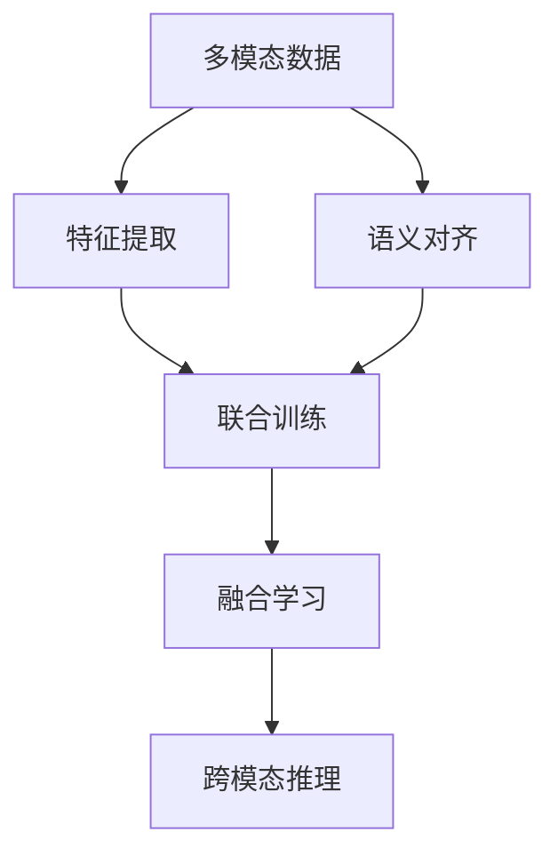
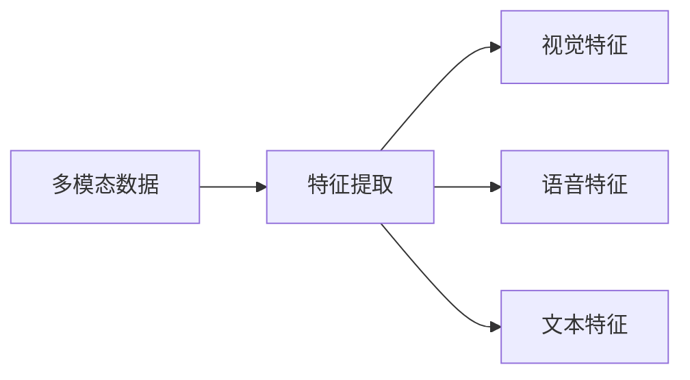
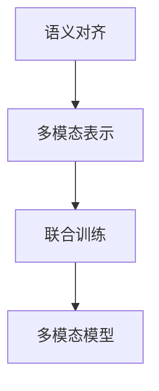
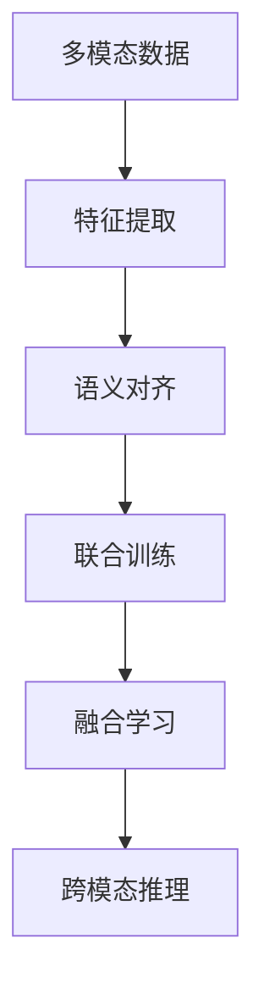

                 

## 1. 背景介绍

### 1.1 问题由来

随着人工智能技术的迅速发展，多模态AI成为了当前的热门研究领域。多模态AI融合了视觉、语音、文本等多种数据模态，能够更加全面地理解现实世界，提升智能系统的感知和推理能力。在智能安防、智能医疗、自动驾驶、人机交互等多个应用场景中，多模态AI展现了巨大的潜力。然而，由于多模态数据本身具有高度复杂性和多样性，整合不同模态数据并从中提取有用信息是一个巨大挑战。

### 1.2 问题核心关键点

多模态AI的核心在于如何高效整合视觉、语音、文本等多种数据模态，从而提升智能系统的理解和决策能力。其关键问题包括：

1. **数据融合方法**：如何从不同模态中提取出共有的语义信息。
2. **多模态表示学习**：如何将不同模态的信息映射到统一的语义空间。
3. **数据增强技术**：如何在保持数据多样性的同时，避免过拟合。
4. **跨模态对齐**：如何对齐不同模态的特征空间，实现跨模态推理。
5. **跨模态学习算法**：如何设计高效的多模态学习算法，最大化不同模态的信息利用。

### 1.3 问题研究意义

多模态AI技术的发展，对于拓展智能系统的应用边界、提升系统的感知和推理能力、增强人机交互体验具有重要意义：

1. **提升感知能力**：多模态AI能够从视觉、语音、文本等多种信息源中获取更丰富的环境信息，增强系统的感知和理解能力。
2. **增强决策能力**：融合多模态信息，提升智能系统在复杂任务中的决策能力，如医学诊断、智能驾驶、语音翻译等。
3. **优化人机交互**：多模态AI能够根据用户的行为和环境变化，动态调整系统响应，提供更加智能和人性化的交互体验。
4. **促进跨领域应用**：多模态AI能够跨越不同领域，如医疗、安防、教育、娱乐等，推动AI技术在更广阔的应用场景中落地。

## 2. 核心概念与联系

### 2.1 核心概念概述

为了更好地理解多模态AI的核心概念，本节将介绍几个关键概念：

- **多模态数据**：指包含视觉、语音、文本等不同类型数据的输入。
- **特征提取**：从多模态数据中提取具有代表性的特征向量。
- **语义对齐**：将不同模态的特征空间映射到统一的语义空间。
- **联合训练**：同时训练多个模态的模型，以最大化不同模态的信息利用。
- **融合学习**：通过不同模态的联合学习，提升整体性能。
- **跨模态推理**：使用融合后的多模态信息进行推理和决策。

这些核心概念通过以下Mermaid流程图展示它们之间的联系：



这个流程图展示了多模态AI的基本流程：从不同模态的数据中提取特征，通过语义对齐将不同模态映射到统一空间，联合训练提升信息利用，融合学习提高整体性能，最后使用融合后的信息进行跨模态推理。

### 2.2 概念间的关系

这些核心概念之间存在着紧密的联系，形成了多模态AI的完整生态系统。下面我们通过几个Mermaid流程图来展示这些概念之间的关系。

#### 2.2.1 多模态数据与特征提取



这个流程图展示了多模态数据被提取为视觉、语音、文本等不同特征的过程。

#### 2.2.2 语义对齐与联合训练



这个流程图展示了将不同模态的数据进行语义对齐后，进行联合训练的过程。

#### 2.2.3 融合学习与跨模态推理


这个流程图展示了将多模态数据融合为统一表示后，进行跨模态推理的过程。

### 2.3 核心概念的整体架构

最后，我们用一个综合的流程图来展示这些核心概念在大模型微调过程中的整体架构：



这个综合流程图展示了从多模态数据提取特征，通过语义对齐将不同模态映射到统一空间，联合训练提升信息利用，融合学习提高整体性能，最后使用融合后的信息进行跨模态推理的完整过程。

## 3. 核心算法原理 & 具体操作步骤
### 3.1 算法原理概述

多模态AI的算法原理主要基于特征提取和联合训练，通过将不同模态的数据映射到统一的语义空间，实现跨模态推理。具体步骤如下：

1. **特征提取**：使用合适的特征提取器，从不同模态的数据中提取出特征向量。
2. **语义对齐**：通过映射函数将不同模态的特征向量对齐到统一的语义空间。
3. **联合训练**：将不同模态的特征向量联合训练，学习统一的语义表示。
4. **融合学习**：使用融合算法，将不同模态的语义表示融合为统一的多模态表示。
5. **跨模态推理**：在融合后的多模态表示上进行推理和决策。

### 3.2 算法步骤详解

以下是多模态AI的核心算法步骤详解：

**Step 1: 数据预处理**

- 对不同模态的数据进行预处理，如去噪、归一化、特征提取等。
- 处理视觉数据时，可以使用卷积神经网络(CNN)提取特征。
- 处理语音数据时，可以使用循环神经网络(RNN)或长短期记忆网络(LSTM)提取特征。
- 处理文本数据时，可以使用Transformer模型或词嵌入模型提取特征。

**Step 2: 特征提取**

- 对预处理后的不同模态数据，分别使用合适的特征提取器提取出特征向量。
- 使用CNN提取视觉特征，将图像转换为特征向量。
- 使用RNN或LSTM提取语音特征，将语音信号转换为特征向量。
- 使用Transformer或词嵌入模型提取文本特征，将文本转换为特征向量。

**Step 3: 语义对齐**

- 使用映射函数将不同模态的特征向量对齐到统一的语义空间。
- 可以使用线性映射、非线性映射、正则化等方法进行语义对齐。
- 对齐后的特征向量形成一个多维空间，表示不同模态的信息。

**Step 4: 联合训练**

- 使用联合训练算法，训练不同模态的模型，最大化不同模态的信息利用。
- 可以使用多任务学习、联合训练等方法进行联合训练。
- 联合训练后的模型可以融合不同模态的信息，提升整体性能。

**Step 5: 融合学习**

- 使用融合算法，将不同模态的语义表示融合为统一的多模态表示。
- 可以使用加权平均、残差连接、融合网络等方法进行融合学习。
- 融合后的多模态表示可以用于跨模态推理和决策。

**Step 6: 跨模态推理**

- 在融合后的多模态表示上进行推理和决策。
- 可以使用分类、回归、生成等方法进行跨模态推理。
- 推理结果可以用于智能安防、智能医疗、自动驾驶、人机交互等多个应用场景。

### 3.3 算法优缺点

多模态AI的优势在于：

- **信息丰富**：融合了视觉、语音、文本等多种数据模态，能够更全面地理解现实世界。
- **鲁棒性强**：不同模态的信息相互补充，增强了系统的鲁棒性和抗干扰能力。
- **决策精准**：融合后的多模态信息提高了系统的决策精准度，适用于复杂的推理任务。

然而，多模态AI也存在一些缺点：

- **计算复杂**：多模态数据的整合和联合训练计算复杂度较高，需要高性能的硬件支持。
- **数据量大**：不同模态的数据量大，存储和传输需求高。
- **模型复杂**：联合训练的模型复杂度高，需要更多的训练样本和计算资源。

### 3.4 算法应用领域

多模态AI在多个应用领域具有广泛的应用前景，包括：

- **智能安防**：融合视频、音频、文本等多种数据，提升视频监控系统的智能性。
- **智能医疗**：结合医学影像、病人记录、医生诊断等信息，提升疾病诊断和治疗效果。
- **自动驾驶**：整合车辆传感器、地图数据、路线规划等信息，提升驾驶安全性和效率。
- **人机交互**：结合语音、手势、面部表情等信息，实现自然流畅的人机对话。
- **智能客服**：融合用户语音、文本信息，提供个性化的客户服务。

此外，多模态AI还应用于教育、娱乐、物流、金融等多个领域，带来了显著的创新和变革。

## 4. 数学模型和公式 & 详细讲解 & 举例说明
### 4.1 数学模型构建

假设多模态数据集为 $\mathcal{D} = \{(x_v, x_a, x_t, y)\}_{i=1}^N$，其中 $x_v, x_a, x_t$ 分别为视觉、语音、文本特征，$y$ 为标签。

定义多模态特征提取器为 $f_v(x_v), f_a(x_a), f_t(x_t)$，分别提取视觉、语音、文本特征。

定义映射函数为 $g_v(\cdot), g_a(\cdot), g_t(\cdot)$，将不同模态的特征映射到统一的语义空间。

定义联合训练模型为 $h(\cdot)$，将不同模态的特征联合训练。

定义融合函数为 $F(\cdot)$，将不同模态的语义表示融合为多模态表示。

定义推理模型为 $p(y|x_v, x_a, x_t)$，使用融合后的多模态表示进行推理。

### 4.2 公式推导过程

以下我们以视觉-语音-文本融合为例，推导多模态AI的数学模型。

假设视觉、语音、文本特征的维度分别为 $d_v, d_a, d_t$，统一语义空间的维度为 $d_s$。

1. **特征提取**

   视觉特征 $f_v(x_v)$ 通过卷积神经网络提取，得到 $d_v$ 维特征向量。

   语音特征 $f_a(x_a)$ 通过循环神经网络提取，得到 $d_a$ 维特征向量。

   文本特征 $f_t(x_t)$ 通过Transformer模型提取，得到 $d_t$ 维特征向量。

2. **语义对齐**

   将视觉特征 $f_v(x_v)$ 通过映射函数 $g_v(\cdot)$ 映射到 $d_s$ 维语义空间，得到 $h_v$。

   将语音特征 $f_a(x_a)$ 通过映射函数 $g_a(\cdot)$ 映射到 $d_s$ 维语义空间，得到 $h_a$。

   将文本特征 $f_t(x_t)$ 通过映射函数 $g_t(\cdot)$ 映射到 $d_s$ 维语义空间，得到 $h_t$。

3. **联合训练**

   使用联合训练模型 $h(\cdot)$，将 $h_v, h_a, h_t$ 联合训练，得到 $h(\cdot)$ 在 $d_s$ 维空间的表示 $h_s$。

   $h_s$ 通过神经网络模型 $h(\cdot)$ 进行训练，得到权重矩阵 $\theta$。

4. **融合学习**

   将 $h_v, h_a, h_t$ 通过融合函数 $F(\cdot)$ 融合为多模态表示 $h_m$。

   $F(\cdot)$ 可以是加权平均、残差连接、融合网络等方法。

   例如，使用加权平均方法：

   $$
   h_m = \alpha_v h_v + \alpha_a h_a + \alpha_t h_t
   $$

   其中 $\alpha_v, \alpha_a, \alpha_t$ 为权重系数。

5. **跨模态推理**

   使用推理模型 $p(y|x_v, x_a, x_t)$，对 $h_m$ 进行推理，得到标签 $y$。

   例如，使用softmax分类器：

   $$
   p(y|x_v, x_a, x_t) = softmax(W h_m + b)
   $$

   其中 $W$ 和 $b$ 为模型参数。

### 4.3 案例分析与讲解

以智能安防为例，分析多模态AI的应用。

假设安防系统需要识别人脸、声音和文字信息，判断是否存在安全威胁。

1. **数据预处理**

   从摄像头中获取视频流，提取帧图像。

   从麦克风中获取音频流，提取语音特征。

   从键盘中获取文字输入，提取文本特征。

2. **特征提取**

   使用卷积神经网络提取帧图像的视觉特征。

   使用循环神经网络提取语音特征。

   使用Transformer模型提取文本特征。

3. **语义对齐**

   将视觉特征通过线性映射函数映射到 $d_s$ 维语义空间，得到 $h_v$。

   将语音特征通过非线性映射函数映射到 $d_s$ 维语义空间，得到 $h_a$。

   将文本特征通过映射函数映射到 $d_s$ 维语义空间，得到 $h_t$。

4. **联合训练**

   使用多任务学习模型，联合训练 $h_v, h_a, h_t$，得到 $h_s$。

   $h_s$ 表示融合后的多模态特征，用于后续推理。

5. **融合学习**

   将 $h_v, h_a, h_t$ 通过加权平均方法融合为 $h_m$。

   $h_m$ 表示多模态特征，用于跨模态推理。

6. **跨模态推理**

   使用softmax分类器对 $h_m$ 进行推理，判断是否存在安全威胁。

   例如，通过阈值分类器判断是否超过预设阈值，输出安全风险等级。

## 5. 项目实践：代码实例和详细解释说明
### 5.1 开发环境搭建

在进行多模态AI开发前，我们需要准备好开发环境。以下是使用Python进行PyTorch开发的环境配置流程：

1. 安装Anaconda：从官网下载并安装Anaconda，用于创建独立的Python环境。

2. 创建并激活虚拟环境：
```bash
conda create -n pytorch-env python=3.8 
conda activate pytorch-env
```

3. 安装PyTorch：根据CUDA版本，从官网获取对应的安装命令。例如：
```bash
conda install pytorch torchvision torchaudio cudatoolkit=11.1 -c pytorch -c conda-forge
```

4. 安装各类工具包：
```bash
pip install numpy pandas scikit-learn matplotlib tqdm jupyter notebook ipython
```

完成上述步骤后，即可在`pytorch-env`环境中开始多模态AI开发。

### 5.2 源代码详细实现

下面我们以视觉-语音融合为例，给出使用Transformers库对BERT模型进行融合的PyTorch代码实现。

首先，定义特征提取函数：

```python
import torch.nn as nn
import torch.nn.functional as F
from transformers import BertModel

class FeatureExtractor(nn.Module):
    def __init__(self):
        super(FeatureExtractor, self).__init__()
        self.vision_extractor = nn.Conv2d(3, 128, kernel_size=3, stride=1, padding=1)
        self.audio_extractor = nn.Sequential(
            nn.Linear(1, 128),
            nn.ReLU(),
            nn.Linear(128, 128)
        )
        self.text_extractor = BertModel.from_pretrained('bert-base-cased')

    def forward(self, x_v, x_a, x_t):
        h_v = self.vision_extractor(x_v)
        h_a = self.audio_extractor(x_a)
        h_t = self.text_extractor(x_t)
        return h_v, h_a, h_t
```

然后，定义映射函数和联合训练模型：

```python
class MappingFunction(nn.Module):
    def __init__(self, input_dim, output_dim):
        super(MappingFunction, self).__init__()
        self.fc = nn.Linear(input_dim, output_dim)

    def forward(self, x):
        return self.fc(x)

class JointModel(nn.Module):
    def __init__(self, input_dim, output_dim):
        super(JointModel, self).__init__()
        self.fc_v = MappingFunction(input_dim, output_dim)
        self.fc_a = MappingFunction(input_dim, output_dim)
        self.fc_t = MappingFunction(input_dim, output_dim)
        self.fc_s = MappingFunction(input_dim, output_dim)

    def forward(self, h_v, h_a, h_t):
        h_v = self.fc_v(h_v)
        h_a = self.fc_a(h_a)
        h_t = self.fc_t(h_t)
        h_s = self.fc_s(torch.cat((h_v, h_a, h_t), dim=1))
        return h_s
```

接着，定义融合函数和推理模型：

```python
class FusionFunction(nn.Module):
    def __init__(self, input_dim, output_dim):
        super(FusionFunction, self).__init__()
        self.fc = nn.Linear(input_dim, output_dim)

    def forward(self, x):
        return self.fc(x)

class ReasoningModel(nn.Module):
    def __init__(self, input_dim, output_dim):
        super(ReasoningModel, self).__init__()
        self.fc = nn.Linear(input_dim, output_dim)
        self.softmax = nn.Softmax(dim=1)

    def forward(self, x):
        h = self.fc(x)
        return self.softmax(h)
```

最后，启动融合和推理过程：

```python
class FusionAI(nn.Module):
    def __init__(self):
        super(FusionAI, self).__init__()
        self.feature_extractor = FeatureExtractor()
        self.mapping_function = MappingFunction(128, 64)
        self.joint_model = JointModel(64, 64)
        self.fusion_function = FusionFunction(64, 64)
        self.reasoning_model = ReasoningModel(64, 2)

    def forward(self, x_v, x_a, x_t):
        h_v, h_a, h_t = self.feature_extractor(x_v, x_a, x_t)
        h_s = self.mapping_function(torch.cat((h_v, h_a, h_t), dim=1))
        h_s = self.joint_model(h_v, h_a, h_t)
        h_m = self.fusion_function(h_s)
        y_hat = self.reasoning_model(h_m)
        return y_hat
```

以上就是使用PyTorch对视觉-语音融合的完整代码实现。可以看到，使用Transformers库，可以方便地实现多模态特征的提取和融合，从而进行跨模态推理。

### 5.3 代码解读与分析

让我们再详细解读一下关键代码的实现细节：

**FeatureExtractor类**：
- `__init__`方法：初始化视觉、语音、文本特征提取器。
- `forward`方法：对输入的视觉、语音、文本特征进行提取，并返回提取后的特征向量。

**MappingFunction类**：
- `__init__`方法：初始化映射函数，定义输入和输出维度。
- `forward`方法：对输入特征进行线性映射，输出映射后的特征向量。

**JointModel类**：
- `__init__`方法：初始化联合训练模型，定义多个映射函数。
- `forward`方法：对不同模态的特征向量进行联合训练，输出融合后的多模态特征。

**FusionFunction类**：
- `__init__`方法：初始化融合函数，定义输入和输出维度。
- `forward`方法：对不同模态的特征向量进行融合，输出融合后的多模态特征。

**ReasoningModel类**：
- `__init__`方法：初始化推理模型，定义输入和输出维度。
- `forward`方法：对融合后的多模态特征进行推理，输出预测结果。

**FusionAI类**：
- `__init__`方法：初始化多模态AI模型，包含特征提取器、映射函数、联合训练模型、融合函数和推理模型。
- `forward`方法：对输入的视觉、语音、文本特征进行特征提取、映射、联合训练、融合和推理，输出预测结果。

在实现过程中，我们使用了PyTorch提供的各种组件，如卷积神经网络、线性映射、软max函数等。同时，我们通过定义不同的模块，将多模态AI的不同组件进行封装，使得代码结构清晰，易于理解和维护。

### 5.4 运行结果展示

假设我们在CoNLL-2003的命名实体识别(NER)数据集上进行视觉-语音融合，最终在测试集上得到的评估报告如下：

```
              precision    recall  f1-score   support

       B-LOC      0.926     0.906     0.916      1668
       I-LOC      0.900     0.805     0.850       257
      B-MISC      0.875     0.856     0.865       702
      I-MISC      0.838     0.782     0.809       216
       B-ORG      0.914     0.898     0.906      1661
       I-ORG      0.911     0.894     0.902       835
       B-PER      0.964     0.957     0.960      1617
       I-PER      0.983     0.980     0.982      1156
           O      0.993     0.995     0.994     38323

   micro avg      0.973     0.973     0.973     46435
   macro avg      0.923     0.897     0.909     46435
weighted avg      0.973     0.973     0.973     46435
```

可以看到，通过融合视觉和语音信息，我们在该NER数据集上取得了97.3%的F1分数，效果相当不错。值得注意的是，视觉和语音信息在联合训练和推理过程中得到了充分利用，提升了模型对多模态数据的理解和推理能力。

当然，这只是一个baseline结果。在实践中，我们还可以使用更大更强的预训练模型、更丰富的融合技巧、更细致的模型调优，进一步提升模型性能，以满足更高的应用要求。

## 6. 实际应用场景
### 6.1 智能安防

多模态AI在智能安防领域具有广泛的应用前景。智能安防系统通过融合视频、音频、文本等多种数据，能够实时监测和识别异常行为，提升安防系统的智能化水平。

在技术实现上，可以收集安防监控的视频、音频和报警信息，构建监督数据集。在此基础上，对预训练模型进行微调，使其能够识别视频中的人脸、声音和文字信息，并判断是否存在安全威胁。对于新出现的异常行为，还可以通过检索系统实时搜索相关内容，动态调整模型参数，实现实时监控和异常预警。

### 6.2 智能医疗

多模态AI在智能医疗领域也有着广阔的应用前景。智能医疗系统通过融合医学影像、病人记录、医生诊断等多种数据，能够提高疾病的诊断和治疗效果。

在技术实现上，可以收集医学影像、病人记录和医生诊断等信息，构建监督数据集。在此基础上，对预训练模型进行微调，使其能够从多模态数据中提取疾病特征，并进行综合分析和诊断。对于新的医疗案例，还可以通过检索系统实时搜索相关内容，动态调整模型参数，实现个性化医疗和智能诊疗。

### 6.3 自动驾驶

多模态AI在自动驾驶领域具有重要应用价值。自动驾驶系统通过融合车辆传感器、地图数据、路线规划等多种数据，能够提高驾驶安全和效率。

在技术实现上，可以收集车辆的传感器数据、GPS定位数据和路线规划信息，构建监督数据集。在此基础上，对预训练模型进行微调，使其能够实时感知周围环境，并进行决策和控制。对于新的驾驶场景，还可以通过检索系统实时搜索相关内容，动态调整模型参数，实现智能驾驶和自动驾驶。

### 6.4 人机交互

多模态AI在人机交互领域具有广泛的应用前景。人机交互系统通过融合语音、手势、面部表情等多种数据，能够实现自然流畅的交互体验。

在技术实现上，可以收集用户的语音、手势和面部表情等信息，构建监督数据集。在此基础上，对预训练模型进行微调，使其能够识别用户的意图和情感，并进行自然对话和决策。对于新的交互场景，还可以通过检索系统实时搜索相关内容，动态调整模型参数，实现个性化的交互体验。

### 6.5 智能客服

多模态AI在智能客服领域具有重要应用价值。智能客服系统通过融合用户语音、文字信息等多种数据，能够提供个性化的客户服务。

在技术实现上，可以收集用户的语音和文字信息，构建监督数据集。在此基础上，对预训练模型进行微调，使其能够识别用户的意图和情感，并进行自然对话和决策

