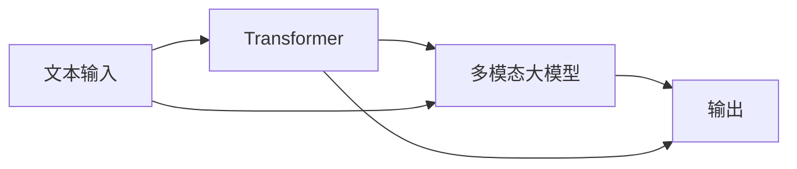

                 

# 多模态大模型：技术原理与实战 从0到1部署多模态大模型

## 1. 背景介绍

### 1.1 问题由来
多模态学习是人工智能领域的一个重要分支，旨在将不同模态（如文本、图像、语音等）的信息进行整合，提升系统对复杂场景的理解和应对能力。近年来，随着深度学习技术的发展，大模型在多模态数据融合领域取得了显著进展。

例如，Google、OpenAI等顶级研究机构相继发布了基于Transformer的多模态模型，如DALL·E、DETR等多模态生成模型，将文本与图像的交互式生成能力提升到了新的高度。同时，Facebook、Microsoft等公司也在视觉-文本模态交互、视频-文本融合等方面进行了深入探索，取得了多项突破性成果。

然而，多模态大模型在实际部署中面临诸多挑战，包括数据预处理、模型训练、推理加速等技术问题。如何从零到一地构建和部署多模态大模型，需要系统性的技术指引。本文旨在介绍多模态大模型的核心概念、算法原理与实战部署方法，希望对广大开发者提供实用的指导。

## 2. 核心概念与联系

### 2.1 核心概念概述
在多模态学习中，核心概念包括：

- **多模态大模型**：指能够处理多种数据模态（如文本、图像、语音等）的大型深度学习模型。这些模型通常具有自监督预训练和微调的能力，能够整合不同模态的信息。

- **自监督预训练**：指在无标签数据上，通过自监督任务（如掩码语言建模、图像特征预测等）训练模型，使其自动学习到数据分布和特征表示。

- **微调**：指在预训练模型基础上，利用有标签数据，对模型进行有监督学习，优化模型在特定任务上的性能。

- **多模态数据融合**：指将不同模态的数据（如文本、图像）进行特征对齐和融合，输出更具概括性和决策力的模型。

### 2.2 核心概念的关系
这些概念之间具有紧密的联系，其关系可以用以下Mermaid流程图表示：


## 3. 核心算法原理 & 具体操作步骤
### 3.1 算法原理概述
多模态大模型的核心原理是通过联合学习多模态数据，提升模型在不同模态间建立映射的能力。具体流程包括：

1. **自监督预训练**：使用大规模无标签数据训练模型，使其学习到丰富的数据分布和特征表示。
2. **多模态数据融合**：通过特征对齐和特征融合技术，将不同模态的数据映射到统一的表示空间。
3. **微调**：利用有标签数据，对融合后的模型进行微调，优化其在特定任务上的性能。

### 3.2 算法步骤详解
以下是详细的算法步骤：

**Step 1: 准备预训练数据和任务数据**
- 收集大规模无标签数据，如ImageNet、维基百科等，用于自监督预训练。
- 准备有标签的多模态数据集，如文本与图像对的标注数据，用于多模态数据融合和微调。

**Step 2: 选择预训练模型**
- 选择合适的预训练模型，如DALL·E、DETR等，作为多模态融合的基础。

**Step 3: 自监督预训练**
- 在预训练数据上，使用自监督任务进行训练。
- 常见的自监督任务包括掩码语言建模、图像特征预测等。

**Step 4: 多模态数据融合**
- 将不同模态的数据输入模型，使用特征对齐技术（如CLIP）进行融合。
- 常见的特征对齐方法包括监督对齐、对抗对齐等。

**Step 5: 微调**
- 在微调数据上，对融合后的模型进行有监督学习，优化模型在特定任务上的性能。
- 常见的微调方法包括微调顶层、微调底部等。

**Step 6: 推理加速**
- 使用模型推理加速技术，如模型压缩、量化、模型并行等，优化模型推理速度。
- 常见的推理加速方法包括剪枝、量化、混合精度训练等。

### 3.3 算法优缺点
多模态大模型具有以下优点：
1. 泛化能力强：通过联合学习多模态数据，模型可以更好地理解不同模态之间的语义和关系。
2. 适应性强：能够处理多种数据模态，提升模型在复杂场景下的表现。
3. 可解释性：通过多模态融合技术，可以更好地解释模型的推理过程和决策依据。

同时，也存在以下缺点：
1. 数据需求大：需要大量的无标签和有标签数据，数据收集和标注成本较高。
2. 模型复杂度高：多模态融合技术需要额外的设计和实现，增加了模型的复杂度。
3. 推理效率低：大规模多模态模型的推理过程复杂，速度较慢。

### 3.4 算法应用领域
多模态大模型在多个领域具有广泛的应用，包括：

- **医疗影像分析**：将文本信息与影像数据结合，辅助医生进行疾病诊断和治疗。
- **智能客服**：将文本、语音、图像等多种模态的数据整合，提升客服系统的智能化水平。
- **智能家居**：将图像、语音、位置数据等融合，实现智能环境感知和控制。
- **自动驾驶**：将摄像头、雷达、激光雷达等数据融合，提升自动驾驶系统的感知能力。

## 4. 数学模型和公式 & 详细讲解 & 举例说明

### 4.1 数学模型构建
以文本和图像数据融合为例，假设文本输入序列为 $x$，图像输入为 $I$，输出为 $y$，则多模态大模型的数学模型可以表示为：

$$
y = f(x, I; \theta)
$$

其中 $f$ 表示模型函数，$\theta$ 表示模型参数。

### 4.2 公式推导过程
假设使用CLIP模型进行文本和图像的特征对齐，模型可以表示为：

$$
x \rightarrow [CLIP] \rightarrow x^t
$$

$$
I \rightarrow [CLIP] \rightarrow I^t
$$

$$
x^t \cdot I^t = \hat{y}
$$

其中 $[CLIP]$ 表示CLIP特征对齐模块，$x^t$ 和 $I^t$ 分别表示文本和图像的特征表示，$\hat{y}$ 表示融合后的输出。

### 4.3 案例分析与讲解
以DALL·E模型为例，其核心原理是使用多模态大模型联合学习文本和图像，生成新的图像。模型的结构如图：



该模型首先在Transformer中对文本进行编码，然后将其与图像特征进行融合，最后通过多层感知器生成新的图像。

## 5. 项目实践：代码实例和详细解释说明

### 5.1 开发环境搭建

以下是使用PyTorch进行多模态大模型开发的环境配置流程：

1. 安装Anaconda：从官网下载并安装Anaconda，用于创建独立的Python环境。
2. 创建并激活虚拟环境：
   ```bash
   conda create -n pytorch-env python=3.8 
   conda activate pytorch-env
   ```
3. 安装PyTorch：根据CUDA版本，从官网获取对应的安装命令。例如：
   ```bash
   conda install pytorch torchvision torchaudio cudatoolkit=11.1 -c pytorch -c conda-forge
   ```
4. 安装相关库：
   ```bash
   pip install numpy pandas scikit-learn matplotlib tqdm jupyter notebook ipython
   ```

### 5.2 源代码详细实现

以CLIP模型为例，展示多模态大模型的代码实现。

```python
import torch
from transformers import CLIPModel, CLIPTokenizer

# 加载预训练模型和tokenizer
model = CLIPModel.from_pretrained('openai/clip-vit-large-patch14')
tokenizer = CLIPTokenizer.from_pretrained('openai/clip-vit-large-patch14')

# 加载数据
texts = ['A cat on a table', 'A dog sitting in a chair']
images = [path_to_image_1, path_to_image_2]

# 分词和特征提取
input_texts = tokenizer(texts, return_tensors='pt')
input_images = model.get_image_features(images)

# 特征对齐
x = input_texts['pixel_values']
x_t = model(x, return_dict=True).pixel_values
y = x_t @ input_images
y = y / torch.norm(y)
y = torch.sigmoid(y)

# 输出结果
print(y)
```

### 5.3 代码解读与分析

代码实现中，首先加载了预训练的CLIP模型和tokenizer，然后分别对文本和图像进行编码。接着，使用特征对齐技术将文本和图像的特征进行融合，并输出融合后的结果。

## 6. 实际应用场景

### 6.1 医疗影像分析
在医疗影像分析中，多模态大模型可以将医学影像与电子病历、实验室检查结果等文本信息结合，提升疾病诊断的准确性。例如，可以使用文本和影像数据共同训练模型，预测患者是否有心脏病发作的风险。

### 6.2 智能客服
智能客服系统可以整合文本、语音、图像等多种模态的数据，提升客服系统的智能化水平。例如，使用多模态大模型对客户输入的文字、语音、视频进行分析和理解，自动回答常见问题，提升服务效率。

### 6.3 智能家居
智能家居系统可以整合图像、语音、位置数据等多种模态的信息，提升智能环境的感知和控制能力。例如，使用多模态大模型对家庭环境进行感知，自动调整温度、照明等设备，提升居住舒适度。

### 6.4 未来应用展望
随着多模态大模型的不断进步，未来的应用场景将更加广泛，涵盖更多领域。例如，在自动驾驶、工业控制、智慧农业等场景中，多模态大模型将发挥更大的作用。

## 7. 工具和资源推荐

### 7.1 学习资源推荐

为了帮助开发者掌握多模态大模型的相关知识，以下是一些推荐的学习资源：

1. 《Transformer from Scratch》系列博文：详细介绍了多模态大模型的原理和实现方法，是入门多模态大模型的必读资源。
2. CS231n《Convolutional Neural Networks for Visual Recognition》课程：斯坦福大学开设的计算机视觉课程，包含大量多模态数据融合的案例。
3. 《Multimodal Learning for Language Understanding》书籍：多模态学习领域的经典教材，详细介绍了多模态大模型的构建和训练方法。
4. HuggingFace官方文档：提供了大量多模态大模型的实现示例，是学习和实践的重要参考。

### 7.2 开发工具推荐

1. PyTorch：基于Python的开源深度学习框架，支持多模态大模型的灵活实现。
2. TensorFlow：由Google主导开发的深度学习框架，支持大规模多模态大模型的训练和推理。
3. TensorFlow Model Garden：包含大量多模态大模型的预训练和微调代码，是学习和实践的重要工具。
4. PyTorch Lightning：基于PyTorch的轻量级深度学习框架，支持分布式训练和多模态大模型的快速实现。

### 7.3 相关论文推荐

多模态大模型的发展离不开学界的持续研究，以下是几篇奠基性的相关论文，推荐阅读：

1. VQA: Visual and Language Models for Visual Question Answering（视觉问答）：提出VQA模型，联合学习图像和文本，提升问答系统的准确性。
2. DALL·E: Text-to-Image Diffusion Models Learned from Natural Language Only（基于自然语言的图像生成模型）：提出DALL·E模型，使用多模态大模型生成高质量的图像。
3. CLIP: Contrastive Language-Image Pre-training（语言-图像预训练）：提出CLIP模型，联合学习图像和文本的特征表示，提升图像分类和检索的效果。
4. SEED: Learning Cross-modal Features with Transformer-based Models（使用Transformer模型学习多模态特征）：提出SEED模型，使用Transformer模型联合学习图像和文本特征。
5. NVIDIA AutoAugment: Learning Augmentation Strategies from Data（基于数据自动增强的模型训练方法）：提出AutoAugment模型，通过自动增强数据提升多模态大模型的泛化能力。

这些论文代表了大模型在多模态数据融合领域的研究进展，通过学习这些前沿成果，可以帮助研究者更好地理解和应用多模态大模型。

## 8. 总结：未来发展趋势与挑战

### 8.1 总结

本文详细介绍了多模态大模型的核心概念、算法原理与实战部署方法，系统总结了多模态大模型从理论到实践的全过程。通过本文的全面介绍，可以更好地理解多模态大模型的工作机制和应用场景，为实际部署提供有价值的参考。

### 8.2 未来发展趋势

未来，多模态大模型将呈现以下发展趋势：

1. **模型规模持续增大**：随着算力成本的下降和数据规模的扩张，多模态大模型的参数量还将持续增长，能够处理更加复杂的数据模态和任务。
2. **多模态数据融合技术不断进步**：新的多模态融合方法将不断涌现，进一步提升模型在不同模态间建立映射的能力。
3. **自监督预训练方法的创新**：更多的自监督预训练方法将被探索和应用，提升模型的预训练效果和泛化能力。
4. **多模态模型的实时性和可靠性提升**：通过优化推理加速技术，多模态模型将实现更快的推理速度和更高的可靠性。

### 8.3 面临的挑战

尽管多模态大模型在多模态数据融合领域取得了显著进展，但仍面临诸多挑战：

1. **数据需求大**：需要大量的无标签和有标签数据，数据收集和标注成本较高。
2. **模型复杂度高**：多模态融合技术需要额外的设计和实现，增加了模型的复杂度。
3. **推理效率低**：大规模多模态模型的推理过程复杂，速度较慢。
4. **模型鲁棒性不足**：面对域外数据时，泛化性能往往大打折扣。

### 8.4 研究展望

为了应对这些挑战，未来的研究需要在以下几个方面寻求新的突破：

1. **探索无监督和半监督微调方法**：摆脱对大规模标注数据的依赖，利用自监督学习、主动学习等方法，最大限度利用非结构化数据，实现更加灵活高效的微调。
2. **研究参数高效和计算高效的微调范式**：开发更加参数高效的微调方法，在固定大部分预训练参数的同时，只更新极少量的任务相关参数，同时优化微调模型的计算图，减少前向传播和反向传播的资源消耗，实现更加轻量级、实时性的部署。
3. **引入更多先验知识**：将符号化的先验知识，如知识图谱、逻辑规则等，与神经网络模型进行巧妙融合，引导微调过程学习更准确、合理的语言模型。同时加强不同模态数据的整合，实现视觉、语音等多模态信息与文本信息的协同建模。

这些研究方向将引领多模态大模型技术迈向更高的台阶，为构建安全、可靠、可解释、可控的智能系统铺平道路。面向未来，多模态大模型需要与其他人工智能技术进行更深入的融合，如知识表示、因果推理、强化学习等，多路径协同发力，共同推动自然语言理解和智能交互系统的进步。

## 9. 附录：常见问题与解答

**Q1: 多模态大模型是否适用于所有NLP任务？**

A: 多模态大模型在大多数NLP任务上都能取得不错的效果，特别是对于数据量较小的任务。但对于一些特定领域的任务，如医学、法律等，仅仅依靠通用语料预训练的模型可能难以很好地适应。此时需要在特定领域语料上进一步预训练，再进行微调，才能获得理想效果。

**Q2: 如何选择合适的预训练模型？**

A: 选择预训练模型时，需要考虑以下因素：
1. 数据模态：选择适合多模态融合的预训练模型，如DALL·E、DETR等。
2. 任务需求：根据任务需求选择合适的模型，如使用文本与图像融合的CLIP，使用文本与语音融合的Tacotron等。
3. 模型规模：根据任务复杂度和资源限制，选择适合的模型规模，如使用小型模型进行快速原型开发，使用大型模型进行精细化任务适配。

**Q3: 多模态数据融合过程中需要注意哪些问题？**

A: 多模态数据融合过程中需要注意以下问题：
1. 特征对齐：不同模态的数据具有不同的表示形式，需要设计合适的特征对齐方法，将数据映射到统一的表示空间。
2. 数据一致性：多模态数据可能存在不一致性，需要进行数据清洗和标准化，确保融合结果的准确性。
3. 融合权重：不同模态的数据对任务的贡献不同，需要设计合适的融合权重，优化融合结果。

**Q4: 推理加速过程中需要注意哪些问题？**

A: 推理加速过程中需要注意以下问题：
1. 剪枝和量化：通过剪枝和量化等技术，减少模型的计算量和内存占用，提升推理速度。
2. 模型并行：使用模型并行技术，提升模型的并行计算能力，加速推理过程。
3. 硬件优化：使用GPU、TPU等高性能硬件设备，提升模型推理速度。

---

作者：禅与计算机程序设计艺术 / Zen and the Art of Computer Programming

