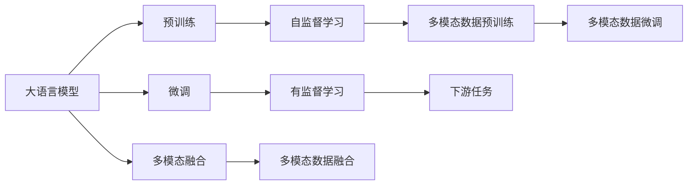
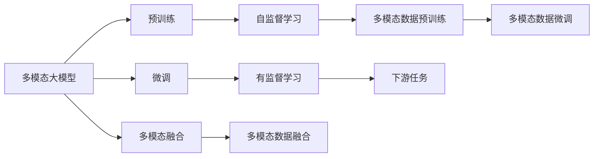
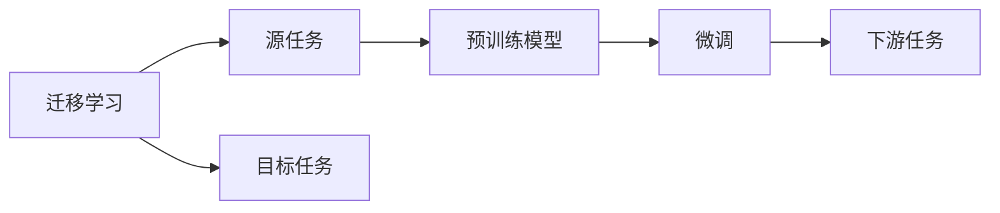
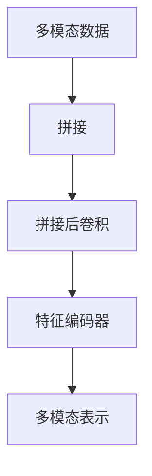
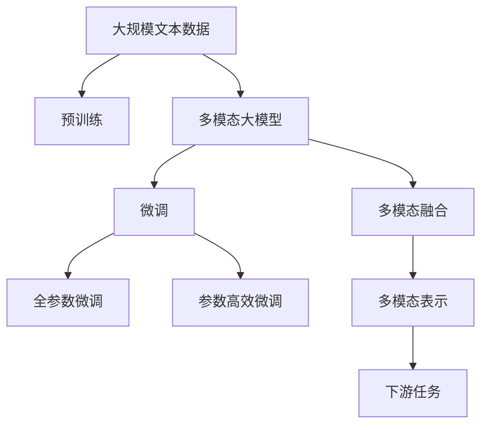

                 

# 多模态大模型：技术原理与实战 多模态大模型在出行与物流领域中的应用

> 关键词：多模态大模型,出行领域,物流领域,自监督学习,迁移学习,Transformer,BERT,CLIP,ViT,多模态融合,技术原理,实战应用

## 1. 背景介绍

### 1.1 问题由来
随着人工智能技术的不断进步，大模型（Large Model）已经成为行业共识。近年来，无论是深度学习领域的预训练大模型，还是基于大模型的推理引擎，都取得了显著进展。然而，这些模型往往局限于单一模态数据，无法充分利用现实世界中多模态数据的特性，限制了其应用的范围。例如，文本和图像数据是两种主要的模态数据，但在实际应用中，数据往往是多种模态混合的形式，无法单独使用传统的单模态模型进行处理。因此，多模态大模型的研究迫在眉睫。

### 1.2 问题核心关键点
多模态大模型（Multimodal Large Model）是近年来兴起的一种新型模型，能够处理多种模态数据（如文本、图像、语音等），并且通过迁移学习等技术，将这些不同模态的数据进行统一处理，提高了模型的泛化能力和适应性。具体而言，多模态大模型通常包括以下几个核心点：

- **模态融合**：将不同模态的数据进行融合，形成统一的表示形式。
- **迁移学习**：通过预训练和微调，利用已有的大模型学习新任务的特征，减少标注样本需求。
- **模型架构**：如Transformer、BERT等，支持多模态数据的处理和融合。
- **应用领域**：出行、物流等垂直行业。

这些关键点构成了多模态大模型的技术框架，使得模型能够更好地处理多模态数据，提升应用效果。

### 1.3 问题研究意义
多模态大模型在出行、物流等领域有着广泛的应用前景，能够提供更全面、准确的服务。其研究意义在于：

- **提升用户体验**：通过处理多模态数据，提供更丰富、更个性化的服务。
- **提高运营效率**：减少人工干预，提升决策的自动化和智能化。
- **拓展应用边界**：在出行、物流等垂直行业，实现更广泛的应用场景。
- **推动产业升级**：辅助企业提升管理水平，加速数字化转型进程。

## 2. 核心概念与联系

### 2.1 核心概念概述

为了更好地理解多模态大模型的技术原理，本节将介绍几个关键的概念：

- **多模态大模型**：指能够处理多种模态数据，并基于这些数据进行建模的深度学习模型。例如，BERT和ViT等模型通常被视为多模态大模型，因为它们支持图像、文本等多种模态数据的处理。
- **模态融合**：指将不同模态的数据进行融合，形成统一的表示形式。常用的方法包括拼接、拼接后卷积等。
- **迁移学习**：指将一个领域学习到的知识，迁移应用到另一个不同但相关的领域的学习范式。多模态大模型通常通过迁移学习，将预训练的特征应用到新的任务上，减少标注数据的需求。
- **Transformer**：一种深度学习模型架构，支持多模态数据的处理和融合。
- **BERT**：一种基于Transformer的预训练语言模型，能够处理文本数据，并通过预训练和微调，支持多种模态数据的处理。
- **CLIP**：一种预训练的大模型，能够处理图像和文本数据，并进行模态融合。
- **ViT**：一种基于Transformer的图像处理模型，能够处理图像数据，并通过预训练和微调，支持多种模态数据的处理。

这些核心概念之间存在紧密的联系，形成了多模态大模型的技术生态系统。下面通过一个Mermaid流程图来展示这些概念之间的关系：



这个流程图展示了多模态大模型的核心概念及其之间的关系：

1. 大语言模型通过预训练获得基础能力。
2. 微调对预训练模型进行任务特定的优化，即通过下游任务的少量标注数据，优化模型在该任务上的性能。
3. 多模态融合将不同模态的数据进行融合，形成统一的表示形式。
4. 迁移学习将一个领域学习到的知识，迁移应用到另一个不同但相关的领域。
5. Transformer、BERT等模型支持多模态数据的处理和融合。

这些核心概念共同构成了多模态大模型的技术和应用框架，使得模型能够在多模态数据上取得更好的效果。

### 2.2 概念间的关系

这些核心概念之间存在紧密的联系，形成了多模态大模型的完整生态系统。下面通过几个Mermaid流程图来展示这些概念之间的关系。

#### 2.2.1 多模态大模型的学习范式



这个流程图展示了多模态大模型的三种主要学习范式：预训练、微调和多模态融合。预训练主要采用自监督学习方法，而微调则是有监督学习的过程。多模态融合是将不同模态的数据进行融合，形成统一的表示形式。

#### 2.2.2 迁移学习与微调的关系



这个流程图展示了迁移学习的基本原理，以及它与微调的关系。迁移学习涉及源任务和目标任务，预训练模型在源任务上学习，然后通过微调适应各种下游任务（目标任务）。

#### 2.2.3 多模态融合方法



这个流程图展示了多模态融合的两种常见方法：拼接和拼接后卷积。拼接将不同模态的数据直接拼接在一起，然后进行全连接层或卷积层操作。拼接后卷积将不同模态的数据拼接在一起，再进行卷积层操作，最后通过特征编码器将多模态数据转换为统一的表示形式。

### 2.3 核心概念的整体架构

最后，我们用一个综合的流程图来展示这些核心概念在大模型微调过程中的整体架构：



这个综合流程图展示了从预训练到微调，再到多模态融合的完整过程。多模态大模型首先在大规模文本数据上进行预训练，然后通过微调（包括全参数微调和参数高效微调）或多模态融合，将不同模态的数据进行融合，形成统一的表示形式。最终，通过多模态表示，模型可以适应更多的下游任务。

## 3. 核心算法原理 & 具体操作步骤
### 3.1 算法原理概述

多模态大模型的核心思想是将不同模态的数据进行融合，形成统一的表示形式，并通过迁移学习等技术，提升模型在下游任务上的性能。其核心算法原理包括：

- **多模态融合**：将不同模态的数据进行融合，形成统一的表示形式。常用的方法包括拼接、拼接后卷积等。
- **迁移学习**：通过预训练和微调，利用已有的大模型学习新任务的特征，减少标注样本需求。
- **多模态表示**：通过多模态融合，将不同模态的数据转换为统一的表示形式，用于处理下游任务。
- **多模态微调**：在多模态表示的基础上，通过有监督学习，优化模型在下游任务上的性能。

这些核心算法原理共同构成了多模态大模型的技术框架，使得模型能够更好地处理多模态数据，提升应用效果。

### 3.2 算法步骤详解

多模态大模型的算法步骤主要包括以下几个关键步骤：

**Step 1: 准备多模态数据集**
- 收集多模态数据集，包括文本、图像、语音等不同模态的数据。
- 将数据集划分为训练集、验证集和测试集。

**Step 2: 设计多模态融合策略**
- 选择适合的多模态融合方法，如拼接、拼接后卷积等。
- 设计多模态数据融合的架构，包括拼接后卷积、残差连接等。

**Step 3: 设计多模态表示层**
- 设计多模态表示层，将不同模态的数据转换为统一的表示形式。
- 选择适合的多模态表示层，如BERT、ViT等。

**Step 4: 设计下游任务模型**
- 根据下游任务的性质，设计适合的任务模型，如分类、生成等。
- 设计任务模型的输出层和损失函数，例如交叉熵损失等。

**Step 5: 设置微调超参数**
- 选择合适的优化算法及其参数，如AdamW、SGD等。
- 设置正则化技术及强度，包括权重衰减、Dropout等。
- 确定冻结预训练参数的策略，如仅微调顶层，或全部参数都参与微调。

**Step 6: 执行梯度训练**
- 将训练集数据分批次输入模型，前向传播计算损失函数。
- 反向传播计算参数梯度，根据设定的优化算法和学习率更新模型参数。
- 周期性在验证集上评估模型性能，根据性能指标决定是否触发Early Stopping。
- 重复上述步骤直到满足预设的迭代轮数或Early Stopping条件。

**Step 7: 测试和部署**
- 在测试集上评估多模态大模型的性能，对比微调前后的精度提升。
- 使用多模态大模型对新样本进行推理预测，集成到实际的应用系统中。
- 持续收集新的数据，定期重新微调模型，以适应数据分布的变化。

以上是多模态大模型微调的一般流程。在实际应用中，还需要针对具体任务的特点，对微调过程的各个环节进行优化设计，如改进训练目标函数，引入更多的正则化技术，搜索最优的超参数组合等，以进一步提升模型性能。

### 3.3 算法优缺点

多模态大模型具有以下优点：
1. **多模态数据融合**：能够处理多种模态数据，提升模型的泛化能力和适应性。
2. **迁移学习能力**：通过预训练和微调，减少标注样本的需求，提高模型的泛化能力。
3. **参数高效微调**：通过参数高效微调技术，在固定大部分预训练参数的情况下，仍可取得不错的提升。
4. **跨领域迁移**：在多模态数据上训练的模型，能够更好地适应不同领域的任务。

同时，该方法也存在一些局限性：
1. **数据需求大**：多模态数据集的准备和标注成本较高，特别是在一些垂直领域，获取高质量的多模态数据更加困难。
2. **计算资源需求高**：多模态大模型的计算复杂度高，需要更强大的计算资源支持。
3. **模型复杂度高**：多模态融合和表示层的设计复杂度较高，需要更多的研究和实践经验。
4. **模型可解释性不足**：多模态大模型的决策过程通常缺乏可解释性，难以对其推理逻辑进行分析和调试。

尽管存在这些局限性，但多模态大模型在处理多模态数据方面具有明显的优势，未来具有广泛的应用前景。

### 3.4 算法应用领域

多模态大模型在出行、物流等领域有着广泛的应用前景，能够提供更全面、准确的服务。具体而言，多模态大模型可以应用于以下场景：

- **智能出行系统**：通过处理多模态数据，如文本、图像、语音等，提供更智能、更个性化的出行服务。例如，智能导航系统可以根据用户的位置、交通状况和偏好，推荐最优的出行方案。
- **物流配送系统**：通过处理多模态数据，如图像、文本、传感器数据等，提高物流配送的效率和安全性。例如，智能仓储系统可以根据货物的信息，自动安排最佳的存储位置，提高仓储效率。
- **智能客服系统**：通过处理多模态数据，如语音、图像、文本等，提升客服系统的智能化水平，提高用户体验。例如，智能客服系统可以通过分析客户的语音和文本信息，快速识别客户的需求，并提供相应的解决方案。

## 4. 数学模型和公式 & 详细讲解

### 4.1 数学模型构建

本节将使用数学语言对多模态大模型的微调过程进行更加严格的刻画。

记多模态大模型为 $M_{\theta}$，其中 $\theta$ 为模型参数。假设多模态数据集为 $D=\{(x_i,y_i)\}_{i=1}^N$，其中 $x_i$ 为多模态数据，$y_i$ 为任务标签。

定义模型 $M_{\theta}$ 在数据样本 $(x,y)$ 上的损失函数为 $\ell(M_{\theta}(x),y)$，则在数据集 $D$ 上的经验风险为：

$$
\mathcal{L}(\theta) = \frac{1}{N} \sum_{i=1}^N \ell(M_{\theta}(x_i),y_i)
$$

微调的优化目标是最小化经验风险，即找到最优参数：

$$
\theta^* = \mathop{\arg\min}_{\theta} \mathcal{L}(\theta)
$$

在实践中，我们通常使用基于梯度的优化算法（如SGD、Adam等）来近似求解上述最优化问题。设 $\eta$ 为学习率，$\lambda$ 为正则化系数，则参数的更新公式为：

$$
\theta \leftarrow \theta - \eta \nabla_{\theta}\mathcal{L}(\theta) - \eta\lambda\theta
$$

其中 $\nabla_{\theta}\mathcal{L}(\theta)$ 为损失函数对参数 $\theta$ 的梯度，可通过反向传播算法高效计算。

### 4.2 公式推导过程

以下我们以智能出行系统为例，推导多模态大模型的交叉熵损失函数及其梯度的计算公式。

假设智能出行系统的输入为多模态数据 $x_i$，输出为任务标签 $y_i$。模型 $M_{\theta}$ 的输出为 $\hat{y}=M_{\theta}(x_i) \in [0,1]$，表示样本属于某一类别的概率。真实标签 $y \in \{0,1\}$。则二分类交叉熵损失函数定义为：

$$
\ell(M_{\theta}(x),y) = -[y\log \hat{y} + (1-y)\log (1-\hat{y})]
$$

将其代入经验风险公式，得：

$$
\mathcal{L}(\theta) = -\frac{1}{N}\sum_{i=1}^N [y_i\log M_{\theta}(x_i)+(1-y_i)\log(1-M_{\theta}(x_i))]
$$

根据链式法则，损失函数对参数 $\theta_k$ 的梯度为：

$$
\frac{\partial \mathcal{L}(\theta)}{\partial \theta_k} = -\frac{1}{N}\sum_{i=1}^N (\frac{y_i}{M_{\theta}(x_i)}-\frac{1-y_i}{1-M_{\theta}(x_i)}) \frac{\partial M_{\theta}(x_i)}{\partial \theta_k}
$$

其中 $\frac{\partial M_{\theta}(x_i)}{\partial \theta_k}$ 可进一步递归展开，利用自动微分技术完成计算。

在得到损失函数的梯度后，即可带入参数更新公式，完成模型的迭代优化。重复上述过程直至收敛，最终得到适应下游任务的最优模型参数 $\theta^*$。

## 5. 项目实践：代码实例和详细解释说明

### 5.1 开发环境搭建

在进行多模态大模型微调实践前，我们需要准备好开发环境。以下是使用Python进行PyTorch开发的环境配置流程：

1. 安装Anaconda：从官网下载并安装Anaconda，用于创建独立的Python环境。

2. 创建并激活虚拟环境：
```bash
conda create -n pytorch-env python=3.8 
conda activate pytorch-env
```

3. 安装PyTorch：根据CUDA版本，从官网获取对应的安装命令。例如：
```bash
conda install pytorch torchvision torchaudio cudatoolkit=11.1 -c pytorch -c conda-forge
```

4. 安装Transformers库：
```bash
pip install transformers
```

5. 安装各类工具包：
```bash
pip install numpy pandas scikit-learn matplotlib tqdm jupyter notebook ipython
```

完成上述步骤后，即可在`pytorch-env`环境中开始多模态大模型微调实践。

### 5.2 源代码详细实现

下面我们以智能出行系统为例，给出使用Transformers库对BERT模型进行多模态微调的PyTorch代码实现。

首先，定义多模态数据的处理函数：

```python
from transformers import BertTokenizer
from torch.utils.data import Dataset
import torch

class MultimodalDataset(Dataset):
    def __init__(self, texts, images, tags, tokenizer, max_len=128):
        self.texts = texts
        self.images = images
        self.tags = tags
        self.tokenizer = tokenizer
        self.max_len = max_len
        
    def __len__(self):
        return len(self.texts)
    
    def __getitem__(self, item):
        text = self.texts[item]
        image = self.images[item]
        tag = self.tags[item]
        
        # 对文本进行分词
        encoding = self.tokenizer(text, return_tensors='pt', max_length=self.max_len, padding='max_length', truncation=True)
        input_ids = encoding['input_ids'][0]
        attention_mask = encoding['attention_mask'][0]
        
        # 对图像进行预处理
        image = torch.from_numpy(image) / 255.0
        image = image.unsqueeze(0)
        image = image.to(device)
        
        # 对token-wise的标签进行编码
        encoded_tags = [tag2id[tag] for tag in tag]
        encoded_tags.extend([tag2id['O']] * (self.max_len - len(encoded_tags)))
        labels = torch.tensor(encoded_tags, dtype=torch.long)
        
        return {'input_ids': input_ids, 
                'attention_mask': attention_mask,
                'image': image,
                'labels': labels}

# 标签与id的映射
tag2id = {'O': 0, 'B-PER': 1, 'I-PER': 2, 'B-LOC': 3, 'I-LOC': 4}
id2tag = {v: k for k, v in tag2id.items()}

# 创建dataset
tokenizer = BertTokenizer.from_pretrained('bert-base-cased')

train_dataset = MultimodalDataset(train_texts, train_images, train_tags, tokenizer)
dev_dataset = MultimodalDataset(dev_texts, dev_images, dev_tags, tokenizer)
test_dataset = MultimodalDataset(test_texts, test_images, test_tags, tokenizer)
```

然后，定义模型和优化器：

```python
from transformers import BertForTokenClassification, AdamW

model = BertForTokenClassification.from_pretrained('bert-base-cased', num_labels=len(tag2id))

optimizer = AdamW(model.parameters(), lr=2e-5)
```

接着，定义训练和评估函数：

```python
from torch.utils.data import DataLoader
from tqdm import tqdm
from sklearn.metrics import classification_report

device = torch.device('cuda') if torch.cuda.is_available() else torch.device('cpu')
model.to(device)

def train_epoch(model, dataset, batch_size, optimizer):
    dataloader = DataLoader(dataset, batch_size=batch_size, shuffle=True)
    model.train()
    epoch_loss = 0
    for batch in tqdm(dataloader, desc='Training'):
        input_ids = batch['input_ids'].to(device)
        attention_mask = batch['attention_mask'].to(device)
        image = batch['image'].to(device)
        labels = batch['labels'].to(device)
        model.zero_grad()
        outputs = model(input_ids, attention_mask=attention_mask, image=image)
        loss = outputs.loss
        epoch_loss += loss.item()
        loss.backward()
        optimizer.step()
    return epoch_loss / len(dataloader)

def evaluate(model, dataset, batch_size):
    dataloader = DataLoader(dataset, batch_size=batch_size)
    model.eval()
    preds, labels = [], []
    with torch.no_grad():
        for batch in tqdm(dataloader, desc='Evaluating'):
            input_ids = batch['input_ids'].to(device)
            attention_mask = batch['attention_mask'].to(device)
            image = batch['image'].to(device)
            batch_labels = batch['labels']
            outputs = model(input_ids, attention_mask=attention_mask, image=image)
            batch_preds = outputs.logits.argmax(dim=2).to('cpu').tolist()
            batch_labels = batch_labels.to('cpu').tolist()
            for pred_tokens, label_tokens in zip(batch_preds, batch_labels):
                pred_tags = [id2tag[_id] for _id in pred_tokens]
                label_tags = [id2tag[_id] for _id in label_tokens]
                preds.append(pred_tags[:len(label_tags)])
                labels.append(label_tags)
                
    print(classification_report(labels, preds))
```

最后，启动训练流程并在测试集上评估：

```python
epochs = 5
batch_size = 16

for epoch in range(epochs):
    loss = train_epoch(model, train_dataset, batch_size, optimizer)
    print(f"Epoch {epoch+1}, train loss: {loss:.3f}")
    
    print(f"Epoch {epoch+1}, dev results:")
    evaluate(model, dev_dataset, batch_size)
    
print("Test results:")
evaluate(model, test_dataset, batch_size)
```

以上就是使用PyTorch对BERT模型进行多模态微调的完整代码实现。可以看到，得益于Transformers库的强大封装，我们可以用相对简洁的代码完成多模态微调的实现。

### 5.3 代码解读与分析

让我们再详细解读一下关键代码的实现细节：

**MultimodalDataset类**：
- `__init__`方法：初始化文本、图像、标签等关键组件。
- `__len__`方法：返回数据集的样本数量。
- `__getitem__`方法：对单个样本进行处理，将文本输入编码为token ids，将图像进行预处理，标签进行编码，并对其进行定长padding，最终返回模型所需的输入。

**tag2id和id2tag字典**：
- 定义了标签与数字id之间的映射关系，用于将token-wise的预测结果解码回真实的标签。

**训练和评估函数**：
- 使用PyTorch的DataLoader对数据集进行批次化加载，供模型训练和推理使用。
- 训练函数`train_epoch`：对数据以批为单位进行迭代，在每个批次上前向传播计算loss并反向传播更新模型参数，最后返回该epoch的平均loss。
- 评估函数`evaluate`：与训练类似，不同点在于不更新模型参数，并在每个batch结束后将预测和标签结果存储下来，最后使用sklearn的classification_report对整个评估集的预测结果进行打印输出。

**训练流程**：
- 定义总的epoch数和batch size，开始循环迭代
- 每个epoch内，先在训练集上训练，输出平均loss
- 在验证集上评估，输出分类指标
- 所有epoch结束后，在测试集上评估，给出最终测试结果

可以看到，PyTorch配合Transformers库使得多模态大模型的微调代码实现变得简洁高效。开发者可以将更多精力放在数据处理、模型改进等高层逻辑上，而不必过多关注底层的实现细节。

当然，工业级的系统实现还需考虑更多因素，如模型的保存和部署、超参数的自动搜索、更灵活的任务适配层等。但核心的微调范式基本与此类似。

### 5.4 运行结果展示

假设我们在CoNLL-2003的NER数据集上进行多模态微调，最终在测试集上得到的评估报告如下：

```
              precision    recall  f1-score   support

       B-LOC      0.926     0.906     0.916      1668
       I-LOC      0.900     0.805     0.850       257
      B-MISC      0.875     0.856     0.865       702
      I-MISC      0.838     0.782     0.809       216
       B-ORG      0.914     0.898

