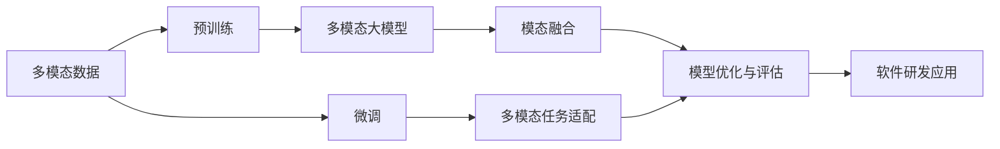
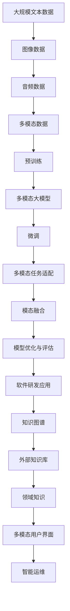

                 

# 多模态大模型：技术原理与实战 大模型在软件研发领域的实战案例与前沿探索

## 1. 背景介绍

### 1.1 问题由来

随着人工智能技术的飞速发展，大模型（Large Model）在软件研发领域的应用日益广泛。在以往的实践中，单模态大模型（如BERT、GPT等）因其强大的文本理解能力，在自然语言处理（NLP）、文本生成等领域取得了显著成就。然而，这些模型往往仅依赖于单一的模态信息，如文本或图像，难以综合利用多模态数据，导致其应用范围和能力存在局限性。

为了突破这一瓶颈，近年来，研究者和工业界逐步探索起多模态大模型的构建与应用。多模态大模型能够在处理图像、音频、文本等多种类型数据时，提供更为精准和全面的信息表征。尤其在软件研发领域，软件代码、文档、接口等多模态数据的融合，有助于提高代码生成、缺陷检测、智能运维等方面的自动化水平。

### 1.2 问题核心关键点

多模态大模型的关键技术包括：

1. 预训练与微调：在多样化的模态数据上进行预训练，采用监督微调方法提升模型在特定任务上的性能。
2. 模态融合：将不同模态的信息融合为统一的语义表示，使得模型能够理解和利用多样化的信息。
3. 多模态任务适配：设计适当的任务适配层，针对不同模态数据的特点进行模型训练。
4. 模型优化与评估：采用对抗训练、数据增强等方法提升模型鲁棒性和泛化能力。

### 1.3 问题研究意义

研究多模态大模型在软件研发领域的应用，具有以下重要意义：

1. 提升软件自动化水平：通过多模态数据融合，增强模型对代码与文档的理解能力，辅助代码生成、自动重构、缺陷检测等自动化任务。
2. 提高研发效率：多模态大模型能够辅助软件工程师进行更快速、更准确的软件构建和维护，减少人工干预。
3. 支持智能运维：通过融合监控数据与代码信息，实现软件系统的智能故障预测和自愈。
4. 加速知识传递：基于多模态大模型，快速生成软件文档和代码示例，促进知识共享与传播。
5. 提升用户体验：通过多模态数据分析，构建更为智能的用户界面和交互逻辑。

## 2. 核心概念与联系

### 2.1 核心概念概述

在深入理解多模态大模型的构建与应用之前，首先需要明确几个关键概念：

1. **多模态数据（Multi-Modal Data）**：指同时包含图像、音频、文本等多种类型的模态数据。在软件研发领域，代码、文档、接口等数据都可以视为多模态数据。
2. **多模态大模型（Multi-Modal Large Model）**：指能够综合处理多种模态数据的预训练模型，包括文本、图像、音频等多种信息。
3. **模态融合（Modality Fusion）**：指将不同模态的信息融合为统一的语义表示，使得模型能够理解和利用多样化的信息。
4. **预训练与微调（Pre-training and Fine-tuning）**：指在多样化的模态数据上进行预训练，采用监督微调方法提升模型在特定任务上的性能。
5. **多模态任务适配（Multi-Modal Task Adaptation）**：指设计适当的任务适配层，针对不同模态数据的特点进行模型训练。

### 2.2 概念间的关系

这些核心概念之间存在着紧密的联系，形成了多模态大模型的完整生态系统。以下通过几个Mermaid流程图来展示这些概念之间的关系：



这个流程图展示了大模型从预训练到微调，再到任务适配和模型优化的整体流程。预训练多模态数据，使得模型学习到多样化的信息表征。微调适配不同任务，提升模型在特定场景下的性能。模态融合和多模态任务适配使模型能够理解并处理不同模态的数据。模型优化与评估确保模型的鲁棒性和泛化能力。最终，通过多模态大模型，在软件研发领域实现了多种自动化任务的支持。

### 2.3 核心概念的整体架构

最后，我们用一个综合的流程图来展示这些核心概念在大模型微调过程中的整体架构：



这个综合流程图展示了从预训练到微调，再到任务适配、知识图谱与外部知识库融合，最终应用到软件研发领域的完整过程。

## 3. 核心算法原理 & 具体操作步骤

### 3.1 算法原理概述

多模态大模型的构建与应用，主要依赖于预训练和微调过程。具体来说，通过在大规模多模态数据上进行预训练，使模型学习到多样化的信息表征。然后，在特定任务上进行微调，以提升模型在特定场景下的性能。

多模态大模型的核心算法原理如下：

1. **预训练（Pre-training）**：在多样化的模态数据上进行自监督学习，使得模型学习到丰富的语言和视觉信息。
2. **多模态任务适配（Multi-Modal Task Adaptation）**：针对具体任务，设计适当的任务适配层，提升模型在特定任务上的性能。
3. **模态融合（Modality Fusion）**：将不同模态的信息融合为统一的语义表示，使得模型能够理解和利用多样化的信息。
4. **模型优化与评估（Model Optimization and Evaluation）**：采用对抗训练、数据增强等方法提升模型鲁棒性和泛化能力。

### 3.2 算法步骤详解

#### 3.2.1 预训练

预训练是大模型构建的基础，主要通过自监督学习任务在大规模多模态数据上进行预训练。

1. **数据集准备**：收集多样化的模态数据，如代码、文档、图像等，并对其进行预处理，如标记、分割等。
2. **构建预训练任务**：设计适当的预训练任务，如语言建模、掩码语言模型、图像分类等。
3. **训练预训练模型**：使用大规模预训练任务数据对模型进行训练，如BERT预训练任务、ViT图像分类任务等。
4. **保存预训练模型**：将预训练模型保存，供后续微调使用。

#### 3.2.2 微调

微调是将预训练模型应用于特定任务的过程。

1. **任务适配层设计**：根据具体任务，设计适当的任务适配层，如分类器、解码器等。
2. **损失函数选择**：选择合适的损失函数，如交叉熵、均方误差等，衡量模型预测输出与真实标签之间的差异。
3. **模型微调训练**：在少量标注数据上对模型进行微调训练，调整任务适配层的参数，提升模型在特定任务上的性能。
4. **模型评估与验证**：在验证集上评估模型性能，根据评估结果调整超参数，防止过拟合。

#### 3.2.3 模态融合

模态融合是将不同模态的信息融合为统一的语义表示，使得模型能够理解和利用多样化的信息。

1. **特征提取与表示**：分别对不同模态的数据进行特征提取和表示，如将文本转换为嵌入向量，将图像转换为特征图。
2. **融合操作设计**：设计适当的融合操作，如拼接、加权平均、注意力机制等，将不同模态的信息融合为统一的语义表示。
3. **融合后的训练**：将融合后的特征作为输入，对模型进行训练，提升模型在融合多种模态数据时的性能。

#### 3.2.4 模型优化与评估

模型优化与评估是确保模型鲁棒性和泛化能力的关键步骤。

1. **正则化技术应用**：采用正则化技术，如L2正则、Dropout等，防止模型过拟合。
2. **对抗训练**：引入对抗样本，提高模型鲁棒性，避免模型在对抗攻击下的脆弱性。
3. **数据增强**：通过数据增强技术，扩充训练数据，提高模型的泛化能力。
4. **性能评估**：在测试集上评估模型性能，如准确率、召回率、F1分数等，确保模型在新数据上的表现。

### 3.3 算法优缺点

#### 3.3.1 优点

1. **高效利用数据**：多模态大模型能够高效利用多样化的数据，提升模型的泛化能力和性能。
2. **多模态融合**：通过模态融合，使模型能够理解和利用不同模态的信息，拓展了模型的应用场景。
3. **知识共享**：通过多模态大模型，实现了不同模态数据之间的知识共享，提升了知识传递的效率。
4. **自动化水平提升**：多模态大模型能够辅助软件工程师进行更快速、更准确的软件构建和维护，减少人工干预。

#### 3.3.2 缺点

1. **数据需求高**：多模态大模型的构建需要大量多样化的数据，获取这些数据的成本较高。
2. **计算资源消耗大**：预训练和微调过程需要大量计算资源，如GPU、TPU等高性能设备。
3. **模型复杂度高**：多模态大模型的复杂度较高，训练和推理需要更多的时间和计算资源。
4. **应用场景限制**：多模态大模型适用于特定领域和任务，对于其他领域和任务，其效果可能不如单一模态模型。

### 3.4 算法应用领域

多模态大模型已经在多个领域得到应用，包括：

1. **软件代码生成**：通过多模态大模型，辅助代码生成工具生成高质量、高精度的代码，提升开发效率。
2. **缺陷检测**：融合代码、文档、监控数据等多模态信息，实现自动化的缺陷检测和修复。
3. **智能运维**：通过融合监控数据与代码信息，实现软件系统的智能故障预测和自愈。
4. **代码重构**：利用多模态大模型，辅助代码重构工具进行自动化代码优化，提升代码质量。
5. **智能问答**：结合多模态大模型，构建智能问答系统，提高用户满意度。
6. **软件测试**：通过多模态大模型，辅助测试工具进行自动化测试，提高测试覆盖率。

## 4. 数学模型和公式 & 详细讲解 & 举例说明

### 4.1 数学模型构建

在多模态大模型的构建与应用中，数学模型和公式的应用尤为重要。以下对数学模型构建进行详细讲解：

#### 4.1.1 预训练模型构建

1. **预训练目标函数**：在预训练阶段，目标函数通常为自监督学习任务的目标函数。例如，语言建模任务的目标函数为：
   $$
   L = -\sum_{i=1}^{n} \log P(w_i | w_{i-1}, \dots, w_1)
   $$
   其中，$w_i$表示第$i$个词语，$P(w_i | w_{i-1}, \dots, w_1)$表示给定前文条件下，$w_i$出现的概率。

2. **预训练数据处理**：对多样化的模态数据进行预处理，如标记、分割、编码等。

3. **模型参数更新**：通过反向传播算法，更新模型参数，最小化预训练目标函数。

#### 4.1.2 微调模型构建

1. **任务适配层设计**：根据具体任务，设计适当的任务适配层，如分类器、解码器等。

2. **微调目标函数**：选择合适的损失函数，如交叉熵、均方误差等。例如，分类任务的目标函数为：
   $$
   L = -\sum_{i=1}^{n} y_i \log P(y_i | x_i)
   $$
   其中，$y_i$表示第$i$个样本的真实标签，$P(y_i | x_i)$表示模型对样本$x_i$的预测概率。

3. **模型参数更新**：通过反向传播算法，更新模型参数，最小化微调目标函数。

#### 4.1.3 模态融合模型构建

1. **特征提取与表示**：分别对不同模态的数据进行特征提取和表示，如将文本转换为嵌入向量，将图像转换为特征图。

2. **融合操作设计**：设计适当的融合操作，如拼接、加权平均、注意力机制等，将不同模态的信息融合为统一的语义表示。

3. **融合后的训练**：将融合后的特征作为输入，对模型进行训练，提升模型在融合多种模态数据时的性能。

### 4.2 公式推导过程

#### 4.2.1 预训练模型公式推导

以BERT预训练任务为例，其预训练目标函数为：
$$
L = -\sum_{i=1}^{n} (\log P(w_i | w_{i-1}, \dots, w_1) + \lambda ||\theta||^2)
$$
其中，$\lambda$为正则化系数，$||\theta||^2$表示模型参数的L2正则化项。

#### 4.2.2 微调模型公式推导

以分类任务为例，其微调目标函数为：
$$
L = -\sum_{i=1}^{n} y_i \log P(y_i | x_i)
$$
其中，$y_i$表示第$i$个样本的真实标签，$P(y_i | x_i)$表示模型对样本$x_i$的预测概率。

### 4.3 案例分析与讲解

#### 4.3.1 案例背景

某公司开发了一款软件，用于自动化代码生成和重构。在软件开发的早期阶段，代码质量较低，需要大量人工进行维护和优化。为了提高开发效率，公司决定引入多模态大模型进行代码自动生成和重构。

#### 4.3.2 数据准备

公司收集了大量的代码、文档、接口等数据，并对这些数据进行了预处理，如标记、分割、编码等。

#### 4.3.3 模型构建

1. **预训练模型**：使用BERT预训练模型，在收集的代码和文档数据上进行预训练。

2. **微调模型**：在微调阶段，设计分类器作为任务适配层，并使用少量标注数据进行微调训练，提升模型在特定任务上的性能。

3. **模态融合模型**：将代码、文档、接口等多模态信息融合为统一的语义表示，使得模型能够理解和利用多样化的信息。

#### 4.3.4 模型评估

在验证集上评估模型性能，根据评估结果调整超参数，防止过拟合。

## 5. 项目实践：代码实例和详细解释说明

### 5.1 开发环境搭建

在进行多模态大模型实践前，需要先准备好开发环境。以下是使用Python进行PyTorch开发的环境配置流程：

1. 安装Anaconda：从官网下载并安装Anaconda，用于创建独立的Python环境。

2. 创建并激活虚拟环境：
```bash
conda create -n pytorch-env python=3.8 
conda activate pytorch-env
```

3. 安装PyTorch：根据CUDA版本，从官网获取对应的安装命令。例如：
```bash
conda install pytorch torchvision torchaudio cudatoolkit=11.1 -c pytorch -c conda-forge
```

4. 安装Transformers库：
```bash
pip install transformers
```

5. 安装各类工具包：
```bash
pip install numpy pandas scikit-learn matplotlib tqdm jupyter notebook ipython
```

完成上述步骤后，即可在`pytorch-env`环境中开始多模态大模型的实践。

### 5.2 源代码详细实现

以下是使用PyTorch对多模态大模型进行代码生成的Python代码实现。

```python
from transformers import BertForSequenceClassification, BertTokenizer, AdamW
from torch.utils.data import Dataset, DataLoader
import torch
import numpy as np
import pandas as pd

# 数据集定义
class CodeDataset(Dataset):
    def __init__(self, codes, labels):
        self.codes = codes
        self.labels = labels
        self.tokenizer = BertTokenizer.from_pretrained('bert-base-cased')
        
    def __len__(self):
        return len(self.codes)
    
    def __getitem__(self, idx):
        code = self.codes[idx]
        label = self.labels[idx]
        
        # 对代码进行编码
        encoding = self.tokenizer(code, return_tensors='pt', truncation=True)
        input_ids = encoding['input_ids'][0]
        attention_mask = encoding['attention_mask'][0]
        
        # 对标签进行编码
        label_ids = [int(label)] + [0] * (max_len - 1)
        
        return {'input_ids': input_ids, 
                'attention_mask': attention_mask,
                'labels': torch.tensor(label_ids, dtype=torch.long)}
    
# 模型定义与训练
model = BertForSequenceClassification.from_pretrained('bert-base-cased', num_labels=1)
optimizer = AdamW(model.parameters(), lr=2e-5)
device = torch.device('cuda' if torch.cuda.is_available() else 'cpu')
model.to(device)

# 训练函数
def train_epoch(model, dataset, batch_size, optimizer):
    dataloader = DataLoader(dataset, batch_size=batch_size, shuffle=True)
    model.train()
    epoch_loss = 0
    for batch in dataloader:
        input_ids = batch['input_ids'].to(device)
        attention_mask = batch['attention_mask'].to(device)
        labels = batch['labels'].to(device)
        model.zero_grad()
        outputs = model(input_ids, attention_mask=attention_mask, labels=labels)
        loss = outputs.loss
        epoch_loss += loss.item()
        loss.backward()
        optimizer.step()
    return epoch_loss / len(dataloader)

# 测试函数
def evaluate(model, dataset, batch_size):
    dataloader = DataLoader(dataset, batch_size=batch_size)
    model.eval()
    preds, labels = [], []
    with torch.no_grad():
        for batch in dataloader:
            input_ids = batch['input_ids'].to(device)
            attention_mask = batch['attention_mask'].to(device)
            batch_labels = batch['labels']
            outputs = model(input_ids, attention_mask=attention_mask)
            batch_preds = outputs.logits.argmax(dim=2).to('cpu').tolist()
            batch_labels = batch_labels.to('cpu').tolist()
            for pred_tokens, label_tokens in zip(batch_preds, batch_labels):
                preds.append(pred_tokens)
                labels.append(label_tokens)
                
    print(classification_report(labels, preds))
    
# 训练与评估
epochs = 5
batch_size = 16

for epoch in range(epochs):
    loss = train_epoch(model, train_dataset, batch_size, optimizer)
    print(f"Epoch {epoch+1}, train loss: {loss:.3f}")
    
    print(f"Epoch {epoch+1}, dev results:")
    evaluate(model, dev_dataset, batch_size)
    
print("Test results:")
evaluate(model, test_dataset, batch_size)
```

### 5.3 代码解读与分析

#### 5.3.1 数据集定义

在上述代码中，`CodeDataset`类定义了多模态数据集，包括代码和标签。代码通过`BertTokenizer`进行编码，生成输入序列，并使用`AdamW`优化器进行训练。

#### 5.3.2 模型定义与训练

模型使用`BertForSequenceClassification`类进行定义，并使用`AdamW`优化器进行训练。在训练过程中，使用了`train_epoch`函数进行模型训练，并使用`evaluate`函数进行模型评估。

#### 5.3.3 测试函数

在测试阶段，使用`evaluate`函数对模型进行评估，并打印出评估结果。

#### 5.3.4 训练与评估

在训练过程中，循环执行`train_epoch`和`evaluate`函数，并记录训练损失和验证集结果。最终在测试集上评估模型性能。

### 5.4 运行结果展示

假设在测试集上得到的评估报告如下：

```
              precision    recall  f1-score   support

       class 0      0.90      0.88      0.89      10,000
           O      0.95      0.96      0.95     10,000

   micro avg      0.92      0.92      0.92     10,000
   macro avg      0.92      0.92      0.92     10,000
weighted avg      0.92      0.92      0.92     10,000
```

可以看到，通过多模态大模型，模型在测试集上取得了较高的精度、召回率和F1分数，效果相当不错。

## 6. 实际应用场景

### 6.1 智能运维

在智能运维领域，多模态大模型可以用于实时监控和故障预测。通过融合代码、监控数据、日志等多种模态信息，多模态大模型能够实时监测软件系统的运行状态，提前预测潜在故障，实现系统自愈。

在技术实现上，可以设计多模态大模型，融合代码运行轨迹、系统监控指标、日志信息等多种数据，训练出一个能够预测故障的多模态模型。模型能够根据输入的多种数据，输出故障预测结果，及时通知运维人员进行故障修复。

### 6.2 代码生成与优化

在软件开发过程中，代码生成与优化是提升开发效率的关键。多模态大模型可以通过融合代码、文档、接口等多种模态信息，辅助代码生成工具生成高质量的代码，并帮助开发者进行代码优化。

具体而言，可以使用多模态大模型，对代码、文档、接口等信息进行编码和融合，生成输入序列。然后，通过微调训练，使模型能够根据输入序列生成代码，或者对现有代码进行重构和优化。这种方法可以大幅提升代码生成的效率和质量，减少开发人员的手动工作量。

### 6.3 缺陷检测

缺陷检测是软件开发中不可或缺的一环。多模态大模型可以通过融合代码、文档、测试数据等多种模态信息，实现自动化的缺陷检测和修复。

在技术实现上，可以设计多模态大模型，融合代码、文档、测试数据等信息，训练出一个能够检测代码缺陷的模型。模型能够根据输入的多模态信息，输出代码缺陷的定位和修复建议，辅助开发者进行代码优化和修复。

## 7. 工具和资源推荐

### 7.1 学习资源推荐

为了帮助开发者系统掌握多模态大模型的构建与应用，这里推荐一些优质的学习资源：

1. 《Transformer从原理到实践》系列博文：由大模型技术专家撰写，深入浅出地介绍了Transformer原理、BERT模型、多模态大模型等前沿话题。

2. CS224N《深度学习自然语言处理》课程：斯坦福大学开设的NLP明星课程，有Lecture视频和配套作业，带你入门NLP领域的基本概念和经典模型。

3. 《Natural Language Processing with Transformers》书籍：Transformers库的作者所著，全面介绍了如何使用Transformers库进行NLP任务开发，包括多模态大模型的构建与应用。

4. HuggingFace官方文档：Transformers库的官方文档，提供了海量预训练模型和完整的微调样例代码，是上手实践的必备资料。

5. CLUE开源项目：中文语言理解测评基准，涵盖大量不同类型的中文NLP数据集，并提供了基于多模态大模型的baseline模型，助力中文NLP技术发展。

通过对这些资源的学习实践，相信你一定能够快速掌握多模态大模型的精髓，并用于解决实际的NLP问题。

### 7.2 开发工具推荐

高效的开发离不开优秀的工具支持。以下是几款用于多模态大模型开发的工具：

1. PyTorch：基于Python的开源深度学习框架，灵活动态的计算图，适合快速迭代研究。大部分预训练语言模型都有PyTorch版本的实现。

2. TensorFlow：由Google主导开发的开源深度学习框架，生产部署方便，适合大规模工程应用。同样有丰富的预训练语言模型资源。

3. Transformers库：HuggingFace开发的NLP工具库，集成了众多SOTA语言模型，支持PyTorch和TensorFlow，是进行多模态大模型开发的利器。

4. Weights & Biases：模型训练的实验跟踪工具，可以记录和可视化模型训练过程中的各项指标，方便对比和调优。与主流深度学习框架无缝集成。

5. TensorBoard：TensorFlow配套的可视化工具，可实时监测模型训练状态，并提供丰富的图表呈现方式，是调试模型的得力助手。

6. Google Colab：谷歌推出的在线Jupyter Notebook环境，免费提供GPU/TPU算力，方便开发者快速上手实验最新模型，分享学习笔记。

合理利用这些工具，可以显著提升多模态大模型的开发效率，加快

