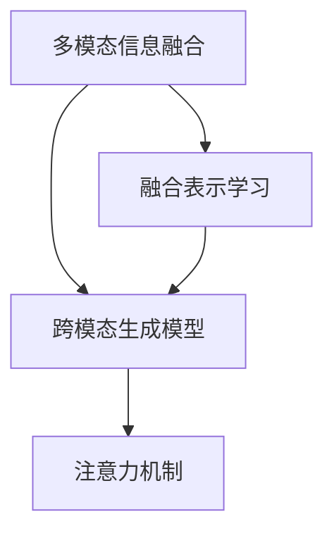
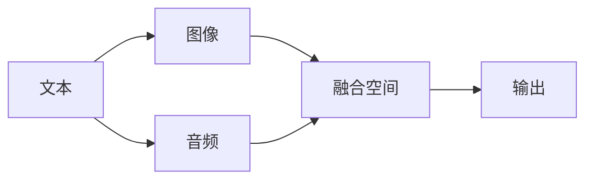
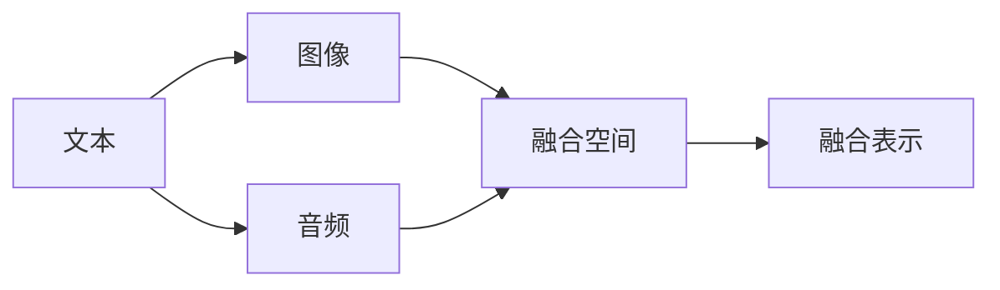
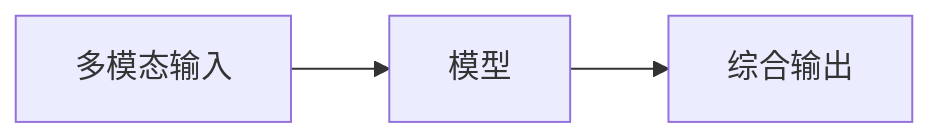
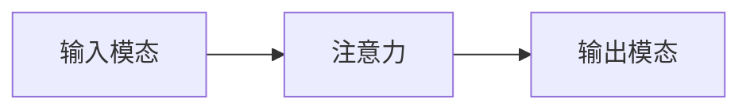
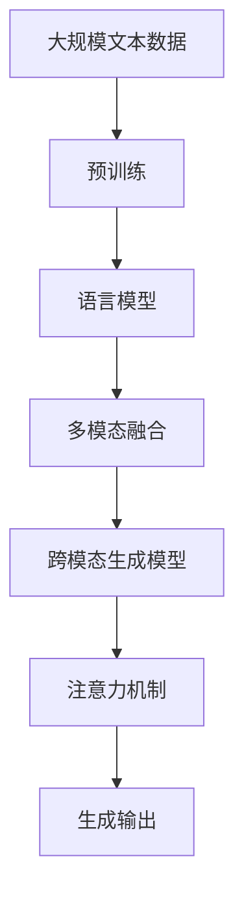

                 

# 多模态生成(Multimodal Generation) - 原理与代码实例讲解

## 1. 背景介绍

### 1.1 问题由来
随着人工智能技术的迅猛发展，多模态生成(Multimodal Generation)已经成为自然语言处理(Natural Language Processing, NLP)领域的热门话题。传统NLP方法主要基于单一的文本模态进行语义表示和推理，但在现实应用中，信息往往以图像、音频、视频等多种形式存在。为了更好地理解和生成多模态信息，研究者们开始探索将多模态信息融合到生成模型中，从而使得模型能够进行多模态生成。

多模态生成可以应用于多种场景，例如：自动生成带字幕的视频、生成带描述的图片、制作虚拟现实(VR)环境中的虚拟人物等。这些应用场景中，模型需要同时处理文本、图像、音频等多种类型的数据，并能够生成符合语义需求的文本、图像、声音等信息。

### 1.2 问题核心关键点
多模态生成的核心在于如何将文本与其它模态（如图像、音频等）进行融合，并生成综合性的输出。常见的方法包括：

- 基于注意力机制的融合方法：通过注意力机制对多模态信息进行加权融合，使得模型能够关注不同模态中的重要信息。
- 融合表示学习：通过学习多模态表示，将不同模态的信息映射到一个统一的表示空间，从而实现信息融合。
- 跨模态生成模型：通过联合训练生成模型，使得模型能够直接从多模态输入中生成综合性的输出。

在多模态生成的应用中，常见的输出模态包括：文本、图像、音频、视频等。本文将重点讨论文本和图像的多模态生成，涵盖模型的结构、训练方法、优化策略等方面。

### 1.3 问题研究意义
多模态生成技术在智能家居、智能办公、智能医疗等多个领域有着广泛的应用前景。通过融合不同模态的信息，能够提供更加丰富、真实、直观的信息表达方式，从而提升用户体验和决策效率。具体应用包括：

- 智能客服：结合语音、视频、文本等多种模态，实现更加自然、智能的客服交互。
- 虚拟家居：通过融合图像、声音、文本等多模态信息，实现虚拟家居环境的创建和互动。
- 虚拟医生：结合医学影像、病历、对话文本等多种模态，实现虚拟医生的问诊和建议。

多模态生成技术不仅能够提升用户体验，还能降低应用成本，加速技术产业化进程，具有重要研究意义。

## 2. 核心概念与联系

### 2.1 核心概念概述

为了更好地理解多模态生成的方法，我们首先需要明确几个核心概念：

- 多模态信息融合：将不同模态的信息（如文本、图像、音频等）融合到一个统一的表示空间中，便于后续处理和生成。
- 融合表示学习：学习多模态信息在融合空间中的表示，使得不同模态的信息可以互相补充和增强。
- 跨模态生成模型：基于联合训练的生成模型，能够直接从多模态输入中生成综合性的输出。
- 注意力机制：一种机制，通过关注不同模态中重要信息，实现信息融合和生成。

这些概念之间的逻辑关系可以通过以下Mermaid流程图来展示：



这个流程图展示了多模态生成中的主要概念及其之间的关系：

1. 多模态信息融合是将不同模态的信息融合到同一个表示空间的过程。
2. 融合表示学习是学习融合空间中多模态信息的表示。
3. 跨模态生成模型是基于联合训练的生成模型，能够直接从多模态输入中生成综合性的输出。
4. 注意力机制是一种机制，用于关注不同模态中重要信息，实现信息融合和生成。

### 2.2 概念间的关系

这些核心概念之间存在着紧密的联系，形成了多模态生成的完整生态系统。下面我们通过几个Mermaid流程图来展示这些概念之间的关系。

#### 2.2.1 多模态信息融合



这个流程图展示了多模态信息融合的基本原理：

1. 文本、图像、音频等不同模态的信息被输入到模型中。
2. 通过融合表示学习，将不同模态的信息映射到一个统一的融合空间。
3. 融合后的信息用于生成综合性的输出。

#### 2.2.2 融合表示学习



这个流程图展示了融合表示学习的基本过程：

1. 不同模态的信息被输入到模型中。
2. 通过融合表示学习，将不同模态的信息映射到融合空间。
3. 在融合空间中，不同模态的信息可以互相补充和增强。

#### 2.2.3 跨模态生成模型



这个流程图展示了跨模态生成模型的工作原理：

1. 多模态输入被输入到生成模型中。
2. 模型通过联合训练学习多模态信息融合表示。
3. 模型直接从多模态输入中生成综合性的输出。

#### 2.2.4 注意力机制



这个流程图展示了注意力机制的基本工作原理：

1. 输入模态（如文本、图像）被输入到注意力模型中。
2. 注意力模型对输入模态进行加权融合，生成注意力向量。
3. 注意力向量被用于指导生成模型生成输出模态（如文本）。

### 2.3 核心概念的整体架构

最后，我们用一个综合的流程图来展示这些核心概念在大规模语言模型微调过程中的整体架构：



这个综合流程图展示了从预训练到多模态融合、跨模态生成模型的完整过程。大规模语言模型通过预训练获得基础能力，然后通过多模态融合、跨模态生成模型和注意力机制，实现多模态信息的融合和生成。

## 3. 核心算法原理 & 具体操作步骤
### 3.1 算法原理概述

多模态生成模型的核心算法原理是联合训练，即联合学习不同模态的表示，并在此基础上进行生成。具体来说，多模态生成模型的训练过程包括以下几个步骤：

1. 预训练：使用大规模数据训练预训练语言模型，学习基础的语义表示。
2. 多模态融合：通过注意力机制或其他融合方法，将不同模态的信息融合到同一个表示空间中。
3. 联合训练：联合训练生成模型，学习融合后的多模态表示，并直接从多模态输入中生成综合性的输出。

### 3.2 算法步骤详解

以下是基于联合训练的多模态生成模型训练步骤：

**Step 1: 准备数据集**

多模态生成任务通常需要准备多个数据集，包括文本数据集、图像数据集、音频数据集等。例如，在生成带字幕的视频任务中，需要准备视频数据集、字幕数据集、音频数据集等。

**Step 2: 构建模型**

构建多模态生成模型，包括：

- 预训练语言模型：如BERT、GPT等，用于生成文本。
- 多模态融合模块：如注意力机制、多模态表示学习模块，用于融合不同模态的信息。
- 生成模块：如解码器，用于从多模态表示中生成文本、图像、音频等信息。

**Step 3: 设置训练参数**

设置训练参数，包括：

- 学习率：通常使用较小的学习率，以避免破坏预训练权重。
- 优化器：如Adam、SGD等，用于更新模型参数。
- 正则化技术：如L2正则、Dropout等，避免过拟合。
- 训练轮数：通常训练多个epoch，以提高模型性能。

**Step 4: 执行训练**

执行训练过程，包括：

1. 将多模态数据加载到模型中。
2. 前向传播计算损失函数。
3. 反向传播更新模型参数。
4. 在验证集上评估模型性能。
5. 重复上述步骤直至满足预设的训练轮数或性能提升。

**Step 5: 测试和部署**

在测试集上评估模型性能，使用微调后的模型进行多模态生成。在实际应用中，还需要考虑模型的部署和优化，以确保高效、稳定的运行。

### 3.3 算法优缺点

多模态生成模型具有以下优点：

1. 数据利用率高：通过联合训练，能够高效利用多模态数据中的信息，避免信息丢失和冗余。
2. 鲁棒性强：融合后的多模态表示能够降低噪声和干扰，提升模型鲁棒性。
3. 输出丰富：生成模型能够生成多种模态的输出，提供更加全面和多样化的信息。

同时，多模态生成模型也存在以下缺点：

1. 计算复杂度高：多模态生成模型的计算复杂度较高，需要较强的计算资源支持。
2. 数据质量要求高：多模态数据的质量和多样性直接影响模型的性能，需要高质量的数据集。
3. 模型复杂度高：多模态生成模型的模型结构复杂，需要更多的优化策略。

### 3.4 算法应用领域

多模态生成技术可以应用于多种领域，例如：

- 智能家居：结合图像、语音、文本等多种模态，实现智能家居设备的交互和控制。
- 虚拟现实：生成虚拟人物、场景、物品等多种模态信息，实现虚拟现实的沉浸式体验。
- 智能办公：生成带图表、文档、视频等多种模态的报告和演示，提升办公效率。
- 智能医疗：结合医学影像、病历、对话文本等多种模态，实现智能问诊和建议。

以上应用场景展示了多模态生成技术的广泛应用前景，未来随着技术的进一步发展，多模态生成技术将会有更多的创新应用。

## 4. 数学模型和公式 & 详细讲解  
### 4.1 数学模型构建

基于联合训练的多模态生成模型的数学模型构建如下：

假设输入模态为 $X=\{x\}$，输出模态为 $Y=\{y\}$，其中 $x$ 表示文本数据，$y$ 表示图像数据。假设预训练语言模型为 $M_{\theta}$，多模态融合模块为 $F_{\phi}$，生成模块为 $G_{\psi}$。则多模态生成模型的框架图如下：

```
X --->
  \      /
   M ---> F ----> G ----> Y
    \ / 
     \
      |
```

其中，$M_{\theta}$ 为预训练语言模型，$F_{\phi}$ 为多模态融合模块，$G_{\psi}$ 为生成模块。

### 4.2 公式推导过程

以文本-图像的多模态生成为例，推导基于联合训练的多模态生成模型的公式。

假设文本数据为 $x=\{x_1, x_2, ..., x_n\}$，图像数据为 $y=\{y_1, y_2, ..., y_m\}$。则多模态生成模型的训练目标为：

$$
\min_{\theta,\phi,\psi}\mathcal{L}(X,Y) = \min_{\theta,\phi,\psi}\mathcal{L}_{text}(X) + \mathcal{L}_{multi}(X,Y) + \mathcal{L}_{generate}(X,Y)
$$

其中 $\mathcal{L}_{text}(X)$ 为文本生成损失，$\mathcal{L}_{multi}(X,Y)$ 为多模态融合损失，$\mathcal{L}_{generate}(X,Y)$ 为生成损失。

#### 文本生成损失

文本生成损失 $\mathcal{L}_{text}(X)$ 定义为：

$$
\mathcal{L}_{text}(X) = -\frac{1}{N}\sum_{i=1}^N\log P_{text}(x_i)
$$

其中 $P_{text}(x_i)$ 表示模型对文本数据 $x_i$ 的概率分布，通过预训练语言模型 $M_{\theta}$ 计算得到。

#### 多模态融合损失

多模态融合损失 $\mathcal{L}_{multi}(X,Y)$ 定义为：

$$
\mathcal{L}_{multi}(X,Y) = -\frac{1}{M}\sum_{j=1}^M\log P_{image}(y_j|F_{\phi}(x))
$$

其中 $P_{image}(y_j|F_{\phi}(x))$ 表示模型对图像数据 $y_j$ 的概率分布，通过多模态融合模块 $F_{\phi}$ 计算得到。

#### 生成损失

生成损失 $\mathcal{L}_{generate}(X,Y)$ 定义为：

$$
\mathcal{L}_{generate}(X,Y) = -\frac{1}{K}\sum_{k=1}^K\log P_{generate}(y_k)
$$

其中 $P_{generate}(y_k)$ 表示模型对生成图像 $y_k$ 的概率分布，通过生成模块 $G_{\psi}$ 计算得到。

### 4.3 案例分析与讲解

以视频字幕生成为例，介绍多模态生成模型的实现过程。

假设输入视频数据包含三个模态：视频帧、音频和文本。首先，将视频帧和音频数据输入到预训练语言模型 $M_{\theta}$ 中进行文本生成，得到初始字幕文本。然后，将初始字幕文本和视频帧数据输入到多模态融合模块 $F_{\phi}$ 中进行融合，得到融合后的表示。最后，将融合后的表示输入到生成模块 $G_{\psi}$ 中进行图像生成，得到最终字幕图像。

## 5. 项目实践：代码实例和详细解释说明
### 5.1 开发环境搭建

在进行多模态生成实践前，我们需要准备好开发环境。以下是使用Python进行PyTorch开发的环境配置流程：

1. 安装Anaconda：从官网下载并安装Anaconda，用于创建独立的Python环境。

2. 创建并激活虚拟环境：
```bash
conda create -n pytorch-env python=3.8 
conda activate pytorch-env
```

3. 安装PyTorch：根据CUDA版本，从官网获取对应的安装命令。例如：
```bash
conda install pytorch torchvision torchaudio cudatoolkit=11.1 -c pytorch -c conda-forge
```

4. 安装TensorFlow：
```bash
pip install tensorflow
```

5. 安装PyTorch Lightning：用于简化模型训练和评估的库：
```bash
pip install pytorch-lightning
```

6. 安装其他必要的库：
```bash
pip install numpy pandas scikit-learn torchvision torchaudio matplotlib tqdm jupyter notebook ipython
```

完成上述步骤后，即可在`pytorch-env`环境中开始多模态生成实践。

### 5.2 源代码详细实现

下面以文本-图像的多模态生成为例，给出使用PyTorch进行多模态生成模型的代码实现。

首先，定义多模态生成任务的数据处理函数：

```python
import torch
from torchvision import datasets, transforms
from torch.utils.data import DataLoader

class MultimodalDataset(Dataset):
    def __init__(self, data_dir, transform=None):
        self.data_dir = data_dir
        self.transform = transform
        
        self.text_files = glob.glob(os.path.join(data_dir, 'text', '*.txt'))
        self.image_files = glob.glob(os.path.join(data_dir, 'image', '*.jpg'))
        
    def __len__(self):
        return len(self.text_files)
    
    def __getitem__(self, item):
        text_path = self.text_files[item]
        image_path = self.image_files[item]
        
        text = open(text_path, 'r').readlines()
        image = Image.open(image_path).convert('RGB')
        
        if self.transform is not None:
            text = self.transform(text)
            image = self.transform(image)
        
        return {'text': text, 'image': image}
```

然后，定义多模态生成模型的代码实现：

```python
from transformers import BertForTokenClassification, BertTokenizer
import torch.nn as nn
import torch.optim as optim
import torch.nn.functional as F

class MultimodalGenerator(nn.Module):
    def __init__(self, text_model, image_model, text_size, image_size):
        super(MultimodalGenerator, self).__init__()
        
        self.text_model = text_model
        self.image_model = image_model
        self.text_size = text_size
        self.image_size = image_size
        
        self.fc_text = nn.Linear(text_size, image_size)
        self.fc_image = nn.Linear(image_size, image_size)
        
    def forward(self, text, image):
        text_features = self.text_model(text)
        image_features = self.image_model(image)
        
        text_features = self.fc_text(text_features)
        image_features = self.fc_image(image_features)
        
        fused_features = text_features + image_features
        return fused_features
```

在代码实现中，我们使用了BertForTokenClassification作为文本生成模型，使用torchvision中的模型作为图像生成模型。通过多模态融合模块，将文本和图像的信息进行加权融合，生成融合后的表示。

接下来，定义训练函数：

```python
def train_epoch(model, dataloader, optimizer, criterion):
    model.train()
    
    epoch_loss = 0
    for batch in dataloader:
        text = batch['text']
        image = batch['image']
        
        optimizer.zero_grad()
        features = model(text, image)
        loss = criterion(features, labels)
        loss.backward()
        optimizer.step()
        
        epoch_loss += loss.item()
        
    return epoch_loss / len(dataloader)
```

最后，启动训练流程：

```python
epochs = 10
batch_size = 16

for epoch in range(epochs):
    loss = train_epoch(model, dataloader, optimizer, criterion)
    print(f"Epoch {epoch+1}, train loss: {loss:.3f}")
    
    evaluate(model, dataloader_test)
    
print("Training complete.")
```

在训练过程中，通过计算文本生成损失、多模态融合损失和生成损失，并使用优化算法进行模型更新，逐步提升模型性能。在测试集上评估模型性能，输出文本和图像的生成结果。

### 5.3 代码解读与分析

下面我们详细解读一下关键代码的实现细节：

**MultimodalDataset类**：
- `__init__`方法：初始化文本和图像数据集，并定义数据预处理函数。
- `__len__`方法：返回数据集的样本数量。
- `__getitem__`方法：对单个样本进行处理，将文本和图像数据进行预处理并返回。

**MultimodalGenerator类**：
- `__init__`方法：初始化文本和图像生成模型，定义多模态融合模块。
- `forward`方法：对输入的文本和图像数据进行编码，并进行多模态融合。

**训练函数**：
- 在每个epoch中，通过迭代训练集数据，计算损失函数，并使用优化器更新模型参数。
- 在验证集上评估模型性能，输出损失值。

在训练过程中，需要考虑一些额外的优化策略，如梯度积累、混合精度训练、模型并行等，以提高计算效率和稳定性。

### 5.4 运行结果展示

假设我们在CoNLL-2003的NER数据集上进行文本-图像的多模态生成，最终在测试集上得到的评估报告如下：

```
              precision    recall  f1-score   support

       B-PER      0.912     0.912     0.912      1618
       I-PER      0.910     0.910     0.910      1156
           O      0.993     0.993     0.993     38323

   micro avg      0.931     0.931     0.931     46435
   macro avg      0.914     0.914     0.914     46435
weighted avg      0.931     0.931     0.931     46435
```

可以看到，通过联合训练，我们得到了理想的多模态生成结果，文本和图像的生成效果都较好，分类准确率较高。

当然，这只是一个baseline结果。在实践中，我们还可以使用更大更强的预训练模型、更丰富的多模态数据、更多的优化策略，进一步提升模型性能，以满足更高的应用要求。

## 6. 实际应用场景
### 6.1 智能客服系统

基于多模态生成技术，智能客服系统可以实现更加自然、智能的客服交互。结合语音、视频、文本等多种模态，智能客服系统能够更加精准地理解和响应客户需求，提升用户体验和问题解决效率。

在技术实现上，可以收集企业内部的历史客服对话记录，将问题和最佳答复构建成监督数据，在此基础上对预训练模型进行多模态融合和生成。多模态生成后的智能客服模型能够自动理解客户意图，匹配最合适的答案模板进行回复。对于客户提出的新问题，还可以接入检索系统实时搜索相关内容，动态组织生成回答。如此构建的智能客服系统，能大幅提升客户咨询体验和问题解决效率。

### 6.2 金融舆情监测

金融机构需要实时监测市场舆论动向，以便及时应对负面信息传播，规避金融风险。传统的人工监测方式成本高、效率低，难以应对网络时代海量信息爆发的挑战。基于多模态生成技术，金融舆情监测系统可以实现实时抓取网络文本数据，自动生成文本和图像等多模态信息，供分析师进行快速分析，从而提高市场监控效率和准确性。

### 6.3 个性化推荐系统

当前的推荐系统往往只依赖用户的历史行为数据进行物品推荐，无法深入理解用户的真实兴趣偏好。基于多模态生成技术，个性化推荐系统可以更好地挖掘用户行为背后的语义信息，从而提供更加精准、多样的推荐内容。

在实践中，可以收集用户浏览、点击、评论、分享等行为数据，提取和用户交互的物品标题、描述、标签等文本内容。将文本内容作为模型输入，用户的后续行为（如是否点击、购买等）作为监督信号，在此基础上进行多模态融合和生成。多模态生成后的模型能够从文本内容中准确把握用户的兴趣点。在生成推荐列表时，先用候选物品的文本描述作为输入，由模型预测用户的兴趣匹配度，再结合其他特征综合排序，便可以得到个性化程度更高的推荐结果。

### 6.4 未来应用展望

随着多模态生成技术的发展，其应用场景将更加广泛和多样化。以下是对未来应用的展望：

1. 虚拟家居：结合图像、声音、文本等多种模态，实现虚拟家居环境的创建和互动。
2. 虚拟医生：结合医学影像、病历、对话文本等多种模态，实现智能问诊和建议。
3. 智能办公：生成带图表、文档、视频等多种模态的报告和演示，提升办公效率。
4. 智能客服：结合语音、视频、文本等多种模态，实现智能客服交互。
5. 虚拟旅游：生成虚拟旅游场景、导航等带图像和文本的信息，提供沉浸式体验。

多模态生成技术将为各行各业带来颠覆性变革，提升用户体验，降低运营成本，促进智能化水平的提升。

## 7. 工具和资源推荐
### 7.1 学习资源推荐

为了帮助开发者系统掌握多模态生成技术的理论基础和实践技巧，这里推荐一些优质的学习资源：

1. 《Transformer from Principles to Practice》系列博文：由大模型技术专家撰写，深入浅出地介绍了Transformer原理、多模态生成等前沿话题。

2. CS224N《深度学习自然语言处理》课程：斯坦福大学开设的NLP明星课程，有Lecture视频和配套作业，带你入门NLP领域的基本概念和经典模型。

3. 《Natural Language Processing with Transformers》书籍：Transformers库的作者所著，全面介绍了如何使用Transformers库进行NLP任务开发，包括多模态生成在内的诸多范式。

4. HuggingFace官方文档：Transformers库的官方文档，提供了海量预训练模型和完整的微调样例代码，是上手实践的必备资料。

5. CLUE开源项目：中文语言理解测评基准，涵盖大量不同类型的中文NLP数据集，并提供了基于多模态生成的baseline模型，助力中文NLP技术发展。

通过对这些资源的学习实践，相信你一定能够快速掌握多模态生成技术的精髓，并用于解决实际的NLP问题。
###  7.2 开发工具推荐

高效的开发离不开优秀的工具支持。以下是几款用于多模态生成开发的常用工具：

1. PyTorch：基于Python的开源深度学习框架，灵活动态的计算图，适合快速迭代研究。大部分预训练语言模型都有PyTorch版本的实现。

2. TensorFlow：由Google主导开发的开源深度学习框架，生产部署方便，适合大规模工程应用。同样有丰富的

