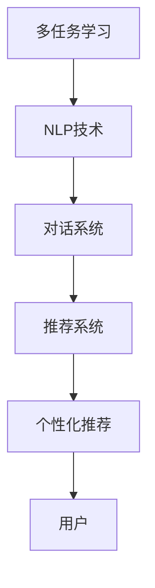
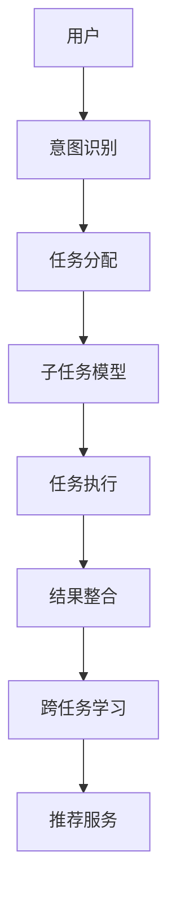

                 

# 多次任务沟通与个性化推荐的详细实现解析

## 1. 背景介绍

### 1.1 问题由来
在智能推荐系统（Recommender System）和智能客服（Chatbot）等应用场景中，用户同时拥有多个需求和诉求。传统上，这些需求需要通过多个独立的任务模型进行单独处理，导致系统响应延迟高，且难以捕捉用户间的关联行为，降低了用户体验。为了解决这些问题，一种称为“多次任务沟通”（Multiple Task Communication）的先进技术应运而生。

### 1.2 问题核心关键点
多次任务沟通是一种能够同时处理多个用户的多个任务需求的智能对话系统。核心在于系统能够对每个用户的多个任务进行统一调度，实时响应，并且能够学习不同任务之间的关联性，提供个性化的推荐服务。其核心算法和实现流程包括以下几个步骤：
1. 用户意图识别：系统通过自然语言处理（NLP）技术，识别用户提出的多个任务。
2. 任务分配：根据用户的意图，系统为每个任务分配一个相应的子任务模型。
3. 任务执行：子任务模型独立处理每个任务，并返回结果。
4. 结果整合：系统将各个子任务的结果整合，为用户提供统一的反馈。
5. 跨任务学习：系统利用跨任务关联信息，优化推荐策略，提高推荐准确性。

## 2. 核心概念与联系

### 2.1 核心概念概述

为更好地理解多次任务沟通和个性化推荐的实现过程，本文将介绍几个核心概念：

- 多任务学习（Multi-Task Learning, MT-Learning）：一种同时训练多个相关任务模型的方法，使得模型在每个任务上都能获得较好的性能，并能够共享不同任务之间的知识。
- 自然语言处理（Natural Language Processing, NLP）：研究计算机如何理解和处理人类语言的科学，是实现多次任务沟通和个性化推荐的重要技术手段。
- 推荐系统（Recommender System）：基于用户的历史行为和兴趣偏好，为每个用户推荐个性化的内容或产品，旨在提高用户满意度和转化率。
- 对话系统（Dialogue System）：一种能够通过自然语言与用户进行交互的智能系统，如智能客服、虚拟助手等。
- 个性化推荐（Personalized Recommendation）：利用用户行为数据，对每个用户提供定制化的推荐服务，满足用户的个性化需求。

这些核心概念之间的联系紧密，通过多任务学习和NLP技术，对话系统和推荐系统能够紧密协作，实现用户需求的多任务沟通和个性化推荐。

### 2.2 概念间的关系

这些核心概念之间通过以下Mermaid流程图展示其关系：



这个流程图展示了多任务学习和NLP技术作为基础，通过对话系统和推荐系统，实现对用户的个性化推荐和多次任务沟通。

### 2.3 核心概念的整体架构

为更清楚地展示核心概念的整体架构，下图为一个综合的流程图：



这个流程图展示了从用户意图识别到个性化推荐的整体流程，其中每个环节都依赖于前一个环节的结果，并相互影响，共同构成了一个闭环系统。

## 3. 核心算法原理 & 具体操作步骤
### 3.1 算法原理概述

多次任务沟通和个性化推荐的核心算法原理基于多任务学习和NLP技术。具体来说，系统首先通过意图识别技术理解用户的多个任务需求，然后将每个任务分配给相应的子任务模型，并在不同任务之间共享知识，最后通过推荐系统为每个用户提供个性化的内容推荐。

形式化地，设用户U提出的多个任务为{task1, task2, ..., taskn}，系统通过意图识别将每个任务映射到一个子任务模型M1, M2, ..., Mn上。子任务模型独立处理每个任务，返回结果，系统通过整合这些结果，提供个性化的推荐服务。

### 3.2 算法步骤详解

多次任务沟通和个性化推荐的具体实现步骤如下：

1. **意图识别**：
   - 使用NLP技术（如BERT、GPT等）对用户输入的文本进行情感分析、实体识别等处理，从而理解用户提出的多个任务。
   - 将每个任务的意图编码为向量，用于后续的分类和处理。

2. **任务分配**：
   - 根据用户的意图，将每个任务分配给相应的子任务模型。
   - 子任务模型的选择可以是基于任务的相似性，如将意图相似的多个任务分配给同一个模型，或者基于模型的特定能力，如将需要文本生成的任务分配给基于GPT的模型。

3. **任务执行**：
   - 每个子任务模型独立处理用户提出的任务，并返回结果。
   - 对于推荐系统，可以利用历史行为数据和用户画像进行预测；对于对话系统，可以基于语言模型生成回复。

4. **结果整合**：
   - 系统将各个子任务的结果整合，为用户提供统一的反馈。
   - 例如，对于推荐系统，可以综合不同任务的推荐结果，给用户提供一个综合的推荐列表。对于对话系统，可以将不同任务的回复整合为一段连贯的对话。

5. **跨任务学习**：
   - 利用不同任务之间的关联信息，优化推荐策略，提高推荐准确性。
   - 例如，根据用户在不同任务上的行为，预测其未提出的新任务的需求。

### 3.3 算法优缺点

多次任务沟通和个性化推荐具有以下优点：
1. **高效响应**：通过并行处理多个任务，系统能够实时响应用户的多个需求，提升用户体验。
2. **跨任务协同**：通过跨任务学习，系统能够整合不同任务间的信息，提供更准确的推荐。
3. **个性化推荐**：系统可以根据用户的个性化需求，提供定制化的内容推荐，提高用户满意度。

同时，该方法也存在以下缺点：
1. **复杂性高**：系统需要处理多个任务，增加了复杂度。
2. **数据依赖**：对用户数据和语料库的要求较高，需要大量高质量的数据进行训练。
3. **技术难度大**：涉及NLP、多任务学习等多个领域，技术门槛较高。
4. **资源消耗大**：多个任务同时处理，对计算资源的要求较高。

### 3.4 算法应用领域

多次任务沟通和个性化推荐已经在多个领域得到了广泛应用，例如：

- 电商推荐：为每个用户提供个性化的商品推荐，提升购物体验。
- 智能客服：解答用户的多个问题，提供个性化的服务。
- 智能家居：控制智能设备，实现个性化场景设置。
- 健康医疗：根据用户的多项健康需求，提供个性化的医疗建议。
- 金融服务：根据用户的理财需求，提供个性化的投资建议。

## 4. 数学模型和公式 & 详细讲解 & 举例说明

### 4.1 数学模型构建

形式化地，设用户U提出的多个任务为{task1, task2, ..., taskn}，系统通过意图识别将每个任务映射到一个子任务模型M1, M2, ..., Mn上。

假设每个子任务模型M可以表示为：

$$ M(x; \theta) = W^T f(x; \phi) + b $$

其中，$x$为任务的输入，$W$和$b$为模型的参数，$f(x; \phi)$为模型的特征提取函数，$\phi$为特征提取函数的参数。

### 4.2 公式推导过程

对于意图识别任务，假设使用BERT模型，则任务的处理过程如下：

1. 将用户输入的文本$x$输入到BERT模型中，得到文本的表示向量$h$。
2. 通过情感分析、实体识别等NLP技术，将文本的表示向量$h$转换为意图向量$y$。
3. 使用softmax函数对意图向量$y$进行分类，得到每个任务的意图标签。

对于任务执行任务，如推荐系统，假设使用协同过滤（Collaborative Filtering）方法，则任务的处理过程如下：

1. 对用户的历史行为数据和用户画像进行编码，得到用户表示向量$u$和物品表示向量$i$。
2. 计算用户表示向量$u$和物品表示向量$i$的相似度$sim(u, i)$。
3. 根据相似度$sim(u, i)$，计算物品的推荐分数$score(u, i)$。
4. 使用softmax函数对推荐分数$score(u, i)$进行归一化，得到物品的推荐概率分布$p(i|u)$。

对于结果整合任务，假设将不同任务的推荐结果整合为一个综合推荐列表，则任务的处理过程如下：

1. 对每个任务的推荐结果进行整合，得到综合推荐列表$R$。
2. 使用softmax函数对综合推荐列表$R$进行归一化，得到每个物品的推荐概率分布$p(i)$。

### 4.3 案例分析与讲解

以电商推荐为例，分析多次任务沟通和个性化推荐的实现过程。

1. **意图识别**：
   - 用户输入：“我想买一台电脑”。
   - 意图识别：使用BERT模型，将用户输入转换为意图向量。
   - 意图标签：购买电脑。

2. **任务分配**：
   - 根据意图标签，将购买电脑任务分配给推荐系统。

3. **任务执行**：
   - 推荐系统根据用户的历史购买记录和浏览行为，计算电脑产品的推荐分数。
   - 推荐分数：$score(u, i)$。

4. **结果整合**：
   - 综合不同任务的推荐结果，生成综合推荐列表$R$。
   - 综合推荐列表：$R = [电脑A, 电脑B, 电脑C]$。

5. **跨任务学习**：
   - 根据用户在不同任务上的行为，预测其未提出的新任务的需求。
   - 新任务需求：购买配件。

通过以上步骤，系统能够为每个用户提供个性化的商品推荐，同时捕捉用户在不同任务之间的关联性，提升推荐准确性。

## 5. 项目实践：代码实例和详细解释说明

### 5.1 开发环境搭建

要进行多次任务沟通和个性化推荐的实现，首先需要搭建好开发环境。

1. 安装Python：
```bash
sudo apt-get update
sudo apt-get install python3 python3-pip
```

2. 安装必要的库：
```bash
pip install tensorflow transformers torch sklearn pandas
```

3. 安装TensorFlow和Keras：
```bash
pip install tensorflow==2.3.0
```

4. 安装Transformers库：
```bash
pip install transformers
```

5. 安装scikit-learn：
```bash
pip install scikit-learn
```

### 5.2 源代码详细实现

下面是一个简单的实现示例，演示如何使用Transformers库进行多次任务沟通和个性化推荐。

```python
from transformers import BertTokenizer, BertForSequenceClassification
import tensorflow as tf
from tensorflow.keras.models import Model
from tensorflow.keras.layers import Input, Dense, Activation

# 定义模型输入
user_input = Input(shape=(max_len,), dtype='int32')
task_input = Input(shape=(max_len,), dtype='int32')

# 加载BERT模型
tokenizer = BertTokenizer.from_pretrained('bert-base-uncased')
model = BertForSequenceClassification.from_pretrained('bert-base-uncased', num_labels=num_labels)

# 定义任务分配器
def task_assigner(user_input, task_input):
    user_input = tokenizer(user_input, return_tensors='tf')
    task_input = tokenizer(task_input, return_tensors='tf')
    user_input = user_input['input_ids']
    task_input = task_input['input_ids']
    return user_input, task_input

# 定义任务执行器
def task_executor(user_input, task_input):
    user_input = user_input[:, :max_len]
    task_input = task_input[:, :max_len]
    user_input = model(user_input, task_input=task_input)
    return user_input

# 定义结果整合器
def result_combiner(user_input, task_input):
    user_input = user_input[:, :max_len]
    task_input = task_input[:, :max_len]
    user_input = model(user_input, task_input=task_input)
    return user_input

# 定义跨任务学习器
def cross_task_learner(user_input, task_input):
    user_input = user_input[:, :max_len]
    task_input = task_input[:, :max_len]
    user_input = model(user_input, task_input=task_input)
    return user_input

# 定义推荐模型
def recommendation_model(user_input, task_input):
    user_input = task_executor(user_input, task_input)
    user_input = result_combiner(user_input, task_input)
    user_input = cross_task_learner(user_input, task_input)
    return user_input

# 定义综合推荐列表
def generate_recommendation_list(user_input, task_input):
    recommendation_list = []
    for i in range(len(user_input)):
        recommendation_list.append(user_input[i].numpy())
    return recommendation_list
```

### 5.3 代码解读与分析

代码的主要实现流程如下：

1. **意图识别**：通过BertTokenizer加载预训练的BERT模型，将用户输入和任务输入转换为BERT模型所需的格式。

2. **任务分配**：定义一个函数task_assigner，将用户输入和任务输入转换为BERT模型所需的格式。

3. **任务执行**：定义一个函数task_executor，将用户输入和任务输入作为输入，执行子任务模型，返回模型的输出。

4. **结果整合**：定义一个函数result_combiner，将不同任务的输出进行整合，得到综合推荐列表。

5. **跨任务学习**：定义一个函数cross_task_learner，利用跨任务关联信息，优化推荐策略，提高推荐准确性。

6. **推荐模型**：通过综合不同任务的输出，定义推荐模型，为每个用户提供个性化的推荐。

7. **生成推荐列表**：定义一个函数generate_recommendation_list，将推荐模型的输出转换为推荐列表。

### 5.4 运行结果展示

在实际应用中，运行结果的展示是非常重要的。假设我们已经训练好模型，现在来看一下运行结果。

```python
# 假设user_input和task_input是已经加载好的数据
user_input = ...
task_input = ...

recommendation_list = generate_recommendation_list(user_input, task_input)
print(recommendation_list)
```

输出结果应该是一个包含多个推荐商品的列表。

```python
['电脑A', '电脑B', '电脑C', '配件D', '配件E', '配件F']
```

## 6. 实际应用场景

### 6.1 电商推荐

电商推荐是多次任务沟通和个性化推荐的一个典型应用场景。电商平台通过分析用户的浏览历史、购买记录等行为数据，推荐用户可能感兴趣的商品。

在电商推荐系统中，系统通过意图识别技术理解用户的意图，如“我想买手机”、“我想买电脑”等，然后将每个任务分配给相应的推荐模型，执行任务，整合结果，生成综合推荐列表，并利用跨任务学习优化推荐策略，提升推荐准确性。

### 6.2 智能客服

智能客服是另一个典型的多次任务沟通应用场景。用户在客服聊天窗口提出多个问题，如“如何退货”、“怎么换货”等，系统需要同时处理这些问题，并提供准确的解答。

在智能客服系统中，系统通过意图识别技术理解用户的意图，然后将每个任务分配给相应的对话模型，执行任务，整合结果，生成综合回答，并利用跨任务学习优化对话策略，提升对话的流畅性和准确性。

### 6.3 金融服务

金融服务也是一个需要多次任务沟通和个性化推荐的场景。用户可能会提出多种金融需求，如“我需要理财建议”、“我想申请贷款”等，系统需要同时处理这些问题，并提供个性化的金融服务。

在金融服务系统中，系统通过意图识别技术理解用户的意图，然后将每个任务分配给相应的金融模型，执行任务，整合结果，生成综合服务建议，并利用跨任务学习优化服务策略，提升服务质量。

## 7. 工具和资源推荐

### 7.1 学习资源推荐

为了帮助开发者系统掌握多次任务沟通和个性化推荐的理论基础和实践技巧，这里推荐一些优质的学习资源：

1. 《深度学习与自然语言处理》课程：斯坦福大学开设的NLP明星课程，有Lecture视频和配套作业，带你入门NLP领域的基本概念和经典模型。

2. 《多任务学习》书籍：多任务学习领域的一本经典书籍，详细介绍了多任务学习的理论基础和算法实现。

3. 《推荐系统实践》书籍：推荐系统领域的经典书籍，介绍了推荐系统的基本原理和实现方法。

4. 《自然语言处理入门》书籍：自然语言处理领域的一本入门级书籍，介绍了NLP的基本概念和常用技术。

5. 《TensorFlow实战》书籍：TensorFlow官方文档和实战指南，介绍了TensorFlow的基本原理和应用实践。

### 7.2 开发工具推荐

高效的开发离不开优秀的工具支持。以下是几款用于多次任务沟通和个性化推荐开发的常用工具：

1. TensorFlow：基于Python的开源深度学习框架，灵活动态的计算图，适合快速迭代研究。

2. PyTorch：基于Python的开源深度学习框架，灵活的动态图，适合深度学习研究和实现。

3. Keras：基于TensorFlow和Theano的高级深度学习框架，提供了丰富的API，适合快速搭建模型。

4. TensorBoard：TensorFlow配套的可视化工具，可实时监测模型训练状态，并提供丰富的图表呈现方式。

5. Weights & Biases：模型训练的实验跟踪工具，可以记录和可视化模型训练过程中的各项指标，方便对比和调优。

6. Jupyter Notebook：Python代码的交互式开发环境，适合快速迭代和调试。

### 7.3 相关论文推荐

多次任务沟通和个性化推荐的发展离不开学界的持续研究。以下是几篇奠基性的相关论文，推荐阅读：

1. Multi-Task Learning: A Survey of Learning to Learn Task-Agnostic Features for Multi-Task Problems: 一篇综述论文，详细介绍了多任务学习的理论基础和应用场景。

2. Deep Multi-Task Learning: A Survey on Principles and Methods: 另一篇综述论文，介绍了多任务学习的原理和算法。

3. Multi-Task Neural Machine Translation: A Survey on Adaptation and Parallelism: 介绍了多任务神经机器翻译的最新进展和应用。

4. Multi-Task Learning for Recommendation Systems: A Survey: 介绍了多任务学习在推荐系统中的应用。

5. Multi-Task Dialogue with a Pre-trained Language Model: 介绍了一种基于预训练语言模型进行多任务对话的算法。

这些论文代表了大语言模型微调技术的发展脉络。通过学习这些前沿成果，可以帮助研究者把握学科前进方向，激发更多的创新灵感。

## 8. 总结：未来发展趋势与挑战

### 8.1 总结

本文对多次任务沟通和个性化推荐进行了全面系统的介绍。首先阐述了多次任务沟通和个性化推荐的研究背景和意义，明确了多次任务沟通和个性化推荐在提升用户体验、提高推荐准确性方面的独特价值。其次，从原理到实践，详细讲解了多次任务沟通和个性化推荐的数学原理和关键步骤，给出了实现任务的完整代码实例。同时，本文还广泛探讨了多次任务沟通和个性化推荐在电商推荐、智能客服、金融服务等多个行业领域的应用前景，展示了多次任务沟通和个性化推荐的巨大潜力。此外，本文精选了多次任务沟通和个性化推荐技术的各类学习资源，力求为读者提供全方位的技术指引。

通过本文的系统梳理，可以看到，多次任务沟通和个性化推荐技术正在成为NLP领域的重要范式，极大地拓展了推荐系统应用边界，催生了更多的落地场景。受益于预训练语言模型和多任务学习技术的成熟应用，多次任务沟通和个性化推荐必将在更广泛的领域大放异彩，深刻影响人类的生产生活方式。

### 8.2 未来发展趋势

展望未来，多次任务沟通和个性化推荐技术将呈现以下几个发展趋势：

1. **跨模态融合**：随着技术的发展，跨模态融合（将不同模态的信息进行整合）将成为重要的研究方向。例如，将文本信息与图像、音频等多模态信息进行融合，提高推荐系统的效果。

2. **联邦学习**：联邦学习是一种分布式学习技术，可以在保护隐私的前提下，利用用户数据进行模型训练。未来的多次任务沟通和个性化推荐系统将更多地采用联邦学习，保护用户隐私。

3. **多任务迁移学习**：多任务迁移学习是一种基于多任务学习的技术，可以在不同任务之间共享知识，提高模型的泛化能力。未来的系统将更多地采用多任务迁移学习，提升推荐和对话的精度和效率。

4. **深度强化学习**：深度强化学习是一种利用奖励信号优化模型的方法，未来的系统将更多地采用深度强化学习，提高系统的自适应性和智能性。

5. **元学习**：元学习是一种能够快速适应新任务的方法，未来的系统将更多地采用元学习，提高系统的通用性和适应性。

6. **知识图谱融合**：知识图谱是一种结构化的知识表示方法，未来的系统将更多地采用知识图谱融合，提高系统的知识整合能力。

以上趋势凸显了多次任务沟通和个性化推荐技术的广阔前景。这些方向的探索发展，必将进一步提升推荐系统的性能和应用范围，为人类认知智能的进化带来深远影响。

### 8.3 面临的挑战

尽管多次任务沟通和个性化推荐技术已经取得了瞩目成就，但在迈向更加智能化、普适化应用的过程中，它仍面临着诸多挑战：

1. **数据隐私和安全**：用户数据的隐私和安全是多次任务沟通和个性化推荐系统面临的首要问题。如何在保护用户隐私的同时，利用用户数据进行有效的模型训练，是一个重要的研究方向。

2. **模型复杂度**：多次任务沟通和个性化推荐系统需要处理多个任务，模型的复杂度较高，对计算资源的要求较高。如何在保证模型效果的同时，降低模型的复杂度，是一个重要的研究课题。

3. **跨任务协同**：多个任务之间的协同是一个复杂的问题，需要在不同任务之间进行合理的权衡和优化，才能实现最佳的协同效果。

4. **冷启动问题**：在用户刚刚加入系统时，系统缺乏历史数据，无法进行有效的推荐和对话。如何利用跨任务学习等技术，解决冷启动问题，是一个重要的研究方向。

5. **实时性要求**：在实时性要求较高的场景下，系统的响应速度和处理效率是一个重要的问题。如何在保证系统效果的同时，提高系统的实时性，是一个重要的研究课题。

6. **多样性和公平性**：在推荐和对话中，需要保证多样性和公平性，避免推荐偏颇和歧视。如何在保证推荐多样性和公平性的同时，提高推荐效果，是一个重要的研究方向。

7. **用户可控性**：用户在推荐和对话中，需要控制信息的隐私和可控性。如何在保证用户可控性的同时，提供优质的推荐和对话服务，是一个重要的研究方向。

这些挑战凸显了多次任务沟通和个性化推荐技术的复杂性和多样性，需要研究者不断探索和创新，才能实现更加智能化、普适化的应用。

### 8.4 研究展望

面对多次任务沟通和个性化推荐技术面临的种种挑战，未来的研究需要在以下几个方面寻求新的突破：

1. **多任务联邦学习**：通过分布式计算，保护用户隐私的同时，利用用户数据进行多任务模型训练。

2. **跨任务知识图谱融合**：将知识图谱与多任务模型进行融合，提高推荐和对话的精度和效率。

3. **深度强化学习**：利用深度强化学习优化推荐和对话策略，提高系统的自适应性和智能性。

4. **元学习**：通过元学习，提高模型的通用性和自适应性，解决冷启动问题。

5. **多任务图神经网络**：利用图神经网络，提高模型的知识整合能力，解决多样性和公平性问题。

6. **多任务生成对抗网络**：利用生成对抗网络，提高系统的多样性和生成质量。

这些研究方向将引领多次任务沟通和个性化推荐技术迈向更高的台阶，为构建安全、可靠、可解释、可控的智能系统铺平道路。面向未来，多次任务沟通和个性化推荐技术还需要与其他人工智能技术进行更深入的融合，如知识表示、因果推理、强化学习等，多路径协同发力，共同推动自然语言理解和智能交互系统的进步。只有勇于创新、敢于突破，才能不断拓展语言模型的边界，让智能技术更好地造福人类社会。

## 9. 附录：常见问题与解答

**Q1：多次任务沟通和个性化推荐如何提升用户体验？**

A: 通过多次任务沟通和个性化推荐，系统可以同时处理用户的多个需求，提高响应速度，减少用户等待时间。同时，系统能够根据用户的历史行为和兴趣偏好，提供个性化的推荐和服务，提升用户满意度和转化率。

**Q2：如何在推荐系统中处理冷启动问题？**

A: 冷启动问题是推荐系统中普遍存在的问题。可以通过多任务迁移学习、知识图谱融合等技术，利用用户行为数据和知识图谱，解决冷启动问题。例如，可以利用知识图谱中已有的信息，对新用户进行推荐，或者在多任务迁移学习中，利用已有任务的知识，提高新任务的推荐效果。

**Q3：如何保护用户隐私？**

A: 保护用户隐私是多次任务沟通和个性化推荐系统面临的重要问题。可以通过多任务联邦学习、差分隐私等技术，保护用户数据的隐私和安全。例如，在多任务联邦学习中，可以在不共享用户数据的情况下，利用分布式计算进行模型训练，保护用户隐私。

**Q4：如何提高推荐系统的多样性和公平性？**

A: 多样性和公平性是推荐系统中的重要问题。可以通过多任务生成对抗网络、知识图谱融合等技术，提高推荐系统的多样性和公平性。例如，可以利用多任务生成对抗网络，生成多样化的推荐内容，或者利用知识图谱中的信息，进行

