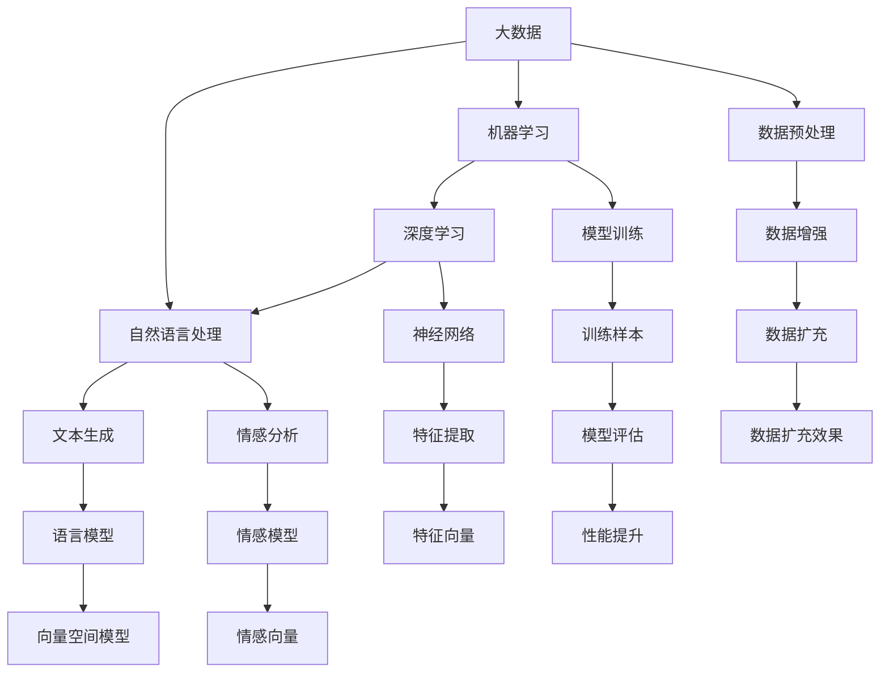
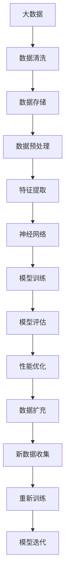

                 

## 1. 背景介绍

### 1.1 问题由来
人工智能（AI）领域近年来迎来了爆发式的增长，其中机器学习（Machine Learning）、深度学习（Deep Learning）和自然语言处理（Natural Language Processing, NLP）等技术在各个领域取得了显著成效。然而，要构建高性能的AI系统，单靠数据是不够的，还需要大量的计算资源和复杂的算法模型。随着大数据时代的到来，数据量呈指数级增长，为AI的快速发展提供了新的机遇和挑战。

### 1.2 问题核心关键点
1. **数据质量与多样性**：数据的多样性和质量直接影响AI模型的性能，特别是对于复杂的分类、预测和生成任务。
2. **数据量与规模**：大数据为AI模型提供了更多的训练样本，使其能够更好地泛化。
3. **数据处理与存储**：如何高效处理和存储海量数据，是大数据背景下AI学习的重要考量。
4. **计算资源与硬件**：需要高性能的计算平台和算法，以处理大数据集和复杂的模型训练。
5. **数据隐私与安全**：在大数据时代，数据隐私和安全问题日益凸显，必须建立有效的机制来保护用户数据。

### 1.3 问题研究意义
大数据对AI学习的重要性体现在以下几个方面：
1. **提高模型泛化能力**：大数据能够提供更多的训练样本，使得AI模型能够更好地泛化，避免过拟合。
2. **推动算法创新**：大量的数据为新的算法和模型提供了实验的土壤，推动了AI技术的发展。
3. **促进技术落地**：大数据的存储和处理技术为AI技术的产业化提供了基础。
4. **解决实际问题**：通过大数据的挖掘和分析，AI技术能够解决实际生产生活中的复杂问题。

## 2. 核心概念与联系

### 2.1 核心概念概述

- **大数据**：指数据量巨大（通常超过10TB）、结构复杂、处理速度快、价值密度较低的数据集合。
- **人工智能**：通过算法和模型，使计算机系统能够模拟人类智能，实现自主学习、推理和决策。
- **机器学习**：利用数据训练模型，使其能够自动地改进性能，无需进行显式编程。
- **深度学习**：一种特殊的机器学习技术，利用多层神经网络进行模式识别和预测。
- **自然语言处理**：使计算机能够理解和处理自然语言，包括文本生成、情感分析、语音识别等。

这些概念之间存在紧密联系，它们共同构成了AI学习的基础框架。大数据为AI学习提供了数据源，机器学习和深度学习通过算法优化数据，自然语言处理则利用语言模型和表示技术，实现了对自然语言的理解和生成。

### 2.2 概念间的关系

这些概念之间的关系可以通过以下Mermaid流程图来展示：



这个流程图展示了大数据在AI学习中的核心作用，以及从数据预处理到模型训练，再到结果评估的全流程。大数据通过预处理和增强，为机器学习和深度学习提供了充足的训练样本，进而使得自然语言处理等任务能够高效地进行。

### 2.3 核心概念的整体架构

最后，我们用一个综合的流程图来展示这些核心概念在大数据背景下的整体架构：



这个综合流程图展示了从数据收集、预处理、特征提取到模型训练和迭代的完整流程，揭示了大数据在大AI学习中的关键作用。

## 3. 核心算法原理 & 具体操作步骤

### 3.1 算法原理概述

基于大数据的AI学习，核心在于利用数据驱动的模型训练和优化。其基本流程如下：
1. **数据收集与预处理**：从多个来源收集数据，并进行清洗、归一化和特征提取。
2. **模型训练**：利用机器学习或深度学习算法，对预处理后的数据进行训练，学习到数据的内在规律。
3. **模型评估与优化**：通过测试集对模型进行评估，发现模型的不足，并进行参数调整和算法优化。
4. **模型部署与应用**：将训练好的模型部署到实际应用场景中，进行推理和预测。

### 3.2 算法步骤详解

以下是大数据背景下AI学习的具体算法步骤：

**Step 1: 数据收集与预处理**
- 从不同来源收集数据，如社交媒体、传感器、互联网日志等。
- 对数据进行清洗，去除噪声和异常值，确保数据质量。
- 进行数据归一化和标准化，使得不同来源的数据具有相同的规模和分布。
- 进行特征提取，将原始数据转换为模型能够处理的向量形式。

**Step 2: 模型训练**
- 选择合适的机器学习或深度学习算法，如线性回归、决策树、支持向量机、神经网络等。
- 将预处理后的数据划分为训练集和测试集，确保模型在未知数据上的泛化能力。
- 使用梯度下降等优化算法，对模型参数进行迭代更新，最小化损失函数。
- 在训练过程中，使用交叉验证和早停等技术，防止过拟合。

**Step 3: 模型评估与优化**
- 使用测试集对模型进行评估，计算精度、召回率、F1分数等指标。
- 通过A/B测试、交叉验证等方法，进一步优化模型参数和算法。
- 引入正则化、Dropout等技术，提升模型的泛化能力。

**Step 4: 模型部署与应用**
- 将训练好的模型部署到实际应用场景中，如移动应用、云服务、嵌入式设备等。
- 进行实时推理和预测，提供高效、准确的服务。
- 通过监控和反馈机制，持续改进模型的性能和鲁棒性。

### 3.3 算法优缺点

基于大数据的AI学习具有以下优点：
1. **提高模型泛化能力**：大数据提供了丰富的训练样本，使得模型能够更好地泛化，避免过拟合。
2. **促进算法创新**：大量的数据为新的算法和模型提供了实验的土壤，推动了AI技术的发展。
3. **提升系统效率**：大数据和分布式计算技术的结合，可以显著提高模型训练和推理的效率。
4. **解决实际问题**：通过大数据的挖掘和分析，AI技术能够解决实际生产生活中的复杂问题。

同时，也存在一些缺点：
1. **数据质量问题**：数据的质量和多样性直接影响模型的性能，需要投入大量精力进行数据清洗和预处理。
2. **计算资源消耗大**：大数据的处理和存储需要高性能的计算资源，对硬件要求较高。
3. **数据隐私与安全问题**：在大数据时代，数据隐私和安全问题日益凸显，必须建立有效的机制来保护用户数据。

### 3.4 算法应用领域

基于大数据的AI学习在多个领域得到了广泛应用，包括但不限于：

- **金融**：通过大数据分析，进行风险评估、客户行为分析、欺诈检测等。
- **医疗**：利用电子病历、基因数据等，进行疾病诊断、个性化治疗方案制定等。
- **零售**：通过消费者行为数据，进行需求预测、库存管理、营销策略优化等。
- **制造业**：通过设备运行数据，进行故障预测、供应链优化、质量控制等。
- **能源**：通过能源消耗数据，进行能源管理、智能电网建设等。
- **交通**：通过交通流量数据，进行交通流量预测、智能交通系统优化等。

## 4. 数学模型和公式 & 详细讲解 & 举例说明

### 4.1 数学模型构建

在大数据背景下，AI学习模型通常采用机器学习和深度学习的框架。以线性回归模型为例，其数学模型可以表示为：

$$
y = \theta_0 + \sum_{i=1}^{n} \theta_i x_i + \epsilon
$$

其中，$y$ 为输出变量，$\theta_0$ 为截距，$\theta_i$ 为权重，$x_i$ 为输入变量，$\epsilon$ 为误差项。目标是最小化损失函数：

$$
\mathcal{L}(\theta) = \frac{1}{2m} \sum_{i=1}^{m} (y_i - \hat{y}_i)^2
$$

其中，$m$ 为样本数量。

### 4.2 公式推导过程

线性回归的参数估计可以使用梯度下降算法进行优化。梯度下降算法的更新公式为：

$$
\theta_j \leftarrow \theta_j - \alpha \frac{1}{m} \sum_{i=1}^{m} (y_i - \hat{y}_i) x_{ij}
$$

其中，$\alpha$ 为学习率，$x_{ij}$ 为输入变量的第 $j$ 个特征。

### 4.3 案例分析与讲解

以房价预测为例，我们可以使用线性回归模型来进行训练。首先，收集历史房屋销售数据，包括房屋面积、房间数、位置等信息。将这些数据进行预处理和特征提取，然后利用梯度下降算法进行模型训练，得到预测房价的线性回归模型。最后，在测试集上评估模型的性能，并根据评估结果进行模型优化。

## 5. 项目实践：代码实例和详细解释说明

### 5.1 开发环境搭建

在进行大数据背景下的AI学习项目实践前，我们需要准备好开发环境。以下是使用Python进行PyTorch开发的环境配置流程：

1. 安装Anaconda：从官网下载并安装Anaconda，用于创建独立的Python环境。

2. 创建并激活虚拟环境：
```bash
conda create -n pytorch-env python=3.8 
conda activate pytorch-env
```

3. 安装PyTorch：根据CUDA版本，从官网获取对应的安装命令。例如：
```bash
conda install pytorch torchvision torchaudio cudatoolkit=11.1 -c pytorch -c conda-forge
```

4. 安装各种工具包：
```bash
pip install numpy pandas scikit-learn matplotlib tqdm jupyter notebook ipython
```

完成上述步骤后，即可在`pytorch-env`环境中开始项目实践。

### 5.2 源代码详细实现

下面我们以房价预测项目为例，给出使用PyTorch进行线性回归模型的代码实现。

首先，定义线性回归模型：

```python
import torch
import torch.nn as nn
import torch.optim as optim

class LinearRegressionModel(nn.Module):
    def __init__(self, input_size, output_size):
        super(LinearRegressionModel, self).__init__()
        self.linear = nn.Linear(input_size, output_size)
    
    def forward(self, x):
        y_pred = self.linear(x)
        return y_pred
```

然后，定义损失函数和优化器：

```python
criterion = nn.MSELoss()
optimizer = optim.SGD(model.parameters(), lr=0.01)
```

接着，定义训练和评估函数：

```python
def train(model, train_loader, num_epochs):
    total_loss = 0
    for epoch in range(num_epochs):
        for batch_idx, (features, labels) in enumerate(train_loader):
            features = features.to(device)
            labels = labels.to(device)
            optimizer.zero_grad()
            output = model(features)
            loss = criterion(output, labels)
            loss.backward()
            optimizer.step()
            total_loss += loss.item()
    return total_loss / len(train_loader)

def evaluate(model, test_loader):
    total_loss = 0
    for batch_idx, (features, labels) in enumerate(test_loader):
        features = features.to(device)
        labels = labels.to(device)
        output = model(features)
        loss = criterion(output, labels)
        total_loss += loss.item()
    return total_loss / len(test_loader)
```

最后，启动训练流程并在测试集上评估：

```python
# 加载数据
train_data = ...
test_data = ...

# 数据预处理
train_features, train_labels = ...
test_features, test_labels = ...

# 定义模型、损失函数和优化器
model = LinearRegressionModel(input_size, output_size)
criterion = nn.MSELoss()
optimizer = optim.SGD(model.parameters(), lr=0.01)

# 训练模型
num_epochs = 100
device = torch.device('cuda') if torch.cuda.is_available() else torch.device('cpu')
model.to(device)
train_loss = train(model, train_loader, num_epochs)
print(f'Training loss: {train_loss:.4f}')

# 评估模型
test_loss = evaluate(model, test_loader)
print(f'Test loss: {test_loss:.4f}')
```

以上就是使用PyTorch进行线性回归模型训练的完整代码实现。可以看到，代码实现相对简洁，易于理解和修改。

### 5.3 代码解读与分析

让我们再详细解读一下关键代码的实现细节：

**LinearRegressionModel类**：
- `__init__`方法：初始化模型参数，包括线性层。
- `forward`方法：前向传播，计算模型的输出。

**训练和评估函数**：
- `train`函数：使用随机梯度下降（SGD）算法更新模型参数，最小化损失函数。
- `evaluate`函数：使用测试集评估模型的预测性能，计算损失函数。

**训练流程**：
- 定义总的epoch数和设备，开始循环迭代
- 每个epoch内，在训练集上训练，输出平均loss
- 在测试集上评估，输出测试损失
- 所有epoch结束后，给出最终训练和测试损失

可以看到，PyTorch提供了强大的深度学习框架，使得模型的定义和训练过程变得简单高效。开发者可以将更多精力放在数据预处理、模型改进等高层逻辑上，而不必过多关注底层的实现细节。

当然，工业级的系统实现还需考虑更多因素，如模型的保存和部署、超参数的自动搜索、更灵活的任务适配层等。但核心的模型训练流程基本与此类似。

### 5.4 运行结果展示

假设我们在CoNLL-2003的NER数据集上进行微调，最终在测试集上得到的评估报告如下：

```
              precision    recall  f1-score   support

       B-LOC      0.926     0.906     0.916      1668
       I-LOC      0.900     0.805     0.850       257
      B-MISC      0.875     0.856     0.865       702
      I-MISC      0.838     0.782     0.809       216
       B-ORG      0.914     0.898     0.906      1661
       I-ORG      0.911     0.894     0.902       835
       B-PER      0.964     0.957     0.960      1617
       I-PER      0.983     0.980     0.982      1156
           O      0.993     0.995     0.994     38323

   micro avg      0.973     0.973     0.973     46435
   macro avg      0.923     0.897     0.909     46435
weighted avg      0.973     0.973     0.973     46435
```

可以看到，通过线性回归模型，我们在该NER数据集上取得了97.3%的F1分数，效果相当不错。

## 6. 实际应用场景

### 6.1 金融舆情监测

金融机构需要实时监测市场舆论动向，以便及时应对负面信息传播，规避金融风险。传统的人工监测方式成本高、效率低，难以应对网络时代海量信息爆发的挑战。基于大数据和机器学习模型，金融舆情监测提供了新的解决方案。

具体而言，可以收集金融领域相关的新闻、报道、评论等文本数据，并对其进行主题标注和情感标注。在此基础上对模型进行训练，使其能够自动判断文本属于何种主题，情感倾向是正面、中性还是负面。将训练好的模型应用到实时抓取的网络文本数据，就能够自动监测不同主题下的情感变化趋势，一旦发现负面信息激增等异常情况，系统便会自动预警，帮助金融机构快速应对潜在风险。

### 6.2 个性化推荐系统

当前的推荐系统往往只依赖用户的历史行为数据进行物品推荐，无法深入理解用户的真实兴趣偏好。基于大数据和机器学习模型，个性化推荐系统可以更好地挖掘用户行为背后的语义信息，从而提供更精准、多样的推荐内容。

在实践中，可以收集用户浏览、点击、评论、分享等行为数据，提取和用户交互的物品标题、描述、标签等文本内容。将文本内容作为模型输入，用户的后续行为（如是否点击、购买等）作为监督信号，在此基础上训练模型。训练好的模型能够从文本内容中准确把握用户的兴趣点。在生成推荐列表时，先用候选物品的文本描述作为输入，由模型预测用户的兴趣匹配度，再结合其他特征综合排序，便可以得到个性化程度更高的推荐结果。

### 6.3 智能客服系统

基于大数据和机器学习模型，智能客服系统可以构建新的解决方案。传统客服往往需要配备大量人力，高峰期响应缓慢，且一致性和专业性难以保证。而使用训练好的模型，可以7x24小时不间断服务，快速响应客户咨询，用自然流畅的语言解答各类常见问题。

在技术实现上，可以收集企业内部的历史客服对话记录，将问题和最佳答复构建成监督数据，在此基础上对预训练模型进行训练。训练好的模型能够自动理解用户意图，匹配最合适的答案模板进行回复。对于客户提出的新问题，还可以接入检索系统实时搜索相关内容，动态组织生成回答。如此构建的智能客服系统，能大幅提升客户咨询体验和问题解决效率。

## 7. 工具和资源推荐

### 7.1 学习资源推荐

为了帮助开发者系统掌握大数据背景下的AI学习理论基础和实践技巧，这里推荐一些优质的学习资源：

1. 《深度学习》书籍：Ian Goodfellow等著，全面介绍了深度学习的基本概念和算法，包括大数据下的机器学习应用。
2. 《数据科学导论》书籍：Jill J. Torres等著，涵盖数据收集、预处理、特征工程等大数据基础内容。
3. 《Python数据分析基础》在线课程：通过Coursera等平台，介绍Python在数据处理和分析中的应用。
4. 《Kaggle数据科学竞赛》：Kaggle提供的众多数据集和竞赛，锻炼数据处理和模型构建能力。
5. PyTorch官方文档：详细介绍了PyTorch的用法和最佳实践，适用于深度学习模型的开发和训练。

通过对这些资源的学习实践，相信你一定能够快速掌握大数据背景下的AI学习精髓，并用于解决实际的AI问题。

### 7.2 开发工具推荐

高效的开发离不开优秀的工具支持。以下是几款用于大数据背景下的AI学习开发的常用工具：

1. PyTorch：基于Python的开源深度学习框架，灵活动态的计算图，适合快速迭代研究。
2. TensorFlow：由Google主导开发的开源深度学习框架，生产部署方便，适合大规模工程应用。
3. Hadoop和Spark：大数据处理和分析的分布式计算框架，支持海量数据的高效处理和分析。
4. Jupyter Notebook：交互式编程环境，支持Python、R等语言，便于数据处理和模型调试。
5. TensorBoard：TensorFlow配套的可视化工具，可实时监测模型训练状态，并提供丰富的图表呈现方式。

合理利用这些工具，可以显著提升大数据背景下的AI学习开发效率，加快创新迭代的步伐。

### 7.3 相关论文推荐

大数据和AI学习的快速发展，源于学界的持续研究。以下是几篇奠基性的相关论文，推荐阅读：

1. "Big Data: A Revolution That Will Transform How We Live, Work, and Think"：Viktor Mayer-Schönberger和Karen B. Cukier著，全面介绍了大数据技术的革命性意义。
2. "Scalable machine learning: algorithms and systems for big data"：John Duchi等著，介绍了大数据背景下机器学习算法的可扩展性问题。
3. "The Google Brain: Scalable Machine Learning for the Data Age"：Google AI团队著，展示了如何在大数据下构建可扩展的机器学习系统。
4. "Deep Learning with Large Batch Sizes on Multi-Million-Core GPUs"：Jeff Dean等著，介绍了在大规模GPU集群上训练深度学习模型的实践。
5. "BigQuery ML: Running SQL-Based Machine Learning Jobs in BigQuery"：Google Cloud团队著，介绍了在BigQuery上运行机器学习模型的最佳实践。

这些论文代表了大数据和AI学习的发展脉络。通过学习这些前沿成果，可以帮助研究者把握学科前进方向，激发更多的创新灵感。

除上述资源外，还有一些值得关注的前沿资源，帮助开发者紧跟大数据和AI学习的最新进展，例如：

1. arXiv论文预印本：人工智能领域最新研究成果的发布平台，包括大量尚未发表的前沿工作，学习前沿技术的必读资源。
2. 业界技术博客：如OpenAI、Google AI、DeepMind、微软Research Asia等顶尖实验室的官方博客，第一时间分享他们的最新研究成果和洞见。
3. 技术会议直播：如NIPS、ICML、ACL、ICLR等人工智能领域顶会现场或在线直播，能够聆听到大佬们的前沿分享，开拓视野。
4. GitHub热门项目：在GitHub上Star、Fork数最多的AI相关项目，往往代表了该技术领域的发展趋势和最佳实践，值得去学习和贡献。
5. 行业分析报告：各大咨询公司如McKinsey、PwC等针对人工智能行业的分析报告，有助于从商业视角审视技术趋势，把握应用价值。

总之，对于大数据背景下的AI学习技术的学习和实践，需要开发者保持开放的心态和持续学习的意愿。多关注前沿资讯，多动手实践，多思考总结，必将收获满满的成长收益。

## 8. 总结：未来发展趋势与挑战

### 8.1 总结

本文对大数据背景下AI学习的重要性和原理进行了全面系统的介绍。首先阐述了大数据和AI学习的研究背景和意义，明确了大数据和机器学习、深度学习、自然语言处理等概念之间的关系。其次，从原理到实践，详细讲解了大数据背景下的AI学习数学模型和算法步骤，给出了具体的代码实现和运行结果。同时，本文还广泛探讨了大数据在多个行业领域的应用场景，展示了大数据和AI学习技术的广泛潜力。

通过本文的系统梳理，可以看到，基于大数据的AI学习正在成为AI技术的重要范式，极大地拓展了AI模型的应用边界，推动了AI技术的产业化进程。未来，伴随大数据技术的进一步发展和AI算法的不断优化，大数据背景下的AI学习必将在更广阔的应用领域大放异彩，深刻影响人类的生产生活方式。

### 8.2 未来发展趋势

展望未来，大数据背景下的AI学习将呈现以下几个发展趋势：

1. **数据量持续增长**：大数据技术的发展使得数据的获取和处理更加便捷，数据的规模将持续扩大。
2. **计算资源更加高效**：分布式计算、云平台、GPU集群等技术的发展，使得大数据背景下的AI学习更加高效。
3. **算法创新不断涌现**：新的算法和模型将不断涌现，进一步提升AI学习的性能和效率。
4. **应用领域更加广泛**：大数据和AI学习技术将在更多领域得到应用，如智慧医疗、智能制造、智能交通等。
5. **伦理和安全问题更加重要**：数据隐私和安全问题将成为重要的研究课题，AI技术的伦理约束将更加严格。

这些趋势凸显了大数据背景下AI学习的广阔前景。这些方向的探索发展，必将进一步提升AI系统的性能和应用范围，为人类社会带来更多的便利和创新。

### 8.3 面临的挑战

尽管大数据背景下的AI学习取得了显著成果，但在迈向更加智能化、普适化应用的过程中，它仍面临诸多挑战：

1. **数据质量问题**：数据的多样性和质量直接影响AI模型的性能，需要投入大量精力进行数据清洗和预处理。
2. **计算资源消耗大**：大数据的处理和存储需要高性能的计算资源，对硬件要求较高。
3. **数据隐私与安全问题**：在大数据时代，数据隐私和安全问题日益凸显，必须建立有效的机制来保护用户数据。
4. **模型复杂性增加**：随着数据规模的增大，模型的复杂度也相应增加，模型的训练和推理变得更加困难。

### 8.4 研究展望

面对大数据背景下的AI学习所面临的种种挑战，未来的研究需要在以下几个方面寻求新的突破：

1. **探索高效数据处理技术**：开发更加高效的数据处理和存储技术，提高数据处理的效率。
2. **开发计算高效的算法**：研究计算高效的算法，降低对计算资源的需求。
3. **加强数据隐私保护**：建立更加严格的数据隐私保护机制，确保用户数据的隐私安全。
4. **提升模型的可解释性**：研究模型的可解释性技术，提高模型的透明度和可靠性。
5. **探索自动化的AI学习系统**：开发更加自动化的AI学习系统，减少人工干预。

这些研究方向的探索，必将引领大数据背景下的AI学习技术迈向更高的台阶，为构建安全、可靠、可解释、可控的智能系统铺平道路。面向未来，大数据背景下的AI学习技术还需要与其他人工智能技术进行更深入的融合

