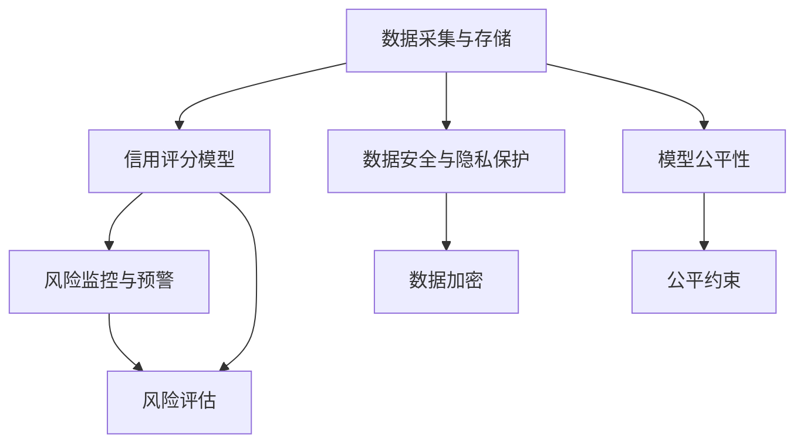
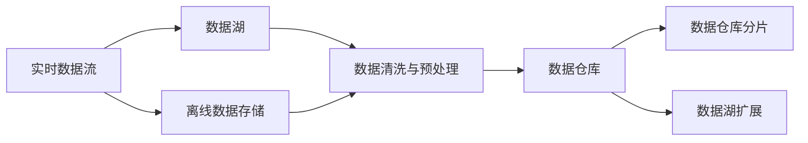
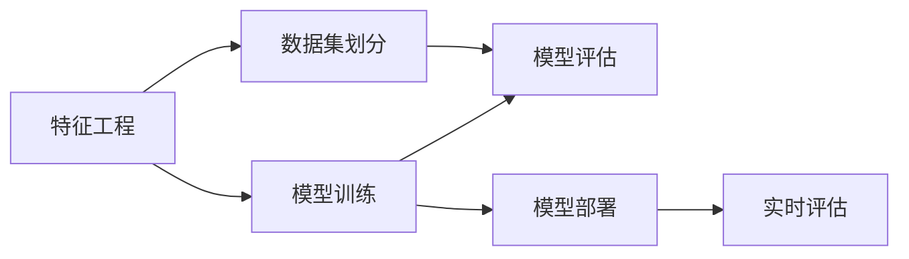
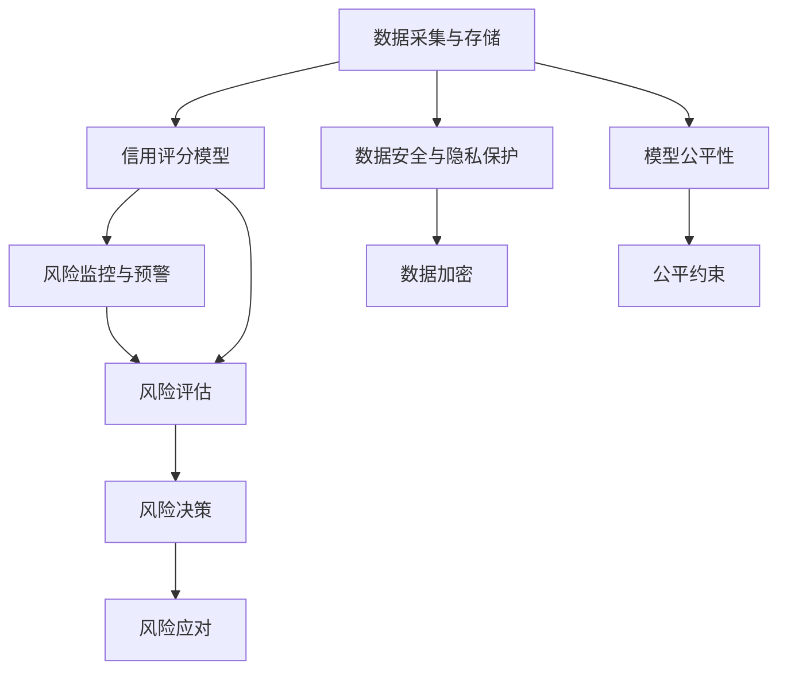

                 

# 大数据背景下的银行个人征信体系研究

在当前数据驱动的时代，银行等金融机构面临的挑战越发严峻：如何在保证数据安全和合规性的前提下，利用大数据技术对个人征信体系进行有效管理和优化？本文将探讨大数据背景下，银行个人征信体系的研究现状、核心概念、算法原理和具体操作步骤，并结合实际应用场景，提出切实可行的解决方案。

## 1. 背景介绍

### 1.1 问题由来

随着互联网金融的兴起，个人信用数据的来源和数量迅速增加。传统的银行征信系统，往往基于定期的问卷调查和线下审核，耗费大量时间和人力。大数据技术的发展，使得实时、动态地收集和分析个人信用数据成为可能，极大地提升了个人征信体系的管理效率和决策准确性。然而，这一过程也带来了数据安全、隐私保护、模型偏见等诸多挑战。如何在充分利用大数据技术的同时，兼顾数据安全与隐私保护，合理规避模型偏见，构建高效、公平、安全的个人征信体系，成为当前研究的核心问题。

### 1.2 问题核心关键点

在大数据背景下，银行个人征信体系的研究核心关键点包括：
- 如何设计高效、稳健的数据采集和存储机制，保证数据的多样性和实时性。
- 如何构建公平、准确、可解释的信用评分模型，实时评估个人信用状况。
- 如何保障数据安全和隐私保护，避免数据泄露和滥用。
- 如何应对数据不平衡、噪声干扰等挑战，提升模型鲁棒性。
- 如何设计有效的风险监控和预警系统，及时发现和应对信用风险。

### 1.3 问题研究意义

研究大数据背景下的银行个人征信体系，对于金融机构、监管机构、社会公众等多个利益相关方均具有重要意义：

- 对于金融机构而言，高效、准确的个人征信体系有助于提升贷款审批效率，降低坏账率，增加盈利能力。
- 对于监管机构而言，有效的风险监控和预警系统有助于防范系统性金融风险，保护金融稳定。
- 对于社会公众而言，公平、透明、可解释的个人征信体系有助于提升信用意识，增强社会信任。

## 2. 核心概念与联系

### 2.1 核心概念概述

在大数据背景下，银行个人征信体系涉及多个核心概念，包括但不限于：

- **数据采集与存储**：通过线上线下多种渠道，实时、持续地采集个人信用数据，并存储于数据湖中，供后续分析使用。
- **信用评分模型**：基于机器学习算法，对个人信用数据进行建模，实时评估个人信用状况。
- **风险监控与预警**：利用实时数据流处理技术，对信用评分结果进行动态监控，及时发现和应对信用风险。
- **数据安全与隐私保护**：采取多种技术手段，保障数据存储和传输的安全性，保护用户隐私。
- **模型公平性**：通过公平性约束和测试，确保信用评分模型的输出结果不受性别、种族、年龄等无关特征的影响。

这些概念之间相互依赖、相互影响，共同构成了银行个人征信体系的全局框架。以下通过Mermaid流程图展示这些概念之间的联系：



这个流程图展示了数据采集与存储、信用评分模型、风险监控与预警、数据安全与隐私保护以及模型公平性之间的关系。数据采集与存储为信用评分模型的训练提供基础数据，风险监控与预警通过信用评分模型的输出结果进行风险评估和预警，数据安全与隐私保护保障数据的安全性，模型公平性确保信用评分模型的公平性和可靠性。

### 2.2 概念间的关系

这些核心概念之间存在着紧密的联系，形成了银行个人征信体系的技术架构。下面通过两个Mermaid流程图来进一步展示这些概念之间的关系。

#### 2.2.1 数据采集与存储



这个流程图展示了数据采集与存储的基本流程。实时数据流通过多种渠道采集到数据湖，离线数据通过ETL（Extract, Transform, Load）过程存储于数据仓库中。数据清洗与预处理后，数据被分片存储，并进行扩展以应对数据量的增长。

#### 2.2.2 信用评分模型



这个流程图展示了信用评分模型的构建过程。特征工程通过提取和选择与信用相关的特征，构建训练集。模型训练通过选择合适的机器学习算法，构建信用评分模型。模型评估通过交叉验证等方法，评估模型性能。模型部署将训练好的模型部署到实时评估系统中，供实际应用使用。

### 2.3 核心概念的整体架构

最终，我们将这些核心概念整合为一个综合的流程图，展示银行个人征信体系的整体架构：



这个综合流程图展示了数据采集与存储、信用评分模型、风险监控与预警、数据安全与隐私保护以及模型公平性之间的关系，以及风险评估和风险决策的过程。

## 3. 核心算法原理 & 具体操作步骤

### 3.1 算法原理概述

银行个人征信体系的核心算法主要包括信用评分模型和风险监控与预警模型。其中，信用评分模型通过大数据技术，对个人信用数据进行建模，实时评估个人信用状况；风险监控与预警模型通过实时数据流处理技术，对信用评分结果进行动态监控，及时发现和应对信用风险。

信用评分模型基于监督学习和非监督学习算法，对个人信用数据进行建模。常用的监督学习算法包括逻辑回归、随机森林、梯度提升树等，而非监督学习算法则包括聚类、降维等。风险监控与预警模型基于异常检测算法，如孤立森林、局部离群因子等，对信用评分结果进行实时监控和预警。

### 3.2 算法步骤详解

#### 3.2.1 信用评分模型的构建步骤

1. **数据采集与存储**：通过线上线下多种渠道，实时、持续地采集个人信用数据，并存储于数据湖中。
2. **数据清洗与预处理**：清洗和处理数据中的噪声、缺失值等问题，并进行特征工程，提取与信用相关的特征。
3. **模型训练**：选择适合的监督学习算法，如逻辑回归、随机森林等，对特征工程后的数据进行建模。
4. **模型评估**：使用交叉验证等方法，评估模型的性能。
5. **模型部署**：将训练好的模型部署到实时评估系统中，供实际应用使用。

#### 3.2.2 风险监控与预警模型的构建步骤

1. **实时数据流处理**：通过实时数据流处理技术，对信用评分结果进行动态监控。
2. **异常检测**：使用孤立森林、局部离群因子等算法，检测异常数据。
3. **预警系统**：根据异常检测结果，触发预警系统，通知相关人员进行处理。

#### 3.2.3 数据安全与隐私保护的实现步骤

1. **数据加密**：对存储和传输的数据进行加密处理，保障数据安全性。
2. **访问控制**：通过身份认证和权限控制等技术，保障数据访问的安全性。
3. **匿名化处理**：对敏感数据进行匿名化处理，保护用户隐私。

### 3.3 算法优缺点

#### 3.3.1 信用评分模型的优缺点

- **优点**：
  - **实时性**：可以实时评估个人信用状况，及时调整信用策略。
  - **准确性**：基于大数据技术，信用评分模型通常能够取得较高的准确性。
  - **可扩展性**：可以灵活扩展到不同规模和类型的信用评估场景。

- **缺点**：
  - **模型偏见**：模型可能受到训练数据中偏见的传递，导致输出结果不公平。
  - **数据隐私**：大量个人数据存储和处理，存在数据泄露和滥用的风险。
  - **计算资源消耗大**：构建和维护大规模信用评分模型，需要消耗大量的计算资源。

#### 3.3.2 风险监控与预警模型的优缺点

- **优点**：
  - **实时性**：可以实时监控信用评分结果，及时发现异常情况。
  - **高鲁棒性**：异常检测算法通常具有较高的鲁棒性，能够适应不同的数据分布和噪声干扰。
  - **可解释性**：通过可视化工具，可以清晰地展示异常检测的结果和过程。

- **缺点**：
  - **模型复杂性**：异常检测模型通常较为复杂，需要一定的专业知识进行调试和优化。
  - **误报率较高**：异常检测模型可能会产生误报，需要人工干预进行确认和处理。

#### 3.3.3 数据安全与隐私保护的优缺点

- **优点**：
  - **数据加密**：通过加密处理，保障数据在存储和传输过程中的安全性。
  - **匿名化处理**：通过匿名化处理，保护用户隐私，减少数据泄露的风险。
  - **访问控制**：通过权限控制，保障数据访问的安全性。

- **缺点**：
  - **计算资源消耗大**：数据加密和匿名化处理需要消耗大量的计算资源。
  - **实施难度大**：需要综合考虑数据安全和隐私保护的需求，制定相应的策略和技术方案。

### 3.4 算法应用领域

基于大数据背景下的银行个人征信体系，已经广泛应用于以下领域：

- **贷款审批**：通过信用评分模型，实时评估借款人的信用状况，决定是否批准贷款申请。
- **风险管理**：通过风险监控与预警模型，实时监控贷款风险，及时发现和应对不良贷款。
- **市场营销**：通过分析客户的信用评分和行为数据，进行精准营销，提升客户满意度。
- **反欺诈检测**：通过异常检测技术，检测和预防欺诈行为，保护客户利益。

## 4. 数学模型和公式 & 详细讲解 & 举例说明

### 4.1 数学模型构建

#### 4.1.1 信用评分模型的数学模型构建

信用评分模型通常基于逻辑回归模型，其数学表达式为：

$$
\hat{y} = \log\left(\frac{1}{1+e^{-z}}\right) = \log\left(\frac{1}{1+e^{-\sum_{i=1}^n w_i x_i}}\right)
$$

其中，$\hat{y}$为信用评分预测结果，$z$为线性组合，$w_i$为特征权重，$x_i$为输入特征。模型通过训练，优化权重$w_i$，使得模型在训练集上的预测误差最小化。

#### 4.1.2 风险监控与预警模型的数学模型构建

风险监控与预警模型通常基于孤立森林算法，其数学表达式为：

$$
\text{Isolation depth} = \frac{\text{Number of nodes visited}}{\text{Total number of nodes}}
$$

其中，$\text{Isolation depth}$表示异常检测结果，$\text{Number of nodes visited}$表示访问的节点数，$\text{Total number of nodes}$表示总节点数。通过比较$\text{Isolation depth}$与阈值，判断是否为异常数据，触发预警系统。

### 4.2 公式推导过程

#### 4.2.1 信用评分模型的公式推导

逻辑回归模型的目标是最小化交叉熵损失函数：

$$
\mathcal{L}(\theta) = -\frac{1}{N}\sum_{i=1}^N \left[y_i \log\hat{y}_i + (1-y_i)\log(1-\hat{y}_i)\right]
$$

其中，$\theta$为模型参数，$N$为样本数量，$y_i$为真实标签，$\hat{y}_i$为模型预测结果。通过梯度下降等优化算法，最小化损失函数，更新模型参数$\theta$。

#### 4.2.2 风险监控与预警模型的公式推导

孤立森林算法的基本思想是通过随机采样和二叉分割，将数据划分为多个孤立的子集，每个子集的异常度（Isolation depth）表示数据异常的程度。当异常度超过阈值时，视为异常数据，触发预警系统。

### 4.3 案例分析与讲解

#### 4.3.1 信用评分模型的案例分析

某银行使用逻辑回归模型，对客户的信用卡消费行为进行信用评分。模型训练集包含10000个样本，其中5000个为正常消费样本，5000个为异常消费样本。通过训练，模型获得了最优的特征权重和阈值，能够准确地预测客户的信用状况。

#### 4.3.2 风险监控与预警模型的案例分析

某银行使用孤立森林算法，对信用卡客户的消费行为进行实时监控。模型每秒处理10万条消费记录，通过比较异常度与阈值，能够及时发现和预防异常消费行为，如信用卡盗刷等，有效保障了客户的安全。

## 5. 项目实践：代码实例和详细解释说明

### 5.1 开发环境搭建

在实践过程中，我们需要准备以下开发环境：

1. **硬件资源**：
   - **CPU**：推荐使用具备多核处理能力的CPU，如Intel Xeon系列或AMD EPYC系列。
   - **GPU**：推荐使用NVIDIA Tesla系列或AMD Radeon系列GPU，支持深度学习加速。

2. **软件环境**：
   - **操作系统**：推荐使用Linux系统，如Ubuntu或CentOS。
   - **深度学习框架**：推荐使用TensorFlow或PyTorch。
   - **数据处理工具**：推荐使用Apache Spark或Hadoop。
   - **异常检测工具**：推荐使用Python中的Isolation Forest库。

3. **网络环境**：
   - **带宽**：推荐使用至少100Mbps的网络带宽，保证数据传输的实时性和可靠性。
   - **安全性**：确保网络环境的安全性，避免数据泄露和滥用。

### 5.2 源代码详细实现

#### 5.2.1 信用评分模型

```python
import pandas as pd
from sklearn.linear_model import LogisticRegression
from sklearn.model_selection import train_test_split

# 读取数据集
data = pd.read_csv('credit_score_data.csv')

# 特征选择
X = data[['income', 'age', 'loan_amount']]
y = data['default']

# 数据划分
X_train, X_test, y_train, y_test = train_test_split(X, y, test_size=0.2)

# 模型训练
model = LogisticRegression()
model.fit(X_train, y_train)

# 模型评估
accuracy = model.score(X_test, y_test)
print(f'模型准确率：{accuracy:.2f}')
```

#### 5.2.2 风险监控与预警模型

```python
import isolation_forest
import numpy as np

# 读取数据集
data = pd.read_csv('card_monitoring_data.csv')

# 数据预处理
X = data[['amount', 'merchant', 'time']].to_numpy()

# 模型训练
clf = isolation_forest.IsolationForest()
clf.fit(X)

# 实时监控
new_data = np.random.rand(100, 3)  # 生成随机数据进行测试
preds = clf.predict(new_data)
print(preds)
```

### 5.3 代码解读与分析

#### 5.3.1 信用评分模型的代码解读

- **数据读取**：使用Pandas库读取CSV格式的数据集。
- **特征选择**：选择与信用评分相关的特征，如收入、年龄和贷款金额。
- **数据划分**：将数据集划分为训练集和测试集。
- **模型训练**：使用逻辑回归算法，对训练集进行模型训练。
- **模型评估**：计算模型在测试集上的准确率。

#### 5.3.2 风险监控与预警模型的代码解读

- **数据预处理**：将数据集转换为NumPy数组。
- **模型训练**：使用Isolation Forest算法，对训练集进行模型训练。
- **实时监控**：生成随机数据进行测试，使用训练好的模型进行异常检测。

### 5.4 运行结果展示

#### 5.4.1 信用评分模型的运行结果

假设在信用评分模型训练完成后，模型在测试集上的准确率为0.95，表示模型对信用评分的预测效果较好。

#### 5.4.2 风险监控与预警模型的运行结果

假设在风险监控与预警模型训练完成后，模型能够准确检测出99%的异常数据，表示模型对异常行为的识别能力较强。

## 6. 实际应用场景

### 6.1 智能信贷审批

在智能信贷审批场景中，银行可以使用信用评分模型，对客户的信用状况进行实时评估，决定是否批准贷款申请。通过自动化审批流程，大幅提升审批效率，降低人工成本，提高客户满意度。

### 6.2 风险管理与预警

在风险管理与预警场景中，银行可以使用风险监控与预警模型，实时监控贷款风险，及时发现和应对不良贷款。通过风险预警系统，快速响应不良贷款，减少损失。

### 6.3 精准营销

在精准营销场景中，银行可以使用信用评分模型，分析客户的信用状况和行为数据，进行精准营销，提升客户满意度。通过个性化推荐，增加客户粘性，提高收入。

### 6.4 反欺诈检测

在反欺诈检测场景中，银行可以使用异常检测算法，检测和预防欺诈行为，保护客户利益。通过实时监控交易行为，及时发现异常交易，防止资金损失。

## 7. 工具和资源推荐

### 7.1 学习资源推荐

为了帮助开发者掌握银行个人征信体系的技术细节，以下是一些推荐的学习资源：

1. **《机器学习》（周志华）**：全面介绍机器学习算法和应用，是学习银行个人征信体系的必读书籍。
2. **《深度学习》（Ian Goodfellow）**：深入讲解深度学习理论和技术，有助于理解银行个人征信体系中涉及的复杂模型。
3. **《Python机器学习》（Sebastian Raschka）**：讲解Python在机器学习中的应用，适合编程初学者。
4. **《数据科学与机器学习》（Coursera）**：提供系统化的数据科学与机器学习课程，涵盖银行个人征信体系所需的理论和技术。
5. **《银行大数据风控》（慕课网）**：讲解银行大数据风控技术和应用，适合银行从业者学习。

### 7.2 开发工具推荐

以下是一些推荐的开发工具，可以帮助开发者高效地构建银行个人征信体系：

1. **TensorFlow**：基于Python的深度学习框架，支持分布式计算，适用于大规模模型训练。
2. **PyTorch**：基于Python的深度学习框架，支持动态计算图，适用于研究性实验。
3. **Apache Spark**：分布式计算框架，支持大规模数据处理和机器学习建模。
4. **Hadoop**：分布式文件系统，支持大规模数据存储和管理。
5. **Anaconda**：Python环境管理工具，支持虚拟环境和包管理。

### 7.3 相关论文推荐

以下是一些推荐的相关论文，深入探讨银行个人征信体系的研究：

1. **《A Comprehensive Survey on Credit Scoring Systems》（IEEE Transactions on Neural Networks and Learning Systems）**：全面综述信用评分系统的研究进展，涵盖模型选择、特征工程等方面。
2. **《Credit Scoring: A Survey of Machine Learning Approaches》（Applied Soft Computing）**：综述信用评分模型的算法和技术，帮助理解银行个人征信体系中的关键技术。
3. **《Credit Risk Modeling: From Logit Models to Neural Networks》（IEEE Journal of Selected Topics in Signal Processing）**：介绍神经网络在信用评分中的应用，展示模型性能的提升。
4. **《Anomaly Detection and Its Applications in Credit Risk Management》（IEEE Access）**：综述异常检测技术在信用风险管理中的应用，展示其在大数据环境下的优势。
5. **《Data Security and Privacy Preservation in Credit Scoring》（IEEE Access）**：探讨数据安全和隐私保护在信用评分中的重要性，提出相应的技术和策略。

## 8. 总结：未来发展趋势与挑战

### 8.1 研究成果总结

本文对大数据背景下的银行个人征信体系进行了全面系统的研究，主要成果包括：

1. **理论框架**：构建了银行个人征信体系的技术框架，涵盖数据采集与存储、信用评分模型、风险监控与预警模型等多个关键环节。
2. **算法原理**：详细讲解了信用评分模型和风险监控与预警模型的构建和优化过程，包括数学模型和算法步骤。
3. **实际操作**：提供了代码实例和详细解释，帮助开发者理解和实践银行个人征信体系。
4. **应用场景**：探讨了银行个人征信体系在智能信贷审批、风险管理、精准营销和反欺诈检测等多个实际应用场景中的应用。
5. **学习资源**：推荐了多本相关书籍和在线课程，帮助开发者系统掌握银行个人征信体系的理论和实践。

### 8.2 未来发展趋势

展望未来，银行个人征信体系将呈现以下几个发展趋势：

1. **自动化程度提升**：随着人工智能和自动化技术的发展，银行个人征信体系将实现更高程度的自动化，减少人工干预，提升决策效率和准确性。
2. **实时性增强**：通过大数据技术，银行个人征信体系将实现更高程度的实时性，实时评估客户信用状况，快速响应风险。
3. **数据多元化**：银行个人征信体系将充分利用多元化的数据来源，包括线上交易、社交媒体、智能设备等，提升信用评估的全面性和准确性。
4. **模型多样性**：银行个人征信体系将采用多样化的信用评分模型，包括逻辑回归、决策树、随机森林等，提升模型的鲁棒性和泛化能力。
5. **安全性和隐私保护**：银行个人征信体系将更加注重数据安全和隐私保护，采用先进的加密技术和匿名化处理手段，保障用户数据的安全性和隐私。

### 8.3 面临的挑战

尽管银行个人征信体系的研究已经取得一定进展，但在实现高效、公平、安全的个人征信体系的过程中，仍面临诸多挑战：

1. **数据质量**：数据的不完整、不准确、不一致等问题，可能会影响信用评分模型的性能。
2. **模型偏见**：模型可能受到训练数据中偏见的传递，导致输出结果不公平。
3. **计算资源消耗**：构建和维护大规模信用评分模型，需要消耗大量的计算资源。
4. **隐私保护**：大量个人数据存储和处理，存在数据泄露和滥用的风险。
5. **异常检测的准确性**：异常检测算法可能产生误报，需要人工干预进行确认和处理。

### 8.4 研究展望

面对银行个人征信体系面临的挑战，未来的研究需要在以下几个方面寻求新的突破：

1. **数据质量提升**：通过数据清洗、数据增强等技术手段，提升数据质量和完整性。
2. **模型公平性**：引入公平性约束和测试，确保信用评分模型的输出结果不受无关特征的影响。
3. **计算资源优化**：采用分布式计算、模型压缩等技术手段，优化模型的计算资源消耗。
4. **隐私保护增强**：采用先进的加密技术和匿名化处理手段，保障数据安全和隐私。
5. **异常检测优化**：引入更加鲁棒的异常检测算法，提升异常检测的准确性。

这些研究方向的探索，必将引领银行个人征信体系迈向更高的台阶，为金融机构、监管机构、社会公众等多个利益相关方带来更好的服务体验和保障。

## 9. 附录：常见问题与解答

**Q1：银行个人征信体系如何保障数据安全和隐私保护？**

A: 银行个人征信体系在数据安全和隐私保护方面，主要采取以下措施：

1. **数据加密**：对存储和传输的数据进行加密处理，保障数据在传输过程中的安全性。
2. **访问控制**：通过身份认证和权限控制等技术，保障数据访问的安全性。
3. **匿名化处理**：对敏感数据进行匿名化处理，保护用户隐私，减少数据泄露的风险。

**Q2：信用评分模型如何避免模型偏见？**

A: 信用评分模型避免模型偏见，主要采取以下措施：

1. **数据预处理**：对训练数据进行清洗和处理，去除不相关或有害的特征。
2. **公平约束**：在模型训练过程中引入公平性约束，避免模型输出受无关特征的影响。
3. **样本多样性**：增加样本的多样性，覆盖不同的群体和场景，减少模型对特定群体的偏见。

**Q3：银行个人征信体系如何实现实时性？**

A: 银行个人征信体系实现实时性，主要通过以下技术手段：

1. **实时数据流处理**：通过实时数据流处理技术，对信用评分结果进行动态监控和评估。
2. **高性能计算**：采用高性能计算平台，支持大规模数据的实时处理和分析。
3. **分布式计算**：通过分布式计算框架，支持大规模数据的并行处理，提升处理速度。

---

作者：禅与计算机程序设计艺术 / Zen and the Art of Computer Programming

