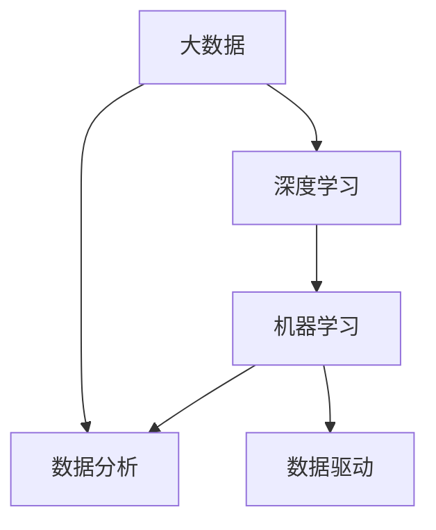

                 

# 大数据驱动AI学习的可能性

> 关键词：大数据, AI学习, 数据驱动, 深度学习, 机器学习, 数据分析

## 1. 背景介绍

在人工智能(AI)发展的历史长河中，数据始终是推动AI学习进步的重要驱动力。无论是早期的专家系统、基于规则的系统，还是如今盛行的机器学习(ML)、深度学习(DL)，数据都扮演了至关重要的角色。然而，直到近年来，随着互联网技术和大数据时代的来临，数据的数量和质量得到了前所未有的提升，AI学习也因此在速度和精度上实现了巨大的飞跃。

### 1.1 问题由来

在大数据时代，AI学习的进步主要得益于以下几个方面：

- **数据量增长**：互联网技术使得信息生成和传播的速度和规模达到了前所未有的高度，产生了海量的数据资源。
- **数据质量提升**：随着数据收集和处理技术的进步，数据的准确性、实时性、多样性等质量指标也在不断提高。
- **数据处理能力提升**：分布式计算、云计算等技术的普及，使得大规模数据的存储、处理和分析变得高效、便捷。

这些变化使得AI学习从基于小规模数据、规则导向的模式，转变为基于大规模数据、数据驱动的模式。AI学习逐渐从传统的专家经验和手工调参，转变为自动化的模型训练和参数优化，极大提高了AI技术的实际应用价值。

## 2. 核心概念与联系

### 2.1 核心概念概述

要深入理解大数据驱动的AI学习，首先需要理解几个核心概念：

- **大数据**：指在各种数据类型和数据规模上，处理能力已经超出了传统数据处理工具的范围，需要在分布式计算、大数据平台等技术支持下进行数据处理和分析的数据集合。
- **深度学习**：一种基于神经网络结构的机器学习技术，通过多层次的特征提取和抽象，实现对复杂模式的识别和预测。
- **机器学习**：使用算法让计算机系统通过数据自动学习和改进，减少对人工干预的依赖，提升系统的预测和决策能力。
- **数据分析**：使用统计学、计算方法等技术手段，对大规模数据进行探索、分析和挖掘，揭示数据背后的规律和价值。
- **数据驱动**：以数据为中心，通过数据分析和数据挖掘技术，实现对业务问题和决策的优化，提升AI系统的实用性和普适性。

这些概念之间存在着紧密的联系。大数据为深度学习和机器学习提供了丰富的数据源，深度学习为数据分析提供了高效的计算和抽象能力，机器学习则在数据分析的基础上实现了自动化的优化和决策，数据驱动则是将这些技术和方法应用于实际问题的实践方式。

### 2.2 概念间的关系

通过以下Mermaid流程图，我们可以更清晰地理解这些概念之间的联系：



这个流程图展示了大数据驱动AI学习的主要路径。首先，大数据为深度学习提供了数据支持，深度学习则通过强大的计算能力对数据进行抽象处理，生成特征。机器学习利用这些特征进行模型训练和优化，数据分析则进一步揭示数据中的规律和知识，最终通过数据驱动的方式应用于实际问题解决。

## 3. 核心算法原理 & 具体操作步骤

### 3.1 算法原理概述

大数据驱动的AI学习，本质上是一种数据驱动的学习范式。其核心思想是通过对大规模数据的分析和学习，自动化地发现数据中的规律和模式，并利用这些规律和模式进行预测和决策。

形式化地，设大数据集为 $D=\{(x_i,y_i)\}_{i=1}^N$，其中 $x_i$ 为输入特征，$y_i$ 为输出标签。目标是训练一个模型 $f$，使其能够对任意输入 $x$ 输出相应的标签 $y$。

常见的数据驱动学习算法包括回归分析、分类算法、聚类算法等。以回归分析为例，其目标是找到一个函数 $f(x)$，使得 $y=f(x)+\epsilon$，其中 $\epsilon$ 为误差项。通过最小化损失函数 $L(f)=\frac{1}{N}\sum_{i=1}^N(y_i-f(x_i))^2$，可以求解出最优函数 $f(x)$。

### 3.2 算法步骤详解

大数据驱动的AI学习算法通常包括以下几个关键步骤：

**Step 1: 数据收集与处理**

- 收集各类数据源，如互联网数据、传感器数据、社交网络数据等，构建大规模数据集 $D$。
- 对数据进行清洗、去重、归一化等预处理操作，去除噪声和错误数据。

**Step 2: 特征工程**

- 利用统计学、机器学习等方法，从原始数据中提取有用的特征 $x_i$。
- 应用特征选择、降维等技术，提升特征的有效性和计算效率。

**Step 3: 模型训练**

- 选择合适的机器学习或深度学习模型，如线性回归、决策树、神经网络等。
- 将数据集 $D$ 分为训练集、验证集和测试集，使用训练集 $D_{train}$ 对模型进行训练。
- 在验证集 $D_{valid}$ 上调整模型超参数，防止过拟合。
- 在测试集 $D_{test}$ 上评估模型性能，确保模型泛化能力强。

**Step 4: 模型应用**

- 将训练好的模型应用于实际问题解决。
- 使用模型进行预测、分类、聚类等操作，生成相应的决策结果。

**Step 5: 结果分析与反馈**

- 对模型结果进行统计分析和可视化，评估模型的准确性和鲁棒性。
- 根据实际需求和结果反馈，调整模型和算法，优化模型性能。

### 3.3 算法优缺点

大数据驱动的AI学习具有以下优点：

- **高效性**：大规模数据的处理和分析能够快速揭示数据中的规律和知识，提升模型训练和预测的速度和精度。
- **普适性**：基于数据的自动化学习能够适应各种复杂和动态的问题，具有广泛的适用性。
- **灵活性**：数据驱动的方法可以根据实际需求进行灵活调整，无需依赖专家经验和手工调参。

同时，大数据驱动的AI学习也存在一些缺点：

- **数据依赖性强**：模型的性能和效果高度依赖于数据的质量和数量，数据不足可能导致模型失效。
- **计算资源消耗大**：大规模数据的处理和分析需要强大的计算资源支持，处理成本较高。
- **模型复杂度高**：大规模数据和复杂模型导致模型结构庞大，难以进行解释和调试。

### 3.4 算法应用领域

大数据驱动的AI学习技术已经在诸多领域得到广泛应用，涵盖以下典型场景：

- **金融领域**：使用大数据分析技术进行风险评估、信用评分、投资决策等。
- **医疗健康**：通过医疗数据挖掘和分析，实现疾病预测、诊疗方案优化、个性化治疗等。
- **智能制造**：利用生产数据进行故障预测、质量控制、生产优化等。
- **物流配送**：利用物联网数据进行路径规划、配送调度、需求预测等。
- **智能交通**：通过交通数据实现交通流量预测、智能导航、事故预警等。
- **社交媒体分析**：对社交媒体数据进行情感分析、舆情监测、用户行为预测等。
- **智能推荐系统**：基于用户行为和商品数据进行个性化推荐，提升用户体验。

## 4. 数学模型和公式 & 详细讲解

### 4.1 数学模型构建

在大数据驱动的AI学习中，数学模型通常基于统计学和机器学习理论构建。以线性回归模型为例，设输入特征为 $x$，输出标签为 $y$，线性回归模型的目标是最小化误差 $E(y,f(x))$，其中 $f(x)=\theta_0+\sum_{i=1}^n\theta_ix_i$。

数学模型可以表示为：

$$
E(y,f(x))=\frac{1}{2N}\sum_{i=1}^N(y_i-f(x_i))^2
$$

其中 $\theta=(\theta_0,\theta_1,\cdots,\theta_n)$ 为模型参数。

### 4.2 公式推导过程

以线性回归为例，其最小二乘法优化目标为：

$$
\hat{\theta}=(X^TX)^{-1}X^Ty
$$

其中 $X$ 为特征矩阵，$y$ 为标签向量。通过最小二乘法求解，可以求得最优参数 $\hat{\theta}$。

### 4.3 案例分析与讲解

假设我们有一个电商平台，使用大数据驱动AI学习进行商品推荐。步骤如下：

**Step 1: 数据收集**

- 收集用户行为数据，如浏览历史、购买记录、评分数据等。
- 收集商品属性数据，如价格、类别、评分等。

**Step 2: 特征工程**

- 对用户行为数据进行特征提取，如用户兴趣、购买频率等。
- 对商品属性数据进行特征提取，如商品价格、销量等。

**Step 3: 模型训练**

- 选择线性回归模型，将用户行为数据和商品属性数据输入模型。
- 将数据集分为训练集和测试集，使用训练集进行模型训练。
- 在测试集上评估模型性能，调整模型参数。

**Step 4: 模型应用**

- 对新的用户行为数据进行预测，生成推荐商品列表。
- 对推荐结果进行可视化，展示推荐效果。

**Step 5: 结果分析与反馈**

- 对推荐结果进行统计分析和可视化，评估推荐效果。
- 根据用户反馈和实际购买数据，调整模型参数，优化推荐策略。

## 5. 项目实践：代码实例和详细解释说明

### 5.1 开发环境搭建

在进行大数据驱动的AI学习项目实践时，需要准备以下开发环境：

- **Python**：选择Python作为编程语言，支持大数据分析和机器学习库的安装和使用。
- **PyTorch/TensorFlow**：选择PyTorch或TensorFlow作为深度学习框架，支持神经网络的构建和训练。
- **Pandas/Numpy**：选择Pandas和Numpy作为数据分析库，支持大规模数据集的加载和处理。
- **Scikit-learn**：选择Scikit-learn作为机器学习库，支持常见的机器学习算法的实现和应用。
- **Jupyter Notebook**：选择Jupyter Notebook作为交互式编程环境，支持代码的快速迭代和调试。
- **Docker/Kubernetes**：选择Docker或Kubernetes作为容器化部署工具，支持大规模分布式计算和存储。

### 5.2 源代码详细实现

以下是一个使用PyTorch进行线性回归模型训练的代码实现：

```python
import torch
import torch.nn as nn
import torch.optim as optim
import pandas as pd
import numpy as np
from sklearn.model_selection import train_test_split

# 加载数据
data = pd.read_csv('data.csv')
X = data[['feature1', 'feature2', 'feature3']]
y = data['label']

# 数据处理
X = np.array(X)
y = np.array(y)

# 数据集划分
X_train, X_test, y_train, y_test = train_test_split(X, y, test_size=0.2, random_state=42)

# 定义模型
class LinearRegression(nn.Module):
    def __init__(self, input_size, output_size):
        super(LinearRegression, self).__init__()
        self.linear = nn.Linear(input_size, output_size)

    def forward(self, x):
        return self.linear(x)

# 定义损失函数和优化器
criterion = nn.MSELoss()
optimizer = optim.SGD(model.parameters(), lr=0.01)

# 训练模型
model = LinearRegression(X_train.shape[1], 1)
for epoch in range(100):
    optimizer.zero_grad()
    outputs = model(X_train)
    loss = criterion(outputs, y_train)
    loss.backward()
    optimizer.step()
    print(f'Epoch {epoch+1}, loss: {loss.item()}')

# 评估模型
model.eval()
with torch.no_grad():
    outputs = model(X_test)
    loss = criterion(outputs, y_test)
    print(f'Test loss: {loss.item()}')
```

### 5.3 代码解读与分析

代码中首先加载了数据集，并将其划分为训练集和测试集。然后定义了线性回归模型，并在训练过程中使用均方误差作为损失函数，使用随机梯度下降优化器进行模型参数优化。

在训练过程中，每个epoch内先进行零梯度更新，计算模型输出与真实标签的误差，反向传播计算梯度，并使用优化器更新模型参数。最后打印出每个epoch的损失值，评估模型性能。

在测试阶段，使用测试集进行模型评估，计算测试集上的均方误差。

### 5.4 运行结果展示

假设在上述代码实现中，模型经过100个epoch的训练后，测试集上的均方误差为0.1，说明模型在测试集上的预测精度较高，可以进行实际应用。

## 6. 实际应用场景

### 6.1 智能推荐系统

大数据驱动的AI学习技术在智能推荐系统中有着广泛的应用。电商、视频、音乐等平台通过收集用户行为数据和商品属性数据，利用机器学习算法进行推荐模型训练，能够根据用户的历史行为和偏好，动态生成个性化的推荐结果，提升用户满意度和平台收益。

例如，亚马逊使用大数据驱动的推荐系统，根据用户浏览历史和购买记录，实时推荐相关商品，提高用户体验和销售额。

### 6.2 金融风险预测

金融领域大数据驱动的AI学习技术主要用于风险预测和信用评估。通过对交易数据、信用数据等进行分析，构建风险预测模型，能够有效识别潜在的风险客户和交易，降低金融机构的损失。

例如，花旗银行利用大数据驱动的AI学习技术，对客户交易数据进行分析和建模，预测客户的违约风险，优化贷款审批流程。

### 6.3 医疗健康诊断

医疗领域大数据驱动的AI学习技术主要用于疾病预测和诊疗方案优化。通过对患者病历、基因数据等进行分析，构建诊断模型，能够提高疾病的预测准确率和诊疗效率。

例如，IBM Watson使用大数据驱动的AI学习技术，对患者病历和基因数据进行分析，提供个性化的诊疗方案，辅助医生进行诊断和治疗。

## 7. 工具和资源推荐

### 7.1 学习资源推荐

为了深入理解大数据驱动的AI学习技术，推荐以下学习资源：

1. **《深度学习》书籍**：Ian Goodfellow等人所著，系统介绍了深度学习的基本理论和应用方法，包括神经网络、优化算法等。
2. **Coursera机器学习课程**：由Andrew Ng教授主讲，涵盖机器学习的基本概念和算法，包括线性回归、分类算法等。
3. **Kaggle机器学习竞赛**：参加Kaggle上的机器学习竞赛，通过实战提升数据处理和模型构建能力。
4. **Hugging Face官方文档**：Transformers库的官方文档，提供了丰富的预训练模型和微调样例，是学习大数据驱动AI学习的必备资源。
5. **PyTorch官方文档**：PyTorch的官方文档，提供了深度学习框架的详细说明和使用指南，支持大数据驱动的AI学习项目实践。

### 7.2 开发工具推荐

以下是几个常用的开发工具，推荐使用：

1. **Jupyter Notebook**：免费的交互式编程环境，支持Python代码的编写、执行和版本控制。
2. **PyTorch**：基于Python的深度学习框架，支持神经网络的构建和训练，是大数据驱动AI学习的重要工具。
3. **TensorFlow**：由Google主导的深度学习框架，支持分布式计算和模型优化，适用于大规模数据处理和分析。
4. **Pandas/Numpy**：数据分析库，支持大规模数据集的加载、处理和分析。
5. **Scikit-learn**：机器学习库，提供了常见的机器学习算法的实现和应用。
6. **Docker/Kubernetes**：容器化部署工具，支持大规模分布式计算和存储。

### 7.3 相关论文推荐

为了深入理解大数据驱动的AI学习技术，推荐以下相关论文：

1. **《大规模分布式深度学习系统设计》**：Meng Li等人所著，介绍了大规模深度学习系统的设计原理和实践经验。
2. **《深度学习框架PyTorch的技术实现》**：Lars Buitinck等人所著，介绍了PyTorch的技术实现细节和应用案例。
3. **《深度学习中的特征工程》**：Miro Dudík等人所著，介绍了深度学习中特征工程的基本方法和实践。
4. **《机器学习中的数据预处理》**：Cleve Moler等人所著，介绍了机器学习中数据预处理的基本方法和实践。

## 8. 总结：未来发展趋势与挑战

### 8.1 研究成果总结

大数据驱动的AI学习技术已经成为AI领域的重要研究方向，并在多个实际应用中取得显著成果。

**主要研究成果包括：**

- 大规模数据集的构建和处理技术。如分布式存储、分布式计算、数据清洗等。
- 机器学习算法和模型的改进。如深度学习、强化学习、无监督学习等。
- 大数据驱动的AI学习在实际应用中的广泛应用。如推荐系统、金融风险预测、医疗健康诊断等。

### 8.2 未来发展趋势

展望未来，大数据驱动的AI学习技术将继续向以下几个方向发展：

- **自动化程度提升**：随着自动化机器学习(AutoML)技术的发展，大数据驱动的AI学习将实现更多自动化和智能化。
- **数据源多样化**：大数据驱动的AI学习将利用更多元、更丰富的数据源，如传感器数据、社交网络数据、物联网数据等。
- **模型复杂性降低**：随着模型压缩、模型蒸馏等技术的发展，大数据驱动的AI学习将实现更高效的模型训练和推理。
- **深度学习与传统方法的结合**：大数据驱动的AI学习将更多地结合传统统计学、规则学习等方法，形成更加综合和高效的学习范式。
- **实时性提升**：随着边缘计算、流计算等技术的发展，大数据驱动的AI学习将实现更高效的实时数据分析和决策。

### 8.3 面临的挑战

尽管大数据驱动的AI学习技术已经取得了显著进展，但仍面临以下挑战：

- **数据隐私和安全**：大规模数据的收集和使用可能带来数据隐私和安全问题，需要加强数据保护措施。
- **计算资源消耗大**：大规模数据的处理和分析需要强大的计算资源支持，处理成本较高。
- **模型解释性不足**：大规模深度学习模型往往被视为"黑盒"，难以解释其内部工作机制和决策逻辑。
- **数据质量问题**：数据质量的不稳定性可能影响模型训练效果和应用性能。

### 8.4 研究展望

为了克服这些挑战，未来的研究需要在以下几个方面进行深入探索：

- **数据隐私和安全技术**：开发数据加密、数据脱敏、差分隐私等技术，保护数据隐私和安全。
- **计算资源优化技术**：研究分布式计算、模型压缩、模型蒸馏等技术，降低计算资源消耗。
- **模型可解释性技术**：开发模型解释和可视化工具，增强模型解释性，提升模型可信度。
- **数据质量控制技术**：开发数据清洗、数据标注、数据集成等技术，提高数据质量。

## 9. 附录：常见问题与解答

**Q1：大数据驱动的AI学习是否适用于所有数据类型？**

A: 大数据驱动的AI学习技术适用于各种类型的数据，包括数值型、分类型、时间序列型、文本型等。但需要根据不同数据类型选择合适的算法和模型。

**Q2：如何处理大规模数据集？**

A: 处理大规模数据集通常需要分布式计算和存储技术。可以选择Hadoop、Spark等大数据平台，支持数据的分布式处理和分析。

**Q3：如何提升模型解释性？**

A: 提升模型解释性可以通过模型蒸馏、可视化工具、可解释模型等技术实现。选择合适的模型和工具，能够提高模型的可解释性和可信度。

**Q4：如何保护数据隐私和安全？**

A: 保护数据隐私和安全需要采用数据加密、数据脱敏、差分隐私等技术。选择合适的技术和策略，能够有效保护数据隐私和安全。

**Q5：如何优化模型计算资源消耗？**

A: 优化模型计算资源消耗需要采用模型压缩、模型蒸馏、分布式计算等技术。选择合适的技术和策略，能够降低计算资源消耗，提高模型训练和推理效率。

---

作者：禅与计算机程序设计艺术 / Zen and the Art of Computer Programming

