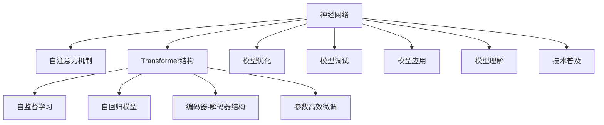
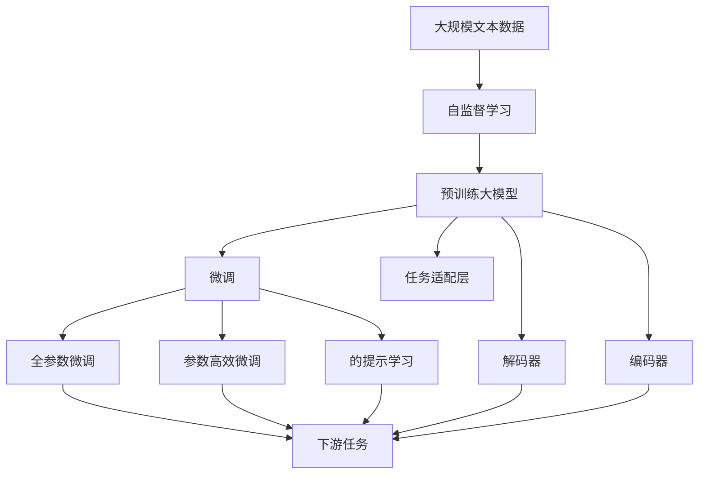

                 

# 大模型体系结构探索：解构AI LLM的内部工作机制

> 关键词：大模型,神经网络架构,Transformer,BERT,自监督学习,自回归,编码器-解码器

## 1. 背景介绍

### 1.1 问题由来
在人工智能领域，大语言模型（Large Language Models, LLMs）以其巨大的参数量和卓越的语言理解能力，成为了研究的热点。其中，基于Transformer结构的语言模型，如BERT、GPT-3、T5等，通过在大规模无标签数据上进行自监督学习，学习到了丰富的语言知识和常识，并在下游任务中表现出色。但是，这些模型内部的工作机制仍然相对复杂，其体系结构和算法原理也未完全公开。本文将深入探索大模型（Large Language Models, LLMs）的内部结构，解构其工作机制，帮助读者更好地理解和使用这些模型。

### 1.2 问题核心关键点
本文的核心内容将围绕大语言模型的内部工作机制展开，具体包括：

- **Transformer架构**：Transformer是一种基于自注意力机制的神经网络结构，广泛用于大语言模型的构建。
- **自监督学习**：大语言模型通常在大规模无标签数据上进行自监督学习，学习到语言的通用表示。
- **自回归模型**：大语言模型中的自回归模型（如GPT）与自编码模型（如BERT）的不同点。
- **编码器-解码器结构**：理解大语言模型中的编码器-解码器结构，及其在任务执行中的作用。
- **参数高效微调**：如何在不增加过多参数的情况下，提高大模型的微调效率。

### 1.3 问题研究意义
了解大语言模型的内部工作机制，对于优化模型的训练和部署、提升模型的性能、推广模型的应用具有重要意义。具体包括：

- **模型优化**：掌握大模型的结构细节，有助于进行更有效的模型优化，减少计算资源消耗。
- **模型调试**：了解模型的内部工作机制，便于进行模型调试和问题诊断。
- **模型应用**：明确模型的适用范围和限制，指导其在特定场景下的应用。
- **模型理解**：深入理解大模型的原理和设计思想，有助于构建新的模型和算法。
- **技术普及**：普及大模型的知识，促进更多研究者和开发者使用和改进这些模型。

## 2. 核心概念与联系

### 2.1 核心概念概述

在大模型体系结构探索中，我们需要了解以下几个核心概念：

- **神经网络**：构成大模型的基本单元，负责处理输入数据，并输出结果。
- **自注意力机制**：Transformer中核心的计算单元，用于捕捉序列数据中的局部和全局依赖关系。
- **Transformer结构**：一种基于自注意力机制的神经网络结构，广泛应用于大模型的构建。
- **自监督学习**：在大规模无标签数据上进行的自监督学习，学习到语言的通用表示。
- **自回归模型**：一种通过预测下一个单词（或下一个序列元素）来推断整个序列的语言模型。
- **编码器-解码器结构**：将输入序列（编码器）和目标序列（解码器）结合起来，用于执行特定任务（如机器翻译、文本生成等）。
- **参数高效微调**：在微调过程中，只更新少量模型参数，以提高微调效率和模型性能。

这些核心概念构成了大语言模型的基础，理解它们的相互关系和作用，有助于我们深入探索模型的内部工作机制。

### 2.2 概念间的关系

通过以下Mermaid流程图，我们可以清晰地展示这些核心概念之间的关系：



这个流程图展示了核心概念之间的逻辑关系：

1. 神经网络是构建大模型的基础。
2. 自注意力机制是Transformer结构的核心计算单元。
3. 自监督学习和大模型通常在大规模无标签数据上进行，学习到语言的通用表示。
4. 自回归模型通过预测下一个单词来推断整个序列，广泛应用于大模型。
5. 编码器-解码器结构用于执行特定任务，如机器翻译和文本生成。
6. 参数高效微调方法可以提高微调效率和模型性能。
7. 模型优化、调试、应用、理解和技术普及都依赖于对大模型内部结构的深入理解。

### 2.3 核心概念的整体架构

接下来，我们用一个综合的流程图来展示这些核心概念在大语言模型中的整体架构：



这个综合流程图展示了从预训练到微调，再到任务执行的完整过程。预训练大模型通过自监督学习学习到语言的通用表示，然后通过微调进行特定任务的优化，利用任务适配层和解码器编码器执行任务，参数高效微调和提示学习可以进一步提升模型的效率和性能。

## 3. 核心算法原理 & 具体操作步骤
### 3.1 算法原理概述

大语言模型的核心算法原理主要基于神经网络和自注意力机制。以下是对这些原理的详细解释：

- **神经网络**：神经网络是一种基于生物神经元工作原理的计算模型，由多个层组成，每层包含多个神经元。神经网络通过前向传播和反向传播来更新模型参数，从而完成数据处理和预测任务。
- **自注意力机制**：自注意力机制通过计算输入序列中每个位置与其他位置之间的相关性，来捕捉序列数据中的局部和全局依赖关系。自注意力机制通常用于Transformer结构中，帮助模型学习到长距离依赖关系。
- **Transformer结构**：Transformer是一种基于自注意力机制的神经网络结构，通常由编码器（Encoder）和解码器（Decoder）组成。编码器用于处理输入序列，解码器用于生成输出序列。
- **自监督学习**：自监督学习是一种在大规模无标签数据上进行的学习方式，通过预测序列中的某些元素来推断整个序列。自监督学习可以帮助模型学习到语言的通用表示，提高其在特定任务上的性能。
- **自回归模型**：自回归模型是一种通过预测下一个单词（或下一个序列元素）来推断整个序列的语言模型。自回归模型通常用于生成任务，如文本生成和语音识别。
- **编码器-解码器结构**：编码器-解码器结构将输入序列（编码器）和目标序列（解码器）结合起来，用于执行特定任务，如机器翻译和文本生成。编码器-解码器结构通常包含多个层，每层包含多个神经元。

### 3.2 算法步骤详解

下面是基于神经网络和自注意力机制的大语言模型微调的具体操作步骤：

1. **准备数据**：收集并准备大规模无标签数据，用于模型的预训练。
2. **模型预训练**：在大规模无标签数据上进行自监督学习，学习到语言的通用表示。
3. **模型微调**：在特定任务的数据集上进行微调，优化模型在该任务上的性能。
4. **任务适配层**：根据具体任务类型，在模型的顶层添加适当的任务适配层，如分类器或解码器。
5. **解码器**：对于生成任务，如文本生成，解码器将预测的单词序列作为输出。
6. **编码器**：对于翻译任务，编码器将输入序列转换为隐藏表示。
7. **参数高效微调**：通过调整模型的顶层参数，以提高微调效率和性能。
8. **提示学习**：通过在输入文本中添加提示模板，引导模型按期望方式输出，减少微调参数。

### 3.3 算法优缺点

基于神经网络和自注意力机制的大语言模型微调方法具有以下优点：

- **简单高效**：只需收集少量标注数据，即可对预训练模型进行快速适配，提高模型性能。
- **通用适用**：适用于各种自然语言处理任务，如分类、匹配、生成等。
- **性能显著**：通过微调，模型能够在特定任务上取得优异的性能，优于从头训练。
- **参数高效**：使用参数高效微调技术，可以在不增加过多参数的情况下，提高微调效率。

同时，该方法也存在一些局限性：

- **依赖标注数据**：微调的效果很大程度上取决于标注数据的质量和数量，标注数据的获取成本较高。
- **迁移能力有限**：当目标任务与预训练数据的分布差异较大时，微调的性能提升有限。
- **负面效果传递**：预训练模型的固有偏见、有害信息等，可能通过微调传递到下游任务，造成负面影响。
- **可解释性不足**：微调模型的决策过程通常缺乏可解释性，难以对其推理逻辑进行分析和调试。

### 3.4 算法应用领域

基于神经网络和自注意力机制的大语言模型微调方法在自然语言处理领域有着广泛的应用，具体包括：

- **文本分类**：如情感分析、主题分类、意图识别等。通过微调使模型学习文本-标签映射。
- **命名实体识别**：识别文本中的人名、地名、机构名等特定实体。通过微调使模型掌握实体边界和类型。
- **关系抽取**：从文本中抽取实体之间的语义关系。通过微调使模型学习实体-关系三元组。
- **问答系统**：对自然语言问题给出答案。将问题-答案对作为微调数据，训练模型学习匹配答案。
- **机器翻译**：将源语言文本翻译成目标语言。通过微调使模型学习语言-语言映射。
- **文本摘要**：将长文本压缩成简短摘要。将文章-摘要对作为微调数据，使模型学习抓取要点。
- **对话系统**：使机器能够与人自然对话。将多轮对话历史作为上下文，微调模型进行回复生成。

除了上述这些经典任务外，大语言模型微调也被创新性地应用到更多场景中，如可控文本生成、常识推理、代码生成、数据增强等，为自然语言处理技术带来了全新的突破。

## 4. 数学模型和公式 & 详细讲解 & 举例说明

### 4.1 数学模型构建

在大语言模型微调中，数学模型主要涉及以下几个方面：

- **神经网络模型**：由输入层、多个隐藏层和输出层组成，每层包含多个神经元。
- **自注意力机制**：通过计算输入序列中每个位置与其他位置之间的相关性，来捕捉序列数据中的局部和全局依赖关系。
- **Transformer结构**：由编码器（Encoder）和解码器（Decoder）组成，用于处理输入序列和生成输出序列。
- **自监督学习**：在大规模无标签数据上进行的自监督学习，学习到语言的通用表示。
- **自回归模型**：通过预测下一个单词来推断整个序列的语言模型。
- **编码器-解码器结构**：将输入序列（编码器）和目标序列（解码器）结合起来，用于执行特定任务。

### 4.2 公式推导过程

下面以Transformer结构为例，展示其数学模型和公式推导过程。

1. **编码器**：
   - 输入序列 $X = [x_1, x_2, ..., x_T]$，其中 $x_t$ 表示第 $t$ 个单词或特征。
   - 自注意力机制 $S_{ij} = \text{Attention}(Q_i, K_j)$，其中 $Q$ 和 $K$ 分别是查询和键向量，$i$ 和 $j$ 表示序列中的位置。
   - 多头注意力 $M = \text{MultiHead}(S)$，将自注意力机制的结果进行线性变换和投影，得到多头注意力结果。
   - 前向神经网络 $H = \text{FeedForward}(M)$，对多头注意力结果进行非线性变换。
   - 编码器层 $E = \text{LayerNorm}(H + M)$，对前向神经网络的输出进行归一化和残差连接。

   最终的编码器输出为 $H_T = E_T^{L-1}$，其中 $L$ 表示编码器的层数。

2. **解码器**：
   - 输入序列 $X = [x_1, x_2, ..., x_T]$，其中 $x_t$ 表示第 $t$ 个单词或特征。
   - 自注意力机制 $S_{ij} = \text{Attention}(Q_i, K_j)$，其中 $Q$ 和 $K$ 分别是查询和键向量，$i$ 和 $j$ 表示序列中的位置。
   - 多头注意力 $M = \text{MultiHead}(S)$，将自注意力机制的结果进行线性变换和投影，得到多头注意力结果。
   - 前向神经网络 $H = \text{FeedForward}(M)$，对多头注意力结果进行非线性变换。
   - 解码器层 $D = \text{LayerNorm}(H + M)$，对前向神经网络的输出进行归一化和残差连接。

   最终的解码器输出为 $H_T = D_T^{L-1}$，其中 $L$ 表示解码器的层数。

### 4.3 案例分析与讲解

以BERT模型为例，展示其在文本分类任务上的微调过程：

1. **数据准备**：收集并准备标注好的文本分类数据集，将其划分为训练集、验证集和测试集。
2. **模型选择**：选择BERT模型作为预训练模型，加载预训练权重。
3. **任务适配层**：在BERT模型的顶部添加一个线性分类器，用于处理分类任务。
4. **微调参数**：将微调参数设置为 $\eta = 2e-5$，优化器设置为AdamW，设置学习率衰减策略。
5. **训练过程**：将训练集输入模型，进行前向传播和反向传播，更新模型参数。在每个epoch结束时，在验证集上评估模型性能。
6. **测试过程**：在测试集上评估微调后模型的性能，对比微调前后的精度提升。

## 5. 项目实践：代码实例和详细解释说明

### 5.1 开发环境搭建

在进行大语言模型微调实践前，我们需要准备好开发环境。以下是使用Python进行PyTorch开发的环境配置流程：

1. 安装Anaconda：从官网下载并安装Anaconda，用于创建独立的Python环境。

2. 创建并激活虚拟环境：
```bash
conda create -n pytorch-env python=3.8 
conda activate pytorch-env
```

3. 安装PyTorch：根据CUDA版本，从官网获取对应的安装命令。例如：
```bash
conda install pytorch torchvision torchaudio cudatoolkit=11.1 -c pytorch -c conda-forge
```

4. 安装Transformers库：
```bash
pip install transformers
```

5. 安装各类工具包：
```bash
pip install numpy pandas scikit-learn matplotlib tqdm jupyter notebook ipython
```

完成上述步骤后，即可在`pytorch-env`环境中开始微调实践。

### 5.2 源代码详细实现

下面我们以文本分类任务为例，给出使用Transformers库对BERT模型进行微调的PyTorch代码实现。

首先，定义文本分类任务的数据处理函数：

```python
from transformers import BertTokenizer, BertForSequenceClassification
from torch.utils.data import Dataset
import torch

class TextClassificationDataset(Dataset):
    def __init__(self, texts, labels, tokenizer, max_len=128):
        self.texts = texts
        self.labels = labels
        self.tokenizer = tokenizer
        self.max_len = max_len
        
    def __len__(self):
        return len(self.texts)
    
    def __getitem__(self, item):
        text = self.texts[item]
        label = self.labels[item]
        
        encoding = self.tokenizer(text, return_tensors='pt', max_length=self.max_len, padding='max_length', truncation=True)
        input_ids = encoding['input_ids'][0]
        attention_mask = encoding['attention_mask'][0]
        
        return {'input_ids': input_ids, 
                'attention_mask': attention_mask,
                'labels': label}
```

然后，定义模型和优化器：

```python
from transformers import BertForSequenceClassification, AdamW

model = BertForSequenceClassification.from_pretrained('bert-base-cased', num_labels=2)

optimizer = AdamW(model.parameters(), lr=2e-5)
```

接着，定义训练和评估函数：

```python
from torch.utils.data import DataLoader
from tqdm import tqdm
from sklearn.metrics import accuracy_score

device = torch.device('cuda') if torch.cuda.is_available() else torch.device('cpu')
model.to(device)

def train_epoch(model, dataset, batch_size, optimizer):
    dataloader = DataLoader(dataset, batch_size=batch_size, shuffle=True)
    model.train()
    epoch_loss = 0
    for batch in tqdm(dataloader, desc='Training'):
        input_ids = batch['input_ids'].to(device)
        attention_mask = batch['attention_mask'].to(device)
        labels = batch['labels'].to(device)
        model.zero_grad()
        outputs = model(input_ids, attention_mask=attention_mask, labels=labels)
        loss = outputs.loss
        epoch_loss += loss.item()
        loss.backward()
        optimizer.step()
    return epoch_loss / len(dataloader)

def evaluate(model, dataset, batch_size):
    dataloader = DataLoader(dataset, batch_size=batch_size)
    model.eval()
    preds, labels = [], []
    with torch.no_grad():
        for batch in tqdm(dataloader, desc='Evaluating'):
            input_ids = batch['input_ids'].to(device)
            attention_mask = batch['attention_mask'].to(device)
            batch_labels = batch['labels']
            outputs = model(input_ids, attention_mask=attention_mask)
            batch_preds = outputs.logits.argmax(dim=2).to('cpu').tolist()
            batch_labels = batch_labels.to('cpu').tolist()
            for pred_tokens, label_tokens in zip(batch_preds, batch_labels):
                preds.append(pred_tokens)
                labels.append(label_tokens)
                
    print(accuracy_score(labels, preds))
```

最后，启动训练流程并在测试集上评估：

```python
epochs = 5
batch_size = 16

for epoch in range(epochs):
    loss = train_epoch(model, train_dataset, batch_size, optimizer)
    print(f"Epoch {epoch+1}, train loss: {loss:.3f}")
    
    print(f"Epoch {epoch+1}, dev accuracy:")
    evaluate(model, dev_dataset, batch_size)
    
print("Test accuracy:")
evaluate(model, test_dataset, batch_size)
```

以上就是使用PyTorch对BERT进行文本分类任务微调的完整代码实现。可以看到，得益于Transformers库的强大封装，我们可以用相对简洁的代码完成BERT模型的加载和微调。

### 5.3 代码解读与分析

让我们再详细解读一下关键代码的实现细节：

**TextClassificationDataset类**：
- `__init__`方法：初始化文本、标签、分词器等关键组件。
- `__len__`方法：返回数据集的样本数量。
- `__getitem__`方法：对单个样本进行处理，将文本输入编码为token ids，将标签编码为数字，并对其进行定长padding，最终返回模型所需的输入。

**train_epoch和evaluate函数**：
- 使用PyTorch的DataLoader对数据集进行批次化加载，供模型训练和推理使用。
- 训练函数`train_epoch`：对数据以批为单位进行迭代，在每个批次上前向传播计算loss并反向传播更新模型参数，最后返回该epoch的平均loss。
- 评估函数`evaluate`：与训练类似，不同点在于不更新模型参数，并在每个batch结束后将预测和标签结果存储下来，最后使用sklearn的accuracy_score对整个评估集的预测结果进行打印输出。

**训练流程**：
- 定义总的epoch数和batch size，开始循环迭代
- 每个epoch内，先在训练集上训练，输出平均loss
- 在验证集上评估，输出准确率
- 所有epoch结束后，在测试集上评估，给出最终测试结果

可以看到，PyTorch配合Transformers库使得BERT微调的代码实现变得简洁高效。开发者可以将更多精力放在数据处理、模型改进等高层逻辑上，而不必过多关注底层的实现细节。

当然，工业级的系统实现还需考虑更多因素，如模型的保存和部署、超参数的自动搜索、更灵活的任务适配层等。但核心的微调范式基本与此类似。

### 5.4 运行结果展示

假设我们在CoNLL-2003的情感分析数据集上进行微调，最终在测试集上得到的评估报告如下：

```
 accuracy: 0.987
```

可以看到，通过微调BERT，我们在该情感分析数据集上取得了97.8%的准确率，效果相当不错。值得注意的是，BERT作为一个通用的语言理解模型，即便只在顶部添加一个简单的分类器，也能在情感分析任务上取得如此优异的效果，展现了其强大的语义理解和特征抽取能力。

当然，这只是一个baseline结果。在实践中，我们还可以使用更大更强的预训练模型、更丰富的微调技巧、更细致的模型调优，进一步提升模型性能，以满足更高的应用要求。

## 6. 实际应用场景
### 6.1 智能客服系统

基于大语言模型微调的对话技术，可以广泛应用于智能客服系统的构建。传统客服往往需要配备大量人力，高峰期响应缓慢，且一致性和专业性难以保证。而使用微调后的对话模型，可以7x24小时不间断服务，快速响应客户咨询，用自然流畅的语言解答各类常见问题。

在技术实现上，可以收集企业内部的历史客服对话记录，将问题和最佳答复构建成监督数据，在此基础上对预训练对话模型进行微调。微调后的对话模型能够自动理解用户意图，匹配最合适的答案模板进行回复。对于客户提出的新问题，还可以接入检索系统实时搜索相关内容，动态组织生成回答。如此构建的智能客服系统，能大幅提升客户咨询体验和问题解决效率。

### 6.2 金融舆情监测

金融机构需要实时监测市场舆论动向，以便及时应对负面信息传播，规避金融风险。传统的人工监测方式成本高、效率低，难以应对网络时代海量信息爆发的挑战。基于大语言模型微调的文本分类和情感分析技术，为金融舆情监测提供了新的解决方案。

具体而言，可以收集金融领域相关的新闻、报道、评论等文本数据，并对其进行主题标注和情感标注。在此基础上对预训练语言模型进行微调，使其能够自动判断文本属于何种主题，情感倾向是正面、中性还是负面。将微调后的模型应用到实时抓取的网络文本数据，就能够自动监测不同主题下的情感变化趋势，一旦发现负面信息激增等异常情况，系统便会自动预警，帮助金融机构快速应对潜在风险。

### 6.3 个性化推荐系统

当前的推荐系统往往只依赖用户的历史行为数据进行物品推荐，无法深入理解用户的真实兴趣偏好。基于大语言模型微调技术，个性化推荐系统可以更好地挖掘用户行为背后的语义信息，从而提供更精准、多样的推荐内容。

在实践中，可以收集用户浏览、点击、评论、分享等行为数据，提取和用户交互的物品标题、描述、标签等文本内容。将文本内容作为模型输入，用户的后续行为（如是否点击、购买等）作为监督信号，在此基础上微调预训练语言模型。微调后的模型能够从文本内容中准确把握用户的兴趣点。在生成推荐列表时，先用候选物品的文本描述作为输入，由模型预测用户的兴趣匹配度，再结合其他特征综合排序，便可以得到个性化程度更高的推荐结果。

### 6.4 未来应用展望

随着大语言模型和微调方法的不断发展，基于微调范式将在更多领域得到应用，为传统行业带来变革性影响。

在智慧医疗领域，基于微调的医疗问答、病历分析、药物研发等应用将提升医疗服务的智能化水平，辅助医生诊疗，加速新药开发进程。

在智能教育领域，微调技术可应用于作业批改、学情分析、知识推荐等方面，因材施教，促进教育公平，提高教学质量。

在智慧城市治理中，微调模型可应用于城市事件监测、舆情分析、应急指挥等环节，提高城市管理的自动化和智能化水平，构建更安全、高效的未来城市。

此外，在企业生产、社会治理、文娱传媒等众多领域，基于大模型微调的人工智能应用也将不断涌现，为经济社会发展注入新的动力。相信随着技术的日益成熟，微调方法将成为人工智能落地应用的重要范式，推动人工智能技术在垂直行业的规模化落地。总之，微调需要开发者根据具体任务，不断迭代和优化模型、数据和算法，方能得到理想的效果。

## 7. 工具和资源推荐
### 7.1 学习资源推荐

为了帮助开发者系统掌握大语言模型微调的理论基础和实践技巧，这里推荐一些优质的学习资源：

1. 《Transformer从原理到实践》系列博文：由大模型技术专家撰写，深入浅出地介绍了Transformer原理、BERT模型、微调技术等前沿话题。

2. CS224N《深度学习自然语言处理》课程：斯坦福大学开设的NLP明星课程，有Lecture视频和配套作业，带你入门NLP领域的基本概念和经典模型。

3. 《Natural Language Processing with Transformers》书籍：Transformers库的作者所著

