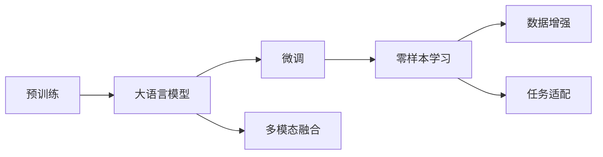
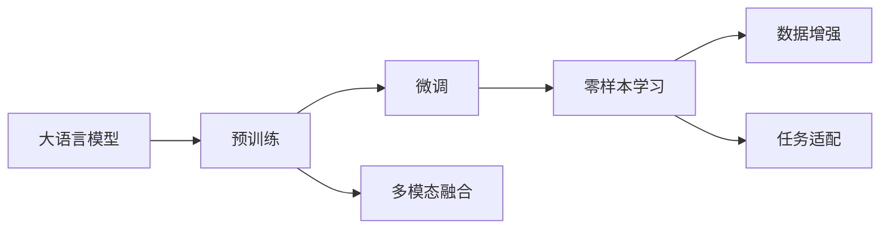
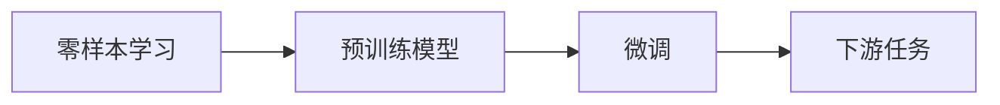
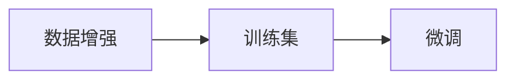

                 

# 大模型在低抽象层次任务中的表现

> 关键词：大语言模型, 低抽象层次任务, 零样本学习, 预训练-微调, 任务适配, 深度学习, 数据增强

## 1. 背景介绍

### 1.1 问题由来

近年来，随着深度学习技术的快速发展，基于大语言模型(Large Language Model, LLM)的预训练-微调技术在自然语言处理(Natural Language Processing, NLP)领域取得了显著突破。大规模预训练语言模型（如BERT、GPT-3等）在各种复杂抽象层次的NLP任务上，如问答、机器翻译、情感分析等，表现出色。然而，这些模型在低抽象层次的任务（如拼写纠错、代词指代、语音识别等）上的效果通常较差。究其原因，是因为低抽象层次任务通常数据规模较小，标签标注成本高，预训练模型往往难以很好地适应。

### 1.2 问题核心关键点

解决低抽象层次任务的关键在于如何更好地利用大模型已有的知识，以及如何有效地微调这些知识以适应新的数据和任务。目前主流的方法包括：

1. **零样本学习(Zero-shot Learning)**：利用预训练模型理解任务描述，直接在少量或不标注样本上执行任务。
2. **预训练-微调(Pre-training & Fine-tuning)**：在预训练的基础上，通过有监督学习优化模型在特定任务上的性能。
3. **数据增强(Data Augmentation)**：通过对训练样本进行改写、噪声注入等操作，丰富训练数据的多样性。
4. **任务适配(Task Adaptation)**：设计合适的任务适配层，将预训练模型转换为特定任务的模型。

### 1.3 问题研究意义

探讨大模型在低抽象层次任务中的表现，对于提升大模型在更多场景下的适用性和效果具有重要意义：

1. **降低应用成本**：低抽象层次任务通常数据规模较小，标注成本高。通过利用大模型的预训练知识，可以减少标注需求，降低开发和部署成本。
2. **提高模型效果**：大模型在复杂抽象层次任务上的优秀表现，通过零样本学习、数据增强等方法，可以迁移到低抽象层次任务，提升模型效果。
3. **加速技术落地**：低抽象层次任务在工业界有广泛应用，如语音识别、拼写纠错等。掌握大模型在低抽象层次任务上的表现，有助于加速相关技术的产业化进程。
4. **促进技术创新**：低抽象层次任务的复杂性和多样性，推动了大模型在零样本学习、多模态融合、推理能力等方面的研究。
5. **拓展应用边界**：大模型在低抽象层次任务上的表现，可以推动其在更多实际应用中的部署，如智能客服、智能家居、物联网等领域。

## 2. 核心概念与联系

### 2.1 核心概念概述

为更好地理解大模型在低抽象层次任务中的表现，本节将介绍几个密切相关的核心概念：

- **大语言模型(Large Language Model, LLM)**：如BERT、GPT等大规模预训练语言模型，具备强大的语言理解和生成能力。
- **预训练(Pre-training)**：指在大规模无标签文本语料上，通过自监督学习任务训练通用语言模型的过程。
- **微调(Fine-tuning)**：指在预训练模型的基础上，使用下游任务的少量标注数据，通过有监督学习优化模型在该任务上的性能。
- **零样本学习(Zero-shot Learning)**：利用预训练模型理解任务描述，直接在少量或不标注样本上执行任务。
- **任务适配(Task Adaptation)**：通过设计合适的任务适配层，将预训练模型转换为特定任务的模型。
- **数据增强(Data Augmentation)**：通过对训练样本进行改写、噪声注入等操作，丰富训练数据的多样性。
- **多模态融合(Multi-modal Fusion)**：将视觉、语音等多模态信息与文本信息结合，提升模型对现实世界的理解和建模能力。

这些概念之间的逻辑关系可以通过以下Mermaid流程图来展示：



这个流程图展示了大语言模型从预训练到微调，再到零样本学习、数据增强、任务适配和多模态融合的整体架构，及其在低抽象层次任务中的应用。

### 2.2 概念间的关系

这些核心概念之间存在着紧密的联系，形成了大语言模型在低抽象层次任务中的完整应用框架。下面我们通过几个Mermaid流程图来展示这些概念之间的关系。

#### 2.2.1 大语言模型的学习范式



这个流程图展示了从预训练到微调，再到零样本学习、数据增强、任务适配和多模态融合的过程。

#### 2.2.2 零样本学习与微调的关系



这个流程图展示了零样本学习与微调的关系。零样本学习可以利用预训练模型理解任务描述，直接在少量或不标注样本上执行任务，而微调则是在预训练的基础上，通过有监督学习优化模型在特定任务上的性能。

#### 2.2.3 数据增强与微调的关系



这个流程图展示了数据增强与微调的关系。数据增强可以通过改写、噪声注入等操作，丰富训练数据的多样性，提高模型的泛化能力，从而更好地适应下游任务。

## 3. 核心算法原理 & 具体操作步骤

### 3.1 算法原理概述

大语言模型在低抽象层次任务中的表现，通常通过预训练-微调(Pre-training & Fine-tuning)和零样本学习(Zero-shot Learning)两种方法来实现。

#### 预训练-微调方法

预训练-微调方法的基本原理如下：

1. **预训练**：在大规模无标签文本数据上，通过自监督学习任务训练通用语言模型，学习语言的通用表示。
2. **微调**：在预训练模型的基础上，使用下游任务的少量标注数据，通过有监督学习优化模型在特定任务上的性能。
3. **任务适配**：设计合适的任务适配层，将预训练模型转换为特定任务的模型。

预训练-微调方法的具体步骤如下：

1. **数据准备**：准备下游任务的少量标注数据集，并将其分为训练集、验证集和测试集。
2. **模型初始化**：选择预训练模型作为初始化参数，如BERT、GPT等。
3. **任务适配**：根据任务类型，在预训练模型顶层设计合适的输出层和损失函数。
4. **微调训练**：使用训练集对模型进行有监督学习，最小化任务损失函数。
5. **验证评估**：在验证集上评估模型性能，根据验证结果调整超参数。
6. **测试部署**：在测试集上评估微调后的模型性能，并部署到实际应用中。

#### 零样本学习方法

零样本学习方法的基本原理如下：

1. **理解任务**：利用预训练模型理解任务描述，生成一种合适的输入格式。
2. **执行任务**：使用预训练模型和生成的输入格式，直接在少量或不标注样本上执行任务。

零样本学习方法的具体步骤如下：

1. **任务描述**：准备下游任务的任务描述，如“将英文翻译成中文”。
2. **生成输入**：利用预训练模型生成合适的输入格式，如“Translate: <input> to Chinese”。
3. **执行任务**：将生成的输入格式输入预训练模型，得到任务的输出结果。

### 3.2 算法步骤详解

下面详细讲解预训练-微调和零样本学习的具体操作步骤：

#### 预训练-微调方法的具体操作步骤

1. **数据准备**：
   - 准备下游任务的少量标注数据集，将其分为训练集、验证集和测试集。
   - 确保标注数据集与预训练数据集的分布不要差异过大。

2. **模型初始化**：
   - 选择预训练模型作为初始化参数，如BERT、GPT等。
   - 冻结预训练模型的底层，只微调顶层参数。

3. **任务适配**：
   - 根据任务类型，在预训练模型顶层设计合适的输出层和损失函数。
   - 对于分类任务，通常在顶层添加线性分类器和交叉熵损失函数。
   - 对于生成任务，通常使用语言模型的解码器输出概率分布，并以负对数似然为损失函数。

4. **微调训练**：
   - 使用训练集对模型进行有监督学习，最小化任务损失函数。
   - 设置合适的学习率、批大小、迭代轮数等超参数。
   - 使用AdamW等优化算法，更新模型参数。
   - 周期性在验证集上评估模型性能，根据验证结果调整学习率或参数。

5. **验证评估**：
   - 在验证集上评估模型性能，计算精度、召回率、F1分数等指标。
   - 根据验证结果调整模型参数或学习率，防止过拟合。

6. **测试部署**：
   - 在测试集上评估微调后的模型性能，与原始模型进行对比。
   - 将微调后的模型部署到实际应用中，进行推理预测。
   - 持续收集新数据，定期重新微调模型，以适应数据分布的变化。

#### 零样本学习方法的具体操作步骤

1. **任务描述准备**：
   - 准备下游任务的任务描述，如“将英文翻译成中文”。
   - 任务描述应简短、清晰，尽可能包含任务的关键词。

2. **生成输入格式**：
   - 利用预训练模型生成合适的输入格式。
   - 对于翻译任务，可以使用“Translate: <input> to <target_language>”格式。
   - 对于文本分类任务，可以使用“Classify: <input> as <label>”格式。

3. **执行任务**：
   - 将生成的输入格式输入预训练模型，得到任务的输出结果。
   - 根据输出结果，进行进一步的推理或决策。

### 3.3 算法优缺点

预训练-微调和零样本学习方法各有优缺点：

#### 预训练-微调方法的优点

1. **简单易用**：预训练-微调方法操作简便，只需准备少量标注数据，即可对预训练模型进行快速适配，获得较大的性能提升。
2. **通用适用**：适用于各种NLP下游任务，包括分类、匹配、生成等，设计简单的任务适配层即可实现微调。
3. **效果显著**：在学术界和工业界的诸多任务上，基于微调的方法已经刷新了最先进的性能指标。

#### 预训练-微调方法的缺点

1. **依赖标注数据**：微调的效果很大程度上取决于标注数据的质量和数量，获取高质量标注数据的成本较高。
2. **迁移能力有限**：当目标任务与预训练数据的分布差异较大时，微调的性能提升有限。
3. **负面效果传递**：预训练模型的固有偏见、有害信息等，可能通过微调传递到下游任务，造成负面影响。
4. **可解释性不足**：微调模型的决策过程通常缺乏可解释性，难以对其推理逻辑进行分析和调试。

#### 零样本学习的优点

1. **无需标注数据**：零样本学习无需标注数据，利用预训练模型理解任务描述，直接在少量或不标注样本上执行任务。
2. **灵活性高**：零样本学习可以在各种任务上应用，不受数据标注的限制。
3. **结果准确**：零样本学习在许多任务上取得了与有监督学习相媲美的效果。

#### 零样本学习的缺点

1. **任务描述复杂**：零样本学习对任务描述的要求较高，需要设计合适的输入格式。
2. **依赖预训练模型**：零样本学习的效果很大程度上取决于预训练模型的能力，预训练模型的泛化能力不足时，零样本学习的效果也会受到影响。
3. **难以应对复杂任务**：对于一些复杂的任务，零样本学习的效果可能不尽如人意。

### 3.4 算法应用领域

预训练-微调和零样本学习方法已经在各种NLP任务中得到应用，以下是几个典型的应用领域：

1. **问答系统**：利用预训练模型和生成的输入格式，将问题-答案对作为微调数据，训练模型学习匹配答案。
2. **翻译系统**：使用预训练模型和生成的输入格式，直接在少量或不标注样本上执行翻译任务。
3. **文本分类**：将文本-标签对作为微调数据，训练模型学习文本-标签映射。
4. **命名实体识别**：将文本-实体对作为微调数据，训练模型识别文本中的特定实体。
5. **关系抽取**：将实体-关系三元组作为微调数据，训练模型学习实体之间的语义关系。
6. **对话系统**：将对话历史作为上下文，微调模型进行回复生成。

除了上述这些经典任务外，预训练-微调和零样本学习方法还在更多场景中得到应用，如可控文本生成、常识推理、代码生成、数据增强等，为NLP技术带来了全新的突破。

## 4. 数学模型和公式 & 详细讲解 & 举例说明

### 4.1 数学模型构建

本节将使用数学语言对预训练-微调和零样本学习的方法进行更加严格的刻画。

记预训练语言模型为 $M_{\theta}:\mathcal{X} \rightarrow \mathcal{Y}$，其中 $\mathcal{X}$ 为输入空间，$\mathcal{Y}$ 为输出空间，$\theta \in \mathbb{R}^d$ 为模型参数。假设微调任务的训练集为 $D=\{(x_i,y_i)\}_{i=1}^N, x_i \in \mathcal{X}, y_i \in \mathcal{Y}$。

定义模型 $M_{\theta}$ 在数据样本 $(x,y)$ 上的损失函数为 $\ell(M_{\theta}(x),y)$，则在数据集 $D$ 上的经验风险为：

$$
\mathcal{L}(\theta) = \frac{1}{N} \sum_{i=1}^N \ell(M_{\theta}(x_i),y_i)
$$

微调的优化目标是最小化经验风险，即找到最优参数：

$$
\theta^* = \mathop{\arg\min}_{\theta} \mathcal{L}(\theta)
$$

在实践中，我们通常使用基于梯度的优化算法（如SGD、Adam等）来近似求解上述最优化问题。设 $\eta$ 为学习率，$\lambda$ 为正则化系数，则参数的更新公式为：

$$
\theta \leftarrow \theta - \eta \nabla_{\theta}\mathcal{L}(\theta) - \eta\lambda\theta
$$

其中 $\nabla_{\theta}\mathcal{L}(\theta)$ 为损失函数对参数 $\theta$ 的梯度，可通过反向传播算法高效计算。

### 4.2 公式推导过程

以下我们以二分类任务为例，推导交叉熵损失函数及其梯度的计算公式。

假设模型 $M_{\theta}$ 在输入 $x$ 上的输出为 $\hat{y}=M_{\theta}(x) \in [0,1]$，表示样本属于正类的概率。真实标签 $y \in \{0,1\}$。则二分类交叉熵损失函数定义为：

$$
\ell(M_{\theta}(x),y) = -[y\log \hat{y} + (1-y)\log (1-\hat{y})]
$$

将其代入经验风险公式，得：

$$
\mathcal{L}(\theta) = -\frac{1}{N}\sum_{i=1}^N [y_i\log M_{\theta}(x_i)+(1-y_i)\log(1-M_{\theta}(x_i))]
$$

根据链式法则，损失函数对参数 $\theta_k$ 的梯度为：

$$
\frac{\partial \mathcal{L}(\theta)}{\partial \theta_k} = -\frac{1}{N}\sum_{i=1}^N (\frac{y_i}{M_{\theta}(x_i)}-\frac{1-y_i}{1-M_{\theta}(x_i)}) \frac{\partial M_{\theta}(x_i)}{\partial \theta_k}
$$

其中 $\frac{\partial M_{\theta}(x_i)}{\partial \theta_k}$ 可进一步递归展开，利用自动微分技术完成计算。

在得到损失函数的梯度后，即可带入参数更新公式，完成模型的迭代优化。重复上述过程直至收敛，最终得到适应下游任务的最优模型参数 $\theta^*$。

### 4.3 案例分析与讲解

下面我们以命名实体识别(NER)任务为例，给出使用Transformers库对BERT模型进行微调的PyTorch代码实现。

首先，定义NER任务的数据处理函数：

```python
from transformers import BertTokenizer
from torch.utils.data import Dataset
import torch

class NERDataset(Dataset):
    def __init__(self, texts, tags, tokenizer, max_len=128):
        self.texts = texts
        self.tags = tags
        self.tokenizer = tokenizer
        self.max_len = max_len
        
    def __len__(self):
        return len(self.texts)
    
    def __getitem__(self, item):
        text = self.texts[item]
        tags = self.tags[item]
        
        encoding = self.tokenizer(text, return_tensors='pt', max_length=self.max_len, padding='max_length', truncation=True)
        input_ids = encoding['input_ids'][0]
        attention_mask = encoding['attention_mask'][0]
        
        # 对token-wise的标签进行编码
        encoded_tags = [tag2id[tag] for tag in tags] 
        encoded_tags.extend([tag2id['O']] * (self.max_len - len(encoded_tags)))
        labels = torch.tensor(encoded_tags, dtype=torch.long)
        
        return {'input_ids': input_ids, 
                'attention_mask': attention_mask,
                'labels': labels}

# 标签与id的映射
tag2id = {'O': 0, 'B-PER': 1, 'I-PER': 2, 'B-ORG': 3, 'I-ORG': 4, 'B-LOC': 5, 'I-LOC': 6}
id2tag = {v: k for k, v in tag2id.items()}

# 创建dataset
tokenizer = BertTokenizer.from_pretrained('bert-base-cased')

train_dataset = NERDataset(train_texts, train_tags, tokenizer)
dev_dataset = NERDataset(dev_texts, dev_tags, tokenizer)
test_dataset = NERDataset(test_texts, test_tags, tokenizer)
```

然后，定义模型和优化器：

```python
from transformers import BertForTokenClassification, AdamW

model = BertForTokenClassification.from_pretrained('bert-base-cased', num_labels=len(tag2id))

optimizer = AdamW(model.parameters(), lr=2e-5)
```

接着，定义训练和评估函数：

```python
from torch.utils.data import DataLoader
from tqdm import tqdm
from sklearn.metrics import classification_report

device = torch.device('cuda') if torch.cuda.is_available() else torch.device('cpu')
model.to(device)

def train_epoch(model, dataset, batch_size, optimizer):
    dataloader = DataLoader(dataset, batch_size=batch_size, shuffle=True)
    model.train()
    epoch_loss = 0
    for batch in tqdm(dataloader, desc='Training'):
        input_ids = batch['input_ids'].to(device)
        attention_mask = batch['attention_mask'].to(device)
        labels = batch['labels'].to(device)
        model.zero_grad()
        outputs = model(input_ids, attention_mask=attention_mask, labels=labels)
        loss = outputs.loss
        epoch_loss += loss.item()
        loss.backward()
        optimizer.step()
    return epoch_loss / len(dataloader)

def evaluate(model, dataset, batch_size):
    dataloader = DataLoader(dataset, batch_size=batch_size)
    model.eval()
    preds, labels = [], []
    with torch.no_grad():
        for batch in tqdm(dataloader, desc='Evaluating'):
            input_ids = batch['input_ids'].to(device)
            attention_mask = batch['attention_mask'].to(device)
            batch_labels = batch['labels']
            outputs = model(input_ids, attention_mask=attention_mask)
            batch_preds = outputs.logits.argmax(dim=2).to('cpu').tolist()
            batch_labels = batch_labels.to('cpu').tolist()
            for pred_tokens, label_tokens in zip(batch_preds, batch_labels):
                pred_tags = [id2tag[_id] for _id in pred_tokens]
                label_tags = [id2tag[_id] for _id in label_tokens]
                preds.append(pred_tags[:len(label_tags)])
                labels.append(label_tags)
                
    print(classification_report(labels, preds))
```

最后，启动训练流程并在测试集上评估：

```python
epochs = 5
batch_size = 16

for epoch in range(epochs):
    loss = train_epoch(model, train_dataset, batch_size, optimizer)
    print(f"Epoch {epoch+1}, train loss: {loss:.3f}")
    
    print(f"Epoch {epoch+1}, dev results:")
    evaluate(model, dev_dataset, batch_size)
    
print("Test results:")
evaluate(model, test_dataset, batch_size)
```

以上就是使用PyTorch对BERT进行命名实体识别任务微调的完整代码实现。可以看到，得益于Transformers库的强大封装，我们可以用相对简洁的代码完成BERT模型的加载和微调。

## 5. 项目实践：代码实例和详细解释说明

### 5.1 开发环境搭建

在进行微调实践前，我们需要准备好开发环境。以下是使用Python进行PyTorch开发的环境配置流程：

1. 安装Anaconda：从官网下载并安装Anaconda，用于创建独立的Python环境。

2. 创建并激活虚拟环境：
```bash
conda create -n pytorch-env python=3.8 
conda activate pytorch-env
```

3. 安装PyTorch：根据CUDA版本，从官网获取对应的安装命令。例如：
```bash
conda install pytorch torchvision torchaudio cudatoolkit=11.1 -c pytorch -c conda-forge
```

4. 安装Transformers库：
```bash
pip install transformers
```

5. 安装各类工具包：
```bash
pip install numpy pandas scikit-learn matplotlib tqdm jupyter notebook ipython
```

完成上述步骤后，即可在`pytorch-env`环境中开始微调实践。

### 5.2 源代码详细实现

下面我们以命名实体识别(NER)任务为例，给出使用Transformers库对BERT模型进行微调的PyTorch代码实现。

首先，定义NER任务的数据处理函数：

```python
from transformers import BertTokenizer
from torch.utils.data import Dataset
import torch

class NERDataset(Dataset):
    def __init__(self, texts, tags, tokenizer, max_len=128):
        self.texts = texts
        self.tags = tags
        self.tokenizer = tokenizer
        self.max_len = max_len
        
    def __len__(self):
        return len(self.texts)
    
    def __getitem__(self, item):
        text = self.texts[item]
        tags = self.tags[item]
        
        encoding = self.tokenizer(text, return_tensors='pt', max_length=self.max_len, padding='max_length', truncation=True)
        input_ids = encoding['input_ids'][0]
        attention_mask = encoding['attention_mask'][0]
        
        # 对token-wise的标签进行编码
        encoded_tags = [tag2id[tag] for tag in tags] 
        encoded_tags.extend([tag2id['O']] * (self.max_len - len(encoded_tags)))
        labels = torch.tensor(encoded_tags, dtype=torch.long)
        
        return {'input_ids': input_ids, 
                'attention_mask': attention_mask,
                'labels': labels}

# 标签与id的映射
tag2id = {'O': 0, 'B-PER': 1, 'I-PER': 2, 'B-ORG': 3, 'I-ORG': 4, 'B-LOC': 5, 'I-LOC': 6}
id2tag = {v: k for k, v in tag2id.items()}

# 创建dataset
tokenizer = BertTokenizer.from_pretrained('bert-base-cased')

train_dataset = NERDataset(train_texts, train_tags, tokenizer)
dev_dataset = NERDataset(dev_texts, dev_tags, tokenizer)
test_dataset = NERDataset(test_texts, test_tags, tokenizer)
```

然后，定义模型和优化器：

```python
from transformers import BertForTokenClassification, AdamW

model = BertForTokenClassification.from_pretrained('bert-base-cased', num_labels=len(tag2id))

optimizer = AdamW(model.parameters(), lr=2e-5)
```

接着，定义训练和评估函数：

```python
from torch.utils.data import DataLoader
from tqdm import tqdm
from sklearn.metrics import classification_report

device = torch.device('cuda') if torch.cuda.is_available() else torch.device('cpu')
model.to(device)

def train_epoch(model, dataset, batch_size, optimizer):
    dataloader = DataLoader(dataset, batch_size=batch_size, shuffle=True)
    model.train()
    epoch_loss = 0


