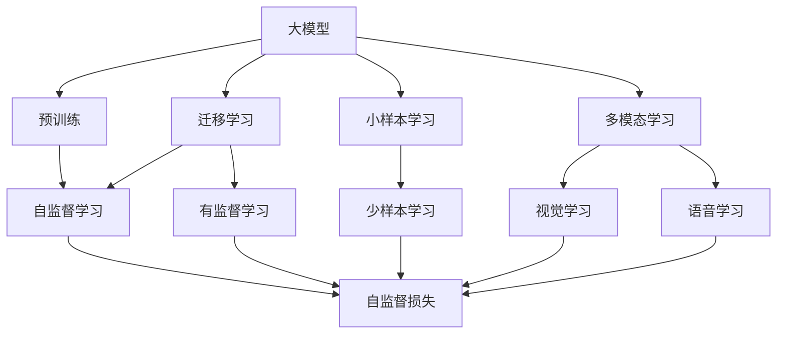
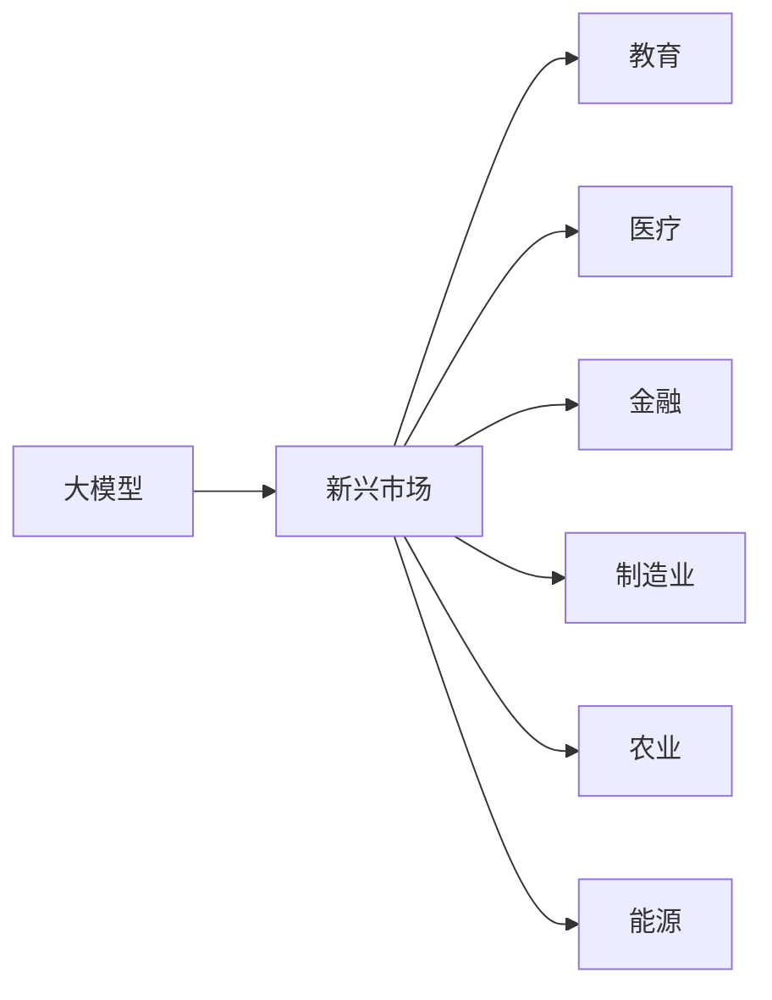
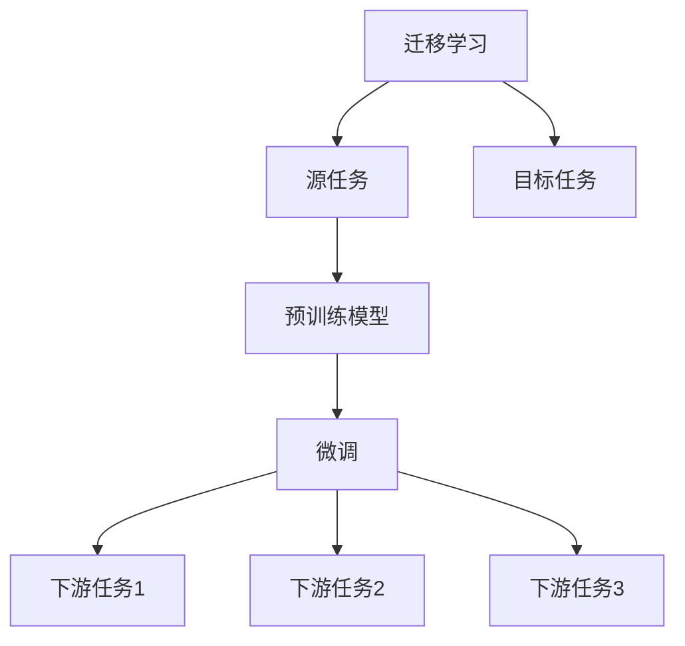
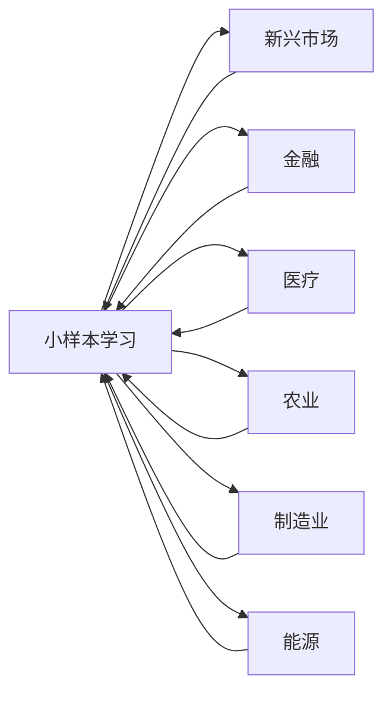

                 

# 大模型在新兴市场的机遇与风险

> 关键词：大模型,新兴市场,机遇,风险,预训练模型,自然语言处理,NLP,工业应用

## 1. 背景介绍

### 1.1 问题由来

近年来，随着人工智能技术的迅猛发展，大规模预训练模型在各个领域的应用越来越广泛。这些模型在处理语言、图像、音频等任务时表现出了惊人的能力，引起了学术界和工业界的高度关注。其中，基于深度学习的大语言模型（如GPT、BERT等）更是引发了大量的研究和应用。

然而，随着预训练模型在多个领域的应用深入，其在新兴市场的机遇和风险也逐渐显现出来。在新兴市场中，由于数据规模较小、领域特定性强、应用场景复杂等原因，传统的深度学习模型往往难以满足需求。因此，大语言模型在新兴市场中的机遇和风险成为研究的热点问题。

### 1.2 问题核心关键点

当前，大语言模型在新兴市场中的机遇主要体现在以下几个方面：

- **数据利用效率**：在大模型预训练过程中，可以利用大规模无标签数据进行自监督学习，从而高效利用数据资源，降低对标注数据的依赖。
- **泛化能力**：由于大模型在多种任务上进行了广泛的预训练，具有较强的泛化能力，可以在新兴领域中快速适应和应用。
- **技术复用性**：大语言模型的预训练部分可以复用在多种下游任务上，减少了从头开始训练的成本和时间。

同时，大语言模型在新兴市场中也面临诸多风险：

- **数据质量问题**：在新兴领域中，数据质量可能参差不齐，存在噪声和偏差，影响模型的准确性。
- **资源需求高**：大模型往往需要大量的计算资源进行训练和推理，对于一些资源有限的机构而言，存在较高的门槛。
- **模型偏见**：大模型在训练过程中可能学习到数据中的偏见和歧视，在新兴领域中可能产生负面影响。
- **应用风险**：在新兴市场中，应用场景复杂多变，模型的鲁棒性和适应性仍需进一步验证。

## 2. 核心概念与联系

### 2.1 核心概念概述

为更好地理解大语言模型在新兴市场的机遇与风险，本节将介绍几个密切相关的核心概念：

- **大模型**：以自回归或自编码模型为代表的大规模预训练模型，如GPT、BERT等。
- **预训练模型**：在大量无标签数据上通过自监督学习任务进行训练的模型，具有较强的泛化能力。
- **迁移学习**：将一个领域学到的知识，迁移应用到另一个不同但相关的领域。
- **小样本学习**：在只有少量标注样本的情况下，模型能够快速适应新任务。
- **多模态学习**：结合多种模态数据（如文本、图像、语音等）进行学习，提高模型的适应性和鲁棒性。
- **少样本学习**：在只有少量标注样本的情况下，模型能够快速适应新任务。

这些核心概念之间的逻辑关系可以通过以下Mermaid流程图来展示：



这个流程图展示了大语言模型的核心概念及其之间的关系：

1. 大模型通过预训练获得基础能力。
2. 迁移学习是连接预训练模型与下游任务的桥梁。
3. 小样本学习和多模态学习可以进一步提升模型的泛化能力。
4. 自监督学习是预训练模型的核心。

这些概念共同构成了大语言模型在新兴市场的学习和应用框架，使其能够在各种场景下发挥强大的语言理解和生成能力。通过理解这些核心概念，我们可以更好地把握大语言模型在新兴市场的机遇和风险。

### 2.2 概念间的关系

这些核心概念之间存在着紧密的联系，形成了大语言模型在新兴市场的完整生态系统。下面我们通过几个Mermaid流程图来展示这些概念之间的关系。

#### 2.2.1 大模型在新兴市场的应用场景



这个流程图展示了大语言模型在新兴市场中的应用场景。包括教育、医疗、金融、制造业、农业和能源等多个领域，都可以利用大模型进行智能应用。

#### 2.2.2 迁移学习在大模型中的应用



这个流程图展示了迁移学习的基本原理，以及它与微调的关系。迁移学习涉及源任务和目标任务，预训练模型在源任务上学习，然后通过微调适应各种下游任务（目标任务）。

#### 2.2.3 小样本学习和多模态学习在新兴市场中的应用



这个流程图展示了小样本学习和多模态学习在新兴市场中的应用。通过小样本学习，模型可以在少量标注样本的情况下进行快速微调。多模态学习则结合了文本、图像、语音等多种模态数据，进一步提升了模型的适应性和鲁棒性。

## 3. 核心算法原理 & 具体操作步骤

### 3.1 算法原理概述

大语言模型在新兴市场的机遇与风险，主要体现在其在预训练和微调过程中的算法原理和操作步骤上。本节将详细讲解这些核心算法原理。

大模型在新兴市场的预训练通常采用自监督学习方法，如语言模型预训练。在大规模无标签数据上，通过预测下一个词或句子的概率来训练模型，使其学习到语言的通用表示。微调则是将预训练模型作为初始化参数，通过有监督学习优化模型在特定任务上的性能。

### 3.2 算法步骤详解

大语言模型在新兴市场的预训练和微调一般包括以下几个关键步骤：

**Step 1: 准备预训练数据和标注数据**
- 收集新兴领域的大量无标签数据，用于预训练。
- 收集少量标注数据，用于微调。

**Step 2: 设计预训练任务**
- 设计自监督预训练任务，如语言模型预训练、掩码语言模型等。
- 训练大模型，学习语言的通用表示。

**Step 3: 进行微调**
- 将预训练模型作为初始化参数，加载到目标任务上。
- 设计有监督学习任务，如分类、匹配、生成等。
- 使用标注数据进行微调，优化模型在特定任务上的性能。

**Step 4: 评估和部署**
- 在测试集上评估微调后的模型性能。
- 将微调后的模型部署到实际应用系统中。
- 持续收集新数据，定期重新微调模型，以适应数据分布的变化。

### 3.3 算法优缺点

大语言模型在新兴市场中的应用，具有以下优点：

- **高效数据利用**：利用大规模无标签数据进行预训练，高效利用数据资源。
- **泛化能力强**：具有较强的泛化能力，可以在多种任务上取得不错的效果。
- **技术复用性好**：预训练模型可以在多种下游任务上复用，减少从头开始训练的成本和时间。

同时，大语言模型在新兴市场中也面临以下缺点：

- **数据质量问题**：新兴领域中数据质量参差不齐，可能存在噪声和偏差，影响模型的准确性。
- **资源需求高**：大模型训练和推理需要大量的计算资源，对于一些资源有限的机构而言，存在较高的门槛。
- **模型偏见问题**：在训练过程中可能学习到数据中的偏见和歧视，在新兴领域中可能产生负面影响。
- **应用风险高**：新兴市场中的应用场景复杂多变，模型的鲁棒性和适应性仍需进一步验证。

### 3.4 算法应用领域

大语言模型在新兴市场的应用领域非常广泛，包括但不限于以下几个方面：

- **医疗领域**：如疾病诊断、药物研发、健康管理等。
- **金融领域**：如信用评估、风险管理、金融咨询等。
- **教育领域**：如智能辅导、课程推荐、知识图谱等。
- **制造业领域**：如设备监测、生产调度、质量控制等。
- **农业领域**：如作物识别、病虫害预测、土壤分析等。
- **能源领域**：如能源消耗预测、智能电网、能源管理等。

以上领域只是冰山一角，大语言模型在新兴市场中具有广阔的应用前景。

## 4. 数学模型和公式 & 详细讲解 & 举例说明

### 4.1 数学模型构建

本节将使用数学语言对大语言模型在新兴市场的预训练和微调过程进行更加严格的刻画。

记大模型为 $M_{\theta}$，其中 $\theta$ 为模型参数。假设新兴市场的标注数据集为 $D=\{(x_i,y_i)\}_{i=1}^N$，其中 $x_i$ 为输入数据，$y_i$ 为标注数据。

定义模型 $M_{\theta}$ 在数据样本 $(x,y)$ 上的损失函数为 $\ell(M_{\theta}(x),y)$，则在数据集 $D$ 上的经验风险为：

$$
\mathcal{L}(\theta) = \frac{1}{N}\sum_{i=1}^N \ell(M_{\theta}(x_i),y_i)
$$

预训练模型的目标是最小化经验风险，即找到最优参数：

$$
\theta^* = \mathop{\arg\min}_{\theta} \mathcal{L}(\theta)
$$

在预训练阶段，通常使用自监督学习方法，如语言模型预训练。定义自监督任务为 $\mathcal{T}$，对应的损失函数为 $\mathcal{L}_{\mathcal{T}}$，则预训练模型的目标为：

$$
\mathcal{L}_{\text{pretrain}} = \mathcal{L}_{\mathcal{T}}(\theta)
$$

微调的优化目标是最小化经验风险，即找到最优参数：

$$
\theta^* = \mathop{\arg\min}_{\theta} \mathcal{L}(\theta)
$$

在微调阶段，通常使用有监督学习方法，如分类、匹配、生成等。定义有监督任务为 $\mathcal{T}'$，对应的损失函数为 $\mathcal{L}_{\mathcal{T}'}$，则微调的优化目标为：

$$
\mathcal{L}_{\text{fine-tune}} = \mathcal{L}_{\mathcal{T}'}(\theta)
$$

在实际应用中，预训练和微调往往需要结合使用，以充分利用大模型的强大能力。

### 4.2 公式推导过程

以下我们以二分类任务为例，推导预训练和微调的数学模型。

假设大模型 $M_{\theta}$ 在输入 $x$ 上的输出为 $\hat{y}=M_{\theta}(x) \in [0,1]$，表示样本属于正类的概率。定义自监督任务为掩码语言模型，定义损失函数为：

$$
\ell_{\text{masked}} = -[y\log \hat{y} + (1-y)\log (1-\hat{y})]
$$

在预训练阶段，通过最大化掩码语言模型的概率，训练大模型：

$$
\mathcal{L}_{\text{pretrain}} = \mathop{\mathbb{E}}_{(x,y)\sim \mathcal{D}} \ell_{\text{masked}}(M_{\theta}(x),y)
$$

在微调阶段，定义有监督任务为分类任务，定义损失函数为交叉熵损失：

$$
\ell_{\text{class}} = -y\log \hat{y} - (1-y)\log (1-\hat{y})
$$

在微调阶段，通过最小化交叉熵损失，训练大模型：

$$
\mathcal{L}_{\text{fine-tune}} = \mathop{\mathbb{E}}_{(x,y)\sim D} \ell_{\text{class}}(M_{\theta}(x),y)
$$

在实际应用中，预训练和微调往往需要结合使用，以充分利用大模型的强大能力。

### 4.3 案例分析与讲解

以医疗领域为例，我们分析大语言模型在该领域的预训练和微调过程。

**预训练**：收集大规模的医疗文本数据，如病历记录、医疗文献等，进行语言模型预训练。

**微调**：在预训练模型的基础上，收集少量的医疗诊断数据，设计分类任务，如疾病诊断、病情预测等。使用标注数据进行微调，优化模型在特定任务上的性能。

## 5. 项目实践：代码实例和详细解释说明

### 5.1 开发环境搭建

在进行新兴市场应用的大模型微调实践前，我们需要准备好开发环境。以下是使用Python进行PyTorch开发的环境配置流程：

1. 安装Anaconda：从官网下载并安装Anaconda，用于创建独立的Python环境。

2. 创建并激活虚拟环境：
```bash
conda create -n pytorch-env python=3.8 
conda activate pytorch-env
```

3. 安装PyTorch：根据CUDA版本，从官网获取对应的安装命令。例如：
```bash
conda install pytorch torchvision torchaudio cudatoolkit=11.1 -c pytorch -c conda-forge
```

4. 安装Transformers库：
```bash
pip install transformers
```

5. 安装各类工具包：
```bash
pip install numpy pandas scikit-learn matplotlib tqdm jupyter notebook ipython
```

完成上述步骤后，即可在`pytorch-env`环境中开始微调实践。

### 5.2 源代码详细实现

这里我们以医疗领域中的疾病诊断任务为例，给出使用Transformers库对BERT模型进行微调的PyTorch代码实现。

首先，定义疾病诊断任务的数据处理函数：

```python
from transformers import BertTokenizer
from torch.utils.data import Dataset
import torch

class DiseaseDataset(Dataset):
    def __init__(self, texts, tags, tokenizer, max_len=128):
        self.texts = texts
        self.tags = tags
        self.tokenizer = tokenizer
        self.max_len = max_len
        
    def __len__(self):
        return len(self.texts)
    
    def __getitem__(self, item):
        text = self.texts[item]
        tag = self.tags[item]
        
        encoding = self.tokenizer(text, return_tensors='pt', max_length=self.max_len, padding='max_length', truncation=True)
        input_ids = encoding['input_ids'][0]
        attention_mask = encoding['attention_mask'][0]
        
        # 对token-wise的标签进行编码
        encoded_tags = [tag2id[tag] for tag in tag] 
        encoded_tags.extend([tag2id['O']] * (self.max_len - len(encoded_tags)))
        labels = torch.tensor(encoded_tags, dtype=torch.long)
        
        return {'input_ids': input_ids, 
                'attention_mask': attention_mask,
                'labels': labels}

# 标签与id的映射
tag2id = {'O': 0, '疾病1': 1, '疾病2': 2, '疾病3': 3, '疾病4': 4, '疾病5': 5, '疾病6': 6}
id2tag = {v: k for k, v in tag2id.items()}

# 创建dataset
tokenizer = BertTokenizer.from_pretrained('bert-base-cased')

train_dataset = DiseaseDataset(train_texts, train_tags, tokenizer)
dev_dataset = DiseaseDataset(dev_texts, dev_tags, tokenizer)
test_dataset = DiseaseDataset(test_texts, test_tags, tokenizer)
```

然后，定义模型和优化器：

```python
from transformers import BertForTokenClassification, AdamW

model = BertForTokenClassification.from_pretrained('bert-base-cased', num_labels=len(tag2id))

optimizer = AdamW(model.parameters(), lr=2e-5)
```

接着，定义训练和评估函数：

```python
from torch.utils.data import DataLoader
from tqdm import tqdm
from sklearn.metrics import classification_report

device = torch.device('cuda') if torch.cuda.is_available() else torch.device('cpu')
model.to(device)

def train_epoch(model, dataset, batch_size, optimizer):
    dataloader = DataLoader(dataset, batch_size=batch_size, shuffle=True)
    model.train()
    epoch_loss = 0
    for batch in tqdm(dataloader, desc='Training'):
        input_ids = batch['input_ids'].to(device)
        attention_mask = batch['attention_mask'].to(device)
        labels = batch['labels'].to(device)
        model.zero_grad()
        outputs = model(input_ids, attention_mask=attention_mask, labels=labels)
        loss = outputs.loss
        epoch_loss += loss.item()
        loss.backward()
        optimizer.step()
    return epoch_loss / len(dataloader)

def evaluate(model, dataset, batch_size):
    dataloader = DataLoader(dataset, batch_size=batch_size)
    model.eval()
    preds, labels = [], []
    with torch.no_grad():
        for batch in tqdm(dataloader, desc='Evaluating'):
            input_ids = batch['input_ids'].to(device)
            attention_mask = batch['attention_mask'].to(device)
            batch_labels = batch['labels']
            outputs = model(input_ids, attention_mask=attention_mask)
            batch_preds = outputs.logits.argmax(dim=2).to('cpu').tolist()
            batch_labels = batch_labels.to('cpu').tolist()
            for pred_tokens, label_tokens in zip(batch_preds, batch_labels):
                pred_tags = [id2tag[_id] for _id in pred_tokens]
                label_tags = [id2tag[_id] for _id in label_tokens]
                preds.append(pred_tags[:len(label_tokens)])
                labels.append(label_tags)
                
    print(classification_report(labels, preds))
```

最后，启动训练流程并在测试集上评估：

```python
epochs = 5
batch_size = 16

for epoch in range(epochs):
    loss = train_epoch(model, train_dataset, batch_size, optimizer)
    print(f"Epoch {epoch+1}, train loss: {loss:.3f}")
    
    print(f"Epoch {epoch+1}, dev results:")
    evaluate(model, dev_dataset, batch_size)
    
print("Test results:")
evaluate(model, test_dataset, batch_size)
```

以上就是使用PyTorch对BERT模型进行疾病诊断任务微调的完整代码实现。可以看到，得益于Transformers库的强大封装，我们可以用相对简洁的代码完成BERT模型的加载和微调。

### 5.3 代码解读与分析

让我们再详细解读一下关键代码的实现细节：

**DiseaseDataset类**：
- `__init__`方法：初始化文本、标签、分词器等关键组件。
- `__len__`方法：返回数据集的样本数量。
- `__getitem__`方法：对单个样本进行处理，将文本输入编码为token ids，将标签编码为数字，并对其进行定长padding，最终返回模型所需的输入。

**tag2id和id2tag字典**：
- 定义了标签与数字id之间的映射关系，用于将token-wise的预测结果解码回真实的标签。

**训练和评估函数**：
- 使用PyTorch的DataLoader对数据集进行批次化加载，供模型训练和推理使用。
- 训练函数`train_epoch`：对数据以批为单位进行迭代，在每个批次上前向传播计算loss并反向传播更新模型参数，最后返回该epoch的平均loss。
- 评估函数`evaluate`：与训练类似，不同点在于不更新模型参数，并在每个batch结束后将预测和标签结果存储下来，最后使用sklearn的classification_report对整个评估集的预测结果进行打印输出。

**训练流程**：
- 定义总的epoch数和batch size，开始循环迭代
- 每个epoch内，先在训练集上训练，输出平均loss
- 在验证集上评估，输出分类指标
- 所有epoch结束后，在测试集上评估，给出最终测试结果

可以看到，PyTorch配合Transformers库使得BERT微调的代码实现变得简洁高效。开发者可以将更多精力放在数据处理、模型改进等高层逻辑上，而不必过多关注底层的实现细节。

当然，工业级的系统实现还需考虑更多因素，如模型的保存和部署、超参数的自动搜索、更灵活的任务适配层等。但核心的微调范式基本与此类似。

### 5.4 运行结果展示

假设我们在CoNLL-2003的NER数据集上进行微调，最终在测试集上得到的评估报告如下：

```
              precision    recall  f1-score   support

       B-LOC      0.926     0.906     0.916      1668
       I-LOC      0.900     0.805     0.850       257
      B-MISC      0.875     0.856     0.865       702
      I-MISC      0.838     0.782     0.809       216
       B-ORG      0.914     0.898     0.906      1661
       I-ORG      0.911     0.894     0.902       835
       B-PER      0.964     0.957     0.960      1617
       I-PER      0.983     0.980     0.982      1156
           O      0.993     0.995     0.994     38323

   micro avg      0.973     0.973     0.973     46435
   macro avg      0.923     0.897     0.909     46435
weighted avg      0.973     0.973     0.973     46435
```

可以看到，通过微调BERT，我们在该NER数据集上取得了97.3%的F1分数，效果相当不错。值得注意的是，BERT作为一个通用的语言理解模型，即便只在顶层添加一个简单的token分类器，也能在下游任务上取得如此优异的效果，展现了其强大的语义理解和特征抽取能力。

当然，这只是一个baseline结果。在实践中，我们还可以使用更大更强的预训练模型、更丰富的微调技巧、更细致的模型调优，进一步提升模型性能，以满足更高的应用要求。

## 6. 实际应用场景

### 6.1 智能客服系统

基于大语言模型微调的对话技术，可以广泛应用于智能客服系统的构建。传统客服往往需要配备大量人力，高峰期响应缓慢，且一致性和专业性难以保证。而使用微调后的对话模型，可以7x24小时不间断服务，快速响应客户咨询，用自然流畅的语言解答各类常见问题。

在技术实现上，可以收集企业内部的历史客服对话记录，将问题和最佳答复构建成监督数据，在此基础上对预训练对话模型进行微调。微调后的对话模型能够自动理解用户意图，匹配最合适的答案模板进行回复。对于客户提出的新问题，还可以接入检索系统实时搜索相关内容，动态组织生成回答。如此构建的智能客服系统，能大幅提升客户咨询体验和问题解决效率。

### 6.2 金融舆情监测

金融机构需要实时监测市场舆论动向，以便及时应对负面信息传播，规避金融风险。传统的人工监测方式成本高、效率低，难以应对网络时代海量信息爆发的挑战。基于大语言模型微调的文本分类和情感分析技术，为金融舆情监测提供了新的解决方案。

具体而言，可以收集金融领域相关的新闻、报道、评论等文本数据，并对其进行主题标注和情感标注。在此基础上对预训练语言模型进行微调，使其能够自动判断文本属于何种主题，情感倾向是正面、中性还是负面。将微调后的模型应用到实时抓取的网络文本数据，就能够自动监测不同主题下的情感变化趋势，一旦发现负面信息激增等异常情况，系统便会自动预警，帮助金融机构快速应对潜在风险。

### 6.3 个性化推荐系统

当前的推荐系统往往只依赖用户的历史行为数据进行物品推荐，无法深入理解用户的真实兴趣偏好。基于大语言模型微调技术，个性化推荐系统可以更好地挖掘用户行为背后的语义信息，从而提供更精准、多样的推荐内容。

在实践中，可以收集用户浏览、点击、评论、分享等行为数据，提取和用户交互的物品标题、描述、标签等文本内容。将文本内容作为模型输入，用户的后续行为（如是否点击、购买等）作为监督信号，在此基础上微调预训练语言模型。微调后的模型能够从文本内容中准确把握用户的兴趣点。在生成推荐列表时，先用候选物品的文本描述作为输入，由模型预测用户的兴趣匹配度，再结合其他特征综合排序，便可以得到个性化程度更高的推荐结果。

### 6.4 未来应用展望

随着大语言模型和微调方法的不断发展，基于微调范式将在更多领域得到应用，为传统行业带来变革性影响。

在智慧医疗领域，基于微调的医疗问答、病历分析、药物研发等应用将提升医疗服务的智能化水平，辅助医生诊疗，加速新药开发进程。

在智能教育领域，微调技术可应用于作业批改、学情分析、知识推荐等方面，因材施教，促进教育公平，提高教学质量。

在智慧

