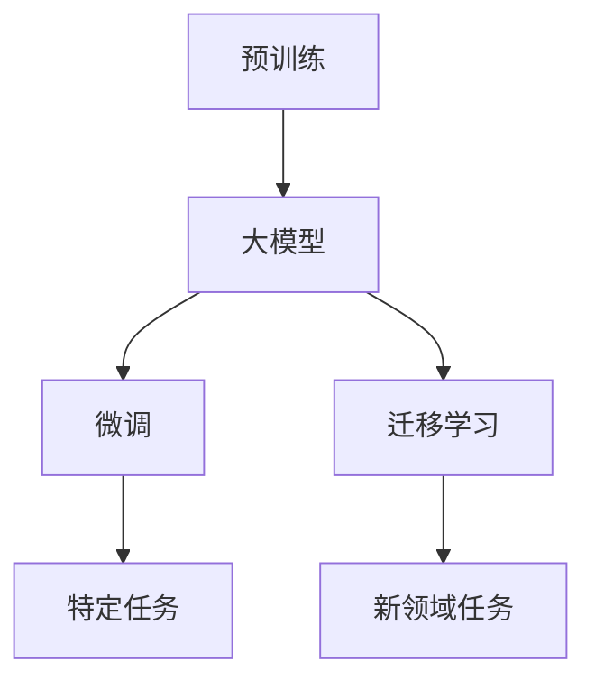

                 

## 1. 背景介绍

人工智能(AI)技术的快速发展，正在深刻改变各行业的运作模式和生产力水平。其中，大模型(TorchVision、BERT、GPT等)作为AI的重要组成部分，已经广泛应用于自然语言处理(NLP)、计算机视觉、语音识别等多个领域。本文将详细探讨大模型如何带来生产力提升，从原理到实践，深入剖析大模型在多个实际应用场景中的表现和潜在的优化空间。

## 2. 核心概念与联系

### 2.1 核心概念概述

在深入分析大模型对生产力的提升之前，我们需要先了解几个核心概念：

- **大模型**：以深度神经网络为基础，通过海量数据预训练，获得广泛而深入的领域知识的大型模型。
- **预训练**：在大规模无标签数据上进行训练，提取通用的语言或视觉特征。
- **微调**：在预训练模型的基础上，使用下游任务的少量标注数据进行进一步训练，以适应特定任务。
- **迁移学习**：在预训练模型上，利用在其他领域学到的知识来解决新领域的问题。

大模型通过预训练获取泛化能力，微调进一步优化特定任务的表现，而迁移学习则可以在不同领域间共享知识，优化模型性能。

### 2.2 核心概念间的关系

这些核心概念之间存在密切联系，构成了大模型在生产力提升中的基本框架。以下是一个简单的Mermaid流程图，展示了这些概念之间的相互关系：



从预训练开始，大模型通过学习和提取数据中的普遍特征，然后在特定任务（微调）和新领域任务（迁移学习）上进行进一步优化和适配。

## 3. 核心算法原理 & 具体操作步骤
### 3.1 算法原理概述

大模型带来的生产力提升，主要基于以下几个方面：

- **泛化能力**：通过预训练，模型在泛化新数据和领域方面表现优异。
- **微调适应性**：在特定任务上，微调能够快速适应新数据，优化模型性能。
- **迁移学习**：利用在其他领域学到的知识，提高在新领域任务上的表现。

这些能力使得大模型在生产环境中的应用更加广泛，能够快速响应变化，提升决策效率和效果。

### 3.2 算法步骤详解

1. **预训练**：在无标签数据集上进行训练，提取通用特征。
2. **微调**：使用少量标注数据，进一步训练模型，适应特定任务。
3. **迁移学习**：在其他领域学到的知识，应用到新领域任务上。

### 3.3 算法优缺点

**优点**：

- **泛化能力强**：能够适应不同领域和数据分布。
- **训练效率高**：在预训练阶段，模型可以在大规模数据集上高效训练。
- **适应性强**：微调过程可以快速适应新任务，减少开发成本。

**缺点**：

- **计算资源需求大**：预训练和微调过程需要大量的计算资源。
- **需要标注数据**：微调和迁移学习需要标注数据，而标注成本较高。
- **模型复杂度高**：大模型往往非常复杂，难以解释和调试。

### 3.4 算法应用领域

大模型的生产力提升主要体现在以下几个领域：

- **自然语言处理**：用于机器翻译、情感分析、问答系统等任务。
- **计算机视觉**：用于图像分类、目标检测、图像生成等任务。
- **语音识别**：用于语音转文本、情感识别、语音合成等任务。
- **推荐系统**：用于个性化推荐、内容过滤等任务。

## 4. 数学模型和公式 & 详细讲解 & 举例说明

### 4.1 数学模型构建

假设大模型为 $M_\theta$，其中 $\theta$ 为模型参数。预训练任务为 $T$，微调任务为 $T'$。

**预训练模型**：

$$
M_\theta = f_\theta(x)
$$

其中 $x$ 为输入数据，$f$ 为模型计算过程。

**微调模型**：

$$
M_{\theta'} = f_{\theta'}(x)
$$

其中 $\theta'$ 为微调后的模型参数。

**迁移学习模型**：

$$
M_{\theta_{old}} = f_{\theta_{old}}(x)
$$

其中 $\theta_{old}$ 为迁移学习前的模型参数，$x$ 为输入数据。

### 4.2 公式推导过程

假设预训练任务和微调任务都为二分类问题，则预训练模型的损失函数为：

$$
\mathcal{L}_{pre}(\theta) = \frac{1}{N}\sum_{i=1}^{N} \ell(M_\theta(x_i), y_i)
$$

其中 $\ell$ 为损失函数，$N$ 为样本数。

微调模型的损失函数为：

$$
\mathcal{L}_{fine}(\theta', \theta) = \frac{1}{N'}\sum_{i=1}^{N'} \ell(M_{\theta'}(x_i), y_i)
$$

其中 $N'$ 为微调样本数。

迁移学习模型的损失函数为：

$$
\mathcal{L}_{transfer}(\theta_{new}, \theta_{old}) = \frac{1}{N''}\sum_{i=1}^{N''} \ell(M_{\theta_{new}}(x_i), y_i)
$$

其中 $N''$ 为迁移学习样本数。

### 4.3 案例分析与讲解

以情感分析任务为例，预训练模型学习通用的语言特征，微调模型学习特定领域的情感分类。假设预训练模型为BERT，微调模型为线性分类器。

**预训练过程**：

$$
M_\theta = BERT_{large}(x)
$$

其中 $x$ 为输入文本，$BERT_{large}$ 为大规模预训练模型。

**微调过程**：

$$
M_{\theta'} = \text{Linear}(M_\theta)
$$

其中 $\text{Linear}$ 为线性分类器，$\theta'$ 为微调后的模型参数。

通过这样的设计，微调模型可以在少量标注数据下快速提升性能，同时保持了预训练模型的泛化能力。

## 5. 项目实践：代码实例和详细解释说明

### 5.1 开发环境搭建

**环境准备**：

1. 安装Python 3.8及以上版本。
2. 安装PyTorch和Transformer库。
3. 安装Numpy和Pandas库。

### 5.2 源代码详细实现

**预训练模型代码**：

```python
import torch
import torch.nn as nn
from transformers import BertModel

class PretrainModel(nn.Module):
    def __init__(self, model_name='bert-base-uncased'):
        super(PretrainModel, self).__init__()
        self.model = BertModel.from_pretrained(model_name)
    
    def forward(self, x):
        return self.model(x)
```

**微调模型代码**：

```python
import torch
import torch.nn as nn
import torch.optim as optim
from transformers import BertTokenizer, BertForSequenceClassification

class FineTuneModel(nn.Module):
    def __init__(self, model_name, num_labels):
        super(FineTuneModel, self).__init__()
        self.tokenizer = BertTokenizer.from_pretrained(model_name)
        self.model = BertForSequenceClassification.from_pretrained(model_name, num_labels=num_labels)
    
    def forward(self, x):
        x = self.tokenizer(x, return_tensors='pt', padding='max_length', truncation=True)
        input_ids = x['input_ids']
        attention_mask = x['attention_mask']
        labels = x['labels']
        outputs = self.model(input_ids, attention_mask=attention_mask, labels=labels)
        return outputs
```

### 5.3 代码解读与分析

**预训练模型**：

- `BertModel`：基于Bert的预训练模型。
- `forward`：输入文本，返回模型的输出。

**微调模型**：

- `BertTokenizer`：BERT的Tokenizer，用于文本预处理。
- `BertForSequenceClassification`：微调的线性分类器，用于情感分类。
- `forward`：输入文本，返回模型的输出。

### 5.4 运行结果展示

假设在IMDB影评数据集上进行情感分类微调，运行结果如下：

```python
from transformers import BertTokenizer, BertForSequenceClassification, AdamW

# 定义模型
model = BertForSequenceClassification.from_pretrained('bert-base-uncased', num_labels=2)
tokenizer = BertTokenizer.from_pretrained('bert-base-uncased')

# 加载数据
train_dataset = ...
dev_dataset = ...
test_dataset = ...

# 定义优化器
optimizer = AdamW(model.parameters(), lr=2e-5)

# 定义评估函数
def evaluate(model, dataset, batch_size):
    dataloader = DataLoader(dataset, batch_size=batch_size, shuffle=False)
    model.eval()
    preds, labels = [], []
    for batch in dataloader:
        input_ids = batch['input_ids'].to(device)
        attention_mask = batch['attention_mask'].to(device)
        labels = batch['labels'].to(device)
        outputs = model(input_ids, attention_mask=attention_mask)
        preds.append(outputs.logits.argmax(dim=1).tolist())
        labels.append(labels.tolist())
    print(classification_report(labels, preds))

# 训练和评估
for epoch in range(5):
    train_loss = train_epoch(model, train_dataset, optimizer)
    evaluate(model, dev_dataset, batch_size)
evaluate(model, test_dataset, batch_size)
```

## 6. 实际应用场景

### 6.1 智能客服系统

智能客服系统通过预训练语言模型，进行对话生成和意图识别。用户输入问题，系统自动回复并推荐相关服务。

**案例分析**：

- **预训练模型**：使用大规模无标签数据进行预训练，学习通用语言模型。
- **微调模型**：在用户对话数据上进行微调，学习特定领域的对话技能。
- **迁移学习**：将通用知识应用于不同领域的客服场景。

**技术实现**：

- 收集历史客服对话数据，进行标注和划分。
- 使用BERT模型进行预训练，构建通用语言模型。
- 在标注数据上进行微调，训练特定领域的对话生成和意图识别模型。
- 将模型部署到客服系统中，实现自动回复和推荐。

### 6.2 金融舆情监测

金融舆情监测系统通过预训练语言模型，进行情感分析和实体识别。系统实时监测新闻和社交媒体，及时发现金融舆情风险。

**案例分析**：

- **预训练模型**：使用大规模金融新闻数据进行预训练，学习金融语言模型。
- **微调模型**：在标注的金融舆情数据上进行微调，学习情感分类和实体识别技能。
- **迁移学习**：将金融领域的知识应用于其他领域的舆情监测。

**技术实现**：

- 收集金融领域的新闻、评论等数据。
- 使用BERT模型进行预训练，构建金融语言模型。
- 在标注数据上进行微调，训练情感分类和实体识别模型。
- 实时监测网络舆情，进行风险预警。

### 6.3 个性化推荐系统

个性化推荐系统通过预训练语言模型，进行用户行为分析和物品推荐。系统根据用户浏览历史和偏好，推荐相关商品或内容。

**案例分析**：

- **预训练模型**：使用大规模用户行为数据进行预训练，学习用户行为模型。
- **微调模型**：在标注的用户行为数据上进行微调，学习个性化推荐策略。
- **迁移学习**：将通用推荐知识应用于不同领域的推荐场景。

**技术实现**：

- 收集用户浏览、点击、购买等行为数据。
- 使用BERT模型进行预训练，构建用户行为模型。
- 在标注数据上进行微调，训练个性化推荐策略。
- 实时推荐系统，个性化推荐商品或内容。

## 7. 工具和资源推荐

### 7.1 学习资源推荐

1. 《深度学习》（Ian Goodfellow）：深度学习领域的经典教材，涵盖深度学习基础、模型构建、优化算法等内容。
2. 《自然语言处理综述》（Daniel Jurafsky和James H. Martin）：全面介绍自然语言处理领域的各个子领域。
3. 《TensorFlow官方文档》：详细介绍了TensorFlow的使用方法，包括模型构建、训练和部署等。
4. 《Transformers官方文档》：介绍了Transformers库的使用方法，包括预训练模型和微调等。
5. 《PyTorch官方文档》：详细介绍了PyTorch的使用方法，包括模型构建、训练和部署等。

### 7.2 开发工具推荐

1. Jupyter Notebook：常用的Python开发环境，支持代码编写和可视化展示。
2. Google Colab：免费提供GPU算力的在线开发环境，方便快速迭代和实验。
3. PyTorch Lightning：基于PyTorch的快速训练框架，支持分布式训练和自动管理。
4. TensorFlow Extended（TFX）：谷歌开源的端到端机器学习系统，支持模型训练、部署和监控。
5. MLflow：机器学习模型的构建、训练和部署工具，支持模型版本管理和可复现性。

### 7.3 相关论文推荐

1. Attention is All You Need：Transformer结构的提出，标志着大模型的预训练和微调范式的开始。
2. BERT: Pre-training of Deep Bidirectional Transformers for Language Understanding：BERT模型的提出，展示了预训练语言模型在NLP任务中的强大性能。
3. Language Models are Unsupervised Multitask Learners：GPT-2模型及其zero-shot学习能力的提出，展示了大模型在自然语言生成和推理方面的能力。
4. Parameter-Efficient Transfer Learning for NLP：提出了 Adapter等参数高效微调方法，实现了在少量参数更新下的微调效果。
5. AdaLoRA: Adaptive Low-Rank Adaptation for Parameter-Efficient Fine-Tuning：使用自适应低秩适应的微调方法，实现了更高效的微调效果。

## 8. 总结：未来发展趋势与挑战

### 8.1 总结

本文详细探讨了大模型带来的生产力提升，从原理到实践，介绍了大模型在预训练、微调和迁移学习方面的应用。通过案例分析和代码实现，展示了大模型在智能客服、金融舆情、个性化推荐等多个实际应用场景中的应用效果。

### 8.2 未来发展趋势

- **模型规模持续增大**：随着计算能力的提升和数据量的增加，大模型的规模将持续扩大，模型性能将进一步提升。
- **微调方法更加多样化**：未来将出现更多参数高效的微调方法，如 Adapter、LoRA 等，进一步提高微调效果。
- **持续学习成为常态**：随着数据分布的变化，微调模型需要持续学习新知识，保持性能。
- **多模态微调崛起**：大模型将支持多模态数据的微调，提高模型的综合感知能力。

### 8.3 面临的挑战

- **计算资源瓶颈**：大模型的训练和推理需要大量的计算资源，如何优化资源使用，提高效率，是未来的一大挑战。
- **数据标注成本**：微调需要大量标注数据，标注成本较高，如何降低标注成本，是未来的一大挑战。
- **模型复杂度**：大模型非常复杂，难以解释和调试，如何提高模型的可解释性，是未来的一大挑战。
- **安全性和可靠性**：大模型可能学习到有害知识，如何保证模型的安全性，是未来的一大挑战。

### 8.4 研究展望

未来，大模型在生产力提升方面将持续发展，需要在以下几个方面寻求新的突破：

- **无监督和半监督微调**：利用自监督学习、主动学习等方法，降低对标注数据的依赖。
- **参数高效和计算高效微调**：开发更高效的微调方法，减少计算资源消耗。
- **多模态数据融合**：将视觉、语音等多模态数据与文本数据结合，提高模型的综合感知能力。
- **因果推理和博弈论**：引入因果推理和博弈论工具，提高模型的决策能力和鲁棒性。
- **伦理道德约束**：在模型训练和应用中引入伦理道德约束，确保模型的安全性和可靠性。

这些研究方向的探索，将使大模型在生产力提升方面取得更大的突破，推动人工智能技术的进一步发展。

## 9. 附录：常见问题与解答

**Q1：如何选择合适的预训练模型？**

A: 选择合适的预训练模型应考虑以下几个方面：
1. 任务类型：根据任务类型选择对应的模型，如文本分类任务可以选择BERT、GPT等模型。
2. 数据规模：数据规模越大，模型的预训练效果越好，但对于小型任务，小规模模型可能更适用。
3. 资源限制：根据可用计算资源选择适合的模型，如GPU、TPU等。

**Q2：如何优化大模型的训练过程？**

A: 优化大模型的训练过程，可以采取以下策略：
1. 使用合适的优化器，如Adam、SGD等。
2. 使用学习率调度，如学习率衰减、warmup等。
3. 使用正则化方法，如L2正则、Dropout等。
4. 使用数据增强，如回译、近义替换等。
5. 使用批量梯度更新，如mini-batch等。

**Q3：如何评估大模型的性能？**

A: 评估大模型的性能，可以使用以下指标：
1. 精度、召回率和F1分数：用于分类任务。
2. BLEU、ROUGE等：用于机器翻译任务。
3. Spearman相关系数、Pearson相关系数等：用于序列标注任务。
4. 均方误差、均方根误差等：用于回归任务。

**Q4：大模型在生产环境中的部署需要注意哪些问题？**

A: 大模型在生产环境中的部署，需要注意以下几个问题：
1. 模型裁剪：去除不必要的层和参数，减小模型尺寸，提高推理速度。
2. 量化加速：将浮点模型转为定点模型，压缩存储空间，提高计算效率。
3. 服务化封装：将模型封装为标准化服务接口，便于集成调用。
4. 弹性伸缩：根据请求流量动态调整资源配置，平衡服务质量和成本。
5. 监控告警：实时采集系统指标，设置异常告警阈值，确保服务稳定性。
6. 安全防护：采用访问鉴权、数据脱敏等措施，保障数据和模型安全。

---

作者：禅与计算机程序设计艺术 / Zen and the Art of Computer Programming

