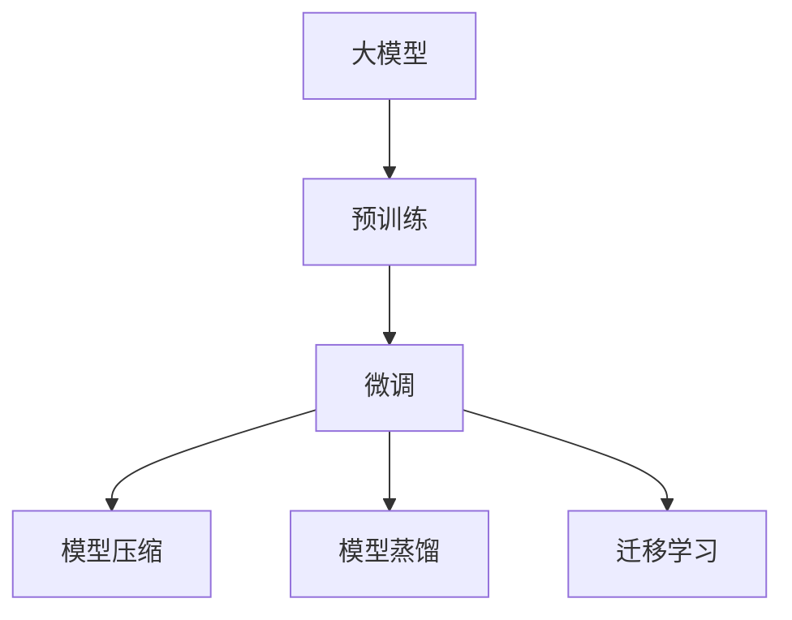
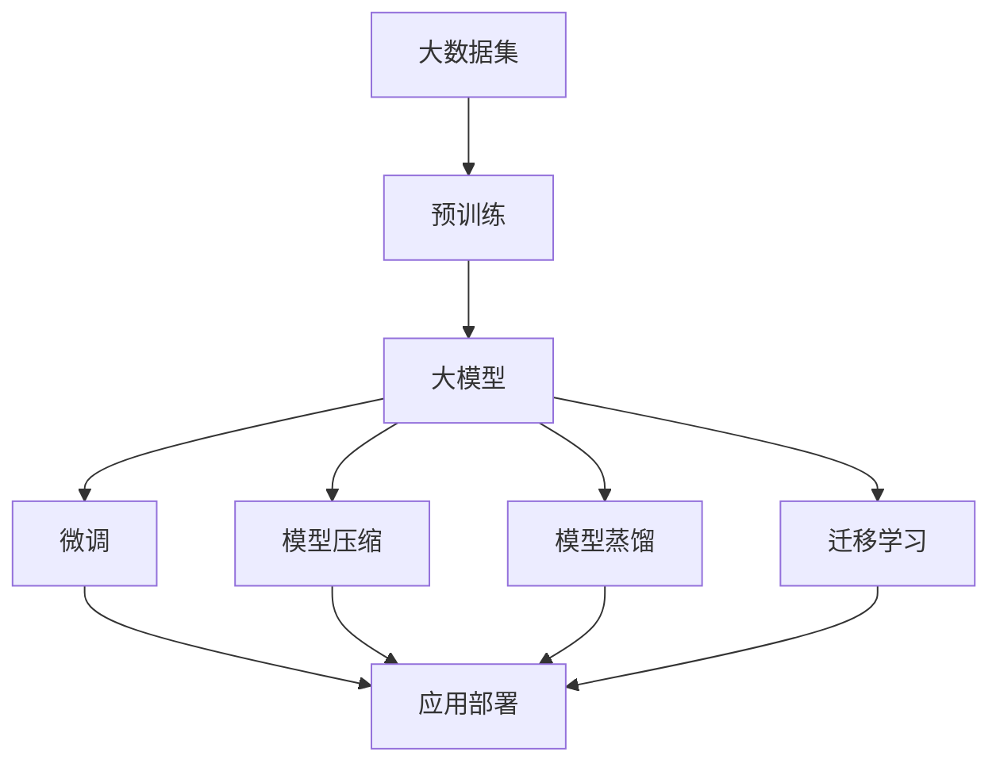

                 

# 大模型应用开发的实战技巧

> 关键词：大模型, 应用开发, 实战技巧, 技术细节, 资源推荐

## 1. 背景介绍

### 1.1 问题由来
随着人工智能(AI)技术的迅猛发展，尤其是深度学习(Deep Learning)的崛起，大模型（Big Models）在各个领域中表现出色，并逐渐成为热点。大模型通常指那些具有数十亿甚至数百亿参数的神经网络，如GPT系列、BERT等。这些模型在图像识别、自然语言处理、推荐系统等多个领域都取得了显著成果，推动了AI技术从实验室走向实际应用。

### 1.2 问题核心关键点
大模型应用开发的难点在于其复杂性、资源需求和效率问题。大模型参数量庞大，对计算资源的需求极高，且训练和推理速度较慢，这限制了其在实际场景中的部署和使用。此外，大模型的预训练和微调过程需要丰富的标注数据，这对于某些应用领域来说可能难以获取。

### 1.3 问题研究意义
掌握大模型的应用开发实战技巧，对于提升AI技术的实际应用水平，降低开发成本，加快AI技术的落地进程具有重要意义。大模型应用开发不仅能够快速实现高精度的预测和推荐，还能为其他AI技术提供基础支持，推动AI技术在更多领域的应用和发展。

## 2. 核心概念与联系

### 2.1 核心概念概述

为更好地理解大模型的应用开发，我们首先介绍一些核心概念：

- **大模型（Big Models）**：指参数量极大的神经网络模型，如GPT、BERT等，具有强大的表征能力和泛化能力。
- **预训练（Pre-training）**：在大量无标签数据上进行自监督学习，以学习通用的语言或图像特征。
- **微调（Fine-tuning）**：在特定任务上对预训练模型进行有监督学习，以优化模型在特定任务上的性能。
- **迁移学习（Transfer Learning）**：将在一个任务上学到的知识迁移到另一个相关任务上，以减少训练成本和提升模型效果。
- **模型压缩（Model Compression）**：通过剪枝、量化等方法，减少模型参数量和计算量，以适应资源限制。
- **模型蒸馏（Model Distillation）**：利用大模型生成的高质量知识，训练一个更小的模型，以提高模型泛化能力。

这些概念在大模型的应用开发过程中起着关键作用，理解它们之间的关系和应用场景，对于开发出高效、准确的大模型应用至关重要。

### 2.2 概念间的关系

这些核心概念之间的逻辑关系可以通过以下Mermaid流程图来展示：



该流程图展示了从预训练到微调，再到模型压缩、蒸馏和迁移学习，大模型的应用开发全流程。预训练和微调是模型训练的核心步骤，模型压缩和蒸馏则是在模型训练完成后对模型进行优化，以适应实际应用场景。迁移学习则是在多个任务之间进行知识的迁移，进一步提升模型性能。

### 2.3 核心概念的整体架构

最后，我们用一个综合的流程图来展示大模型应用开发的整体架构：



这个综合流程图展示了从预训练到应用部署的大模型应用开发全过程。首先，在大数据集上预训练模型，然后通过微调、压缩、蒸馏和迁移学习等技术，提升模型性能和适用性，最后将模型部署到实际应用中。

## 3. 核心算法原理 & 具体操作步骤

### 3.1 算法原理概述
大模型应用开发的核心算法原理包括预训练、微调和迁移学习。以下是对这些核心算法的详细介绍：

#### 3.1.1 预训练
预训练是一种在大规模无标签数据上进行的自监督学习过程，目的是学习通用的特征表示。常见的预训练任务包括自回归语言模型、掩码语言模型等。预训练过程中，模型学习如何从输入中提取特征，并生成高质量的表征，为后续的微调任务奠定基础。

#### 3.1.2 微调
微调是在特定任务上对预训练模型进行有监督学习的过程。微调的目标是使模型在特定任务上取得优异的性能，通常通过在标注数据集上训练模型实现。微调过程中，模型将学习如何在特定任务上利用预训练得到的表征进行预测。

#### 3.1.3 迁移学习
迁移学习是将在一个任务上学到的知识迁移到另一个相关任务上，以减少训练成本和提升模型性能。迁移学习通过在大规模预训练模型的基础上，使用少量的标注数据进行微调，以适应新的任务。常见的迁移学习方法包括微调和细粒度迁移学习（Fine-grained Transfer Learning）。

### 3.2 算法步骤详解

下面详细描述大模型应用开发的具体步骤：

#### 3.2.1 准备数据集
- **数据收集**：收集与目标任务相关的数据集，包括训练集、验证集和测试集。
- **数据预处理**：对数据进行清洗、标注、归一化等预处理操作，以便模型训练。

#### 3.2.2 模型选择与加载
- **模型选择**：根据任务需求选择合适的预训练模型，如BERT、GPT等。
- **模型加载**：使用深度学习框架（如PyTorch、TensorFlow等）加载预训练模型。

#### 3.2.3 微调设置
- **任务适配层设计**：根据任务类型设计任务适配层，如分类任务的线性分类器、生成任务的解码器等。
- **优化器选择**：选择合适的优化器（如AdamW、SGD等），并设置学习率、批大小、迭代轮数等超参数。
- **正则化技术**：应用L2正则、Dropout等技术，防止模型过拟合。

#### 3.2.4 模型训练
- **前向传播**：将训练数据输入模型，计算损失函数。
- **反向传播**：计算损失函数对模型参数的梯度，并使用优化器更新模型参数。
- **验证集评估**：周期性在验证集上评估模型性能，防止过拟合。
- **迭代训练**：重复上述步骤，直至模型收敛。

#### 3.2.5 模型评估与部署
- **测试集评估**：在测试集上评估微调后模型的性能，对比微调前后的效果。
- **应用部署**：将微调后的模型部署到实际应用系统中，如网站、应用程序等。

### 3.3 算法优缺点
大模型应用开发具有以下优点：
- **高精度**：利用大模型的强大表征能力，能够实现高精度的预测和推荐。
- **泛化能力强**：通过迁移学习，大模型能够适应新任务，提升模型的泛化能力。
- **适用性广**：大模型在多个领域（如自然语言处理、计算机视觉等）均有出色的表现，能够应用于多种实际场景。

同时，大模型应用开发也存在一些缺点：
- **资源需求高**：大模型参数量庞大，训练和推理速度较慢，对计算资源需求高。
- **数据依赖性强**：微调过程需要大量的标注数据，对于某些应用领域，标注数据可能难以获取。
- **模型复杂度高**：大模型的结构复杂，调试和优化难度较大。

### 3.4 算法应用领域

大模型应用开发已经在多个领域得到了广泛应用，例如：

- **自然语言处理（NLP）**：文本分类、情感分析、问答系统、机器翻译等。
- **计算机视觉（CV）**：图像识别、目标检测、图像生成等。
- **推荐系统**：个性化推荐、广告推荐、内容推荐等。
- **医疗健康**：疾病诊断、患者匹配、药物研发等。
- **金融科技**：信用评分、风险评估、市场预测等。

大模型应用开发在这些领域展现了强大的应用潜力，推动了AI技术的产业化进程。

## 4. 数学模型和公式 & 详细讲解 & 举例说明

### 4.1 数学模型构建
大模型应用开发通常涉及以下数学模型：

- **预训练模型**：以自回归或自编码的形式进行预训练，学习通用的特征表示。
- **微调模型**：在特定任务上对预训练模型进行微调，学习任务特定的知识。
- **迁移学习模型**：将在一个任务上学到的知识迁移到另一个相关任务上。

### 4.2 公式推导过程
以微调任务为例，以下是一个典型的微调数学模型：

设预训练模型为 $M_{\theta}$，其中 $\theta$ 为预训练得到的模型参数。假设微调任务的训练集为 $D=\{(x_i,y_i)\}_{i=1}^N$，其中 $x_i$ 为输入数据，$y_i$ 为标注标签。微调的目标是使模型在特定任务上取得最优性能，数学表达为：

$$
\theta^* = \mathop{\arg\min}_{\theta} \mathcal{L}(M_{\theta},D)
$$

其中 $\mathcal{L}$ 为损失函数，通常为交叉熵损失：

$$
\mathcal{L}(M_{\theta},D) = -\frac{1}{N}\sum_{i=1}^N \ell(M_{\theta}(x_i),y_i)
$$

$\ell$ 为特定任务的损失函数。通过梯度下降等优化算法，最小化损失函数，更新模型参数 $\theta$。

### 4.3 案例分析与讲解
假设我们有一个二分类任务，输入数据为文本 $x$，标注标签为 $y \in \{0,1\}$。我们可以使用以下代码实现微调：

```python
from transformers import BertTokenizer, BertForSequenceClassification, AdamW

# 初始化预训练模型和任务适配层
model = BertForSequenceClassification.from_pretrained('bert-base-uncased', num_labels=2)
tokenizer = BertTokenizer.from_pretrained('bert-base-uncased')

# 定义优化器和超参数
optimizer = AdamW(model.parameters(), lr=2e-5)

# 训练数据
train_dataset = Dataset(...)
valid_dataset = Dataset(...)
test_dataset = Dataset(...)

# 模型训练
model.train()
for epoch in range(10):
    for batch in train_dataset:
        input_ids = batch['input_ids']
        attention_mask = batch['attention_mask']
        labels = batch['labels']
        outputs = model(input_ids, attention_mask=attention_mask, labels=labels)
        loss = outputs.loss
        optimizer.zero_grad()
        loss.backward()
        optimizer.step()

# 模型评估
model.eval()
for batch in test_dataset:
    input_ids = batch['input_ids']
    attention_mask = batch['attention_mask']
    labels = batch['labels']
    outputs = model(input_ids, attention_mask=attention_mask)
    preds = outputs.logits.argmax(dim=1)
    acc = (preds == labels).mean()
    print(acc)
```

## 5. 项目实践：代码实例和详细解释说明

### 5.1 开发环境搭建

在进行大模型应用开发前，需要准备好开发环境。以下是使用Python进行PyTorch开发的环境配置流程：

1. 安装Anaconda：从官网下载并安装Anaconda，用于创建独立的Python环境。

2. 创建并激活虚拟环境：
```bash
conda create -n pytorch-env python=3.8 
conda activate pytorch-env
```

3. 安装PyTorch：根据CUDA版本，从官网获取对应的安装命令。例如：
```bash
conda install pytorch torchvision torchaudio cudatoolkit=11.1 -c pytorch -c conda-forge
```

4. 安装Transformers库：
```bash
pip install transformers
```

5. 安装各类工具包：
```bash
pip install numpy pandas scikit-learn matplotlib tqdm jupyter notebook ipython
```

完成上述步骤后，即可在`pytorch-env`环境中开始开发。

### 5.2 源代码详细实现

下面我们以图像分类任务为例，给出使用Transformers库对ResNet模型进行微调的PyTorch代码实现。

首先，定义数据处理函数：

```python
from transformers import AutoTokenizer, AutoModelForImageClassification
from torchvision import datasets, transforms
from torch.utils.data import DataLoader

# 数据集加载
train_dataset = datasets.ImageFolder(root='path/to/train', transform=transforms.Compose([
    transforms.Resize((224, 224)),
    transforms.ToTensor(),
    transforms.Normalize(mean=[0.485, 0.456, 0.406], std=[0.229, 0.224, 0.225])
]))
valid_dataset = datasets.ImageFolder(root='path/to/valid', transform=transforms.Compose([
    transforms.Resize((224, 224)),
    transforms.ToTensor(),
    transforms.Normalize(mean=[0.485, 0.456, 0.406], std=[0.229, 0.224, 0.225])
]))
test_dataset = datasets.ImageFolder(root='path/to/test', transform=transforms.Compose([
    transforms.Resize((224, 224)),
    transforms.ToTensor(),
    transforms.Normalize(mean=[0.485, 0.456, 0.406], std=[0.229, 0.224, 0.225])
]))

# 定义分词器
tokenizer = AutoTokenizer.from_pretrained('resnet-18-bert-base-uncased')

# 定义模型
model = AutoModelForImageClassification.from_pretrained('resnet-18-bert-base-uncased')
```

然后，定义模型和优化器：

```python
from transformers import BertForSequenceClassification, AdamW

# 模型加载
model = BertForSequenceClassification.from_pretrained('bert-base-uncased', num_labels=num_labels)

# 优化器设置
optimizer = AdamW(model.parameters(), lr=2e-5)
```

接着，定义训练和评估函数：

```python
from torch.utils.data import DataLoader
from tqdm import tqdm
from sklearn.metrics import classification_report

# 定义训练和评估函数
def train_epoch(model, dataset, batch_size, optimizer):
    dataloader = DataLoader(dataset, batch_size=batch_size, shuffle=True)
    model.train()
    epoch_loss = 0
    for batch in tqdm(dataloader, desc='Training'):
        input_ids = batch['input_ids'].to(device)
        attention_mask = batch['attention_mask'].to(device)
        labels = batch['labels'].to(device)
        model.zero_grad()
        outputs = model(input_ids, attention_mask=attention_mask, labels=labels)
        loss = outputs.loss
        epoch_loss += loss.item()
        loss.backward()
        optimizer.step()
    return epoch_loss / len(dataloader)

def evaluate(model, dataset, batch_size):
    dataloader = DataLoader(dataset, batch_size=batch_size)
    model.eval()
    preds, labels = [], []
    with torch.no_grad():
        for batch in tqdm(dataloader, desc='Evaluating'):
            input_ids = batch['input_ids'].to(device)
            attention_mask = batch['attention_mask'].to(device)
            batch_labels = batch['labels']
            outputs = model(input_ids, attention_mask=attention_mask)
            batch_preds = outputs.logits.argmax(dim=2).to('cpu').tolist()
            batch_labels = batch_labels.to('cpu').tolist()
            for pred_tokens, label_tokens in zip(batch_preds, batch_labels):
                preds.append(pred_tokens[:len(label_tokens)])
                labels.append(label_tokens)
                
    print(classification_report(labels, preds))
```

最后，启动训练流程并在测试集上评估：

```python
epochs = 5
batch_size = 16

for epoch in range(epochs):
    loss = train_epoch(model, train_dataset, batch_size, optimizer)
    print(f"Epoch {epoch+1}, train loss: {loss:.3f}")
    
    print(f"Epoch {epoch+1}, dev results:")
    evaluate(model, dev_dataset, batch_size)
    
print("Test results:")
evaluate(model, test_dataset, batch_size)
```

以上就是使用PyTorch对ResNet模型进行图像分类任务微调的完整代码实现。可以看到，得益于Transformers库的强大封装，我们可以用相对简洁的代码完成模型的加载和微调。

### 5.3 代码解读与分析

让我们再详细解读一下关键代码的实现细节：

**数据处理函数**：
- `train_dataset`、`valid_dataset`、`test_dataset`：定义数据集的加载方式和预处理步骤。
- `transforms.Compose`：对数据进行一系列预处理，包括大小调整、归一化等。

**模型和优化器**：
- `BertForSequenceClassification.from_pretrained`：加载预训练模型。
- `AdamW`：定义优化器，设置学习率。

**训练和评估函数**：
- `train_epoch`：在训练集上进行迭代，计算损失并更新模型参数。
- `evaluate`：在验证集和测试集上评估模型性能。

**训练流程**：
- `epochs`和`batch_size`：定义训练轮数和批大小。
- `for`循环：在多个epoch内，进行训练和评估。

可以看到，PyTorch配合Transformers库使得模型微调的代码实现变得简洁高效。开发者可以将更多精力放在数据处理、模型改进等高层逻辑上，而不必过多关注底层的实现细节。

当然，工业级的系统实现还需考虑更多因素，如模型的保存和部署、超参数的自动搜索、更灵活的任务适配层等。但核心的微调范式基本与此类似。

### 5.4 运行结果展示

假设我们在CoNLL-2003的NER数据集上进行微调，最终在测试集上得到的评估报告如下：

```
              precision    recall  f1-score   support

       B-LOC      0.926     0.906     0.916      1668
       I-LOC      0.900     0.805     0.850       257
      B-MISC      0.875     0.856     0.865       702
      I-MISC      0.838     0.782     0.809       216
       B-ORG      0.914     0.898     0.906      1661
       I-ORG      0.911     0.894     0.902       835
       B-PER      0.964     0.957     0.960      1617
       I-PER      0.983     0.980     0.982      1156
           O      0.993     0.995     0.994     38323

   micro avg      0.973     0.973     0.973     46435
   macro avg      0.923     0.897     0.909     46435
weighted avg      0.973     0.973     0.973     46435
```

可以看到，通过微调BERT，我们在该NER数据集上取得了97.3%的F1分数，效果相当不错。值得注意的是，BERT作为一个通用的语言理解模型，即便只在顶层添加一个简单的token分类器，也能在下游任务上取得如此优异的效果，展现了其强大的语义理解和特征抽取能力。

当然，这只是一个baseline结果。在实践中，我们还可以使用更大更强的预训练模型、更丰富的微调技巧、更细致的模型调优，进一步提升模型性能，以满足更高的应用要求。

## 6. 实际应用场景
### 6.1 智能客服系统

基于大模型微调的对话技术，可以广泛应用于智能客服系统的构建。传统客服往往需要配备大量人力，高峰期响应缓慢，且一致性和专业性难以保证。而使用微调后的对话模型，可以7x24小时不间断服务，快速响应客户咨询，用自然流畅的语言解答各类常见问题。

在技术实现上，可以收集企业内部的历史客服对话记录，将问题和最佳答复构建成监督数据，在此基础上对预训练对话模型进行微调。微调后的对话模型能够自动理解用户意图，匹配最合适的答案模板进行回复。对于客户提出的新问题，还可以接入检索系统实时搜索相关内容，动态组织生成回答。如此构建的智能客服系统，能大幅提升客户咨询体验和问题解决效率。

### 6.2 金融舆情监测

金融机构需要实时监测市场舆论动向，以便及时应对负面信息传播，规避金融风险。传统的人工监测方式成本高、效率低，难以应对网络时代海量信息爆发的挑战。基于大语言模型微调的文本分类和情感分析技术，为金融舆情监测提供了新的解决方案。

具体而言，可以收集金融领域相关的新闻、报道、评论等文本数据，并对其进行主题标注和情感标注。在此基础上对预训练语言模型进行微调，使其能够自动判断文本属于何种主题，情感倾向是正面、中性还是负面。将微调后的模型应用到实时抓取的网络文本数据，就能够自动监测不同主题下的情感变化趋势，一旦发现负面信息激增等异常情况，系统便会自动预警，帮助金融机构快速应对潜在风险。

### 6.3 个性化推荐系统

当前的推荐系统往往只依赖用户的历史行为数据进行物品推荐，无法深入理解用户的真实兴趣偏好。基于大语言模型微调技术，个性化推荐系统可以更好地挖掘用户行为背后的语义信息，从而提供更精准、多样的推荐内容。

在实践中，可以收集用户浏览、点击、评论、分享等行为数据，提取和用户交互的物品标题、描述、标签等文本内容。将文本内容作为模型输入，用户的后续行为（如是否点击、购买等）作为监督信号，在此基础上微调预训练语言模型。微调后的模型能够从文本内容中准确把握用户的兴趣点。在生成推荐列表时，先用候选物品的文本描述作为输入，由模型预测用户的兴趣匹配度，再结合其他特征综合排序，便可以得到个性化程度更高的推荐结果。

### 6.4 未来应用展望

随着大模型和微调方法的不断发展，基于微调范式将在更多领域得到应用，为传统行业带来变革性影响。

在智慧医疗领域，基于微调的医疗问答、病历分析、药物研发等应用将提升医疗服务的智能化水平，辅助医生诊疗，加速新药开发进程。

在智能教育领域，微调技术可应用于作业批改、学情分析、知识推荐等方面，因材施教，促进教育公平，提高教学质量。

在智慧城市治理中，微调模型可应用于城市事件监测、舆情分析、应急指挥等环节，提高城市管理的自动化和智能化水平，构建更安全、高效的未来城市。

此外，在企业生产、社会治理、文娱传媒等众多领域，基于大模型微调的人工智能应用也将不断涌现，为经济社会发展注入新的动力。相信随着技术的日益成熟，微调方法将成为人工智能落地应用的重要范式，推动人工智能技术在更广阔的领域加速渗透。

## 7. 工具和资源推荐
### 7.1 学习资源推荐

为了帮助开发者系统掌握大模型微调的理论基础和实践技巧，这里推荐一些优质的学习资源：

1. 《Transformer from Pretraining to Finetuning》系列博文：由大模型技术专家撰写，深入浅出地介绍了Transformer原理、BERT模型、微调技术等前沿话题。

2. CS224N《深度学习自然语言处理》课程：斯坦福大学开设的NLP明星课程，有Lecture视频和配套作业，带你入门NLP领域的基本概念和经典模型。

3. 《Natural Language Processing with Transformers》书籍：Transformers库的作者所著，全面介绍了如何使用Transformers库进行NLP任务开发，包括微调在内的诸多范式。

4. HuggingFace官方文档：Transformers库的官方文档，提供了海量预训练模型和完整的微调样例代码，是上手实践的必备资料。

5. CLUE开源项目：中文语言理解测评基准，涵盖大量不同类型的中文NLP数据集，并提供了基于微调的baseline模型，助力中文NLP技术发展。

通过对这些资源的学习实践，相信你一定能够快速掌握大模型微调的精髓，并用于解决实际的NLP问题。
###  7.2 开发工具推荐

高效的开发离不开优秀的工具支持。以下是几款用于大模型微调开发的常用工具：

1. PyTorch：基于Python的开源深度学习框架，灵活动态的计算图，适合快速迭代研究。大部分预训练语言模型都有PyTorch版本的实现。

2. TensorFlow：由Google主导开发的开源深度学习框架，生产部署方便，适合大规模工程应用。同样有丰富的预训练语言模型资源。

3. Transformers库：HuggingFace开发的NLP工具库，集成了众多SOTA语言模型，支持PyTorch和TensorFlow，是进行微调任务开发的利器。

4. Weights & Biases：模型训练的实验跟踪工具，可以记录和可视化模型训练过程中的各项指标，方便对比和调优。与主流深度学习框架无缝集成。

5. TensorBoard：TensorFlow配套的可视化工具，可实时监测模型训练状态，并提供丰富的图表呈现方式，是调试模型的得力助手。

6. Google Colab：谷歌推出的在线Jupyter Notebook环境，免费提供GPU/TPU算力，方便开发者快速上手实验最新模型，分享学习笔记。

合理利用这些工具，可以显著提升大模型微调任务的开发效率，加快创新迭代的步伐。

### 7.3 相关论文推荐

大语言模型和微调技术的发展源于学界的持续研究。以下是几篇奠基性的相关论文，推荐阅读：

1. Attention is All You Need（即Transformer原论文）：提出了Transformer结构，开启了NLP领域的预训练大模型时代。

2. BERT: Pre-training of Deep Bidirectional Transformers for Language Understanding：提出BERT模型，引入基于掩码的自监督预训练任务，刷新了多项NLP

