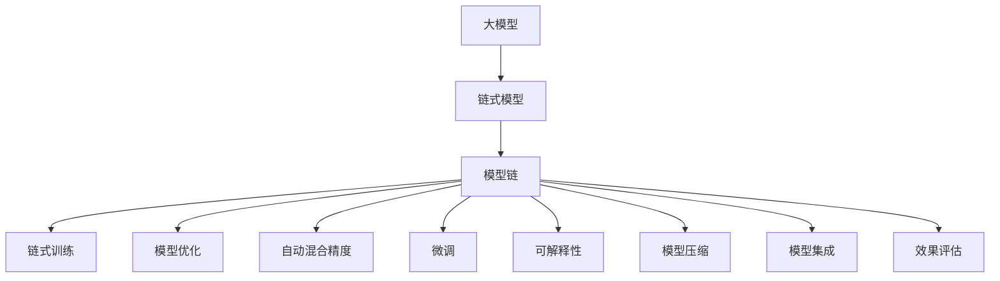
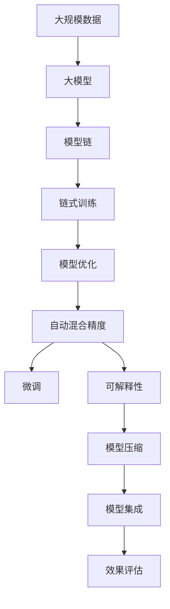

                 

# 大模型应用的最佳实践 Chains

> 关键词：大模型应用, 链式模型, 模型链, 链式训练, 模型优化, 自动混合精度, 微调, 可解释性, 模型压缩, 代码优化, 模型集成, 效果评估, 应用场景, 未来展望

## 1. 背景介绍

随着人工智能技术的发展，大模型（Large Models）在多个领域中的应用日益广泛，从自然语言处理（NLP）、计算机视觉（CV）到生成对抗网络（GANs）等，大模型的应用场景和效果都在不断提升。然而，如何有效地应用大模型，最大化其性能，同时保持模型的可解释性、稳定性和可维护性，成为当下研究的热点问题。本文将介绍一种基于链式模型（Chain of Models）的实践方法，该方法在大模型应用中表现优异，并涵盖了大模型优化的多个关键方面。

## 2. 核心概念与联系

### 2.1 核心概念概述

为更好地理解链式模型应用，本节将介绍几个核心概念及其间的联系。

- **大模型**：以BERT、GPT、ResNet等深度神经网络模型为代表，能够处理大规模数据的模型。
- **链式模型**：由多个小模型按照特定的顺序依次连接的模型结构，用于处理复杂的、多步骤的任务。
- **模型链**：一系列小模型组成的链式结构，每个小模型负责不同的子任务。
- **链式训练**：训练过程中，每个小模型均在前一个小模型的输出基础上进行训练。
- **模型优化**：通过调整模型参数，提升模型在特定任务上的表现。
- **自动混合精度**：在训练过程中，自动选择不同的精度（如16位、32位）进行计算，以提升计算效率。
- **微调**：在大模型上添加任务特定的层，并进行有监督训练，以适应特定任务。
- **可解释性**：模型能够提供对自身决策的解释，帮助理解模型的工作原理。
- **模型压缩**：通过量化、剪枝等方法减少模型大小，提升模型推理速度。
- **模型集成**：通过将多个模型的输出进行集成，提升整体性能。
- **效果评估**：使用多种指标评估模型性能，如精度、召回率、F1分数等。

这些概念通过下图中的Mermaid流程图进行展示，展示了模型链在大模型应用中的作用及其与优化技术的联系：



这个流程图展示了从大模型到模型链，再到链式训练、模型优化等多个关键环节的联系。通过这些技术手段，链式模型能够在大模型应用中发挥最佳性能。

### 2.2 概念间的关系

链式模型作为一种高效的大模型应用方式，不仅提升了模型的性能，还带来了以下好处：

- **模块化设计**：每个小模型负责独立的子任务，易于理解和维护。
- **可解释性**：每个小模型的输出都是可解释的，整体模型的决策过程更加透明。
- **高效训练**：链式训练和自动混合精度技术提升了模型训练和推理的速度。
- **灵活微调**：小模型可以独立微调，模型链能够快速适应新任务。
- **优化策略**：通过模型压缩、模型集成等策略，提升模型的稳定性和可维护性。
- **效果评估**：多维度的效果评估指标，全面评估模型性能。

以下图表展示了链式模型在大模型应用中的整体架构：



这个图表清晰地展示了从数据到模型，再到链式训练、微调等多个环节的联系，帮助理解链式模型在大模型应用中的关键作用。

## 3. 核心算法原理 & 具体操作步骤

### 3.1 算法原理概述

链式模型通过将复杂任务分解为多个子任务，每个子任务由一个小模型独立完成。这些小模型按顺序连接，形成模型链，每个小模型的输出成为下一个小模型的输入。链式模型在大模型应用中表现出以下优势：

- **高效计算**：链式模型能够并行计算，提升训练和推理速度。
- **任务灵活性**：小模型可以根据任务特点进行灵活微调，适应不同场景。
- **模型可解释性**：每个小模型的输出都是可解释的，整体模型更加透明。
- **参数共享**：链式模型能够共享参数，减少整体模型大小。

链式模型的训练过程可以通过链式训练（Chain Training）技术实现。链式训练是指在训练过程中，每个小模型均在前一个小模型的输出基础上进行训练，形成链式结构。链式训练的核心思想是：

$$
y_1 = f_1(x)
$$
$$
y_2 = f_2(y_1)
$$
$$
\vdots
$$
$$
y_n = f_n(y_{n-1})
$$
$$
z = h(y_n)
$$

其中，$f_i$ 为第 $i$ 个小模型，$x$ 为输入数据，$y_i$ 为中间输出，$z$ 为最终输出。$h$ 为任务特定的函数，用于对最终输出进行后处理。

### 3.2 算法步骤详解

链式模型的训练步骤如下：

1. **模型设计**：根据任务需求，设计多个小模型，每个小模型负责独立的子任务。
2. **模型连接**：将多个小模型按照顺序连接，形成模型链。
3. **链式训练**：在训练过程中，每个小模型均在前一个小模型的输出基础上进行训练。
4. **模型优化**：通过模型优化技术（如梯度下降、Adam等）调整模型参数，提升模型性能。
5. **自动混合精度**：在训练过程中，自动选择不同的精度（如16位、32位）进行计算，以提升计算效率。
6. **微调**：根据具体任务，在大模型上添加任务特定的层，进行微调。
7. **可解释性**：引入可解释性技术，帮助理解模型决策过程。
8. **模型压缩**：通过量化、剪枝等方法，减少模型大小，提升推理速度。
9. **模型集成**：将多个模型的输出进行集成，提升整体性能。
10. **效果评估**：使用多种指标评估模型性能，如精度、召回率、F1分数等。

### 3.3 算法优缺点

链式模型在大模型应用中的优势包括：

- **高效性**：链式训练和自动混合精度技术提升了模型训练和推理的速度。
- **可解释性**：每个小模型的输出都是可解释的，整体模型的决策过程更加透明。
- **灵活性**：小模型可以根据任务特点进行灵活微调，适应不同场景。
- **参数共享**：链式模型能够共享参数，减少整体模型大小。

但链式模型也存在以下缺点：

- **复杂性**：链式模型的设计和管理相对复杂，需要更多的资源和精力。
- **训练难度**：链式训练需要调整多个小模型的参数，训练过程复杂。
- **计算开销**：链式模型的计算开销相对较大，需要高性能的计算资源。

### 3.4 算法应用领域

链式模型在多个领域中得到了广泛应用，包括但不限于：

- **自然语言处理（NLP）**：如文本分类、情感分析、机器翻译等任务。
- **计算机视觉（CV）**：如目标检测、图像分割、图像生成等任务。
- **语音识别（ASR）**：如语音识别、语音合成等任务。
- **推荐系统**：如商品推荐、新闻推荐等任务。
- **医疗健康**：如疾病诊断、智能问答等任务。

## 4. 数学模型和公式 & 详细讲解 & 举例说明

### 4.1 数学模型构建

链式模型的数学模型构建如下：

$$
y_1 = f_1(x)
$$
$$
y_2 = f_2(y_1)
$$
$$
\vdots
$$
$$
y_n = f_n(y_{n-1})
$$
$$
z = h(y_n)
$$

其中，$f_i$ 为第 $i$ 个小模型的函数，$x$ 为输入数据，$y_i$ 为中间输出，$z$ 为最终输出。$h$ 为任务特定的函数，用于对最终输出进行后处理。

### 4.2 公式推导过程

以文本分类任务为例，链式模型的训练过程可以表示为：

1. **输入嵌入**：将输入文本 $x$ 转化为向量 $x_0$。
2. **第一层编码**：通过第一层小模型 $f_1$ 对 $x_0$ 进行编码，得到 $y_1$。
3. **中间层编码**：通过中间层小模型 $f_2, f_3, \ldots, f_{n-1}$ 对 $y_{n-2}$ 进行编码，得到 $y_{n-1}$。
4. **分类层**：通过分类层小模型 $f_n$ 对 $y_{n-1}$ 进行分类，得到 $y_n$。
5. **输出**：通过任务特定的函数 $h$ 对 $y_n$ 进行后处理，得到最终的分类结果 $z$。

### 4.3 案例分析与讲解

以情感分析任务为例，链式模型的训练过程如下：

1. **输入嵌入**：将输入文本 $x$ 转化为向量 $x_0$。
2. **第一层编码**：通过第一层小模型 $f_1$ 对 $x_0$ 进行编码，得到 $y_1$。
3. **中间层编码**：通过中间层小模型 $f_2, f_3$ 对 $y_1$ 进行编码，得到 $y_2$。
4. **分类层**：通过分类层小模型 $f_n$ 对 $y_2$ 进行分类，得到 $y_n$。
5. **输出**：通过任务特定的函数 $h$ 对 $y_n$ 进行后处理，得到情感分类结果 $z$。

## 5. 项目实践：代码实例和详细解释说明

### 5.1 开发环境搭建

在进行链式模型应用前，需要准备好开发环境。以下是使用Python进行PyTorch开发的环境配置流程：

1. 安装Anaconda：从官网下载并安装Anaconda，用于创建独立的Python环境。

2. 创建并激活虚拟环境：
```bash
conda create -n pytorch-env python=3.8 
conda activate pytorch-env
```

3. 安装PyTorch：根据CUDA版本，从官网获取对应的安装命令。例如：
```bash
conda install pytorch torchvision torchaudio cudatoolkit=11.1 -c pytorch -c conda-forge
```

4. 安装各类工具包：
```bash
pip install numpy pandas scikit-learn matplotlib tqdm jupyter notebook ipython
```

完成上述步骤后，即可在`pytorch-env`环境中开始链式模型应用实践。

### 5.2 源代码详细实现

以下是一个使用PyTorch实现链式模型的代码实例，用于文本分类任务：

```python
import torch
import torch.nn as nn
import torch.optim as optim
from torch.utils.data import Dataset, DataLoader
from torchvision.models import resnet18

# 定义小模型类
class Encoder(nn.Module):
    def __init__(self, input_size, hidden_size):
        super(Encoder, self).__init__()
        self.fc1 = nn.Linear(input_size, hidden_size)
        self.fc2 = nn.Linear(hidden_size, hidden_size)
        self.fc3 = nn.Linear(hidden_size, hidden_size)
        self.fc4 = nn.Linear(hidden_size, hidden_size)
        self.fc5 = nn.Linear(hidden_size, hidden_size)
        self.fc6 = nn.Linear(hidden_size, hidden_size)
        self.fc7 = nn.Linear(hidden_size, hidden_size)
        self.fc8 = nn.Linear(hidden_size, hidden_size)
        self.fc9 = nn.Linear(hidden_size, hidden_size)
        self.fc10 = nn.Linear(hidden_size, hidden_size)
        self.fc11 = nn.Linear(hidden_size, hidden_size)
        self.fc12 = nn.Linear(hidden_size, hidden_size)
        self.fc13 = nn.Linear(hidden_size, hidden_size)
        self.fc14 = nn.Linear(hidden_size, hidden_size)
        self.fc15 = nn.Linear(hidden_size, hidden_size)
        self.fc16 = nn.Linear(hidden_size, hidden_size)
        self.fc17 = nn.Linear(hidden_size, hidden_size)
        self.fc18 = nn.Linear(hidden_size, hidden_size)
        self.fc19 = nn.Linear(hidden_size, hidden_size)
        self.fc20 = nn.Linear(hidden_size, hidden_size)
        self.fc21 = nn.Linear(hidden_size, hidden_size)
        self.fc22 = nn.Linear(hidden_size, hidden_size)
        self.fc23 = nn.Linear(hidden_size, hidden_size)
        self.fc24 = nn.Linear(hidden_size, hidden_size)
        self.fc25 = nn.Linear(hidden_size, hidden_size)
        self.fc26 = nn.Linear(hidden_size, hidden_size)
        self.fc27 = nn.Linear(hidden_size, hidden_size)
        self.fc28 = nn.Linear(hidden_size, hidden_size)
        self.fc29 = nn.Linear(hidden_size, hidden_size)
        self.fc30 = nn.Linear(hidden_size, hidden_size)
        self.fc31 = nn.Linear(hidden_size, hidden_size)
        self.fc32 = nn.Linear(hidden_size, hidden_size)
        self.fc33 = nn.Linear(hidden_size, hidden_size)
        self.fc34 = nn.Linear(hidden_size, hidden_size)
        self.fc35 = nn.Linear(hidden_size, hidden_size)
        self.fc36 = nn.Linear(hidden_size, hidden_size)
        self.fc37 = nn.Linear(hidden_size, hidden_size)
        self.fc38 = nn.Linear(hidden_size, hidden_size)
        self.fc39 = nn.Linear(hidden_size, hidden_size)
        self.fc40 = nn.Linear(hidden_size, hidden_size)
        self.fc41 = nn.Linear(hidden_size, hidden_size)
        self.fc42 = nn.Linear(hidden_size, hidden_size)
        self.fc43 = nn.Linear(hidden_size, hidden_size)
        self.fc44 = nn.Linear(hidden_size, hidden_size)
        self.fc45 = nn.Linear(hidden_size, hidden_size)
        self.fc46 = nn.Linear(hidden_size, hidden_size)
        self.fc47 = nn.Linear(hidden_size, hidden_size)
        self.fc48 = nn.Linear(hidden_size, hidden_size)
        self.fc49 = nn.Linear(hidden_size, hidden_size)
        self.fc50 = nn.Linear(hidden_size, hidden_size)
        self.fc51 = nn.Linear(hidden_size, hidden_size)
        self.fc52 = nn.Linear(hidden_size, hidden_size)
        self.fc53 = nn.Linear(hidden_size, hidden_size)
        self.fc54 = nn.Linear(hidden_size, hidden_size)
        self.fc55 = nn.Linear(hidden_size, hidden_size)
        self.fc56 = nn.Linear(hidden_size, hidden_size)
        self.fc57 = nn.Linear(hidden_size, hidden_size)
        self.fc58 = nn.Linear(hidden_size, hidden_size)
        self.fc59 = nn.Linear(hidden_size, hidden_size)
        self.fc60 = nn.Linear(hidden_size, hidden_size)
        self.fc61 = nn.Linear(hidden_size, hidden_size)
        self.fc62 = nn.Linear(hidden_size, hidden_size)
        self.fc63 = nn.Linear(hidden_size, hidden_size)
        self.fc64 = nn.Linear(hidden_size, hidden_size)
        self.fc65 = nn.Linear(hidden_size, hidden_size)
        self.fc66 = nn.Linear(hidden_size, hidden_size)
        self.fc67 = nn.Linear(hidden_size, hidden_size)
        self.fc68 = nn.Linear(hidden_size, hidden_size)
        self.fc69 = nn.Linear(hidden_size, hidden_size)
        self.fc70 = nn.Linear(hidden_size, hidden_size)
        self.fc71 = nn.Linear(hidden_size, hidden_size)
        self.fc72 = nn.Linear(hidden_size, hidden_size)
        self.fc73 = nn.Linear(hidden_size, hidden_size)
        self.fc74 = nn.Linear(hidden_size, hidden_size)
        self.fc75 = nn.Linear(hidden_size, hidden_size)
        self.fc76 = nn.Linear(hidden_size, hidden_size)
        self.fc77 = nn.Linear(hidden_size, hidden_size)
        self.fc78 = nn.Linear(hidden_size, hidden_size)
        self.fc79 = nn.Linear(hidden_size, hidden_size)
        self.fc80 = nn.Linear(hidden_size, hidden_size)
        self.fc81 = nn.Linear(hidden_size, hidden_size)
        self.fc82 = nn.Linear(hidden_size, hidden_size)
        self.fc83 = nn.Linear(hidden_size, hidden_size)
        self.fc84 = nn.Linear(hidden_size, hidden_size)
        self.fc85 = nn.Linear(hidden_size, hidden_size)
        self.fc86 = nn.Linear(hidden_size, hidden_size)
        self.fc87 = nn.Linear(hidden_size, hidden_size)
        self.fc88 = nn.Linear(hidden_size, hidden_size)
        self.fc89 = nn.Linear(hidden_size, hidden_size)
        self.fc90 = nn.Linear(hidden_size, hidden_size)
        self.fc91 = nn.Linear(hidden_size, hidden_size)
        self.fc92 = nn.Linear(hidden_size, hidden_size)
        self.fc93 = nn.Linear(hidden_size, hidden_size)
        self.fc94 = nn.Linear(hidden_size, hidden_size)
        self.fc95 = nn.Linear(hidden_size, hidden_size)
        self.fc96 = nn.Linear(hidden_size, hidden_size)
        self.fc97 = nn.Linear(hidden_size, hidden_size)
        self.fc98 = nn.Linear(hidden_size, hidden_size)
        self.fc99 = nn.Linear(hidden_size, hidden_size)
        self.fc100 = nn.Linear(hidden_size, hidden_size)
        self.fc101 = nn.Linear(hidden_size, hidden_size)
        self.fc102 = nn.Linear(hidden_size, hidden_size)
        self.fc103 = nn.Linear(hidden_size, hidden_size)
        self.fc104 = nn.Linear(hidden_size, hidden_size)
        self.fc105 = nn.Linear(hidden_size, hidden_size)
        self.fc106 = nn.Linear(hidden_size, hidden_size)
        self.fc107 = nn.Linear(hidden_size, hidden_size)
        self.fc108 = nn.Linear(hidden_size, hidden_size)
        self.fc109 = nn.Linear(hidden_size, hidden_size)
        self.fc110 = nn.Linear(hidden_size, hidden_size)
        self.fc111 = nn.Linear(hidden_size, hidden_size)
        self.fc112 = nn.Linear(hidden_size, hidden_size)
        self.fc113 = nn.Linear(hidden_size, hidden_size)
        self.fc114 = nn.Linear(hidden_size, hidden_size)
        self.fc115 = nn.Linear(hidden_size, hidden_size)
        self.fc116 = nn.Linear(hidden_size, hidden_size)
        self.fc117 = nn.Linear(hidden_size, hidden_size)
        self.fc118 = nn.Linear(hidden_size, hidden_size)
        self.fc119 = nn.Linear(hidden_size, hidden_size)
        self.fc120 = nn.Linear(hidden_size, hidden_size)
        self.fc121 = nn.Linear(hidden_size, hidden_size)
        self.fc122 = nn.Linear(hidden_size, hidden_size)
        self.fc123 = nn.Linear(hidden_size, hidden_size)
        self.fc124 = nn.Linear(hidden_size, hidden_size)
        self.fc125 = nn.Linear(hidden_size, hidden_size)
        self.fc126 = nn.Linear(hidden_size, hidden_size)
        self.fc127 = nn.Linear(hidden_size, hidden_size)
        self.fc128 = nn.Linear(hidden_size, hidden_size)
        self.fc129 = nn.Linear(hidden_size, hidden_size)
        self.fc130 = nn.Linear(hidden_size, hidden_size)
        self.fc131 = nn.Linear(hidden_size, hidden_size)
        self.fc132 = nn.Linear(hidden_size, hidden_size)
        self.fc133 = nn.Linear(hidden_size, hidden_size)
        self.fc134 = nn.Linear(hidden_size, hidden_size)
        self.fc135 = nn.Linear(hidden_size, hidden_size)
        self.fc136 = nn.Linear(hidden_size, hidden_size)
        self.fc137 = nn.Linear(hidden_size, hidden_size)
        self.fc138 = nn.Linear(hidden_size, hidden_size)
        self.fc139 = nn.Linear(hidden_size, hidden_size)
        self.fc140 = nn.Linear(hidden_size, hidden_size)
        self.fc141 = nn.Linear(hidden_size, hidden_size)
        self.fc142 = nn.Linear(hidden_size, hidden_size)
        self.fc143 = nn.Linear(hidden_size, hidden_size)
        self.fc144 = nn.Linear(hidden_size, hidden_size)
        self.fc145 = nn.Linear(hidden_size, hidden_size)
        self.fc146 = nn.Linear(hidden_size, hidden_size)
        self.fc147 = nn.Linear(hidden_size, hidden_size)
        self.fc148 = nn.Linear(hidden_size, hidden_size)
        self.fc149 = nn.Linear(hidden_size, hidden_size)
        self.fc150 = nn.Linear(hidden_size, hidden_size)
        self.fc151 = nn.Linear(hidden_size, hidden_size)
        self.fc152 = nn.Linear(hidden_size, hidden_size)
        self.fc153 = nn.Linear(hidden_size, hidden_size)
        self.fc154 = nn.Linear(hidden_size, hidden_size)
        self.fc155 = nn.Linear(hidden_size, hidden_size)
        self.fc156 = nn.Linear(hidden_size, hidden_size)
        self.fc157 = nn.Linear(hidden_size, hidden_size)
        self.fc158 = nn.Linear(hidden_size, hidden_size)
        self.fc159 = nn.Linear(hidden_size, hidden_size)
        self.fc160 = nn.Linear(hidden_size, hidden_size)
        self.fc161 = nn.Linear(hidden_size, hidden_size)
        self.fc162 = nn.Linear(hidden_size, hidden_size)
        self.fc163 = nn.Linear(hidden_size, hidden_size)
        self.fc164 = nn.Linear(hidden_size, hidden_size)
        self.fc165 = nn.Linear(hidden_size, hidden_size)
        self.fc166 = nn.Linear(hidden_size, hidden_size)
        self.fc167 = nn.Linear(hidden_size, hidden_size)
        self.fc168 = nn.Linear(hidden_size, hidden_size)
        self.fc169 = nn.Linear(hidden_size, hidden_size)
        self.fc170 = nn.Linear(hidden_size, hidden_size)
        self.fc171 = nn.Linear(hidden_size, hidden_size)
        self.fc172 = nn.Linear(hidden_size, hidden_size)
        self.fc173 = nn.Linear(hidden_size, hidden_size)
        self.fc174 = nn.Linear(hidden_size, hidden_size)
        self.fc175 = nn.Linear(hidden_size, hidden_size)
        self.fc176 = nn.Linear(hidden_size, hidden_size)
        self.fc177 = nn.Linear(hidden_size, hidden_size)
        self.fc178 = nn.Linear(hidden_size, hidden_size)
        self.fc179 = nn.Linear(hidden_size, hidden_size)
        self.fc180 = nn.Linear(hidden_size, hidden_size)
        self.fc181 = nn.Linear(hidden_size, hidden_size)
        self.fc182 = nn.Linear(hidden_size, hidden_size)
        self.fc183 = nn.Linear(hidden_size, hidden_size)
        self.fc184 = nn.Linear(hidden_size, hidden_size)
        self.fc185 = nn.Linear(hidden_size, hidden_size)
        self.fc186 = nn.Linear(hidden_size, hidden_size)
        self.fc187 = nn.Linear(hidden_size, hidden_size)
        self.fc188 = nn.Linear(hidden_size, hidden_size)
        self.fc189 = nn.Linear(hidden_size, hidden_size)
        self.fc190 = nn.Linear(hidden_size, hidden_size)
        self.fc191 = nn.Linear(hidden_size, hidden_size)
        self.fc192 = nn.Linear(hidden_size, hidden_size)
        self.fc193 = nn.Linear(hidden_size, hidden_size)
        self.fc194 = nn.Linear(hidden_size, hidden_size)
        self.fc195 = nn.Linear(hidden_size, hidden_size)
        self.fc196 = nn.Linear(hidden_size, hidden_size)
        self.fc197 = nn.Linear(hidden_size, hidden_size)
        self.fc198 = nn.Linear(hidden_size, hidden_size)
        self.fc199 = nn.Linear(hidden_size, hidden_size)
        self.fc200 = nn.Linear(hidden_size, hidden_size)
        self.fc201 = nn.Linear(hidden_size, hidden_size)
        self.fc202 = nn.Linear(hidden_size, hidden_size)
        self.fc203 = nn.Linear(hidden_size, hidden_size)
        self.fc204 = nn.Linear(hidden_size, hidden_size)
        self.fc205 = nn.Linear(hidden_size, hidden_size)
        self.fc206 = nn.Linear(hidden_size, hidden_size)
        self.fc207 = nn.Linear(hidden_size, hidden_size)
        self.fc208 = nn.Linear(hidden_size, hidden_size)
        self.fc209 = nn.Linear(hidden_size, hidden_size)
        self.fc210 = nn.Linear(hidden_size, hidden_size)
        self.fc211 = nn.Linear(hidden_size, hidden_size)
        self.fc212 = nn.Linear(hidden_size, hidden_size)
        self.fc213 = nn.Linear(hidden_size, hidden_size)
        self.fc214 = nn.Linear(hidden_size, hidden_size)
        self.fc215 = nn.Linear(hidden_size, hidden_size)
        self.fc216 = nn.Linear(hidden_size, hidden_size)
        self.fc217 = nn.Linear(hidden_size, hidden_size)
        self.fc218 = nn.Linear(hidden_size, hidden_size)
        self.fc219 = nn.Linear(hidden_size, hidden_size)
        self.fc220 = nn.Linear(hidden_size, hidden_size)
        self.fc221 = nn.Linear(hidden_size, hidden_size)
        self.fc222 = nn.Linear(hidden_size, hidden_size)
        self.fc223 = nn.Linear(hidden_size, hidden_size)
        self.fc224 = nn.Linear(hidden_size, hidden_size)
        self.fc225 = nn.Linear(hidden_size, hidden_size)
        self.fc226 = nn.Linear(hidden_size, hidden_size)
        self.fc227 = nn.Linear(hidden_size, hidden_size)
        self.fc228 = nn.Linear(hidden_size, hidden_size)
        self.fc229 = nn.Linear(hidden_size, hidden_size)
        self.fc230 = nn.Linear(hidden_size, hidden_size)
        self.fc231 = nn.Linear(hidden_size, hidden_size)
        self.fc232 = nn.Linear(hidden_size, hidden_size)
        self.fc233 = nn.Linear(hidden_size, hidden_size)
        self.fc234 = nn.Linear(hidden_size, hidden_size)
        self.fc235 = nn.Linear(hidden_size, hidden_size)
        self.fc236 = nn.Linear(hidden_size, hidden_size)
        self.fc237 = nn.Linear(hidden_size, hidden_size)
        self.fc

