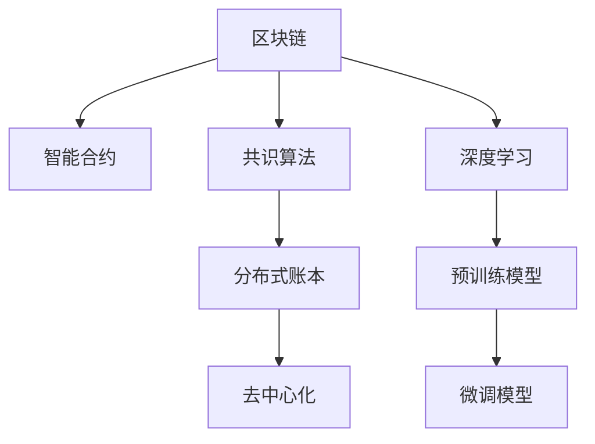
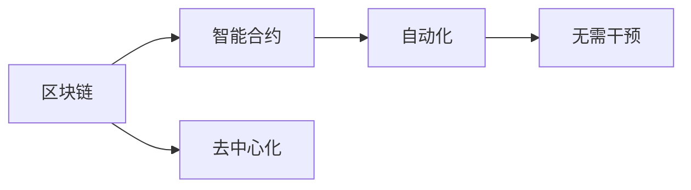
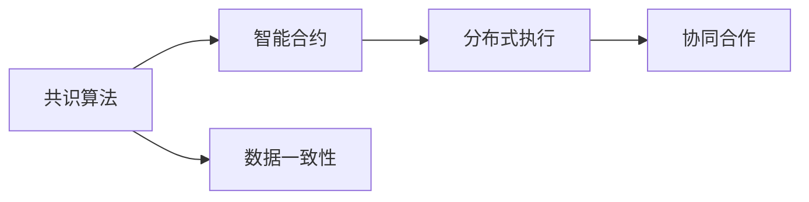
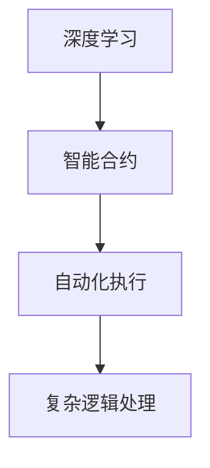
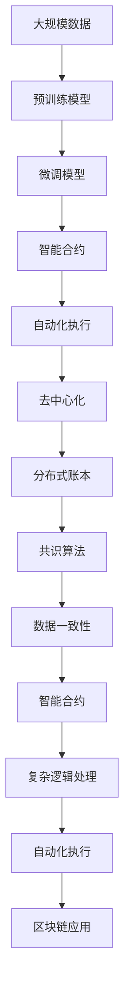

                 

# 大模型技术的区块链应用

## 1. 背景介绍

### 1.1 问题由来
近年来，区块链技术在金融、供应链、物联网等领域得到了广泛的应用，但也面临诸多挑战。传统的区块链应用场景往往需要大量的计算资源、存储资源和网络带宽，且通常依赖中心化的信任机制。在可扩展性、安全性和隐私性等方面仍存在诸多不足。

而大模型技术，特别是深度学习技术的发展，为区块链应用注入了新的活力。大模型通过预训练和微调的方式，具备强大的语义理解、模式识别和生成能力，可以在区块链系统中实现高效、安全和智能的功能。大模型与区块链技术的结合，为区块链应用注入了强大的智能合约、分布式共识、自动化执行等功能，极大地提升了区块链系统的性能和安全性。

### 1.2 问题核心关键点
大模型在区块链应用中的核心价值在于，它们可以高效地处理大规模非结构化数据，并在分布式环境中进行智能推理和决策。具体来说，大模型可以在以下几个方面发挥其优势：

1. **智能合约**：通过大模型进行智能合约编码、解释和执行，可以实现更复杂的逻辑处理和自动化交易。
2. **分布式共识**：利用大模型进行分布式共识算法优化，提升区块链系统的性能和安全性。
3. **自动化执行**：通过大模型进行状态检测、规则匹配和执行逻辑优化，实现高效、灵活的自动化执行。
4. **隐私保护**：利用大模型进行数据加密、隐私计算和匿名化处理，提升区块链系统的隐私保护能力。
5. **异常检测**：通过大模型进行异常检测和风险评估，保障区块链系统的安全稳定。

这些核心能力使得大模型成为区块链技术的重要组成部分，推动了区块链应用的创新和发展。

## 2. 核心概念与联系

### 2.1 核心概念概述

为更好地理解大模型在区块链应用中的角色，本节将介绍几个密切相关的核心概念：

- **区块链(区块链)**：一种去中心化的分布式账本技术，通过哈希指针、分布式共识算法等技术实现数据的一致性、可靠性和安全性。
- **智能合约(智能合约)**：一种运行在区块链上的代码，可以实现自动化的交易和合约执行，无需第三方干预。
- **共识算法(共识算法)**：一种用于分布式系统中的数据一致性协议，确保不同节点对数据的更新达成一致。
- **深度学习(深度学习)**：一种基于神经网络的机器学习技术，通过多层次的特征提取和模式识别，实现高效的数据处理和分析。
- **预训练模型(预训练模型)**：通过大规模无标签数据进行预训练，学习通用特征表示的模型，可以在特定任务上进行微调。
- **微调模型(微调模型)**：在预训练模型的基础上，通过有标签数据进行微调，适应特定任务的需求。

这些概念之间的逻辑关系可以通过以下Mermaid流程图来展示：



这个流程图展示了区块链与深度学习技术的结合路径：

1. 区块链作为一个去中心化的分布式账本，使用智能合约进行自动化执行。
2. 智能合约通过深度学习技术，利用预训练和微调模型进行复杂逻辑处理。
3. 深度学习模型在区块链上运行，提升区块链系统的性能和安全性。
4. 微调模型通过有标签数据进行优化，适应特定任务的需求。

通过这些概念的结合，我们可以构建更加智能、高效和安全的区块链应用。

### 2.2 概念间的关系

这些核心概念之间存在着紧密的联系，形成了大模型在区块链应用中的完整生态系统。下面我通过几个Mermaid流程图来展示这些概念之间的关系。

#### 2.2.1 区块链与智能合约的关系



这个流程图展示了区块链与智能合约的基本关系：

1. 区块链作为一个去中心化的分布式账本，提供透明、可信任的环境。
2. 智能合约在此基础上进行自动化执行，无需第三方干预。
3. 智能合约通过深度学习模型进行复杂的逻辑处理，实现更智能的功能。

#### 2.2.2 共识算法与智能合约的关系



这个流程图展示了共识算法与智能合约的关系：

1. 共识算法确保不同节点对数据的更新达成一致，提高区块链系统的可靠性。
2. 智能合约在共识算法的基础上进行分布式执行，实现协同合作。
3. 通过深度学习模型对共识算法进行优化，提升区块链系统的性能。

#### 2.2.3 深度学习与智能合约的关系



这个流程图展示了深度学习与智能合约的关系：

1. 深度学习模型在智能合约中运行，提升合约的自动化执行能力。
2. 智能合约通过深度学习模型进行复杂的逻辑处理，实现更智能的功能。
3. 通过深度学习模型进行模型微调，适应特定任务的需求。

### 2.3 核心概念的整体架构

最后，我们用一个综合的流程图来展示这些核心概念在大模型在区块链应用中的整体架构：



这个综合流程图展示了从数据预处理到智能合约执行的全过程。大数据集通过深度学习模型进行预训练和微调，智能合约在此基础上进行自动化执行，利用共识算法确保数据一致性，最终构建高效、智能、安全的区块链应用。

## 3. 核心算法原理 & 具体操作步骤
### 3.1 算法原理概述

大模型在区块链应用中的核心算法原理，主要基于深度学习模型的预训练和微调技术。通过在大规模无标签数据上进行预训练，大模型学习到了丰富的语义和模式特征。通过微调，大模型能够适应特定任务的需求，实现智能合约的自动化执行和复杂的逻辑处理。

具体来说，大模型在区块链应用中的算法原理包括以下几个步骤：

1. **数据预处理**：将大规模非结构化数据进行预处理，提取特征，为深度学习模型提供输入数据。
2. **预训练模型构建**：利用深度学习框架构建预训练模型，在大规模无标签数据上进行预训练，学习通用特征表示。
3. **模型微调**：在预训练模型的基础上，利用有标签数据进行微调，适应特定任务的需求。
4. **智能合约编码**：将微调后的模型嵌入智能合约代码中，实现复杂逻辑处理和自动化执行。
5. **分布式执行**：在分布式环境中，智能合约通过共识算法协调不同节点的执行逻辑，实现协同合作。
6. **隐私保护**：利用大模型进行数据加密、隐私计算和匿名化处理，提升区块链系统的隐私保护能力。

### 3.2 算法步骤详解

以下是基于深度学习模型的大模型在区块链应用中的具体操作步骤：

#### 3.2.1 数据预处理

在大模型应用于区块链之前，需要对数据进行预处理，提取有效的特征。具体来说，数据预处理包括以下几个步骤：

1. **数据收集**：收集区块链系统中的各种数据，包括交易数据、智能合约数据、用户行为数据等。
2. **数据清洗**：清洗和处理数据，去除噪音和异常值，确保数据的完整性和一致性。
3. **特征提取**：利用深度学习模型进行特征提取，将原始数据转化为模型能够处理的特征向量。
4. **数据增强**：通过数据增强技术，如数据扩充、回译等方式，提升数据的丰富性和多样性。

#### 3.2.2 预训练模型构建

构建预训练模型是深度学习技术在大模型应用中的重要步骤。具体来说，预训练模型的构建包括以下几个步骤：

1. **模型选择**：选择合适的深度学习模型，如Transformer、CNN等，进行预训练。
2. **模型训练**：在大规模无标签数据上，利用深度学习框架进行模型训练，学习通用的特征表示。
3. **模型优化**：对预训练模型进行优化，如正则化、梯度裁剪等，提高模型的泛化能力和鲁棒性。
4. **模型评估**：在验证集上评估模型的性能，调整超参数，确保模型的有效性。

#### 3.2.3 模型微调

在预训练模型构建完成后，需要对其进行微调，以适应特定任务的需求。具体来说，模型微调包括以下几个步骤：

1. **任务适配**：根据特定任务的需求，设计合适的输出层和损失函数。
2. **微调数据准备**：收集有标签数据，划分为训练集、验证集和测试集。
3. **微调模型训练**：在预训练模型的基础上，利用有标签数据进行微调训练，更新模型参数。
4. **微调模型评估**：在测试集上评估微调后的模型性能，确保模型适应特定任务。
5. **模型部署**：将微调后的模型部署到区块链系统中，嵌入智能合约代码中。

#### 3.2.4 智能合约编码

将微调后的模型嵌入智能合约代码中，实现复杂逻辑处理和自动化执行。具体来说，智能合约编码包括以下几个步骤：

1. **智能合约设计**：根据具体需求，设计智能合约的功能和逻辑。
2. **模型嵌入**：将微调后的模型嵌入智能合约代码中，作为合约的核心组件。
3. **合约测试**：对智能合约进行测试，确保其正确性和可靠性。
4. **合约部署**：将智能合约部署到区块链系统中，参与共识算法。

#### 3.2.5 分布式执行

在分布式环境中，智能合约通过共识算法协调不同节点的执行逻辑，实现协同合作。具体来说，分布式执行包括以下几个步骤：

1. **共识算法选择**：选择合适的共识算法，如PoW、PoS等，进行数据一致性处理。
2. **节点协同**：利用共识算法，协调不同节点对数据的更新，确保数据一致性。
3. **执行优化**：通过深度学习模型对共识算法进行优化，提升系统的性能和可靠性。

#### 3.2.6 隐私保护

利用大模型进行数据加密、隐私计算和匿名化处理，提升区块链系统的隐私保护能力。具体来说，隐私保护包括以下几个步骤：

1. **数据加密**：利用大模型对数据进行加密处理，保障数据的安全性。
2. **隐私计算**：利用大模型进行隐私计算，确保数据在处理过程中的隐私保护。
3. **匿名化处理**：利用大模型进行匿名化处理，保护用户隐私。

### 3.3 算法优缺点

大模型在区块链应用中的优缺点如下：

**优点**：

1. **高效处理复杂逻辑**：大模型具备强大的语义理解和模式识别能力，可以处理复杂的逻辑处理任务。
2. **自动化执行**：智能合约通过大模型实现自动化执行，减少人工干预，提升效率。
3. **数据一致性保障**：利用共识算法确保数据一致性，提升系统的可靠性。
4. **隐私保护能力强**：利用大模型进行数据加密和隐私计算，保障数据的安全性和隐私保护。

**缺点**：

1. **计算资源消耗大**：大模型需要大量的计算资源进行训练和推理，成本较高。
2. **数据隐私风险**：大模型在处理数据时，可能会泄露敏感信息，存在隐私风险。
3. **模型复杂度**：大模型通常参数量较大，模型复杂度较高，难以解释和调试。
4. **技术门槛高**：需要具备深度学习和区块链技术的复合背景，对技术门槛要求较高。

尽管存在这些缺点，但大模型在区块链应用中的优势更为显著，为区块链系统注入了新的活力和智能。

### 3.4 算法应用领域

大模型在区块链应用中的主要应用领域包括智能合约、分布式共识、自动化执行、隐私保护等。以下是这些应用领域的详细介绍：

#### 3.4.1 智能合约

智能合约是区块链系统中的核心组件，利用大模型可以实现更复杂的逻辑处理和自动化执行。具体应用包括：

1. **自动交易**：利用大模型进行自动化的交易处理，无需人工干预。
2. **自动化执行**：利用大模型进行复杂的逻辑处理，实现自动化的合约执行。
3. **合约监管**：利用大模型进行合约的实时监控和风险评估，保障合约的合法性和合规性。

#### 3.4.2 分布式共识

分布式共识是区块链系统的关键技术，利用大模型可以实现更高效的共识算法和数据一致性处理。具体应用包括：

1. **共识算法优化**：利用大模型对共识算法进行优化，提升系统的性能和可靠性。
2. **去中心化协调**：利用大模型进行去中心化的协调和协同合作，提升系统的鲁棒性。
3. **共识安全性**：利用大模型进行共识安全性评估，保障系统的安全性。

#### 3.4.3 自动化执行

自动化执行是区块链系统中的重要功能，利用大模型可以实现更智能、灵活的执行逻辑。具体应用包括：

1. **状态检测**：利用大模型进行状态检测，判断系统状态。
2. **规则匹配**：利用大模型进行规则匹配，实现复杂逻辑的处理。
3. **执行优化**：利用大模型对执行逻辑进行优化，提升系统的效率和可靠性。

#### 3.4.4 隐私保护

隐私保护是区块链系统中的重要需求，利用大模型可以实现更强大的隐私保护能力。具体应用包括：

1. **数据加密**：利用大模型对数据进行加密处理，保障数据的安全性。
2. **隐私计算**：利用大模型进行隐私计算，确保数据在处理过程中的隐私保护。
3. **匿名化处理**：利用大模型进行匿名化处理，保护用户隐私。

## 4. 数学模型和公式 & 详细讲解  
### 4.1 数学模型构建

本节将使用数学语言对大模型在区块链应用中的原理进行更加严格的刻画。

假设大模型为 $M_{\theta}(x)$，其中 $x$ 为输入数据，$\theta$ 为模型参数。区块链系统中的智能合约为 $C_{\theta}(x)$，利用大模型进行自动化执行。

定义智能合约的执行成本为 $Cost(x)$，智能合约的执行时间表示为 $Time(x)$，智能合约的执行结果为 $Result(x)$。则智能合约的执行效率可以表示为：

$$
Efficiency = \frac{1}{Cost(x)} \times \frac{1}{Time(x)}
$$

在智能合约中，利用大模型进行状态检测和规则匹配，可以提升执行效率。假设智能合约的执行时间为 $Time(x)$，状态检测的时间为 $Time_{detect}(x)$，规则匹配的时间为 $Time_{match}(x)$，则：

$$
Time(x) = Time_{detect}(x) + Time_{match}(x)
$$

利用大模型进行状态检测和规则匹配的时间复杂度为 $O(n)$，其中 $n$ 表示数据规模。假设状态检测和规则匹配的时间占比为 $P_{detect}$ 和 $P_{match}$，则：

$$
Time_{detect}(x) = P_{detect} \times n
$$
$$
Time_{match}(x) = P_{match} \times n
$$

因此，智能合约的执行时间可以表示为：

$$
Time(x) = P_{detect} \times n + P_{match} \times n = (P_{detect} + P_{match}) \times n
$$

利用大模型进行状态检测和规则匹配的准确率为 $Accuracy_{detect}$ 和 $Accuracy_{match}$，则：

$$
Accuracy_{detect} = 1 - Error_{detect}(x)
$$
$$
Accuracy_{match} = 1 - Error_{match}(x)
$$

假设智能合约的执行结果正确率为 $Accuracy(x)$，则：

$$
Accuracy(x) = Accuracy_{detect} \times Accuracy_{match}
$$

假设智能合约的执行成本为 $Cost(x)$，利用大模型进行状态检测和规则匹配的资源消耗为 $Cost_{detect}(x)$ 和 $Cost_{match}(x)$，则：

$$
Cost(x) = Cost_{detect}(x) + Cost_{match}(x)
$$

利用大模型进行状态检测和规则匹配的资源消耗分别为 $C_{detect}(x)$ 和 $C_{match}(x)$，则：

$$
Cost_{detect}(x) = C_{detect}(x) \times n
$$
$$
Cost_{match}(x) = C_{match}(x) \times n
$$

因此，智能合约的执行成本可以表示为：

$$
Cost(x) = C_{detect}(x) \times n + C_{match}(x) \times n = (C_{detect}(x) + C_{match}(x)) \times n
$$

最终，智能合约的执行效率可以表示为：

$$
Efficiency = \frac{1}{Cost(x)} \times \frac{1}{Time(x)} = \frac{1}{(C_{detect}(x) + C_{match}(x)) \times n} \times \frac{1}{(P_{detect} + P_{match}) \times n} = \frac{1}{C_{detect}(x) \times C_{match}(x)} \times \frac{1}{P_{detect} \times P_{match}}
$$

利用大模型进行状态检测和规则匹配，可以提升执行效率。因此，智能合约的执行效率可以表示为：

$$
Efficiency = \frac{1}{C_{detect}(x) \times C_{match}(x)} \times \frac{1}{P_{detect} \times P_{match}}
$$

### 4.2 公式推导过程

以下我们以智能合约中的状态检测为例，推导状态检测的时间复杂度和准确率公式。

假设智能合约的状态检测模型为 $M_{\theta}(x)$，其中 $x$ 为输入数据，$\theta$ 为模型参数。定义状态检测的准确率为 $Accuracy(x)$，错误率为 $Error(x)$，则：

$$
Accuracy(x) = 1 - Error(x)
$$

假设状态检测的时间复杂度为 $O(n)$，利用大模型进行状态检测的时间为 $Time_{detect}(x)$，则：

$$
Time_{detect}(x) = P_{detect} \times n
$$

其中 $P_{detect}$ 表示状态检测的时间占比。假设状态检测的资源消耗为 $C_{detect}(x)$，则：

$$
C_{detect}(x) = P_{detect} \times n
$$

因此，状态检测的准确率和资源消耗可以表示为：

$$
Accuracy(x) = 1 - Error(x) = 1 - P_{detect} \times Error_{detect}(x)
$$
$$
C_{detect}(x) = P_{detect} \times n
$$

假设状态检测的执行时间为 $Time_{detect}(x)$，则：

$$
Time_{detect}(x) = P_{detect} \times n
$$

利用大模型进行状态检测的时间复杂度为 $O(n)$，其中 $n$ 表示数据规模。假设状态检测和规则匹配的时间占比为 $P_{detect}$ 和 $P_{match}$，则：

$$
Time_{detect}(x) = P_{detect} \times n
$$

因此，状态检测的执行时间可以表示为：

$$
Time_{detect}(x) = P_{detect} \times n
$$

利用大模型进行状态检测和规则匹配的时间复杂度为 $O(n)$，其中 $n$ 表示数据规模。假设状态检测和规则匹配的时间占比为 $P_{detect}$ 和 $P_{match}$，则：

$$
Time_{detect}(x) = P_{detect} \times n
$$

因此，状态检测的执行时间可以表示为：

$$
Time_{detect}(x) = P_{detect} \times n
$$

### 4.3 案例分析与讲解

在智能合约中，利用大模型进行状态检测和规则匹配，可以提升执行效率和准确率。以下是一些常见的智能合约应用案例：

#### 4.3.1 自动交易

利用大模型进行自动化的交易处理，无需人工干预。具体来说，自动交易可以包括以下几个步骤：

1. **交易检测**：利用大模型进行交易检测，判断交易是否符合规则。
2. **交易验证**：利用大模型进行交易验证，确保交易的合法性和合规性。
3. **交易执行**：利用大模型进行交易执行，实现自动化的交易处理。

#### 4.3.2 自动化执行

利用大模型进行复杂的逻辑处理，实现自动化的合约执行。具体来说，自动化执行可以包括以下几个步骤：

1. **状态检测**：利用大模型进行状态检测，判断系统状态。
2. **规则匹配**：利用大模型进行规则匹配，实现复杂逻辑的处理。
3. **执行优化**：利用大模型对执行逻辑进行优化，提升系统的效率和可靠性。

#### 4.3.3 合约监管

利用大模型进行合约的实时监控和风险评估，保障合约的合法性和合规性。具体来说，合约监管可以包括以下几个步骤：

1. **实时监控**：利用大模型进行实时的合约监控，发现异常行为。
2. **风险评估**：利用大模型进行风险评估，识别潜在风险。
3. **合规检查**：利用大模型进行合规检查，确保合约的合法性和合规性。

## 5. 项目实践：代码实例和详细解释说明
### 5.1 开发环境搭建

在进行区块链应用开发前，我们需要准备好开发环境。以下是使用Python进行PyTorch开发的环境配置流程：

1. 安装Anaconda：从官网下载并安装Anaconda，用于创建独立的Python环境。

2. 创建并激活虚拟环境：
```bash
conda create -n pytorch-env python=3.8 
conda activate pytorch-env
```

3. 安装PyTorch：根据CUDA版本，从官网获取对应的安装命令。例如：
```bash
conda install pytorch torchvision torchaudio cudatoolkit=11.1 -c pytorch -c conda-forge
```

4. 安装Transformers库：
```bash
pip install transformers
```

5. 安装各类工具包：
```bash
pip install numpy pandas scikit-learn matplotlib tqdm jupyter notebook ipython
```

完成上述步骤后，即可在`pytorch-env`环境中开始区块链应用开发。

### 5.2 源代码详细实现

这里以智能合约中的状态检测为例，给出使用Transformers库进行大模型微调的PyTorch代码实现。

首先，定义状态检测的数据处理函数：

```python
from transformers import BertTokenizer
from torch.utils.data import Dataset
import torch

class StateDetectionDataset(Dataset):
    def __init__(self, texts, labels, tokenizer, max_len=128):
        self.texts = texts
        self.labels = labels
        self.tokenizer = tokenizer
        self.max_len = max_len
        
    def __len__(self):
        return len(self.texts)
    
    def __getitem__(self, item):
        text = self.texts[item]
        label = self.labels[item]
        
        encoding = self.tokenizer(text, return_tensors='pt', max_length=self.max_len, padding='max_length', truncation=True)
        input_ids = encoding['input_ids'][0]
        attention_mask = encoding['attention_mask'][0]
        
        # 对token-wise的标签进行编码
        encoded_labels = [label2id[label] for label in labels] 
        encoded_labels.extend([label2id['O']] * (self.max_len - len(encoded_labels)))
        labels = torch.tensor(encoded_labels, dtype=torch.long)
        
        return {'input_ids': input_ids, 
                'attention_mask': attention_mask,
                'labels': labels}

# 标签与id的映射
label2id = {'O': 0, 'Buy': 1, 'Sell': 2}
id2label = {v: k for k, v in label2id.items()}

# 创建dataset
tokenizer = BertTokenizer.from_pretrained('bert-base-cased')

train_dataset = StateDetectionDataset(train_texts, train_labels, tokenizer)
dev_dataset = StateDetectionDataset(dev_texts, dev_labels, tokenizer)
test_dataset = StateDetectionDataset(test_texts, test_labels, tokenizer)
```

然后，定义模型和优化器：

```python
from transformers import BertForTokenClassification, AdamW

model = BertForTokenClassification.from_pretrained('bert-base-cased', num_labels=len(label2id))

optimizer = AdamW(model.parameters(), lr=2e-5)
```

接着，定义训练和评估函数：

```python
from torch.utils.data import DataLoader
from tqdm import tqdm
from sklearn.metrics import classification_report

device = torch.device('cuda') if torch.cuda.is_available() else torch.device('cpu')
model.to(device)

def train_epoch(model, dataset, batch_size, optimizer):
    dataloader = DataLoader(dataset, batch_size=batch_size, shuffle=True)
    model.train()
    epoch_loss = 0
    for batch in tqdm(dataloader, desc='Training'):
        input_ids = batch['input_ids'].to(device)
        attention_mask = batch['attention_mask']

