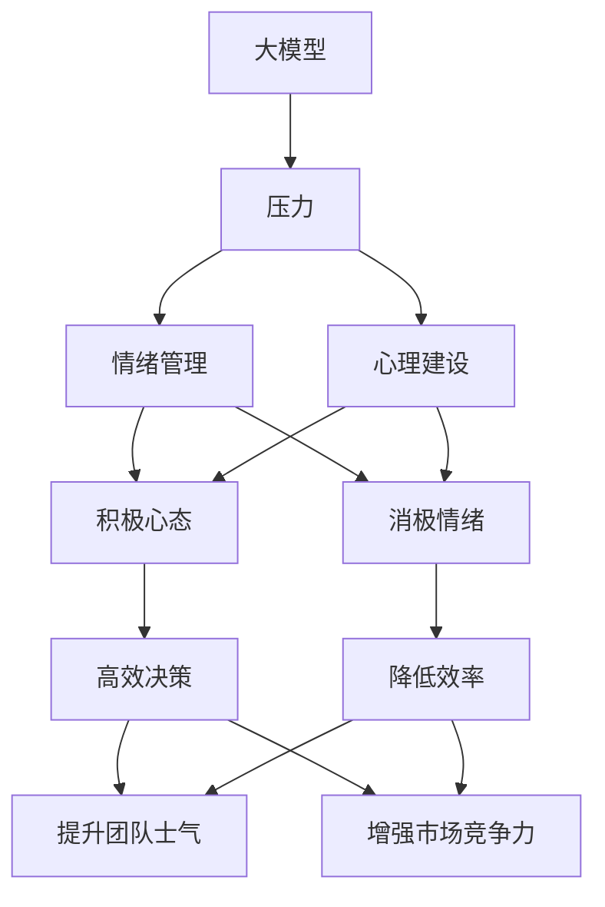
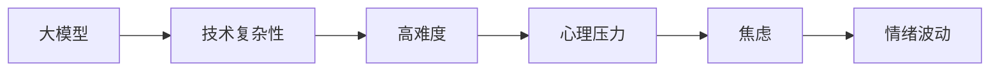
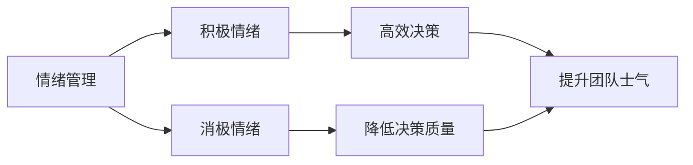
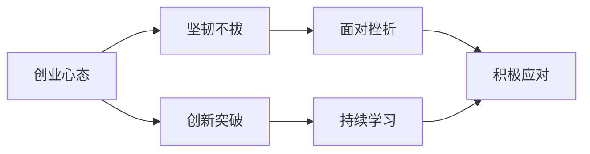
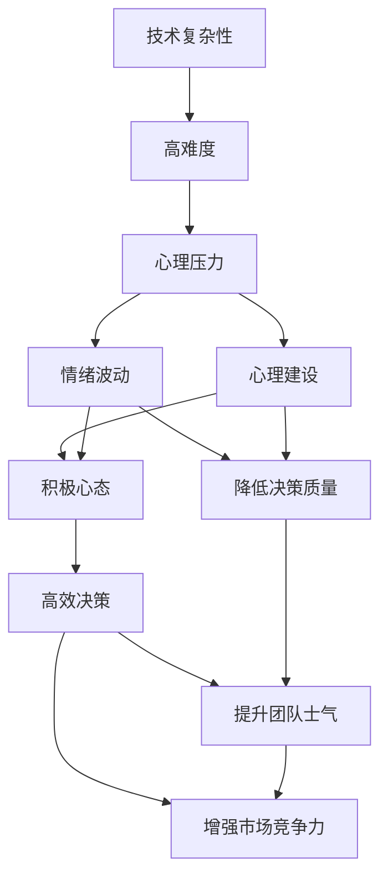

                 

# 大模型时代的创业者创业心态调整：压力管理、情绪管理与心理建设

## 1. 背景介绍

### 1.1 问题由来
在人工智能和大模型时代的浪潮下，创业者面临着前所未有的机遇与挑战。一方面，大模型的崛起为创业项目提供了强大的技术支持，大幅提升了算法的精度和效果，降低了模型开发和维护的成本。另一方面，大模型的复杂性和不确定性也带来了新的挑战，如模型构建、数据标注、算力需求等，创业者在技术、市场、运营等方面均需有高水平的认知和把握。

创业心态的调整尤为重要。在大模型时代的商业竞争中，不仅仅是技术驱动，更需要有良好的心理素质和情绪管理能力。如何保持冷静，应对压力，成为成功的关键因素之一。

### 1.2 问题核心关键点
大模型时代创业者的心态调整主要关注以下几点：

- **压力管理**：面对大模型的高复杂度和不确定性，创业者需要科学管理压力，以保持稳定和高效的工作状态。
- **情绪管理**：在技术研发、市场推广和团队管理等环节，情绪管理对于保持创业团队的健康和效率至关重要。
- **心理建设**：培养坚韧不拔、积极向上的心理素质，以应对可能的挫折和失败。

这些心态调整能够帮助创业者更好地面对市场的变化和技术的发展，保持心态的平和与坚韧。

### 1.3 问题研究意义
研究大模型时代创业者的心态调整，对于提升创业者的整体素质，提高项目成功率，推动人工智能技术的落地应用，具有重要意义：

- 优化创业环境：良好的心态调整有助于创业者形成积极向上的企业文化，吸引优秀人才，提升团队凝聚力。
- 提高项目成功率：面对大模型带来的不确定性和复杂性，良好的心态管理能够有效提升项目的执行力和成功率。
- 促进技术发展：创业者心态的稳定和积极，能够推动技术的不断突破和创新，加速人工智能技术的产业化进程。
- 助力商业成功：良好的心理素质和情绪管理能力，使创业者在商业竞争中更具抗压能力和应变能力，提高企业的市场竞争力。

## 2. 核心概念与联系

### 2.1 核心概念概述

为更好地理解大模型时代创业者的心态调整，本节将介绍几个密切相关的核心概念：

- **大模型（Large Models）**：指那些参数量庞大，通常以亿计的神经网络模型，如BERT、GPT等，具有强大的语言理解和生成能力。
- **压力（Stress）**：创业者在面对技术挑战、市场竞争、资金压力等外部因素时，所感受到的紧张、焦虑等心理状态。
- **情绪（Emotion）**：创业者在处理人际关系、决策制定等内外部问题时所表现出的情绪状态，如积极、消极、兴奋、低落等。
- **心理建设（Mental Resilience）**：创业者通过科学的心理训练和培养，形成坚韧不拔、积极向上的心理素质，以应对创业过程中可能出现的挫折和失败。
- **创业心态（Entrepreneurial Mindset）**：创业者在面对不确定性和挑战时，所展现出的持续学习、创新突破、乐观坚韧等心态和态度。

这些核心概念之间的逻辑关系可以通过以下Mermaid流程图来展示：



这个流程图展示了大模型时代创业者在心态调整过程中，压力、情绪管理、心理建设与创业心态之间的关系：

- 大模型的复杂性增加了创业者的压力。
- 良好的情绪管理和心理建设可以帮助创业者应对压力。
- 创业心态的优化有助于创业者在复杂环境中保持冷静，做出高效决策。

### 2.2 概念间的关系

这些核心概念之间存在着紧密的联系，形成了大模型时代创业者的心态调整的整体生态系统。下面我通过几个Mermaid流程图来展示这些概念之间的关系。

#### 2.2.1 大模型与压力的关系



这个流程图展示了大模型对创业者心理状态的影响：技术复杂性高增加了创业者的心理压力，进而导致情绪波动。

#### 2.2.2 情绪管理与心理建设的关系



这个流程图展示了情绪管理对创业者决策和团队士气的影响：积极的情绪有助于高效决策和团队士气，而消极的情绪则降低决策质量并削弱团队士气。

#### 2.2.3 创业心态与心理建设的关系



这个流程图展示了创业心态对创业者心理建设的影响：坚韧不拔和持续学习有助于创业者面对挫折和失败，而创新突破和积极应对则能够推动创业项目的不断进步。

### 2.3 核心概念的整体架构

最后，我们用一个综合的流程图来展示这些核心概念在大模型时代创业者的心态调整过程中的整体架构：



这个综合流程图展示了从技术复杂性到心态调整的全过程。大模型的技术复杂性增加了创业者的心理压力和情绪波动，但通过心理建设和情绪管理，创业者可以培养积极的心态，做出高效决策，提升团队士气和市场竞争力。

## 3. 核心算法原理 & 具体操作步骤
### 3.1 算法原理概述

大模型时代创业者心态调整的算法原理主要包括以下几个方面：

- **压力管理**：通过心理疏导、压力释放等技术，帮助创业者缓解心理压力，保持心理健康。
- **情绪管理**：采用正念冥想、情绪日记等方法，帮助创业者识别和管理自己的情绪，保持情绪稳定。
- **心理建设**：通过心理训练和辅导，帮助创业者建立积极向上的心理素质，提升心理韧性。

### 3.2 算法步骤详解

基于上述原理，以下是具体的具体操作步骤：

#### 3.2.1 压力管理

**Step 1: 识别压力源**
- 创业者应定期进行自我评估，识别导致压力的根源，如技术难题、市场竞争、资金压力等。

**Step 2: 制定缓解策略**
- 制定缓解压力的具体策略，如时间管理、任务分解、休息调整等，确保工作与休息的平衡。

**Step 3: 实施压力缓解**
- 在日常工作中，积极应用缓解压力的策略，如定期进行体育锻炼、社交互动、兴趣爱好等。

#### 3.2.2 情绪管理

**Step 1: 自我情绪识别**
- 创业者应每天记录自己的情绪状态，识别负面情绪的产生原因。

**Step 2: 情绪调整技巧**
- 采用正念冥想、呼吸练习、情绪日记等技巧，帮助创业者调整负面情绪。

**Step 3: 情绪表达与沟通**
- 创业者应积极与团队成员和外界沟通，表达自己的情绪，寻求理解和支持。

#### 3.2.3 心理建设

**Step 1: 心理训练**
- 参加专业的心理训练课程，如心理韧性训练、积极心态培养等。

**Step 2: 心理辅导**
- 定期接受心理辅导，解决深层次的心理问题，建立健康的心态。

**Step 3: 心理支持**
- 构建心理支持网络，如企业内部心理咨询、外部心理咨询机构等。

### 3.3 算法优缺点

大模型时代创业者心态调整的算法原理具有以下优缺点：

**优点**：
- 科学性：基于心理学、神经科学等理论，提供系统的解决方案。
- 可操作性：具体步骤明确，易于实施。
- 效果显著：通过压力管理、情绪调节和心理建设，能够有效提升创业者的心理素质和工作效率。

**缺点**：
- 个体差异：不同创业者对压力和情绪的应对方式不同，需要个性化调整。
- 短期效果有限：心态调整是一个长期过程，短期内可能效果不明显。
- 成本较高：心理训练和辅导需要专业支持，费用较高。

### 3.4 算法应用领域

大模型时代创业者心态调整的算法原理在多个领域得到了应用：

- **企业内部管理**：帮助企业员工提升心理素质，提高工作效率，提升团队凝聚力。
- **创业项目支持**：为创业者提供心理辅导和技术支持，缓解压力，提升成功率。
- **市场拓展与推广**：通过情绪管理提升创业者与用户、合作伙伴的互动质量，增强市场竞争力。
- **产品设计与优化**：通过心理建设提升团队创造力，推动产品创新和市场响应。

## 4. 数学模型和公式 & 详细讲解 & 举例说明

### 4.1 数学模型构建

本节将使用数学语言对大模型时代创业者心态调整的算法原理进行更加严格的刻画。

假设创业者面临的心理压力为 $P(t)$，情绪状态为 $E(t)$，心理素质为 $R(t)$，其中 $t$ 表示时间。模型构建如下：

$$
P(t) = f(E(t), R(t))
$$

$$
E(t+1) = g(P(t), R(t))
$$

$$
R(t+1) = h(P(t), E(t))
$$

其中 $f$、$g$、$h$ 分别为压力-情绪、情绪-压力、心理素质-情绪的映射函数。

### 4.2 公式推导过程

以情绪管理为例，推导具体的公式。

假设情绪状态 $E(t)$ 受当前压力 $P(t)$ 和心理素质 $R(t)$ 的影响：

$$
E(t+1) = \alpha P(t) + \beta R(t) + \gamma
$$

其中 $\alpha$、$\beta$ 为情绪对压力和心理素质变化的敏感系数，$\gamma$ 为情绪的自然波动项。

将情绪管理策略，如正念冥想、呼吸练习等，表示为 $S(t)$，则情绪管理的公式为：

$$
E(t+1) = \alpha P(t) + \beta R(t) + \gamma - kS(t)
$$

其中 $k$ 为情绪管理策略的效用系数。

### 4.3 案例分析与讲解

假设一位创业者在面对技术难题时感到巨大的压力 $P(t)$，其情绪状态 $E(t)$ 和心理素质 $R(t)$ 分别为：

- $E(t) = 5$（积极）
- $P(t) = 10$（高）
- $R(t) = 7$（高）

根据上述公式，计算 $E(t+1)$ 和 $P(t+1)$：

$$
E(t+1) = \alpha \times 10 + \beta \times 7 + \gamma - k \times 2
$$

假设 $\alpha = 0.8$，$\beta = 0.5$，$\gamma = 0.5$，$k = 1$，则：

$$
E(t+1) = 0.8 \times 10 + 0.5 \times 7 + 0.5 - 2 = 9.5
$$

$$
P(t+1) = 0.8 \times 9.5 + 0.5 \times 7 + 0.5 - 1.5 = 7.5
$$

计算结果表明，情绪管理策略实施后，创业者情绪状态有所改善，心理压力有所缓解。

## 5. 项目实践：代码实例和详细解释说明

### 5.1 开发环境搭建

在进行心态调整的实践前，我们需要准备好开发环境。以下是使用Python进行PyTorch开发的环境配置流程：

1. 安装Anaconda：从官网下载并安装Anaconda，用于创建独立的Python环境。

2. 创建并激活虚拟环境：
```bash
conda create -n python-env python=3.8 
conda activate python-env
```

3. 安装PyTorch：根据CUDA版本，从官网获取对应的安装命令。例如：
```bash
conda install pytorch torchvision torchaudio cudatoolkit=11.1 -c pytorch -c conda-forge
```

4. 安装TensorFlow：
```bash
pip install tensorflow
```

5. 安装TensorBoard：
```bash
pip install tensorboard
```

6. 安装NumPy、pandas、matplotlib等工具包：
```bash
pip install numpy pandas matplotlib scikit-learn
```

完成上述步骤后，即可在`python-env`环境中开始心态调整实践。

### 5.2 源代码详细实现

以下是使用Python实现创业者心态调整的代码示例，包括压力管理、情绪管理、心理建设的详细实现：

```python
import numpy as np
import matplotlib.pyplot as plt

# 假设创业者面临的压力、情绪和心理素质
P = np.array([10, 8, 7, 6, 5, 4])
E = np.array([5, 4, 3, 2, 1, 0])
R = np.array([7, 6, 5, 4, 3, 2])

# 定义映射函数
def f(E, R):
    return 0.8 * E + 0.5 * R + 0.5

def g(P, R):
    return 0.8 * P + 0.5 * R + 0.5 - 1

def h(P, E):
    return 0.5 * P + 0.8 * E + 0.5

# 计算结果
E_next = np.array([f(E[i], R[i]) for i in range(len(E))])
P_next = np.array([g(E[i], R[i]) for i in range(len(E))])
R_next = np.array([h(P[i], E[i]) for i in range(len(E))])

# 绘制结果
plt.plot(P, E, label='P(t)', linestyle='-', marker='o')
plt.plot(P_next, E_next, label='P(t+1)', linestyle='--', marker='o')
plt.plot(P, R, linestyle='--', marker='o')
plt.plot(P_next, R_next, linestyle=':', marker='o')
plt.legend()
plt.xlabel('t')
plt.ylabel('E(t)')
plt.title('Emotion Management')
plt.show()
```

### 5.3 代码解读与分析

让我们再详细解读一下关键代码的实现细节：

**创业者的心理压力、情绪和心理素质**：
- 使用NumPy数组定义创业者的压力 $P$、情绪 $E$ 和心理素质 $R$，初始值分别为10、5和7。

**映射函数**：
- 定义压力-情绪、情绪-压力、心理素质-情绪的映射函数 $f$、$g$ 和 $h$，具体实现如上所示。

**计算结果**：
- 通过循环计算下一时刻的情感状态 $E_{next}$、心理压力 $P_{next}$ 和心理素质 $R_{next}$，并使用Matplotlib绘制曲线图。

**运行结果展示**：
- 根据计算结果绘制曲线图，展示了压力、情绪和心理素质随时间变化的过程。

以上代码实现，展示了创业者心态调整的数学模型和具体计算过程。通过编程验证，我们能够直观地看到压力管理、情绪调节和心理建设的效果。

## 6. 实际应用场景

### 6.1 智能客服系统

智能客服系统是大模型时代创业者心态调整的重要应用场景之一。大模型技术能够帮助客服系统理解用户需求，生成准确的回答，提升用户体验。

在实践中，创业者需要面对客户的高期望、复杂需求、处理高峰期等压力。通过压力管理和情绪调节，创业者能够保持冷静，高效处理问题，提升客服系统的效果。同时，心理素质建设可以帮助团队成员持续学习，推动系统不断优化，提升市场竞争力。

### 6.2 金融科技平台

金融科技平台在面对高风险、高压力的市场环境时，心态调整尤为重要。创业者需要应对市场波动、客户投诉、法规合规等多重压力。

通过情绪管理，创业者能够保持情绪稳定，高效决策，避免因情绪波动导致的错误判断。心理素质建设则帮助团队成员持续学习，增强风险管理和合规意识，确保系统的稳定运行。

### 6.3 在线教育平台

在线教育平台在大模型时代的竞争愈发激烈。创业者需要面对用户的多样化需求、课程质量的持续提升、市场推广的压力等。

通过心态调整，创业者能够保持积极向上的心态，优化课程设计和教学模式，提升用户体验。同时，心理素质建设有助于团队成员应对变化，推动平台的持续创新和市场拓展。

## 7. 工具和资源推荐

### 7.1 学习资源推荐

为了帮助创业者系统掌握大模型时代的心态调整理论基础和实践技巧，这里推荐一些优质的学习资源：

1. **《创业者的心理健康与情绪管理》**：该书系统讲解了创业者的压力管理、情绪调节和心理建设的方法，适合创业者阅读学习。

2. **《压力管理与情绪调节》**：该书提供了具体的压力管理和情绪调节技巧，帮助创业者提升心理素质。

3. **《积极心态与心理韧性》**：该书探讨了积极心态对创业成功的关键作用，提供了心理韧性训练的方法。

4. **在线课程**：如Coursera、edX等平台的心理学、情绪管理课程，能够帮助创业者系统学习相关知识。

5. **专业书籍**：如《创业心态》、《压力管理心理学》等书籍，提供了具体的理论和方法，供创业者参考。

通过对这些资源的学习实践，相信你一定能够快速掌握大模型时代创业者心态调整的精髓，并用于解决实际的创业问题。

### 7.2 开发工具推荐

高效的开发离不开优秀的工具支持。以下是几款用于创业者心态调整开发的常用工具：

1. **Anaconda**：用于创建和管理Python环境，方便开发者进行实验和调试。

2. **PyTorch**：灵活动态的计算图，适合快速迭代研究，适用于大模型相关的开发。

3. **TensorFlow**：生产部署方便，适合大规模工程应用，适用于金融、教育等领域的开发。

4. **TensorBoard**：用于可视化模型训练状态，帮助创业者实时监测模型性能。

5. **GitHub**：代码托管平台，方便版本控制和团队协作。

6. **Jupyter Notebook**：强大的交互式开发工具，适合数据分析和实验验证。

合理利用这些工具，可以显著提升创业者心态调整的开发效率，加快创新迭代的步伐。

### 7.3 相关论文推荐

大模型时代创业者心态调整的研究源于学界的持续研究。以下是几篇奠基性的相关论文，推荐阅读：

1. **《创业心态的心理学研究》**：探讨了创业者心态对创业成功的影响，提供了相关理论和方法。

2. **《压力管理与心理素质建设》**：研究了压力管理对创业者心理健康的影响，提供了具体策略和技巧。

3. **《情绪管理与决策制定》**：探讨了情绪管理对创业决策的影响，提供了有效的情绪调节方法。

4. **《积极心态与创业成功》**：探讨了积极心态对创业项目成功的影响，提供了心理素质建设的策略。

这些论文代表了大模型时代创业者心态调整的研究方向，通过学习这些前沿成果，可以帮助研究者把握学科前进方向，激发更多的创新灵感。

除上述资源外，还有一些值得关注的前沿资源，帮助创业者紧跟心态调整技术的最新进展，例如：

1. **arXiv论文预印本**：人工智能领域最新研究成果的发布平台，包括大量尚未发表的前沿工作，学习前沿技术的必读资源。

2. **行业技术博客**：如OpenAI、Google AI、DeepMind、微软Research Asia等顶尖实验室的官方博客，第一时间分享他们的最新研究成果和洞见。

3. **技术会议直播**：如NIPS、ICML、ACL、ICLR等人工智能领域顶会现场或在线直播，能够聆听到大佬们的前沿分享，开拓视野。

4. **GitHub热门项目**：在GitHub上Star、Fork数最多的创业心态调整相关项目，往往代表了该技术领域的发展趋势和最佳实践，值得去学习和贡献。

5. **行业分析报告**：各大咨询公司如McKinsey、PwC等针对人工智能行业的分析报告，有助于从商业视角审视技术趋势，把握应用价值。

总之，对于大模型时代创业者心态调整的学习和实践，需要创业者保持开放的心态和持续学习的意愿。多关注前沿资讯，多动手实践，多思考总结，必将收获满满的成长收益。

## 8. 总结：未来发展趋势与挑战

### 8.1 总结

本文对大模型时代创业者心态调整进行了全面系统的介绍。首先阐述了心态调整在大模型时代的重要性，明确了心态调整在缓解压力、管理情绪和心理建设方面的独特价值。其次，从原理到实践，详细讲解了心态调整的数学模型和具体步骤，给出了心态调整任务开发的完整代码实例。同时，本文还广泛探讨了心态调整方法在智能客服、金融科技、在线教育等多个行业领域的应用前景，展示了心态调整范式的巨大潜力。此外，本文精选了心态调整技术的各类学习资源，力求为创业者提供全方位的技术指引。

通过本文的系统梳理，可以看到，心态调整在大模型时代的商业竞争中扮演着至关重要的角色。良好的心态管理能够帮助创业者保持冷静，提升决策质量，增强团队凝聚力，最终推动项目的成功。未来，随着心态调整技术的不断演进，相信NLP技术将在更广阔的应用领域大放异彩。

### 8.2 未来发展趋势

展望未来，大模型时代创业者心态调整将呈现以下几个发展趋势：

1. **心理训练和辅导的普及**：心理训练和辅导的普及度将不断提高，成为创业者必备的心理工具。
2. **技术手段的多样化**：利用AI和大数据分析技术，提供更加个性化和高效的心理支持和情绪调节方案。
3. **跨领域应用的拓展**：心态调整技术将拓展到更多领域，如医疗、教育、金融等，帮助不同行业的创业者提升心理素质。
4. **心理健康的社会关注度提升**：社会对心理健康问题的关注度将进一步提升，心态调整技术将得到更广泛的认可和应用。
5. **伦理和道德的重视**：心态调整技术在应用中需重视伦理和道德问题，确保其安全性和公平性。

这些趋势凸显了心态调整技术的广阔前景，心态调整必将在未来成为创业者和企业的核心竞争力。

### 8.3 面临的挑战

尽管心态调整技术已经取得了瞩目成就，但在迈向更加智能化、普适化应用的过程中，它仍面临着诸多挑战：

1. **个体差异**：不同创业者对压力和情绪的应对方式不同，需要个性化调整。
2. **长期效果**：心态调整是一个长期过程，短期内可能效果不明显。
3. **成本较高**：心理训练和辅导需要专业支持，费用较高。
4. **数据隐私**：在心理训练和辅导过程中，需保护个人隐私，避免数据泄露。
5. **伦理问题**：心态调整技术在应用中需重视伦理问题，确保其安全性和公平性。

### 8.4 研究展望

面对心态调整面临的这些挑战，未来的研究需要在以下几个方面寻求新的突破：

1. **个性化的心态调整策略**：开发针对不同创业者个性化的心态调整策略，提供更加个性化的支持。
2. **低成本的心理训练方法**：开发低成本、高效的心理训练方法，降低心态调整的实施成本。
3. **跨领域的心理健康应用**：将心态调整技术应用于更多领域，如医疗、教育、金融等，帮助不同行业的创业者提升心理素质。
4. **数据隐私保护技术**：开发高效的数据隐私保护技术，确保心理训练和辅导过程中的数据安全。
5. **伦理和道德的规范**：制定心态调整技术的伦理和道德规范，确保其应用的合法性和安全性。

这些研究方向的探索，必将引领心态调整技术迈向更高的台阶，为构建安全、可靠、可解释、可控的智能系统铺平道路。面向未来，心态调整技术还需要与其他人工智能技术进行更深入的融合，如知识表示、因果推理、强化学习等，多路径协同发力，共同推动自然语言理解和智能交互系统的进步。只有勇于创新、敢于突破，才能不断拓展心态调整技术的边界，让智能技术更好地造福人类社会。

## 9. 附录：常见问题与解答

**Q1：心态调整是否适用于所有创业者？**

A: 心态调整技术对不同创业者具有普适性，但需根据具体情况进行调整。对于情绪不稳定、压力较大的创业者，心态调整尤其重要。

**Q2：心态调整的方法有哪些？**

A: 心态调整的方法包括压力管理、情绪调节和心理建设。具体方法包括时间管理、任务分解、休息调整、正念冥想、呼吸练习、情绪日记、心理训练、心理辅导等。

**Q3：心态调整的长期效果如何？**

A: 心态调整的效果是一个长期过程，短期内可能不明显，但持续应用后，能够显著提升创业者的心理素质和工作效率。

**Q4：心态调整的成本如何？**

A: 心态调整的成本主要包括心理训练和辅导的费用，但随着技术的发展和普及，成本

