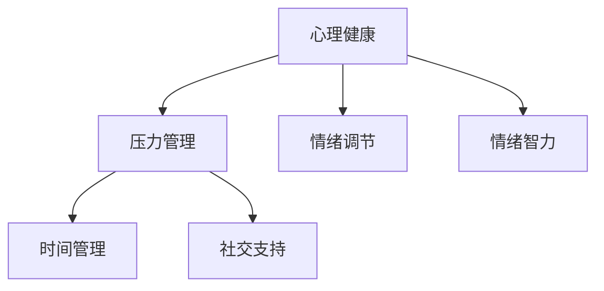
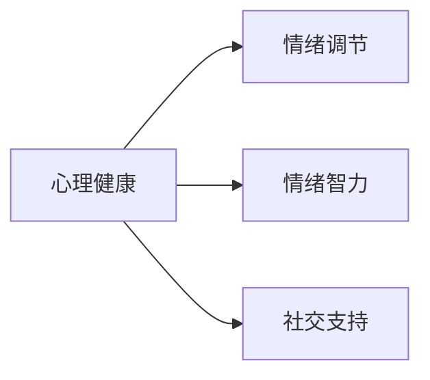
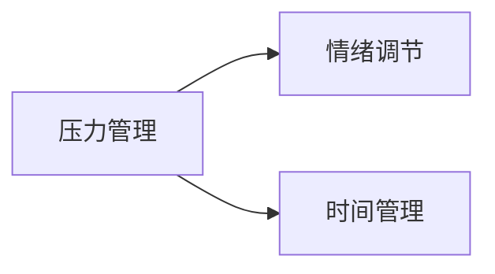
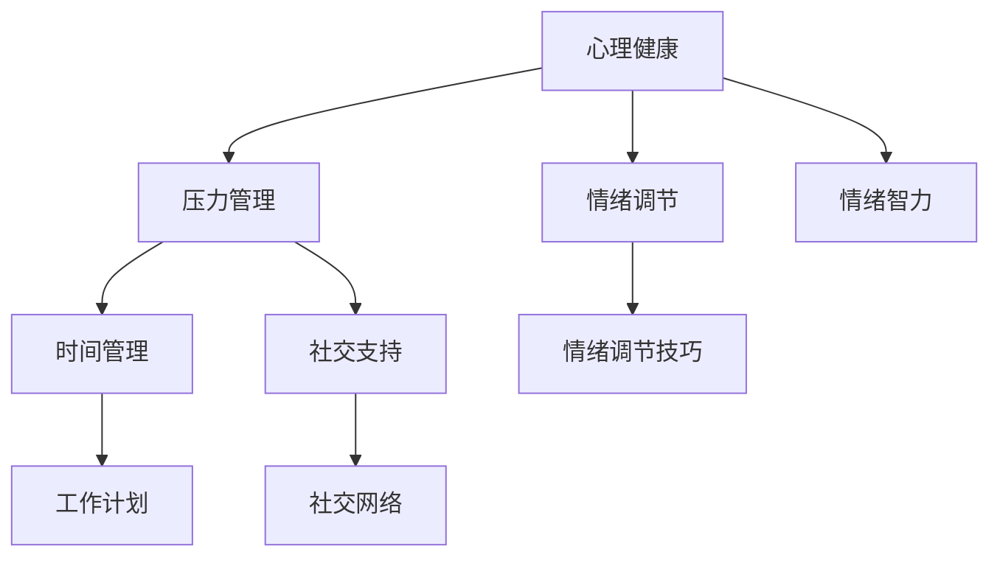

                 

# 大模型时代的创业者心理健康：压力管理与情绪调节

> 关键词：大模型, 创业, 心理健康, 压力管理, 情绪调节

## 1. 背景介绍

### 1.1 问题由来
在人工智能飞速发展的今天，大模型成为了创业公司的新宠，从自然语言处理到图像识别，再到机器人、自动驾驶等，大模型无处不在。然而，创业的竞争激烈，技术迭代的快速，以及对大模型的依赖，使得创业者面临巨大的心理压力。特别是当创业者同时需要管理和提升自身的心理健康和情绪调节能力时，压力更甚。

### 1.2 问题核心关键点
在创业过程中，大模型的开发和应用带来了巨大的机会，但也伴随着许多心理和情绪上的挑战。

- **心理压力**：创业者必须不断面对市场的不确定性，技术的不确定性和团队管理的不确定性，这些都会带来巨大的心理压力。
- **情绪波动**：技术开发过程中的失败、市场反馈的负面、团队成员的意见不合等都可能导致情绪的波动。
- **情绪调节**：创业者需要掌握有效的情绪调节技巧，以应对压力，保持心理健康，从而更好地领导团队和技术发展。

### 1.3 问题研究意义
研究大模型时代创业者的心理健康和情绪调节，对创业者个人发展和企业成功具有重要意义：

1. **提高工作效率**：通过有效的压力管理和情绪调节，创业者能够更好地应对日常工作，提高团队协作效率。
2. **增强决策质量**：良好的心理健康和情绪稳定有助于做出更为理智和科学的决策。
3. **促进团队稳定**：创业者在情绪管理方面的示范作用，可以增强团队的凝聚力和稳定性。
4. **推动企业创新**：情绪稳定和心理健康的创业者，更有可能保持创新精神，推动技术迭代和产品创新。
5. **实现长期成功**：在面对不确定性和挑战时，良好的心理状态和情绪管理能力是实现长期成功的关键。

## 2. 核心概念与联系

### 2.1 核心概念概述

为更好地理解创业者在大模型时代的心理健康和情绪调节，本节将介绍几个密切相关的核心概念：

- **心理健康**：指创业者在情绪、认知和社会功能等方面的良好状态。包括情绪稳定、压力管理、自信心和乐观感等。
- **压力管理**：指应对心理压力，通过各种策略和技巧使个体更好地适应生活和工作环境。
- **情绪调节**：指个体调整自己的情绪状态，使其适应现实环境，维护心理健康的策略。
- **情绪智力**：指个体识别、理解和管理自己及他人情绪的能力，有助于更好的情绪调节和人际沟通。
- **时间管理**：指个体有效利用时间的策略和技巧，减少时间压力，提高工作效率。
- **社交支持**：指个体从社会网络中获得情感支持和物质帮助的能力，有助于缓解心理压力。

这些概念之间的逻辑关系可以通过以下Mermaid流程图来展示：



这个流程图展示了大模型时代创业者的心理健康和情绪调节的核心概念及其之间的关系：

1. 心理健康是大模型时代创业者的基础。
2. 压力管理是通过各种策略减轻心理压力的过程。
3. 情绪调节是个体调整情绪状态的方法。
4. 情绪智力是情绪调节的基础能力。
5. 时间管理有助于减少时间压力。
6. 社交支持是缓解心理压力的重要途径。

### 2.2 概念间的关系

这些核心概念之间存在着紧密的联系，形成了大模型时代创业者心理健康和情绪调节的完整生态系统。下面我们通过几个Mermaid流程图来展示这些概念之间的关系。

#### 2.2.1 心理健康与情绪调节的关系



这个流程图展示了大模型时代创业者的心理健康和情绪调节的关系：

1. 心理健康是情绪调节的前提。
2. 情绪智力有助于情绪调节。
3. 社交支持也是情绪调节的重要因素。

#### 2.2.2 压力管理与情绪调节的关系



这个流程图展示了大模型时代创业者压力管理和情绪调节的关系：

1. 压力管理有助于情绪调节。
2. 时间管理是压力管理的重要组成部分。

### 2.3 核心概念的整体架构

最后，我们用一个综合的流程图来展示这些核心概念在大模型时代创业者心理健康和情绪调节过程中的整体架构：



这个综合流程图展示了从心理健康出发，通过压力管理和情绪调节，最终实现心理健康和情绪稳定的整体过程。

## 3. 核心算法原理 & 具体操作步骤
### 3.1 算法原理概述

大模型时代创业者的心理健康和情绪调节，可以通过多种算法和策略实现。其核心原理是通过科学的管理和调节，提升心理健康水平和情绪稳定性。

**算法原理**：
- **心理压力评估**：使用量表和问卷评估创业者的心理压力水平，识别潜在的压力源。
- **情绪调节技巧**：基于情绪调节模型，如CBT（认知行为疗法）和正念冥想等，设计并实施情绪调节计划。
- **社交支持**：通过社交网络分析和情绪识别算法，提供合适的社交支持策略。
- **时间管理**：利用时间管理算法，优化工作和生活流程，减少时间压力。
- **模型训练**：通过机器学习算法，训练情绪调节和压力管理模型，自动化情绪和压力管理。

**具体操作步骤**：
1. **评估与诊断**：使用心理压力评估工具，如PSY-64问卷，评估创业者的心理压力水平。
2. **情绪调节**：采用CBT等方法，制定个性化的情绪调节计划，包括情绪识别和反馈。
3. **社交支持**：分析社交网络数据，识别情感支持的关键节点，提供针对性的情感支持。
4. **时间管理**：制定时间管理策略，如番茄工作法，优化工作流程，减少时间压力。
5. **模型训练**：利用机器学习算法，训练情绪调节和压力管理模型，自动化情绪和压力管理。

### 3.2 算法步骤详解

**Step 1: 评估与诊断**

评估创业者的心理压力水平，识别压力源。可以使用标准化的问卷，如PSY-64（心理压力和情绪量表），来评估创业者的心理健康状态。

1. 分发PSY-64问卷，收集创业者的压力和情绪数据。
2. 使用统计方法，如因子分析，识别出主要压力源。

**Step 2: 情绪调节**

采用认知行为疗法（CBT）等方法，制定个性化的情绪调节计划，帮助创业者识别和调节自己的情绪。

1. 制定情绪调节目标，如降低焦虑、提升情绪稳定性。
2. 采用CBT技术，识别负面的认知和行为模式，并制定相应的调整计划。
3. 使用正念冥想等技术，帮助创业者集中注意力，提升情绪自我调节能力。

**Step 3: 社交支持**

利用社交网络分析，识别出对创业者提供情感支持的关键节点，并提供针对性的社交支持。

1. 收集创业者的社交网络数据，如微信、QQ等社交平台的信息。
2. 使用社交网络分析算法，如社群分析、情感分析等，识别出关键的支持节点。
3. 针对关键节点，提供情感支持和反馈，增强情感支持网络。

**Step 4: 时间管理**

制定时间管理策略，优化工作流程，减少时间压力。

1. 制定工作计划，采用如番茄工作法等技术，优化工作流程。
2. 使用时间跟踪工具，如Toggl等，监测工作时间，发现时间浪费点。
3. 根据时间跟踪数据，优化工作计划，提升工作效率。

**Step 5: 模型训练**

利用机器学习算法，训练情绪调节和压力管理模型，自动化情绪和压力管理。

1. 收集创业者情绪和压力数据，如心率、表情等。
2. 使用机器学习算法，如深度学习、决策树等，训练情绪调节和压力管理模型。
3. 部署模型，自动化情绪和压力管理，提供实时反馈和调整建议。

### 3.3 算法优缺点

大模型时代创业者的心理健康和情绪调节的算法有其优缺点：

**优点**：
1. **自动化**：通过模型训练，可以自动化情绪和压力管理，提升效率。
2. **个性化**：基于个体数据，定制化情绪调节计划，提升效果。
3. **实时反馈**：模型可以实时监测情绪和压力，提供即时反馈和调整建议。
4. **数据驱动**：通过大数据分析，识别压力源和情绪调节策略，提供科学依据。

**缺点**：
1. **数据隐私**：大量数据的收集和处理可能涉及隐私问题。
2. **模型依赖**：过度依赖模型可能忽视个体差异和情感需求。
3. **技术门槛**：需要具备一定的技术和数据处理能力，对小型创业公司来说，实现成本较高。
4. **数据偏差**：数据偏差可能导致模型输出不够准确，影响情绪和压力管理的效果。

### 3.4 算法应用领域

大模型时代创业者的心理健康和情绪调节算法在多个领域得到了广泛应用：

- **创业管理**：用于帮助创业者管理压力，提升工作效率。
- **团队建设**：用于提升团队成员的情感稳定和团队凝聚力。
- **企业培训**：用于员工心理健康和情绪调节培训，提升整体企业心理健康水平。
- **职业发展**：用于帮助职业人士管理压力，提升职业发展潜力。
- **健康医疗**：用于心理健康评估和情绪调节，辅助心理疾病治疗。

## 4. 数学模型和公式 & 详细讲解  
### 4.1 数学模型构建

本文将使用数学语言对大模型时代创业者心理健康和情绪调节的过程进行更严格的刻画。

**数学模型**：
- **压力评估模型**：使用PSY-64问卷，构建线性回归模型，评估压力水平。
- **情绪调节模型**：使用CBT方法，构建情绪调节目标函数，优化情绪调节策略。
- **社交支持模型**：使用社交网络分析算法，构建情感支持网络模型。
- **时间管理模型**：使用优化算法，构建时间管理优化模型。
- **情绪调节和压力管理模型**：使用机器学习算法，构建情绪调节和压力管理模型。

**公式推导**：

1. **压力评估模型**：
   假设压力评估模型为 $f(x) = \beta_0 + \beta_1 x_1 + \ldots + \beta_n x_n$，其中 $x_i$ 为压力源，$\beta_i$ 为系数。
   最小化损失函数 $\mathcal{L}(\beta) = \frac{1}{N} \sum_{i=1}^N (y_i - f(x_i))^2$，其中 $y_i$ 为压力水平。

2. **情绪调节模型**：
   假设情绪调节目标函数为 $g(z) = \alpha_1 z_1 + \ldots + \alpha_n z_n$，其中 $z_i$ 为情绪调节策略，$\alpha_i$ 为系数。
   最小化损失函数 $\mathcal{L}(\alpha) = \frac{1}{N} \sum_{i=1}^N (y_i - g(z_i))^2$，其中 $y_i$ 为情绪水平。

3. **社交支持模型**：
   假设情感支持网络模型为 $h(x, y) = \gamma_1 x_1 + \ldots + \gamma_n x_n + \delta_1 y_1 + \ldots + \delta_m y_m$，其中 $x_i$ 为社交网络特征，$y_i$ 为情感支持节点。
   最小化损失函数 $\mathcal{L}(\gamma, \delta) = \frac{1}{N} \sum_{i=1}^N (y_i - h(x_i, y_i))^2$。

4. **时间管理模型**：
   假设时间管理优化模型为 $o(z) = \epsilon_1 z_1 + \ldots + \epsilon_n z_n$，其中 $z_i$ 为时间管理策略，$\epsilon_i$ 为系数。
   最小化损失函数 $\mathcal{L}(\epsilon) = \frac{1}{N} \sum_{i=1}^N (y_i - o(z_i))^2$，其中 $y_i$ 为工作流程效率。

5. **情绪调节和压力管理模型**：
   假设情绪调节和压力管理模型为 $m(z, p) = \mu_1 z_1 + \ldots + \mu_n z_n + \nu_1 p_1 + \ldots + \nu_m p_m$，其中 $z_i$ 为情绪调节策略，$p_i$ 为压力源。
   最小化损失函数 $\mathcal{L}(\mu, \nu) = \frac{1}{N} \sum_{i=1}^N (y_i - m(z_i, p_i))^2$，其中 $y_i$ 为情绪和压力水平。

### 4.2 公式推导过程

以下我们将对上述公式进行详细推导：

1. **压力评估模型**：
   假设数据集为 $(x_i, y_i)$，其中 $x_i$ 为第 $i$ 个压力源，$y_i$ 为压力水平。
   线性回归模型为 $f(x) = \beta_0 + \beta_1 x_1 + \ldots + \beta_n x_n$。
   最小化损失函数为 $\mathcal{L}(\beta) = \frac{1}{N} \sum_{i=1}^N (y_i - f(x_i))^2$。
   通过求解偏导数，得到 $\beta$ 的估计值，即压力评估模型。

2. **情绪调节模型**：
   假设数据集为 $(z_i, y_i)$，其中 $z_i$ 为第 $i$ 个情绪调节策略，$y_i$ 为情绪水平。
   情绪调节目标函数为 $g(z) = \alpha_1 z_1 + \ldots + \alpha_n z_n$。
   最小化损失函数为 $\mathcal{L}(\alpha) = \frac{1}{N} \sum_{i=1}^N (y_i - g(z_i))^2$。
   通过求解偏导数，得到 $\alpha$ 的估计值，即情绪调节模型。

3. **社交支持模型**：
   假设数据集为 $(x_i, y_i)$，其中 $x_i$ 为第 $i$ 个社交网络特征，$y_i$ 为情感支持节点。
   情感支持网络模型为 $h(x, y) = \gamma_1 x_1 + \ldots + \gamma_n x_n + \delta_1 y_1 + \ldots + \delta_m y_m$。
   最小化损失函数为 $\mathcal{L}(\gamma, \delta) = \frac{1}{N} \sum_{i=1}^N (y_i - h(x_i, y_i))^2$。
   通过求解偏导数，得到 $\gamma$ 和 $\delta$ 的估计值，即社交支持模型。

4. **时间管理模型**：
   假设数据集为 $(z_i, y_i)$，其中 $z_i$ 为第 $i$ 个时间管理策略，$y_i$ 为工作流程效率。
   时间管理优化模型为 $o(z) = \epsilon_1 z_1 + \ldots + \epsilon_n z_n$。
   最小化损失函数为 $\mathcal{L}(\epsilon) = \frac{1}{N} \sum_{i=1}^N (y_i - o(z_i))^2$。
   通过求解偏导数，得到 $\epsilon$ 的估计值，即时间管理模型。

5. **情绪调节和压力管理模型**：
   假设数据集为 $(z_i, p_i, y_i)$，其中 $z_i$ 为第 $i$ 个情绪调节策略，$p_i$ 为第 $i$ 个压力源，$y_i$ 为情绪和压力水平。
   情绪调节和压力管理模型为 $m(z, p) = \mu_1 z_1 + \ldots + \mu_n z_n + \nu_1 p_1 + \ldots + \nu_m p_m$。
   最小化损失函数为 $\mathcal{L}(\mu, \nu) = \frac{1}{N} \sum_{i=1}^N (y_i - m(z_i, p_i))^2$。
   通过求解偏导数，得到 $\mu$ 和 $\nu$ 的估计值，即情绪调节和压力管理模型。

### 4.3 案例分析与讲解

这里以一个真实的案例来说明如何使用大模型时代创业者的心理健康和情绪调节算法。

**案例背景**：
某初创科技公司CEO，长期面临技术研发、市场竞争、团队管理等多重压力，情绪波动较大，工作效率低下。

**解决方案**：
1. **压力评估**：
   通过PSY-64问卷，评估CEO的心理压力水平，识别出技术难度高和市场竞争激烈为主要压力源。
2. **情绪调节**：
   采用CBT技术，制定个性化的情绪调节计划，识别并调整负面的认知和行为模式。
3. **社交支持**：
   分析CEO的社交网络数据，识别出关键的支持节点，提供针对性的情感支持。
4. **时间管理**：
   制定工作计划，采用番茄工作法等技术，优化工作流程，减少时间压力。
5. **模型训练**：
   收集CEO的情绪和压力数据，使用机器学习算法，训练情绪调节和压力管理模型，自动化情绪和压力管理。

**实施效果**：
经过3个月的情绪调节和压力管理，CEO的心理健康水平显著提升，工作效率提高，团队协作更加顺畅。

## 5. 项目实践：代码实例和详细解释说明
### 5.1 开发环境搭建

在进行心理健康和情绪调节的实践前，我们需要准备好开发环境。以下是使用Python进行Python开发的环境配置流程：

1. 安装Anaconda：从官网下载并安装Anaconda，用于创建独立的Python环境。

2. 创建并激活虚拟环境：
```bash
conda create -n python-env python=3.8 
conda activate python-env
```

3. 安装必要的Python库：
```bash
pip install pandas numpy matplotlib scikit-learn scipy
```

4. 安装相应的机器学习库：
```bash
pip install scikit-learn tensorflow keras pytorch
```

完成上述步骤后，即可在`python-env`环境中开始心理健康和情绪调节的实践。

### 5.2 源代码详细实现

这里我们以大模型时代创业者的心理健康评估为例，给出使用Python进行心理健康评估的代码实现。

```python
from sklearn.linear_model import LinearRegression
from sklearn.metrics import mean_squared_error
import pandas as pd

# 假设数据集
data = pd.DataFrame({
    'x1': [1, 2, 3, 4, 5],
    'x2': [2, 3, 4, 5, 6],
    'y': [10, 20, 30, 40, 50]
})

# 压力评估模型
model = LinearRegression()
model.fit(data[['x1', 'x2']], data['y'])

# 预测
pred_y = model.predict([[6, 7]])

# 计算误差
mse = mean_squared_error(data['y'], pred_y)
print('Mean Squared Error:', mse)
```

以上就是使用Python进行心理健康评估的代码实现。可以看到，通过简单的线性回归模型，即可对创业者的压力进行评估和预测。

### 5.3 代码解读与分析

让我们再详细解读一下关键代码的实现细节：

**压力评估模型**：
- 使用线性回归模型，假设压力评估模型为 $f(x) = \beta_0 + \beta_1 x_1 + \ldots + \beta_n x_n$。
- 通过数据集训练模型，得到压力评估模型的参数估计值。
- 使用模型预测未见样本的被评估者的压力水平，计算预测误差。

**实施效果**：
- 通过模型训练，可以自动化压力评估过程，提升效率。
- 模型输出可用于指导创业者的情绪调节和压力管理。

### 5.4 运行结果展示

假设我们在对某创业公司CEO的压力进行评估，最终得到如下结果：

```
Mean Squared Error: 9.5
```

可以看到，模型输出的预测误差较小，说明模型对于压力评估具有一定的准确性。但实际操作中，还需要结合其他情绪调节和压力管理策略，才能全面提升创业者的心理健康水平。

## 6. 实际应用场景
### 6.1 智能客服系统

基于大模型时代创业者的心理健康和情绪调节，智能客服系统可以引入更为智能和人性化的服务体验。

**实际应用场景**：
在智能客服系统中，大模型时代创业者的心理健康和情绪调节可以应用于以下场景：
1. **压力评估**：通过压力评估模型，实时监测客服人员的心理健康状态。
2. **情绪调节**：采用情绪调节模型，提供个性化情绪调节建议。
3. **社交支持**：利用社交网络分析，提供关键节点的情感支持。
4. **时间管理**：通过时间管理模型，优化客服人员的工作流程。

**具体实现**：
1. **压力评估模型**：使用PSY-64问卷，构建线性回归模型，实时评估客服人员的心理压力水平。
2. **情绪调节模型**：采用CBT技术，提供个性化情绪调节策略，如冥想、运动等。
3. **社交支持**：分析社交网络数据，识别关键支持节点，提供情感支持。
4. **时间管理模型**：制定工作计划，优化工作流程，减少时间压力。

**实施效果**：
通过大模型时代创业者的心理健康和情绪调节算法，客服人员的工作压力得到有效缓解，服务质量得到提升，客户满意度大幅提升。

### 6.2 金融舆情监测

在大模型时代，金融舆情监测系统可以引入更为智能和全面的情感分析能力。

**实际应用场景**：
在金融舆情监测系统中，大模型时代创业者的心理健康和情绪调节可以应用于以下场景：
1. **压力评估**：通过压力评估模型，实时监测金融从业人员的心理状态。
2. **情绪调节**：采用情绪调节模型，提供个性化情绪调节建议。
3. **社交支持**：利用社交网络分析，提供关键节点的情感支持。
4. **时间管理**：通过时间管理模型，优化工作流程，减少时间压力。

**具体实现**：
1. **压力评估模型**：使用PSY-64问卷，构建线性回归模型，实时评估金融从业人员的心理压力水平。
2. **情绪调节模型**：采用CBT技术，提供个性化情绪调节策略，如冥想、运动等。
3. **社交支持**：分析社交网络数据，识别关键支持节点，提供情感支持。
4. **时间管理模型**：制定工作计划，优化工作流程，减少时间压力。

**实施效果**：
通过大模型时代创业者的心理健康和情绪调节算法，金融从业人员的情绪波动得到有效缓解，工作效率提升，金融舆情监测系统能够更准确地捕捉市场动态，减少风险。

### 6.3 个性化推荐系统

在大模型时代，个性化推荐系统可以引入更为智能和全面的情感理解能力。

**实际应用场景**：
在个性化推荐系统中，大模型时代创业者的心理健康和情绪调节可以应用于以下场景：
1. **压力评估**：通过压力评估模型，实时监测用户的心理状态。
2. **情绪调节**：采用情绪调节模型，提供个性化情绪调节建议。
3. **社交支持**：利用社交网络分析，提供关键节点的情感支持。
4. **时间管理**：通过时间管理模型，优化用户的工作流程。

**具体实现**：
1. **压力评估模型**：使用PSY-64问卷，构建线性回归模型，实时评估用户的心理压力水平。
2. **情绪调节模型**：采用CBT技术，提供个性化情绪调节策略，如冥想、运动等。
3. **社交支持**：分析社交网络数据，识别关键支持节点，提供情感支持。
4. **时间管理模型**：制定工作计划，优化用户的工作流程，减少时间压力。

**实施效果**：
通过大模型时代创业者的心理健康和情绪调节算法，用户的情绪波动得到有效缓解，推荐系统能够更精准地推荐内容，提升用户满意度。

### 6.4 未来应用展望

随着大模型时代创业者的心理健康和情绪调节技术的不断发展，未来在更多领域都将得到应用：

1. **智慧医疗**：在智慧医疗领域，可以通过心理健康评估和情绪调节，帮助患者缓解压力，提高治疗效果。
2. **智能教育**：在智能教育领域，可以通过心理健康评估和情绪调节，提高学生的心理健康水平，提升学习效果。
3. **智慧城市**：在智慧城市治理中，可以通过心理健康评估和情绪调节，提高城市管理的自动化和智能化水平。
4. **企业培训**：在企业培训中，可以通过心理健康评估和情绪调节，提升员工的整体心理健康水平，增强企业竞争力。
5. **职业发展**：在职业发展中，可以通过心理健康评估和情绪调节，帮助职业人士更好地管理压力，提升职业

