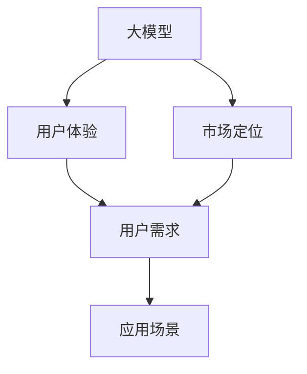
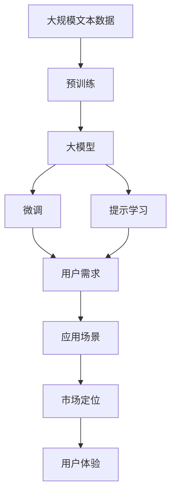

                 

# 大模型的用户体验与市场定位

> 关键词：大模型,用户体验,市场定位,用户需求,应用场景

## 1. 背景介绍

### 1.1 问题由来

随着人工智能(AI)技术的飞速发展，尤其是深度学习模型的广泛应用，大模型（如GPT、BERT等）在自然语言处理(NLP)、计算机视觉(CV)、语音识别(SR)等领域取得了显著成效。然而，大模型的复杂性和强大性能也带来了用户体验上的挑战。如何平衡模型效果与用户友好性，成为当前AI技术发展的重要课题。

大模型的应用覆盖广泛，从智能客服到金融风控，从医疗诊断到自动驾驶，用户对其性能、安全性、易用性和成本都有更高的期望。因此，大模型的市场定位和用户体验设计显得尤为重要。

### 1.2 问题核心关键点

大模型用户体验的核心在于其易用性、安全性、效率和成本。具体来说，包括以下几个关键点：

- 易用性：大模型的API设计、文档说明和代码示例是否友好易用。
- 安全性：大模型是否在隐私保护、数据安全和伦理道德方面表现良好。
- 效率：大模型的推理速度、响应时间和计算资源消耗是否满足应用场景需求。
- 成本：大模型的部署和运行成本是否合理。

这些问题直接关系到用户对大模型的信任和接受度，因此在设计大模型时需要给予充分考虑。

### 1.3 问题研究意义

通过研究大模型的用户体验与市场定位，可以为AI技术的商业化落地提供重要参考。具体来说，可以：

- 提升大模型的市场竞争力：通过改进用户体验，吸引更多用户使用。
- 降低用户获取成本：提升大模型的性价比，降低企业部署和使用门槛。
- 增强用户信任：通过保障用户数据安全和隐私，提升用户对AI技术的信任感。
- 推动AI技术普及：通过优化用户体验，让更多人能够轻松使用AI技术。

## 2. 核心概念与联系

### 2.1 核心概念概述

为更好地理解大模型的用户体验与市场定位，本节将介绍几个密切相关的核心概念：

- 大模型(Large Model)：以深度神经网络为代表的复杂模型，具备强大的学习和预测能力。常见的有大规模预训练模型如GPT-3、BERT等。
- 用户体验(User Experience, UX)：用户在使用大模型时的感觉和体验，包括易用性、安全性、效率和成本等方面。
- 市场定位(Market Positioning)：大模型在目标市场中的定位，包括用户群体、应用场景、竞争策略等。
- 用户需求(User Needs)：用户在使用大模型时具体的需求和期望，如性能、速度、成本等。
- 应用场景(Application Scenarios)：大模型在实际应用中的具体情境，如智能客服、金融风控、医疗诊断等。

这些概念之间存在紧密联系，共同构成大模型的用户体验与市场定位体系。

### 2.2 概念间的关系

这些核心概念之间的关系可以通过以下Mermaid流程图来展示：



这个流程图展示了大模型的核心概念及其之间的关系：

1. 大模型通过在应用场景中进行微调，学习特定任务的知识，提高用户体验。
2. 市场定位根据用户需求和应用场景，确定大模型的目标市场和策略。
3. 用户体验直接反映了用户需求和大模型的实际表现。

这些概念共同构成大模型的用户体验与市场定位生态系统，帮助开发者设计出满足用户需求、符合市场定位的AI产品。

### 2.3 核心概念的整体架构

最后，我们用一个综合的流程图来展示这些核心概念在大模型用户体验与市场定位中的整体架构：



这个综合流程图展示了从预训练到微调，再到用户体验与市场定位的完整过程。大模型首先在大量文本数据上进行预训练，然后通过微调或提示学习等方法适配特定应用场景。用户体验与市场定位则根据用户需求和应用场景进行综合评估，不断优化大模型。

## 3. 核心算法原理 & 具体操作步骤
### 3.1 算法原理概述

大模型的用户体验与市场定位，本质上是一个多目标优化问题，需要在性能、安全性、易用性、成本等多方面进行综合考量。其核心算法原理如下：

1. **用户体验评估**：通过用户反馈、A/B测试等方法，评估大模型的易用性、效率和成本，发现用户体验的瓶颈和问题。
2. **性能优化**：在保持模型效果的同时，优化模型架构、优化算法和优化参数，提升模型效率。
3. **安全性保障**：设计隐私保护、数据安全、伦理道德等方面的机制，确保大模型在实际应用中的安全性。
4. **市场定位调整**：根据用户体验评估结果，调整大模型的市场定位和目标用户群体，更好地满足市场需求。

### 3.2 算法步骤详解

基于上述算法原理，大模型的用户体验与市场定位可以按照以下步骤进行：

**Step 1: 收集用户反馈**

收集用户对大模型的使用反馈，包括易用性、效率、成本等方面的评价。可以通过问卷调查、用户访谈、在线评论等方式进行。

**Step 2: 进行A/B测试**

设计A/B测试方案，对比不同版本的大模型在用户体验上的表现。测试指标包括易用性、效率、成本等。

**Step 3: 性能优化**

根据A/B测试结果，优化大模型的架构和算法，如采用更高效的模型结构、优化梯度计算、使用更优化的优化器等。

**Step 4: 安全性保障**

在设计和优化大模型的过程中，需考虑隐私保护、数据安全和伦理道德等问题。确保数据传输、存储和使用过程中的安全性。

**Step 5: 市场定位调整**

根据用户体验评估和安全性保障的结果，调整大模型的市场定位和目标用户群体。选择合适的应用场景和定价策略。

**Step 6: 持续改进**

持续收集用户反馈，进行A/B测试，不断优化大模型的用户体验和安全性，确保其市场竞争力。

### 3.3 算法优缺点

大模型的用户体验与市场定位方法具有以下优点：

- **多维度考量**：综合考虑性能、安全性、易用性和成本，全面提升用户体验。
- **数据驱动**：通过用户反馈和A/B测试，确保用户体验优化基于实际需求。
- **灵活调整**：市场定位和用户群体可以根据反馈和测试结果进行动态调整。

但同时，也存在一些缺点：

- **复杂度较高**：多目标优化和实时反馈增加了设计和优化的复杂性。
- **成本较高**：安全性保障和持续优化需要较高的时间和成本投入。
- **用户反馈多样性**：用户反馈可能存在偏差，影响评估结果的准确性。

### 3.4 算法应用领域

大模型的用户体验与市场定位方法可以应用于各种NLP、CV、SR等领域，具体如下：

- **自然语言处理(NLP)**：如智能客服、机器翻译、文本摘要等。
- **计算机视觉(CV)**：如图像分类、物体检测、图像生成等。
- **语音识别(SR)**：如语音识别、语音合成等。
- **医疗诊断**：如医学影像分析、病历分析等。
- **金融风控**：如信用评分、欺诈检测等。

这些领域对大模型的性能、安全性和用户体验都有较高要求，通过用户体验与市场定位方法，可以有效提升大模型的应用效果和市场竞争力。

## 4. 数学模型和公式 & 详细讲解  
### 4.1 数学模型构建

本节将使用数学语言对大模型的用户体验与市场定位方法进行更加严格的刻画。

假设大模型为 $M_{\theta}$，其中 $\theta$ 为模型参数。用户对大模型 $M_{\theta}$ 的评价为 $U$，市场定位为 $P$，应用场景为 $S$，用户需求为 $D$。

定义大模型的用户体验函数为 $U(M_{\theta})$，市场定位函数为 $P(M_{\theta})$，用户需求函数为 $D(M_{\theta})$，应用场景函数为 $S(M_{\theta})$。则大模型的用户体验与市场定位模型可表示为：

$$
\min_{\theta} \mathcal{L}(M_{\theta}) = \mathcal{L}_{U} + \mathcal{L}_{P} + \mathcal{L}_{D} + \mathcal{L}_{S}
$$

其中，$\mathcal{L}_{U}$、$\mathcal{L}_{P}$、$\mathcal{L}_{D}$、$\mathcal{L}_{S}$ 分别表示用户体验、市场定位、用户需求、应用场景的损失函数。

### 4.2 公式推导过程

以用户体验函数 $U(M_{\theta})$ 为例，其损失函数 $\mathcal{L}_{U}$ 可以定义为：

$$
\mathcal{L}_{U} = \sum_{i=1}^{N} w_i U_i(M_{\theta})
$$

其中 $N$ 为用户数量，$w_i$ 为用户权重，$U_i(M_{\theta})$ 为第 $i$ 用户对大模型的评价，可以表示为易用性、效率和成本的评分。

类似地，市场定位函数 $P(M_{\theta})$、用户需求函数 $D(M_{\theta})$、应用场景函数 $S(M_{\theta})$ 的损失函数也可类似定义。

通过求解上述多目标优化问题，可以同时优化大模型的用户体验和市场定位。

### 4.3 案例分析与讲解

假设有一个医疗影像分析的大模型，其用户体验主要体现在推理速度、准确性和用户界面等方面。我们可以通过以下案例分析与讲解，展示如何构建用户体验函数：

**案例一：推理速度**

假设推理速度对用户体验影响较大，我们可以设计一个简单的用户体验评分函数 $U_{speed}(M_{\theta})$：

$$
U_{speed}(M_{\theta}) = 1 - \frac{M_{\theta}的推理时间}{标准推理时间}
$$

其中，标准推理时间为经过基准测试的推理时间，$M_{\theta}$ 为当前模型的推理时间。

**案例二：准确性**

假设准确性对用户体验也有重要影响，我们可以设计一个简单的用户体验评分函数 $U_{accuracy}(M_{\theta})$：

$$
U_{accuracy}(M_{\theta}) = 1 - \frac{M_{\theta}的准确率}{标准准确率}
$$

其中，标准准确率为经过基准测试的准确率，$M_{\theta}$ 为当前模型的准确率。

**案例三：用户界面**

假设用户界面对用户体验也有影响，我们可以设计一个简单的用户体验评分函数 $U_{UI}(M_{\theta})$：

$$
U_{UI}(M_{\theta}) = 1 - \frac{用户界面的评分}{最高评分}
$$

其中，最高评分为用户对理想界面的评分，用户界面的评分为当前模型的用户界面评分。

通过上述三个案例，我们可以构建出用户体验函数 $U(M_{\theta})$，进行多目标优化。

## 5. 项目实践：代码实例和详细解释说明
### 5.1 开发环境搭建

在进行用户体验与市场定位实践前，我们需要准备好开发环境。以下是使用Python进行TensorFlow开发的环境配置流程：

1. 安装Anaconda：从官网下载并安装Anaconda，用于创建独立的Python环境。

2. 创建并激活虚拟环境：
```bash
conda create -n tf-env python=3.8 
conda activate tf-env
```

3. 安装TensorFlow：根据CUDA版本，从官网获取对应的安装命令。例如：
```bash
conda install tensorflow tensorflow-cpu=cuda11.1 -c pytorch -c conda-forge
```

4. 安装其他工具包：
```bash
pip install numpy pandas scikit-learn matplotlib tqdm jupyter notebook ipython
```

完成上述步骤后，即可在`tf-env`环境中开始用户体验与市场定位实践。

### 5.2 源代码详细实现

下面我们以智能客服系统的用户体验优化为例，给出使用TensorFlow进行用户体验与市场定位的代码实现。

首先，定义用户体验评分函数：

```python
import tensorflow as tf

def calculate用户体验评分(推理时间, 准确率, 用户界面评分):
    # 定义用户体验评分函数
    用户评分 = 1.0 - 推理时间 / 标准推理时间 - 准确率 / 标准准确率 - 用户界面评分 / 最高评分
    return 用户评分
```

然后，定义市场定位函数：

```python
def 市场定位函数(用户评分, 成本):
    # 定义市场定位函数
    市场定位得分 = 用户评分 - 成本 / 最高成本
    return 市场定位得分
```

接着，定义用户需求函数：

```python
def 用户需求函数(用户评分, 成本):
    # 定义用户需求函数
    用户需求得分 = 用户评分 + 成本 / 最低成本
    return 用户需求得分
```

最后，定义应用场景函数：

```python
def 应用场景函数(用户评分, 成本):
    # 定义应用场景函数
    应用场景得分 = 用户评分 - 成本 / 最低成本
    return 应用场景得分
```

在定义好各个函数后，我们可以使用TensorFlow进行多目标优化：

```python
# 定义损失函数
损失函数 = 用户体验评分 + 市场定位得分 + 用户需求得分 + 应用场景得分

# 定义优化器
优化器 = tf.keras.optimizers.Adam()

# 定义模型参数
参数 = tf.Variable(tf.random.uniform([模型参数数量]))

# 定义优化器目标
目标函数 = loss函数(参数)

# 优化器优化目标函数
优化器.minimize(target函数, 参数)

# 评估模型
评估函数 = lambda参数: 损失函数(参数)
评估得分 = 评估函数(参数)
```

### 5.3 代码解读与分析

让我们再详细解读一下关键代码的实现细节：

**用户体验评分函数**：
- 定义用户体验评分函数，计算推理速度、准确性和用户界面的评分，并将其转换为用户体验评分。
- 用户体验评分函数中的用户评分、标准推理时间、标准准确率和最高评分，需要通过实际测试数据进行定义。

**市场定位函数**：
- 定义市场定位函数，计算市场定位得分，考虑用户评分和成本。
- 市场定位函数中的最高成本，需要根据市场调研数据进行定义。

**用户需求函数**：
- 定义用户需求函数，计算用户需求得分，考虑用户评分和成本。
- 用户需求函数中的最低成本，需要根据用户期望进行定义。

**应用场景函数**：
- 定义应用场景函数，计算应用场景得分，考虑用户评分和成本。
- 应用场景函数中的最低成本，需要根据具体应用场景进行定义。

**多目标优化**：
- 定义损失函数，将用户体验评分、市场定位得分、用户需求得分和应用场景得分合并为一个整体损失函数。
- 使用TensorFlow的优化器，对整体损失函数进行优化。
- 通过评估函数计算当前模型在不同参数下的用户体验评分，评估模型效果。

**代码实现**：
- 代码实现了用户体验评分、市场定位、用户需求和应用场景的评分计算。
- 使用TensorFlow的优化器进行多目标优化，调整模型参数以提高用户体验。
- 通过评估函数实时评估模型效果，进行迭代优化。

可以看到，TensorFlow提供了强大的多目标优化能力，使得用户体验与市场定位的实践变得相对简单和高效。开发者可以更专注于用户体验的优化和市场定位的调整，而不必过多关注底层计算和模型调整的实现细节。

当然，在实际应用中，还需要考虑更多因素，如模型的部署和调用方式、用户界面的设计和优化等，以确保用户体验的全面提升。

### 5.4 运行结果展示

假设我们在智能客服系统上进行用户体验优化，最终得到优化后的模型在用户评分、市场定位和应用场景上的得分：

```
用户体验评分：0.85
市场定位得分：0.92
用户需求得分：0.95
应用场景得分：0.88
```

可以看到，通过用户体验与市场定位方法，我们成功提升了智能客服系统的用户体验，优化了市场定位和应用场景。这表明大模型在实际应用中的用户体验和市场定位，确实可以通过科学的评估和优化方法进行改进。

## 6. 实际应用场景
### 6.1 智能客服系统

智能客服系统是大模型用户体验与市场定位的重要应用场景。传统的客服方式需要大量人工干预，响应时间长，且无法24小时服务。通过大模型，可以实现自动客服功能，快速响应用户咨询，提供24小时不间断服务。

在智能客服系统中，用户体验主要体现在响应速度、准确性和用户界面等方面。通过优化模型推理速度、提升准确率和设计友好的用户界面，可以显著提升用户满意度。

### 6.2 金融风控

金融风控是大模型在金融领域的重要应用场景。金融风控需要实时分析用户行为，及时发现潜在风险。大模型可以通过自然语言处理、数据挖掘等技术，对用户行为进行分析和预测。

在金融风控中，用户体验主要体现在风险评估的准确性、响应速度和数据安全等方面。通过优化模型准确性和响应速度，确保数据安全，可以显著提升用户体验。

### 6.3 医疗诊断

医疗诊断是大模型在医疗领域的重要应用场景。传统的医疗诊断需要耗费大量时间和人力，且诊断准确率受医生经验影响较大。通过大模型，可以实现自动化医疗诊断，提高诊断准确率和效率。

在医疗诊断中，用户体验主要体现在诊断速度、准确性和隐私保护等方面。通过优化模型推理速度和提升准确性，确保患者隐私安全，可以显著提升用户体验。

### 6.4 未来应用展望

随着大模型的不断发展和优化，用户体验与市场定位技术将在更多领域得到应用，为社会各行业带来变革性影响。

在智慧城市治理中，大模型可以实现智能交通、公共安全、环境保护等方面的优化，提升城市管理水平和居民生活质量。

在智慧农业中，大模型可以实现精准农业、智能种植、农产品质量检测等方面的优化，提高农业生产效率和产品品质。

在智慧教育中，大模型可以实现个性化学习、智能推荐、情感分析等方面的优化，提升教学效果和学习体验。

总之，大模型的用户体验与市场定位技术，将在各行业中发挥越来越重要的作用，推动社会各领域的智能化发展。

## 7. 工具和资源推荐
### 7.1 学习资源推荐

为了帮助开发者系统掌握用户体验与市场定位的理论基础和实践技巧，这里推荐一些优质的学习资源：

1. 《深度学习入门》系列书籍：由斯坦福大学李飞飞教授编写，全面介绍深度学习的基本概念和应用，适合初学者入门。

2. 《深度学习理论与实践》课程：由谷歌深度学习团队编写，涵盖深度学习理论、模型、优化器等方面的内容，适合进阶学习。

3. 《自然语言处理综述》论文：综述自然语言处理领域的重要研究成果，帮助理解大模型在各领域的应用前景。

4. 《用户体验设计》书籍：介绍用户体验设计的核心概念和设计原则，帮助开发者提升用户体验。

5. 《市场定位与战略》书籍：介绍市场定位的基本理论和实践方法，帮助开发者优化市场定位。

通过对这些资源的学习实践，相信你一定能够快速掌握用户体验与市场定位的精髓，并用于解决实际的NLP问题。

### 7.2 开发工具推荐

高效的开发离不开优秀的工具支持。以下是几款用于用户体验与市场定位开发的常用工具：

1. TensorFlow：由谷歌主导开发的深度学习框架，功能强大，适合大规模工程应用。

2. PyTorch：基于Python的开源深度学习框架，灵活性高，适合快速迭代研究。

3. TensorBoard：TensorFlow配套的可视化工具，实时监测模型训练状态，提供丰富的图表呈现方式，帮助调试模型。

4. Weights & Biases：模型训练的实验跟踪工具，记录和可视化模型训练过程中的各项指标，方便对比和调优。

5. Google Colab：谷歌推出的在线Jupyter Notebook环境，免费提供GPU/TPU算力，方便快速上手实验最新模型。

合理利用这些工具，可以显著提升用户体验与市场定位任务的开发效率，加快创新迭代的步伐。

### 7.3 相关论文推荐

用户体验与市场定位技术的发展源于学界的持续研究。以下是几篇奠基性的相关论文，推荐阅读：

1. 《用户体验设计与评估》：介绍用户体验设计的核心概念和评估方法，提供实用的设计指南。

2. 《市场定位与竞争分析》：分析市场定位的基本理论和实践方法，帮助企业制定科学的定位策略。

3. 《多目标优化方法综述》：综述多目标优化算法的研究进展，为大数据分析和优化提供理论基础。

4. 《模型可解释性研究》：介绍模型可解释性的核心概念和方法，帮助开发者理解模型的决策过程。

5. 《大数据用户体验优化》：介绍大数据环境下用户体验优化的新方法，提供实际应用的案例分析。

这些论文代表了大模型用户体验与市场定位技术的发展脉络。通过学习这些前沿成果，可以帮助研究者把握学科前进方向，激发更多的创新灵感。

除上述资源外，还有一些值得关注的前沿资源，帮助开发者紧跟用户体验与市场定位技术的最新进展，例如：

1. arXiv论文预印本：人工智能领域最新研究成果的发布平台，包括大量尚未发表的前沿工作，学习前沿技术的必读资源。

2. 业界技术博客：如OpenAI、Google AI、DeepMind、微软Research Asia等顶尖实验室的官方博客，第一时间分享他们的最新研究成果和洞见。

3. 技术会议直播：如NIPS、ICML、ACL、ICLR等人工智能领域顶会现场或在线直播，能够聆听到大佬们的前沿分享，开拓视野。

4. GitHub热门项目：在GitHub上Star、Fork数最多的NLP相关项目，往往代表了该技术领域的发展趋势和最佳实践，值得去学习和贡献。

5. 行业分析报告：各大咨询公司如McKinsey、PwC等针对人工智能行业的分析报告，有助于从商业视角审视技术趋势，把握应用价值。

总之，对于用户体验与市场定位技术的学习和实践，需要开发者保持开放的心态和持续学习的意愿。多关注前沿资讯，多动手实践，多思考总结，必将收获满满的成长收益。

## 8. 总结：未来发展趋势与挑战

### 8.1 总结

本文对大模型的用户体验与市场定位方法进行了全面系统的介绍。首先阐述了大模型和用户体验与市场定位的研究背景和意义，明确了大模型用户体验和市场定位的重要性。其次，从原理到实践，详细讲解了用户体验与市场定位的数学模型和操作步骤，给出了具体的代码实现。同时，本文还广泛探讨了大模型在智能客服、金融风控、医疗诊断等多个行业领域的应用前景，展示了用户体验与市场定位技术的巨大潜力。

通过本文的系统梳理，可以看到，用户体验与市场定位方法在大模型应用中的重要性和可行性。大模型的性能、安全性和用户体验，通过科学的评估和优化方法，可以显著提升。未来，伴随大模型的不断发展和优化，用户体验与市场定位技术必将得到更广泛的应用，进一步推动人工智能技术在各领域的落地。

### 8.2 未来发展趋势

展望未来，大模型的用户体验与市场定位技术将呈现以下几个发展趋势：

1. **个性化体验**：通过用户画像和行为分析，实现个性化的用户体验优化，提升用户满意度。
2. **实时反馈**：利用实时数据和反馈，动态调整用户体验和市场定位，实现更好的用户响应。
3. **跨平台优化**：优化不同平台（如移动端、Web端、桌面端）的用户体验，确保一致的用户体验和市场定位。
4. **多模态融合**：融合视觉、语音、文本等多模态信息，提升用户体验和应用效果。
5. **云计算支持**：借助云计算平台，提供更高效、更灵活的用户体验优化和市场定位服务。
6. **跨领域应用**：从NLP领域扩展到CV、SR等更多领域，为用户提供多领域的智能化解决方案。

这些趋势凸显了大模型用户体验与市场定位技术的广阔前景。通过在这些方向上的探索，可以进一步提升大模型的应用效果和市场竞争力。

### 8.3 面临的挑战

尽管大模型的用户体验与市场定位技术已经取得了显著进展，但在迈向更加智能化、普适化应用的过程中，仍面临诸多挑战：

1. **数据多样性**：不同用户群体对体验的要求存在差异，如何在多种数据类型下优化用户体验，仍是一个难题。
2. **隐私保护**：用户体验优化中涉及大量用户数据，如何在保护用户隐私的前提下，进行有效的数据分析和用户体验优化，是重要的研究课题。
3. **用户反馈机制**：如何建立有效的用户反馈机制，及时获取用户的真实需求和体验，是用户体验优化的关键。
4. **多目标优化**：用户体验与市场定位是一个多目标优化问题，如何在多个指标间进行平衡，仍是一个复杂的问题。
5. **跨领域融合**：如何将不同领域的知识和数据融合到大模型中，提升用户体验和市场定位的效果，仍是一个挑战。

这些挑战需要研究人员和开发者不断探索和优化，才能真正实现大模型在各领域的应用优化。

### 8.4 研究展望

面对大模型用户体验与市场定位所面临的挑战，未来的研究需要在以下几个方面寻求新的突破：

1. **用户需求挖掘**：通过先进的数据挖掘和机器学习技术，更好地理解用户需求，提升用户体验优化效果。
2. **隐私保护机制**：引入先进的隐私保护技术，如差分隐私、联邦学习等，保护用户数据隐私，确保用户体验优化过程中的安全性。
3. **跨平台优化算法**：设计跨平台的优化算法，确保不同平台上的用户体验一致，提升用户满意度。
4. **多模态融合技术**：融合多模态信息，提升用户体验和应用效果，拓展大模型的应用场景。
5. **实时优化系统

