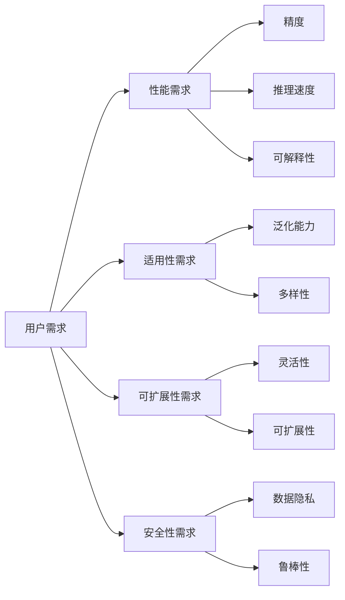
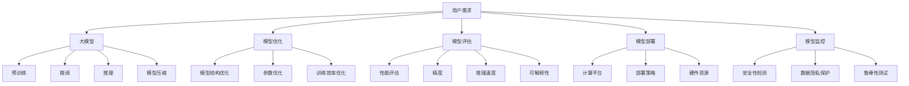

                 

# 大模型的用户需求与市场前景

## 1. 背景介绍

### 1.1 问题由来
近年来，深度学习技术的飞速发展催生了诸多大型预训练模型，如GPT、BERT、T5等，这些模型在诸如语言理解、自然语言生成、问答系统、文本摘要、机器翻译等多个领域取得了显著的突破。尽管这些模型在学术界和工业界都已得到广泛应用，但面临的挑战依旧严峻。用户需求不断增长，技术瓶颈愈发突出，如何满足用户日益增长的需求，并最大化模型效能，成为了当前大模型研究的一个重要课题。

### 1.2 问题核心关键点
当前，用户对大模型的需求主要集中在以下几个方面：

1. **性能需求**：用户希望大模型在处理语言任务时具备更高的精度、更高的推理速度，以及更好的可解释性。
2. **适用性需求**：用户希望模型能够适用于更多样化、更多领域的数据集，具备较强的泛化能力。
3. **可扩展性需求**：用户希望模型可以轻松地在不同的计算平台、不同的硬件资源上进行部署，具有较高的灵活性和可扩展性。
4. **安全性需求**：用户希望模型在处理敏感数据时能够保障数据隐私，并具备较高的鲁棒性，能够抵御各种攻击和干扰。

### 1.3 问题研究意义
研究大模型的用户需求与市场前景，有助于技术开发者更准确地把握用户需求，优化模型设计，开发出更符合市场需求的模型，推动人工智能技术在各行各业的落地应用。

## 2. 核心概念与联系

### 2.1 核心概念概述
大模型主要指大规模预训练语言模型（如BERT、GPT系列），这些模型通过在大规模无标签文本上预训练，学习到了丰富的语言知识和常识。用户需求则涵盖了大模型的性能、适用性、可扩展性和安全性等方面。

### 2.2 核心概念原理和架构的 Mermaid 流程图(Mermaid 流程节点中不要有括号、逗号等特殊字符)



该流程图展示了用户需求与大模型性能、适用性、可扩展性和安全性之间的联系。性能需求关注模型的精度、推理速度和可解释性；适用性需求聚焦模型的泛化能力和多样性；可扩展性需求则涉及模型的灵活性和可扩展性；安全性需求关乎模型的数据隐私和鲁棒性。

### 2.3 核心概念的整体架构



该整体架构图展示了用户需求通过模型优化、模型评估、模型部署和模型监控等环节，最终实现大模型的性能提升和安全保障。预训练、微调和推理是大模型的核心组件，模型压缩、模型优化和训练效率优化是提升性能的关键手段。

## 3. 核心算法原理 & 具体操作步骤

### 3.1 算法原理概述
基于用户需求的大模型优化主要包括以下几个步骤：

1. **性能优化**：通过模型结构优化、参数优化和训练效率优化等方法，提升模型的精度和推理速度。
2. **适用性提升**：通过微调、迁移学习和多模态融合等技术，增强模型的泛化能力和多样性。
3. **可扩展性设计**：通过模型压缩、分布式训练等手段，确保模型在各种计算平台和硬件资源上的灵活性和可扩展性。
4. **安全性保障**：通过数据隐私保护、鲁棒性测试等措施，确保模型在处理敏感数据时的安全性和稳定性。

### 3.2 算法步骤详解
以性能优化为例，以下是一个典型的优化流程：

1. **模型结构优化**：分析模型结构，找出瓶颈层，通过剪枝、量化等技术去除冗余参数。
2. **参数优化**：选择合适的网络结构、损失函数和优化器，进行模型训练。
3. **训练效率优化**：采用诸如梯度累积、混合精度训练等技术，提升训练和推理速度。

### 3.3 算法优缺点
- **优点**：
  - **高性能**：优化后的模型具备更高的精度和推理速度，满足用户对性能的刚需。
  - **可扩展性**：优化后的模型能够在不同计算平台和硬件资源上高效运行，提升模型的灵活性。
  - **高安全性**：通过安全性保障措施，模型能够在处理敏感数据时保障数据隐私和鲁棒性。

- **缺点**：
  - **复杂度高**：优化过程涉及多个环节，需要大量的实验和调参工作。
  - **成本高**：优化过程中需要大量的计算资源和实验时间。
  - **可解释性不足**：一些优化方法可能使得模型的解释性下降。

### 3.4 算法应用领域
基于用户需求的大模型优化技术在多个领域都有广泛应用：

- **自然语言处理**：在文本分类、情感分析、命名实体识别、机器翻译等任务中，通过优化提升模型的性能和灵活性。
- **计算机视觉**：在图像分类、目标检测、图像生成等任务中，通过优化提升模型的泛化能力和多样性。
- **医疗健康**：在疾病诊断、医疗影像分析、药物研发等任务中，通过优化提升模型的安全性和鲁棒性。
- **金融科技**：在风险评估、信用评分、算法交易等任务中，通过优化提升模型的精度和推理速度。

## 4. 数学模型和公式 & 详细讲解 & 举例说明

### 4.1 数学模型构建
以自然语言处理为例，构建大模型的数学模型如下：

$$
\begin{aligned}
\min_{\theta} \quad & \mathcal{L}(\theta) \\
\text{s.t.} \quad & \mathcal{L}(\theta) = \sum_{i=1}^N \ell(x_i, y_i, \theta)
\end{aligned}
$$

其中 $\theta$ 为模型参数，$\mathcal{L}(\theta)$ 为损失函数，$\ell(x_i, y_i, \theta)$ 为单个样本的损失函数。

### 4.2 公式推导过程
以BERT模型的训练为例，其训练过程如下：

1. 数据准备：将文本数据转换为模型可接受的格式。
2. 预训练：在无标签数据上训练BERT模型。
3. 微调：在标注数据上对BERT模型进行微调。
4. 推理：在新的输入数据上使用微调后的模型进行推理。

### 4.3 案例分析与讲解
假设有一个情感分析任务，模型需要在影评数据集上进行微调。具体步骤如下：

1. 收集影评数据集，将文本数据转化为模型可接受的格式。
2. 在数据集上训练预训练模型，得到模型参数。
3. 选择损失函数和优化器，在标注数据集上微调模型。
4. 在新的影评数据上使用微调后的模型进行情感分类。

## 5. 项目实践：代码实例和详细解释说明

### 5.1 开发环境搭建
为了快速搭建大模型开发环境，可以使用以下步骤：

1. 安装Python：选择适合版本的Python进行安装。
2. 安装深度学习框架：如TensorFlow、PyTorch等。
3. 安装模型库：如TensorFlow Hub、PyTorch Hub等。
4. 准备数据集：收集、清洗、标注数据集。

### 5.2 源代码详细实现
以BERT模型的微调为例，使用Python进行实现：

```python
from transformers import BertTokenizer, BertForSequenceClassification
from transformers import AdamW, Trainer, TrainingArguments

# 定义模型和优化器
model = BertForSequenceClassification.from_pretrained('bert-base-uncased', num_labels=2)
optimizer = AdamW(model.parameters(), lr=1e-5)

# 定义训练器和训练参数
training_args = TrainingArguments(output_dir='./results', evaluation_strategy='epoch')
trainer = Trainer(
    model=model,
    args=training_args,
    train_dataset=train_dataset,
    eval_dataset=val_dataset,
    compute_metrics=lambda p: {'acc': p.logits.argmax(dim=1).eq(p.label).sum() / p.label.num_elements()}
)

# 训练模型
trainer.train()
```

### 5.3 代码解读与分析
代码中使用了Transformer库进行模型微调，通过选择适当的模型、优化器和训练参数，进行模型训练。该代码实现了从模型初始化到训练的完整流程。

### 5.4 运行结果展示
运行结果展示训练过程中各个epoch的精度、损失等指标，以及最终的评估结果。

## 6. 实际应用场景

### 6.1 金融风控
在大数据驱动的金融风控中，大模型可用于实时风险评估、信用评分和欺诈检测等任务。通过优化提升模型的精度和推理速度，实时处理海量数据，提供准确的金融风险预测。

### 6.2 医疗影像分析
在医疗影像分析中，大模型可用于病灶检测、疾病诊断和影像生成等任务。通过优化提升模型的泛化能力和鲁棒性，提高医学影像分析的准确性和可靠性。

### 6.3 智能客服
在智能客服中，大模型可用于自然语言理解、情感分析和对话生成等任务。通过优化提升模型的灵活性和可扩展性，提供高效的客服解决方案，提升客户满意度。

### 6.4 未来应用展望
未来，大模型将广泛应用于更多的领域，如教育、城市管理、智能制造等。通过优化提升模型的性能、适用性、可扩展性和安全性，拓展大模型的应用场景，推动人工智能技术在各行各业的落地应用。

## 7. 工具和资源推荐

### 7.1 学习资源推荐
1. 《深度学习》（周志华著）：涵盖深度学习的基础理论和应用实践。
2. 《自然语言处理综论》（Daniel Jurafsky和James H. Martin著）：详细介绍自然语言处理的理论和技术。
3. Coursera、edX等在线学习平台：提供大量的深度学习课程和资源。

### 7.2 开发工具推荐
1. TensorFlow：灵活的深度学习框架，支持GPU加速。
2. PyTorch：灵活的深度学习框架，支持动态图和静态图。
3. HuggingFace Transformers：预训练模型的封装库，支持多种NLP任务。

### 7.3 相关论文推荐
1. "BERT: Pre-training of Deep Bidirectional Transformers for Language Understanding"（CLRS-19）。
2. "GPT-3: Language Models are Unsupervised Multitask Learners"（OpenAI-20）。
3. "Attention is All You Need"（Vaswani et al., 2017）。

## 8. 总结：未来发展趋势与挑战

### 8.1 研究成果总结
大模型优化技术在多个领域取得了显著进展，提升了模型的性能和适用性，推动了人工智能技术的落地应用。

### 8.2 未来发展趋势
未来，大模型优化技术将呈现以下几个发展趋势：

1. **模型参数化**：基于用户需求进行模型参数优化，提升模型的性能和泛化能力。
2. **跨领域知识整合**：引入外部知识库和规则库，提升模型的多样性和鲁棒性。
3. **多模态融合**：融合视觉、语音等多模态数据，提升模型的感知能力和应用范围。
4. **分布式训练**：利用分布式计算资源，提高模型的可扩展性和训练效率。
5. **数据隐私保护**：通过差分隐私、联邦学习等技术，保护用户数据隐私。

### 8.3 面临的挑战
大模型优化技术在发展过程中仍面临以下挑战：

1. **数据获取**：获取大规模、高质量的数据是优化模型的关键。
2. **计算资源**：优化模型需要大量的计算资源和时间，优化成本较高。
3. **模型复杂度**：优化过程中需要考虑模型结构、参数和训练效率，模型复杂度较高。
4. **鲁棒性和安全性**：在处理敏感数据时，需要考虑模型的鲁棒性和安全性，避免数据泄露和攻击。

### 8.4 研究展望
未来，大模型优化技术需要在数据获取、计算资源、模型复杂度和鲁棒性等方面进行深入研究，推动大模型技术的发展和应用。

## 9. 附录：常见问题与解答

**Q1: 什么是大模型？**

A: 大模型指的是在大规模无标签文本数据上预训练的深度学习模型，如BERT、GPT系列等。

**Q2: 大模型优化主要包括哪些内容？**

A: 大模型优化主要包括性能优化、适用性提升、可扩展性设计和安全性保障四个方面。

**Q3: 大模型优化有哪些挑战？**

A: 大模型优化面临数据获取、计算资源、模型复杂度和鲁棒性等方面的挑战。

**Q4: 大模型优化如何提升性能？**

A: 大模型优化通过模型结构优化、参数优化和训练效率优化等方法，提升模型的精度和推理速度。

**Q5: 大模型优化有哪些应用场景？**

A: 大模型优化在自然语言处理、计算机视觉、医疗健康、金融科技等多个领域都有广泛应用。

---

作者：禅与计算机程序设计艺术 / Zen and the Art of Computer Programming

