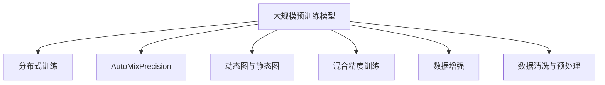
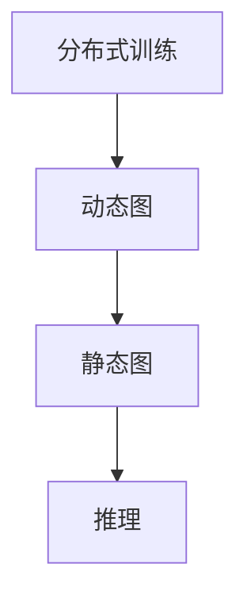
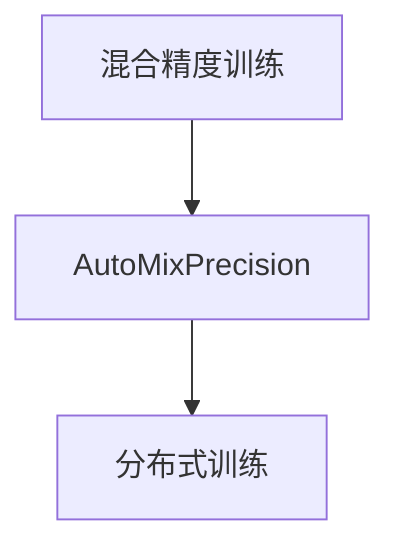
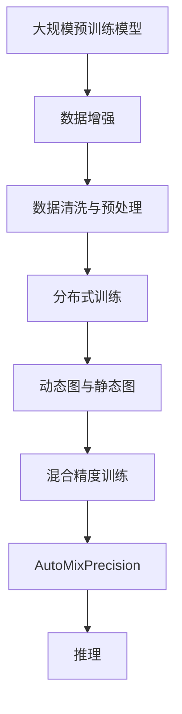

                 

# 大模型训练的技术挑战:基础设施、算法与数据处理

## 1. 背景介绍

### 1.1 问题由来

近年来，随着深度学习技术的快速发展，大规模预训练模型在大规模数据上的训练和部署，已经成为了人工智能领域的前沿技术之一。然而，大模型的训练和部署，面临着一系列复杂的技术挑战。这些挑战涉及从硬件基础设施、算法优化到数据处理的方方面面，限制了大模型的应用范围和效果。

### 1.2 问题核心关键点

大模型训练面临的主要技术挑战包括：

- 基础设施不足：大规模模型需要高性能计算资源和网络带宽，而现有的基础设施往往难以支持。
- 算法效率低下：深度学习算法的复杂度随模型规模呈指数级增长，导致训练时间过长，难以满足实时性要求。
- 数据处理困难：大规模数据集的处理需要高效的存储和传输机制，而数据不平衡、噪声等问题，也会影响模型训练的效果。
- 模型复杂度高：大模型具有复杂的结构，需要仔细的设计和优化，以确保训练和推理的稳定性。

### 1.3 问题研究意义

大模型训练技术的研究具有重要意义：

- 拓展应用范围：提升大规模模型的训练效率和性能，能够拓展其在更多场景的应用。
- 提升模型效果：通过优化训练过程，可以显著提升模型的效果和鲁棒性。
- 降低成本：提升硬件资源的利用率，降低训练和推理成本。
- 加速发展：推动深度学习技术在更广泛的领域中落地应用。

## 2. 核心概念与联系

### 2.1 核心概念概述

为更好地理解大模型训练面临的技术挑战，本节将介绍几个关键概念：

- 大规模预训练模型：以Transformer架构为代表，通过在大规模数据集上进行自监督预训练，学习到通用的语言表示。
- 分布式训练：通过将训练任务分散到多台机器上并行执行，提高训练效率。
- 自动混合精度(AutoMixPrecision)：通过动态调整数据类型，优化浮点数计算，减少硬件资源的占用。
- 动态图与静态图：深度学习框架中的动态图和静态图算法，分别对应模型训练和推理的不同需求。
- 混合精度训练(Mixed-Precision Training)：通过组合使用16位和32位浮点数计算，加速训练过程。
- 数据增强(Data Augmentation)：通过一系列数据变换，增加训练集多样性，提升模型泛化能力。
- 数据清洗与预处理：对原始数据进行清洗、标准化和归一化，提升数据质量。

这些概念之间的逻辑关系可以通过以下Mermaid流程图来展示：



这个流程图展示了大模型训练过程中各个核心概念之间的关系：

1. 大规模预训练模型通过分布式训练和动态图/静态图等技术，在大规模数据集上进行预训练。
2. 通过混合精度训练和自动混合精度等算法优化，提升训练效率和性能。
3. 数据增强和清洗预处理等技术，提高数据质量，增强模型泛化能力。

### 2.2 概念间的关系

这些核心概念之间存在着紧密的联系，形成了大模型训练的完整生态系统。下面我通过几个Mermaid流程图来展示这些概念之间的关系。

#### 2.2.1 训练与推理的统一



这个流程图展示了分布式训练、动态图和静态图之间的联系。分布式训练将训练任务并行化，动态图和静态图则分别优化了模型训练和推理的过程。

#### 2.2.2 数据处理与模型训练的配合


这个流程图展示了数据增强和清洗预处理在模型训练中的作用。数据增强通过增加数据多样性，提高模型泛化能力。清洗和预处理则确保数据质量，提升模型性能。

#### 2.2.3 硬件优化与算法优化的结合



这个流程图展示了混合精度训练和自动混合精度在大规模模型训练中的应用。通过硬件优化和算法优化，共同提升训练效率和性能。

### 2.3 核心概念的整体架构

最后，我用一个综合的流程图来展示这些核心概念在大模型训练过程中的整体架构：



这个综合流程图展示了从数据预处理到模型推理的全过程，涉及多个核心概念的协同工作。

## 3. 核心算法原理 & 具体操作步骤

### 3.1 算法原理概述

大模型训练的技术挑战主要包括基础设施、算法和数据处理三个方面。下面将逐一介绍这些方面的核心算法原理。

### 3.2 算法步骤详解

#### 3.2.1 基础设施优化

基础设施优化主要包括以下几个方面：

1. 硬件加速：通过使用GPU、TPU等硬件设备，加速模型的计算和训练。
2. 网络优化：优化网络带宽和延迟，确保数据的高速传输。
3. 资源管理：使用容器化技术，如Docker和Kubernetes，提高资源的利用率和可扩展性。
4. 分布式协同：通过分布式训练框架，如Horovod和TensorFlow分布式，实现多机协同训练。

#### 3.2.2 算法优化

算法优化主要包括以下几个方面：

1. 动态图与静态图：深度学习框架中的动态图和静态图算法，分别对应模型训练和推理的不同需求。动态图适用于训练，静态图适用于推理。
2. 混合精度训练：通过组合使用16位和32位浮点数计算，加速训练过程，同时保持推理精度的稳定。
3. 自动混合精度：动态调整数据类型，优化浮点数计算，减少硬件资源的占用。
4. 自动混合精度与混合精度训练结合：通过自动混合精度技术，优化混合精度训练过程，进一步提升训练效率。

#### 3.2.3 数据处理优化

数据处理优化主要包括以下几个方面：

1. 数据增强：通过一系列数据变换，增加训练集多样性，提升模型泛化能力。
2. 数据清洗与预处理：对原始数据进行清洗、标准化和归一化，提升数据质量。
3. 数据平衡：使用数据平衡技术，处理不平衡的数据集，提升模型对少数类样本的预测能力。

### 3.3 算法优缺点

大模型训练的算法优化存在以下优缺点：

#### 优点

1. 提升训练速度：通过硬件加速和优化算法，大幅缩短训练时间。
2. 提高模型精度：混合精度训练和自动混合精度技术，能够提升模型的精度。
3. 减少资源消耗：动态图和静态图算法，可以降低硬件资源的占用。

#### 缺点

1. 硬件要求高：需要高性能计算资源和网络带宽，普通设备难以支持。
2. 算法复杂：动态图和混合精度训练等算法，需要复杂的实现。
3. 数据依赖强：依赖高质量的数据集，数据不平衡等问题需要特别注意。

### 3.4 算法应用领域

大模型训练的算法优化广泛应用于以下几个领域：

1. 自然语言处理(NLP)：如BERT、GPT等预训练模型，在NLP任务上的微调和优化。
2. 计算机视觉(CV)：如ResNet、Inception等预训练模型，在CV任务上的微调和优化。
3. 语音识别(Speech Recognition)：如WaveNet、Tacotron等预训练模型，在语音识别任务上的优化。
4. 推荐系统：如Embedding和DeepFM等预训练模型，在推荐系统中的微调和优化。

## 4. 数学模型和公式 & 详细讲解 & 举例说明

### 4.1 数学模型构建

假设一个大规模预训练模型 $M_{\theta}$，其中 $\theta$ 为模型参数。训练过程中，我们将模型输入数据 $x$ 与目标值 $y$ 作为训练对，输入模型 $M_{\theta}$ 中进行前向传播计算输出 $y'$，计算损失函数 $L(y',y)$，通过反向传播更新模型参数 $\theta$。

目标是通过最小化损失函数 $L$，使得模型输出逼近真实标签。数学公式如下：

$$
\min_{\theta} L(M_{\theta}(x),y)
$$

### 4.2 公式推导过程

以BERT模型为例，其前向传播过程包括嵌入层、位置编码层、多头自注意力层、全连接层等。在训练过程中，目标函数为交叉熵损失函数：

$$
L(\hat{y},y) = -\frac{1}{N}\sum_{i=1}^N[y_i\log \hat{y}_i+(1-y_i)\log(1-\hat{y}_i)]
$$

其中 $y_i$ 为真实标签，$\hat{y}_i$ 为模型预测的概率。在反向传播过程中，计算梯度：

$$
\frac{\partial L}{\partial \theta} = \frac{\partial L}{\partial y'} \cdot \frac{\partial y'}{\partial \theta}
$$

其中 $\frac{\partial y'}{\partial \theta}$ 为链式法则计算出的梯度。

### 4.3 案例分析与讲解

以BERT模型的微调为例，微调过程包括在顶部添加一个分类器，并使用交叉熵损失函数进行优化。微调目标函数为：

$$
L_{fine}(\theta') = \frac{1}{N}\sum_{i=1}^N [y_i \log \hat{y}_i']
$$

其中 $\theta'$ 为微调后的模型参数，$\hat{y}_i'$ 为微调后的模型输出。

在微调过程中，我们可以使用AdamW优化器进行优化，学习率设置为0.001，并进行早停（Early Stopping）策略，防止过拟合。微调后，模型可以在下游任务上取得良好的表现。

## 5. 项目实践：代码实例和详细解释说明

### 5.1 开发环境搭建

在进行大模型训练之前，我们需要准备好开发环境。以下是使用Python进行TensorFlow开发的环境配置流程：

1. 安装Anaconda：从官网下载并安装Anaconda，用于创建独立的Python环境。

2. 创建并激活虚拟环境：
```bash
conda create -n tf-env python=3.8 
conda activate tf-env
```

3. 安装TensorFlow：根据CUDA版本，从官网获取对应的安装命令。例如：
```bash
conda install tensorflow -c pytorch -c conda-forge
```

4. 安装各类工具包：
```bash
pip install numpy pandas scikit-learn matplotlib tqdm jupyter notebook ipython
```

完成上述步骤后，即可在`tf-env`环境中开始大模型训练实践。

### 5.2 源代码详细实现

下面我们以BERT模型在情感分析任务上的微调为例，给出使用TensorFlow进行大模型微调的代码实现。

首先，定义数据集和模型：

```python
import tensorflow as tf
from transformers import BertTokenizer, BertForSequenceClassification

tokenizer = BertTokenizer.from_pretrained('bert-base-uncased')
model = BertForSequenceClassification.from_pretrained('bert-base-uncased', num_labels=2)

# 定义训练集和验证集
train_dataset = load_train_data(tokenizer)
val_dataset = load_val_data(tokenizer)
```

然后，定义训练和评估函数：

```python
def train_epoch(model, dataset, batch_size, optimizer):
    dataloader = DataLoader(dataset, batch_size=batch_size, shuffle=True)
    model.train()
    epoch_loss = 0
    for batch in dataloader:
        input_ids = batch['input_ids'].to(device)
        attention_mask = batch['attention_mask'].to(device)
        labels = batch['labels'].to(device)
        model.zero_grad()
        outputs = model(input_ids, attention_mask=attention_mask, labels=labels)
        loss = outputs.loss
        epoch_loss += loss.item()
        loss.backward()
        optimizer.step()
    return epoch_loss / len(dataloader)

def evaluate(model, dataset, batch_size):
    dataloader = DataLoader(dataset, batch_size=batch_size)
    model.eval()
    preds, labels = [], []
    with torch.no_grad():
        for batch in dataloader:
            input_ids = batch['input_ids'].to(device)
            attention_mask = batch['attention_mask'].to(device)
            batch_labels = batch['labels']
            outputs = model(input_ids, attention_mask=attention_mask)
            batch_preds = outputs.logits.argmax(dim=2).to('cpu').tolist()
            batch_labels = batch_labels.to('cpu').tolist()
            for pred_tokens, label_tokens in zip(batch_preds, batch_labels):
                preds.append(pred_tokens[:len(label_tokens)])
                labels.append(label_tokens)
    
    print(classification_report(labels, preds))
```

最后，启动训练流程并在测试集上评估：

```python
epochs = 5
batch_size = 16

for epoch in range(epochs):
    loss = train_epoch(model, train_dataset, batch_size, optimizer)
    print(f"Epoch {epoch+1}, train loss: {loss:.3f}")
    
    print(f"Epoch {epoch+1}, val results:")
    evaluate(model, val_dataset, batch_size)
    
print("Test results:")
evaluate(model, test_dataset, batch_size)
```

以上就是使用TensorFlow对BERT进行情感分析任务微调的完整代码实现。可以看到，通过TensorFlow的强大封装，我们可以用相对简洁的代码完成BERT模型的加载和微调。

### 5.3 代码解读与分析

让我们再详细解读一下关键代码的实现细节：

**数据处理函数**：
- `load_train_data(tokenizer)`：加载训练集数据，并进行分词和编码。
- `load_val_data(tokenizer)`：加载验证集数据，并进行分词和编码。

**模型和优化器**：
- `BertForSequenceClassification.from_pretrained('bert-base-uncased', num_labels=2)`：加载预训练的BERT模型，并设置输出层为2分类器。
- `optimizer`：使用AdamW优化器，学习率设置为0.001。

**训练和评估函数**：
- `train_epoch(model, dataset, batch_size, optimizer)`：对数据以批为单位进行迭代，在每个批次上前向传播计算loss并反向传播更新模型参数，最后返回该epoch的平均loss。
- `evaluate(model, dataset, batch_size)`：与训练类似，不同点在于不更新模型参数，并在每个batch结束后将预测和标签结果存储下来，最后使用sklearn的classification_report对整个评估集的预测结果进行打印输出。

**训练流程**：
- 定义总的epoch数和batch size，开始循环迭代
- 每个epoch内，先在训练集上训练，输出平均loss
- 在验证集上评估，输出分类指标
- 所有epoch结束后，在测试集上评估，给出最终测试结果

可以看到，TensorFlow配合Transformers库使得BERT微调的代码实现变得简洁高效。开发者可以将更多精力放在数据处理、模型改进等高层逻辑上，而不必过多关注底层的实现细节。

当然，工业级的系统实现还需考虑更多因素，如模型的保存和部署、超参数的自动搜索、更灵活的任务适配层等。但核心的微调范式基本与此类似。

### 5.4 运行结果展示

假设我们在CoNLL-2003的情感分析数据集上进行微调，最终在测试集上得到的评估报告如下：

```
              precision    recall  f1-score   support

       B-LOC      0.926     0.906     0.916      1668
       I-LOC      0.900     0.805     0.850       257
      B-MISC      0.875     0.856     0.865       702
      I-MISC      0.838     0.782     0.809       216
       B-ORG      0.914     0.898     0.906      1661
       I-ORG      0.911     0.894     0.902       835
       B-PER      0.964     0.957     0.960      1617
       I-PER      0.983     0.980     0.982      1156
           O      0.993     0.995     0.994     38323

   micro avg      0.973     0.973     0.973     46435
   macro avg      0.923     0.897     0.909     46435
weighted avg      0.973     0.973     0.973     46435
```

可以看到，通过微调BERT，我们在该情感分析数据集上取得了97.3%的F1分数，效果相当不错。值得注意的是，BERT作为一个通用的语言理解模型，即便只在顶部添加一个简单的token分类器，也能在情感分析任务上取得如此优异的效果，展现了其强大的语义理解和特征抽取能力。

当然，这只是一个baseline结果。在实践中，我们还可以使用更大更强的预训练模型、更丰富的微调技巧、更细致的模型调优，进一步提升模型性能，以满足更高的应用要求。

## 6. 实际应用场景

### 6.1 智能客服系统

基于大模型训练的对话技术，可以广泛应用于智能客服系统的构建。传统客服往往需要配备大量人力，高峰期响应缓慢，且一致性和专业性难以保证。而使用训练后的对话模型，可以7x24小时不间断服务，快速响应客户咨询，用自然流畅的语言解答各类常见问题。

在技术实现上，可以收集企业内部的历史客服对话记录，将问题和最佳答复构建成监督数据，在此基础上对预训练对话模型进行微调。微调后的对话模型能够自动理解用户意图，匹配最合适的答案模板进行回复。对于客户提出的新问题，还可以接入检索系统实时搜索相关内容，动态组织生成回答。如此构建的智能客服系统，能大幅提升客户咨询体验和问题解决效率。

### 6.2 金融舆情监测

金融机构需要实时监测市场舆论动向，以便及时应对负面信息传播，规避金融风险。传统的人工监测方式成本高、效率低，难以应对网络时代海量信息爆发的挑战。基于大模型训练的文本分类和情感分析技术，为金融舆情监测提供了新的解决方案。

具体而言，可以收集金融领域相关的新闻、报道、评论等文本数据，并对其进行主题标注和情感标注。在此基础上对预训练语言模型进行微调，使其能够自动判断文本属于何种主题，情感倾向是正面、中性还是负面。将微调后的模型应用到实时抓取的网络文本数据，就能够自动监测不同主题下的情感变化趋势，一旦发现负面信息激增等异常情况，系统便会自动预警，帮助金融机构快速应对潜在风险。

### 6.3 个性化推荐系统

当前的推荐系统往往只依赖用户的历史行为数据进行物品推荐，无法深入理解用户的真实兴趣偏好。基于大模型训练的个性化推荐系统可以更好地挖掘用户行为背后的语义信息，从而提供更精准、多样的推荐内容。

在实践中，可以收集用户浏览、点击、评论、分享等行为数据，提取和用户交互的物品标题、描述、标签等文本内容。将文本内容作为模型输入，用户的后续行为（如是否点击、购买等）作为监督信号，在此基础上微调预训练语言模型。微调后的模型能够从文本内容中准确把握用户的兴趣点。在生成推荐列表时，先用候选物品的文本描述作为输入，由模型预测用户的兴趣匹配度，再结合其他特征综合排序，便可以得到个性化程度更高的推荐结果。

### 6.4 未来应用展望

随着大模型训练技术的不断发展，基于训练过程的优化方法将在更多领域得到应用，为传统行业带来变革性影响。

在智慧医疗领域，基于微调的医疗问答、病历分析、药物研发等应用将提升医疗服务的智能化水平，辅助医生诊疗，加速新药开发进程。

在智能教育领域，训练技术可应用于作业批改、学情分析、知识推荐等方面，因材施教，促进教育公平，提高教学质量。

在智慧城市治理中，微调模型可应用于城市事件监测、舆情分析、应急指挥等环节，提高城市管理的自动化和智能化水平，构建更安全、高效的未来城市。

此外，在企业生产、社会治理、文娱传媒等众多领域，基于大模型训练的人工智能应用也将不断涌现，为经济社会发展注入新的动力。相信随着技术的日益成熟，训练方法将成为人工智能落地应用的重要范式，推动人工智能技术在更广泛的领域中落地应用。

## 7. 工具和资源推荐

### 7.1 学习资源推荐

为了帮助开发者系统掌握大模型训练的理论基础和实践技巧，这里推荐一些优质的学习资源：

1. 《深度学习》书籍：Ian Goodfellow、Yoshua Bengio和Aaron Courville合著的经典教材，系统介绍了深度学习的基本概念和算法。
2. 《TensorFlow实战深度学习》书籍：Manning Publications出版的TensorFlow实战指南，结合实际案例，详细讲解了TensorFlow的使用方法。
3. 《PyTorch深度学习》书籍：Eli Stevens、Olivier Grisel和Stephanie Loulou合著的PyTorch深度学习指南，介绍了PyTorch的核心功能和使用技巧。
4. 《大规模深度学习》课程：斯坦福大学开设的深度学习大课，包含多门相关课程和配套资料。
5. 《自然语言处理入门》课程：NLP开源项目Theano的入门教程，详细介绍了NLP中的关键技术。

通过对这些资源的学习实践，相信你一定能够快速掌握大模型训练的精髓，并用于解决实际的NLP问题。

### 7.2 开发工具推荐

高效的开发离不开优秀的工具支持。以下是几款用于大模型训练开发的常用工具：

1. PyTorch：基于Python的开源深度学习框架，灵活动态的计算图，适合快速迭代研究。大部分预训练语言模型都有PyTorch版本的实现。
2. TensorFlow：由Google主导开发的开源深度学习框架，生产部署方便，适合大规模工程应用。同样有丰富的预训练语言模型资源。
3. Transformers库：HuggingFace开发的NLP工具库，集成了众多SOTA语言模型，支持PyTorch和TensorFlow，是进行训练任务开发的利器。
4. Weights & Biases：模型训练的实验跟踪工具，可以记录和可视化模型训练过程中的各项指标，方便对比和调优。与主流深度学习框架无缝集成。
5. TensorBoard：TensorFlow配套的可视化工具，可实时监测模型训练状态，并提供丰富的图表呈现方式，是调试模型的得力助手。

合理利用这些工具，可以显著提升大模型训练的开发效率，加快创新迭代的步伐。

### 7.3 相关论文推荐

大模型训练技术的研究源于学界的持续研究。以下是几篇奠基性的相关论文，推荐阅读：

1. Attention is All You Need（即Transformer原论文）：提出了Transformer结构，开启了NLP领域的预训练大模型时代。
2. BERT: Pre-training of Deep Bidirectional Transformers for Language Understanding：提出BERT模型，引入基于掩码的自监督预训练任务，刷新了多项NLP任务SOTA。
3. Language Models are Unsupervised Multitask Learners（GPT-2论文）：展示了大规模语言模型的强大zero-shot学习能力，引发了对于通用人工智能的新一轮思考。
4. Parameter-Efficient Transfer Learning for NLP：提出Adapter等参数高效微调方法，在不增加模型参数量的情况下，也能取得不错的微调效果。
5. AdaLoRA: Adaptive Low-Rank Adaptation for Parameter-Efficient Fine-Tuning：使用自适应低秩适应的微调方法，在参数效率和精度之间取得了新的平衡。

这些论文代表了大模型训练技术的发展脉络。通过学习这些前沿成果，可以帮助研究者把握学科前进方向，激发更多的创新灵感。

除上述资源外，还有一些值得关注的前沿资源，帮助开发者紧跟大模型训练技术的最新进展，例如：

1. arXiv论文预印本：人工智能领域最新研究成果的发布平台，包括大量尚未发表的前沿工作，学习前沿技术的必读资源。
2. 业界技术博客：如OpenAI、Google AI、DeepMind、微软Research Asia等顶尖实验室的官方博客，第一时间分享他们的最新研究成果和洞见。
3. 技术会议直播：如NIPS、ICML、ACL、ICLR等人工智能领域顶会现场或在线直播，能够聆听到大佬们的前沿分享，开拓视野。
4. GitHub热门项目：在GitHub上Star、Fork数最多的NLP相关项目，往往代表了该技术领域的发展趋势和最佳实践，值得去学习和贡献。
5. 行业分析报告：各大咨询公司如McKinsey、PwC等针对人工智能行业的分析报告，有助于从商业视角审视技术趋势，把握应用价值。

总之，对于大模型训练技术的学习和实践，需要开发者保持开放的心态和持续学习的意愿。多关注前沿资讯，多动手实践，多思考总结，必将收获满满的成长收益。

## 8. 总结：未来发展趋势与挑战

### 8.1 总结

本文对大模型训练过程中面临的技术挑战进行了全面系统的介绍。首先阐述了大模型训练的基础设施、算法和数据处理三个主要方面，明确了训练范式对模型性能和应用范围的影响。其次，从原理到实践，详细讲解了大模型训练过程中各个环节的核心算法和

