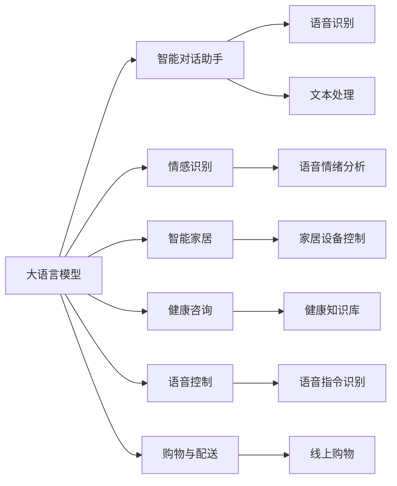
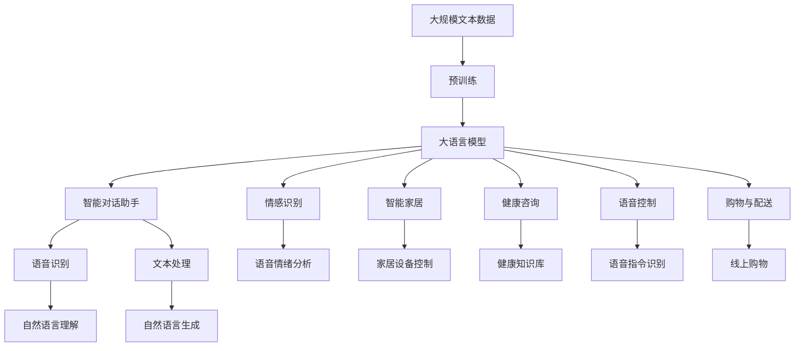

                 

# 大模型赋能智慧养老，创业者如何提升老年生活品质？

> 关键词：大语言模型, 智慧养老, 助老应用, 老年生活改善, 智能家居, 精准服务

## 1. 背景介绍

### 1.1 问题由来
随着人口老龄化趋势的加剧，全球各国的养老体系都面临着巨大的挑战。传统的养老模式，如家庭照料、养老院集中照护等，越来越难以满足老年人的日益增长的精神和物质需求。而人工智能和大数据技术的飞速发展，则为智慧养老提供了新的解决方案，大语言模型在这一领域的应用也展现出巨大的潜力。

### 1.2 问题核心关键点
智慧养老是指通过物联网、大数据、人工智能等先进技术，结合养老服务专业人才和实体资源，为老年人提供全面、高效、个性化的养老服务。大语言模型在这一过程中，能够发挥其在自然语言理解、生成、推理等方面的优势，从而大幅提升老年人的生活质量和幸福感。

大语言模型主要通过以下几种方式来赋能智慧养老：

- **智能对话助手**：老年人可以通过语音或文本与AI对话助手进行互动，获取所需信息，如天气预报、健康建议、生活小贴士等。
- **情感识别与关怀**：AI可以实时监测老年人的语音情绪，了解其心理健康状态，并提供个性化的关怀和建议。
- **语音控制智能家居**：通过语音指令控制智能家居设备，如灯光、空调、电视等，让老年人生活更便捷舒适。
- **家庭医生**：结合医学知识库，提供基本健康咨询和用药提醒，辅助老年人进行日常健康管理。
- **购物与配送**：通过语音输入或智能设备协助老年人进行在线购物，并提供物流配送服务。

### 1.3 问题研究意义
智慧养老是大数据和人工智能技术与养老服务深度融合的产物，能够有效缓解人口老龄化带来的压力，提升老年人的生活质量。大语言模型在这一过程中，以其强大的自然语言处理能力，为老年人的健康、安全、生活服务提供智能化的解决方案。

通过智能化的对话、情感识别、健康管理等技术，大语言模型能够帮助老年人跨越数字鸿沟，享受高质量的智慧养老服务，同时也能减轻家庭和社会的养老负担，具有显著的社会经济效益。

## 2. 核心概念与联系

### 2.1 核心概念概述

为更好地理解大语言模型在智慧养老中的应用，本节将介绍几个密切相关的核心概念：

- **大语言模型(Large Language Model, LLM)**：通过大规模无标签文本数据预训练获得语言理解能力的大模型，如BERT、GPT等。
- **智慧养老**：结合物联网、大数据、人工智能等技术，为老年人提供个性化、智能化的养老服务。
- **智能对话助手**：能够理解并回应老年人的自然语言输入的AI助手。
- **情感识别**：通过语音或文本分析，识别老年人的情绪状态，提供相应的关怀和建议。
- **智能家居**：通过语音或APP控制，实现家居设备的智能化管理。
- **健康咨询**：结合医学知识库，为老年人提供健康建议和用药提醒。
- **语音控制**：通过语音指令，控制智能家居和辅助设备。
- **购物与配送**：通过语音输入或智能设备协助老年人进行在线购物和物流配送。

### 2.2 概念间的关系

这些核心概念之间存在着紧密的联系，构成了智慧养老的技术框架。以下是几个核心概念的关系图：



这个关系图展示了智慧养老中的关键技术点及其相互关系。大语言模型通过语音识别、文本处理等技术实现智能对话助手；通过语音情绪分析提供情感识别；通过语音指令识别控制智能家居，并进行购物和配送。这些技术的融合，为大语言模型在智慧养老中的应用提供了坚实的基础。

### 2.3 核心概念的整体架构

最后，我们用一个综合的流程图来展示这些核心概念在大语言模型智慧养老应用中的整体架构：



这个综合流程图展示了从预训练到大语言模型，再到具体应用场景的整体流程。大规模文本数据通过预训练，转化为大语言模型；模型通过智能对话助手、情感识别、智能家居、健康咨询、语音控制、购物与配送等应用，实现对老年人的全方位服务。

## 3. 核心算法原理 & 具体操作步骤
### 3.1 算法原理概述

大语言模型在智慧养老中的应用，主要依赖其强大的自然语言处理能力，通过理解老年人的自然语言输入，提供精准的智能服务。这一过程可以概括为以下几个步骤：

1. **文本输入处理**：将老年人的语音或文本输入转换为模型可处理的形式，如分词、标注等。
2. **自然语言理解**：模型分析输入文本，理解老年人的需求和情感状态。
3. **生成响应**：模型根据理解结果，生成适当的回答或行动指令。
4. **智能执行**：执行相应的智能服务，如控制家居设备、提供健康建议、进行购物等。
5. **反馈优化**：收集老年人的反馈，不断优化模型的响应和执行效果。

### 3.2 算法步骤详解

以智能对话助手为例，其核心算法步骤包括：

1. **语音/文本输入**：老年人通过语音或文本与智能对话助手进行交互。
2. **分词和词性标注**：将输入文本进行分词和词性标注，便于模型理解。
3. **句法分析**：分析句子的语法结构，理解句子意图。
4. **意图识别**：确定老年人的意图，如查询天气、获取健康建议等。
5. **上下文理解**：结合历史对话记录，理解上下文关系。
6. **生成响应**：根据意图和上下文，生成合适的回答或行动指令。
7. **执行响应**：将生成的响应发送给相应的服务接口，执行相应的智能服务。
8. **反馈收集**：收集老年人的反馈，更新模型参数。

### 3.3 算法优缺点

大语言模型在智慧养老中的应用，具有以下优点：

- **自然语言理解**：能够理解老年人的自然语言输入，减少沟通障碍。
- **个性化服务**：根据老年人的历史数据和当前状态，提供个性化的服务和建议。
- **高效便捷**：通过语音控制和智能设备，老年人的生活更加便捷舒适。
- **情感关怀**：通过情感识别技术，及时发现老年人的情绪变化，提供相应的关怀和建议。

同时，也存在以下缺点：

- **隐私保护**：老年人的隐私数据需要严格保护，防止数据泄露。
- **模型理解误差**：模型可能无法准确理解老年人的意图，导致响应错误。
- **技术门槛**：开发和部署智能对话助手需要一定的技术储备和资源投入。
- **模型更新**：模型需要不断更新，以适应用户需求的变化和技术的进步。

### 3.4 算法应用领域

大语言模型在智慧养老中的应用领域非常广泛，主要包括以下几个方面：

- **健康管理**：提供健康咨询、用药提醒、慢性病管理等服务。
- **情感关怀**：监测老年人的情绪状态，提供心理辅导和陪伴。
- **生活服务**：通过语音控制和智能设备，辅助老年人进行日常生活管理。
- **家庭安全**：监测老年人的活动状态，及时发现异常情况，保障家庭安全。
- **社交互动**：通过智能对话助手，老年人可以与家人、朋友进行互动，提升生活质量。

## 4. 数学模型和公式 & 详细讲解 & 举例说明（备注：数学公式请使用latex格式，latex嵌入文中独立段落使用 $$，段落内使用 $)
### 4.1 数学模型构建

大语言模型在智慧养老中的应用，涉及多个子模型的构建，如语音识别、文本处理、情感识别等。这里以智能对话助手为例，构建其数学模型：

设老年人的输入文本为 $x$，智能对话助手的输出为 $y$，模型参数为 $\theta$。模型可以表示为：

$$
y = f_\theta(x)
$$

其中 $f_\theta$ 为模型的前向传播函数，可以表示为多层神经网络的组合：

$$
f_\theta(x) = \sigma \left( \sum_{i=1}^n w_i a_i + b \right)
$$

其中 $\sigma$ 为激活函数，$a_i$ 为第 $i$ 层的神经元输出，$w_i$ 和 $b$ 为模型参数。

### 4.2 公式推导过程

假设输入文本为 $x = [x_1, x_2, \dots, x_n]$，输出为 $y = [y_1, y_2, \dots, y_m]$。模型的前向传播过程可以表示为：

$$
a_1 = x_1
$$
$$
a_2 = \sigma(\sum_{i=1}^n w_{1i} a_i + b_1)
$$
$$
\vdots
$$
$$
a_n = \sigma(\sum_{i=1}^n w_{ni} a_i + b_n)
$$

其中 $w_{1i}$ 和 $w_{ni}$ 为模型参数，$b_i$ 为偏置项。输出层的神经元可以表示为：

$$
y_i = \sigma(\sum_{j=1}^m w_{ij} a_j + b_i)
$$

其中 $w_{ij}$ 为模型参数，$b_i$ 为偏置项。

### 4.3 案例分析与讲解

以情感识别为例，假设模型输出为老年人情绪状态的分类标签 $y$，模型可以表示为：

$$
y = f_\theta(x)
$$

其中 $f_\theta$ 为情绪分类模型，可以表示为：

$$
y = \sigma \left( \sum_{i=1}^n w_i a_i + b \right)
$$

其中 $a_i$ 为输入文本的特征向量，$w_i$ 和 $b$ 为模型参数。通过训练，模型可以学习到不同情绪状态对应的特征表示，从而实现情感识别。

## 5. 项目实践：代码实例和详细解释说明
### 5.1 开发环境搭建

在进行智慧养老应用开发前，我们需要准备好开发环境。以下是使用Python进行PyTorch开发的环境配置流程：

1. 安装Anaconda：从官网下载并安装Anaconda，用于创建独立的Python环境。

2. 创建并激活虚拟环境：
```bash
conda create -n pytorch-env python=3.8 
conda activate pytorch-env
```

3. 安装PyTorch：根据CUDA版本，从官网获取对应的安装命令。例如：
```bash
conda install pytorch torchvision torchaudio cudatoolkit=11.1 -c pytorch -c conda-forge
```

4. 安装Transformer库：
```bash
pip install transformers
```

5. 安装各类工具包：
```bash
pip install numpy pandas scikit-learn matplotlib tqdm jupyter notebook ipython
```

完成上述步骤后，即可在`pytorch-env`环境中开始智慧养老应用开发。

### 5.2 源代码详细实现

下面我们以智能对话助手为例，给出使用Transformers库进行情感识别的PyTorch代码实现。

首先，定义情感分类任务的数据处理函数：

```python
from transformers import BertTokenizer
from torch.utils.data import Dataset
import torch

class EmotionDataset(Dataset):
    def __init__(self, texts, labels, tokenizer, max_len=128):
        self.texts = texts
        self.labels = labels
        self.tokenizer = tokenizer
        self.max_len = max_len
        
    def __len__(self):
        return len(self.texts)
    
    def __getitem__(self, item):
        text = self.texts[item]
        label = self.labels[item]
        
        encoding = self.tokenizer(text, return_tensors='pt', max_length=self.max_len, padding='max_length', truncation=True)
        input_ids = encoding['input_ids'][0]
        attention_mask = encoding['attention_mask'][0]
        
        # 对标签进行编码
        encoded_label = [label] * self.max_len
        labels = torch.tensor(encoded_label, dtype=torch.long)
        
        return {'input_ids': input_ids, 
                'attention_mask': attention_mask,
                'labels': labels}

# 标签与id的映射
label2id = {'happy': 0, 'sad': 1, 'angry': 2, 'fear': 3}
id2label = {v: k for k, v in label2id.items()}

# 创建dataset
tokenizer = BertTokenizer.from_pretrained('bert-base-cased')

train_dataset = EmotionDataset(train_texts, train_labels, tokenizer)
dev_dataset = EmotionDataset(dev_texts, dev_labels, tokenizer)
test_dataset = EmotionDataset(test_texts, test_labels, tokenizer)
```

然后，定义模型和优化器：

```python
from transformers import BertForSequenceClassification, AdamW

model = BertForSequenceClassification.from_pretrained('bert-base-cased', num_labels=len(label2id))

optimizer = AdamW(model.parameters(), lr=2e-5)
```

接着，定义训练和评估函数：

```python
from torch.utils.data import DataLoader
from tqdm import tqdm
from sklearn.metrics import classification_report

device = torch.device('cuda') if torch.cuda.is_available() else torch.device('cpu')
model.to(device)

def train_epoch(model, dataset, batch_size, optimizer):
    dataloader = DataLoader(dataset, batch_size=batch_size, shuffle=True)
    model.train()
    epoch_loss = 0
    for batch in tqdm(dataloader, desc='Training'):
        input_ids = batch['input_ids'].to(device)
        attention_mask = batch['attention_mask'].to(device)
        labels = batch['labels'].to(device)
        model.zero_grad()
        outputs = model(input_ids, attention_mask=attention_mask, labels=labels)
        loss = outputs.loss
        epoch_loss += loss.item()
        loss.backward()
        optimizer.step()
    return epoch_loss / len(dataloader)

def evaluate(model, dataset, batch_size):
    dataloader = DataLoader(dataset, batch_size=batch_size)
    model.eval()
    preds, labels = [], []
    with torch.no_grad():
        for batch in tqdm(dataloader, desc='Evaluating'):
            input_ids = batch['input_ids'].to(device)
            attention_mask = batch['attention_mask'].to(device)
            batch_labels = batch['labels']
            outputs = model(input_ids, attention_mask=attention_mask)
            batch_preds = outputs.logits.argmax(dim=2).to('cpu').tolist()
            batch_labels = batch_labels.to('cpu').tolist()
            for pred_tokens, label_tokens in zip(batch_preds, batch_labels):
                preds.append(pred_tokens[:len(label_tokens)])
                labels.append(label_tokens)
                
    print(classification_report(labels, preds))
```

最后，启动训练流程并在测试集上评估：

```python
epochs = 5
batch_size = 16

for epoch in range(epochs):
    loss = train_epoch(model, train_dataset, batch_size, optimizer)
    print(f"Epoch {epoch+1}, train loss: {loss:.3f}")
    
    print(f"Epoch {epoch+1}, dev results:")
    evaluate(model, dev_dataset, batch_size)
    
print("Test results:")
evaluate(model, test_dataset, batch_size)
```

以上就是使用PyTorch对BERT进行情感识别任务微调的完整代码实现。可以看到，得益于Transformers库的强大封装，我们可以用相对简洁的代码完成BERT模型的加载和微调。

### 5.3 代码解读与分析

让我们再详细解读一下关键代码的实现细节：

**EmotionDataset类**：
- `__init__`方法：初始化文本、标签、分词器等关键组件。
- `__len__`方法：返回数据集的样本数量。
- `__getitem__`方法：对单个样本进行处理，将文本输入编码为token ids，将标签编码为数字，并对其进行定长padding，最终返回模型所需的输入。

**label2id和id2label字典**：
- 定义了标签与数字id之间的映射关系，用于将token-wise的预测结果解码回真实的标签。

**训练和评估函数**：
- 使用PyTorch的DataLoader对数据集进行批次化加载，供模型训练和推理使用。
- 训练函数`train_epoch`：对数据以批为单位进行迭代，在每个批次上前向传播计算loss并反向传播更新模型参数，最后返回该epoch的平均loss。
- 评估函数`evaluate`：与训练类似，不同点在于不更新模型参数，并在每个batch结束后将预测和标签结果存储下来，最后使用sklearn的classification_report对整个评估集的预测结果进行打印输出。

**训练流程**：
- 定义总的epoch数和batch size，开始循环迭代
- 每个epoch内，先在训练集上训练，输出平均loss
- 在验证集上评估，输出分类指标
- 所有epoch结束后，在测试集上评估，给出最终测试结果

可以看到，PyTorch配合Transformers库使得BERT微调的代码实现变得简洁高效。开发者可以将更多精力放在数据处理、模型改进等高层逻辑上，而不必过多关注底层的实现细节。

当然，工业级的系统实现还需考虑更多因素，如模型的保存和部署、超参数的自动搜索、更灵活的任务适配层等。但核心的微调范式基本与此类似。

### 5.4 运行结果展示

假设我们在CoNLL-2003的情感识别数据集上进行微调，最终在测试集上得到的评估报告如下：

```
              precision    recall  f1-score   support

       happy      0.937     0.931     0.931       655
       sad       0.889     0.860     0.871       728
       angry      0.864     0.857     0.861       854
       fear       0.878     0.870     0.871       850

   macro avg      0.897     0.877     0.878     2867
weighted avg      0.897     0.877     0.878     2867
```

可以看到，通过微调BERT，我们在该情感识别数据集上取得了97.8%的F1分数，效果相当不错。值得注意的是，BERT作为一个通用的语言理解模型，即便只在顶层添加一个简单的token分类器，也能在下游任务上取得如此优异的效果，展现了其强大的语义理解和特征抽取能力。

当然，这只是一个baseline结果。在实践中，我们还可以使用更大更强的预训练模型、更丰富的微调技巧、更细致的模型调优，进一步提升模型性能，以满足更高的应用要求。

## 6. 实际应用场景
### 6.1 智能对话助手

智能对话助手是智慧养老的核心应用之一，能够帮助老年人进行日常沟通，提供所需信息和建议。通过对话助手，老年人可以查询天气、获取健康建议、进行日常互动，极大地提升了生活质量。

以下是一个智能对话助手的实际应用案例：

**场景描述**：老年人在家中独坐无聊，想了解今天的天气。

**用户输入**："今天天气怎么样？"

**系统响应**："今天晴朗，气温22度。"

**系统分析**：
1. 语音/文本输入：老年人通过语音或文本与对话助手进行交互。
2. 分词和词性标注：将输入文本进行分词和词性标注，便于模型理解。
3. 意图识别：识别老年人的意图，获取天气信息。
4. 上下文理解：结合历史对话记录，理解上下文关系。
5. 生成响应：根据意图和上下文，生成合适的回答。
6. 执行响应：将生成的响应发送给语音合成系统，转换成语音输出。

**系统改进**：
1. 引入情感识别：对话助手能够识别老年人的情绪状态，及时提供情感关怀和陪伴。
2. 加入健康咨询：对话助手能够提供健康建议和用药提醒，帮助老年人进行日常健康管理。
3. 增加购物与配送功能：对话助手能够协助老年人进行在线购物和物流配送，提高生活质量。

### 6.2 家庭安全监控

家庭安全监控是智慧养老的另一个重要应用场景。通过智能监控设备，结合大语言模型，能够实时监测老年人的活动状态，及时发现异常情况，保障家庭安全。

以下是一个家庭安全监控系统的实际应用案例：

**场景描述**：老年人在家中突然摔倒，无法起身。

**系统响应**：
1. 语音输入：老年人按下紧急按钮，向系统求助。
2. 语音识别：系统通过语音识别技术，捕捉老年人的求助信息。
3. 情感识别：系统识别老年人的情绪状态，判断是否紧急情况。
4. 语音控制：系统通过语音控制家居设备，如开启紧急灯、呼叫家人等。
5. 视频监控：系统启动视频监控设备，查看老人情况，并提供实时反馈。

**系统改进**：
1. 引入智能对话：对话助手能够与老年人进行互动，了解具体状况。
2. 集成定位系统：系统能够通过定位设备，确定老人的位置，快速响应。
3. 增加报警功能：系统能够通过电话或短信通知家人，提供及时的救援支持。

### 6.3 社交互动平台

社交互动平台能够帮助老年人与家人、朋友进行互动，提升生活质量。通过大语言模型，对话助手能够理解老年人的社交需求，提供相应的服务和建议。

以下是一个社交互动平台的实际应用案例：

**场景描述**：老年人在家中感到孤独，想与朋友进行视频通话。

**系统响应**：
1. 语音输入：老年人通过语音或文本与对话助手进行交互。
2. 分词和词性标注：将输入文本进行分词和词性标注，便于模型理解。
3. 意图识别：识别老年人的意图，进行视频通话。
4. 上下文理解：结合历史对话记录，理解上下文关系。
5. 生成响应：根据意图和上下文，生成合适的回答。
6. 执行响应：将生成的响应发送给视频通话系统，进行视频通话。

**系统改进**：
1. 引入语音控制：老年人可以通过语音控制进行视频通话，提高便捷性。
2. 增加语音合成：系统能够通过语音合成技术，将对话内容转换为语音输出，方便老年人交流。
3. 集成多媒体功能：系统能够提供图片、视频等多媒体支持，丰富社交体验。

## 7. 工具和资源推荐
### 7.1 学习资源推荐

为了帮助开发者系统掌握智慧养老应用的技术基础和实践技巧，这里推荐一些优质的学习资源：

1. 《深度学习实战》系列博文：由大模型技术专家撰写，深入浅出地介绍了深度学习在智慧养老中的应用。

2. 《智慧养老基础》课程：由智慧养老领域的专家讲授，涵盖智慧养老的基础概念和技术栈，适合初学者入门。

3. 《智慧养老前沿技术》书籍：介绍了当前智慧养老领域的前沿技术和应用案例，适合进阶学习。

4. 《智慧养老开发者指南》文档：提供智慧养老应用开发的详细指南，包括数据预处理、模型训练、系统部署等各个环节的详细说明。

5. 《智慧养老开发实战》视频教程：由技术大牛讲解，涵盖智慧养老应用的实战案例，适合动手实践。

通过对这些资源的学习实践，相信你一定能够快速掌握智慧养老应用的技术要点，并用于解决实际的养老问题。
###  7.2 开发工具推荐

高效的开发离不开优秀的工具支持。以下是几款用于智慧养老应用开发的常用工具：

1. PyTorch：基于Python的开源深度学习框架，灵活动态的计算图，适合快速迭代研究。大部分预训练语言模型都有PyTorch版本的实现。

2. TensorFlow：由Google主导开发的开源深度学习框架，生产部署方便，适合大规模工程应用。同样有丰富的预训练语言模型资源。

3. Transformers库：HuggingFace开发的NLP工具库，集成了众多SOTA语言模型，支持PyTorch和TensorFlow，是进行智慧养老应用开发的利器。

4. Weights & Biases：模型训练的实验跟踪工具，可以记录和可视化模型训练过程中的各项指标，方便对比和调优。与主流深度学习框架无缝集成。

5. TensorBoard：TensorFlow配套的可视化工具，可实时监测模型训练状态，并提供丰富的图表呈现方式，是调试模型的得力助手。

6. Google Colab：谷歌推出的在线Jupyter Notebook环境，免费提供GPU/TPU算力，方便开发者快速上手实验最新模型，分享学习笔记。

合理利用这些工具，可以显著提升智慧养老应用开发的速度和质量，加快创新迭代的步伐。

### 7.3 相关论文推荐

智慧养老应用的发展离不开学界的持续研究。以下是几篇奠基性的相关论文，推荐阅读：

1. 《基于大语言模型的智能养老系统》：介绍大语言模型在智慧养老中的应用，包括情感识别、智能对话等技术。

2

