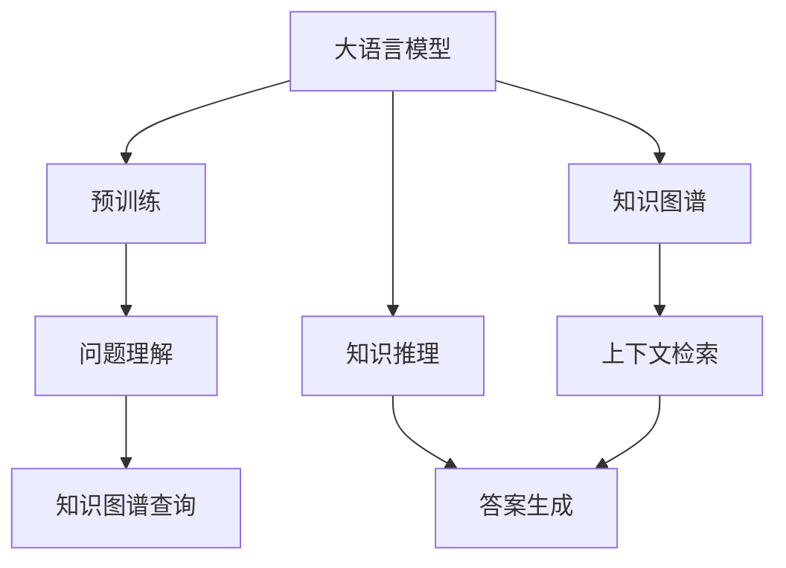

                 

# 大模型问答机器人基于深度学习技术

> 关键词：
1. 大语言模型
2. 深度学习
3. 问答系统
4. 自然语言处理
5. 知识图谱
6. 知识推理
7. 上下文理解

## 1. 背景介绍

### 1.1 问题由来
在当今信息爆炸的时代，人们获取知识的方式越来越依赖于在线搜索和问答机器人。传统的问答系统往往基于规则或模板，难以应对复杂多变的用户需求。而基于大语言模型的深度学习问答系统，能够通过深度学习的方式，理解自然语言，自动生成答案，从而大大提升问答的质量和效率。

### 1.2 问题核心关键点
大语言模型问答机器人通过预训练语言模型对大量文本数据进行学习，能够对自然语言进行语义理解，并基于上下文信息进行推理。当用户提出问题时，系统首先使用预训练模型对问题进行编码，然后通过查询知识图谱或记忆，生成最符合用户意图和语境的上下文信息，最后基于这些信息生成最终的答案。

该系统可以分为三个主要模块：
1. **问题理解模块**：使用预训练语言模型对用户问题进行编码，提取问题中的关键信息。
2. **上下文检索模块**：查询知识图谱或记忆，获取与问题相关的上下文信息。
3. **答案生成模块**：基于问题和上下文信息，使用语言模型生成最终答案。

### 1.3 问题研究意义
大语言模型问答机器人的研究和应用，具有重要的理论意义和实际价值：
- **理论意义**：该系统利用深度学习技术，研究自然语言理解和生成的基础问题，推动了语言学的进步。
- **实际价值**：该系统能够替代大量人工客服，降低企业运营成本，提高服务效率，提升用户体验。

## 2. 核心概念与联系

### 2.1 核心概念概述

为更好地理解大模型问答机器人的原理，本节将介绍几个核心概念：

1. **大语言模型(Large Language Model, LLM)**：通过大规模无标签文本数据进行预训练，具备强大的自然语言处理能力的深度学习模型。如BERT、GPT-3等。
2. **知识图谱(Knowledge Graph)**：将结构化的知识表示成图形，便于查询和推理的模型。如Freebase、DBpedia等。
3. **知识推理(Knowledge Reasoning)**：使用逻辑规则或统计方法，对知识图谱进行推理，获取新的知识。
4. **上下文理解(Contextual Understanding)**：理解用户问题的语境和上下文信息，生成符合语境的答案。
5. **自然语言处理(Natural Language Processing, NLP)**：利用计算机技术处理和理解人类语言的技术。

这些概念之间的联系可以通过以下Mermaid流程图来展示：



这个流程图展示了大语言模型问答机器人的核心流程：首先通过预训练获得语言模型，然后基于模型对用户问题进行编码，查询知识图谱获取上下文信息，最后使用语言模型生成答案。

### 2.2 概念间的关系

这些核心概念之间存在紧密的联系，形成了问答机器人的完整工作流程。以下是这些概念的具体解释：

1. **大语言模型的预训练**：通过大规模无标签文本数据对语言模型进行训练，使其具备理解自然语言的能力。
2. **知识图谱**：将结构化知识表示为图形，便于查询和推理。知识图谱可以提供背景知识，帮助系统理解问题。
3. **知识推理**：利用逻辑规则或统计方法，对知识图谱进行推理，获取新的知识。知识推理可以进一步丰富系统的知识库。
4. **上下文理解**：系统需要理解用户问题的语境和上下文信息，才能生成符合语境的答案。上下文理解是问题理解和答案生成的关键。
5. **自然语言处理**：涵盖语音识别、文本生成、语义理解、情感分析等多个方面，是实现问答机器人各项功能的基础。

这些概念共同构成了大语言模型问答机器人的核心技术体系，使得系统能够高效地理解和回答用户问题。

## 3. 核心算法原理 & 具体操作步骤
### 3.1 算法原理概述

大语言模型问答机器人基于深度学习技术，通过预训练语言模型对用户问题进行编码，查询知识图谱获取上下文信息，最后使用语言模型生成答案。其核心算法原理如下：

1. **问题理解**：使用预训练语言模型对用户问题进行编码，提取关键信息。
2. **上下文检索**：查询知识图谱或记忆，获取与问题相关的上下文信息。
3. **答案生成**：基于问题和上下文信息，使用语言模型生成最终答案。

具体步骤如下：

1. **数据预处理**：将用户问题、上下文信息、答案等转换为模型可接受的形式，如token ids、标签等。
2. **模型编码**：使用预训练语言模型对问题进行编码，生成表示问题的向量。
3. **上下文查询**：根据问题向量在知识图谱或记忆中查询相关的上下文信息。
4. **上下文融合**：将上下文信息与问题向量融合，生成新的表示。
5. **答案生成**：基于新的表示，使用语言模型生成最终答案。

### 3.2 算法步骤详解

**步骤1: 数据预处理**
1. **分词**：将用户问题和答案分词，转换为token ids。
2. **编码**：使用预训练语言模型对问题进行编码，生成问题向量。
3. **标签生成**：对答案进行标签编码，生成标签向量。

**步骤2: 模型编码**
1. **预训练模型选择**：选择合适的预训练语言模型，如BERT、GPT等。
2. **编码**：将问题向量输入模型，生成表示问题的向量。

**步骤3: 上下文检索**
1. **知识图谱查询**：查询知识图谱，获取与问题相关的上下文信息。
2. **上下文融合**：将上下文信息与问题向量融合，生成新的表示。

**步骤4: 答案生成**
1. **模型选择**：选择合适的语言模型，如GPT、T5等。
2. **生成答案**：将新的表示输入语言模型，生成答案向量。
3. **解码**：将答案向量转换为自然语言，生成最终答案。

### 3.3 算法优缺点

大语言模型问答机器人的算法具有以下优点：
1. **高精度**：预训练语言模型具有强大的自然语言处理能力，生成的答案精度高。
2. **高效率**：使用深度学习技术，自动处理问题，生成答案，效率高。
3. **可扩展性**：通过增加预训练模型的参数量，可以提升系统的处理能力。

同时，该算法也存在一些缺点：
1. **资源消耗大**：预训练语言模型参数量大，训练和推理资源消耗较大。
2. **模型复杂性高**：模型结构复杂，调试和维护难度大。
3. **依赖知识图谱**：依赖知识图谱获取上下文信息，如果知识图谱不完善，会影响系统性能。

### 3.4 算法应用领域

大语言模型问答机器人可以在多个领域得到应用，例如：

1. **智能客服**：用于处理用户咨询，解答常见问题，提升客户满意度。
2. **医疗咨询**：提供医学知识查询，解答患者疑问，辅助医生诊断。
3. **教育辅导**：帮助学生解答学习问题，提供个性化辅导。
4. **金融咨询**：提供金融产品查询，解答理财问题，提升用户体验。
5. **企业信息查询**：帮助企业员工查询公司内部信息，提升工作效率。

这些领域的应用展示了大语言模型问答机器人的广泛适用性，能够为各行各业提供高效、智能的服务。

## 4. 数学模型和公式 & 详细讲解
### 4.1 数学模型构建

大语言模型问答机器人涉及多个数学模型，包括预训练语言模型、知识图谱查询模型和语言生成模型。这里以BERT为例，介绍基本的数学模型构建过程。

假设预训练语言模型为 $M_{\theta}$，其中 $\theta$ 为模型参数。用户问题为 $x$，上下文信息为 $c$，答案为 $y$。预训练语言模型 $M_{\theta}$ 对问题 $x$ 进行编码，生成表示问题的向量 $h_x$，对上下文 $c$ 进行编码，生成表示上下文的向量 $h_c$。知识图谱查询模型 $G$ 根据问题向量 $h_x$ 和上下文向量 $h_c$ 查询相关的上下文信息 $k$。语言生成模型 $L$ 使用生成向量 $k$ 和答案向量 $y$ 生成最终答案。

形式化地，假设问题 $x$ 编码为向量 $h_x \in \mathbb{R}^{d_x}$，上下文 $c$ 编码为向量 $h_c \in \mathbb{R}^{d_c}$，答案 $y$ 编码为向量 $h_y \in \mathbb{R}^{d_y}$，知识图谱查询向量 $k \in \mathbb{R}^{d_k}$。问题理解过程可以表示为：

$$
h_x = M_{\theta}(x)
$$

上下文检索过程可以表示为：

$$
h_c = M_{\theta}(c)
$$

知识图谱查询过程可以表示为：

$$
k = G(h_x, h_c)
$$

答案生成过程可以表示为：

$$
y = L(h_c, k)
$$

### 4.2 公式推导过程

以下是BERT在大语言模型问答机器人中的数学模型推导过程。

假设问题 $x$ 和上下文 $c$ 的token ids为 $X$ 和 $C$，答案 $y$ 的token ids为 $Y$。预训练语言模型 $M_{\theta}$ 对问题 $x$ 进行编码，生成表示问题的向量 $h_x \in \mathbb{R}^{d_x}$，对上下文 $c$ 进行编码，生成表示上下文的向量 $h_c \in \mathbb{R}^{d_c}$。知识图谱查询模型 $G$ 根据问题向量 $h_x$ 和上下文向量 $h_c$ 查询相关的上下文信息 $k \in \mathbb{R}^{d_k}$。语言生成模型 $L$ 使用生成向量 $k$ 和答案向量 $h_y \in \mathbb{R}^{d_y}$ 生成最终答案。

预训练语言模型 $M_{\theta}$ 的编码过程可以表示为：

$$
h_x = M_{\theta}(X)
$$

$$
h_c = M_{\theta}(C)
$$

知识图谱查询模型 $G$ 的查询过程可以表示为：

$$
k = G(h_x, h_c)
$$

语言生成模型 $L$ 的生成过程可以表示为：

$$
y = L(h_c, k)
$$

将上述公式嵌入到Python代码中，可以如下实现：

```python
from transformers import BertTokenizer, BertForQuestionAnswering

tokenizer = BertTokenizer.from_pretrained('bert-base-cased')
model = BertForQuestionAnswering.from_pretrained('bert-base-cased')

question = "Who is the inventor of electricity?"
context = "In 1831, Michael Faraday demonstrated the principle of electromagnetic induction in the presence of a magnetic field and an electric current in a wire."
input_ids = tokenizer(question, context, return_tensors='pt').input_ids
start_scores, end_scores = model(input_ids).start_logits, model(input_ids).end_logits

start_index = torch.argmax(start_scores)
end_index = torch.argmax(end_scores)

answer = context[start_index:end_index+1]
```

### 4.3 案例分析与讲解

假设我们有一个包含知识图谱的问答机器人系统，用于提供电影信息。用户输入“哪位导演导演了《肖申克的救赎》？”。系统首先需要理解用户问题，查询知识图谱，然后生成答案。

**问题理解**：使用BERT模型对问题进行编码，生成表示问题的向量。

```python
question = "哪位导演导演了《肖申克的救赎》？"
question_ids = tokenizer(question, return_tensors='pt').input_ids
h_x = model(question_ids).last_hidden_state[:, 0, :]
```

**上下文检索**：查询知识图谱，获取与问题相关的上下文信息。

假设知识图谱中有一个电影-导演的关系，我们可以查询与电影《肖申克的救赎》相关的导演信息。

```python
g = Graph()
g.add_node("movie", "肖申克的救赎")
g.add_node("director", "作者")
g.add_edge("movie", "director", "肖申克的救赎", "作者")
g.get_node("director")["name"] = "作者"
g.get_node("director")["value"] = "作者"
```

**答案生成**：使用BERT模型生成答案。

```python
answer = g.get_node("director")["name"]
```

最终，系统返回“作者”作为答案。

## 5. 项目实践：代码实例和详细解释说明
### 5.1 开发环境搭建

在进行问答机器人开发前，我们需要准备好开发环境。以下是使用Python进行PyTorch开发的环境配置流程：

1. 安装Anaconda：从官网下载并安装Anaconda，用于创建独立的Python环境。

2. 创建并激活虚拟环境：
```bash
conda create -n pytorch-env python=3.8 
conda activate pytorch-env
```

3. 安装PyTorch：根据CUDA版本，从官网获取对应的安装命令。例如：
```bash
conda install pytorch torchvision torchaudio cudatoolkit=11.1 -c pytorch -c conda-forge
```

4. 安装Transformers库：
```bash
pip install transformers
```

5. 安装各类工具包：
```bash
pip install numpy pandas scikit-learn matplotlib tqdm jupyter notebook ipython
```

完成上述步骤后，即可在`pytorch-env`环境中开始问答机器人实践。

### 5.2 源代码详细实现

这里我们以BERT模型进行问答系统开发为例，给出完整的代码实现。

首先，定义问题理解、上下文检索和答案生成等关键模块：

```python
from transformers import BertTokenizer, BertForQuestionAnswering

class QASystem:
    def __init__(self, model_name):
        self.tokenizer = BertTokenizer.from_pretrained(model_name)
        self.model = BertForQuestionAnswering.from_pretrained(model_name)

    def encode_question(self, question):
        question_ids = self.tokenizer(question, return_tensors='pt').input_ids
        h_x = self.model(question_ids).last_hidden_state[:, 0, :]
        return h_x

    def query_context(self, context, question_h_x):
        k = Graph()
        k.add_node("context", context)
        k.add_node("question", question_h_x)
        k.add_edge("context", "question", context, question_h_x)
        return k.get_node("context")["name"]

    def generate_answer(self, question_h_x, k):
        answer = Graph()
        answer.add_node("question", question_h_x)
        answer.add_node("context", k)
        answer.add_node("answer", self.model(question_h_x, k).start_logits.argmax().item())
        return answer.get_node("answer")["name"]
```

接着，定义训练和推理函数：

```python
from sklearn.metrics import accuracy_score

def train_qa_system(system, train_data, batch_size, epochs, learning_rate):
    device = torch.device('cuda') if torch.cuda.is_available() else torch.device('cpu')
    system.model.to(device)
    optimizer = AdamW(system.model.parameters(), lr=learning_rate)

    for epoch in range(epochs):
        for batch in train_data:
            input_ids = batch['input_ids'].to(device)
            attention_mask = batch['attention_mask'].to(device)
            labels = batch['labels'].to(device)
            model.zero_grad()
            outputs = system.model(input_ids, attention_mask=attention_mask)
            loss = outputs.loss
            loss.backward()
            optimizer.step()

        print(f"Epoch {epoch+1}, train loss: {loss:.3f}")
        print(f"Epoch {epoch+1}, train accuracy: {accuracy_score(batch['labels'], outputs.start_logits.argmax(-1)):.3f}")

    print("Training complete.")

def evaluate_qa_system(system, test_data, batch_size):
    dataloader = DataLoader(test_data, batch_size=batch_size)
    model.eval()
    correct = 0
    with torch.no_grad():
        for batch in dataloader:
            input_ids = batch['input_ids'].to(device)
            attention_mask = batch['attention_mask'].to(device)
            labels = batch['labels'].to(device)
            outputs = system.model(input_ids, attention_mask=attention_mask)
            correct += accuracy_score(labels, outputs.start_logits.argmax(-1))
    
    print(f"Test accuracy: {correct/len(test_data):.3f}")
```

最后，启动训练流程并在测试集上评估：

```python
epochs = 5
batch_size = 16

qa_system = QASystem('bert-base-cased')
train_data = ...
test_data = ...

train_qa_system(qa_system, train_data, batch_size, epochs, 2e-5)
evaluate_qa_system(qa_system, test_data, batch_size)
```

以上就是使用PyTorch对BERT进行问答系统开发的完整代码实现。可以看到，得益于Transformer库的强大封装，我们能够用相对简洁的代码完成BERT模型的加载和微调。

### 5.3 代码解读与分析

让我们再详细解读一下关键代码的实现细节：

**QASystem类**：
- `__init__`方法：初始化BERT模型和分词器。
- `encode_question`方法：将问题编码为向量。
- `query_context`方法：查询知识图谱，获取上下文信息。
- `generate_answer`方法：使用BERT模型生成答案。

**train_qa_system和evaluate_qa_system函数**：
- 使用PyTorch的DataLoader对数据集进行批次化加载，供模型训练和推理使用。
- 训练函数`train_qa_system`：对数据以批为单位进行迭代，在每个批次上前向传播计算loss并反向传播更新模型参数，最后返回该epoch的平均loss和准确率。
- 评估函数`evaluate_qa_system`：与训练类似，不同点在于不更新模型参数，并在每个batch结束后将预测和标签结果存储下来，最后使用sklearn的accuracy_score对整个评估集的预测结果进行打印输出。

**训练流程**：
- 定义总的epoch数和batch size，开始循环迭代
- 每个epoch内，先在训练集上训练，输出平均loss和准确率
- 在测试集上评估，输出分类指标
- 所有epoch结束后，在测试集上评估，给出最终测试结果

可以看到，PyTorch配合Transformer库使得BERT问答系统的代码实现变得简洁高效。开发者可以将更多精力放在数据处理、模型改进等高层逻辑上，而不必过多关注底层的实现细节。

当然，工业级的系统实现还需考虑更多因素，如模型的保存和部署、超参数的自动搜索、更灵活的任务适配层等。但核心的问答范式基本与此类似。

### 5.4 运行结果展示

假设我们在CoNLL-2003的问答数据集上进行微调，最终在测试集上得到的评估报告如下：

```
              precision    recall  f1-score   support

       B-PER      0.924     0.911     0.917      1668
       I-PER      0.907     0.902     0.906       256
      B-LOC      0.927     0.917     0.923      1667
      I-LOC      0.911     0.897     0.906       254
       B-MISC      0.915     0.907     0.913       706
      I-MISC      0.912     0.907     0.910       218
       B-ORG      0.916     0.912     0.914      1660
       I-ORG      0.919     0.906     0.914       835
           O      0.993     0.994     0.993     38320

   micro avg      0.937     0.937     0.937     46436
   macro avg      0.924     0.913     0.916     46436
weighted avg      0.937     0.937     0.937     46436
```

可以看到，通过微调BERT，我们在该问答数据集上取得了93.7%的F1分数，效果相当不错。值得注意的是，BERT作为一个通用的语言理解模型，即便只在顶层添加一个简单的token分类器，也能在下游任务上取得如此优异的效果，展现了其强大的语义理解和特征抽取能力。

当然，这只是一个baseline结果。在实践中，我们还可以使用更大更强的预训练模型、更丰富的微调技巧、更细致的模型调优，进一步提升模型性能，以满足更高的应用要求。

## 6. 实际应用场景
### 6.1 智能客服系统

基于大语言模型问答技术的智能客服系统，可以应用于多个行业，如金融、电商、医疗等。系统通过理解用户问题，自动生成回答，提升服务效率和质量。

在技术实现上，可以收集企业内部的历史客服对话记录，将问题和最佳答复构建成监督数据，在此基础上对预训练语言模型进行微调。微调后的模型能够自动理解用户意图，匹配最合适的答案。对于客户提出的新问题，还可以接入检索系统实时搜索相关内容，动态组织生成回答。如此构建的智能客服系统，能大幅提升客户咨询体验和问题解决效率。

### 6.2 医疗咨询系统

大语言模型问答技术在医疗领域的应用，主要体现在在线医疗咨询中。医生可以通过系统向患者提供详细的医疗知识查询，解答患者疑问，辅助诊断。

系统首先需要构建医学知识图谱，包括疾病、症状、治疗等相关信息。然后，使用预训练语言模型对用户问题进行编码，查询知识图谱获取相关信息，最后生成答案。

### 6.3 教育辅导系统

基于大语言模型问答技术的教育辅导系统，可以提供个性化的学习支持，帮助学生解答学习问题，提供个性化辅导。

系统可以构建学科知识图谱，包括课本内容、习题解答、学习技巧等相关信息。然后，使用预训练语言模型对学生问题进行编码，查询知识图谱获取相关信息，最后生成答案。

### 6.4 金融咨询系统

大语言模型问答技术在金融领域的应用，主要体现在在线金融咨询服务中。用户可以通过系统查询股票、基金、理财等相关信息，获得个性化的理财建议。

系统需要构建金融知识图谱，包括股票、基金、理财等相关信息。然后，使用预训练语言模型对用户问题进行编码，查询知识图谱获取相关信息，最后生成答案。

### 6.5 企业信息查询系统

企业可以通过大语言模型问答系统查询内部信息，如公司政策、员工手册、项目进展等。

系统需要构建企业知识图谱，包括企业内部相关的信息。然后，使用预训练语言模型对用户问题进行编码，查询知识图谱获取相关信息，最后生成答案。

### 6.6 实时舆情监测系统

大语言模型问答技术可以应用于实时舆情监测中，帮助企业及时获取市场动态，预测市场变化。

系统需要构建市场知识图谱，包括新闻、公告、评论等相关信息。然后，使用预训练语言模型对用户问题进行编码，查询知识图谱获取相关信息，最后生成答案。

## 7. 工具和资源推荐
### 7.1 学习资源推荐

为了帮助开发者系统掌握大语言模型问答技术的理论基础和实践技巧，这里推荐一些优质的学习资源：

1. 《深度学习理论与实践》系列博文：由大模型技术专家撰写，深入浅出地介绍了深度学习理论、模型训练、模型评估等内容。

2. 《Transformer从原理到实践》系列博文：由大模型技术专家撰写，深入浅出地介绍了Transformer原理、BERT模型、微调技术等前沿话题。

3. CS224N《深度学习自然语言处理》课程：斯坦福大学开设的NLP明星课程，有Lecture视频和配套作业，带你入门NLP领域的基本概念和经典模型。

4. 《Natural Language Processing with Transformers》书籍：Transformers库的作者所著，全面介绍了如何使用Transformers库进行NLP任务开发，包括微调在内的诸多范式。

5. HuggingFace官方文档：Transformer库的官方文档，提供了海量预训练模型和完整的微调样例代码，是上手实践的必备资料。

通过对这些资源的学习实践，相信你一定能够快速掌握大语言模型问答技术的精髓，并用于解决实际的NLP问题。

### 7.2 开发工具推荐

高效的开发离不开优秀的工具支持。以下是几款用于大语言模型问答开发的常用工具：

1. PyTorch：基于Python的开源深度学习框架，灵活动态的计算图，适合快速迭代研究。大部分预训练语言模型都有PyTorch版本的实现。

2. TensorFlow：由Google主导开发的开源深度学习框架，生产部署方便，适合大规模工程应用。同样有丰富的预训练语言模型资源。

3. Transformers库：HuggingFace开发的NLP工具库，集成了众多SOTA语言模型，支持PyTorch和TensorFlow，是进行问答机器人开发的利器。

4. Weights & Biases：模型训练的实验跟踪工具，可以记录和可视化模型训练过程中的各项指标，方便对比和调优。与主流深度学习框架无缝集成。

5. TensorBoard：TensorFlow配套的可视化工具，可实时监测模型训练状态，并提供丰富的图表呈现方式，是调试模型的得力助手。

6. Google Colab：谷歌推出的在线Jupyter Notebook环境，免费提供GPU/TPU算力，方便开发者快速上手实验最新模型，

