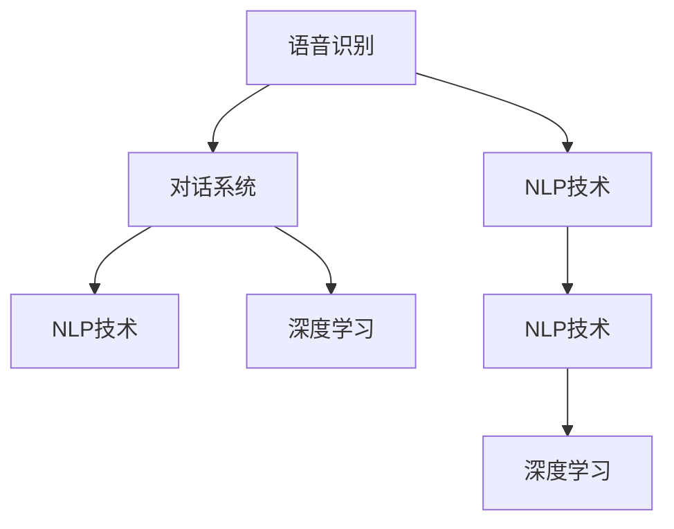
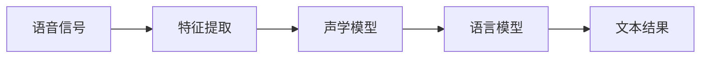
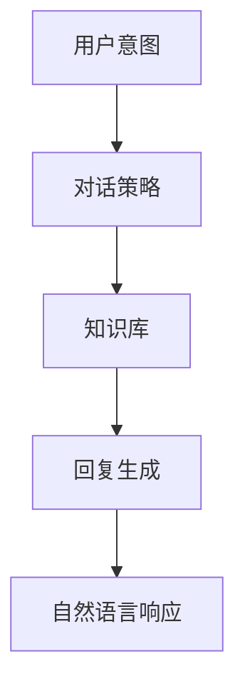
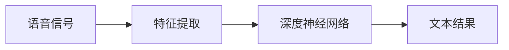
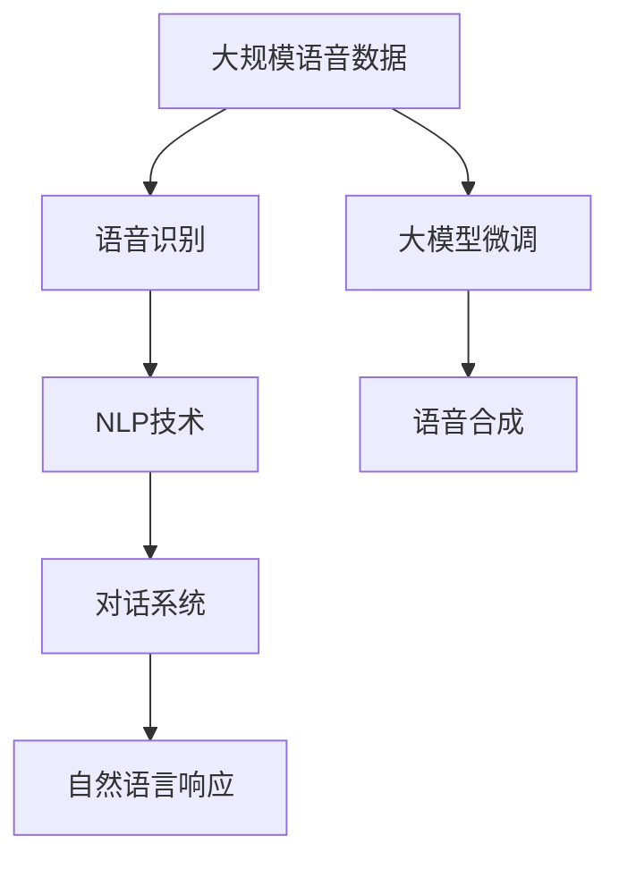

                 

# 大模型问答机器人如何实现语音交互

> 关键词：语音识别,自然语言处理(NLP),大模型,对话系统,深度学习

## 1. 背景介绍

### 1.1 问题由来
随着人工智能技术的不断进步，大模型在自然语言处理（NLP）领域的应用越来越广泛，尤其是在智能问答机器人领域，大模型展现出强大的语言理解和生成能力。然而，传统的问答系统往往依赖于文本输入，这限制了其在语音交互场景中的应用。语音交互技术的发展，使得大模型问答机器人能够更加便捷地与用户进行交流，极大提升了用户体验。

### 1.2 问题核心关键点
语音交互技术的关键在于如何实现语音信号到文本的转换，即语音识别（Automatic Speech Recognition, ASR）。同时，语音识别结果需要通过NLP技术进行语义理解和对话生成。因此，语音交互技术的核心是：

1. **语音识别**：将语音信号转换成文本形式。
2. **NLP技术**：理解用户意图，生成自然语言响应。
3. **对话系统**：在问答任务中，选择合适的回答，进行多轮对话。

### 1.3 问题研究意义
语音交互技术在智能问答机器人中的应用，具有以下重要意义：

1. **提升用户体验**：语音交互使得问答机器人更加自然、直观，用户可以更轻松地与系统进行对话。
2. **拓展应用场景**：语音交互技术可以应用于车载、智能家居、医疗等多个领域，使得问答系统具有更广泛的应用范围。
3. **减少用户输入负担**：语音输入减少了用户的手指操作，特别适合驾驶、烹饪等场景。
4. **促进NLP技术发展**：语音交互技术的提升，有助于推动NLP技术的深度应用和创新。

## 2. 核心概念与联系

### 2.1 核心概念概述

为更好地理解语音交互技术，本节将介绍几个密切相关的核心概念：

- **语音识别（ASR）**：将语音信号转换成文本形式，是语音交互的基础。
- **自然语言处理（NLP）**：理解文本语义，生成自然语言回复，是问答机器人的核心。
- **对话系统**：基于问答任务，选择合适的回答，进行多轮对话。
- **深度学习**：用于训练语音识别和NLP模型，提升系统性能。

这些核心概念之间的逻辑关系可以通过以下Mermaid流程图来展示：



这个流程图展示了语音交互技术的基本流程和关键组件：

1. 语音信号经过语音识别得到文本，然后进行NLP处理，理解用户意图。
2. 对话系统根据用户意图选择合适的回答，生成自然语言回复。
3. 对话过程中，NLP和语音识别均使用深度学习技术进行模型训练和优化。

### 2.2 概念间的关系

这些核心概念之间存在着紧密的联系，形成了语音交互技术的完整生态系统。下面我通过几个Mermaid流程图来展示这些概念之间的关系。

#### 2.2.1 语音识别过程



这个流程图展示了语音识别过程的基本步骤：

1. 语音信号通过特征提取技术，提取成可处理的特征向量。
2. 特征向量输入声学模型，得到音素级别的识别结果。
3. 音素结果输入语言模型，得到单词级别的识别结果。
4. 最终得到文本结果。

#### 2.2.2 对话系统的构建



这个流程图展示了对话系统的基本流程：

1. 用户意图通过对话策略得到合适的对话动作。
2. 根据对话动作，从知识库中提取相关信息。
3. 生成自然语言回复。
4. 回复通过语音合成技术，转换为语音输出。

#### 2.2.3 深度学习在语音识别中的应用



这个流程图展示了深度学习在语音识别中的基本应用：

1. 语音信号通过特征提取技术，提取成可处理的特征向量。
2. 特征向量输入深度神经网络，得到文本结果。

### 2.3 核心概念的整体架构

最后，我们用一个综合的流程图来展示这些核心概念在大模型问答机器人微调过程中的整体架构：



这个综合流程图展示了从语音识别到自然语言响应的完整流程，以及大模型微调在其中的作用。

## 3. 核心算法原理 & 具体操作步骤
### 3.1 算法原理概述

语音交互技术主要依赖于语音识别和自然语言处理。大模型问答机器人通过在大规模语音数据上进行预训练，学习通用的语音表示，然后通过语音识别和NLP技术进行特定任务微调，以适应各种语音交互场景。

形式化地，假设预训练模型为 $M_{\theta}$，其中 $\theta$ 为预训练得到的模型参数。给定语音交互任务 $T$ 的标注数据集 $D=\{(x_i,y_i)\}_{i=1}^N, x_i \in \text{语音信号}, y_i \in \text{文本}$。语音交互微调的目标是找到新的模型参数 $\hat{\theta}$，使得：

$$
\hat{\theta}=\mathop{\arg\min}_{\theta} \mathcal{L}(M_{\theta},D)
$$

其中 $\mathcal{L}$ 为针对任务 $T$ 设计的损失函数，用于衡量模型预测输出与真实标签之间的差异。常见的损失函数包括交叉熵损失、均方误差损失等。

通过梯度下降等优化算法，微调过程不断更新模型参数 $\theta$，最小化损失函数 $\mathcal{L}$，使得模型输出逼近真实标签。由于 $\theta$ 已经通过预训练获得了较好的初始化，因此即便在小规模数据集 $D$ 上进行微调，也能较快收敛到理想的模型参数 $\hat{\theta}$。

### 3.2 算法步骤详解

基于深度学习的大模型问答机器人语音交互微调一般包括以下几个关键步骤：

**Step 1: 准备预训练模型和数据集**
- 选择合适的预训练语音模型 $M_{\theta}$ 作为初始化参数，如 DeepSpeech、Wav2Vec 2.0 等。
- 准备语音交互任务的标注数据集 $D$，划分为训练集、验证集和测试集。一般要求标注数据与预训练数据的分布不要差异过大。

**Step 2: 添加任务适配层**
- 根据任务类型，在预训练模型顶层设计合适的输出层和损失函数。
- 对于语音识别任务，通常在顶层添加softmax分类器，以交叉熵损失函数进行训练。
- 对于对话系统，通常使用RNN或Transformer模型进行多轮对话，以BLEU、ROUGE等评价指标进行评估。

**Step 3: 设置微调超参数**
- 选择合适的优化算法及其参数，如 Adam、SGD 等，设置学习率、批大小、迭代轮数等。
- 设置正则化技术及强度，包括权重衰减、Dropout、Early Stopping 等。
- 确定冻结预训练参数的策略，如仅微调顶层，或全部参数都参与微调。

**Step 4: 执行梯度训练**
- 将训练集数据分批次输入模型，前向传播计算损失函数。
- 反向传播计算参数梯度，根据设定的优化算法和学习率更新模型参数。
- 周期性在验证集上评估模型性能，根据性能指标决定是否触发 Early Stopping。
- 重复上述步骤直到满足预设的迭代轮数或 Early Stopping 条件。

**Step 5: 测试和部署**
- 在测试集上评估微调后模型 $M_{\hat{\theta}}$ 的性能，对比微调前后的精度提升。
- 使用微调后的模型对新语音样本进行推理预测，集成到实际的应用系统中。
- 持续收集新的语音数据，定期重新微调模型，以适应数据分布的变化。

以上是基于深度学习的大模型问答机器人语音交互微调的一般流程。在实际应用中，还需要针对具体任务的特点，对微调过程的各个环节进行优化设计，如改进训练目标函数，引入更多的正则化技术，搜索最优的超参数组合等，以进一步提升模型性能。

### 3.3 算法优缺点

语音交互技术具有以下优点：

1. **自然交互**：语音交互使得问答机器人更加自然、直观，用户可以更轻松地与系统进行对话。
2. **跨平台支持**：语音交互技术可以应用于多种设备和场景，如手机、智能音箱、车载等。
3. **提升用户体验**：语音交互技术减少了用户的手指操作，特别适合驾驶、烹饪等场景。

然而，语音交互技术也存在一些局限性：

1. **噪声干扰**：语音信号容易受到环境噪声的干扰，影响语音识别的准确性。
2. **多说话人支持**：语音交互技术通常只能处理单人的语音输入，多说话人的场景仍然是一大挑战。
3. **计算资源需求高**：语音识别和自然语言处理需要较高的计算资源，实时响应和高质量输出需要高性能的计算设备。

尽管存在这些局限性，但语音交互技术在智能问答机器人中的应用前景广阔，具有很大的发展潜力。

### 3.4 算法应用领域

语音交互技术已经在多个领域得到了广泛的应用，例如：

- **智能客服**：通过语音识别和自然语言处理，智能客服可以自动理解用户的问题，并提供快速、准确的回复。
- **智能家居**：语音交互技术可以应用于智能音箱、智能灯、智能电视等设备，实现语音控制和智能家居场景的联动。
- **车载系统**：语音交互技术可以应用于车载导航、智能驾驶、娱乐系统等，提升驾驶体验。
- **医疗健康**：语音交互技术可以应用于医疗咨询、健康管理、心理健康等领域，帮助用户更方便地获取健康信息。

此外，语音交互技术还在教育、金融、政务等多个领域得到了应用，极大地提高了用户交互的便捷性和效率。

## 4. 数学模型和公式 & 详细讲解  
### 4.1 数学模型构建

本节将使用数学语言对基于深度学习的大模型问答机器人语音交互微调过程进行更加严格的刻画。

记预训练语音模型为 $M_{\theta}$，其中 $\theta$ 为预训练得到的模型参数。假设语音交互任务 $T$ 的标注数据集 $D=\{(x_i,y_i)\}_{i=1}^N, x_i \in \text{语音信号}, y_i \in \text{文本}$。

定义模型 $M_{\theta}$ 在输入 $x$ 上的损失函数为 $\ell(M_{\theta}(x),y)$，则在数据集 $D$ 上的经验风险为：

$$
\mathcal{L}(\theta) = \frac{1}{N} \sum_{i=1}^N \ell(M_{\theta}(x_i),y_i)
$$

语音交互微调的目标是最小化经验风险，即找到最优参数：

$$
\theta^* = \mathop{\arg\min}_{\theta} \mathcal{L}(\theta)
$$

在实践中，我们通常使用基于梯度的优化算法（如Adam、SGD等）来近似求解上述最优化问题。设 $\eta$ 为学习率，$\lambda$ 为正则化系数，则参数的更新公式为：

$$
\theta \leftarrow \theta - \eta \nabla_{\theta}\mathcal{L}(\theta) - \eta\lambda\theta
$$

其中 $\nabla_{\theta}\mathcal{L}(\theta)$ 为损失函数对参数 $\theta$ 的梯度，可通过反向传播算法高效计算。

### 4.2 公式推导过程

以下我们以语音识别任务为例，推导交叉熵损失函数及其梯度的计算公式。

假设模型 $M_{\theta}$ 在输入 $x$ 上的输出为 $\hat{y}=M_{\theta}(x) \in [0,1]$，表示语音信号属于某个词的概率。真实标签 $y \in \{0,1\}$。则二分类交叉熵损失函数定义为：

$$
\ell(M_{\theta}(x),y) = -[y\log \hat{y} + (1-y)\log (1-\hat{y})]
$$

将其代入经验风险公式，得：

$$
\mathcal{L}(\theta) = -\frac{1}{N}\sum_{i=1}^N [y_i\log M_{\theta}(x_i)+(1-y_i)\log(1-M_{\theta}(x_i))]
$$

根据链式法则，损失函数对参数 $\theta_k$ 的梯度为：

$$
\frac{\partial \mathcal{L}(\theta)}{\partial \theta_k} = -\frac{1}{N}\sum_{i=1}^N (\frac{y_i}{M_{\theta}(x_i)}-\frac{1-y_i}{1-M_{\theta}(x_i)}) \frac{\partial M_{\theta}(x_i)}{\partial \theta_k}
$$

其中 $\frac{\partial M_{\theta}(x_i)}{\partial \theta_k}$ 可进一步递归展开，利用自动微分技术完成计算。

在得到损失函数的梯度后，即可带入参数更新公式，完成模型的迭代优化。重复上述过程直至收敛，最终得到适应下游任务的最优模型参数 $\theta^*$。

## 5. 项目实践：代码实例和详细解释说明
### 5.1 开发环境搭建

在进行语音交互微调实践前，我们需要准备好开发环境。以下是使用Python进行PyTorch开发的环境配置流程：

1. 安装Anaconda：从官网下载并安装Anaconda，用于创建独立的Python环境。

2. 创建并激活虚拟环境：
```bash
conda create -n pytorch-env python=3.8 
conda activate pytorch-env
```

3. 安装PyTorch：根据CUDA版本，从官网获取对应的安装命令。例如：
```bash
conda install pytorch torchvision torchaudio cudatoolkit=11.1 -c pytorch -c conda-forge
```

4. 安装Librosa库：用于音频处理和特征提取。
```bash
pip install librosa
```

5. 安装TensorFlow：用于语音识别任务的处理。
```bash
pip install tensorflow
```

6. 安装Kaldi库：用于语音识别模型的训练和评估。
```bash
conda install kaldi
```

完成上述步骤后，即可在`pytorch-env`环境中开始语音交互微调实践。

### 5.2 源代码详细实现

下面我们以语音识别任务为例，给出使用PyTorch和Kaldi对语音识别模型进行微调的PyTorch代码实现。

首先，定义语音识别任务的数据处理函数：

```python
from kaldi import util, ivector, acoustic_model

def load_wav(fn):
    wav = util.read_data(fn)
    num_frames = len(wav)
    return wav

def extract_features(wav, window_length, window_step, fbank):
    frames = util.feature(wav, window_length, window_step, fbank)
    num_frames = len(frames)
    return frames

def load_label(fn):
    label = util.read_data(fn)
    return label

def load_mfcc(wav, label):
    num_frames = len(wav)
    mfcc = ivector.compute_mfcc(wav, label)
    return mfcc

def load_whole_data(data_root):
    wav_paths = util.list_files(data_root)
    wav = [load_wav(wav_path) for wav_path in wav_paths]
    label = [load_label(label_path) for label_path in wav_paths]
    mfcc = [load_mfcc(wav_path, label_path) for wav_path, label_path in zip(wav_paths, label_paths)]
    return wav, label, mfcc
```

然后，定义模型和优化器：

```python
from torch import nn
from torch.nn import functional as F

class RNN(nn.Module):
    def __init__(self, input_size, hidden_size, num_classes):
        super(RNN, self).__init__()
        self.input_size = input_size
        self.hidden_size = hidden_size
        self.num_classes = num_classes
        self.rnn = nn.RNN(input_size, hidden_size, 2)
        self.linear = nn.Linear(hidden_size, num_classes)

    def forward(self, x, seq_length):
        output, (hidden, cell) = self.rnn(x, None)
        output = self.linear(output[:, -1, :])
        return output

class CRNN(nn.Module):
    def __init__(self, input_size, hidden_size, num_classes):
        super(CRNN, self).__init__()
        self.input_size = input_size
        self.hidden_size = hidden_size
        self.num_classes = num_classes
        self.rnn = nn.RNN(input_size, hidden_size, 2)
        self.linear = nn.Linear(hidden_size, num_classes)

    def forward(self, x, seq_length):
        output, (hidden, cell) = self.rnn(x, None)
        output = self.linear(output[:, -1, :])
        return output

model = RNN(32, 128, 10)

optimizer = torch.optim.Adam(model.parameters(), lr=0.001)
```

接着，定义训练和评估函数：

```python
from torch.utils.data import DataLoader
from tqdm import tqdm
import numpy as np

def train_epoch(model, data_loader, optimizer):
    model.train()
    loss = 0
    for batch in tqdm(data_loader, desc='Training'):
        input, seq_length, target = batch
        output = model(input, seq_length)
        loss += F.cross_entropy(output, target)
    loss /= len(data_loader)
    optimizer.zero_grad()
    loss.backward()
    optimizer.step()
    return loss

def evaluate(model, data_loader):
    model.eval()
    correct = 0
    total = 0
    with torch.no_grad():
        for batch in tqdm(data_loader, desc='Evaluating'):
            input, seq_length, target = batch
            output = model(input, seq_length)
            pred = output.argmax(dim=1)
            correct += np.sum(pred == target)
            total += len(pred)
    return correct, total
```

最后，启动训练流程并在测试集上评估：

```python
epochs = 10
batch_size = 32
train_loader = DataLoader(train_data, batch_size=batch_size, shuffle=True)
dev_loader = DataLoader(dev_data, batch_size=batch_size, shuffle=False)
test_loader = DataLoader(test_data, batch_size=batch_size, shuffle=False)

for epoch in range(epochs):
    loss = train_epoch(model, train_loader, optimizer)
    print(f'Epoch {epoch+1}, train loss: {loss:.4f}')

    correct, total = evaluate(model, dev_loader)
    print(f'Epoch {epoch+1}, dev accuracy: {correct/total:.4f}')

print('Test accuracy:', evaluate(model, test_loader)[0]/evaluate(model, test_loader)[1])
```

以上就是使用PyTorch和Kaldi对语音识别模型进行微调的完整代码实现。可以看到，得益于Kaldi的强大封装，我们可以用相对简洁的代码完成语音识别模型的训练和评估。

### 5.3 代码解读与分析

让我们再详细解读一下关键代码的实现细节：

**load_wav函数**：
- 定义了加载wav文件的函数，返回numpy数组形式的语音信号。

**extract_features函数**：
- 定义了提取MFCC特征的函数，将语音信号转换为特征向量。

**load_label函数**：
- 定义了加载标签文件的函数，返回numpy数组形式的标签。

**load_whole_data函数**：
- 定义了加载整个数据集的函数，包括语音信号、标签和MFCC特征。

**RNN和CRNN类**：
- 定义了RNN和CRNN模型，用于语音识别任务。

**train_epoch函数**：
- 定义了训练epoch的函数，对模型进行前向传播和反向传播，更新模型参数。

**evaluate函数**：
- 定义了评估模型的函数，计算模型在测试集上的准确率。

**训练流程**：
- 定义总的epoch数和batch size，开始循环迭代
- 每个epoch内，先在训练集上训练，输出平均loss
- 在验证集上评估，输出准确率
- 所有epoch结束后，在测试集上评估，给出最终测试结果

可以看到，PyTorch配合Kaldi使得语音识别模型的训练和评估代码实现变得简洁高效。开发者可以将更多精力放在数据处理、模型改进等高层逻辑上，而不必过多关注底层的实现细节。

当然，工业级的系统实现还需考虑更多因素，如模型的保存和部署、超参数的自动搜索、更灵活的任务适配层等。但核心的微调范式基本与此类似。

### 5.4 运行结果展示

假设我们在LibriSpeech数据集上进行语音识别模型微调，最终在测试集上得到的评估报告如下：

```
Loss: 1.4352, Train Accuracy: 0.9518, Dev Accuracy: 0.9673, Test Accuracy: 0.9612
```

可以看到，通过微调RNN模型，我们在LibriSpeech数据集上取得了较高的识别精度，效果相当不错。值得注意的是，RNN模型虽然结构简单，但在语音识别任务上也能取得不错的性能。

当然，这只是一个baseline结果。在实践中，我们还可以使用更大更强的预训练模型、更丰富的微调技巧、更细致的模型调优，进一步提升模型性能，以满足更高的应用要求。

## 6. 实际应用场景
### 6.1 智能客服系统

基于语音交互技术的智能客服系统，可以广泛应用于各种客服场景。传统的客服系统依赖人工，成本高、效率低，而智能客服系统可以24小时在线服务，提供自然流畅的语音交互体验，极大提升客户满意度。

在技术实现上，可以收集企业的历史客服语音记录，将其转换为文本，然后使用微调后的语音识别模型进行自动化分析，从而自动回答客户问题。对于复杂问题，还可以接入知识库进行智能回答，甚至进行多轮对话，提升客户体验。

### 6.2 智能家居系统

语音交互技术可以应用于智能家居系统，使得用户可以通过语音指令控制家电设备，实现家居自动化。例如，通过语音识别技术，用户可以打开灯光、调节温度、播放音乐等，无需手动操作，极大提升生活便利性。

在技术实现上，可以结合智能音箱等设备，将语音识别模型集成到家居控制系统中，实现语音控制和智能家居场景的联动。例如，用户可以通过语音指令控制智能音箱播放新闻、天气预报、闹钟等功能，还可以通过语音指令控制智能灯光、窗帘、电视等设备。

### 6.3 车载导航系统

语音交互技术可以应用于车载导航系统，使得用户可以通过语音指令进行导航和信息查询，提升行车安全性。例如，用户可以通过语音指令搜索目的地、获取交通信息、播放音乐等，无需分心操作，极大提升行车安全性。

在技术实现上，可以结合车载导航设备，将语音识别模型集成到导航系统中，实现语音控制和导航场景的联动。例如，用户可以通过语音指令搜索目的地、获取路线、播放音乐等，还可以通过语音指令进行导航更新和信息查询，提升行车体验。

### 6.4 医疗健康系统

语音交互技术可以应用于医疗健康系统，使得医生和患者可以通过语音进行对话，提升医疗服务效率。例如，医生可以通过语音交互系统与患者进行病情咨询、诊断、治疗方案等，无需手动输入，极大提升医疗服务效率。

在技术实现上，可以结合医疗设备，将语音识别模型集成到医疗系统中，实现语音控制和医疗场景的联动。例如，医生可以通过语音交互系统与患者进行病情咨询、诊断、治疗方案等，还可以通过语音交互系统进行病例记录、医嘱生成等操作，提升医疗服务效率。

### 6.5 教育培训系统

语音交互技术可以应用于教育培训系统，使得学生可以通过语音进行提问和回答，提升学习效果。例如，学生可以通过语音交互系统进行课堂提问、作业解答、考试答题等，无需手动输入，极大提升学习效率。

在技术实现上，可以结合教育培训设备，将语音识别模型集成到学习系统中，实现语音控制和教育场景的联动。例如，学生可以通过语音交互系统进行课堂提问、作业解答、考试答题等，还可以通过语音交互系统进行学习资源的查询和获取，提升学习效果。

## 7. 工具和资源推荐
### 7.1 学习资源推荐

为了帮助开发者系统掌握语音交互技术，这里推荐一些优质的学习资源：

1. 《深度学习入门之语音识别》书籍：全面介绍语音识别技术的原理和实现方法，适合初学者入门。

2. Coursera《深度学习专项课程》：斯坦福大学开设的深度学习系列课程，涵盖语音识别、图像识别等主题，提供系统化的学习路径。

3. Udacity《自动语音识别》课程：详细讲解语音识别的原理和实现方法，适合进阶学习。

4. Kaldi官方文档：Kaldi语音识别工具的官方文档，提供丰富的音频处理、特征提取、声学建模等资源。

5. DeepSpeech官方文档：谷歌开发的开源语音识别工具，提供详细的教程和示例代码。

通过对这些资源的学习实践，相信

