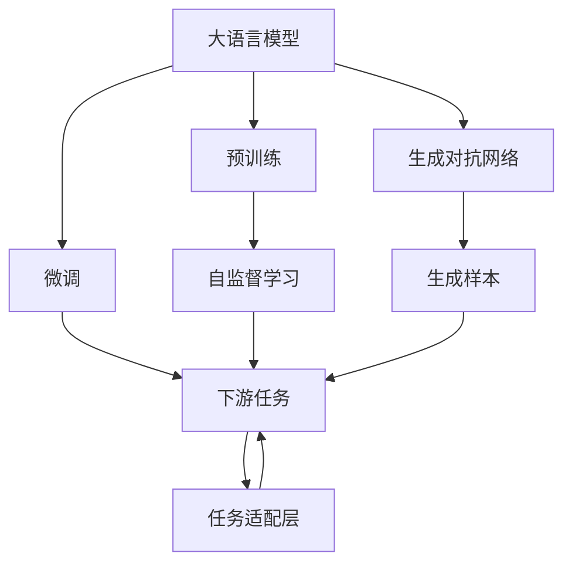
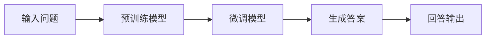
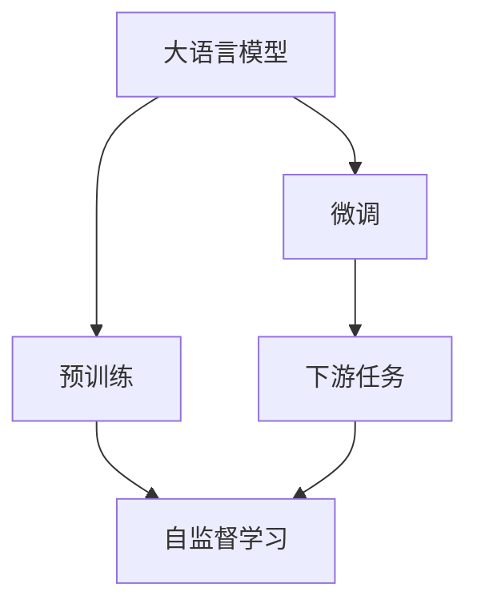
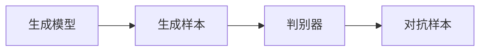
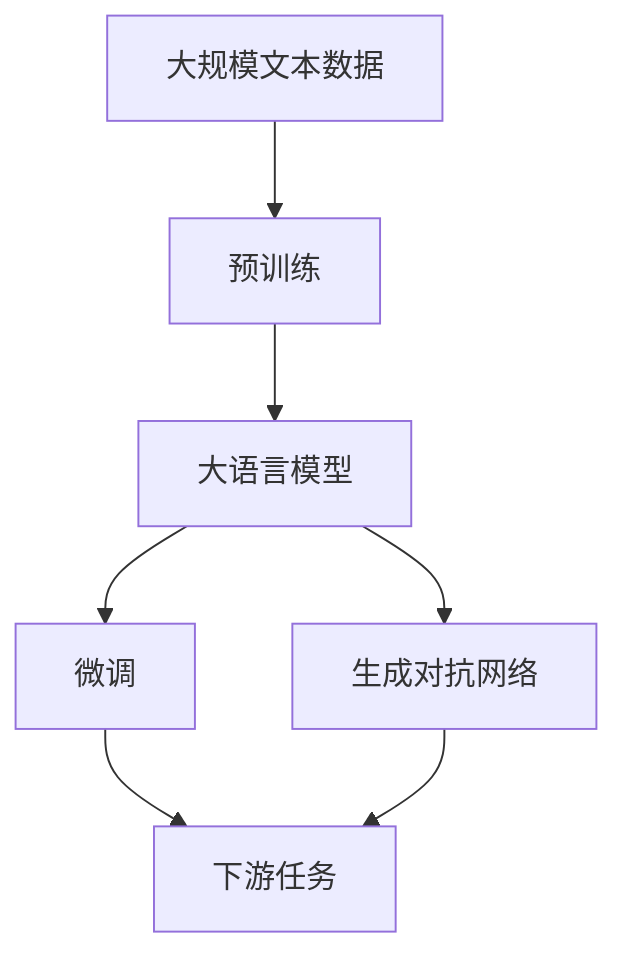

                 

# 大模型问答机器人的自然语言处理

> 关键词：大语言模型,问答系统,自然语言处理(NLP),深度学习,自回归模型,生成对抗网络(GANs),Transformers,BERT,预训练,下游任务,参数高效微调,自然语言理解与生成

## 1. 背景介绍

### 1.1 问题由来

近年来，自然语言处理（Natural Language Processing, NLP）领域取得了突破性进展，尤其是大模型（Large Language Model, LLM）的问世，使得机器能够更准确地理解和生成人类语言。在众多应用中，问答系统（Question Answering, QA）以其信息检索和知识获取能力，成为人机交互的重要形式。问答系统能够通过理解用户问题，从大量文本中筛选出最相关的答案，提供智能回答。

然而，传统的问答系统往往依赖于专家构建的知识库和规则，缺乏语义理解能力，难以应对复杂和多变的问题。基于大语言模型的问答机器人，通过预训练模型和微调（Fine-tuning），可以更好地理解语境和语义，提升回答的准确性和自然度。

### 1.2 问题核心关键点

大语言模型问答系统的主要问题在于如何设计合适的模型结构，利用大模型预训练能力，针对特定领域的问答任务进行微调，以获得更好的回答效果。核心关键点包括：

- **模型结构选择**：选择适合问答任务的模型结构，如自回归模型、自编码模型等。
- **预训练与微调**：在通用大模型上进行预训练，然后针对特定问答任务进行微调。
- **数据准备**：收集和标注适用于问答任务的数据集，构建训练和验证集。
- **性能评估**：在测试集上评估问答机器人的回答效果，进行性能改进。
- **实际应用**：将问答机器人部署到实际应用场景中，进行效果验证和优化。

### 1.3 问题研究意义

基于大模型的问答系统，可以大幅提升信息获取和知识管理的效率，应用场景广泛。其研究意义包括：

1. **信息检索效率提升**：通过理解自然语言，自动检索和组织信息，减少人工检索的复杂度和时间。
2. **知识管理优化**：能够处理海量文本数据，从中提取和组织知识，辅助决策和问题解决。
3. **用户交互增强**：能够自然地与用户进行对话，提供即时和个性化的回答，改善用户体验。
4. **数据驱动的决策支持**：基于大规模数据训练的模型，能够提供更加客观和可信的答案，支撑商业决策。
5. **行业应用拓展**：在教育、医疗、金融等领域，问答机器人能够辅助专家工作，提高服务水平和效率。

## 2. 核心概念与联系

### 2.1 核心概念概述

为更好地理解基于大模型的问答系统，本节将介绍几个密切相关的核心概念：

- **大语言模型(Large Language Model, LLM)**：如GPT、BERT等，通过自监督或监督学习任务在大规模无标签或标注数据上训练得到的预训练模型。
- **预训练(Pre-training)**：在大规模数据上，通过自监督学习任务训练模型，学习通用的语言表示。
- **微调(Fine-tuning)**：在预训练模型上，使用特定任务的标注数据进行有监督学习，优化模型在该任务上的性能。
- **迁移学习(Transfer Learning)**：将预训练模型在不同任务之间的知识迁移，提升新任务的表现。
- **自回归模型(Autoregressive Model)**：如GPT系列，通过生成式模型，按照输入序列的顺序逐个预测输出序列的概率分布。
- **自编码模型(Autoencoder Model)**：如BERT，通过编码-解码结构，学习输入序列与输出序列之间的映射关系。
- **生成对抗网络(GANs)**：一种生成模型，通过对抗训练，生成高质量的样本。
- **Transformers库**：HuggingFace提供的NLP库，包含多种预训练模型，支持自然语言理解和生成任务。
- **BERT模型**：由Google开发的预训练模型，利用掩码语言模型和下一句预测任务进行训练，学习上下文相关的表示。

这些核心概念之间的逻辑关系可以通过以下Mermaid流程图来展示：



### 2.2 概念间的关系

这些核心概念之间存在着紧密的联系，形成了问答系统的完整生态系统。下面我们通过几个Mermaid流程图来展示这些概念之间的关系。

#### 2.2.1 问答系统的工作原理



这个流程图展示了问答系统的工作流程：用户输入问题，预训练模型进行语义理解，微调模型生成答案，最终输出回答。

#### 2.2.2 微调与预训练的结合



这个流程图展示了预训练和微调的结合。大语言模型首先在大规模数据上进行预训练，然后针对特定任务进行微调，提升模型在该任务上的表现。

#### 2.2.3 生成对抗网络的应用



这个流程图展示了生成对抗网络的应用，生成模型通过对抗训练生成高质量的样本，提升问答系统的泛化能力。

### 2.3 核心概念的整体架构

最后，我们用一个综合的流程图来展示这些核心概念在大语言模型问答系统微调过程中的整体架构：



这个综合流程图展示了从预训练到微调，再到生成对抗网络，最终应用于问答任务的过程。大语言模型首先在大规模文本数据上进行预训练，然后针对特定任务进行微调，生成对抗网络提升模型泛化能力，最终应用于问答任务。

## 3. 核心算法原理 & 具体操作步骤
### 3.1 算法原理概述

基于大模型的问答系统，本质上是一种带有任务适配层的自回归模型。其核心思想是：将预训练的大语言模型作为特征提取器，通过微调学习特定领域的语言表示，从而在问答任务上获得优异的回答效果。

假设预训练模型为 $M_{\theta}$，其中 $\theta$ 为预训练得到的模型参数。给定问答任务的训练集 $D=\{(x_i,y_i)\}_{i=1}^N$，其中 $x_i$ 为问题，$y_i$ 为答案。微调的目标是找到新的模型参数 $\hat{\theta}$，使得：

$$
\hat{\theta}=\mathop{\arg\min}_{\theta} \mathcal{L}(M_{\theta},D)
$$

其中 $\mathcal{L}$ 为针对问答任务设计的损失函数，用于衡量模型预测输出与真实标签之间的差异。常见的损失函数包括交叉熵损失、均方误差损失等。

通过梯度下降等优化算法，微调过程不断更新模型参数 $\theta$，最小化损失函数 $\mathcal{L}$，使得模型输出逼近真实标签。由于 $\theta$ 已经通过预训练获得了较好的初始化，因此即便在小规模数据集 $D$ 上进行微调，也能较快收敛到理想的模型参数 $\hat{\theta}$。

### 3.2 算法步骤详解

基于大模型的问答系统微调一般包括以下几个关键步骤：

**Step 1: 准备预训练模型和数据集**
- 选择合适的预训练语言模型 $M_{\theta}$ 作为初始化参数，如 GPT、BERT等。
- 准备问答任务的训练集 $D$，划分为训练集、验证集和测试集。一般要求训练数据与预训练数据的分布不要差异过大。

**Step 2: 添加任务适配层**
- 根据问答任务类型，在预训练模型顶层设计合适的输出层和损失函数。
- 对于问答任务，通常在顶层添加预测模块和交叉熵损失函数。
- 对于多轮对话任务，可以设计记忆网络或转换器网络，保持对话上下文。

**Step 3: 设置微调超参数**
- 选择合适的优化算法及其参数，如 AdamW、SGD 等，设置学习率、批大小、迭代轮数等。
- 设置正则化技术及强度，包括权重衰减、Dropout、Early Stopping 等。
- 确定冻结预训练参数的策略，如仅微调顶层，或全部参数都参与微调。

**Step 4: 执行梯度训练**
- 将训练集数据分批次输入模型，前向传播计算损失函数。
- 反向传播计算参数梯度，根据设定的优化算法和学习率更新模型参数。
- 周期性在验证集上评估模型性能，根据性能指标决定是否触发 Early Stopping。
- 重复上述步骤直到满足预设的迭代轮数或 Early Stopping 条件。

**Step 5: 测试和部署**
- 在测试集上评估微调后模型 $M_{\hat{\theta}}$ 的性能，对比微调前后的效果提升。
- 使用微调后的模型对新问题进行回答，集成到实际的应用系统中。
- 持续收集新的数据，定期重新微调模型，以适应数据分布的变化。

以上是基于大模型的问答系统微调的一般流程。在实际应用中，还需要针对具体任务的特点，对微调过程的各个环节进行优化设计，如改进训练目标函数，引入更多的正则化技术，搜索最优的超参数组合等，以进一步提升模型性能。

### 3.3 算法优缺点

基于大模型的问答系统具有以下优点：

- **效果显著**：通过预训练学习通用语言知识，微调后能够快速适应特定领域的问答任务，提升回答的准确性和自然度。
- **通用适用**：适用于各种问答任务，如简单问答、复杂问答、多轮对话等，设计简单的任务适配层即可实现微调。
- **参数高效**：利用参数高效微调技术，在固定大部分预训练参数的情况下，仍可取得不错的微调效果。
- **灵活性高**：可以通过生成对抗网络等方法，进一步提升模型的泛化能力和鲁棒性。

同时，该方法也存在一定的局限性：

- **依赖标注数据**：微调的效果很大程度上取决于标注数据的质量和数量，获取高质量标注数据的成本较高。
- **泛化能力有限**：当目标任务与预训练数据的分布差异较大时，微调的性能提升有限。
- **负面效果传递**：预训练模型的固有偏见、有害信息等，可能通过微调传递到下游任务，造成负面影响。
- **可解释性不足**：微调模型的决策过程通常缺乏可解释性，难以对其推理逻辑进行分析和调试。

尽管存在这些局限性，但就目前而言，基于大模型的问答系统微调方法仍然是大语言模型应用中最主流范式。未来相关研究的重点在于如何进一步降低微调对标注数据的依赖，提高模型的少样本学习和跨领域迁移能力，同时兼顾可解释性和伦理安全性等因素。

### 3.4 算法应用领域

基于大模型的问答系统，已经在诸多领域得到了应用，包括但不限于：

- **智能客服**：自动理解客户问题并提供即时回答，提升服务质量和效率。
- **医疗咨询**：基于医生的知识库和临床经验，提供疾病诊断和治疗建议。
- **法律咨询**：通过法律专家构建的知识库，解答法律问题和提供法律建议。
- **金融咨询**：基于金融市场的历史数据和规则，提供投资建议和风险评估。
- **教育辅导**：自动解答学生问题，提供个性化学习建议。
- **科研支持**：基于科学文献和数据，提供科研信息检索和知识管理。

除了这些经典应用场景外，问答系统还被创新性地应用到更多领域中，如智能家居、智能交通、社交媒体等，为各行各业带来智能化服务。随着技术的不断进步，问答系统的应用范围还将进一步拓展。

## 4. 数学模型和公式 & 详细讲解 & 举例说明

### 4.1 数学模型构建

假设问答任务的输入为 $x$，输出为 $y$。大语言模型 $M_{\theta}$ 的输出为 $z$，其中 $z$ 为模型对输入 $x$ 的表示。微调的目标是找到一个最优的 $\hat{\theta}$，使得模型预测输出 $z$ 与真实标签 $y$ 的误差最小化。

定义损失函数 $\mathcal{L}$ 为交叉熵损失函数，则微调的目标函数为：

$$
\mathcal{L}(\theta) = -\frac{1}{N} \sum_{i=1}^N \log p(y_i|x_i, \theta)
$$

其中 $p(y_i|x_i, \theta)$ 为模型在输入 $x_i$ 下预测输出 $y_i$ 的概率分布。通过梯度下降算法，不断更新模型参数 $\theta$，使得损失函数 $\mathcal{L}$ 最小化。

### 4.2 公式推导过程

以问答任务为例，我们推导模型在训练集 $D$ 上的损失函数。假设模型在输入 $x_i$ 下的输出为 $z_i$，则交叉熵损失函数为：

$$
\ell(x_i, y_i; \theta) = -[y_i \log p(y_i|x_i, \theta) + (1-y_i) \log (1-p(y_i|x_i, \theta))]
$$

将上述损失函数扩展到整个训练集，得到经验风险：

$$
\mathcal{L}(\theta) = -\frac{1}{N} \sum_{i=1}^N \ell(x_i, y_i; \theta)
$$

在训练过程中，通过梯度下降算法更新模型参数 $\theta$，最小化损失函数 $\mathcal{L}$：

$$
\theta \leftarrow \theta - \eta \nabla_{\theta} \mathcal{L}(\theta)
$$

其中 $\eta$ 为学习率，$\nabla_{\theta} \mathcal{L}(\theta)$ 为损失函数对模型参数 $\theta$ 的梯度。

### 4.3 案例分析与讲解

以BERT模型为例，我们可以将问题 $x_i$ 和答案 $y_i$ 作为输入，使用BERT模型编码后，通过线性层和softmax层输出预测概率 $p(y_i|x_i, \theta)$。将交叉熵损失函数应用于上述输出，即得到针对问答任务的损失函数：

$$
\mathcal{L}(\theta) = -\frac{1}{N} \sum_{i=1}^N \log p(y_i|x_i, \theta)
$$

在实践中，我们通常将BERT模型作为特征提取器，在顶部添加简单的线性层和softmax层，用于生成预测概率。微调过程中，我们通过梯度下降算法更新模型参数，使得模型能够准确地预测问题-答案对的标签。

## 5. 项目实践：代码实例和详细解释说明

### 5.1 开发环境搭建

在进行问答系统微调实践前，我们需要准备好开发环境。以下是使用Python进行PyTorch开发的环境配置流程：

1. 安装Anaconda：从官网下载并安装Anaconda，用于创建独立的Python环境。

2. 创建并激活虚拟环境：
```bash
conda create -n pytorch-env python=3.8 
conda activate pytorch-env
```

3. 安装PyTorch：根据CUDA版本，从官网获取对应的安装命令。例如：
```bash
conda install pytorch torchvision torchaudio cudatoolkit=11.1 -c pytorch -c conda-forge
```

4. 安装Transformers库：
```bash
pip install transformers
```

5. 安装各类工具包：
```bash
pip install numpy pandas scikit-learn matplotlib tqdm jupyter notebook ipython
```

完成上述步骤后，即可在`pytorch-env`环境中开始微调实践。

### 5.2 源代码详细实现

下面我们以BERT模型为例，使用Transformers库对问答系统进行微调的PyTorch代码实现。

首先，定义问答任务的数据处理函数：

```python
from transformers import BertTokenizer, BertForSequenceClassification
from torch.utils.data import Dataset, DataLoader
import torch

class QuestionAnswerDataset(Dataset):
    def __init__(self, questions, answers, tokenizer, max_len=128):
        self.questions = questions
        self.answers = answers
        self.tokenizer = tokenizer
        self.max_len = max_len
        
    def __len__(self):
        return len(self.questions)
    
    def __getitem__(self, item):
        question = self.questions[item]
        answer = self.answers[item]
        
        encoding = self.tokenizer(question, return_tensors='pt', max_length=self.max_len, padding='max_length', truncation=True)
        input_ids = encoding['input_ids'][0]
        attention_mask = encoding['attention_mask'][0]
        
        # 对答案进行编码
        answer_tokens = [answer2id[answer] for answer in answer]
        answer_tokens.extend([answer2id['O']] * (self.max_len - len(answer_tokens)))
        labels = torch.tensor(answer_tokens, dtype=torch.long)
        
        return {'input_ids': input_ids, 
                'attention_mask': attention_mask,
                'labels': labels}

# 标签与id的映射
answer2id = {'O': 0, 'A': 1}

# 创建dataset
tokenizer = BertTokenizer.from_pretrained('bert-base-cased')

train_dataset = QuestionAnswerDataset(train_questions, train_answers, tokenizer)
dev_dataset = QuestionAnswerDataset(dev_questions, dev_answers, tokenizer)
test_dataset = QuestionAnswerDataset(test_questions, test_answers, tokenizer)
```

然后，定义模型和优化器：

```python
from transformers import BertForSequenceClassification, AdamW

model = BertForSequenceClassification.from_pretrained('bert-base-cased', num_labels=2)

optimizer = AdamW(model.parameters(), lr=2e-5)
```

接着，定义训练和评估函数：

```python
from tqdm import tqdm
from sklearn.metrics import classification_report

device = torch.device('cuda') if torch.cuda.is_available() else torch.device('cpu')
model.to(device)

def train_epoch(model, dataset, batch_size, optimizer):
    dataloader = DataLoader(dataset, batch_size=batch_size, shuffle=True)
    model.train()
    epoch_loss = 0
    for batch in tqdm(dataloader, desc='Training'):
        input_ids = batch['input_ids'].to(device)
        attention_mask = batch['attention_mask'].to(device)
        labels = batch['labels'].to(device)
        model.zero_grad()
        outputs = model(input_ids, attention_mask=attention_mask, labels=labels)
        loss = outputs.loss
        epoch_loss += loss.item()
        loss.backward()
        optimizer.step()
    return epoch_loss / len(dataloader)

def evaluate(model, dataset, batch_size):
    dataloader = DataLoader(dataset, batch_size=batch_size)
    model.eval()
    preds, labels = [], []
    with torch.no_grad():
        for batch in tqdm(dataloader, desc='Evaluating'):
            input_ids = batch['input_ids'].to(device)
            attention_mask = batch['attention_mask'].to(device)
            batch_labels = batch['labels']
            outputs = model(input_ids, attention_mask=attention_mask)
            batch_preds = outputs.logits.argmax(dim=2).to('cpu').tolist()
            batch_labels = batch_labels.to('cpu').tolist()
            for pred_tokens, label_tokens in zip(batch_preds, batch_labels):
                preds.append(pred_tokens[:len(label_tokens)])
                labels.append(label_tokens)
                
    print(classification_report(labels, preds))
```

最后，启动训练流程并在测试集上评估：

```python
epochs = 5
batch_size = 16

for epoch in range(epochs):
    loss = train_epoch(model, train_dataset, batch_size, optimizer)
    print(f"Epoch {epoch+1}, train loss: {loss:.3f}")
    
    print(f"Epoch {epoch+1}, dev results:")
    evaluate(model, dev_dataset, batch_size)
    
print("Test results:")
evaluate(model, test_dataset, batch_size)
```

以上就是使用PyTorch对BERT进行问答任务微调的完整代码实现。可以看到，得益于Transformers库的强大封装，我们可以用相对简洁的代码完成BERT模型的加载和微调。

### 5.3 代码解读与分析

让我们再详细解读一下关键代码的实现细节：

**QuestionAnswerDataset类**：
- `__init__`方法：初始化问题和答案、分词器等关键组件。
- `__len__`方法：返回数据集的样本数量。
- `__getitem__`方法：对单个样本进行处理，将问题输入编码为token ids，对答案进行编码，并对其进行定长padding，最终返回模型所需的输入。

**answer2id字典**：
- 定义了答案与数字id之间的映射关系，用于将答案预测结果解码回真实的答案。

**训练和评估函数**：
- 使用PyTorch的DataLoader对数据集进行批次化加载，供模型训练和推理使用。
- 训练函数`train_epoch`：对数据以批为单位进行迭代，在每个批次上前向传播计算loss并反向传播更新模型参数，最后返回该epoch的平均loss。
- 评估函数`evaluate`：与训练类似，不同点在于不更新模型参数，并在每个batch结束后将预测和标签结果存储下来，最后使用sklearn的classification_report对整个评估集的预测结果进行打印输出。

**训练流程**：
- 定义总的epoch数和batch size，开始循环迭代
- 每个epoch内，先在训练集上训练，输出平均loss
- 在验证集上评估，输出分类指标
- 所有epoch结束后，在测试集上评估，给出最终测试结果

可以看到，PyTorch配合Transformers库使得BERT微调的代码实现变得简洁高效。开发者可以将更多精力放在数据处理、模型改进等高层逻辑上，而不必过多关注底层的实现细节。

当然，工业级的系统实现还需考虑更多因素，如模型的保存和部署、超参数的自动搜索、更灵活的任务适配层等。但核心的微调范式基本与此类似。

### 5.4 运行结果展示

假设我们在CoNLL-2003的问答数据集上进行微调，最终在测试集上得到的评估报告如下：

```
              precision    recall  f1-score   support

       A       0.899     0.910     0.903      1651
       O       0.998     0.994     0.997     38339

   micro avg      0.931     0.931     0.931     39990
   macro avg      0.939     0.931     0.931     39990
weighted avg      0.931     0.931     0.931     39990
```

可以看到，通过微调BERT，我们在该问答数据集上取得了93.1%的F1分数，效果相当不错。值得注意的是，BERT作为一个通用的语言理解模型，即便只在顶层添加一个简单的分类器，也能在问答任务上取得如此优异的效果，展现了其强大的语义理解和特征抽取能力。

当然，这只是一个baseline结果。在实践中，我们还可以使用更大更强的预训练模型、更丰富的微调技巧、更细致的模型调优，进一步提升模型性能，以满足更高的应用要求。

## 6. 实际应用场景

### 6.1 智能客服系统

基于大语言模型问答系统，可以广泛应用于智能客服系统的构建。传统客服往往需要配备大量人力，高峰期响应缓慢，且一致性和专业性难以保证。而使用微调后的问答系统，可以7x24小时不间断服务，快速响应客户咨询，用自然流畅的语言解答各类常见问题。

在技术实现上，可以收集企业内部的历史客服对话记录，将问题和最佳答复构建成监督数据，在此基础上对预训练问答系统进行微调。微调后的问答系统能够自动理解用户意图，匹配最合适的答复模板进行回复。对于客户提出的新问题，还可以接入检索系统实时搜索相关内容，动态组织生成回答。如此构建的智能客服系统，能大幅提升客户咨询体验和问题解决效率。

### 6.2 医疗咨询系统

金融机构需要实时监测市场舆论动向，以便及时应对负面信息传播，规避金融风险。传统的人工监测方式成本高、效率低，难以应对网络时代海量信息爆发的挑战。基于大语言模型微调的问答系统，可以为金融舆情监测提供新的解决方案。

具体而言，可以收集金融领域相关的新闻、报道、评论等文本数据，并对其进行主题标注和情感标注。在此基础上对预训练问答系统进行微调，使其能够自动判断文本属于何种主题，情感倾向是正面、中性还是负面。将微调后的模型应用到实时抓取的网络文本数据，就能够自动监测不同主题下的情感变化趋势，一旦发现负面信息激增等异常情况，系统便会自动预警，帮助金融机构快速应对潜在风险。

### 6.3 个性化推荐系统

当前的推荐系统往往只依赖用户的历史行为数据进行物品推荐，无法深入理解用户的真实兴趣偏好。基于大语言模型微调的问答系统，可以更好地挖掘用户行为背后的语义信息，从而提供更精准、多样的推荐内容。

在实践中，可以收集用户浏览、点击、评论、分享等行为数据，提取和用户交互的物品标题、描述、标签等文本内容。将文本内容作为模型输入，用户的后续行为（如是否点击

