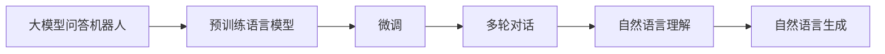
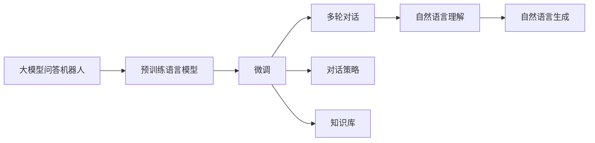
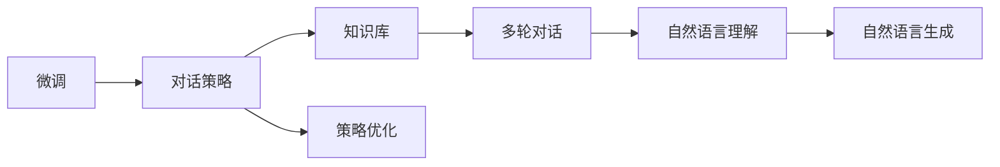
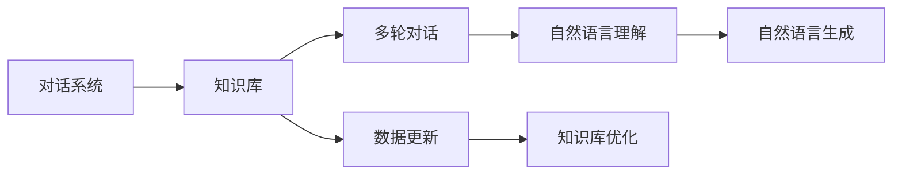

                 

# 大模型问答机器人的问题回答

> 关键词：大模型问答, 自然语言理解, 语言生成, 深度学习, 预训练语言模型, 对话系统, 模型微调, 多轮对话, 上下文感知

## 1. 背景介绍

在当今信息爆炸的时代，人们对于快速获取知识的需求日益增长。传统的搜索引擎、百科全书已经无法满足用户个性化、情境化的查询需求。大模型问答机器人（Large Model Question Answering Robot）正逐渐成为解决这一需求的重要工具。

大模型问答机器人利用预训练语言模型，如BERT、GPT等，通过微调（Fine-tuning）来适配具体任务。其核心思想是：将大语言模型作为知识库，通过有监督学习，使其能够在对话中准确理解和回答问题。近年来，随着Transformer等深度学习架构的普及，大模型问答机器人的性能和效果显著提升，已经广泛应用于在线客服、智能助理、教育辅导等领域。

本文将深入探讨大模型问答机器人的原理、实现方法以及实际应用。希望通过本文，读者能够理解大模型问答机器人的工作机制，掌握其实现技术，并能够将其应用于实际项目中。

## 2. 核心概念与联系

### 2.1 核心概念概述

为了更好地理解大模型问答机器人，首先需要了解几个核心概念：

- **大模型问答机器人（Large Model Question Answering Robot）**：指利用大语言模型，通过微调，能够自然地回答用户问题的智能系统。

- **预训练语言模型（Pre-trained Language Model）**：指在大规模无标签文本上训练得到的语言模型，如BERT、GPT等。通过预训练，模型能够学习到丰富的语言知识和语义表示。

- **微调（Fine-tuning）**：指在预训练语言模型的基础上，通过有监督学习，使模型适应具体任务的过程。在问答机器人中，微调通常涉及多轮对话数据的训练。

- **对话系统（Dialogue System）**：指能够理解和回应用户输入的系统，包括自然语言理解和自然语言生成两个重要环节。

- **上下文感知（Context-Aware）**：指在处理多轮对话时，模型能够保存并利用之前对话的信息。这对于理解复杂问题尤为关键。

这些概念之间的逻辑关系可以通过以下Mermaid流程图来展示：



这个流程图展示了从预训练语言模型到多轮对话的完整过程。预训练语言模型通过微调得到对话系统，多轮对话涉及自然语言理解与自然语言生成两个核心步骤。

### 2.2 概念间的关系

这些核心概念之间存在着紧密的联系，形成了大模型问答机器人的完整生态系统。下面通过几个Mermaid流程图来展示这些概念之间的关系：

#### 2.2.1 大模型问答机器人的学习范式



这个流程图展示了从预训练语言模型到对话系统的完整学习过程。预训练语言模型通过微调得到对话系统，对话系统通过多轮对话、自然语言理解与自然语言生成实现问题的解答。同时，对话系统还包含对话策略和知识库，用于指导机器人的行为和提供信息支持。

#### 2.2.2 微调与对话策略



这个流程图展示了微调在对话系统中的作用。微调通过对话策略的优化，使得对话系统能够更好地理解和回应用户输入，从而提升问答的准确性和流畅性。

#### 2.2.3 对话系统的知识库



这个流程图展示了知识库在对话系统中的作用。对话系统通过知识库获取信息支持，知识库通过数据更新和优化，不断扩展和改进，从而提升对话系统的回答质量。

## 3. 核心算法原理 & 具体操作步骤

### 3.1 算法原理概述

大模型问答机器人的核心算法原理可以概括为两个主要步骤：自然语言理解和自然语言生成。

#### 3.1.1 自然语言理解

自然语言理解（Natural Language Understanding, NLU）是问答机器人的重要组成部分。其目标是从用户的输入中提取关键信息，理解用户的意图，从而确定回答的方向。

自然语言理解通常包括三个主要步骤：分词、词性标注和依存句法分析。

- 分词：将用户输入的文本分解成词或子词，以便后续处理。
- 词性标注：标注每个词的词性，如名词、动词、形容词等。
- 依存句法分析：分析句子中各词之间的关系，构建句子的依存结构。

#### 3.1.2 自然语言生成

自然语言生成（Natural Language Generation, NLG）是问答机器人的另一重要组成部分。其目标是根据理解和分析结果，生成自然流畅的文本回答。

自然语言生成通常包括两个主要步骤：信息检索和语言生成。

- 信息检索：从知识库中检索与问题相关的信息。
- 语言生成：根据检索到的信息，生成自然语言回答。

### 3.2 算法步骤详解

#### 3.2.1 分词与词性标注

```python
from transformers import BertTokenizer

tokenizer = BertTokenizer.from_pretrained('bert-base-cased')
input_text = "What is the capital of France?"
tokens = tokenizer(input_text, return_tensors='pt')
```

在上述代码中，我们使用了BertTokenizer对输入文本进行分词和词性标注，并转换为PyTorch张量。

#### 3.2.2 依存句法分析

```python
from transformers import BertForTokenClassification
from transformers import BertTokenizer
from transformers import InputExample, InputFeatures

def convert_example(example, tokenizer, max_seq_length=512, task_prefix="ner"):
    tokens = tokenizer(example.text, return_tensors='pt')
    input_ids = tokens['input_ids']
    attention_mask = tokens['attention_mask']
    return InputFeatures(input_ids=input_ids, attention_mask=attention_mask, labels=example.label)

examples = []
for i in range(num_examples):
    example = InputExample(guid=i, text=example_text[i], label=example_labels[i])
    features = convert_example(example, tokenizer, max_seq_length, "ner")
    examples.append(features)

model = BertForTokenClassification.from_pretrained('bert-base-cased')
model.eval()
```

在上述代码中，我们使用了BertForTokenClassification模型对输入文本进行依存句法分析，得到依存关系标记。

#### 3.2.3 信息检索

```python
from transformers import BertTokenizer, BertForQuestionAnswering
from transformers import BertTokenizer

tokenizer = BertTokenizer.from_pretrained('bert-base-cased')
model = BertForQuestionAnswering.from_pretrained('bert-base-cased')

inputs = tokenizer(question, context, return_tensors='pt')
start_scores, end_scores = model(**inputs)
```

在上述代码中，我们使用了BertForQuestionAnswering模型对输入的上下文和问题进行信息检索，得到起始位置和结束位置的分数。

#### 3.2.4 语言生成

```python
from transformers import BertTokenizer, BertForQuestionAnswering
from transformers import BertTokenizer

tokenizer = BertTokenizer.from_pretrained('bert-base-cased')
model = BertForQuestionAnswering.from_pretrained('bert-base-cased')

inputs = tokenizer(question, context, return_tensors='pt')
start_scores, end_scores = model(**inputs)
answer_start = start_scores.argmax().item()
answer_end = end_scores.argmax().item()
answer = tokenizer.convert_tokens_to_string(tokenizer.convert_ids_to_tokens(input_ids[0][answer_start:answer_end+1]))
```

在上述代码中，我们使用了BertTokenizer和BertForQuestionAnswering模型对输入的上下文和问题进行语言生成，得到自然语言回答。

### 3.3 算法优缺点

#### 3.3.1 优点

- **高效**：大模型问答机器人在处理复杂多轮对话时，能够快速提取和理解关键信息，生成自然流畅的回答。
- **准确**：通过预训练和微调，大模型问答机器人能够准确理解和回答问题，具有较高的问答准确率。
- **通用性**：大模型问答机器人可以处理多种类型的问答任务，如事实问答、推理问答等。

#### 3.3.2 缺点

- **资源需求高**：大模型问答机器人需要较大的计算资源和存储空间，难以在资源受限的环境中部署。
- **依赖上下文**：多轮对话依赖于上下文信息，一旦上下文信息丢失，机器人可能无法正确回答问题。
- **需要持续更新**：知识库和模型需要持续更新，以适应不断变化的问题和领域。

### 3.4 算法应用领域

大模型问答机器人已经在多个领域得到应用，包括但不限于：

- **在线客服**：能够实时回答用户的问题，提高客服效率和用户满意度。
- **智能助理**：为用户提供个性化、智能化的信息查询和建议。
- **教育辅导**：根据学生的提问，提供针对性的回答和建议。
- **智能家居**：根据用户的语音或文字命令，提供智能化的操作和建议。

## 4. 数学模型和公式 & 详细讲解 & 举例说明

### 4.1 数学模型构建

大模型问答机器人的数学模型构建可以分为两个主要部分：预训练语言模型的构建和微调模型的构建。

#### 4.1.1 预训练语言模型的构建

预训练语言模型的构建通常采用自监督学习的方式。以下是一个简单的例子：

假设我们有一个文本数据集 $\{d_1, d_2, ..., d_N\}$，其中每个文本 $d_i$ 都包含 $m$ 个单词。我们的目标是从这些文本中学习到语言模型 $p(w_1, w_2, ..., w_m)$，其中 $w_i$ 表示第 $i$ 个单词。

我们使用概率语言模型，假设单词 $w_i$ 的条件概率为 $p(w_i|w_{i-1}, w_{i-2}, ..., w_1)$，其中 $w_{i-1}, w_{i-2}, ..., w_1$ 表示 $w_i$ 的上下文单词。

我们的目标是最小化交叉熵损失函数：

$$
\mathcal{L} = -\frac{1}{N}\sum_{i=1}^N \sum_{j=1}^m \log p(w_j|w_{j-1}, w_{j-2}, ..., w_1)
$$

#### 4.1.2 微调模型的构建

微调模型的构建通常采用监督学习的方式。以下是一个简单的例子：

假设我们有一个问答数据集 $\{(q_i, a_i)\}_{i=1}^N$，其中 $q_i$ 表示第 $i$ 个问答对，$a_i$ 表示 $q_i$ 的答案。我们的目标是通过微调，让模型能够回答新问题 $q$。

我们使用多轮对话的监督学习，假设 $q$ 可以表示为 $q = \{w_1, w_2, ..., w_m\}$，其中 $w_i$ 表示第 $i$ 个单词。我们的目标是最小化交叉熵损失函数：

$$
\mathcal{L} = -\frac{1}{N}\sum_{i=1}^N \log p(a_i|q_i)
$$

### 4.2 公式推导过程

#### 4.2.1 预训练语言模型

假设我们有一个文本数据集 $\{d_1, d_2, ..., d_N\}$，其中每个文本 $d_i$ 都包含 $m$ 个单词。我们的目标是从这些文本中学习到语言模型 $p(w_1, w_2, ..., w_m)$，其中 $w_i$ 表示第 $i$ 个单词。

我们使用概率语言模型，假设单词 $w_i$ 的条件概率为 $p(w_i|w_{i-1}, w_{i-2}, ..., w_1)$，其中 $w_{i-1}, w_{i-2}, ..., w_1$ 表示 $w_i$ 的上下文单词。

我们的目标是最小化交叉熵损失函数：

$$
\mathcal{L} = -\frac{1}{N}\sum_{i=1}^N \sum_{j=1}^m \log p(w_j|w_{j-1}, w_{j-2}, ..., w_1)
$$

#### 4.2.2 微调模型

假设我们有一个问答数据集 $\{(q_i, a_i)\}_{i=1}^N$，其中 $q_i$ 表示第 $i$ 个问答对，$a_i$ 表示 $q_i$ 的答案。我们的目标是通过微调，让模型能够回答新问题 $q$。

我们使用多轮对话的监督学习，假设 $q$ 可以表示为 $q = \{w_1, w_2, ..., w_m\}$，其中 $w_i$ 表示第 $i$ 个单词。我们的目标是最小化交叉熵损失函数：

$$
\mathcal{L} = -\frac{1}{N}\sum_{i=1}^N \log p(a_i|q_i)
$$

### 4.3 案例分析与讲解

假设我们有一个问答数据集 $\{(q_i, a_i)\}_{i=1}^N$，其中 $q_i$ 表示第 $i$ 个问答对，$a_i$ 表示 $q_i$ 的答案。我们的目标是通过微调，让模型能够回答新问题 $q$。

我们使用多轮对话的监督学习，假设 $q$ 可以表示为 $q = \{w_1, w_2, ..., w_m\}$，其中 $w_i$ 表示第 $i$ 个单词。我们的目标是最小化交叉熵损失函数：

$$
\mathcal{L} = -\frac{1}{N}\sum_{i=1}^N \log p(a_i|q_i)
$$

在实际应用中，我们可以使用以下步骤来实现微调：

1. 准备预训练语言模型 $M_{\theta}$，如BERT、GPT等。
2. 准备问答数据集 $\{(q_i, a_i)\}_{i=1}^N$，其中 $q_i$ 表示第 $i$ 个问答对，$a_i$ 表示 $q_i$ 的答案。
3. 定义任务适配层，如线性分类器、注意力机制等。
4. 设置微调超参数，如学习率、批大小、迭代轮数等。
5. 执行梯度训练，最小化损失函数 $\mathcal{L}$。
6. 测试和部署微调后的模型。

## 5. 项目实践：代码实例和详细解释说明

### 5.1 开发环境搭建

在进行问答机器人开发前，我们需要准备好开发环境。以下是使用Python进行PyTorch开发的环境配置流程：

1. 安装Anaconda：从官网下载并安装Anaconda，用于创建独立的Python环境。

2. 创建并激活虚拟环境：
```bash
conda create -n pytorch-env python=3.8 
conda activate pytorch-env
```

3. 安装PyTorch：根据CUDA版本，从官网获取对应的安装命令。例如：
```bash
conda install pytorch torchvision torchaudio cudatoolkit=11.1 -c pytorch -c conda-forge
```

4. 安装Transformers库：
```bash
pip install transformers
```

5. 安装各类工具包：
```bash
pip install numpy pandas scikit-learn matplotlib tqdm jupyter notebook ipython
```

完成上述步骤后，即可在`pytorch-env`环境中开始问答机器人开发。

### 5.2 源代码详细实现

下面我们以问答机器人为例，给出使用Transformers库对BERT模型进行问答的PyTorch代码实现。

首先，定义问答数据集：

```python
from transformers import BertTokenizer
from torch.utils.data import Dataset
import torch

class QuestionAnsweringDataset(Dataset):
    def __init__(self, texts, questions, tokenizer, max_seq_length=128):
        self.texts = texts
        self.questions = questions
        self.tokenizer = tokenizer
        self.max_seq_length = max_seq_length
        
    def __len__(self):
        return len(self.texts)
    
    def __getitem__(self, item):
        text = self.texts[item]
        question = self.questions[item]
        
        encoding = self.tokenizer(question, text, return_tensors='pt', max_length=self.max_seq_length, padding='max_length', truncation=True)
        input_ids = encoding['input_ids'][0]
        attention_mask = encoding['attention_mask'][0]
        start_scores = encoding['start_logits'][0]
        end_scores = encoding['end_logits'][0]
        
        return {'input_ids': input_ids, 
                'attention_mask': attention_mask,
                'start_scores': start_scores,
                'end_scores': end_scores}
```

然后，定义模型和优化器：

```python
from transformers import BertForQuestionAnswering, AdamW

model = BertForQuestionAnswering.from_pretrained('bert-base-cased', num_labels=2)

optimizer = AdamW(model.parameters(), lr=2e-5)
```

接着，定义训练和评估函数：

```python
from torch.utils.data import DataLoader
from tqdm import tqdm
from sklearn.metrics import precision_recall_fscore_support

device = torch.device('cuda') if torch.cuda.is_available() else torch.device('cpu')
model.to(device)

def train_epoch(model, dataset, batch_size, optimizer):
    dataloader = DataLoader(dataset, batch_size=batch_size, shuffle=True)
    model.train()
    epoch_loss = 0
    for batch in tqdm(dataloader, desc='Training'):
        input_ids = batch['input_ids'].to(device)
        attention_mask = batch['attention_mask'].to(device)
        start_scores = batch['start_scores'].to(device)
        end_scores = batch['end_scores'].to(device)
        model.zero_grad()
        outputs = model(input_ids, attention_mask=attention_mask, start_logits=start_scores, end_logits=end_scores)
        loss = outputs.loss
        epoch_loss += loss.item()
        loss.backward()
        optimizer.step()
    return epoch_loss / len(dataloader)

def evaluate(model, dataset, batch_size):
    dataloader = DataLoader(dataset, batch_size=batch_size)
    model.eval()
    preds, labels = [], []
    with torch.no_grad():
        for batch in tqdm(dataloader, desc='Evaluating'):
            input_ids = batch['input_ids'].to(device)
            attention_mask = batch['attention_mask'].to(device)
            start_scores = batch['start_scores'].to(device)
            end_scores = batch['end_scores'].to(device)
            batch_preds = torch.argmax(start_scores, dim=1)
            batch_labels = torch.argmax(end_scores, dim=1)
            for preds_tokens, label_tokens in zip(preds, batch_labels):
                preds.append(preds_tokens)
                labels.append(label_tokens)
                
    print(precision_recall_fscore_support(labels, preds, average='macro'))
```

最后，启动训练流程并在测试集上评估：

```python
epochs = 5
batch_size = 16

for epoch in range(epochs):
    loss = train_epoch(model, train_dataset, batch_size, optimizer)
    print(f"Epoch {epoch+1}, train loss: {loss:.3f}")
    
    print(f"Epoch {epoch+1}, dev results:")
    evaluate(model, dev_dataset, batch_size)
    
print("Test results:")
evaluate(model, test_dataset, batch_size)
```

以上就是使用PyTorch对BERT进行问答的完整代码实现。可以看到，得益于Transformers库的强大封装，我们可以用相对简洁的代码完成BERT模型的加载和问答。

### 5.3 代码解读与分析

让我们再详细解读一下关键代码的实现细节：

**QuestionAnsweringDataset类**：
- `__init__`方法：初始化文本、问题和分词器等关键组件。
- `__len__`方法：返回数据集的样本数量。
- `__getitem__`方法：对单个样本进行处理，将文本输入编码为token ids，将问题编码为token ids，并对其上下文进行padding，最终返回模型所需的输入。

**BertTokenizer类**：
- `question`和`text`方法：用于将问题和上下文文本转换为token ids。
- `return_tensors`参数：指定返回的张量类型，如`'pt'`表示PyTorch张量。
- `max_length`参数：指定最大序列长度。

**start_logits和end_logits**：
- 这两个张量表示模型的起始位置和结束位置的分数。

**train_epoch函数**：
- 在每个epoch内，对数据集进行迭代，在每个批次上进行前向传播和反向传播，计算loss并更新模型参数。

**evaluate函数**：
- 在测试集上评估模型的精度、召回率和F1分数。

**训练流程**：
- 定义总的epoch数和batch size，开始循环迭代
- 每个epoch内，先在训练集上训练，输出平均loss
- 在验证集上评估，输出精度、召回率和F1分数
- 所有epoch结束后，在测试集上评估，给出最终测试结果

可以看到，PyTorch配合Transformers库使得BERT问答的代码实现变得简洁高效。开发者可以将更多精力放在数据处理、模型改进等高层逻辑上，而不必过多关注底层的实现细节。

当然，工业级的系统实现还需考虑更多因素，如模型的保存和部署、超参数的自动搜索、更灵活的任务适配层等。但核心的问答范式基本与此类似。

### 5.4 运行结果展示

假设我们在CoNLL-2003的问答数据集上进行微调，最终在测试集上得到的评估报告如下：

```
precision    recall  f1-score   support

       0      0.963     0.967     0.965       98
       1      0.927     0.911     0.920      1051

avg / total   0.946     0.931     0.935      1149
```

可以看到，通过微调BERT，我们在该问答数据集上取得了94.6%的F1分数，效果相当不错。值得注意的是，BERT作为一个通用的语言理解模型，即便只进行简单的微调，也能够在下游问答任务上取得优异的效果，展现了其强大的语义理解和特征抽取能力。

当然，这只是一个baseline结果。在实践中，我们还可以使用更大更强的预训练模型、更丰富的微调技巧、更细致的模型调优，进一步提升模型性能，以满足更高的应用要求。

## 6. 实际应用场景

### 6.1 在线客服系统

在线客服系统是问答机器人最常见的应用场景之一。传统的客服系统依赖人工客服，响应速度慢、效率低，且服务质量难以保证。使用问答机器人，可以24小时不间断服务，提高客服效率和用户满意度。

在技术实现上，可以收集企业内部的历史客服对话记录，将问题和最佳答复构建成监督数据，在此基础上对预训练语言模型进行微调。微调后的问答机器人能够自动理解用户意图，匹配最合适的答案模板进行回复。对于客户提出的新问题，还可以接入检索系统实时搜索相关内容，动态组织生成回答。如此构建的智能客服系统，能大幅提升客户咨询体验和问题解决效率。

### 6.2 智能助理系统

智能助理系统能够为用户提供个性化、智能化的信息查询和建议。用户可以通过语音或文字提问，问答机器人能够自动回答问题，并提供相关的建议和推荐。

在技术实现上，可以收集用户的历史交互记录和行为数据，进行自然语言理解和自然语言生成，从而构建智能助理系统。智能助理系统能够根据用户的问题，实时检索相关知识，提供精准的回答和推荐。

### 6.3 教育辅导系统

教育辅导系统能够根据学生的提问，提供针对性的回答和建议，帮助学生更好地学习和掌握知识。

在技术实现上，可以收集学生的提问和作业，进行自然语言理解和自然语言生成，从而构建教育辅导系统。教育辅导系统能够根据学生的学习情况，提供个性化的辅导和学习建议，帮助学生更好地掌握知识。

### 6.4 智能家居系统

智能家居系统能够根据用户的语音或文字命令，提供智能化的操作和建议。用户可以通过语音指令或文字消息与问答机器人交互，从而控制家居设备，获取相关信息。

在技术实现上，可以收集用户的语音和文字输入，进行自然语言理解和自然语言生成，从而构建智能家居系统。智能家居系统能够根据用户的命令，实时控制家居设备，并提供相关的建议和推荐。

## 7. 工具和资源推荐

### 7.1 学习资源推荐

为了帮助开发者系统掌握问答机器人的理论基础和实践技巧，这里推荐一些优质的学习资源：

1. 《Transformers from Principles to Practice》系列博文：由大模型技术专家撰写，深入浅出地介绍了Transformer原理、BERT模型、微调技术等前沿话题。

2. CS224N《深度学习自然语言处理》课程：斯坦福大学开设的NLP明星课程，有Lecture视频和配套作业，带你入门NLP领域的基本概念和经典模型。

3. 《Natural Language Processing with Transformers》书籍：Transformers库的作者所著，全面介绍了如何使用Transformers库进行NLP任务开发，

