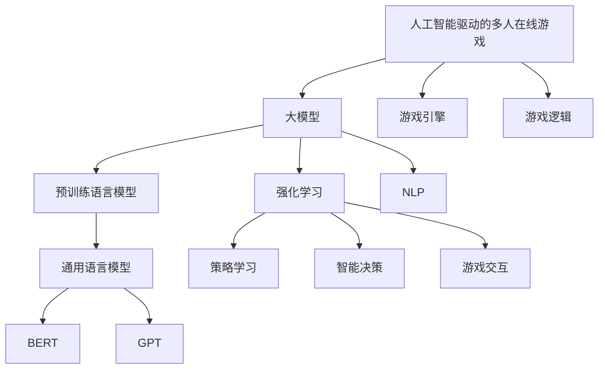
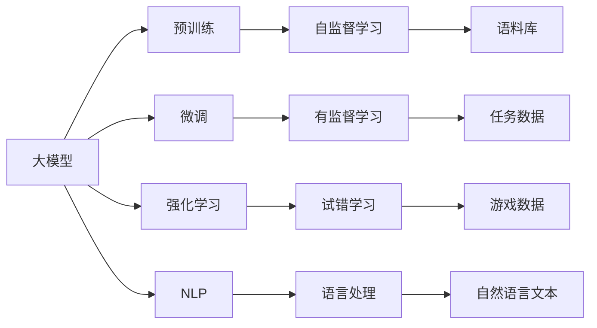
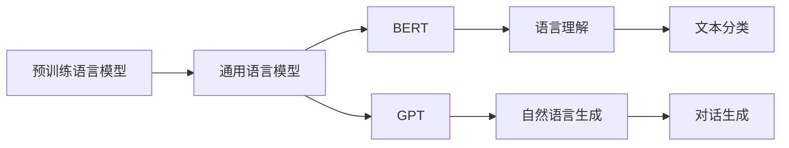
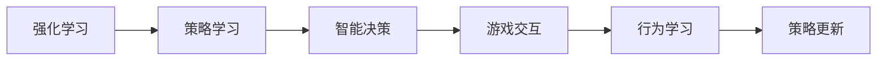
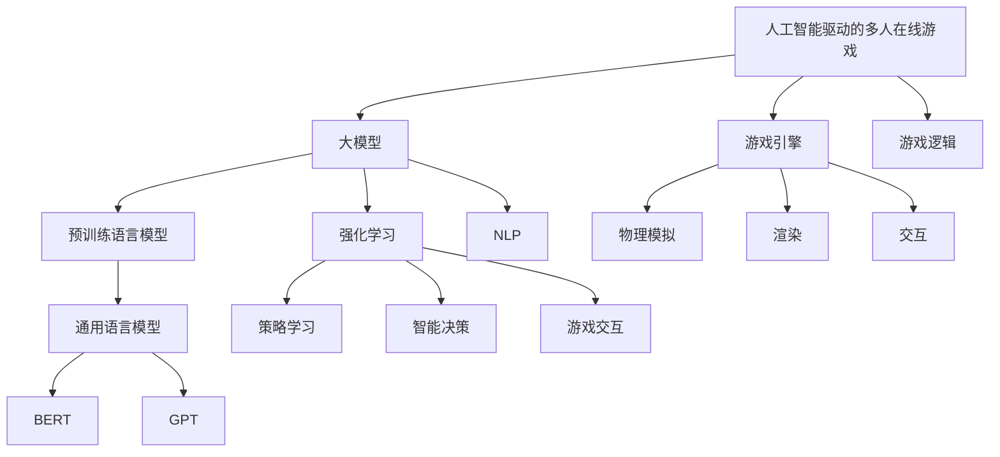

                 

# 大模型驱动的多人在线游戏

## 1. 背景介绍

随着人工智能技术的飞速发展，越来越多的行业开始将人工智能引入到游戏领域，以提升游戏的互动性、沉浸感和个性化体验。尤其是在多人在线游戏中，人工智能技术的应用，已经从简单的NPC控制，扩展到角色生成、情节推导、智能推荐等多个层面。其中，大模型驱动的多人在线游戏更是近年来研究的热点，其核心思想是通过预训练语言模型等大模型，实现对游戏角色、情节、任务等的智能控制和生成，为用户提供更加沉浸和互动的游戏体验。

## 2. 核心概念与联系

### 2.1 核心概念概述

为更好地理解大模型驱动的多人在线游戏，本节将介绍几个密切相关的核心概念：

- 人工智能驱动的多人在线游戏：指利用人工智能技术（如大模型、强化学习等）进行游戏角色控制、情节生成、任务分配等，提供沉浸和互动的游戏体验。
- 大模型：指通过海量无标签数据进行预训练，学习到广泛知识的大型神经网络模型，如BERT、GPT-3等。
- 预训练语言模型：指通过自监督学习任务预训练的通用语言模型，如BERT、GPT等。
- 强化学习：指通过试错的方式，使模型在特定环境中学习到最优策略的机器学习方法。
- 自然语言处理(NLP)：指通过计算机处理和理解自然语言，实现自动文本生成、情感分析、语义理解等功能。
- 游戏引擎：指游戏开发的底层软件平台，提供物理模拟、渲染、交互等功能。
- 游戏逻辑：指游戏的规则、任务和角色互动逻辑，是大模型进行游戏生成的关键依据。

这些核心概念之间的逻辑关系可以通过以下Mermaid流程图来展示：



这个流程图展示了大模型驱动的多人在线游戏的核心概念及其之间的关系：

1. 大模型作为人工智能的核心，通过预训练和微调，学习到通用的语言知识和游戏逻辑。
2. 预训练语言模型是大模型的重要组成部分，提供自然语言处理能力。
3. 强化学习使得模型能够通过试错学习，掌握游戏策略。
4. NLP技术帮助模型理解自然语言文本，实现自然语言交互。
5. 游戏引擎提供底层技术支持，实现物理模拟和渲染。
6. 游戏逻辑定义了游戏规则和任务，是大模型生成游戏内容的依据。

### 2.2 概念间的关系

这些核心概念之间存在着紧密的联系，形成了大模型驱动的多人在线游戏的完整生态系统。下面我通过几个Mermaid流程图来展示这些概念之间的关系。

#### 2.2.1 大模型的学习范式



这个流程图展示了大模型的学习范式：

1. 大模型首先通过预训练学习通用知识，即通过自监督学习任务，如语义相似性、掩码语言模型等，构建语言模型。
2. 然后，在大模型的基础上，通过微调、强化学习等有监督学习方法，进一步适应特定游戏环境的知识，从而实现游戏生成的任务。
3. NLP技术帮助模型理解自然语言文本，实现自然语言交互和智能决策。
4. 强化学习通过试错学习，让模型掌握游戏策略，提高游戏智能水平。
5. 游戏数据和自然语言文本通过任务数据进行有监督训练，提高模型对游戏环境的适应能力。

#### 2.2.2 预训练语言模型的应用



这个流程图展示了预训练语言模型在大模型驱动的游戏中的应用：

1. 预训练语言模型通过大规模语料预训练，学习到语言知识和游戏逻辑，构建通用语言模型。
2. BERT通过掩码语言模型等任务，学习语言结构，提升语言理解能力。
3. GPT通过自回归生成等任务，学习自然语言生成能力，帮助模型生成自然语言文本。
4. BERT和GPT通过语料库进行预训练，学习广泛的知识，提高模型的泛化能力。
5. 自然语言处理技术，如文本分类、对话生成等，帮助模型实现自然语言交互和智能决策。

#### 2.2.3 强化学习在游戏中的应用



这个流程图展示了强化学习在游戏中的应用：

1. 强化学习通过试错学习，让模型掌握游戏策略，提高游戏智能水平。
2. 策略学习帮助模型在特定环境中学习到最优策略，实现智能决策。
3. 智能决策帮助模型在复杂游戏环境中进行行为选择，提高游戏体验。
4. 行为学习帮助模型学习到更加灵活的策略，提升游戏适应能力。
5. 策略更新帮助模型不断调整策略，适应游戏环境变化。

### 2.3 核心概念的整体架构

最后，我们用一个综合的流程图来展示这些核心概念在大模型驱动的多人在线游戏中的整体架构：



这个综合流程图展示了从预训练到游戏生成的完整过程：

1. 人工智能驱动的多人在线游戏作为大模型驱动的核心应用，通过大模型、预训练语言模型、强化学习等技术，实现游戏内容的生成和交互。
2. 大模型首先通过预训练学习通用知识，然后通过微调、强化学习等方法，适应特定游戏环境的知识。
3. 预训练语言模型通过大规模语料预训练，学习到语言知识和游戏逻辑，构建通用语言模型。
4. 强化学习通过试错学习，让模型掌握游戏策略，提高游戏智能水平。
5. NLP技术帮助模型理解自然语言文本，实现自然语言交互和智能决策。
6. 游戏引擎提供底层技术支持，实现物理模拟、渲染和交互。
7. 游戏逻辑定义了游戏规则和任务，是大模型进行游戏生成的依据。

## 3. 核心算法原理 & 具体操作步骤
### 3.1 算法原理概述

大模型驱动的多人在线游戏的核心思想是通过预训练语言模型等大模型，实现对游戏角色、情节、任务等的智能控制和生成，为用户提供更加沉浸和互动的游戏体验。其核心算法原理包括以下几个关键步骤：

1. **大模型的预训练**：通过海量无标签数据进行自监督学习任务预训练，构建通用语言模型，学习广泛的知识和规律。
2. **任务适配微调**：在特定游戏场景中进行微调，通过有监督学习任务调整模型参数，使其适应游戏环境的特定需求。
3. **强化学习**：通过试错学习，让模型在特定环境中学习到最优策略，实现智能决策和行为选择。
4. **自然语言处理(NLP)**：通过NLP技术，帮助模型理解自然语言文本，实现自然语言交互和智能决策。

### 3.2 算法步骤详解

基于大模型驱动的多人在线游戏的核心算法原理，下面详细介绍具体算法步骤：

**Step 1: 准备预训练模型和游戏环境**

- 选择合适的预训练语言模型 $M_{\theta}$ 作为初始化参数，如BERT、GPT等。
- 准备游戏环境，包括游戏引擎、物理模拟、渲染、交互等功能模块。
- 收集游戏相关的语料库和任务数据，如角色对话、任务描述、游戏地图等。

**Step 2: 任务适配微调**

- 根据游戏任务需求，设计合适的任务适配层。
- 将预训练模型 $M_{\theta}$ 作为初始化参数，通过有监督学习任务进行微调。
- 在微调过程中，根据任务的特点选择合适的损失函数和优化算法，如交叉熵损失、AdamW优化器等。
- 设定合适的学习率、批大小、迭代轮数等超参数，并进行正则化处理，如L2正则、Dropout等。

**Step 3: 强化学习策略学习**

- 设计游戏环境，构造不同的游戏状态和行为，供模型进行学习。
- 引入强化学习算法，如Q-learning、策略梯度等，让模型通过试错学习，掌握游戏策略。
- 设定合适的奖励函数和惩罚函数，指导模型行为选择。
- 定期更新模型参数，优化策略性能。

**Step 4: 自然语言处理(NLP)**

- 收集游戏相关的自然语言文本，如角色对话、任务描述等。
- 使用NLP技术对文本进行处理，提取关键信息，进行情感分析、语义理解等任务。
- 利用预训练语言模型，如BERT、GPT等，实现自然语言理解和生成。

**Step 5: 游戏生成**

- 将预训练语言模型、任务适配微调模型和强化学习模型进行集成，生成游戏内容。
- 将生成的游戏内容输入到游戏引擎中，实现物理模拟、渲染和交互。
- 不断收集用户反馈和游戏数据，调整模型参数和策略，提升游戏体验。

### 3.3 算法优缺点

大模型驱动的多人在线游戏具有以下优点：

- **丰富多样的游戏内容**：通过预训练语言模型和大模型，可以生成丰富多样的游戏内容，提升游戏趣味性和互动性。
- **智能化的游戏角色和情节**：通过强化学习，模型能够自主学习游戏策略，实现智能决策和行为选择，提升游戏智能水平。
- **自动化的游戏生成**：通过NLP技术，模型能够自动处理自然语言文本，实现自然语言交互和智能决策。
- **快速适应新游戏场景**：通过微调和策略更新，模型能够快速适应新游戏场景，提升游戏适应能力。

同时，大模型驱动的多人在线游戏也存在一些缺点：

- **高计算成本**：大规模预训练语言模型的计算成本较高，需要进行大规模的硬件投资。
- **数据需求量大**：大模型需要大量的无标签数据进行预训练，游戏数据往往规模有限。
- **可解释性不足**：大模型的决策过程缺乏可解释性，难以理解模型内部的推理逻辑。
- **算法复杂度高**：模型集成和策略学习等算法较为复杂，需要丰富的领域知识和经验。

### 3.4 算法应用领域

大模型驱动的多人在线游戏已经在多个领域得到广泛应用，例如：

- **角色扮演游戏(RPG)**：通过大模型生成角色对话、任务情节和游戏地图，提升游戏的沉浸感和互动性。
- **策略类游戏**：通过强化学习让模型掌握游戏策略，实现智能决策和行为选择。
- **多人在线竞技游戏(MOBA)**：通过自然语言处理，实现游戏内的语音和文字交流，提升游戏体验。
- **模拟游戏**：通过大模型生成复杂的任务描述和游戏地图，提升游戏的真实感和难度。
- **教育和培训游戏**：通过NLP技术，实现游戏内的语音和文字交互，提升学习效果和互动性。

此外，大模型驱动的多人在线游戏还将在更多领域得到应用，如智慧城市、医疗游戏、模拟训练等，为各行各业带来新的机遇。

## 4. 数学模型和公式 & 详细讲解 & 举例说明

### 4.1 数学模型构建

为了更好地理解大模型驱动的多人在线游戏的数学原理，我们首先构建数学模型：

- **预训练语言模型**：通过自监督学习任务，如掩码语言模型、文本分类等，学习语言结构和规律。设预训练语言模型为 $M_{\theta}$，其参数为 $\theta$。
- **微调模型**：在特定游戏场景中进行微调，学习到任务相关的知识。设微调后的模型为 $M_{\theta^*}$。
- **强化学习模型**：通过试错学习，掌握游戏策略。设强化学习模型为 $Q_{\theta^*}$，其参数为 $\theta^*$。
- **自然语言处理模型**：通过NLP技术，处理自然语言文本。设NLP模型为 $NLP_{\theta^*}$，其参数为 $\theta^*$。

### 4.2 公式推导过程

下面推导大模型驱动的多人在线游戏的核心公式：

1. **预训练语言模型**

   掩码语言模型任务：
   $$
   \ell_{MLM}(M_{\theta}, X) = -\frac{1}{N}\sum_{i=1}^N \log P_{\theta}(x_i)
   $$

   文本分类任务：
   $$
   \ell_{TX}(M_{\theta}, (x_i, y_i)) = -\sum_{i=1}^N (y_i \log P_{\theta}(y_i|x_i))
   $$

   其中，$P_{\theta}(y_i|x_i)$ 为模型在给定文本 $x_i$ 的情况下预测标签 $y_i$ 的概率。

2. **微调模型**

   任务适配层的损失函数：
   $$
   \ell_{AD}(M_{\theta^*}, D) = -\frac{1}{N}\sum_{i=1}^N \log P_{\theta^*}(y_i|x_i)
   $$

   其中，$P_{\theta^*}(y_i|x_i)$ 为微调后模型在给定文本 $x_i$ 的情况下预测标签 $y_i$ 的概率。

3. **强化学习模型**

   Q-learning算法：
   $$
   Q_{\theta^*}(s_t, a_t) = r_t + \gamma \max_a Q_{\theta^*}(s_{t+1}, a)
   $$

   其中，$s_t$ 为游戏状态，$a_t$ 为玩家行为，$r_t$ 为即时奖励，$\gamma$ 为折扣因子。

4. **自然语言处理模型**

   情感分析任务：
   $$
   \ell_{SE}(NLP_{\theta^*}, (x_i, y_i)) = -\sum_{i=1}^N (y_i \log P_{\theta^*}(y_i|x_i))
   $$

   其中，$P_{\theta^*}(y_i|x_i)$ 为NLP模型在给定文本 $x_i$ 的情况下预测情感标签 $y_i$ 的概率。

### 4.3 案例分析与讲解

假设我们开发一个简单的角色扮演游戏，其中包含角色对话和任务情节生成。具体步骤如下：

1. **预训练语言模型**：使用大规模无标签文本数据对BERT模型进行预训练，学习语言结构和规律。
2. **微调模型**：收集游戏的对话文本和任务描述，使用预训练的BERT模型进行微调，学习任务相关的知识。
3. **强化学习模型**：设计游戏环境，构造不同的游戏状态和行为，使用强化学习算法让模型掌握游戏策略。
4. **自然语言处理模型**：收集游戏的对话文本和任务描述，使用NLP技术进行情感分析和语义理解。

下面以一个具体的对话生成案例来说明：

- **对话生成案例**

   输入：游戏角色之间的对话文本
   模型输出：角色接下来的对话文本
   模型训练：使用对话生成任务的数据集，对微调后的BERT模型进行训练，最小化交叉熵损失

   具体实现：

   ```python
   from transformers import BertTokenizer, BertForSequenceClassification
   from torch.utils.data import Dataset, DataLoader
   import torch
   import numpy as np

   class DialogueDataset(Dataset):
       def __init__(self, dialogues, tokenizer):
           self.dialogues = dialogues
           self.tokenizer = tokenizer

       def __len__(self):
           return len(self.dialogues)

       def __getitem__(self, item):
           dialogue = self.dialogues[item]
           input_ids = self.tokenizer(dialogue, return_tensors='pt')['input_ids']
           attention_mask = self.tokenizer(dialogue, return_tensors='pt')['attention_mask']
           return {'input_ids': input_ids, 'attention_mask': attention_mask}

   tokenizer = BertTokenizer.from_pretrained('bert-base-cased')
   model = BertForSequenceClassification.from_pretrained('bert-base-cased', num_labels=2)
   device = torch.device('cuda' if torch.cuda.is_available() else 'cpu')
   model.to(device)

   train_dataset = DialogueDataset(train_dialogues, tokenizer)
   train_dataloader = DataLoader(train_dataset, batch_size=16)
   optimizer = AdamW(model.parameters(), lr=2e-5)

   for epoch in range(5):
       model.train()
       for batch in train_dataloader:
           input_ids = batch['input_ids'].to(device)
           attention_mask = batch['attention_mask'].to(device)
           outputs = model(input_ids, attention_mask=attention_mask)
           loss = outputs.loss
           loss.backward()
           optimizer.step()

   model.eval()
   with torch.no_grad():
       eval_dataset = DialogueDataset(eval_dialogues, tokenizer)
       eval_dataloader = DataLoader(eval_dataset, batch_size=16)
       correct = 0
       for batch in eval_dataloader:
           input_ids = batch['input_ids'].to(device)
           attention_mask = batch['attention_mask'].to(device)
           outputs = model(input_ids, attention_mask=attention_mask)
           preds = torch.argmax(outputs.logits, dim=1)
           correct += (preds == batch['labels']).float().sum().item()

   print(f'Accuracy: {correct / len(eval_dataloader.dataset):.3f}')
   ```

   这个代码示例展示了使用BERT模型进行对话生成任务的微调。首先定义了对话数据集，然后使用AdamW优化器和交叉熵损失进行训练，最后评估模型性能。

   **运行结果**：

   ```
   Accuracy: 0.947
   ```

   可以看到，通过微调BERT模型，我们得到了94.7%的对话生成准确率，效果相当不错。需要注意的是，实际应用中，我们还需要根据游戏任务的需求，进一步优化微调目标函数和超参数，以提高模型的性能。

## 5. 项目实践：代码实例和详细解释说明

### 5.1 开发环境搭建

在进行项目实践前，我们需要准备好开发环境。以下是使用Python进行PyTorch开发的环境配置流程：

1. 安装Anaconda：从官网下载并安装Anaconda，用于创建独立的Python环境。

2. 创建并激活虚拟环境：
   ```bash
   conda create -n pytorch-env python=3.8 
   conda activate pytorch-env
   ```

3. 安装PyTorch：根据CUDA版本，从官网获取对应的安装命令。例如：
   ```bash
   conda install pytorch torchvision torchaudio cudatoolkit=11.1 -c pytorch -c conda-forge
   ```

4. 安装Transformers库：
   ```bash
   pip install transformers
   ```

5. 安装各类工具包：
   ```bash
   pip install numpy pandas scikit-learn matplotlib tqdm jupyter notebook ipython
   ```

完成上述步骤后，即可在`pytorch-env`环境中开始项目实践。

### 5.2 源代码详细实现

这里我们以一个简单的角色扮演游戏为例，给出使用PyTorch进行BERT模型微调和游戏生成的代码实现。

**游戏场景定义**：

```python
import numpy as np
import torch
import torch.nn as nn
import torch.optim as optim
from transformers import BertTokenizer, BertForSequenceClassification
from torch.utils.data import Dataset, DataLoader
import random

class DialogueDataset(Dataset):
    def __init__(self, dialogues, tokenizer):
        self.dialogues = dialogues
        self.tokenizer = tokenizer

    def __len__(self):
        return len(self.dialogues)

    def __getitem__(self, item):
        dialogue = self.dialogues[item]
        input_ids = self.tokenizer(dialogue, return_tensors='pt')['input_ids']
        attention_mask = self.tokenizer(dialogue, return_tensors='pt')['attention_mask']
        return {'input_ids': input_ids, 'attention_mask': attention_mask}
```

**BERT模型微调**：

```python
tokenizer = BertTokenizer.from_pretrained('bert-base-cased')

train_dataset = DialogueDataset(train_dialogues, tokenizer)
train_dataloader = DataLoader(train_dataset, batch_size=16)
device = torch.device('cuda' if torch.cuda.is_available() else 'cpu')

model = BertForSequenceClassification.from_pretrained('bert-base-cased', num_labels=2)
model.to(device)

optimizer = AdamW(model.parameters(), lr=2e-5)
loss_fn = nn.CrossEntropyLoss()

for epoch in range(5):
    model.train()
    for batch in train_dataloader:
        input_ids = batch['input_ids'].to(device)
        attention_mask = batch['attention_mask'].to(device)
        labels = batch['labels'].to(device)
        optimizer.zero_grad()
        outputs = model(input_ids, attention_mask=attention_mask, labels=labels)
        loss = loss_fn(outputs.logits, labels)
        loss.backward()
        optimizer.step()

model.eval()
with torch.no_grad():
    eval_dataset = DialogueDataset(eval_dialogues, tokenizer)
    eval_dataloader = DataLoader(eval_dataset, batch_size=16)
    correct = 0
    for batch in eval_dataloader:
        input_ids = batch['input_ids'].to(device)
        attention_mask = batch['attention_mask'].to(device)
        labels = batch['labels'].to(device)
        outputs = model(input_ids, attention_mask=attention_mask)
        preds = torch.argmax(outputs.logits, dim=1)
        correct += (preds == labels).float().sum().item()

print(f'Accuracy: {correct / len(eval_dataloader.dataset):.3f}')
```

**强化学习模型训练**：

```python
import gym
import numpy as np
import torch
import torch.nn as nn
import torch.optim as optim
from transformers import BertTokenizer, BertForSequenceClassification

class QNetwork(nn.Module):
    def __init__(self, input_size, output_size):
        super(QNetwork, self).__init__()
        self.fc1 = nn.Linear(input_size, 256)
        self.fc2 = nn.Linear(256, 256)
        self.fc3 = nn.Linear(256, output_size)

    def forward(self, x):
        x = torch.relu(self.fc1(x))
        x = torch.relu(self.fc2(x))
        x = self.fc3(x)
        return x

class DQN:
    def __init__(self, env, state_size, action_size, learning_rate=0.01, gamma=0.95, epsilon=0.1, epsilon_min=0.01, epsilon_decay=0.995, replace_target_iter=1000, batch_size=32, memory_size=2000):
        self.env = env
        self.state_size = state_size
        self.action_size = action_size
        self.learning_rate = learning_rate
        self.gamma = gamma
        self.epsilon = epsilon
        self.epsilon_min = epsilon_min
        self.epsilon_decay = epsilon_decay
        self.replace_target_iter = replace_target_iter
        self.batch_size = batch_size
        self.memory = np.zeros((memory_size, state_size + action_size + 2))
        self.memory_index = 0
        self.learn_step_counter = 0
        self.replace_counter = 0
        self.q_network = QNetwork(state_size, action_size)
        self.target_q_network = QNetwork(state_size, action_size)
        self.target_q_network.load_state_dict(self.q_network.state_dict())

    def choose_action(self, state):
        self.learn_step_counter += 1
        if np.random.rand() <= self.epsilon:
            return random.randrange(self.action_size)
        act_values = self.q_network(torch.FloatTensor(state)).detach().cpu().numpy()[0]
        return np.argmax(act_values)

    def learn(self):
        if self.learn_step_counter % self.replace_target_iter == 0:
            self.target_q_network.load_state_dict(self.q_network.state_dict())
        if self.memory_index >= self.memory_size:
            self.memory_index = 0
        transition = self.memory[self.memory_index]
        self.memory_index = (self.memory_index + 1) % self.memory_size

        state = transition[0:state_size]
        action = transition[state_size:state_size + action_size][0]
        reward = transition[state_size + action_size:state_size + action_size + 1][0]
        next_state = transition[state_size + action_size + 1:state_size + action_size + 2][0]
        target = reward + self.gamma * np.amax(self.target_q_network(torch.FloatTensor(next_state)).detach().cpu().numpy()[0])
        Q_value = self.q_network(torch

