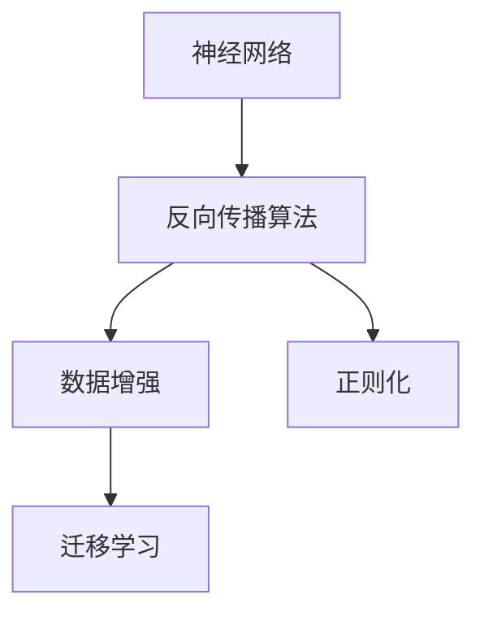

                 

# 大模型：引领科技革命的核心力量

大模型正逐渐成为现代科技革命的核心力量。它们在各行各业中展现出的强大能力和潜力，促使我们深入探索其原理、优势与应用场景，助力未来科技发展。

## 1. 背景介绍

### 1.1 问题由来

现代科技革命正以前所未有的速度重塑世界。而大模型，即深度神经网络中包含亿万个参数的模型，正成为这一革命的重要推动力。它们在多个领域，包括计算机视觉、自然语言处理、语音识别等，展现出惊人的效果。然而，大模型的强大能力背后，是其复杂的原理和算法，需要深入理解。

### 1.2 问题核心关键点

大模型的核心在于其巨大的参数量，使其能够捕捉和表达复杂、非线性的关系。其基本原理包括：

- **神经网络结构**：包含多层感知器、卷积神经网络等，其中多层感知器在深度学习中应用最广。
- **反向传播算法**：通过链式法则反向传播损失函数，更新模型参数，使模型能够学习输入与输出之间的映射关系。
- **数据增强**：通过对数据进行旋转、缩放、翻转等操作，增加数据的多样性，减少模型过拟合。
- **正则化技术**：如L2正则、Dropout、Early Stopping等，防止模型过拟合。
- **迁移学习**：利用预训练模型在大规模数据上学习到的特征，在小规模数据上进行微调，提升模型性能。

这些核心概念共同构成了大模型的工作原理和优势。通过深入理解这些关键点，我们能够更好地应用和优化大模型。

## 2. 核心概念与联系

### 2.1 核心概念概述

为更好地理解大模型的原理，本节将介绍几个密切相关的核心概念：

- **神经网络**：由大量的人工神经元通过连接构成，用于模拟人脑的计算过程。
- **反向传播算法**：用于训练神经网络的算法，通过链式法则计算梯度，更新模型参数。
- **数据增强**：通过对训练数据进行变换，增加数据的多样性，提高模型的鲁棒性。
- **正则化**：防止模型过拟合，包括L2正则、Dropout等。
- **迁移学习**：在大规模数据上预训练模型，在小规模数据上微调，提升模型性能。

这些核心概念之间有着密切的联系，构成了一个完整的大模型训练和应用生态系统。

### 2.2 概念间的关系

这些核心概念之间的逻辑关系可以通过以下Mermaid流程图来展示：



这个流程图展示了神经网络、反向传播算法、数据增强和正则化等核心概念之间的关系：

1. 神经网络通过反向传播算法进行训练，学习输入与输出之间的映射关系。
2. 数据增强和正则化技术用于提高模型的鲁棒性和泛化能力，防止过拟合。
3. 迁移学习则在大规模数据上预训练模型，在小规模数据上微调，提升模型性能。

这些概念共同构成了大模型的训练和应用框架，使其能够在各种场景下发挥强大的学习能力。

## 3. 核心算法原理 & 具体操作步骤

### 3.1 算法原理概述

大模型的训练主要基于反向传播算法和梯度下降等优化算法。其基本流程如下：

1. 初始化模型参数。
2. 通过前向传播计算模型输出与真实标签之间的损失函数。
3. 通过反向传播计算损失函数对模型参数的梯度。
4. 使用优化算法（如梯度下降）更新模型参数，最小化损失函数。

这一过程不断迭代，直到模型收敛或达到预设的停止条件。

### 3.2 算法步骤详解

大模型的训练可以分为以下几个步骤：

**Step 1: 准备数据集**

- 收集和预处理训练数据集。
- 将数据集划分为训练集、验证集和测试集。

**Step 2: 定义模型**

- 选择合适的神经网络结构，如卷积神经网络、循环神经网络等。
- 定义损失函数和优化算法。

**Step 3: 训练模型**

- 初始化模型参数。
- 使用反向传播算法和优化算法更新模型参数。
- 周期性在验证集上评估模型性能，防止过拟合。

**Step 4: 测试模型**

- 在测试集上评估模型性能。
- 使用测试集评估模型的泛化能力。

**Step 5: 应用模型**

- 将训练好的模型应用于实际问题中，进行预测或分类。

### 3.3 算法优缺点

大模型的优点包括：

- **强大的学习能力**：由于参数量巨大，能够捕捉复杂非线性关系。
- **泛化能力**：在大规模数据上预训练，在小规模数据上微调，能够有效避免过拟合。
- **可扩展性**：模块化设计，方便添加新的层和节点。

缺点包括：

- **计算资源需求高**：需要高性能计算资源进行训练和推理。
- **模型复杂性高**：模型结构复杂，难以理解和调试。
- **解释性差**：黑盒模型，难以解释其内部决策逻辑。

### 3.4 算法应用领域

大模型的应用领域广泛，包括：

- **计算机视觉**：如图像分类、目标检测、图像生成等。
- **自然语言处理**：如语言模型、文本分类、机器翻译等。
- **语音识别**：如自动语音识别、语音合成等。
- **推荐系统**：如个性化推荐、广告推荐等。
- **医疗健康**：如疾病诊断、药物发现等。

## 4. 数学模型和公式 & 详细讲解 & 举例说明

### 4.1 数学模型构建

定义神经网络为 $M_{\theta}(x) = \phi(W_\theta \cdot x + b_\theta)$，其中 $\theta$ 为模型参数，$x$ 为输入，$W_\theta$ 和 $b_\theta$ 为权重和偏置。

定义损失函数为 $\mathcal{L}(\theta) = \frac{1}{N}\sum_{i=1}^N \ell(M_{\theta}(x_i), y_i)$，其中 $\ell$ 为损失函数，$y_i$ 为真实标签。

定义优化算法为 $\nabla_{\theta}\mathcal{L}(\theta) = 0$，求解得到最优参数 $\theta^*$。

### 4.2 公式推导过程

以二分类任务为例，定义损失函数为交叉熵损失函数：

$$
\ell(y, \hat{y}) = -[y\log \hat{y} + (1-y)\log(1-\hat{y})]
$$

在模型输出为 $\hat{y}$ 的情况下，将其代入损失函数：

$$
\mathcal{L}(\theta) = -\frac{1}{N}\sum_{i=1}^N [y_i\log M_{\theta}(x_i)+(1-y_i)\log(1-M_{\theta}(x_i))]
$$

通过反向传播算法计算梯度：

$$
\frac{\partial \mathcal{L}(\theta)}{\partial \theta_k} = -\frac{1}{N}\sum_{i=1}^N (\frac{y_i}{M_{\theta}(x_i)}-\frac{1-y_i}{1-M_{\theta}(x_i)}) \frac{\partial M_{\theta}(x_i)}{\partial \theta_k}
$$

其中 $\frac{\partial M_{\theta}(x_i)}{\partial \theta_k}$ 为模型对输入的梯度，可通过自动微分技术计算。

### 4.3 案例分析与讲解

以手写数字识别为例，使用LeNet-5模型在MNIST数据集上进行训练和测试：

```python
import torch
import torch.nn as nn
import torch.optim as optim
from torchvision import datasets, transforms

# 定义模型
class LeNet(nn.Module):
    def __init__(self):
        super(LeNet, self).__init__()
        self.conv1 = nn.Conv2d(1, 6, 5)
        self.conv2 = nn.Conv2d(6, 16, 5)
        self.fc1 = nn.Linear(16 * 5 * 5, 120)
        self.fc2 = nn.Linear(120, 84)
        self.fc3 = nn.Linear(84, 10)
        
    def forward(self, x):
        x = nn.functional.relu(nn.functional.max_pool2d(nn.functional.relu(self.conv1(x)), 2))
        x = nn.functional.relu(nn.functional.max_pool2d(nn.functional.relu(self.conv2(x)), 2))
        x = x.view(-1, 16 * 5 * 5)
        x = nn.functional.relu(self.fc1(x))
        x = nn.functional.relu(self.fc2(x))
        x = self.fc3(x)
        return x

# 准备数据集
train_dataset = datasets.MNIST(root='./data', train=True, transform=transforms.ToTensor(), download=True)
test_dataset = datasets.MNIST(root='./data', train=False, transform=transforms.ToTensor(), download=True)

# 定义损失函数和优化器
model = LeNet()
criterion = nn.CrossEntropyLoss()
optimizer = optim.SGD(model.parameters(), lr=0.01, momentum=0.5)

# 训练模型
for epoch in range(10):
    running_loss = 0.0
    for i, data in enumerate(train_loader, 0):
        inputs, labels = data
        optimizer.zero_grad()
        outputs = model(inputs)
        loss = criterion(outputs, labels)
        loss.backward()
        optimizer.step()
        running_loss += loss.item()
    print('Epoch %d loss: %.3f' % (epoch+1, running_loss/len(train_loader)))

# 测试模型
correct = 0
total = 0
with torch.no_grad():
    for data in test_loader:
        images, labels = data
        outputs = model(images)
        _, predicted = torch.max(outputs.data, 1)
        total += labels.size(0)
        correct += (predicted == labels).sum().item()
print('Accuracy: %.2f %%' % (100 * correct / total))
```

以上代码展示了LeNet模型在MNIST数据集上的训练和测试过程，包括模型的定义、损失函数和优化器的设置、训练和测试的循环等。通过这段代码，我们可以看到大模型的训练和应用流程。

## 5. 项目实践：代码实例和详细解释说明

### 5.1 开发环境搭建

在进行大模型项目实践前，需要准备好开发环境。以下是使用Python进行TensorFlow开发的环境配置流程：

1. 安装Anaconda：从官网下载并安装Anaconda，用于创建独立的Python环境。

2. 创建并激活虚拟环境：
```bash
conda create -n tf-env python=3.8 
conda activate tf-env
```

3. 安装TensorFlow：根据CUDA版本，从官网获取对应的安装命令。例如：
```bash
conda install tensorflow -c tf -c conda-forge
```

4. 安装各类工具包：
```bash
pip install numpy pandas scikit-learn matplotlib tqdm jupyter notebook ipython
```

完成上述步骤后，即可在`tf-env`环境中开始大模型项目实践。

### 5.2 源代码详细实现

下面以手写数字识别为例，给出使用TensorFlow对LeNet模型进行训练和测试的代码实现。

首先，定义模型和损失函数：

```python
import tensorflow as tf

class LeNet(tf.keras.Model):
    def __init__(self):
        super(LeNet, self).__init__()
        self.conv1 = tf.keras.layers.Conv2D(6, 5, activation='relu')
        self.pool1 = tf.keras.layers.MaxPooling2D(2, 2)
        self.conv2 = tf.keras.layers.Conv2D(16, 5, activation='relu')
        self.pool2 = tf.keras.layers.MaxPooling2D(2, 2)
        self.fc1 = tf.keras.layers.Flatten()
        self.fc2 = tf.keras.layers.Dense(120, activation='relu')
        self.fc3 = tf.keras.layers.Dense(10)

    def call(self, x):
        x = self.conv1(x)
        x = self.pool1(x)
        x = self.conv2(x)
        x = self.pool2(x)
        x = self.fc1(x)
        x = self.fc2(x)
        return self.fc3(x)

model = LeNet()

loss_object = tf.keras.losses.SparseCategoricalCrossentropy(from_logits=True)
optimizer = tf.keras.optimizers.SGD(learning_rate=0.01)

```

然后，定义训练和评估函数：

```python
def train_step(images, labels):
    with tf.GradientTape() as tape:
        predictions = model(images, training=True)
        loss = loss_object(labels, predictions)
    gradients = tape.gradient(loss, model.trainable_variables)
    optimizer.apply_gradients(zip(gradients, model.trainable_variables))

def evaluate_step(images, labels):
    predictions = model(images, training=False)
    correct_predictions = tf.equal(tf.argmax(predictions, 1), labels)
    accuracy = tf.reduce_mean(tf.cast(correct_predictions, tf.float32))
    return accuracy

```

最后，启动训练流程并在测试集上评估：

```python
epochs = 10
batch_size = 64

train_dataset = tf.data.Dataset.from_tensor_slices((train_images, train_labels)).shuffle(60000).batch(batch_size)
test_dataset = tf.data.Dataset.from_tensor_slices((test_images, test_labels)).batch(batch_size)

for epoch in range(epochs):
    for images, labels in train_dataset:
        train_step(images, labels)
    accuracy = evaluate_step(test_images, test_labels)
    print('Epoch {}, Accuracy: {}'.format(epoch+1, accuracy.numpy()))
```

以上就是使用TensorFlow对LeNet模型进行手写数字识别任务训练和测试的完整代码实现。可以看到，TensorFlow的高级API使得模型构建和训练过程非常简洁高效。

### 5.3 代码解读与分析

让我们再详细解读一下关键代码的实现细节：

**LeNet模型定义**：
- `__init__`方法：初始化模型各层结构。
- `call`方法：定义模型的前向传播过程。

**训练函数**：
- `train_step`方法：在训练集上进行梯度计算和参数更新。

**评估函数**：
- `evaluate_step`方法：在测试集上计算模型的准确率。

**训练流程**：
- 定义总的epoch数和batch size，开始循环迭代
- 每个epoch内，在训练集上进行训练
- 在验证集上评估，输出准确率
- 重复上述过程直至达到预设的迭代轮数。

通过这段代码，我们可以看到大模型的训练和应用流程，并且能够了解TensorFlow在模型构建和训练中的高效性和灵活性。

## 6. 实际应用场景

### 6.1 智能医疗

大模型在智能医疗领域的应用前景广阔。通过分析海量的医疗数据，大模型可以帮助医生诊断疾病、制定治疗方案、预测病情等。例如，使用大模型进行医学图像分析，自动识别和分类肿瘤等病变，为医生提供辅助诊断工具。

### 6.2 自动驾驶

自动驾驶是未来交通的重要方向。大模型通过分析传感器数据和摄像头图像，可以实时感知周围环境，预测车辆行为，从而实现自动驾驶。例如，使用大模型进行交通标志识别、行人检测等任务，提升自动驾驶的安全性和可靠性。

### 6.3 金融预测

金融预测是金融行业的重要应用之一。大模型通过分析历史数据和市场动态，可以预测股票价格、汇率波动等金融指标。例如，使用大模型进行情绪分析，预测市场情绪变化，为投资者提供参考。

### 6.4 未来应用展望

未来，大模型将会在更多领域发挥作用，推动科技革命的深入发展。

- **医疗健康**：在疾病诊断、药物研发等方面发挥更大作用，提升医疗服务的智能化水平。
- **交通运输**：在自动驾驶、智能交通等领域取得更大突破，提升交通系统的安全性和效率。
- **金融科技**：在金融预测、风险管理等方面提供支持，推动金融科技的创新发展。
- **教育培训**：在个性化推荐、智能辅导等方面发挥作用，提升教育培训的效率和质量。

总之，大模型将会在更多领域带来颠覆性变革，推动科技进步和社会发展。

## 7. 工具和资源推荐

### 7.1 学习资源推荐

为了帮助开发者系统掌握大模型的原理和实践，这里推荐一些优质的学习资源：

1. **《深度学习》（Goodfellow等著）**：全面介绍深度学习的基本概念和经典算法，是大模型研究的重要基础。
2. **Coursera深度学习课程**：斯坦福大学开设的深度学习课程，涵盖深度学习的基本理论和实践应用。
3. **DeepLearning.AI深度学习课程**：由Geoffrey Hinton等顶级专家讲授，深入浅出地介绍深度学习理论和技术。
4. **Google AI Blog**：谷歌官方博客，发布深度学习和AI领域的最新研究成果和实践经验。
5. **Kaggle竞赛**：Kaggle是全球知名的数据科学竞赛平台，提供丰富的数据集和挑战，帮助开发者实践和提升技能。

通过这些资源的学习实践，相信你一定能够系统掌握大模型的原理和实践技巧。

### 7.2 开发工具推荐

高效的开发离不开优秀的工具支持。以下是几款用于大模型开发和训练的常用工具：

1. **TensorFlow**：谷歌开源的深度学习框架，支持分布式训练和推理，广泛应用于工业界。
2. **PyTorch**：Facebook开源的深度学习框架，灵活高效，广泛用于研究和应用开发。
3. **MXNet**：由亚马逊开发的深度学习框架，支持多种语言和设备，适用于大规模分布式训练。
4. **Caffe**：由Berkeley开发的深度学习框架，适用于计算机视觉和图像处理任务。

### 7.3 相关论文推荐

大模型的研究涉及多个领域，以下是几篇奠基性的相关论文，推荐阅读：

1. **ImageNet Classification with Deep Convolutional Neural Networks**：AlexNet论文，标志着深度卷积神经网络在计算机视觉领域的突破。
2. **Deep Residual Learning for Image Recognition**：ResNet论文，提出残差网络，解决深度神经网络退化问题。
3. **Attention is All You Need**：Transformer论文，提出自注意力机制，开启大模型时代。
4. **BERT: Pre-training of Deep Bidirectional Transformers for Language Understanding**：BERT论文，提出双向Transformer，刷新多项NLP任务SOTA。
5. **GPT-3: Language Models are Unsupervised Multitask Learners**：GPT-3论文，展示了大规模语言模型的强大零样本学习能力。

这些论文代表了大模型研究的发展脉络，帮助研究者把握学科前进方向，激发更多的创新灵感。

## 8. 总结：未来发展趋势与挑战

### 8.1 总结

本文对大模型的原理、应用和实践进行了全面系统的介绍。首先阐述了大模型的背景和意义，明确了其在计算机视觉、自然语言处理、语音识别等领域的强大能力。其次，从原理到实践，详细讲解了神经网络、反向传播算法、数据增强等核心概念，并给出了详细的代码实例。同时，本文还广泛探讨了大模型的实际应用场景，展示了其广泛的应用前景。

通过本文的系统梳理，可以看到，大模型正逐渐成为现代科技革命的核心力量，在各个领域展现出巨大的潜力。未来，伴随技术的不断进步和应用的深入发展，大模型必将在更多领域大放异彩，为人类社会带来颠覆性的变革。

### 8.2 未来发展趋势

展望未来，大模型的发展将呈现以下几个趋势：

1. **模型规模持续增大**：随着算力成本的下降和数据规模的扩张，大模型的参数量还将持续增长。超大规模模型蕴含的丰富知识，将支持更加复杂和多样化的应用。
2. **模型效率不断提升**：通过模型压缩、稀疏化、硬件加速等技术，大模型的推理速度和内存占用将显著降低，提升实际应用中的性能。
3. **多模态融合加速**：大模型将进一步整合视觉、语音、文本等多种模态的信息，提升其在跨领域任务中的表现。
4. **跨学科融合创新**：大模型将与其他前沿技术（如知识图谱、因果推理、强化学习等）进行深度融合，推动更多创新应用的诞生。

这些趋势凸显了大模型发展的广阔前景，推动其在更多领域取得突破性进展。

### 8.3 面临的挑战

尽管大模型展现出强大的能力，但其发展仍面临诸多挑战：

1. **计算资源需求高**：大模型的训练和推理需要高性能计算资源，如何降低计算成本是一个重要课题。
2. **数据依赖性强**：大模型的性能高度依赖于数据的多样性和规模，如何获取和处理大规模高质量数据是关键。
3. **模型复杂性高**：大模型结构复杂，难以理解和调试，如何提升模型的可解释性和可维护性是亟待解决的问题。
4. **伦理和安全问题**：大模型可能学习到有害或偏见的信息，如何确保模型的安全和伦理可控性是重要挑战。

这些挑战需要研究者持续努力，探索新的方法和技术，推动大模型向更加智能化、普适化方向发展。

### 8.4 研究展望

未来，大模型的研究需要从以下几个方向进行探索和突破：

1. **无监督和半监督学习**：开发无监督和半监督学习算法，减少对标注数据的依赖，推动大模型的普及和应用。
2. **参数高效和计算高效**：开发更加高效的大模型训练方法，提升模型效率和可扩展性。
3. **跨领域知识整合**：将符号化的知识与神经网络进行融合，提升模型的逻辑推理能力和跨领域适应性。
4. **伦理性设计**：在设计大模型时考虑伦理和道德问题，确保模型的公平、透明和可控性。

这些研究方向的探索，必将引领大模型迈向更高的台阶，推动科技革命的深入发展。

## 9. 附录：常见问题与解答

**Q1: 大模型与传统机器学习模型有何不同？**

A: 大模型与传统机器学习模型在结构和训练方法上有显著区别。大模型参数量巨大，能够学习到更加复杂、非线性的关系；而传统机器学习模型参数量较小，只能学习到简单的线性或低阶非线性关系。

**Q2: 大模型的计算资源需求高，如何解决这一问题？**

A: 可以通过模型压缩、稀疏化、硬件加速等技术来降低计算资源需求。例如，使用模型压缩算法对大模型进行剪枝和量化，使用GPU、TPU等高性能设备进行训练和推理。

**Q3: 大模型的可解释性差，如何解决这一问题？**

A: 可以通过可视化工具和解释技术来增强模型的可解释性。例如，使用激活图、注意力机制等技术展示模型内部的计算过程，使用可解释性算法生成模型输出结果的解释。

**Q4: 大模型的伦理和安全问题如何解决？**

A: 可以在模型训练过程中加入伦理导向的评估指标，过滤和惩罚有害的输出倾向。同时加强人工干预和审核，建立模型行为的监管机制，确保输出符合人类价值观和伦理道德。

总之，大模型正逐渐成为现代科技革命的核心力量，其强大的能力和广阔的应用前景值得我们深入研究和探索。未来，伴随技术的不断进步和应用的深入发展，大模型必将在更多领域大放异彩，推动人类社会迈向更加智能化、普适化的未来。

