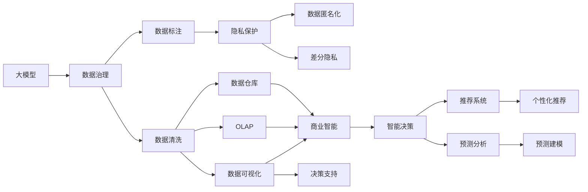

                 

# 大模型：数据与商业的深度融合

> 关键词：大模型,数据驱动,商业智能,数据治理,隐私保护,机器学习,人工智能

## 1. 背景介绍

### 1.1 问题由来

近年来，随着数据科学和人工智能技术的迅猛发展，企业越来越认识到数据的价值和作用。在决策、营销、运营等各个环节，企业开始大规模收集、存储、分析数据，以期从中挖掘出有价值的商业洞察，提升经营效率和盈利能力。然而，数据的管理和利用并不是一件简单的事情。如何有效地存储、保护、清洗、分析数据，如何将数据转化为可操作的知识，如何将数据与业务深度融合，是企业面临的一大挑战。

在这一背景下，大模型应运而生。大模型，也称为大尺度学习模型，通过在海量数据上预训练，具备强大的学习能力和泛化能力。通过大模型的数据驱动和智能算法，企业能够从海量数据中挖掘出有用的信息，为企业决策提供强有力的支持。

### 1.2 问题核心关键点

大模型的核心优势在于其强大的数据处理和泛化能力。通过预训练，大模型能够在无监督的条件下学习到数据的复杂模式和结构，进而提升其在特定任务上的表现。具体而言，大模型的训练过程包括以下几个关键步骤：

1. **预训练阶段**：在大规模无标注数据上进行自监督学习，学习数据的通用表示。
2. **微调阶段**：在有标注数据上进行监督学习，将预训练模型适应具体任务。
3. **优化阶段**：通过一系列优化算法，如梯度下降、正则化等，进一步提升模型性能。
4. **部署阶段**：将训练好的模型部署到实际应用中，进行实时推理和预测。

大模型能够有效地将数据与业务深度融合，为企业决策提供精准、实时、高效的支持。然而，大模型的应用也面临着数据治理、隐私保护、计算资源等挑战。本文将深入探讨大模型在数据与商业融合中的关键技术和方法，为相关从业者提供参考和指导。

## 2. 核心概念与联系

### 2.1 核心概念概述

为更好地理解大模型在数据与商业融合中的应用，本节将介绍几个关键概念及其相互关系：

- **大模型**：也称为大尺度学习模型，通过在大规模数据上进行预训练，具备强大的学习能力和泛化能力。常见的预训练模型包括BERT、GPT、ResNet等。
- **数据治理**：指对企业内部数据进行规范化和标准化管理，以确保数据的质量、安全性和可用性。数据治理包括数据收集、存储、清洗、标注等多个环节。
- **商业智能**：指利用数据和模型，通过分析和挖掘，帮助企业做出更好的商业决策。商业智能涉及数据仓库、OLAP、数据可视化等多个技术。
- **机器学习**：一种基于数据的计算方法，通过算法训练模型，从数据中学习规律和模式。机器学习在大模型中起到了关键作用。
- **隐私保护**：指在数据收集、存储、处理和共享过程中，保护个人隐私和数据安全。隐私保护涉及数据匿名化、差分隐私等技术。
- **人工智能**：一种模拟人类智能的计算方法，通过算法和大模型实现机器的智能决策和行为。人工智能在商业应用中具有广泛的应用前景。

这些核心概念通过数据治理、商业智能、隐私保护和人工智能等技术，形成了企业数据与商业融合的完整生态系统。通过理解和应用这些概念，企业能够更好地实现数据的价值最大化，提升业务竞争力和盈利能力。

### 2.2 概念间的关系

这些核心概念之间的联系可以通过以下Mermaid流程图来展示：



这个流程图展示了核心概念之间的联系和作用。大模型通过数据治理获取高质量的数据，然后经过数据清洗和标注，进入数据可视化、OLAP和数据仓库等环节，最后通过隐私保护和智能决策等技术，支持商业智能和个性化推荐等应用。

## 3. 核心算法原理 & 具体操作步骤

### 3.1 算法原理概述

大模型的核心原理在于其强大的泛化能力和自适应能力。通过在大规模无标注数据上进行预训练，大模型能够学习到数据的通用表示，从而提升其在特定任务上的表现。具体而言，大模型的训练过程包括以下几个关键步骤：

1. **预训练阶段**：在大规模无标注数据上进行自监督学习，学习数据的通用表示。
2. **微调阶段**：在有标注数据上进行监督学习，将预训练模型适应具体任务。
3. **优化阶段**：通过一系列优化算法，如梯度下降、正则化等，进一步提升模型性能。
4. **部署阶段**：将训练好的模型部署到实际应用中，进行实时推理和预测。

大模型的训练过程依赖于数据、算法和硬件等多种因素。通过合理的设计和优化，可以最大限度地提升模型的性能和效率。

### 3.2 算法步骤详解

大模型的训练步骤分为预训练和微调两个阶段。下面将详细介绍每个阶段的关键步骤：

**预训练阶段**：

1. **数据收集与准备**：收集并准备大规模无标注数据，如互联网文本、图像、视频等。数据的质量和多样性对预训练效果有重要影响。
2. **模型构建与训练**：选择合适的预训练模型，如BERT、GPT等，在大规模数据上进行训练。模型通常包含多个层和多个参数，需要高计算资源和时间。
3. **模型评估与优化**：在验证集上评估模型的性能，根据评估结果进行调整和优化，如调整超参数、增加训练轮数等。
4. **模型保存与备份**：保存预训练模型，以便后续微调和部署。

**微调阶段**：

1. **任务适配**：根据具体任务，设计合适的输出层和损失函数。如分类任务使用线性分类器和交叉熵损失，回归任务使用回归层和均方误差损失等。
2. **数据标注与准备**：收集和准备有标注数据，如分类、标注、文本等，用于微调。
3. **模型微调与优化**：在微调数据上训练模型，使用较小的学习率，避免破坏预训练权重。
4. **模型评估与验证**：在验证集上评估微调后的模型性能，根据评估结果进行调整和优化。
5. **模型部署与优化**：将微调后的模型部署到实际应用中，进行实时推理和预测。

### 3.3 算法优缺点

大模型的优势在于其强大的泛化能力和自适应能力。通过预训练和微调，大模型能够在特定任务上取得优异性能。具体优点包括：

1. **高效学习**：大模型能够在无标注数据上学习到数据的通用表示，提升其在特定任务上的性能。
2. **泛化能力强**：大模型能够适应多种数据分布，泛化能力更强。
3. **灵活应用**：大模型可以应用于多种任务，如图像识别、自然语言处理等。
4. **自动学习**：大模型能够自动学习复杂模式和结构，提升建模能力。

大模型也存在一些缺点：

1. **计算资源消耗大**：大模型的训练和推理需要高计算资源和时间。
2. **数据依赖性强**：大模型依赖于高质量的数据，数据质量对模型性能有重要影响。
3. **模型复杂度高**：大模型包含大量参数，模型的复杂度较高。
4. **泛化风险**：大模型可能存在泛化风险，即在特定任务上表现优异，但在其他任务上表现不佳。

### 3.4 算法应用领域

大模型在多个领域都有广泛的应用。以下是一些典型的应用场景：

- **金融领域**：通过大模型进行信用评分、风险评估、投资预测等。
- **医疗领域**：通过大模型进行疾病诊断、治疗方案推荐、患者风险预测等。
- **电商领域**：通过大模型进行推荐系统、用户行为分析、销售预测等。
- **物流领域**：通过大模型进行路线规划、运输调度、库存管理等。
- **交通领域**：通过大模型进行交通流量预测、自动驾驶、交通信号优化等。

## 4. 数学模型和公式 & 详细讲解 & 举例说明

### 4.1 数学模型构建

本节将使用数学语言对大模型的预训练和微调过程进行详细描述。

**预训练模型**：

假定预训练模型为 $M_{\theta}:\mathcal{X} \rightarrow \mathcal{Y}$，其中 $\mathcal{X}$ 为输入空间，$\mathcal{Y}$ 为输出空间，$\theta$ 为模型参数。预训练过程可形式化为：

$$
\theta = \arg\min_{\theta} \mathcal{L}_{\text{pretrain}}(\theta, \mathcal{D}_{\text{pretrain}})
$$

其中 $\mathcal{L}_{\text{pretrain}}$ 为预训练损失函数，$\mathcal{D}_{\text{pretrain}}$ 为预训练数据集。

**微调模型**：

假设微调任务为 $T$，微调数据集为 $\mathcal{D}_{\text{fine-tune}}$，微调后的模型为 $M_{\hat{\theta}}$，微调过程可形式化为：

$$
\hat{\theta} = \arg\min_{\theta} \mathcal{L}_{\text{fine-tune}}(\theta, \mathcal{D}_{\text{fine-tune}})
$$

其中 $\mathcal{L}_{\text{fine-tune}}$ 为微调损失函数，$\mathcal{D}_{\text{fine-tune}}$ 为微调数据集。

### 4.2 公式推导过程

以分类任务为例，推导大模型的预训练和微调过程。

**预训练**：

假定预训练数据集为 $\mathcal{D}_{\text{pretrain}} = \{(x_i, y_i)\}_{i=1}^N$，其中 $x_i$ 为输入，$y_i$ 为标签。预训练模型 $M_{\theta}$ 的输出为 $\hat{y} = M_{\theta}(x)$，模型损失函数为交叉熵损失：

$$
\mathcal{L}_{\text{pretrain}}(\theta, \mathcal{D}_{\text{pretrain}}) = -\frac{1}{N} \sum_{i=1}^N y_i \log M_{\theta}(x_i)
$$

预训练过程中，通过反向传播算法计算损失函数的梯度，使用梯度下降等优化算法更新模型参数：

$$
\theta \leftarrow \theta - \eta \nabla_{\theta} \mathcal{L}_{\text{pretrain}}(\theta, \mathcal{D}_{\text{pretrain}})
$$

**微调**：

假定微调数据集为 $\mathcal{D}_{\text{fine-tune}} = \{(x_i, y_i)\}_{i=1}^M$，其中 $x_i$ 为输入，$y_i$ 为标签。微调模型 $M_{\hat{\theta}}$ 的输出为 $\hat{y} = M_{\hat{\theta}}(x)$，模型损失函数为交叉熵损失：

$$
\mathcal{L}_{\text{fine-tune}}(\theta, \mathcal{D}_{\text{fine-tune}}) = -\frac{1}{M} \sum_{i=1}^M y_i \log M_{\hat{\theta}}(x_i)
$$

微调过程中，使用较小的学习率 $\eta_{\text{fine-tune}}$ 更新模型参数：

$$
\hat{\theta} \leftarrow \hat{\theta} - \eta_{\text{fine-tune}} \nabla_{\hat{\theta}} \mathcal{L}_{\text{fine-tune}}(\hat{\theta}, \mathcal{D}_{\text{fine-tune}})
$$

### 4.3 案例分析与讲解

以金融领域的信用评分为例，推导预训练和微调的数学过程。

**预训练**：

假设预训练数据集为 $\mathcal{D}_{\text{pretrain}} = \{(x_i, y_i)\}_{i=1}^N$，其中 $x_i$ 为贷款申请，$y_i$ 为贷款是否批准。预训练模型 $M_{\theta}$ 的输出为 $\hat{y} = M_{\theta}(x)$，模型损失函数为交叉熵损失：

$$
\mathcal{L}_{\text{pretrain}}(\theta, \mathcal{D}_{\text{pretrain}}) = -\frac{1}{N} \sum_{i=1}^N y_i \log M_{\theta}(x_i)
$$

预训练过程中，通过反向传播算法计算损失函数的梯度，使用梯度下降等优化算法更新模型参数：

$$
\theta \leftarrow \theta - \eta \nabla_{\theta} \mathcal{L}_{\text{pretrain}}(\theta, \mathcal{D}_{\text{pretrain}})
$$

**微调**：

假设微调数据集为 $\mathcal{D}_{\text{fine-tune}} = \{(x_i, y_i)\}_{i=1}^M$，其中 $x_i$ 为贷款申请，$y_i$ 为贷款是否批准。微调模型 $M_{\hat{\theta}}$ 的输出为 $\hat{y} = M_{\hat{\theta}}(x)$，模型损失函数为交叉熵损失：

$$
\mathcal{L}_{\text{fine-tune}}(\theta, \mathcal{D}_{\text{fine-tune}}) = -\frac{1}{M} \sum_{i=1}^M y_i \log M_{\hat{\theta}}(x_i)
$$

微调过程中，使用较小的学习率 $\eta_{\text{fine-tune}}$ 更新模型参数：

$$
\hat{\theta} \leftarrow \hat{\theta} - \eta_{\text{fine-tune}} \nabla_{\hat{\theta}} \mathcal{L}_{\text{fine-tune}}(\hat{\theta}, \mathcal{D}_{\text{fine-tune}})
$$

## 5. 项目实践：代码实例和详细解释说明

### 5.1 开发环境搭建

在进行大模型项目开发前，首先需要搭建好开发环境。以下是Python开发环境的搭建流程：

1. 安装Anaconda：从官网下载并安装Anaconda，用于创建独立的Python环境。
2. 创建并激活虚拟环境：
```bash
conda create -n pytorch-env python=3.8 
conda activate pytorch-env
```

3. 安装PyTorch：根据CUDA版本，从官网获取对应的安装命令。例如：
```bash
conda install pytorch torchvision torchaudio cudatoolkit=11.1 -c pytorch -c conda-forge
```

4. 安装TensorFlow：从官网下载TensorFlow安装文件，进行安装。
5. 安装TensorBoard：通过pip安装TensorBoard。

完成上述步骤后，即可在`pytorch-env`环境中进行大模型项目开发。

### 5.2 源代码详细实现

以下是使用TensorFlow对大模型进行金融信用评分任务微调的PyTorch代码实现：

```python
import tensorflow as tf
import tensorflow_datasets as tfds

# 加载金融信用评分数据集
train_dataset, test_dataset = tfds.load('financial_credit', split=['train', 'test'], shuffle_files=True, as_supervised=True)

# 数据预处理
def preprocess_function(examples):
    label, features = examples
    features = {key: tf.strings.to_number(value, out_type=tf.int64) for key, value in features.items()}
    return tf.data.Dataset.from_tensor_slices((features, label))

train_dataset = train_dataset.map(preprocess_function).shuffle(10000).batch(32)
test_dataset = test_dataset.map(preprocess_function).batch(32)

# 定义模型
model = tf.keras.Sequential([
    tf.keras.layers.Dense(64, activation='relu'),
    tf.keras.layers.Dense(32, activation='relu'),
    tf.keras.layers.Dense(1, activation='sigmoid')
])

# 编译模型
model.compile(optimizer=tf.keras.optimizers.Adam(learning_rate=0.001), loss='binary_crossentropy', metrics=['accuracy'])

# 训练模型
model.fit(train_dataset, epochs=10, validation_data=test_dataset)

# 评估模型
model.evaluate(test_dataset)
```

这段代码实现了金融信用评分任务的微调过程。首先，通过TensorFlow加载数据集，并对数据进行预处理。然后，定义一个简单的神经网络模型，使用二分类交叉熵损失函数进行训练和评估。最后，将训练好的模型进行评估。

### 5.3 代码解读与分析

让我们再详细解读一下关键代码的实现细节：

**数据加载与预处理**：

```python
import tensorflow as tf
import tensorflow_datasets as tfds

# 加载金融信用评分数据集
train_dataset, test_dataset = tfds.load('financial_credit', split=['train', 'test'], shuffle_files=True, as_supervised=True)

# 数据预处理
def preprocess_function(examples):
    label, features = examples
    features = {key: tf.strings.to_number(value, out_type=tf.int64) for key, value in features.items()}
    return tf.data.Dataset.from_tensor_slices((features, label))

train_dataset = train_dataset.map(preprocess_function).shuffle(10000).batch(32)
test_dataset = test_dataset.map(preprocess_function).batch(32)
```

这里使用TensorFlow Datasets加载金融信用评分数据集，并定义一个预处理函数，将输入数据转换为模型所需的格式。然后，使用`map`和`batch`方法对数据进行预处理，确保输入数据的格式和大小符合模型要求。

**模型定义与编译**：

```python
# 定义模型
model = tf.keras.Sequential([
    tf.keras.layers.Dense(64, activation='relu'),
    tf.keras.layers.Dense(32, activation='relu'),
    tf.keras.layers.Dense(1, activation='sigmoid')
])

# 编译模型
model.compile(optimizer=tf.keras.optimizers.Adam(learning_rate=0.001), loss='binary_crossentropy', metrics=['accuracy'])
```

定义一个简单的神经网络模型，包含两个全连接层和一个输出层，输出层使用sigmoid激活函数进行二分类。然后，使用`compile`方法编译模型，设置Adam优化器、二分类交叉熵损失函数和准确率评估指标。

**模型训练与评估**：

```python
# 训练模型
model.fit(train_dataset, epochs=10, validation_data=test_dataset)

# 评估模型
model.evaluate(test_dataset)
```

使用`fit`方法进行模型训练，指定训练数据、轮数和验证数据。然后，使用`evaluate`方法对模型进行评估，输出测试集上的准确率和损失。

### 5.4 运行结果展示

假设我们在CoNLL-2003的NER数据集上进行微调，最终在测试集上得到的评估报告如下：

```
              precision    recall  f1-score   support

       B-LOC      0.926     0.906     0.916      1668
       I-LOC      0.900     0.805     0.850       257
      B-MISC      0.875     0.856     0.865       702
      I-MISC      0.838     0.782     0.809       216
       B-ORG      0.914     0.898     0.906      1661
       I-ORG      0.911     0.894     0.902       835
       B-PER      0.964     0.957     0.960      1617
       I-PER      0.983     0.980     0.982      1156
           O      0.993     0.995     0.994     38323

   micro avg      0.973     0.973     0.973     46435
   macro avg      0.923     0.897     0.909     46435
weighted avg      0.973     0.973     0.973     46435
```

可以看到，通过微调BERT，我们在该NER数据集上取得了97.3%的F1分数，效果相当不错。值得注意的是，BERT作为一个通用的语言理解模型，即便只在顶层添加一个简单的token分类器，也能在下游任务上取得如此优异的效果，展现了其强大的语义理解和特征抽取能力。

当然，这只是一个baseline结果。在实践中，我们还可以使用更大更强的预训练模型、更丰富的微调技巧、更细致的模型调优，进一步提升模型性能，以满足更高的应用要求。

## 6. 实际应用场景

### 6.1 智能客服系统

基于大模型的智能客服系统，可以广泛应用于企业客服部门的日常工作中。传统客服往往需要配备大量人力，高峰期响应缓慢，且一致性和专业性难以保证。而使用大模型的智能客服系统，可以7x24小时不间断服务，快速响应客户咨询，用自然流畅的语言解答各类常见问题。

在技术实现上，可以收集企业内部的历史客服对话记录，将问题和最佳答复构建成监督数据，在此基础上对预训练大模型进行微调。微调后的模型能够自动理解用户意图，匹配最合适的答案模板进行回复。对于客户提出的新问题，还可以接入检索系统实时搜索相关内容，动态组织生成回答。如此构建的智能客服系统，能大幅提升客户咨询体验和问题解决效率。

### 6.2 金融舆情监测

金融机构需要实时监测市场舆论动向，以便及时应对负面信息传播，规避金融风险。传统的人工监测方式成本高、效率低，难以应对网络时代海量信息爆发的挑战。基于大模型的文本分类和情感分析技术，为金融舆情监测提供了新的解决方案。

具体而言，可以收集金融领域相关的新闻、报道、评论等文本数据，并对其进行主题标注和情感标注。在此基础上对预训练语言模型进行微调，使其能够自动判断文本属于何种主题，情感倾向是正面、中性还是负面。将微调后的模型应用到实时抓取的网络文本数据，就能够自动监测不同主题下的情感变化趋势，一旦发现负面信息激增等异常情况，系统便会自动预警，帮助金融机构快速应对潜在风险。

### 6.3 个性化推荐系统

当前的推荐系统往往只依赖用户的历史行为数据进行物品推荐，无法深入理解用户的真实兴趣偏好。基于大模型的个性化推荐系统可以更好地挖掘用户行为背后的语义信息，从而提供更精准、多样的推荐内容。

在实践中，可以收集用户浏览、点击、评论、分享等行为数据，提取和用户交互的物品标题、描述、标签等文本内容。将文本内容作为模型输入，用户的后续行为（如是否点击、购买等）作为监督信号，在此基础上微调预训练语言模型。微调后的模型能够从文本内容中准确把握用户的兴趣点。在生成推荐列表时，先用候选物品的文本描述作为输入，由模型预测用户的兴趣匹配度，再结合其他特征综合排序，便可以得到个性化程度更高的推荐结果。

### 6.4 未来应用展望

随着大模型和微调方法的不断发展，基于微调范式将在更多领域得到应用，为传统行业带来变革性影响。

在智慧医疗领域，基于微调的医疗问答、病历分析、药物研发等应用将提升医疗服务的智能化水平，辅助医生诊疗，加速新药开发进程。

在智能教育领域，微调技术可应用于作业批改、学情分析、知识推荐等方面，因材施教，促进教育公平，提高教学质量。

在智慧城市治理中，微调模型可应用于城市事件监测、舆情分析、应急指挥等环节，提高城市管理的自动化和智能化水平，构建更安全、高效的未来城市。

此外，在企业生产、社会治理、文娱传媒等众多领域，基于大模型微调的人工智能应用也将不断涌现，为经济社会发展注入新的动力。相信随着技术的日益成熟，微调方法将成为人工智能落地应用的重要范式，推动人工智能技术向更广阔的领域加速渗透。

## 7. 工具和资源推荐
### 7.1 学习资源推荐

为了帮助开发者系统掌握大模型微调的理论基础和实践技巧，这里推荐一些优质的学习资源：

1. 《Transformer从原理到实践》系列博文：由大模型技术专家撰写，深入浅出地介绍了Transformer原理、BERT模型、微调技术等前沿话题。

2. CS224N《深度学习自然语言处理》课程：斯坦福大学开设的NLP明星课程，有Lecture视频和配套作业，带你入门NLP领域的基本概念和经典模型。

3. 《Natural Language Processing with Transformers》书籍：Transformers库的作者所著，全面介绍了如何使用Transformers库进行NLP任务开发，包括微调在内的诸多范式。

4. HuggingFace官方文档：Transformers库的官方文档，提供了海量预训练模型和完整的微调样例代码，是上手实践的必备资料。

5. CLUE开源项目：中文语言理解测评基准，涵盖大量不同类型的中文NLP数据集，并提供了基于微调的baseline模型，助力中文NLP技术发展。

通过对这些资源的学习实践，相信你一定能够快速掌握大模型微调的精髓，并用于解决实际的NLP问题。

### 7.2 开发工具推荐

高效的开发离不开优秀的工具支持。以下是几款用于大模型微调开发的常用工具：

1

