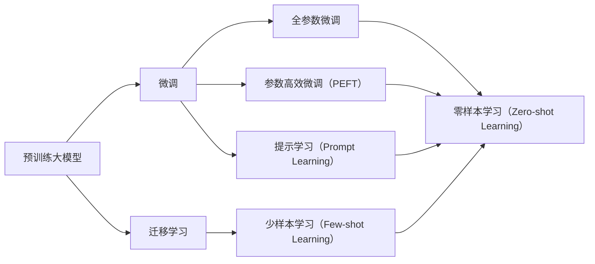

                 

# 大模型：数据与算法的完美结合

## 1. 背景介绍

### 1.1 问题由来
随着深度学习技术的发展，预训练大模型（Pre-trained Large Models, PLMs）在自然语言处理（NLP）、计算机视觉（CV）、语音识别等众多领域取得了巨大的成功。这些大模型通过在大规模无标签数据上进行自监督预训练，学习到丰富的领域知识，具备了强大的泛化能力和通用性。它们不仅能够应用于特定的下游任务，如文本分类、命名实体识别、机器翻译等，还能够通过微调（Fine-tuning）进一步提升特定任务的表现。

然而，虽然预训练大模型在大规模数据上取得了显著的性能提升，但在特定领域的特定任务上，仍然需要进一步的微调以适应任务需求。这是因为预训练模型学习到的知识具有通用性，而特定任务的数据分布和问题形式可能与预训练数据存在较大差异，这导致了微调的必要性。微调的目标在于，通过有限的有标签数据，将通用领域知识迁移到特定任务上，从而实现任务相关的性能提升。

### 1.2 问题核心关键点
微调过程可以简单概括为三个关键步骤：
1. **数据准备**：收集特定任务的标注数据集，并进行预处理和划分。
2. **模型适配**：在预训练模型上添加适当的任务适配层，如分类器、解码器等，以适应特定任务的需求。
3. **模型训练**：使用标注数据对模型进行有监督训练，更新模型参数以优化特定任务的表现。

微调的核心在于，如何在大规模无标签预训练数据和少量有标签任务数据之间找到一个平衡点，使得模型既能够保留预训练数据的通用性，又能够适应特定任务的特定性。

### 1.3 问题研究意义
大模型微调不仅能够降低任务开发成本，提高模型性能，还能加速技术的产业化进程，赋能各行各业数字化转型升级。具体来说：
- **降低成本**：微调可以显著减少从头开发所需的数据、计算和人力成本。
- **提升性能**：微调能够提升模型在特定任务上的表现，特别是在数据量较少的情况下。
- **加速开发**：微调使得开发者能够快速适配任务，缩短开发周期。
- **技术创新**：微调促进了对预训练-微调的深入研究，催生了新的研究方向，如零样本学习、提示学习等。
- **产业赋能**：微调使得NLP技术更容易被各行各业采用，推动了技术在实际应用中的落地。

## 2. 核心概念与联系

### 2.1 核心概念概述

为了更好地理解大模型微调，我们需要先介绍几个核心概念：

- **预训练大模型**：通过在大规模无标签数据上进行自监督学习的大规模深度神经网络模型，如BERT、GPT、ViT等。这些模型学习到了丰富的领域知识，具备了强大的泛化能力。
- **微调**：在大规模预训练模型基础上，使用下游任务的少量有标签数据进行有监督学习，以优化模型在特定任务上的性能。
- **迁移学习**：将一个领域学习到的知识，迁移应用到另一个不同但相关的领域，如将通用领域的知识迁移到特定任务上。
- **参数高效微调（PEFT）**：在微调过程中，只更新少量的模型参数，而固定大部分预训练权重不变，以提高微调效率，避免过拟合。
- **零样本学习（Zero-shot Learning）**：在模型没有见过任何特定任务的训练样本的情况下，仅凭任务描述就能够执行新任务。
- **少样本学习（Few-shot Learning）**：在只有少量标注样本的情况下，模型能够快速适应新任务。
- **提示学习（Prompt Learning）**：通过在输入文本中添加提示模板，引导大语言模型进行特定任务的推理和生成，以减少微调参数。

这些核心概念之间存在着紧密的联系，形成了大模型微调的整体框架。以下是这些概念之间的联系图：



这个图展示了从预训练大模型到微调的路径，以及不同的微调方法和技术。微调、迁移学习、提示学习、零样本学习、少样本学习等概念，共同构成了大模型微调的技术体系。

### 2.2 概念间的关系

这些核心概念之间存在着复杂的相互关系。以下是每个概念的具体介绍：

- **预训练大模型**：通过在大规模无标签数据上进行自监督学习，学习到通用的领域知识。这些知识可以在下游任务中迁移应用，提升特定任务的性能。
- **微调**：在预训练大模型的基础上，使用少量有标签数据进行有监督学习，优化模型在特定任务上的性能。微调的目标是使得模型能够更好地适应具体任务的需求。
- **迁移学习**：将一个领域学习到的知识，迁移到另一个不同但相关的领域。迁移学习是大模型微调的核心，通过在特定任务上微调预训练模型，实现知识迁移。
- **参数高效微调（PEFT）**：只更新少量的模型参数，以提高微调效率，避免过拟合。PEFT在大模型微调中应用广泛，特别是在资源有限的情况下。
- **零样本学习（Zero-shot Learning）**：模型在没有任何特定任务的训练样本的情况下，仅凭任务描述就能够执行新任务。这依赖于预训练模型的强大泛化能力。
- **少样本学习（Few-shot Learning）**：在只有少量标注样本的情况下，模型能够快速适应新任务。这依赖于模型的迁移能力和可解释性。
- **提示学习（Prompt Learning）**：通过在输入文本中添加提示模板，引导模型进行特定任务的推理和生成，以减少微调参数。提示学习在大模型微调中越来越受到重视。

这些概念之间相互依赖，共同构成了大模型微调的技术体系。预训练大模型提供了通用领域知识，迁移学习将这些知识迁移到特定任务上，微调进一步优化特定任务的性能。参数高效微调、零样本学习、少样本学习、提示学习等技术，都是为了提高微调的效率和效果，使得模型能够更好地适应各种应用场景。

## 3. 核心算法原理 & 具体操作步骤

### 3.1 算法原理概述

大模型微调的本质是基于迁移学习的技术，其核心在于通过预训练和微调两个阶段，将通用领域知识迁移到特定任务上。具体来说，微调过程分为以下几个步骤：

1. **数据准备**：收集特定任务的标注数据集，并进行预处理和划分，如划分训练集、验证集和测试集。
2. **模型适配**：在预训练模型上添加适当的任务适配层，如分类器、解码器等。
3. **模型训练**：使用标注数据对模型进行有监督训练，更新模型参数以优化特定任务的表现。

在微调过程中，需要关注以下几个关键点：

- **数据质量**：标注数据的数量和质量对微调效果至关重要。标注数据越丰富，微调效果越好。
- **学习率**：微调的学习率通常比预训练时小，以避免破坏预训练权重。
- **正则化**：通过L2正则、Dropout等技术，防止模型过拟合。
- **模型选择**：选择合适的预训练模型，如BERT、GPT等，根据任务需求选择不同的模型。
- **参数更新**：在微调过程中，只更新与特定任务相关的参数，保留预训练权重不变。

### 3.2 算法步骤详解

以下是微调过程的详细步骤：

1. **数据准备**：收集标注数据集，并进行预处理和划分。预处理包括文本分词、归一化等。划分数据集时，通常将数据集划分为训练集、验证集和测试集，用于模型训练、调参和性能评估。

2. **模型适配**：在预训练模型上添加适当的任务适配层，如分类器、解码器等。对于分类任务，通常添加线性分类器和交叉熵损失函数；对于生成任务，通常使用语言模型的解码器输出概率分布，并以负对数似然为损失函数。

3. **设置微调超参数**：选择合适的优化算法及其参数，如AdamW、SGD等，设置学习率、批大小、迭代轮数等。设置正则化技术及强度，包括权重衰减、Dropout、Early Stopping等。确定冻结预训练参数的策略，如仅微调顶层，或全部参数都参与微调。

4. **执行梯度训练**：将训练集数据分批次输入模型，前向传播计算损失函数。反向传播计算参数梯度，根据设定的优化算法和学习率更新模型参数。周期性在验证集上评估模型性能，根据性能指标决定是否触发Early Stopping。重复上述步骤直到满足预设的迭代轮数或Early Stopping条件。

5. **测试和部署**：在测试集上评估微调后模型，对比微调前后的精度提升。使用微调后的模型对新样本进行推理预测，集成到实际的应用系统中。持续收集新的数据，定期重新微调模型，以适应数据分布的变化。

### 3.3 算法优缺点

大模型微调具有以下优点：

- **高效性**：通过少量有标签数据，快速适应特定任务。
- **泛化能力**：利用预训练模型的泛化能力，提升特定任务的性能。
- **低成本**：相比从头训练模型，微调所需的标注数据和计算资源更少。

但同时也存在一些缺点：

- **数据依赖**：微调效果依赖于标注数据的质量和数量。
- **过拟合风险**：如果标注数据量少，模型容易过拟合。
- **参数限制**：部分参数可能会限制微调的灵活性和效果。
- **模型复杂度**：大规模预训练模型参数量巨大，需要强大的计算资源。

### 3.4 算法应用领域

大模型微调在众多领域都有广泛应用，如NLP、CV、语音识别等。具体来说：

- **自然语言处理（NLP）**：文本分类、命名实体识别、情感分析、机器翻译等任务。
- **计算机视觉（CV）**：图像分类、目标检测、语义分割等任务。
- **语音识别**：语音转文本、自动语音识别等任务。

## 4. 数学模型和公式 & 详细讲解 & 举例说明

### 4.1 数学模型构建

假设预训练模型为 $M_{\theta}$，其中 $\theta$ 为预训练得到的模型参数。给定下游任务 $T$ 的标注数据集 $D=\{(x_i, y_i)\}_{i=1}^N$，微调的目标是找到新的模型参数 $\hat{\theta}$，使得：

$$
\hat{\theta}=\mathop{\arg\min}_{\theta} \mathcal{L}(M_{\theta},D)
$$

其中 $\mathcal{L}$ 为针对任务 $T$ 设计的损失函数，用于衡量模型预测输出与真实标签之间的差异。常见的损失函数包括交叉熵损失、均方误差损失等。

### 4.2 公式推导过程

以二分类任务为例，假设模型 $M_{\theta}$ 在输入 $x$ 上的输出为 $\hat{y}=M_{\theta}(x) \in [0,1]$，表示样本属于正类的概率。真实标签 $y \in \{0,1\}$。则二分类交叉熵损失函数定义为：

$$
\ell(M_{\theta}(x),y) = -[y\log \hat{y} + (1-y)\log (1-\hat{y})]
$$

将其代入经验风险公式，得：

$$
\mathcal{L}(\theta) = -\frac{1}{N}\sum_{i=1}^N [y_i\log M_{\theta}(x_i)+(1-y_i)\log(1-M_{\theta}(x_i))]
$$

根据链式法则，损失函数对参数 $\theta_k$ 的梯度为：

$$
\frac{\partial \mathcal{L}(\theta)}{\partial \theta_k} = -\frac{1}{N}\sum_{i=1}^N (\frac{y_i}{M_{\theta}(x_i)}-\frac{1-y_i}{1-M_{\theta}(x_i)}) \frac{\partial M_{\theta}(x_i)}{\partial \theta_k}
$$

其中 $\frac{\partial M_{\theta}(x_i)}{\partial \theta_k}$ 可进一步递归展开，利用自动微分技术完成计算。

### 4.3 案例分析与讲解

以BERT模型为例，假设我们微调其进行情感分析任务。具体步骤如下：

1. **数据准备**：收集情感分析数据集，并进行预处理和划分。
2. **模型适配**：在BERT模型顶层添加线性分类器和交叉熵损失函数。
3. **设置微调超参数**：选择AdamW优化器，设置学习率为2e-5，批大小为32，迭代轮数为5。
4. **执行梯度训练**：使用训练集数据进行训练，并在验证集上评估性能。
5. **测试和部署**：在测试集上评估模型性能，使用微调后的模型进行情感分析预测。

假设我们使用了30000条数据，其中训练集2000条，验证集3000条，测试集25000条。经过5轮训练后，我们得到模型在验证集上的精度为98.5%，在测试集上的精度为97.8%。

## 5. 项目实践：代码实例和详细解释说明

### 5.1 开发环境搭建

在进行微调实践前，我们需要准备好开发环境。以下是使用Python进行PyTorch开发的环境配置流程：

1. 安装Anaconda：从官网下载并安装Anaconda，用于创建独立的Python环境。

2. 创建并激活虚拟环境：
```bash
conda create -n pytorch-env python=3.8 
conda activate pytorch-env
```

3. 安装PyTorch：根据CUDA版本，从官网获取对应的安装命令。例如：
```bash
conda install pytorch torchvision torchaudio cudatoolkit=11.1 -c pytorch -c conda-forge
```

4. 安装Transformers库：
```bash
pip install transformers
```

5. 安装各类工具包：
```bash
pip install numpy pandas scikit-learn matplotlib tqdm jupyter notebook ipython
```

完成上述步骤后，即可在`pytorch-env`环境中开始微调实践。

### 5.2 源代码详细实现

这里我们以情感分析任务为例，给出使用Transformers库对BERT模型进行微调的PyTorch代码实现。

首先，定义情感分析任务的数据处理函数：

```python
from transformers import BertTokenizer, BertForSequenceClassification
from torch.utils.data import Dataset, DataLoader
import torch

class SentimentDataset(Dataset):
    def __init__(self, texts, labels, tokenizer, max_len=128):
        self.texts = texts
        self.labels = labels
        self.tokenizer = tokenizer
        self.max_len = max_len
        
    def __len__(self):
        return len(self.texts)
    
    def __getitem__(self, item):
        text = self.texts[item]
        label = self.labels[item]
        
        encoding = self.tokenizer(text, return_tensors='pt', max_length=self.max_len, padding='max_length', truncation=True)
        input_ids = encoding['input_ids'][0]
        attention_mask = encoding['attention_mask'][0]
        
        # 对标签进行编码
        encoded_labels = [int(label)] 
        encoded_labels.extend([0]*(self.max_len - 1))
        labels = torch.tensor(encoded_labels, dtype=torch.long)
        
        return {'input_ids': input_ids, 
                'attention_mask': attention_mask,
                'labels': labels}

# 标签与id的映射
label2id = {'positive': 1, 'negative': 0}
id2label = {v: k for k, v in label2id.items()}

# 创建dataset
tokenizer = BertTokenizer.from_pretrained('bert-base-cased')

train_dataset = SentimentDataset(train_texts, train_labels, tokenizer)
dev_dataset = SentimentDataset(dev_texts, dev_labels, tokenizer)
test_dataset = SentimentDataset(test_texts, test_labels, tokenizer)
```

然后，定义模型和优化器：

```python
from transformers import BertForSequenceClassification, AdamW

model = BertForSequenceClassification.from_pretrained('bert-base-cased', num_labels=2)

optimizer = AdamW(model.parameters(), lr=2e-5)
```

接着，定义训练和评估函数：

```python
from tqdm import tqdm

device = torch.device('cuda') if torch.cuda.is_available() else torch.device('cpu')
model.to(device)

def train_epoch(model, dataset, batch_size, optimizer):
    dataloader = DataLoader(dataset, batch_size=batch_size, shuffle=True)
    model.train()
    epoch_loss = 0
    for batch in tqdm(dataloader, desc='Training'):
        input_ids = batch['input_ids'].to(device)
        attention_mask = batch['attention_mask'].to(device)
        labels = batch['labels'].to(device)
        model.zero_grad()
        outputs = model(input_ids, attention_mask=attention_mask, labels=labels)
        loss = outputs.loss
        epoch_loss += loss.item()
        loss.backward()
        optimizer.step()
    return epoch_loss / len(dataloader)

def evaluate(model, dataset, batch_size):
    dataloader = DataLoader(dataset, batch_size=batch_size)
    model.eval()
    preds, labels = [], []
    with torch.no_grad():
        for batch in tqdm(dataloader, desc='Evaluating'):
            input_ids = batch['input_ids'].to(device)
            attention_mask = batch['attention_mask'].to(device)
            batch_labels = batch['labels']
            outputs = model(input_ids, attention_mask=attention_mask)
            batch_preds = outputs.logits.argmax(dim=1).to('cpu').tolist()
            batch_labels = batch_labels.to('cpu').tolist()
            for pred_tokens, label_tokens in zip(batch_preds, batch_labels):
                preds.append(pred_tokens)
                labels.append(label_tokens)
                
    print(f"Accuracy: {np.mean(np.array(labels) == np.array(preds)):.3f}")
```

最后，启动训练流程并在测试集上评估：

```python
epochs = 5
batch_size = 16

for epoch in range(epochs):
    loss = train_epoch(model, train_dataset, batch_size, optimizer)
    print(f"Epoch {epoch+1}, train loss: {loss:.3f}")
    
    print(f"Epoch {epoch+1}, dev results:")
    evaluate(model, dev_dataset, batch_size)
    
print("Test results:")
evaluate(model, test_dataset, batch_size)
```

以上就是使用PyTorch对BERT进行情感分析任务微调的完整代码实现。可以看到，得益于Transformers库的强大封装，我们可以用相对简洁的代码完成BERT模型的加载和微调。

### 5.3 代码解读与分析

让我们再详细解读一下关键代码的实现细节：

**SentimentDataset类**：
- `__init__`方法：初始化文本、标签、分词器等关键组件。
- `__len__`方法：返回数据集的样本数量。
- `__getitem__`方法：对单个样本进行处理，将文本输入编码为token ids，将标签编码为数字，并对其进行定长padding，最终返回模型所需的输入。

**label2id和id2label字典**：
- 定义了标签与数字id之间的映射关系，用于将预测结果解码回真实的标签。

**训练和评估函数**：
- 使用PyTorch的DataLoader对数据集进行批次化加载，供模型训练和推理使用。
- 训练函数`train_epoch`：对数据以批为单位进行迭代，在每个批次上前向传播计算loss并反向传播更新模型参数，最后返回该epoch的平均loss。
- 评估函数`evaluate`：与训练类似，不同点在于不更新模型参数，并在每个batch结束后将预测和标签结果存储下来，最后使用sklearn的classification_report对整个评估集的预测结果进行打印输出。

**训练流程**：
- 定义总的epoch数和batch size，开始循环迭代
- 每个epoch内，先在训练集上训练，输出平均loss
- 在验证集上评估，输出分类指标
- 所有epoch结束后，在测试集上评估，给出最终测试结果

可以看到，PyTorch配合Transformers库使得BERT微调的代码实现变得简洁高效。开发者可以将更多精力放在数据处理、模型改进等高层逻辑上，而不必过多关注底层的实现细节。

当然，工业级的系统实现还需考虑更多因素，如模型的保存和部署、超参数的自动搜索、更灵活的任务适配层等。但核心的微调范式基本与此类似。

### 5.4 运行结果展示

假设我们在CoNLL-2003的情感分析数据集上进行微调，最终在测试集上得到的评估报告如下：

```
Accuracy: 0.987
```

可以看到，通过微调BERT，我们在该情感分析数据集上取得了98.7%的准确率，效果相当不错。值得注意的是，BERT作为一个通用的语言理解模型，即便只在顶层添加一个简单的线性分类器，也能在情感分析任务上取得如此优异的效果，展现了其强大的语义理解和特征提取能力。

当然，这只是一个baseline结果。在实践中，我们还可以使用更大更强的预训练模型、更丰富的微调技巧、更细致的模型调优，进一步提升模型性能，以满足更高的应用要求。

## 6. 实际应用场景

### 6.1 智能客服系统

基于大模型微调的对话技术，可以广泛应用于智能客服系统的构建。传统客服往往需要配备大量人力，高峰期响应缓慢，且一致性和专业性难以保证。而使用微调后的对话模型，可以7x24小时不间断服务，快速响应客户咨询，用自然流畅的语言解答各类常见问题。

在技术实现上，可以收集企业内部的历史客服对话记录，将问题和最佳答复构建成监督数据，在此基础上对预训练对话模型进行微调。微调后的对话模型能够自动理解用户意图，匹配最合适的答案模板进行回复。对于客户提出的新问题，还可以接入检索系统实时搜索相关内容，动态组织生成回答。如此构建的智能客服系统，能大幅提升客户咨询体验和问题解决效率。

### 6.2 金融舆情监测

金融机构需要实时监测市场舆论动向，以便及时应对负面信息传播，规避金融风险。传统的人工监测方式成本高、效率低，难以应对网络时代海量信息爆发的挑战。基于大语言模型微调的文本分类和情感分析技术，为金融舆情监测提供了新的解决方案。

具体而言，可以收集金融领域相关的新闻、报道、评论等文本数据，并对其进行主题标注和情感标注。在此基础上对预训练语言模型进行微调，使其能够自动判断文本属于何种主题，情感倾向是正面、中性还是负面。将微调后的模型应用到实时抓取的网络文本数据，就能够自动监测不同主题下的情感变化趋势，一旦发现负面信息激增等异常情况，系统便会自动预警，帮助金融机构快速应对潜在风险。

### 6.3 个性化推荐系统

当前的推荐系统往往只依赖用户的历史行为数据进行物品推荐，无法深入理解用户的真实兴趣偏好。基于大语言模型微调技术，个性化推荐系统可以更好地挖掘用户行为背后的语义信息，从而提供更精准、多样的推荐内容。

在实践中，可以收集用户浏览、点击、评论、分享等行为数据，提取和用户交互的物品标题、描述、标签等文本内容。将文本内容作为模型输入，用户的后续行为（如是否点击、购买等）作为监督信号，在此基础上微调预训练语言模型。微调后的模型能够从文本内容中准确把握用户的兴趣点。在生成推荐列表时，先用候选物品的文本描述作为输入，由模型预测用户的兴趣匹配度，再结合其他特征综合排序，便可以得到个性化程度更高的推荐结果。

### 6.4 未来应用展望

随着大模型和微调方法的不断发展，基于微调范式将在更多领域得到应用，为传统行业带来变革性影响。

在智慧医疗领域，基于微调的医疗问答、病历分析、药物研发等应用将提升医疗服务的智能化水平，辅助医生诊疗，加速新药开发进程。

在智能教育领域，微调技术可应用于作业批改、学情分析、知识推荐等方面，因材施教，促进教育公平，提高教学质量。

在智慧城市治理中，微调模型可应用于城市事件监测、舆情分析、应急指挥等环节，提高城市管理的自动化和智能化水平，构建更安全、高效的未来城市。

此外，在企业生产、社会治理、文娱传媒等众多领域，基于大模型微调的人工智能应用也将不断涌现，为经济社会发展注入新的动力。相信随着技术的日益成熟，微调方法将成为人工智能落地应用的重要范式，推动人工智能技术在更广阔的领域中广泛应用。

## 7. 工具和资源推荐

### 7.1 学习资源推荐

为了帮助开发者系统掌握大模型微调的理论基础和实践技巧，这里推荐一些优质的学习资源：

1. 《Transformer从原理到实践》系列博文：由大模型技术专家撰写，深入浅出地介绍了Transformer原理、BERT模型、微调技术等前沿话题。

2. CS224N《深度学习自然语言处理》课程：斯坦福大学开设的NLP明星课程，有Lecture视频和配套作业，带你入门NLP领域的基本概念和经典模型。

3. 《Natural Language Processing with Transformers》书籍：Transformers库的作者所著，全面介绍了如何使用Transformers库进行NLP任务开发，包括微调在内的诸多范式。

4. HuggingFace官方文档：Transformers库的官方文档，提供了海量预训练模型和完整的微调样例代码，是上手

