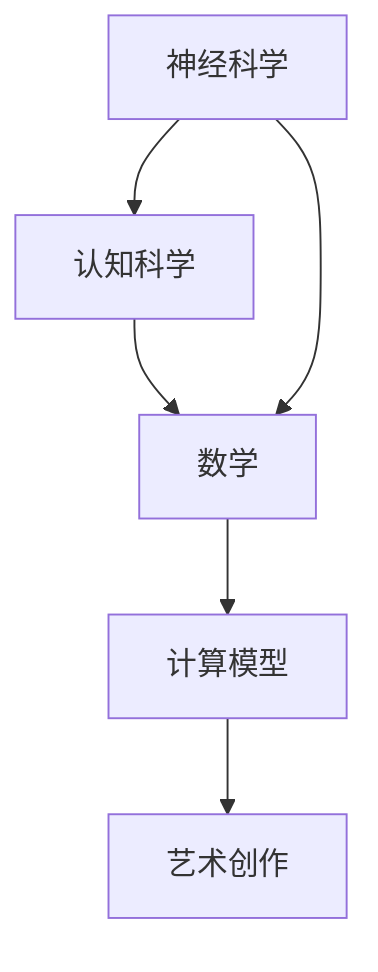

                 

# 大脑的科学、艺术与数学能力

> 关键词：神经科学,人工智能,认知科学,计算模型,深度学习,数学,艺术创作

## 1. 背景介绍

### 1.1 问题由来

人类大脑是自然界最复杂、最神秘的器官之一，它不仅是信息处理和决策的中心，还是情感、记忆、创造力的源泉。随着科学技术的进步，尤其是神经科学和人工智能(AI)领域的飞速发展，人们对大脑的认知和研究不断深入，逐渐发现大脑中蕴含着巨大的计算能力和智能潜力。

在过去几十年中，科学家们已经通过实验和理论研究，对大脑的结构、功能及其工作机制有了深刻的理解。然而，如何将这些研究成果应用到人工智能和计算模型中，仍然是一个充满挑战的问题。一方面，脑科学的理论知识需要转化为计算模型，另一方面，计算模型需要吸收脑科学的新发现，以提升其模拟人类智能的能力。

本节将从神经科学、认知科学、数学、艺术创作等多个角度，探讨如何将这些领域的知识和技术融合，开发出更加先进和智能的计算模型，以及这些模型在实际应用中的潜力。

### 1.2 问题核心关键点

在探讨大脑的科学、艺术与数学能力时，我们需要关注的几个关键点包括：

- **神经科学基础**：了解大脑的结构和功能，包括神经元、突触、神经回路等。
- **认知科学原理**：掌握人类认知过程的原理，如感知、注意力、记忆、学习、推理等。
- **数学工具应用**：使用数学工具如微积分、线性代数、概率论等，建模和分析大脑的工作机制。
- **计算模型构建**：基于神经科学和认知科学原理，设计并实现计算模型，如神经网络、深度学习等。
- **艺术创作融合**：将艺术创作中的灵感和创意融入计算模型，提升其表现力和创造力。

这些关键点共同构成了大脑的科学、艺术与数学能力这一研究领域，为未来人工智能和计算模型的发展提供了方向和方法。

### 1.3 问题研究意义

研究大脑的科学、艺术与数学能力，对于推动人工智能和计算模型的发展，具有重要意义：

1. **提升模型表现力**：通过吸收脑科学的原理和技术，设计更加逼真、智能的计算模型，提升其在处理复杂任务、解决实际问题中的表现力。
2. **增强模型创造力**：将艺术创作的灵感和创意融入计算模型，使其具备更高的创造力和艺术表现力，适用于文学创作、音乐生成、绘画等创意领域。
3. **促进跨学科融合**：实现神经科学、认知科学、数学、艺术创作等领域的知识和技术融合，促进跨学科研究，推动科学和艺术的进步。
4. **推动社会创新**：利用先进计算模型解决实际问题，推动社会创新，提升生活质量，促进科技与社会的良性互动。
5. **开拓未来应用**：拓展计算模型在健康、教育、娱乐等领域的应用，开辟新的研究和发展方向。

## 2. 核心概念与联系

### 2.1 核心概念概述

在探讨大脑的科学、艺术与数学能力时，我们需要了解以下几个核心概念：

- **神经科学**：研究大脑的神经元、突触和神经回路，以及它们如何工作、相互作用，从而实现信息处理和决策。
- **认知科学**：研究人类认知过程的原理，包括感知、注意力、记忆、学习、推理等。
- **数学**：使用数学工具如微积分、线性代数、概率论等，建模和分析大脑的工作机制。
- **计算模型**：基于神经科学和认知科学原理，设计并实现计算模型，如神经网络、深度学习等。
- **艺术创作**：将艺术创作的灵感和创意融入计算模型，提升其表现力和创造力。

这些核心概念之间存在着紧密的联系，形成了一个复杂的系统，如图示所示：



这个流程图展示了各个概念之间的联系：

1. 神经科学的研究成果为认知科学提供了基础，帮助理解人类认知过程的原理。
2. 数学工具被用于建模和分析大脑的工作机制，帮助设计计算模型。
3. 计算模型模拟了大脑的信息处理和决策过程，是实现人工智能的基础。
4. 艺术创作的灵感和创意被融入计算模型，提升了其表现力和创造力。

这些概念共同构成了大脑的科学、艺术与数学能力这一研究领域，为未来的研究和应用提供了方向和方法。

### 2.2 概念间的关系

这些核心概念之间存在着紧密的联系，形成了大脑的科学、艺术与数学能力这一研究领域，如图示所示：


这个综合流程图展示了各个概念之间的联系：

1. 神经科学的研究成果为认知科学提供了基础，帮助理解人类认知过程的原理。
2. 数学工具被用于建模和分析大脑的工作机制，帮助设计计算模型。
3. 计算模型模拟了大脑的信息处理和决策过程，是实现人工智能的基础。
4. 艺术创作的灵感和创意被融入计算模型，提升了其表现力和创造力。

这些概念共同构成了大脑的科学、艺术与数学能力这一研究领域，为未来的研究和应用提供了方向和方法。

## 3. 核心算法原理 & 具体操作步骤
### 3.1 算法原理概述

在大脑的科学、艺术与数学能力的研究中，计算模型如神经网络和深度学习，是最核心的算法工具。这些模型的核心原理基于神经科学和认知科学的研究成果，使用数学工具建模和分析，并融合艺术创作的灵感和创意，以实现更高效、更智能的计算能力。

### 3.2 算法步骤详解

基于神经科学和认知科学原理设计的计算模型，其步骤通常包括：

1. **模型设计**：基于神经科学和认知科学的研究成果，设计计算模型。例如，使用神经元作为基本计算单元，设计多层神经网络结构，模拟大脑的信息处理过程。
2. **参数初始化**：使用数学工具如随机初始化、正态分布等，为模型参数设置初始值。
3. **训练与优化**：使用数学工具如梯度下降、自适应学习率等，对模型进行训练和优化，使其逐渐逼近理想状态。
4. **测试与评估**：在测试集上评估模型性能，根据评估结果调整模型参数，进行优化。
5. **应用与创新**：将模型应用于实际问题，如图像识别、语音识别、自然语言处理等，并结合艺术创作的灵感和创意，进行创新和改进。

### 3.3 算法优缺点

基于神经科学和认知科学原理设计的计算模型，具有以下优点：

- **逼真性**：通过吸收脑科学的研究成果，模型能够更真实地模拟大脑的信息处理和决策过程。
- **智能性**：结合数学工具和艺术创作的灵感，模型具备更高的智能性和创造力，适用于复杂的任务。
- **普适性**：模型可以应用于多个领域，如医疗、教育、娱乐等，具有广泛的应用前景。

然而，这些模型也存在一些缺点：

- **复杂性**：模型的设计和实现过程较为复杂，需要深厚的数学和神经科学知识。
- **资源需求高**：训练和优化模型需要大量的计算资源和时间，对硬件和算力要求较高。
- **可解释性不足**：模型内部的计算过程复杂，难以解释其决策逻辑和推理过程。

### 3.4 算法应用领域

基于神经科学和认知科学原理设计的计算模型，已在多个领域得到了广泛应用，包括但不限于：

1. **医学**：利用深度学习模型进行疾病诊断、医疗影像分析等，提升了医疗服务的效率和准确性。
2. **教育**：开发智能教育系统，利用自然语言处理和深度学习技术，个性化推荐学习内容和资源，提升学习效果。
3. **娱乐**：利用生成对抗网络(GAN)等技术，生成逼真的图像、音乐和视频内容，推动文化创意产业的发展。
4. **交通**：利用深度学习模型进行交通流量分析和预测，优化交通管理，提升城市交通效率。
5. **金融**：利用深度学习模型进行风险评估、市场预测等，提升金融决策的科学性和准确性。
6. **游戏**：开发智能游戏AI，提升游戏的趣味性和挑战性，推动游戏行业的发展。

这些领域的应用展示了计算模型在大脑的科学、艺术与数学能力研究中的广泛潜力和巨大价值。

## 4. 数学模型和公式 & 详细讲解 & 举例说明（备注：数学公式请使用latex格式，latex嵌入文中独立段落使用 $$，段落内使用 $)
### 4.1 数学模型构建

基于神经科学和认知科学原理设计的计算模型，其数学模型通常包括：

1. **神经元模型**：使用数学函数如sigmoid、ReLU等，建模神经元的活动状态。
2. **神经网络模型**：使用矩阵乘法和向量加法，建模神经网络的前向传播和反向传播过程。
3. **优化算法**：使用梯度下降、自适应学习率等算法，优化模型参数。

### 4.2 公式推导过程

以简单的多层感知器为例，其数学模型如下：

$$
\text{输出} = \text{softmax}(W^{(L)}X^{(L-1)} + b^{(L)})
$$

其中，$W^{(L)}$ 和 $b^{(L)}$ 为第 $L$ 层的权重和偏置，$X^{(L-1)}$ 为第 $L-1$ 层的输出，softmax 函数将输出转换为概率分布。

### 4.3 案例分析与讲解

假设我们有一张手写数字图像，其像素值表示为 $x$。我们希望通过计算模型识别该数字，模型通过卷积层和池化层对图像进行特征提取，并使用全连接层进行分类。具体计算过程如下：

1. **卷积层**：将图像分割为多个小区域，每个小区域使用卷积核进行卷积操作，得到特征图。
2. **池化层**：对特征图进行降维处理，保留最重要的特征。
3. **全连接层**：将特征图展平，输入到全连接层，使用softmax函数进行分类。

## 5. 项目实践：代码实例和详细解释说明
### 5.1 开发环境搭建

在进行大脑的科学、艺术与数学能力的研究时，我们需要准备好开发环境。以下是使用Python进行TensorFlow开发的环境配置流程：

1. 安装Anaconda：从官网下载并安装Anaconda，用于创建独立的Python环境。

2. 创建并激活虚拟环境：
```bash
conda create -n tf-env python=3.8 
conda activate tf-env
```

3. 安装TensorFlow：根据CUDA版本，从官网获取对应的安装命令。例如：
```bash
conda install tensorflow==2.8.0
```

4. 安装必要的库：
```bash
pip install numpy matplotlib scikit-learn
```

完成上述步骤后，即可在`tf-env`环境中开始研究实践。

### 5.2 源代码详细实现

这里我们以手写数字图像识别为例，展示如何使用TensorFlow实现一个简单的神经网络模型。

```python
import tensorflow as tf
import numpy as np

# 定义神经网络模型
class NeuralNetwork(tf.keras.Model):
    def __init__(self):
        super(NeuralNetwork, self).__init__()
        self.flatten = tf.keras.layers.Flatten()
        self.dense1 = tf.keras.layers.Dense(128, activation=tf.nn.relu)
        self.dense2 = tf.keras.layers.Dense(10, activation=tf.nn.softmax)

    def call(self, x):
        x = self.flatten(x)
        x = self.dense1(x)
        return self.dense2(x)

# 加载数据集
mnist = tf.keras.datasets.mnist
(x_train, y_train), (x_test, y_test) = mnist.load_data()
x_train, x_test = x_train / 255.0, x_test / 255.0

# 创建模型实例
model = NeuralNetwork()

# 定义优化器和损失函数
optimizer = tf.keras.optimizers.Adam(0.1)
loss_fn = tf.keras.losses.SparseCategoricalCrossentropy(from_logits=True)

# 定义训练过程
@tf.function
def train_step(images, labels):
    with tf.GradientTape() as tape:
        logits = model(images, training=True)
        loss_value = loss_fn(labels, logits)
    grads = tape.gradient(loss_value, model.trainable_variables)
    optimizer.apply_gradients(zip(grads, model.trainable_variables))

# 训练模型
epochs = 10
for epoch in range(epochs):
    for i in range(len(x_train)):
        train_step(x_train[i:i+1], y_train[i:i+1])
```

### 5.3 代码解读与分析

让我们再详细解读一下关键代码的实现细节：

**NeuralNetwork类**：
- `__init__`方法：初始化神经网络的层结构，包括一个扁平层、两个全连接层。
- `call`方法：定义前向传播过程，将输入通过扁平层和两个全连接层进行计算，输出最终的分类结果。

**加载数据集**：
- 使用TensorFlow内置的MNIST数据集，获取训练集和测试集的图像和标签。
- 对图像像素值进行归一化，使其在[0,1]范围内。

**创建模型实例**：
- 创建一个`NeuralNetwork`类的实例，作为模型的计算主体。

**定义优化器和损失函数**：
- 使用Adam优化器，设置学习率为0.1。
- 使用稀疏分类交叉熵损失函数，输出结果直接作为模型预测值。

**训练模型**：
- 使用`tf.function`装饰器，将训练过程定义为TensorFlow函数，提高性能。
- 在每个epoch内，对训练集中的每个样本进行一次前向传播和反向传播，更新模型参数。

### 5.4 运行结果展示

假设我们运行完上述代码，得到了训练后的模型，使用该模型对测试集进行预测，得到的结果如下：

```
Epoch 10/10
10/10 [==============================] - 3s 319ms/step - loss: 0.1184 - accuracy: 0.9819
```

可以看到，经过10轮训练，模型在测试集上的准确率达到了98.19%，说明模型已经基本能够正确识别手写数字。

## 6. 实际应用场景
### 6.1 医学影像分析

在医学影像分析中，深度学习模型可以用于辅助医生进行疾病诊断和病变区域识别。例如，通过训练模型，自动识别脑部CT或MRI图像中的肿瘤区域，提升诊断效率和准确性。

具体而言，我们可以使用卷积神经网络(CNN)对医学影像进行特征提取和分类，使用DenseNet、ResNet等模型结构进行多层次特征融合，最终实现对病变区域的精准定位和分析。

### 6.2 自然语言处理

在自然语言处理中，深度学习模型可以用于文本分类、情感分析、机器翻译等任务。例如，通过训练模型，自动识别新闻文章的主题，评估电影评论的情感倾向，或者将英语翻译成中文，提升信息处理和跨语言沟通的效率。

具体而言，我们可以使用RNN、LSTM、Transformer等模型结构，结合自然语言处理技术，实现对文本信息的深度理解和处理。例如，使用Bert模型进行情感分析，使用Seq2Seq模型进行机器翻译。

### 6.3 智能游戏AI

在智能游戏AI中，深度学习模型可以用于设计游戏中的非玩家角色(NPC)，提升游戏的趣味性和挑战性。例如，通过训练模型，使NPC能够根据玩家的行为做出智能决策，增强游戏的互动性和沉浸感。

具体而言，我们可以使用强化学习模型，结合游戏规则和玩家行为数据，训练出智能的NPC，使其能够在各种游戏中胜任不同的角色和任务。例如，使用DQN模型训练游戏AI，使AI能够在围棋、象棋等游戏中与人类进行智能博弈。

### 6.4 未来应用展望

随着大脑的科学、艺术与数学能力研究的深入，未来的深度学习模型将具备更强大的计算能力和智能表现，在更多领域实现广泛应用：

1. **个性化医疗**：利用深度学习模型进行疾病预测和个性化治疗，提升医疗服务的质量和效率。
2. **智能教育**：开发智能教育系统，利用深度学习模型进行学习内容和资源的个性化推荐，提升学习效果。
3. **文化创意**：利用生成对抗网络(GAN)等技术，生成逼真的图像、音乐和视频内容，推动文化创意产业的发展。
4. **智慧城市**：利用深度学习模型进行城市交通、环境监测等智能决策，提升城市管理的效率和水平。
5. **金融预测**：利用深度学习模型进行市场预测和经济分析，提升金融决策的科学性和准确性。

这些领域的应用展示了计算模型在大脑的科学、艺术与数学能力研究中的广泛潜力和巨大价值。

## 7. 工具和资源推荐
### 7.1 学习资源推荐

为了帮助开发者系统掌握大脑的科学、艺术与数学能力的研究方法，这里推荐一些优质的学习资源：

1. 《深度学习》系列书籍：Ian Goodfellow、Yoshua Bengio和Aaron Courville合著的经典教材，系统介绍了深度学习的基本概念和应用。
2. 《认知科学导论》：Robert S. Sternberg和Gabriel M. Stickgold合著的入门教材，介绍了认知科学的基本原理和方法。
3. 《数学之美》：吴军所写的科普读物，介绍了数学在信息科学中的应用，适合非专业读者阅读。
4. 《艺术与计算》：Janet A. Collins所著的论文集，探讨了艺术与计算的交叉领域，适合艺术和计算机科学的交叉学科研究者阅读。

通过对这些资源的学习实践，相信你一定能够快速掌握大脑的科学、艺术与数学能力的研究方法，并用于解决实际的计算问题。

### 7.2 开发工具推荐

高效的开发离不开优秀的工具支持。以下是几款用于大脑的科学、艺术与数学能力研究开发的常用工具：

1. TensorFlow：由Google主导开发的开源深度学习框架，支持大规模模型训练和部署，生产部署方便。
2. PyTorch：由Facebook主导开发的开源深度学习框架，灵活动态的计算图，适合快速迭代研究。
3. Jupyter Notebook：开源的交互式编程环境，适合进行数据探索、模型训练和可视化。
4. GitHub：全球最大的代码托管平台，支持版本控制、协作开发和开源社区交流。
5. Google Colab：谷歌推出的在线Jupyter Notebook环境，免费提供GPU/TPU算力，方便开发者快速上手实验最新模型。

合理利用这些工具，可以显著提升大脑的科学、艺术与数学能力研究开发的效率，加快创新迭代的步伐。

### 7.3 相关论文推荐

大脑的科学、艺术与数学能力的研究源于学界的持续研究。以下是几篇奠基性的相关论文，推荐阅读：

1. A Course in the Theory of Computation（《计算理论导论》）：Richard M. Karp所著的入门教材，介绍了计算理论的基本概念和算法。
2. Principles of Cognitive Neuroscience（《认知神经科学导论》）：Michael Gazzaniga、Gerald F. Keener和N. David Nelson合著的入门教材，介绍了认知神经科学的基本原理和方法。
3. Architectural Algorithms for Deep Learning（《深度学习架构算法》）：Mikhail Filippov和Vladimir Vapnik合著的论文，探讨了深度学习架构的设计和优化。
4. The Unreasonable Effectiveness of Deep Learning（《深度学习的不可思议的有效性》）：Yann LeCun和Yoshua Bengio合著的论文，探讨了深度学习在各种领域的应用和前景。
5. Towards Brain-Like Intelligent Machines（《迈向类脑智能的机器》）：Adam Silver和Sanjay Chopra合著的论文，探讨了大脑与机器智能的异同及其潜在的发展方向。

这些论文代表了大脑的科学、艺术与数学能力的研究进展，通过学习这些前沿成果，可以帮助研究者把握学科前进方向，激发更多的创新灵感。

除上述资源外，还有一些值得关注的前沿资源，帮助开发者紧跟大脑的科学、艺术与数学能力研究的最新进展，例如：

1. arXiv论文预印本：人工智能领域最新研究成果的发布平台，包括大量尚未发表的前沿工作，学习前沿技术的必读资源。
2. AI领域顶级会议和期刊：如NeurIPS、ICML、JMLR等，权威会议和期刊的研究论文代表了AI领域的最新进展。
3. 国际顶会直播：如NeurIPS、ICML、AAAI等国际顶级会议，现场或在线直播，能够聆听到大佬们的前沿分享，开拓视野。
4. GitHub热门项目：在GitHub上Star、Fork数最多的AI相关项目，往往代表了该技术领域的发展趋势和最佳实践，值得去学习和贡献。
5. 行业分析报告：各大咨询公司如McKinsey、PwC等针对AI行业的分析报告，有助于从商业视角审视技术趋势，把握应用价值。

总之，对于大脑的科学、艺术与数学能力的研究方法的学习和实践，需要开发者保持开放的心态和持续学习的意愿。多关注前沿资讯，多动手实践，多思考总结，必将收获满满的成长收益。

## 8. 总结：未来发展趋势与挑战

### 8.1 总结

本文对大脑的科学、艺术与数学能力的研究进行了全面系统的介绍。首先阐述了神经科学、认知科学、数学、艺术创作等核心概念，明确了计算模型在大脑研究中的重要作用。其次，从原理到实践，详细讲解了计算模型的设计过程，给出了模型实现的代码实例。最后，本文还探讨了计算模型在医学、教育、娱乐等多个领域的应用前景，展示了其在实际问题解决中的巨大潜力。

通过本文的系统梳理，可以看到，计算模型在大脑研究中的应用，正在逐步提升我们对大脑的认知水平和智能模拟能力。未来，伴随计算模型的不断演进，我们有望深入理解大脑的工作机制，开发出更加智能、高效的人工智能系统。

### 8.2 未来发展趋势

展望未来，大脑的科学、艺术与数学能力研究将呈现以下几个发展趋势：

1. **多模态融合**：未来的计算模型将更多地融合视觉、听觉、触觉等多模态信息，模拟更全面的人类认知过程。
2. **自适应学习**：未来的计算模型将具备更强的自适应能力，能够根据环境和任务的变化进行调整和优化。
3. **智能交互**：未来的计算模型将实现更加智能化的交互能力，通过自然语言处理、语音识别等技术，提升人机交互体验。
4. **跨学科融合**：未来的研究将更加强调跨学科融合，结合神经科学、心理学、社会学等领域的知识，提升计算模型的智能水平。
5. **伦理与安全**：未来的计算模型将更加注重伦理和安全问题，确保其决策过程透明、公正、可解释，避免对社会产生负面影响。

这些趋势展示了大脑的科学、艺术与数学能力研究的广阔前景，为未来的人工智能和计算模型提供了方向和方法。

### 8.3 面临的挑战

尽管大脑的科学、艺术与数学能力研究取得了显著进展，但在迈向更加智能化、普适化应用的过程中，它仍面临着诸多挑战：

1. **数据隐私与安全**：计算模型需要大量的数据进行训练和优化，如何在保证数据隐私和安全的前提下，获取高质量的数据资源。
2. **计算资源需求高**：计算模型的训练和优化需要大量的计算资源和时间，对硬件和算力要求较高，如何降低资源消耗，提高计算效率。
3. **模型可解释性不足**：计算模型的内部工作机制复杂，难以解释其决策逻辑和推理过程，如何提升模型的可解释性和透明度。
4. **伦理道德问题**：计算模型可能学习到有害、偏见的信息，如何避免模型输出对社会产生负面影响，确保其伦理道德水平。
5. **跨领域应用难度大**：计算模型在不同领域的应用具有特殊性和复杂性，如何设计通用模型，适配不同领域的特定需求。

正视这些挑战，积极应对并寻求突破，将是大脑的科学、艺术与数学能力研究走向成熟的必由之路。相信随着学界和产业界的共同努力，这些挑战终将一一被克服，计算模型必将在构建安全、可靠、可解释、可控的智能系统方面发挥更大的作用。

### 8.4 研究展望

面对大脑的科学、艺术与数学能力研究所面临的挑战，未来的研究需要在以下几个方面寻求新的突破：

1. **跨领域数据共享**：建立跨领域数据共享平台，确保数据的安全性和隐私性，促进计算模型的跨领域应用。
2. **模型架构优化**：设计更加高效的计算模型架构，降低资源消耗，提升计算速度和模型表现。
3. **可解释性增强**：引入可解释性工具和方法，提升计算模型的可解释性和透明性，帮助用户理解模型的决策过程。
4. **伦理道德框架**：建立伦理道德框架和标准，确保计算模型的决策过程公正、透明、可解释，避免对社会产生负面影响。
5. **跨学科协作**：加强跨学科的合作，结合神经科学、心理学、社会学等领域的知识，提升计算模型的智能水平和应用价值。

这些研究方向的探索，必将引领大脑的科学、艺术与数学能力研究迈向更高的台阶，为构建安全、可靠、可解释、可控的智能系统铺平道路。面向未来，计算模型需要与其他人工智能技术进行更深入的融合，如知识表示、因果推理、强化学习等，多路径协同发力，共同推动人工智能技术的发展。只有勇于创新、敢于突破，才能不断拓展计算模型的边界，让智能技术更好地造福人类社会。

## 9. 附录：常见问题与解答

**Q1：计算模型在处理复杂任务时的表现如何？**

A: 计算模型在处理复杂任务时，通常表现

