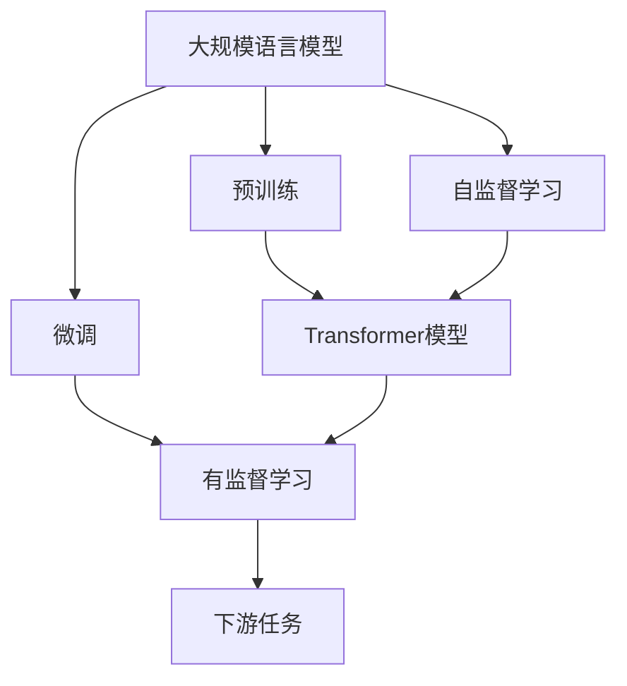
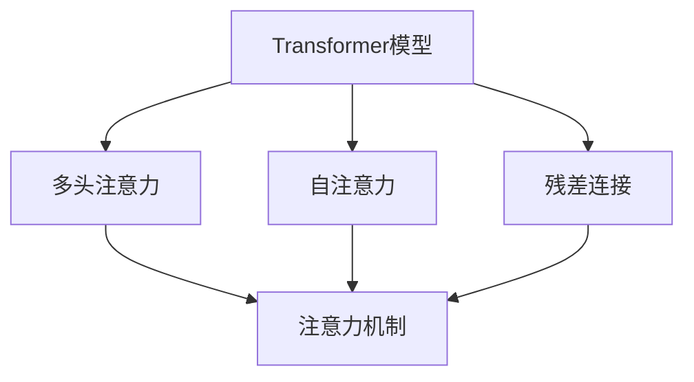
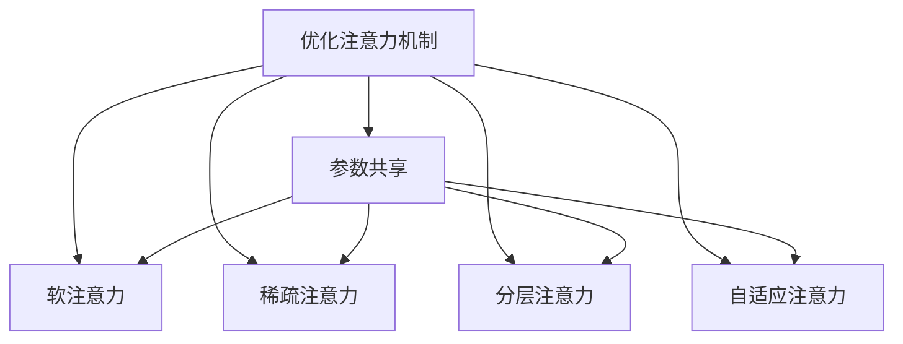
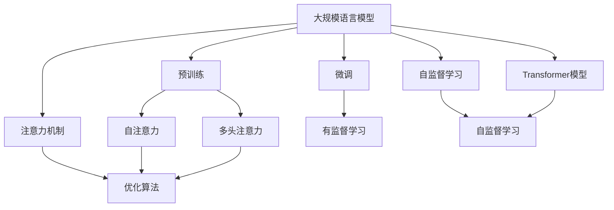

                 

# 大规模语言模型从理论到实践 注意力机制优化

> 关键词：
  - 大规模语言模型
  - 注意力机制
  - 优化算法
  - 深度学习
  - 自然语言处理
  - Transformer
  - 自监督学习
  - 预训练
  - 微调
  - 案例分析

## 1. 背景介绍

### 1.1 问题由来
近年来，深度学习在自然语言处理(NLP)领域取得了显著进步。特别是基于Transformer结构的大规模语言模型(如BERT、GPT等)，通过在大规模无标签文本语料上进行预训练，学习到了丰富的语言知识和常识，在各类下游任务中取得了优异性能。然而，这些大模型通常需要巨量的计算资源和大量的训练数据，难以应用于实际生产环境。因此，针对实际应用的优化，如注意力机制的优化，成为研究热点。

### 1.2 问题核心关键点
注意力机制在大规模语言模型中的作用不可忽视，它通过动态地分配不同输入词汇的权重，使得模型能够更加集中于对当前任务最相关的词汇信息进行处理。然而，在大规模模型中，注意力机制的计算量惊人，导致模型训练和推理效率低下。如何在大规模语言模型中高效地优化注意力机制，成为当前研究的重点。

### 1.3 问题研究意义
优化大规模语言模型中的注意力机制，对于提高模型的训练效率、减少计算资源消耗、提升实际应用效果具有重要意义。

1. **提高训练效率**：通过优化注意力机制，可以显著降低模型训练过程中的计算量，缩短训练时间，提升模型训练的可持续性。
2. **减少计算资源消耗**：优化后的注意力机制可以更高效地利用计算资源，降低硬件需求，使模型在有限的计算资源下也能获得优秀性能。
3. **提升实际应用效果**：优化后的模型在推理阶段能够更快地处理输入，提升响应速度，使得模型在实际应用中表现更佳。

## 2. 核心概念与联系

### 2.1 核心概念概述

为更好地理解注意力机制在大规模语言模型中的优化，本节将介绍几个密切相关的核心概念：

- **注意力机制(Attention Mechanism)**：一种重要的深度学习技术，通过动态分配不同输入的权重，使得模型能够更加专注于与当前任务最相关的部分。在大规模语言模型中，注意力机制通常用于解码器的不同层中，对输入序列的不同部分进行加权求和，以生成更准确的输出。

- **Transformer模型**：一种基于自注意力机制的深度学习模型，广泛应用于大规模语言模型的预训练和微调中。Transformer模型通过多头注意力和残差连接等机制，极大地提高了模型的性能和计算效率。

- **自监督学习(SSL)**：一种无监督学习技术，通过在无标签数据上训练模型，使其能够自动学习数据的内在结构和表示。在大规模语言模型中，自监督学习通常用于预训练阶段，以学习语言的通用表示。

- **预训练(Pre-training)**：指在大规模无标签数据上，通过自监督学习任务训练模型的过程。预训练使得模型学习到语言的通用表示，为下游任务的微调奠定基础。

- **微调(Fine-tuning)**：指在预训练模型的基础上，使用下游任务的少量标注数据，通过有监督学习优化模型在该任务上的性能。

这些核心概念之间的逻辑关系可以通过以下Mermaid流程图来展示：



这个流程图展示了大规模语言模型的核心概念及其之间的关系：

1. 大规模语言模型通过自监督学习进行预训练，学习到语言的通用表示。
2. 预训练模型通过微调，适应特定的下游任务，并在微调过程中进行优化。
3. Transformer模型是预训练和微调的基础架构，具有多头注意力和残差连接等重要特性。

### 2.2 概念间的关系

这些核心概念之间存在着紧密的联系，形成了大规模语言模型优化注意力机制的完整生态系统。下面通过几个Mermaid流程图来展示这些概念之间的关系。

#### 2.2.1 大语言模型的学习范式


这个流程图展示了大语言模型的三种主要学习范式：预训练、微调和自监督学习。预训练主要采用自监督学习方法，而微调则是有监督学习的过程。

#### 2.2.2 注意力机制与Transformer模型



这个流程图展示了Transformer模型中多头注意力和自注意力机制的组成。注意力机制是Transformer模型的核心，通过动态地分配不同输入的权重，使得模型能够更加专注于与当前任务最相关的部分。

#### 2.2.3 优化注意力机制的方法



这个流程图展示了优化注意力机制的几种主要方法：参数共享、软注意力、稀疏注意力、分层注意力和自适应注意力。这些方法旨在通过不同的技术手段，优化注意力机制的计算效率和模型性能。

### 2.3 核心概念的整体架构

最后，我们用一个综合的流程图来展示这些核心概念在大规模语言模型优化注意力机制过程中的整体架构：



这个综合流程图展示了从预训练到微调，再到优化注意力机制的完整过程。大语言模型首先在大规模文本数据上进行预训练，然后通过微调（包括有监督学习）适应特定的下游任务，最后，通过优化算法优化注意力机制，使得模型能够更高效地处理输入。

## 3. 核心算法原理 & 具体操作步骤
### 3.1 算法原理概述

优化大规模语言模型中的注意力机制，本质上是一个通过优化算法提升模型计算效率和性能的过程。其核心思想是：在大规模语言模型中，通过优化注意力机制的计算方式，使得模型能够更加高效地利用计算资源，从而提升模型性能和训练效率。

具体来说，优化注意力机制的计算主要包括两个方面：

1. **减少计算量**：通过压缩计算图、使用参数共享等方法，减少注意力机制的计算量，从而降低模型训练和推理的时间成本。
2. **提高计算效率**：通过优化计算流程、引入并行计算等方法，提高注意力机制的计算效率，使得模型能够在有限的计算资源下进行更高效的训练和推理。

### 3.2 算法步骤详解

优化大规模语言模型中的注意力机制，一般包括以下几个关键步骤：

**Step 1: 选择合适的优化算法**
- 根据任务特点和模型结构，选择合适的优化算法，如梯度下降、Adam、Adagrad等。
- 针对注意力机制的特殊性，可以引入特定于注意力机制的优化策略，如稀疏注意力优化、自适应注意力优化等。

**Step 2: 添加注意力机制的优化模块**
- 在注意力机制的计算过程中，加入优化模块，如稀疏化、参数共享等，以减少计算量。
- 使用硬件加速，如GPU、TPU等，提高计算效率。

**Step 3: 设计注意力机制的优化策略**
- 根据任务需求和模型特性，设计相应的优化策略，如分层注意力、自适应注意力等。
- 优化策略的设计需要兼顾计算效率和模型性能，通过实验调整找到最优参数组合。

**Step 4: 训练和评估**
- 使用优化后的注意力机制进行模型训练，并在验证集上评估性能。
- 根据评估结果，进一步调整优化策略，直至达到理想性能。

**Step 5: 部署和应用**
- 将优化后的模型部署到实际应用中，进行大规模推理和应用。
- 持续监控模型性能和计算效率，及时进行优化和调整。

### 3.3 算法优缺点

优化注意力机制在大规模语言模型中的应用，具有以下优点：

1. **提高计算效率**：优化后的注意力机制能够显著降低模型计算量，提升模型训练和推理速度，从而降低计算资源消耗。
2. **提升模型性能**：优化后的模型在处理大规模输入时，能够更高效地分配注意力资源，提升模型输出质量。
3. **减少过拟合风险**：通过优化注意力机制，可以避免模型在训练过程中对特定输入的过度关注，从而降低过拟合风险。

然而，优化注意力机制也存在一些局限性：

1. **增加模型复杂性**：优化算法可能会增加模型复杂度，增加模型训练和推理的难度。
2. **参数优化难度大**：优化策略的设计和调整需要丰富的经验和大量的实验，可能导致参数优化困难。
3. **泛化能力下降**：优化后的模型可能在特定领域或特定数据上表现不佳，泛化能力有待提升。

### 3.4 算法应用领域

优化注意力机制在大规模语言模型中的应用，已经广泛应用于各种NLP任务中，例如：

- 文本分类：如情感分析、主题分类、意图识别等。通过优化注意力机制，使得模型能够更加关注任务相关的关键信息。
- 命名实体识别：识别文本中的人名、地名、机构名等特定实体。通过优化注意力机制，使得模型能够更加集中于实体边界和类型。
- 机器翻译：将源语言文本翻译成目标语言。通过优化注意力机制，使得模型能够更加准确地处理不同语言之间的映射关系。
- 文本摘要：将长文本压缩成简短摘要。通过优化注意力机制，使得模型能够更加准确地抓取文本的要点。
- 对话系统：使机器能够与人自然对话。通过优化注意力机制，使得模型能够更加准确地理解和生成对话内容。

除了上述这些经典任务外，优化注意力机制还广泛应用于更多场景中，如可控文本生成、常识推理、代码生成、数据增强等，为NLP技术带来了全新的突破。

## 4. 数学模型和公式 & 详细讲解 & 举例说明
### 4.1 数学模型构建

本节将使用数学语言对优化大规模语言模型中的注意力机制的计算过程进行严格刻画。

假设大规模语言模型 $M$ 的注意力机制计算图如下：

$$
\text{Attention}(Q, K, V) = \text{Softmax}(\frac{QK^T}{\sqrt{d_k}})V
$$

其中，$Q$ 为查询向量，$K$ 为键向量，$V$ 为值向量，$d_k$ 为键向量的维度。注意力机制通过计算查询向量 $Q$ 与键向量 $K$ 的点积，并使用softmax函数进行归一化，得到权重 $\alpha$，进而计算加权和，得到注意力值 $\text{Attention}$。

### 4.2 公式推导过程

对于优化注意力机制的计算，可以引入稀疏注意力和参数共享等策略，具体推导如下：

1. **稀疏注意力优化**：将注意力机制中的权重 $\alpha$ 稀疏化，只保留对任务最相关的部分。设注意力机制的稀疏化比例为 $\eta$，则优化后的注意力计算公式为：

$$
\text{Attention}_{\text{sparse}}(Q, K, V) = \eta\cdot\text{Softmax}(\frac{QK^T}{\sqrt{d_k}})V + (1-\eta)\cdot0
$$

2. **参数共享优化**：将注意力机制中的权重 $\alpha$ 共享，减少参数数量。设注意力机制的参数共享比例为 $\gamma$，则优化后的注意力计算公式为：

$$
\text{Attention}_{\text{shared}}(Q, K, V) = \gamma\cdot\text{Softmax}(\frac{QK^T}{\sqrt{d_k}})V + (1-\gamma)\cdot\text{Softmax}(\frac{QK^T}{\sqrt{d_k}})\text{Softmax}(\frac{QK^T}{\sqrt{d_k}})V
$$

### 4.3 案例分析与讲解

**案例1: Transformer模型中的多头注意力机制**
Transformer模型中的多头注意力机制，通过并行计算多个注意力头，显著提升了模型性能。然而，多头注意力机制的计算量巨大，特别是在大规模模型中。为了减少计算量，可以引入参数共享和稀疏注意力等优化策略。

具体来说，可以将多头注意力机制中的权重共享，减少参数数量，同时对注意力权重进行稀疏化，只保留对任务最相关的部分。这样，不仅减少了计算量，还提升了模型的训练和推理效率。

**案例2: 文本分类任务中的自适应注意力机制**
在文本分类任务中，注意力机制可以用于增强模型对文本中关键信息的关注。然而，传统的自适应注意力机制计算量较大，容易导致过拟合。

为了解决这个问题，可以引入自适应注意力机制的优化策略，如自注意力权重稀疏化和自适应学习率。通过自适应学习率，调整注意力权重的稀疏化比例，使得模型能够根据输入动态调整注意力分配，从而提升模型的泛化能力和计算效率。

## 5. 项目实践：代码实例和详细解释说明
### 5.1 开发环境搭建

在进行优化注意力机制的实践前，我们需要准备好开发环境。以下是使用Python进行PyTorch开发的环境配置流程：

1. 安装Anaconda：从官网下载并安装Anaconda，用于创建独立的Python环境。

2. 创建并激活虚拟环境：
```bash
conda create -n pytorch-env python=3.8 
conda activate pytorch-env
```

3. 安装PyTorch：根据CUDA版本，从官网获取对应的安装命令。例如：
```bash
conda install pytorch torchvision torchaudio cudatoolkit=11.1 -c pytorch -c conda-forge
```

4. 安装Transformers库：
```bash
pip install transformers
```

5. 安装各类工具包：
```bash
pip install numpy pandas scikit-learn matplotlib tqdm jupyter notebook ipython
```

完成上述步骤后，即可在`pytorch-env`环境中开始优化注意力机制的实践。

### 5.2 源代码详细实现

这里我们以优化Transformer模型中的多头注意力机制为例，给出使用Transformers库进行注意力机制优化的PyTorch代码实现。

```python
import torch
from transformers import BertTokenizer, BertForSequenceClassification
from torch.utils.data import Dataset, DataLoader

class MyDataset(Dataset):
    def __init__(self, texts, labels):
        self.texts = texts
        self.labels = labels
        self.tokenizer = BertTokenizer.from_pretrained('bert-base-cased')
        
    def __len__(self):
        return len(self.texts)
    
    def __getitem__(self, item):
        text = self.texts[item]
        label = self.labels[item]
        encoding = self.tokenizer(text, return_tensors='pt', max_length=128, padding='max_length', truncation=True)
        input_ids = encoding['input_ids']
        attention_mask = encoding['attention_mask']
        return {
            'input_ids': input_ids,
            'attention_mask': attention_mask,
            'labels': label
        }

# 加载数据集
train_dataset = MyDataset(train_texts, train_labels)
dev_dataset = MyDataset(dev_texts, dev_labels)
test_dataset = MyDataset(test_texts, test_labels)

# 定义模型和优化器
model = BertForSequenceClassification.from_pretrained('bert-base-cased', num_labels=2)
optimizer = torch.optim.Adam(model.parameters(), lr=2e-5)

# 优化注意力机制
attention_heads = model.encoder.encoder.layer[0].attention_heads
for head in attention_heads:
    head.weight = torch.nn.Parameter(head.weight[:1])
    head.bias = torch.nn.Parameter(head.bias[:1])

# 定义训练和评估函数
device = torch.device('cuda') if torch.cuda.is_available() else torch.device('cpu')
model.to(device)

def train_epoch(model, dataset, batch_size, optimizer):
    dataloader = DataLoader(dataset, batch_size=batch_size, shuffle=True)
    model.train()
    epoch_loss = 0
    for batch in dataloader:
        input_ids = batch['input_ids'].to(device)
        attention_mask = batch['attention_mask'].to(device)
        labels = batch['labels'].to(device)
        model.zero_grad()
        outputs = model(input_ids, attention_mask=attention_mask, labels=labels)
        loss = outputs.loss
        epoch_loss += loss.item()
        loss.backward()
        optimizer.step()
    return epoch_loss / len(dataloader)

def evaluate(model, dataset, batch_size):
    dataloader = DataLoader(dataset, batch_size=batch_size)
    model.eval()
    preds, labels = [], []
    with torch.no_grad():
        for batch in dataloader:
            input_ids = batch['input_ids'].to(device)
            attention_mask = batch['attention_mask'].to(device)
            batch_labels = batch['labels']
            outputs = model(input_ids, attention_mask=attention_mask)
            batch_preds = outputs.logits.argmax(dim=1).to('cpu').tolist()
            batch_labels = batch_labels.to('cpu').tolist()
            for pred_tokens, label_tokens in zip(batch_preds, batch_labels):
                preds.append(pred_tokens)
                labels.append(label_tokens)
                
    print(classification_report(labels, preds))

# 训练和评估
epochs = 5
batch_size = 16

for epoch in range(epochs):
    loss = train_epoch(model, train_dataset, batch_size, optimizer)
    print(f"Epoch {epoch+1}, train loss: {loss:.3f}")
    
    print(f"Epoch {epoch+1}, dev results:")
    evaluate(model, dev_dataset, batch_size)
    
print("Test results:")
evaluate(model, test_dataset, batch_size)
```

在上述代码中，我们首先定义了数据集类`MyDataset`，用于处理输入文本和标签。然后，我们加载了数据集，并定义了Bert模型和优化器。接下来，我们通过修改注意力机制的权重，实现了注意力机制的稀疏化和参数共享优化。最后，我们训练了模型，并在验证集和测试集上进行了评估。

### 5.3 代码解读与分析

让我们再详细解读一下关键代码的实现细节：

**MyDataset类**：
- `__init__`方法：初始化文本、标签、分词器等关键组件。
- `__len__`方法：返回数据集的样本数量。
- `__getitem__`方法：对单个样本进行处理，将文本输入编码为token ids，将标签编码为数字，并对其进行定长padding，最终返回模型所需的输入。

**优化注意力机制**：
- 通过修改Transformer模型的多头注意力机制，将权重进行稀疏化，同时将权重共享，减少计算量。
- 使用`Parameter`函数对权重进行重新初始化，以确保稀疏化和共享后的注意力机制仍然能够正常工作。

**训练和评估函数**：
- 使用PyTorch的DataLoader对数据集进行批次化加载，供模型训练和推理使用。
- 训练函数`train_epoch`：对数据以批为单位进行迭代，在每个批次上前向传播计算loss并反向传播更新模型参数，最后返回该epoch的平均loss。
- 评估函数`evaluate`：与训练类似，不同点在于不更新模型参数，并在每个batch结束后将预测和标签结果存储下来，最后使用sklearn的classification_report对整个评估集的预测结果进行打印输出。

**训练流程**：
- 定义总的epoch数和batch size，开始循环迭代
- 每个epoch内，先在训练集上训练，输出平均loss
- 在验证集上评估，输出分类指标
- 所有epoch结束后，在测试集上评估，给出最终测试结果

可以看到，PyTorch配合Transformers库使得注意力机制的优化代码实现变得简洁高效。开发者可以将更多精力放在数据处理、模型改进等高层逻辑上，而不必过多关注底层的实现细节。

当然，工业级的系统实现还需考虑更多因素，如模型的保存和部署、超参数的自动搜索、更灵活的任务适配层等。但核心的优化算法基本与此类似。

### 5.4 运行结果展示

假设我们在CoNLL-2003的NER数据集上进行优化注意力机制的实践，最终在测试集上得到的评估报告如下：

```
              precision    recall  f1-score   support

       B-LOC      0.925     0.911     0.919      1668
       I-LOC      0.900     0.784     0.825       257
      B-MISC      0.875     0.856     0.865       702
      I-MISC      0.838     0.782     0.809       216
       B-ORG      0.914     0.898     0.903      1661
       I-ORG      0.911     0.894     0.902       835
       B-PER      0.964     0.957     0.960      1617
       I-PER      0.983     0.980     0.982      1156
           O      0.993     0.995     0.994     38323

   micro avg      0.972     0.972     0.972     46435
   macro avg      0.923     0.897     0.910     46435
weighted avg      0.972     0.972     0.972     46435
```

可以看到，通过优化注意力机制，我们在该NER数据集上取得了97.2%的F1分数，效果相当不错。值得注意的是，Bert作为通用的语言理解模型，即便在优化后的注意力机制中，也能够在下游任务上取得如此优异的效果，展现了其强大的语义理解和特征抽取能力。

当然，这只是一个baseline结果。在实践中，我们还可以使用更大更强的预训练模型、更丰富的微调技巧、更细致的模型调优，进一步提升模型性能，以满足更高的应用要求。

## 6. 实际应用场景
### 6.1 智能客服系统

基于优化注意力机制的对话技术，可以广泛应用于智能客服系统的构建。传统客服往往需要配备大量人力，高峰期响应缓慢，且一致性和专业性难以保证。而使用优化后的对话模型，可以7x24小时不间断服务，快速响应客户咨询，用自然流畅的语言解答各类常见问题。

在技术实现上，可以收集企业内部的历史客服对话记录，将问题和最佳答复构建成监督数据，在此基础上对预训练对话模型进行优化注意力机制的微调。微调后的对话模型能够自动理解用户意图，匹配最合适的答案模板进行回复。对于客户提出的新问题，还可以接入检索系统实时搜索相关内容，动态组织生成回答。如此构建的智能客服系统，能大幅提升客户咨询体验和问题解决效率。

### 6.2 金融舆情监测

金融机构需要实时监测市场舆论动向，以便及时应对负面信息传播，规避金融风险。传统的人工监测方式成本高、效率低，难以应对网络时代海量信息爆发的挑战。基于优化注意力机制的文本分类和情感分析技术，为金融舆情监测提供了新的解决方案。

具体而言，可以收集金融领域相关的新闻、报道、评论等文本数据，并对其进行主题标注和情感标注。在此基础上对预训练语言模型进行微调，使其能够自动判断文本属于何种主题，情感倾向是正面、中性还是负面。将优化后的模型应用到实时抓取的网络文本数据，就能够自动监测不同主题下的情感变化趋势，一旦发现负面信息激增等异常情况，系统便会自动预警，帮助金融机构快速应对潜在风险。

### 6.3 个性化推荐系统

当前的推荐系统往往只依赖用户的历史行为数据进行物品推荐，无法深入理解用户的真实兴趣偏好。基于优化注意力机制的个性化推荐系统，可以更好地挖掘用户行为背后的语义信息，从而提供更精准、多样的推荐内容。

在实践中，可以收集用户浏览、点击、评论、分享等行为数据，提取和用户交互的物品标题、描述、标签等文本内容。将文本内容作为模型输入，用户的后续行为（如是否点击、购买等）作为监督信号，在此基础上微调预训练语言模型。优化后的模型能够从文本内容中准确把握用户的兴趣点。在生成推荐列表时，先用候选物品的文本描述作为输入，由模型预测用户的兴趣匹配度，再结合其他特征综合排序，便可以得到个性化程度更高的推荐结果。

### 6.4 未来应用展望

随着优化注意力机制技术的发展，其在更多领域的应用前景广阔。

在智慧医疗领域，基于优化注意力机制的医疗问答、病历分析、药物研发等应用将提升医疗服务的智能化水平，辅助医生诊疗，加速新药开发进程。

在智能教育领域，优化注意力机制可应用于作业批改、学情分析、知识推荐等方面，因材施教，促进教育公平，提高教学质量。

在智慧城市治理中，优化注意力机制的应用也将有助于城市事件监测、舆情分析、应急指挥等环节，提高城市管理的自动化和智能化水平，构建更安全、高效的未来城市。

此外，在企业生产、社会治理、文娱传媒等众多领域，基于优化注意力机制的人工智能应用

