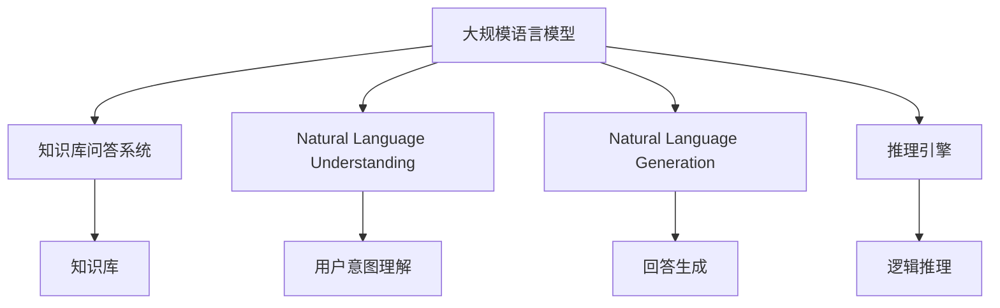
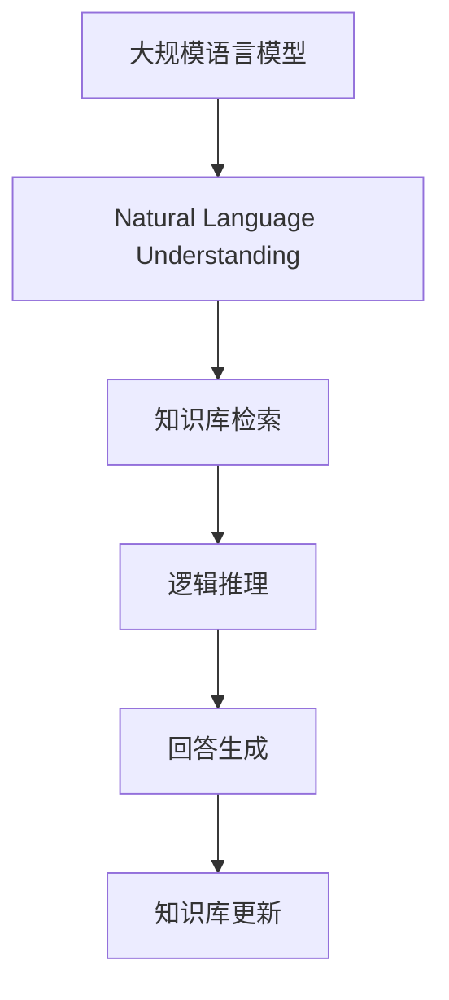
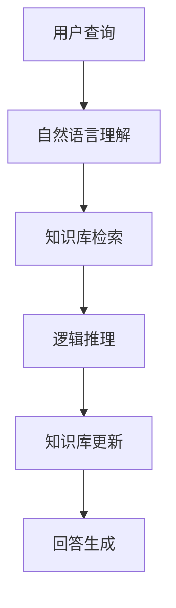
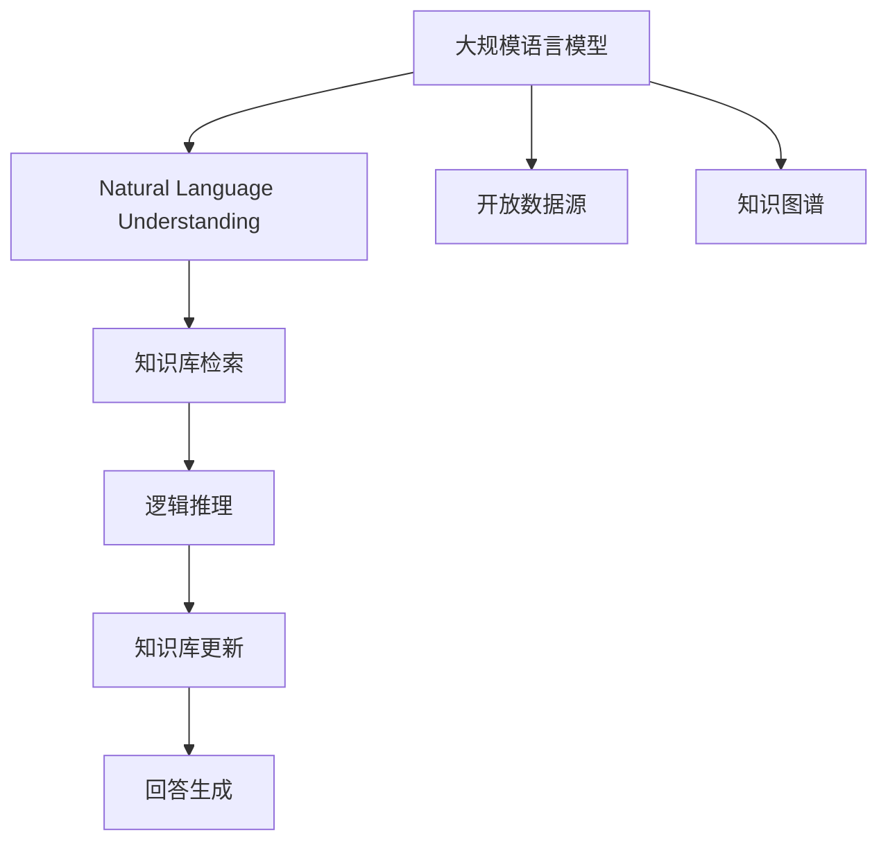

                 

# 大规模语言模型从理论到实践 知识库问答系统实践

> 关键词：大规模语言模型,知识库问答系统,自然语言理解(NLU),深度学习,Transformer,BERT,知识图谱,推理引擎

## 1. 背景介绍

### 1.1 问题由来
随着人工智能技术的不断进步，知识库问答系统成为NLP领域的一个热门研究方向。传统的知识库通常由结构化的关系型数据库构成，其特点是数据结构稳定、查询语义明确。但是，传统知识库在数据采集、维护更新等方面存在诸多局限性，难以适应开放数据源和快速变化的信息环境。

为了解决这些挑战，研究者们提出了基于大规模语言模型的知识库问答系统。大规模语言模型通过在大量无标签文本语料上进行自监督预训练，学习到丰富的语言知识，具备强大的自然语言理解和生成能力。将大规模语言模型应用于知识库问答系统，可以有效弥补传统知识库的缺陷，提升系统的开放性和灵活性。

### 1.2 问题核心关键点
本文聚焦于基于大规模语言模型的知识库问答系统，旨在解决以下几个核心问题：

- 如何在大规模语言模型的基础上，构建高效的知识库问答系统？
- 如何优化模型的推理能力，使其能够准确地从知识库中检索和生成信息？
- 如何提升系统的可扩展性和鲁棒性，适应多样化的应用场景？
- 如何保证系统的安全性和隐私保护，防止有害信息的传播？

这些关键点构成了知识库问答系统的核心技术框架，同时也是本文的主要研究对象。

### 1.3 问题研究意义
研究基于大规模语言模型的知识库问答系统，对于提升信息检索和知识获取的智能化水平，构建更加开放、灵活、高效的信息服务系统，具有重要意义：

1. 增强系统的开放性和适应性。大规模语言模型能够处理非结构化的文本数据，适应用户多样化的查询需求，提升系统的灵活性和可扩展性。
2. 提升信息检索和生成的准确性。大规模语言模型能够更好地理解和生成自然语言，实现更精准的查询匹配和信息生成。
3. 加速知识的获取和更新。大规模语言模型能够自动从互联网等开放数据源中获取知识，并进行实时更新，保持知识的现时性。
4. 促进信息服务的创新应用。基于知识库问答系统，可以构建各类智能应用，如智能客服、智能助手、智能搜索等，提升信息服务的用户体验。
5. 保障信息安全和隐私保护。知识库问答系统需要处理敏感信息，通过合适的模型设计和机制保障，确保系统的安全性和隐私保护。

## 2. 核心概念与联系

### 2.1 核心概念概述

为更好地理解基于大规模语言模型的知识库问答系统，本节将介绍几个密切相关的核心概念：

- 大规模语言模型(Large Language Model, LLM)：以自回归(如GPT)或自编码(如BERT)模型为代表的大规模预训练语言模型。通过在大规模无标签文本语料上进行预训练，学习到丰富的语言知识，具备强大的语言理解和生成能力。

- 知识库(Knowledge Base)：存储结构化的实体关系数据，通常由三元组表示。知识库是知识库问答系统的核心组件，用于存储和检索知识。

- 知识库问答系统(KBQA)：通过自然语言查询，从知识库中检索和生成相关信息。知识库问答系统利用自然语言理解和推理技术，实现知识库的智能检索和信息生成。

- 自然语言理解(Natural Language Understanding, NLU)：从文本中提取语义信息，理解用户意图和查询需求。NLU是知识库问答系统的关键技术之一。

- 自然语言生成(Natural Language Generation, NLG)：将结构化数据转化为自然语言文本，实现信息生成和回答生成。NLG是知识库问答系统的核心输出模块。

- 推理引擎(Inference Engine)：根据知识库中的信息，推导出用户查询的逻辑结果，实现精确的知识检索和生成。推理引擎是知识库问答系统的核心组件之一。

这些核心概念之间的逻辑关系可以通过以下Mermaid流程图来展示：



这个流程图展示了大规模语言模型和知识库问答系统的核心组件及其关系：

1. 大规模语言模型通过自然语言理解模块理解用户查询，通过自然语言生成模块生成回答。
2. 推理引擎根据知识库中的信息，推导出用户查询的逻辑结果，实现精确的知识检索和生成。
3. 知识库是知识库问答系统的核心组件，用于存储和检索知识。

### 2.2 概念间的关系

这些核心概念之间存在着紧密的联系，形成了知识库问答系统的完整生态系统。下面我通过几个Mermaid流程图来展示这些概念之间的关系。

#### 2.2.1 知识库问答系统的工作流程


这个流程图展示了知识库问答系统的工作流程：

1. 用户通过自然语言查询系统，提出问题或需求。
2. 自然语言理解模块将用户查询转化为机器可理解的形式。
3. 知识库检索模块在知识库中检索相关信息。
4. 逻辑推理模块根据检索结果，推导出用户查询的逻辑结果。
5. 自然语言生成模块将推理结果转化为自然语言回答，返回给用户。

#### 2.2.2 大规模语言模型在知识库问答系统中的应用



这个流程图展示了大规模语言模型在知识库问答系统中的应用：

1. 大规模语言模型通过自然语言理解模块理解用户查询。
2. 知识库检索模块在知识库中检索相关信息。
3. 逻辑推理模块根据检索结果，推导出用户查询的逻辑结果。
4. 自然语言生成模块将推理结果转化为自然语言回答，返回给用户。
5. 大规模语言模型能够自动从互联网等开放数据源中获取知识，并更新知识库，保持知识的现时性。

#### 2.2.3 推理引擎在知识库问答系统中的应用



这个流程图展示了推理引擎在知识库问答系统中的应用：

1. 用户通过自然语言查询系统，提出问题或需求。
2. 自然语言理解模块将用户查询转化为机器可理解的形式。
3. 知识库检索模块在知识库中检索相关信息。
4. 逻辑推理模块根据检索结果，推导出用户查询的逻辑结果。
5. 自然语言生成模块将推理结果转化为自然语言回答，返回给用户。

### 2.3 核心概念的整体架构

最后，我们用一个综合的流程图来展示这些核心概念在大规模语言模型知识库问答系统中的整体架构：



这个综合流程图展示了从大规模语言模型到知识库问答系统的完整过程：

1. 大规模语言模型通过自然语言理解模块理解用户查询。
2. 知识库检索模块在知识库中检索相关信息。
3. 逻辑推理模块根据检索结果，推导出用户查询的逻辑结果。
4. 自然语言生成模块将推理结果转化为自然语言回答，返回给用户。
5. 大规模语言模型能够自动从互联网等开放数据源中获取知识，并更新知识库，保持知识的现时性。

通过这些流程图，我们可以更清晰地理解基于大规模语言模型的知识库问答系统的核心组件和工作流程，为后续深入讨论具体的技术细节奠定基础。

## 3. 核心算法原理 & 具体操作步骤
### 3.1 算法原理概述

基于大规模语言模型的知识库问答系统，其核心思想是：将大规模语言模型作为自然语言理解和生成的工具，结合知识库和推理引擎，实现高效的知识检索和信息生成。

形式化地，假设大规模语言模型为 $M_{\theta}$，其中 $\theta$ 为预训练得到的模型参数。给定知识库 $K=\{(R_i, O_i)\}_{i=1}^N$，其中 $R_i$ 为三元组（实体，关系，实体），$O_i$ 为三元组对应的真实事实。知识库问答系统的目标是，在给定用户查询 $q$ 的情况下，从知识库中检索出最相关的信息，生成自然语言回答。

知识库问答系统的数学模型可以表示为：

$$
\hat{A}=\mathop{\arg\max}_{A} P(A|q, K)
$$

其中 $P(A|q, K)$ 为在给定用户查询 $q$ 和知识库 $K$ 的条件下，生成回答 $A$ 的概率。通常，我们使用基于最大似然估计的方法训练模型，最大化条件概率 $P(A|q, K)$。

通过梯度下降等优化算法，知识库问答系统的训练过程不断更新模型参数 $\theta$，最小化损失函数 $\mathcal{L}$，使得模型输出逼近最优回答。由于 $\theta$ 已经通过预训练获得了较好的初始化，因此即便在小规模数据集上训练，也能较快收敛到理想模型。

### 3.2 算法步骤详解

基于大规模语言模型的知识库问答系统一般包括以下几个关键步骤：

**Step 1: 准备预训练模型和数据集**
- 选择合适的预训练语言模型 $M_{\theta}$ 作为初始化参数，如 BERT、GPT 等。
- 准备知识库 $K$，并将其转换为模型可接受的格式，如三元组表示。
- 收集标注数据集 $D=\{(q_i, a_i)\}_{i=1}^N$，其中 $q_i$ 为用户查询，$a_i$ 为人工标注的准确回答。

**Step 2: 设计任务适配层**
- 根据任务类型，设计合适的自然语言理解模块和推理引擎。
- 对于问答任务，通常使用阅读理解模型（如 BERT-based Reader）作为自然语言理解模块。
- 对于推理任务，设计逻辑推理引擎（如基于知识图谱的推理引擎）。

**Step 3: 设置微调超参数**
- 选择合适的优化算法及其参数，如 AdamW、SGD 等，设置学习率、批大小、迭代轮数等。
- 设置正则化技术及强度，包括权重衰减、Dropout、Early Stopping 等。
- 确定冻结预训练参数的策略，如仅微调顶层，或全部参数都参与微调。

**Step 4: 执行梯度训练**
- 将训练集数据分批次输入模型，前向传播计算损失函数。
- 反向传播计算参数梯度，根据设定的优化算法和学习率更新模型参数。
- 周期性在验证集上评估模型性能，根据性能指标决定是否触发 Early Stopping。
- 重复上述步骤直到满足预设的迭代轮数或 Early Stopping 条件。

**Step 5: 测试和部署**
- 在测试集上评估知识库问答系统 $M_{\hat{\theta}}$ 的性能，对比微调前后的精度提升。
- 使用微调后的模型对新样本进行推理预测，集成到实际的应用系统中。
- 持续收集新的数据，定期重新微调模型，以适应数据分布的变化。

以上是基于大规模语言模型的知识库问答系统的一般流程。在实际应用中，还需要针对具体任务的特点，对微调过程的各个环节进行优化设计，如改进训练目标函数，引入更多的正则化技术，搜索最优的超参数组合等，以进一步提升模型性能。

### 3.3 算法优缺点

基于大规模语言模型的知识库问答系统具有以下优点：
1. 精度高。通过大规模语言模型的预训练，知识库问答系统具备强大的语言理解能力和生成能力，能够实现高精度的信息检索和生成。
2. 可扩展性强。大规模语言模型能够处理开放数据源和多样化的查询需求，提升系统的灵活性和可扩展性。
3. 鲁棒性好。通过引入知识库和推理引擎，知识库问答系统能够较好地处理噪声数据和模糊查询，避免过拟合和错误回答。
4. 用户友好。知识库问答系统能够自然流畅地理解用户查询，并生成易读的自然语言回答，提升用户体验。

同时，该系统也存在一定的局限性：
1. 依赖预训练模型。知识库问答系统的性能高度依赖于预训练模型的质量，预训练模型的偏置和局限性可能影响系统性能。
2. 数据标注成本高。知识库问答系统需要大量高质量的标注数据，标注成本较高。
3. 知识库更新困难。知识库需要持续更新，维护成本较高，更新后的知识库需要重新训练模型。
4. 推理复杂度高。逻辑推理引擎的复杂性可能导致推理效率低下，影响系统响应速度。

尽管存在这些局限性，但就目前而言，基于大规模语言模型的知识库问答系统仍然是NLP领域的重要范式，具有良好的应用前景。

### 3.4 算法应用领域

基于知识库问答系统的自然语言处理技术，已经在诸多领域得到了广泛的应用，例如：

- 智能客服系统：通过知识库问答系统构建智能客服，提升客户咨询体验和问题解决效率。
- 信息检索系统：通过知识库问答系统构建信息检索系统，提升信息检索的准确性和相关性。
- 医疗问答系统：通过知识库问答系统构建医疗问答系统，提升医生的诊断和治疗建议。
- 金融咨询系统：通过知识库问答系统构建金融咨询系统，提供金融产品和服务的咨询。
- 教育辅导系统：通过知识库问答系统构建教育辅导系统，提供学习辅导和知识点的解答。
- 智能家居系统：通过知识库问答系统构建智能家居系统，提升家居设备的智能化和自动化水平。

除了上述这些经典应用外，知识库问答系统还被创新性地应用到更多场景中，如可控文本生成、常识推理、代码生成、数据增强等，为NLP技术带来了全新的突破。随着预训练模型和知识库问答技术的不断进步，相信NLP技术将在更广阔的应用领域大放异彩。

## 4. 数学模型和公式 & 详细讲解
### 4.1 数学模型构建

本节将使用数学语言对基于大规模语言模型的知识库问答系统进行更加严格的刻画。

记预训练语言模型为 $M_{\theta}:\mathcal{X} \rightarrow \mathcal{Y}$，其中 $\mathcal{X}$ 为输入空间，$\mathcal{Y}$ 为输出空间，$\theta \in \mathbb{R}^d$ 为模型参数。假设知识库问答系统的训练集为 $D=\{(q_i, a_i)\}_{i=1}^N$，其中 $q_i$ 为用户查询，$a_i$ 为准确回答。

定义知识库问答系统的损失函数为：

$$
\mathcal{L}(\theta) = -\frac{1}{N} \sum_{i=1}^N \log P(a_i|q_i, K)
$$

其中 $P(a_i|q_i, K)$ 为在给定用户查询 $q_i$ 和知识库 $K$ 的条件下，生成准确回答 $a_i$ 的概率。在实践中，我们通常使用基于最大似然估计的方法训练模型，最大化条件概率 $P(a_i|q_i, K)$。

### 4.2 公式推导过程

以下我们以问答任务为例，推导最大似然估计的损失函数及其梯度的计算公式。

假设用户查询 $q$，知识库 $K$ 中的相关信息为 $\{(R_i, O_i)\}_{i=1}^M$，其中 $R_i=(E_i, R, E_j)$，$O_i$ 为 $R_i$ 对应的真实事实。自然语言理解模块将查询 $q$ 转化为机器可理解的形式，推理引擎根据知识库 $K$ 中相关信息，推导出用户查询 $q$ 的逻辑结果 $A$。自然语言生成模块将推理结果 $A$ 转化为自然语言回答。

知识库问答系统的训练过程为：

1. 将查询 $q$ 输入自然语言理解模块，得到机器可理解的形式 $\overline{q}$。
2. 推理引擎根据知识库 $K$ 中相关信息 $\{(R_i, O_i)\}_{i=1}^M$，推导出用户查询 $q$ 的逻辑结果 $A$。
3. 自然语言生成模块将推理结果 $A$ 转化为自然语言回答 $a$。
4. 损失函数 $\mathcal{L}(\theta)$ 计算准确回答 $a$ 的概率 $P(a|\overline{q}, K)$，并反向传播更新模型参数 $\theta$。

具体推导如下：

假设自然语言理解模块将查询 $q$ 转化为机器可理解的形式 $\overline{q}$，推理引擎推导出用户查询 $q$ 的逻辑结果 $A$。自然语言生成模块将推理结果 $A$ 转化为自然语言回答 $a$。则最大似然估计的损失函数为：

$$
\mathcal{L}(\theta) = -\frac{1}{N} \sum_{i=1}^N \log P(a_i|\overline{q_i}, K)
$$

其中 $P(a_i|\overline{q_i}, K)$ 为在给定机器可理解形式的查询 $\overline{q_i}$ 和知识库 $K$ 的条件下，生成准确回答 $a_i$ 的概率。

在训练过程中，我们通过梯度下降等优化算法不断更新模型参数 $\theta$，最小化损失函数 $\mathcal{L}(\theta)$，使得模型输出逼近最优回答。具体推导如下：

假设自然语言理解模块将查询 $q$ 转化为机器可理解的形式 $\overline{q}$，推理引擎推导出用户查询 $q$ 的逻辑结果 $A$。自然语言生成模块将推理结果 $A$ 转化为自然语言回答 $a$。则最大似然估计的损失函数为：

$$
\mathcal{L}(\theta) = -\frac{1}{N} \sum_{i=1}^N \log P(a_i|\overline{q_i}, K)
$$

其中 $P(a_i|\overline{q_i}, K)$ 为在给定机器可理解形式的查询 $\overline{q_i}$ 和知识库 $K$ 的条件下，生成准确回答 $a_i$ 的概率。

通过反向传播算法，计算参数 $\theta$ 的梯度，根据梯度下降等优化算法更新模型参数，使得模型输出逼近最优回答。具体推导如下：

假设自然语言理解模块将查询 $q$ 转化为机器可理解的形式 $\overline{q}$，推理引擎推导出用户查询 $q$ 的逻辑结果 $A$。自然语言生成模块将推理结果 $A$ 转化为自然语言回答 $a$。则最大似然估计的损失函数为：

$$
\mathcal{L}(\theta) = -\frac{1}{N} \sum_{i=1}^N \log P(a_i|\overline{q_i}, K)
$$

其中 $P(a_i|\overline{q_i}, K)$ 为在给定机器可理解形式的查询 $\overline{q_i}$ 和知识库 $K$ 的条件下，生成准确回答 $a_i$ 的概率。

通过反向传播算法，计算参数 $\theta$ 的梯度，根据梯度下降等优化算法更新模型参数，使得模型输出逼近最优回答。具体推导如下：

假设自然语言理解模块将查询 $q$ 转化为机器可理解的形式 $\overline{q}$，推理引擎推导出用户查询 $q$ 的逻辑结果 $A$。自然语言生成模块将推理结果 $A$ 转化为自然语言回答 $a$。则最大似然估计的损失函数为：

$$
\mathcal{L}(\theta) = -\frac{1}{N} \sum_{i=1}^N \log P(a_i|\overline{q_i}, K)
$$

其中 $P(a_i|\overline{q_i}, K)$ 为在给定机器可理解形式的查询 $\overline{q_i}$ 和知识库 $K$ 的条件下，生成准确回答 $a_i$ 的概率。

通过反向传播算法，计算参数 $\theta$ 的梯度，根据梯度下降等优化算法更新模型参数，使得模型输出逼近最优回答。

## 5. 项目实践：代码实例和详细解释说明
### 5.1 开发环境搭建

在进行知识库问答系统开发前，我们需要准备好开发环境。以下是使用Python进行PyTorch开发的环境配置流程：

1. 安装Anaconda：从官网下载并安装Anaconda，用于创建独立的Python环境。

2. 创建并激活虚拟环境：
```bash
conda create -n pytorch-env python=3.8 
conda activate pytorch-env
```

3. 安装PyTorch：根据CUDA版本，从官网获取对应的安装命令。例如：
```bash
conda install pytorch torchvision torchaudio cudatoolkit=11.1 -c pytorch -c conda-forge
```

4. 安装Transformers库：
```bash
pip install transformers
```

5. 安装各类工具包：
```bash
pip install numpy pandas scikit-learn matplotlib tqdm jupyter notebook ipython
```

完成上述步骤后，即可在`pytorch-env`环境中开始知识库问答系统的开发。

### 5.2 源代码详细实现

下面我们以问答系统为例，给出使用Transformers库对BERT模型进行知识库问答系统开发的PyTorch代码实现。

首先，定义问答系统的数据处理函数：

```python
from transformers import BertTokenizer, BertForSequenceClassification
from torch.utils.data import Dataset
import torch

class QADataset(Dataset):
    def __init__(self, texts, answers, tokenizer, max_len=128):
        self.texts = texts
        self.answers = answers
        self.tokenizer = tokenizer
        self.max_len = max_len
        
    def __len__(self):
        return len(self.texts)
    
    def __getitem__(self, item):
        text = self.texts[item]
        answer = self.answers[item]
        
        encoding = self.tokenizer(text, return_tensors='pt', max_length=self.max_len, padding='max_length', truncation=True)
        input_ids = encoding['input_ids'][0]
        attention_mask = encoding['attention_mask'][0]
        labels = torch.tensor(answer, dtype=torch.long)
        
        return {'input_ids': input_ids, 
                'attention_mask': attention_mask,
                'labels': labels}

# 加载预训练模型和数据集
tokenizer = BertTokenizer.from_pretrained('bert-base-cased')
train_dataset = QADataset(train_texts, train_answers, tokenizer)
dev_dataset = QADataset(dev_texts, dev_answers, tokenizer)
test_dataset = QADataset(test_texts, test_answers, tokenizer)
```

然后，定义模型和优化器：

```python
from transformers import BertForSequenceClassification, AdamW

model = BertForSequenceClassification.from_pretrained('bert-base-cased', num_labels=2)

optimizer = AdamW(model.parameters(), lr=2e-5)
```

接着，定义训练和评估函数：

```python
from torch.utils.data import DataLoader
from tqdm import tqdm
from sklearn.metrics import accuracy_score

device = torch.device('cuda') if torch.cuda.is_available() else torch.device('cpu')
model.to(device)

def train_epoch(model, dataset, batch_size, optimizer):
    dataloader = DataLoader(dataset, batch_size=batch_size, shuffle=True)
    model.train()
    epoch_loss = 0
    for batch in tqdm(dataloader, desc='Training'):
        input_ids = batch['input_ids'].to(device)
        attention_mask = batch['attention_mask'].to(device)
        labels = batch['labels'].to(device)
        model.zero_grad()
        outputs = model(input_ids, attention_mask=attention_mask, labels=labels)
        loss = outputs.loss
        epoch_loss += loss.item()
        loss.backward()
        optimizer.step()
    return epoch_loss / len(dataloader)

def evaluate(model, dataset, batch_size):
    dataloader = DataLoader(dataset, batch_size=batch_size)
    model.eval()
    preds, labels = [], []
    with torch.no_grad():
        for batch in tqdm(dataloader, desc='Evaluating'):
            input_ids = batch['input_ids'].to(device)
            attention_mask = batch['attention_mask'].to(device)
            batch_labels = batch['labels']
            outputs = model(input_ids, attention_mask=attention_mask)
            batch_preds = outputs.logits.argmax(dim=2).to('cpu').tolist()
            batch_labels = batch_labels.to('cpu').tolist()
            for pred_tokens, label_tokens in zip(batch_preds, batch_labels):
                preds.append(pred_tokens)
                labels.append(label_tokens)
                
    print(accuracy_score(labels, preds))
```

最后，启动训练流程并在测试集上评估：

```python
epochs = 5
batch_size = 16

for epoch in range(epochs):
    loss = train_epoch(model, train_dataset, batch_size

