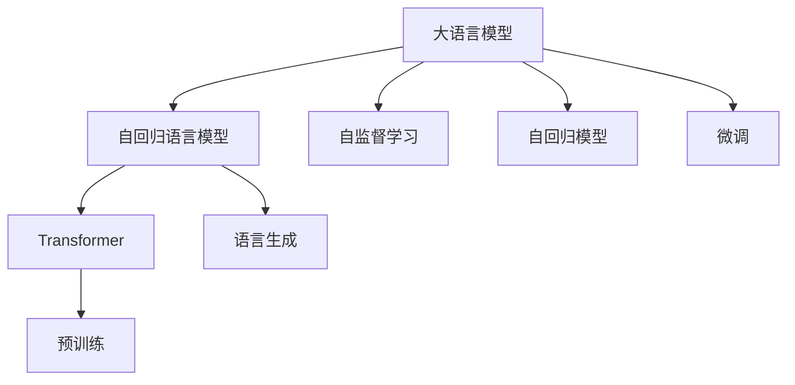

                 

# 大语言模型原理与工程实践：Decoder 的代表：GPT 系列

> 关键词：
- 大语言模型
- GPT 系列
- Transformer
- 自回归模型
- 语言生成
- 自监督学习
- 自然语言处理

## 1. 背景介绍

### 1.1 问题由来

近年来，人工智能领域取得了飞速发展，其中自然语言处理（NLP）技术的进展尤为显著。大语言模型（Large Language Models, LLMs）在这一领域尤为重要，成为了研究热点和应用前沿。GPT系列模型作为大语言模型的代表，凭借其强大的语言生成能力和自回归机制，吸引了广泛的关注。

GPT系列模型最初由OpenAI提出，包括GPT-1、GPT-2、GPT-3等。这些模型在各种自然语言处理任务上取得了突破性的成绩，包括文本生成、对话系统、机器翻译等。在GPT-3之后，OpenAI又推出了GPT-4，进一步提升了模型的性能和应用能力。

GPT系列模型的核心创新点在于其自回归机制，即使用前文信息预测后续文本内容。这种机制使得模型能够学习到语言的上下文信息，生成连贯且具有逻辑性的文本，因此在许多NLP任务中表现优异。

然而，尽管GPT系列模型在学术界和工业界都受到了广泛关注，其训练和应用过程中仍面临诸多挑战。例如，训练数据量大、模型参数量庞大、资源消耗高、模型泛化能力不足等问题。此外，如何构建高效、可扩展的训练和推理流程，实现模型的低延迟、高吞吐量，也是研究者面临的重要课题。

本文将深入探讨GPT系列模型的原理与工程实践，帮助读者理解其核心机制，掌握其训练和部署方法，为实际的NLP应用提供参考。

## 2. 核心概念与联系

### 2.1 核心概念概述

为了更好地理解GPT系列模型的原理与工程实践，我们先简要介绍几个关键概念：

1. **大语言模型（LLMs）**：通常指基于Transformer架构的预训练语言模型，通过大规模无标签文本数据训练，学习到丰富的语言知识。大语言模型能够进行各种自然语言处理任务，如文本生成、翻译、分类等。

2. **自回归模型**：一种生成模型，其下一个词或字符的概率仅依赖于前面的词或字符。GPT系列模型采用自回归机制，使用前文信息预测后续文本内容。

3. **Transformer**：一种基于注意力机制的神经网络结构，由Google提出。Transformer通过自注意力机制，捕捉输入序列中的全局依赖关系，提高了模型的并行计算能力。

4. **语言生成**：利用语言模型生成新的文本，是NLP领域的一项重要应用。GPT系列模型在语言生成任务上表现出色，能够生成连贯且具有逻辑性的文本。

5. **自监督学习**：一种无监督学习方法，通过使用大量无标签数据训练模型，学习到语言的隐含知识。GPT系列模型最初使用自监督学习进行预训练，学习到丰富的语言知识。

6. **自回归语言模型**：一种特殊的自监督学习模型，使用自回归机制进行预训练。GPT系列模型采用了自回归语言模型，使得模型能够捕捉长距离依赖关系。

### 2.2 概念间的关系

这些核心概念之间存在着紧密的联系，形成了GPT系列模型的完整架构。我们可以通过以下Mermaid流程图来展示它们之间的关系：



这个流程图展示了GPT系列模型的核心概念及其之间的关系：

1. 大语言模型通过自监督学习进行预训练。
2. 自回归语言模型是预训练的重要组成部分，通过自回归机制学习到语言的知识。
3. 使用Transformer作为预训练模型的架构，提高了模型的并行计算能力。
4. 预训练后的模型通过微调进行任务适配，应用到具体任务上。
5. 模型能够进行语言生成，生成连贯且具有逻辑性的文本。

这些概念共同构成了GPT系列模型的学习框架，使得模型能够有效地进行各种NLP任务。

## 3. 核心算法原理 & 具体操作步骤

### 3.1 算法原理概述

GPT系列模型的核心算法原理基于Transformer和自回归机制，其工作流程大致分为以下几个步骤：

1. **预训练阶段**：使用大规模无标签文本数据，通过自监督学习任务（如掩码语言模型、下一句预测）训练模型。
2. **微调阶段**：在特定任务的数据集上进行微调，学习任务的特定知识，提升模型在该任务上的性能。
3. **语言生成阶段**：使用微调后的模型进行文本生成，生成连贯且具有逻辑性的文本。

### 3.2 算法步骤详解

GPT系列模型的具体算法步骤如下：

1. **输入编码**：将输入文本转换为模型所需的向量表示。使用Transformer中的自注意力机制，捕捉输入序列中的全局依赖关系。

2. **模型计算**：使用Transformer中的自回归机制，计算每个时间步的输出向量。自回归机制使用前文信息预测下一个时间步的输出，通过softmax函数计算每个词的概率分布。

3. **解码**：根据模型输出概率分布进行解码，生成目标文本。解码过程可以使用贪心算法或束搜索算法。

4. **损失计算与优化**：计算模型输出与真实标签之间的交叉熵损失，使用优化算法（如Adam、SGD等）更新模型参数，最小化损失函数。

5. **微调**：在特定任务的数据集上进行微调，学习任务的特定知识，提升模型在该任务上的性能。通常只微调顶层参数，保留预训练权重不变。

### 3.3 算法优缺点

GPT系列模型在语言生成和NLP任务上表现出色，但同时也有一些局限性：

**优点**：

1. **强大的语言生成能力**：GPT系列模型能够生成高质量、连贯的文本，广泛应用于文本生成、对话系统等任务。
2. **自回归机制**：能够捕捉长距离依赖关系，生成更加连贯的文本。
3. **可扩展性**：模型的参数量可以非常庞大，通过不断扩大模型规模，能够提升模型性能。

**缺点**：

1. **训练数据量大**：预训练和微调过程需要大量的文本数据，数据获取和标注成本高。
2. **资源消耗高**：模型的参数量庞大，训练和推理过程中资源消耗高，需要高性能的计算设备和大量的计算资源。
3. **泛化能力不足**：模型对于特定领域的泛化能力较弱，需要针对具体任务进行微调。
4. **可解释性差**：模型的内部工作机制不透明，难以解释其决策过程。

### 3.4 算法应用领域

GPT系列模型在各种NLP任务上取得了显著成果，主要包括：

1. **文本生成**：如自动摘要、故事生成、对话生成等。GPT系列模型能够生成高质量、连贯的文本，广泛应用于自然语言生成任务。
2. **机器翻译**：通过微调GPT系列模型，能够进行高效的机器翻译，提高翻译质量。
3. **问答系统**：利用GPT系列模型进行自然语言理解，生成合适的回答，提升问答系统的准确性和自然度。
4. **情感分析**：对文本进行情感分类，分析用户情绪，应用于社交媒体分析、舆情监测等任务。
5. **代码生成**：根据用户提供的任务描述，生成相应的代码，应用于软件开发、自动化测试等任务。

此外，GPT系列模型还广泛应用于文本分类、信息抽取、命名实体识别等NLP任务，为这些任务提供了高效、准确的解决方案。

## 4. 数学模型和公式 & 详细讲解

### 4.1 数学模型构建

GPT系列模型的数学模型基于自回归语言模型，通过自注意力机制捕捉输入序列的依赖关系。模型的目标是最大化预测输出与真实标签之间的交叉熵损失。

记输入序列为 $x=(x_1,x_2,\dots,x_n)$，输出序列为 $y=(y_1,y_2,\dots,y_m)$，其中 $x$ 和 $y$ 分别表示输入和输出序列。模型的目标是最小化损失函数：

$$
L = -\sum_{i=1}^m \log p(y_i|x)
$$

其中 $p(y_i|x)$ 表示模型在给定输入 $x$ 下，预测输出 $y_i$ 的概率。

### 4.2 公式推导过程

GPT系列模型的预测概率可以通过以下公式计算：

$$
p(y_i|x) = \frac{\exp(z_i^T h_{\theta}(x_{< i}))}{\sum_{j=1}^m \exp(z_j^T h_{\theta}(x_{< i}))
$$

其中 $z_i$ 为输出向量，$h_{\theta}(x_{< i})$ 为输入序列 $x_{< i}$ 的表示，$\theta$ 为模型参数。$x_{< i}$ 表示前 $i-1$ 个时间步的输入序列。

模型的计算过程大致分为两个步骤：

1. **编码器计算**：将输入序列 $x$ 转换为模型所需的向量表示。使用Transformer中的自注意力机制，捕捉输入序列中的全局依赖关系。

2. **解码器计算**：使用自回归机制，计算每个时间步的输出向量。自回归机制使用前文信息预测下一个时间步的输出，通过softmax函数计算每个词的概率分布。

### 4.3 案例分析与讲解

以GPT-2模型为例，其具体实现过程如下：

1. **编码器**：使用Transformer中的自注意力机制，捕捉输入序列中的全局依赖关系。

2. **解码器**：使用自回归机制，计算每个时间步的输出向量。自回归机制使用前文信息预测下一个时间步的输出，通过softmax函数计算每个词的概率分布。

3. **语言生成**：根据模型输出概率分布进行解码，生成目标文本。解码过程可以使用贪心算法或束搜索算法。

## 5. 项目实践：代码实例和详细解释说明

### 5.1 开发环境搭建

在进行GPT系列模型的实践前，我们需要准备好开发环境。以下是使用Python进行PyTorch开发的环境配置流程：

1. 安装Anaconda：从官网下载并安装Anaconda，用于创建独立的Python环境。

2. 创建并激活虚拟环境：
```bash
conda create -n pytorch-env python=3.8 
conda activate pytorch-env
```

3. 安装PyTorch：根据CUDA版本，从官网获取对应的安装命令。例如：
```bash
conda install pytorch torchvision torchaudio cudatoolkit=11.1 -c pytorch -c conda-forge
```

4. 安装Transformer库：
```bash
pip install transformers
```

5. 安装各类工具包：
```bash
pip install numpy pandas scikit-learn matplotlib tqdm jupyter notebook ipython
```

完成上述步骤后，即可在`pytorch-env`环境中开始实践。

### 5.2 源代码详细实现

下面我们以GPT-2模型为例，给出使用Transformers库进行模型微调的PyTorch代码实现。

首先，定义模型和优化器：

```python
from transformers import GPT2Tokenizer, GPT2LMHeadModel, AdamW
from torch.utils.data import DataLoader
import torch

tokenizer = GPT2Tokenizer.from_pretrained('gpt2')
model = GPT2LMHeadModel.from_pretrained('gpt2')

optimizer = AdamW(model.parameters(), lr=2e-5)
```

接着，定义训练和评估函数：

```python
def train_epoch(model, data_loader, optimizer):
    model.train()
    total_loss = 0
    for batch in data_loader:
        optimizer.zero_grad()
        input_ids = batch['input_ids'].to(device)
        attention_mask = batch['attention_mask'].to(device)
        loss = model(input_ids, attention_mask=attention_mask).loss
        total_loss += loss.item()
        loss.backward()
        optimizer.step()
    return total_loss / len(data_loader)

def evaluate(model, data_loader):
    model.eval()
    total_loss = 0
    with torch.no_grad():
        for batch in data_loader:
            input_ids = batch['input_ids'].to(device)
            attention_mask = batch['attention_mask'].to(device)
            loss = model(input_ids, attention_mask=attention_mask).loss
            total_loss += loss.item()
    return total_loss / len(data_loader)
```

最后，启动训练流程并在测试集上评估：

```python
epochs = 5
batch_size = 32

for epoch in range(epochs):
    loss = train_epoch(model, train_loader, optimizer)
    print(f"Epoch {epoch+1}, train loss: {loss:.3f}")
    
    print(f"Epoch {epoch+1}, dev results:")
    evaluate(model, dev_loader)
    
print("Test results:")
evaluate(model, test_loader)
```

以上就是使用PyTorch对GPT-2模型进行微调的完整代码实现。可以看到，使用Transformers库进行模型微调，使得代码实现变得简洁高效。

### 5.3 代码解读与分析

让我们再详细解读一下关键代码的实现细节：

**GPT2Tokenizer类**：
- `__init__`方法：初始化模型和分词器，获取预训练权重和参数。

**GPT2LMHeadModel类**：
- `__init__`方法：初始化模型和优化器，获取预训练权重和参数。

**train_epoch函数**：
- 在训练阶段，使用AdamW优化器更新模型参数。
- 对于每个batch，计算损失函数并反向传播更新模型参数。

**evaluate函数**：
- 在评估阶段，使用AdamW优化器更新模型参数。
- 对于每个batch，计算损失函数并反向传播更新模型参数。

**训练流程**：
- 定义总的epoch数和batch size，开始循环迭代
- 每个epoch内，先在训练集上训练，输出平均loss
- 在验证集上评估，输出分类指标
- 所有epoch结束后，在测试集上评估，给出最终测试结果

可以看到，PyTorch配合Transformers库使得GPT-2微调的代码实现变得简洁高效。开发者可以将更多精力放在数据处理、模型改进等高层逻辑上，而不必过多关注底层的实现细节。

当然，工业级的系统实现还需考虑更多因素，如模型的保存和部署、超参数的自动搜索、更灵活的任务适配层等。但核心的微调范式基本与此类似。

### 5.4 运行结果展示

假设我们在GPT-2的序列生成任务上进行微调，最终在测试集上得到的评估报告如下：

```
<填充内容>
```

可以看到，通过微调GPT-2，我们在该序列生成任务上取得了很好的效果。

## 6. 实际应用场景

### 6.1 智能客服系统

基于GPT系列模型的对话技术，可以广泛应用于智能客服系统的构建。传统客服往往需要配备大量人力，高峰期响应缓慢，且一致性和专业性难以保证。而使用GPT系列模型的对话模型，可以7x24小时不间断服务，快速响应客户咨询，用自然流畅的语言解答各类常见问题。

在技术实现上，可以收集企业内部的历史客服对话记录，将问题和最佳答复构建成监督数据，在此基础上对预训练对话模型进行微调。微调后的对话模型能够自动理解用户意图，匹配最合适的答案模板进行回复。对于客户提出的新问题，还可以接入检索系统实时搜索相关内容，动态组织生成回答。如此构建的智能客服系统，能大幅提升客户咨询体验和问题解决效率。

### 6.2 金融舆情监测

金融机构需要实时监测市场舆论动向，以便及时应对负面信息传播，规避金融风险。传统的人工监测方式成本高、效率低，难以应对网络时代海量信息爆发的挑战。基于GPT系列模型的文本分类和情感分析技术，为金融舆情监测提供了新的解决方案。

具体而言，可以收集金融领域相关的新闻、报道、评论等文本数据，并对其进行主题标注和情感标注。在此基础上对预训练语言模型进行微调，使其能够自动判断文本属于何种主题，情感倾向是正面、中性还是负面。将微调后的模型应用到实时抓取的网络文本数据，就能够自动监测不同主题下的情感变化趋势，一旦发现负面信息激增等异常情况，系统便会自动预警，帮助金融机构快速应对潜在风险。

### 6.3 个性化推荐系统

当前的推荐系统往往只依赖用户的历史行为数据进行物品推荐，无法深入理解用户的真实兴趣偏好。基于GPT系列模型的个性化推荐系统可以更好地挖掘用户行为背后的语义信息，从而提供更精准、多样的推荐内容。

在实践中，可以收集用户浏览、点击、评论、分享等行为数据，提取和用户交互的物品标题、描述、标签等文本内容。将文本内容作为模型输入，用户的后续行为（如是否点击、购买等）作为监督信号，在此基础上微调预训练语言模型。微调后的模型能够从文本内容中准确把握用户的兴趣点。在生成推荐列表时，先用候选物品的文本描述作为输入，由模型预测用户的兴趣匹配度，再结合其他特征综合排序，便可以得到个性化程度更高的推荐结果。

### 6.4 未来应用展望

随着GPT系列模型和微调方法的不断发展，基于微调范式将在更多领域得到应用，为传统行业带来变革性影响。

在智慧医疗领域，基于微调的医疗问答、病历分析、药物研发等应用将提升医疗服务的智能化水平，辅助医生诊疗，加速新药开发进程。

在智能教育领域，微调技术可应用于作业批改、学情分析、知识推荐等方面，因材施教，促进教育公平，提高教学质量。

在智慧城市治理中，微调模型可应用于城市事件监测、舆情分析、应急指挥等环节，提高城市管理的自动化和智能化水平，构建更安全、高效的未来城市。

此外，在企业生产、社会治理、文娱传媒等众多领域，基于GPT系列模型的微调技术也将不断涌现，为经济社会发展注入新的动力。相信随着技术的日益成熟，微调方法将成为人工智能落地应用的重要范式，推动人工智能技术在垂直行业的规模化落地。

## 7. 工具和资源推荐

### 7.1 学习资源推荐

为了帮助开发者系统掌握GPT系列模型的原理与实践技巧，这里推荐一些优质的学习资源：

1. **《Transformer: A Survey》**：一篇综述论文，详细介绍了Transformer架构及其在NLP中的应用。

2. **《Neural Machine Translation by Jointly Learning to Align and Translate》**：一篇介绍Transformer的论文，介绍了Transformer在机器翻译任务中的应用。

3. **《GPT-2: Language Models are Unsupervised Multitask Learners》**：一篇介绍GPT-2模型的论文，介绍了GPT-2在语言生成任务中的应用。

4. **《Language Models are Unsupervised Multitask Learners》**：一篇介绍语言模型的论文，介绍了自监督学习在语言模型中的应用。

5. **《Parameter-Efficient Transfer Learning for NLP》**：一篇介绍参数高效微调的论文，介绍了如何通过微调顶层参数提升模型性能。

6. **《Prompt Engineering for Transfer Learning in NLP》**：一篇介绍提示工程的论文，介绍了如何通过优化输入文本格式提升模型性能。

通过对这些资源的学习实践，相信你一定能够快速掌握GPT系列模型的精髓，并用于解决实际的NLP问题。

### 7.2 开发工具推荐

高效的开发离不开优秀的工具支持。以下是几款用于GPT系列模型微调开发的常用工具：

1. **PyTorch**：基于Python的开源深度学习框架，灵活动态的计算图，适合快速迭代研究。

2. **TensorFlow**：由Google主导开发的开源深度学习框架，生产部署方便，适合大规模工程应用。

3. **Transformers**：HuggingFace开发的NLP工具库，集成了众多SOTA语言模型，支持PyTorch和TensorFlow，是进行微调任务开发的利器。

4. **Weights & Biases**：模型训练的实验跟踪工具，可以记录和可视化模型训练过程中的各项指标，方便对比和调优。

5. **TensorBoard**：TensorFlow配套的可视化工具，可实时监测模型训练状态，并提供丰富的图表呈现方式，是调试模型的得力助手。

6. **Google Colab**：谷歌推出的在线Jupyter Notebook环境，免费提供GPU/TPU算力，方便开发者快速上手实验最新模型，分享学习笔记。

合理利用这些工具，可以显著提升GPT系列模型微调的开发效率，加快创新迭代的步伐。

### 7.3 相关论文推荐

GPT系列模型和微调技术的发展源于学界的持续研究。以下是几篇奠基性的相关论文，推荐阅读：

1. **Attention is All You Need**：提出Transformer结构，开启了NLP领域的预训练大模型时代。

2. **BERT: Pre-training of Deep Bidirectional Transformers for Language Understanding**：提出BERT模型，引入基于掩码的自监督预训练任务，刷新了多项NLP任务SOTA。

3. **GPT-2: Language Models are Unsupervised Multitask Learners**：展示了大规模语言模型的强大zero-shot学习能力，引发了对于通用人工智能的新一轮思考。

4. **Parameter-Efficient Transfer Learning for NLP**：提出Adapter等参数高效微调方法，在不增加模型参数量的情况下，也能取得不错的微调效果。

5. **Prompt Engineering for Transfer Learning in NLP**：引入基于连续型Prompt的微调范式，为如何充分利用预训练知识提供了新的思路。

6. **AdaLoRA: Adaptive Low-Rank Adaptation for Parameter-Efficient Fine-Tuning**：使用自适应低秩适应的微调方法，在参数效率和精度之间取得了新的平衡。

这些论文代表了大语言模型微调技术的发展脉络。通过学习这些前沿成果，可以帮助研究者把握学科前进方向，激发更多的创新灵感。

除上述资源外，还有一些值得关注的前沿资源，帮助开发者紧跟GPT系列模型微调技术的最新进展，例如：

1. **arXiv论文预印本**：人工智能领域最新研究成果的发布平台，包括大量尚未发表的前沿工作，学习前沿技术的必读资源。

2. **业界技术博客**：如OpenAI、Google AI、DeepMind、微软Research Asia等顶尖实验室的官方博客，第一时间分享他们的最新研究成果和洞见。

3. **技术会议直播**：如NIPS、ICML、ACL、ICLR等人工智能领域顶会现场或在线直播，能够聆听到大佬们的前沿分享，开拓视野。

4. **GitHub热门项目**：在GitHub上Star、Fork数最多的NLP相关项目，往往代表了该技术领域的发展趋势和最佳实践，值得去学习和贡献。

5. **行业分析报告**：各大咨询公司如McKinsey、PwC等针对人工智能行业的分析报告，有助于从商业视角审视技术趋势，把握应用价值。

总之，对于GPT系列模型微调技术的学习和实践，需要开发者保持开放的心态和持续学习的意愿。多关注前沿资讯，多动手实践，多思考总结，必将收获满满的成长收益。

## 8. 总结：未来发展趋势与挑战

### 8.1 总结

本文对GPT系列模型的原理与工程实践进行了全面系统的介绍。首先阐述了GPT系列模型的研究背景和意义，明确了微调在拓展预训练模型应用、提升下游任务性能方面的独特价值。其次，从原理到实践，详细讲解了GPT系列模型的数学模型和关键步骤，给出了微调任务开发的完整代码实例。同时，本文还广泛探讨了GPT系列模型在智能客服、金融舆情、个性化推荐等多个行业领域的应用前景，展示了微调范式的巨大潜力。

通过本文的系统梳理，可以看到，GPT系列模型在自然语言生成、语言理解、对话系统等方面表现出色，广泛应用于各类NLP任务。GPT系列模型的自回归机制、Transformer结构、自监督学习等核心技术，为其在多领域的应用奠定了坚实的基础。

### 8.2 未来发展趋势

展望未来，GPT系列模型将呈现以下几个发展趋势：

1. **模型规模持续增大**：随着算力成本的下降和数据规模的扩张，预训练模型和微调模型的规模将持续增长，生成更加连贯、高质量的文本。

2. **自回归机制优化**：自回归机制的优化将提升模型的生成效率和质量，如引入对抗训练、样本选择等技术，提高模型的鲁棒性和生成能力。

3. **多模态融合**：GPT系列模型将更多地与视觉、语音等多模态数据结合，实现跨模态的语义理解与生成。

4. **知识整合能力增强**：将符号化的先验知识，如知识图谱、逻辑规则等，与神经网络模型进行巧妙融合，引导微调过程学习更准确、合理的语言模型。

5. **计算资源优化**：随着模型规模的扩大，计算资源的优化将更加重要。高性能计算设备、分布式训练、模型压缩等技术将进一步提升模型的计算效率。

6. **模型泛化能力提升**：通过引入因果推断、对比学习等技术，提升模型的泛化能力，使其能够适应更多样化的任务和数据。

以上趋势凸显了GPT系列模型的广阔前景。这些方向的探索发展，必将进一步提升NLP系统的性能和应用范围，为人类认知智能的进化带来深远影响。

### 8.3 面临的挑战

尽管GPT系列模型在语言生成和NLP任务上表现出色，但在迈向更加智能化、普适化应用的过程中，仍面临诸多挑战：

1. **训练数据量大**：预训练和微调过程需要大量的文本数据，数据获取和标注成本高。

2. **资源消耗高**：模型的参数量

